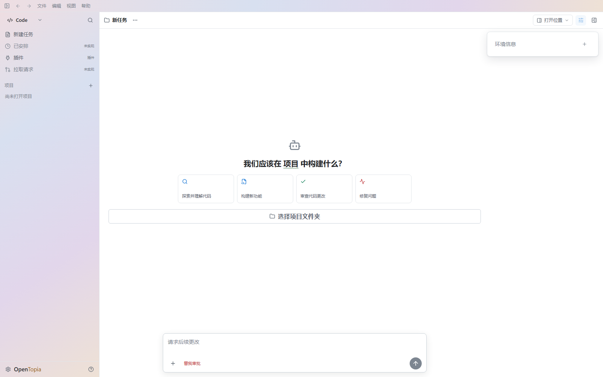
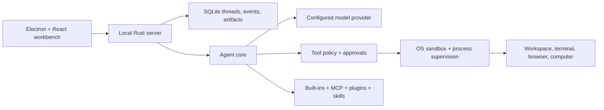

# OpenTopia

<div align="center">
  <p><strong>A local-first desktop workbench for AI-assisted coding and long-running work.</strong></p>
  <p>
    Keep the repository, terminal, review surface, approvals, and execution policy
    in one inspectable workspace.
  </p>
  <p>
    <a href="#quick-start"><strong>Run from source</strong></a>
    &nbsp;&middot;&nbsp;
    <a href="docs/architecture-detailed.md">Architecture</a>
    &nbsp;&middot;&nbsp;
    <a href="docs/implementation-backlog.md">Roadmap</a>
    &nbsp;&middot;&nbsp;
    <a href="https://github.com/StagoMax/OpenTopia/issues">Issues</a>
  </p>
  <p>
    
    
    <a href="LICENSE"></a>
  </p>
</div>

<picture>
  <source media="(prefers-color-scheme: dark)" srcset="docs/assets/opentopia-workbench-dark.png">
  
</picture>

<p align="center"><sub>Actual OpenTopia workbench in light and dark appearance.</sub></p>

## Why OpenTopia

OpenTopia is built for work that goes beyond a single chat response:

- **One workbench, not a pile of tabs.** Agent conversation, repository files,
  Git changes, previews, terminal sessions, and review controls share the same
  desktop context.
- **Execution stays explicit.** Dangerous actions can require approval, tool
  access can be narrowed, and commands run through an operating-system sandbox
  instead of relying on prompt instructions alone.
- **Long-running work remains recoverable.** Threads, events, terminal history,
  artifacts, and context summaries are persisted locally in SQLite.

> [!IMPORTANT]
> **Local-first is not the same as offline.** Workspace state and execution live
> on your machine. When you configure a remote model provider, the prompts and
> context required for that request are sent to the provider you selected.

## What is working today

| Area | Current capability |
| --- | --- |
| Desktop workbench | Electron + React workspace with task history, repository navigation, previews, Git diff review, and an integrated PTY terminal |
| Agent runtime | Rust agent core with bounded tool loops, persisted event replay, context compaction, plan mode, and multi-agent orchestration |
| Controlled execution | Read-only, workspace-write, and unrestricted sandbox modes; approval policies; process-tree cleanup; and tool allowlists |
| Provider choice | OpenAI Responses, OpenAI-compatible Chat Completions, Anthropic Messages, and a deterministic mock provider for local development |
| Extensibility | Built-in tools plus MCP servers, skills, plugins, agent profiles, and capability projection per thread |
| Artifacts and interaction | Text, code, image, PDF, and spreadsheet previews; browser automation; and Windows computer-use support |

## Quick start

OpenTopia is currently a **developer preview**. The most reliable way to try it
is to run the desktop app from source on Windows.

### Prerequisites

- Rust stable toolchain
- Node.js 22 or newer
- pnpm 10 or newer

### Run the desktop app

```powershell
git clone https://github.com/StagoMax/OpenTopia.git
cd OpenTopia
pnpm install
pnpm dev:desktop
```

The Electron development shell starts the local Rust server automatically. On
first launch, select a workspace and use the built-in mock provider, or open
the model and API settings to add and test your own provider endpoint.

If PowerShell blocks the `pnpm` script shim, use `pnpm.cmd` instead:

```powershell
pnpm.cmd install
pnpm.cmd dev:desktop
```

### Connect a Library retrieval provider

The Flow-mode **Library** surface can switch between SAG and Graph RAG through
one provider contract in the local OpenTopia server. The desktop app starts or
reuses only the provider selected in Library:

```powershell
# Optional explicit source project for development
$env:OPENTOPIA_SAG_PROJECT_ROOT="J:\path\to\sag-project"

# Or connect to an externally managed service
$env:OPENTOPIA_SAG_URL="http://127.0.0.1:8765"

# Graph RAG supports the same two options
$env:OPENTOPIA_GRAPH_RAG_PROJECT_ROOT="J:\path\to\graph-rag-project"
$env:OPENTOPIA_GRAPH_RAG_URL="http://127.0.0.1:8000"
pnpm dev:desktop
```

During development, adjacent projects are discovered from the
`enterprise-sag-panel` or `enterprise-graph-rag-panel` entry in
`pyproject.toml`, so directory names are not part of the integration contract.
A packaged build can instead provide `OPENTOPIA_SAG_EXECUTABLE` /
`OPENTOPIA_GRAPH_RAG_EXECUTABLE`, or ship the corresponding executable under
`resources/sag/` / `resources/graph-rag/`. Remote endpoints are never launched
by OpenTopia.

For a non-development Graph RAG service, set `OPENTOPIA_GRAPH_RAG_TOKEN` to a
service identity token. The local development handshake otherwise requests a
short-lived token using `OPENTOPIA_GRAPH_RAG_ROLES` and
`OPENTOPIA_GRAPH_RAG_TENANT`.

This integration is review-only: it manages sources and builds draft Context
Packs, but does not inject them into prompts or change the Agent Loop.

## Architecture at a glance



The desktop renderer never receives stored provider secrets. Electron stores an
optional key through `safeStorage` and injects it only into the local server
process when needed. See the [detailed architecture](docs/architecture-detailed.md),
[sandbox design](docs/mcp-sandbox-implementation-plan.md), and
[evaluation system](docs/evaluation-system.md) for the engineering details.

## Project status

OpenTopia is under active development and is not yet a stable end-user release.

- The current preview is Windows-first.
- A Windows installer can be built locally, but official signed binaries have
  not been published yet.
- Configuration, database, plugin, and internal API formats may still change.
- Use a disposable workspace or version control while evaluating high-risk
  automation.

The implementation backlog and release gaps are tracked in
[`docs/implementation-backlog.md`](docs/implementation-backlog.md). Source
adaptations and upstream influences are documented explicitly in
[`docs/source-adaptation-map.md`](docs/source-adaptation-map.md).

## Development

### Repository layout

```text
apps/desktop/                 Electron + React desktop workbench
crates/opentopia-core/        Agent runtime, tools, policy, and persistence
crates/opentopia-server/      Local HTTP and event-stream server
crates/opentopia-cli/         Command-line entry point
crates/opentopia-windows-sandbox/
                              Windows sandbox helper
evaluation/                   Evaluation runner, suites, and result schemas
scripts/                      Development, packaging, and verification commands
docs/                         Architecture notes and implementation decisions
```

### Useful commands

```powershell
# Prepare pinned rg and Git tools once (dev startup and release builds also do this)
pnpm runtime:agent-tools

# Start the desktop development environment
pnpm dev:desktop

# Start only the local Rust server
cargo run -p opentopia-server

# Run the repository checks
pnpm check

# Build a Windows installer
.\scripts\build-desktop.ps1
```

For an explicit model configuration, set the provider variables before starting
the app:

```powershell
$env:OPENTOPIA_API_KEY="sk-..."
$env:OPENTOPIA_OPENAI_BASE_URL="https://api.openai.com/v1"
$env:OPENTOPIA_MODEL="your-model"
pnpm dev:desktop
```

Do not commit API keys, signing identities, or provider credentials. Additional
development and release commands are documented next to the relevant subsystem
under [`docs/`](docs/).

## Engineering documentation

- [Detailed architecture](docs/architecture-detailed.md)
- [Current agent-loop architecture](docs/agent-loop-architecture-current.md)
- [Context compaction design](docs/context-compaction-design.md)
- [Browser and computer-use design](docs/browser-computer-use-technical-design.md)
- [Evaluation system](docs/evaluation-system.md)
- [Harness and plugin boundary](docs/harness-plugin-boundary-design-zh-cn.md)
- [Source adaptation map](docs/source-adaptation-map.md)

## Contributing

Issues and pull requests are welcome. Because the project is still pre-release,
please open an issue before starting a large architectural change. Keep changes
scoped, include proportional tests, and preserve the sandbox and approval
boundaries described in the architecture documentation.

## License

OpenTopia is available under the [MIT License](LICENSE).
