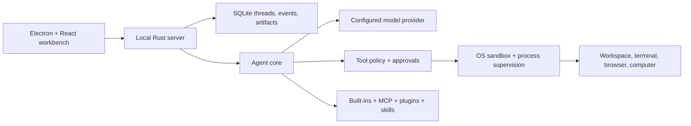

# OpenTopia

<div align="center">
  <p><strong>A local-first desktop workbench for AI-assisted coding and long-running work.</strong></p>
  <p>
    Let agents inspect a repository, run tools, review changes, and continue complex work<br>
    without hiding execution or workspace state behind a chat box.
  </p>
  <p>
    <a href="README.md">English</a>
    &nbsp;|&nbsp;
    <a href="README.zh-CN.md">简体中文</a>
  </p>
  <p>
    <a href="https://github.com/StagoMax/OpenTopia/actions/workflows/ci.yml"></a>
    
    
    <a href="LICENSE"></a>
  </p>
  <p>
    <a href="#quick-start"><strong>Quick start</strong></a>
    &nbsp;&middot;&nbsp;
    <a href="#demo-video">Demo video</a>
    &nbsp;&middot;&nbsp;
    <a href="#highlights">Highlights</a>
    &nbsp;&middot;&nbsp;
    <a href="#architecture">Architecture</a>
    &nbsp;&middot;&nbsp;
    <a href="docs/README.md">Documentation</a>
    &nbsp;&middot;&nbsp;
    <a href="CONTRIBUTING.md">Contributing</a>
  </p>
</div>

<picture>
  <source media="(prefers-color-scheme: dark)" srcset="docs/assets/opentopia-workbench-dark.png">
  
</picture>

<p align="center"><sub>The OpenTopia desktop workbench in light and dark appearance.</sub></p>

OpenTopia is for developers and technical teams who want an AI work agent that
can operate inside a real workspace while remaining observable and controllable.
The repository, terminal, review surface, approvals, execution policy, and task
history live in one desktop application.

> [!IMPORTANT]
> OpenTopia is an active **developer preview**, not a stable end-user release.
> It is currently Windows-first, has no official signed binaries, and may change
> configuration or storage formats between revisions.

## Demo video

Watch a local OpenTopia agent process **1,166 order records** in a real Excel
workflow:

**[▶ Watch the OpenTopia project demo on Bilibili](https://www.bilibili.com/video/BV1r3tn6YEwk/)**

## Highlights

| | Capability |
| --- | --- |
| **Unified workbench** | Agent conversation, repository files, Git changes, previews, terminal sessions, and review controls share the same desktop context. |
| **Inspectable execution** | Tool calls, approvals, sandbox policy, and command output remain visible instead of being hidden behind a chat response. |
| **Durable long-running work** | Threads, events, terminal history, artifacts, plans, and context summaries are persisted locally in SQLite. |
| **Provider choice** | OpenAI Responses, OpenAI-compatible Chat Completions, Anthropic Messages, and a deterministic mock provider for local development. |
| **Extensible runtime** | Built-in tools, MCP servers, skills, plugins, agent profiles, and capability projection per task. |
| **Rich interaction** | Text, code, image, PDF, and spreadsheet previews, plus browser automation and Windows computer-use support. |

### Local-first, not cloud-blind

Workspace state and execution stay on your machine. If you configure a remote
model provider, OpenTopia sends that provider the prompts and context required
for the request. Provider secrets are kept out of the desktop renderer and are
injected only into the local server process when needed.

## Quick start

The most reliable way to try OpenTopia today is to run the desktop app from
source on Windows.

### Prerequisites

- [Rust](https://www.rust-lang.org/tools/install) stable toolchain
- [Node.js](https://nodejs.org/) 22 or newer
- [pnpm](https://pnpm.io/installation) 10 or newer
- Git

### Run the desktop app

```powershell
git clone https://github.com/StagoMax/OpenTopia.git
cd OpenTopia
pnpm install
pnpm dev:desktop
```

The Electron development shell starts the local Rust server automatically.
On first launch:

1. Select a workspace directory.
2. Start with the built-in mock provider, or open model settings to configure a
   provider endpoint and API key.
3. Create a task and review requested approvals before allowing tool execution.

If PowerShell blocks the `pnpm` script shim, use `pnpm.cmd` instead:

```powershell
pnpm.cmd install
pnpm.cmd dev:desktop
```

For provider variables and optional Library integrations, see the
[configuration example](.env.example) and
[Library retrieval provider guide](docs/library-retrieval-providers.md).

## Architecture



The renderer is deliberately separated from provider credentials and local
execution. The Rust core owns the agent loop, durable events, policy decisions,
tool dispatch, and context management; the desktop app is the interaction and
review surface.

Start with the [documentation index](docs/README.md), then use the
[detailed architecture](docs/architecture-detailed.md),
[runtime boundaries](docs/agent-runtime-boundaries.md), and
[evaluation system](docs/evaluation-system.md) for deeper engineering context.

## Project status

OpenTopia is under active development.

- The current preview is Windows-first.
- A Windows installer can be built locally, but official signed binaries have
  not been published yet.
- Configuration, database, plugin, and internal API formats may still change.
- Use a disposable workspace or version control while evaluating high-risk
  automation.
- Issues and pull requests are welcome; large changes should start with an
  issue so the design can be discussed first.

The [implementation backlog](docs/implementation-backlog.md) tracks release
gaps. Upstream influences and source adaptations are documented in the
[source adaptation map](docs/source-adaptation-map.md).

## Development

### Repository layout

```text
apps/desktop/                 Electron + React desktop workbench
crates/opentopia-core/        Agent runtime, tools, policy, and persistence
crates/opentopia-server/      Local HTTP and event-stream server
crates/opentopia-cli/         Command-line entry point
crates/opentopia-windows-sandbox/
                              Windows sandbox helper
evaluation/                   Evaluation runner, suites, and result schemas
scripts/                      Development, packaging, and verification commands
docs/                         Architecture, design, and operating documentation
```

### Useful commands

```powershell
# Start the desktop development environment
pnpm dev:desktop

# Start only the local Rust server
pnpm dev:server

# Run the full repository verification suite
pnpm check

# Build a Windows installer
.\scripts\build-desktop.ps1
```

See [CONTRIBUTING.md](CONTRIBUTING.md) for the development workflow, focused
validation commands, UI conventions, and pull request checklist.

## Documentation

- [Documentation index](docs/README.md)
- [Detailed architecture](docs/architecture-detailed.md)
- [Current agent-loop architecture](docs/agent-loop-architecture-current.md)
- [Context compaction design](docs/context-compaction-design.md)
- [Browser and computer-use design](docs/browser-computer-use-technical-design.md)
- [Evaluation system](docs/evaluation-system.md)
- [Security policy](SECURITY.md)

## Contributing

Contributions are welcome. Read the [contributing guide](CONTRIBUTING.md) and
[Code of Conduct](CODE_OF_CONDUCT.md) before opening a pull request. Please use
the issue templates for reproducible bug reports and focused feature proposals.

For a security vulnerability, do **not** open a public issue. Follow the
[security policy](SECURITY.md) instead.

## License

OpenTopia is available under the [MIT License](LICENSE).
