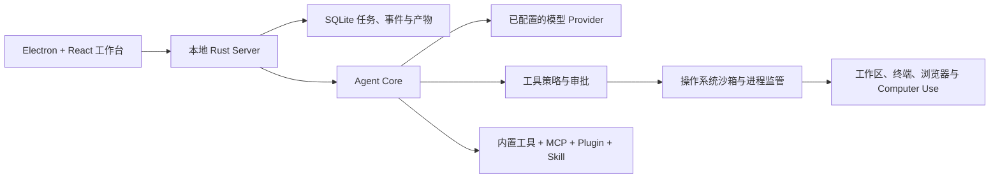

# OpenTopia

<div align="center">
  <p><strong>面向 AI 辅助编程与长时任务的本地优先桌面工作台。</strong></p>
  <p>
    让 Agent 在可检查、可审批、可追溯的真实工作区中读取仓库、运行工具、<br>
    审查改动并持续完成复杂工作，而不只是停留在聊天框里。
  </p>
  <p>
    <a href="README.md">English</a>
    &nbsp;|&nbsp;
    <a href="README.zh-CN.md">简体中文</a>
  </p>
  <p>
    <a href="https://github.com/StagoMax/OpenTopia/actions/workflows/ci.yml"></a>
    
    
    <a href="LICENSE"></a>
  </p>
  <p>
    <a href="#快速开始"><strong>快速开始</strong></a>
    &nbsp;&middot;&nbsp;
    <a href="#演示视频">演示视频</a>
    &nbsp;&middot;&nbsp;
    <a href="#核心能力">核心能力</a>
    &nbsp;&middot;&nbsp;
    <a href="#架构">架构</a>
    &nbsp;&middot;&nbsp;
    <a href="docs/README.md">工程文档</a>
    &nbsp;&middot;&nbsp;
    <a href="CONTRIBUTING.md">参与贡献</a>
  </p>
</div>

<picture>
  <source media="(prefers-color-scheme: dark)" srcset="docs/assets/opentopia-workbench-dark.png">
  
</picture>

<p align="center"><sub>OpenTopia 桌面工作台的浅色与深色外观。</sub></p>

OpenTopia 面向希望 AI Work Agent 能够在真实工作区中执行任务，同时又保持
过程透明、权限可控的开发者和技术团队。仓库、终端、代码审查、审批策略、
执行权限和任务历史统一在一个桌面应用中。

> [!IMPORTANT]
> OpenTopia 目前是持续开发中的**开发者预览版**，还不是稳定的最终用户产品。
> 当前优先支持 Windows，尚未发布官方签名安装包，不同版本间的配置和存储
> 格式也可能发生变化。

## 演示视频

观看 OpenTopia 的本地 AI Agent 在真实 Excel 工作流中自动处理 **1,166 条订单数据**：

**[▶ 在哔哩哔哩观看 OpenTopia 项目演示](https://www.bilibili.com/video/BV1r3tn6YEwk/)**

## 核心能力

| | 能力 |
| --- | --- |
| **统一工作台** | Agent 对话、仓库文件、Git 改动、内容预览、终端会话和审查控制共享同一个桌面上下文。 |
| **可检查的执行过程** | 工具调用、审批、沙箱策略和命令输出保持可见，而不是隐藏在一段聊天回复背后。 |
| **可恢复的长时任务** | 任务、事件、终端历史、产物、计划和上下文摘要持久化到本地 SQLite。 |
| **多模型提供商** | 支持 OpenAI Responses、OpenAI-compatible Chat Completions、Anthropic Messages，以及用于本地开发的确定性 Mock Provider。 |
| **可扩展运行时** | 支持内置工具、MCP Server、Skill、Plugin、Agent Profile，以及按任务投影能力。 |
| **丰富的交互能力** | 支持文本、代码、图片、PDF 和表格预览，以及浏览器自动化和 Windows Computer Use。 |

### 本地优先不等于完全离线

工作区状态和工具执行保留在你的机器上。配置远程模型提供商后，OpenTopia
会向该提供商发送完成请求所需的提示词和上下文。模型密钥不会进入桌面渲染
进程，只会在需要时注入本地 Server 进程。

## 快速开始

目前体验 OpenTopia 最可靠的方式是在 Windows 上从源码运行桌面应用。

### 环境要求

- [Rust](https://www.rust-lang.org/tools/install) stable toolchain
- [Node.js](https://nodejs.org/) 22 或更高版本
- [pnpm](https://pnpm.io/installation) 10 或更高版本
- Git

### 运行桌面应用

```powershell
git clone https://github.com/StagoMax/OpenTopia.git
cd OpenTopia
pnpm install
pnpm dev:desktop
```

Electron 开发壳会自动启动本地 Rust Server。首次运行时：

1. 选择一个工作区目录。
2. 先使用内置 Mock Provider，或进入模型设置配置 Provider Endpoint 和 API Key。
3. 创建任务，并在允许工具执行前检查 Agent 发起的审批请求。

如果 PowerShell 阻止执行 `pnpm` 脚本入口，可以改用 `pnpm.cmd`：

```powershell
pnpm.cmd install
pnpm.cmd dev:desktop
```

模型变量和可选 Library 集成请查看[配置示例](.env.example)与
[Library 检索 Provider 指南](docs/library-retrieval-providers.md)。

## 架构



桌面渲染进程与模型凭据、本地执行之间有清晰边界。Rust Core 负责任务循环、
持久化事件、策略决策、工具调度和上下文管理；桌面应用负责交互与审查。

建议从[文档索引](docs/README.md)开始，再根据需要阅读
[详细架构](docs/architecture-detailed.md)、
[运行时边界](docs/agent-runtime-boundaries.md)和
[评测系统](docs/evaluation-system.md)。

## 项目状态

OpenTopia 正在积极开发中。

- 当前预览版优先支持 Windows。
- 已支持本地构建 Windows 安装包，但尚未发布官方签名版本。
- 配置、数据库、Plugin 和内部 API 格式仍可能变化。
- 评估高风险自动化时，请使用临时工作区或通过版本控制保护文件。
- 欢迎提交 Issue 和 Pull Request；大型改动请先通过 Issue 讨论设计。

[实现 Backlog](docs/implementation-backlog.md)记录了发布前仍需补齐的能力。
上游影响和源码适配记录在[源码适配说明](docs/source-adaptation-map.md)中。

## 开发

### 仓库结构

```text
apps/desktop/                 Electron + React 桌面工作台
crates/opentopia-core/        Agent 运行时、工具、策略与持久化
crates/opentopia-server/      本地 HTTP 与事件流 Server
crates/opentopia-cli/         命令行入口
crates/opentopia-windows-sandbox/
                              Windows 沙箱辅助进程
evaluation/                   评测 Runner、Suite 与结果 Schema
scripts/                      开发、打包和验证脚本
docs/                         架构、设计与运行文档
```

### 常用命令

```powershell
# 启动桌面开发环境
pnpm dev:desktop

# 只启动本地 Rust Server
pnpm dev:server

# 运行完整仓库检查
pnpm check

# 构建 Windows 安装包
.\scripts\build-desktop.ps1
```

开发流程、针对性验证命令、桌面 UI 规范和 PR 检查清单请见
[CONTRIBUTING.md](CONTRIBUTING.md)。

## 工程文档

- [文档索引](docs/README.md)
- [详细架构](docs/architecture-detailed.md)
- [当前 Agent Loop 架构](docs/agent-loop-architecture-current.md)
- [上下文压缩设计](docs/context-compaction-design.md)
- [Browser 与 Computer Use 设计](docs/browser-computer-use-technical-design.md)
- [评测系统](docs/evaluation-system.md)
- [安全策略](SECURITY.md)

## 参与贡献

欢迎参与贡献。提交 Pull Request 前请阅读[贡献指南](CONTRIBUTING.md)和
[行为准则](CODE_OF_CONDUCT.md)，并使用 Issue 模板提交可复现的问题或聚焦的
功能建议。

如果发现安全漏洞，请**不要**创建公开 Issue，请按照[安全策略](SECURITY.md)
进行报告。

## 许可证

OpenTopia 使用 [MIT License](LICENSE)。
