# OpenTopia AgentCore 当前架构详解

> 基于当前 `crates/opentopia-core/src/agent.rs` 及其直接依赖重新梳理，更新时间：2026-08-14。
> 本文解释 AgentCore（智能体核心）的内部结构、状态机、模块关系和设计边界，不是公开接口清单。
> Tool Runtime（工具运行时）继续保持为 Black Box（黑盒），只描述 AgentCore 如何调度它。

针对本轮问题，可直接按以下顺序阅读：Provider Cursor（提供商游标）见 10.1；Finalization Guard（收尾守卫）见第 9 节；Pending Queue（待执行队列）、Round Boundary（模型轮边界）和 Checkpoint（检查点）见 4.1–4.3；共同结尾点见第 3 节与 10.2；`continue_provider_turn`见第 4 节；Planning Tools（规划工具）见 5.3；Step Reminders（步骤提醒）见第 6 节；结构化用户输入的暂停与恢复见 7.3。

## 1. AgentCore 到底是什么

`AgentCore（智能体核心）`是 **单个 Agent Turn（智能体轮次）内的可恢复编排内核**。

它不是：

- 大而全的应用服务；
- Prompt 字符串拼接器；
- 工具实现集合；
- 负责判断任务语义的第二个模型；
- 数据库或客户端状态的所有者。

它真正解决的问题是：

> 在不依赖某家模型协议的前提下，把“上下文 → 模型决策 → 受控行动 → 结果观察 → 下一轮决策 → 客观收尾检查”组织成一个可以暂停、序列化并从原位置恢复的确定性控制循环。

AgentCore 的核心价值不是某一个函数，而是以下四种职责同时成立：

1. **Loop orchestration（循环编排）**：推进模型轮和行动轮；
2. **Boundary enforcement（边界执行）**：让行动和完成都必须经过对应守卫；
3. **State continuity（状态连续性）**：暂停、恢复和长轮次不会丢失控制状态；
4. **Observation delivery（观察交付）**：把运行时事实送给主模型，但不替主模型解释事实。

## 2. AgentCore 的内部组成

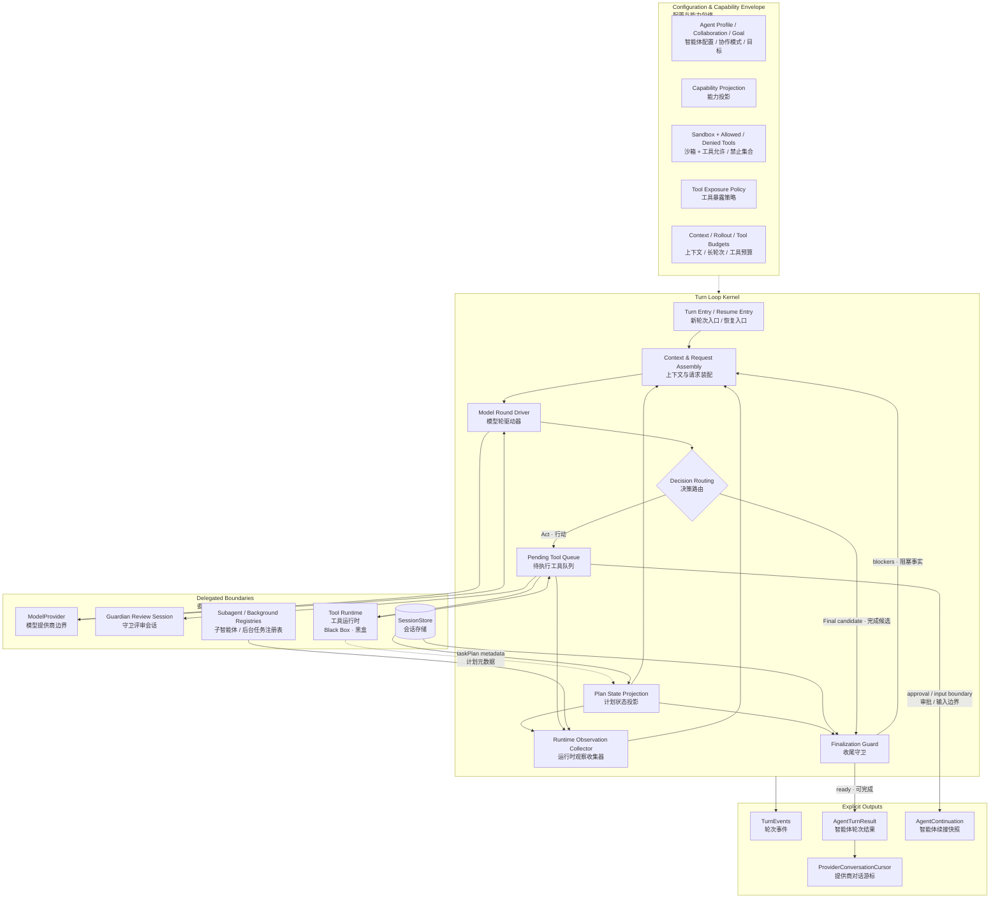

### 2.1 配置面与轮次状态不是一回事

`AgentCore` 实例长期持有的是能力和依赖配置，例如：

- `ModelProvider（模型提供商）`与独立 Guardian Provider；
- `ToolRegistry（工具注册表）`和 MCP Host；
- Sandbox、Capability Projection、allowed / denied tools；
- Browser / Computer Runtime（浏览器 / 计算机运行时）；
- Subagent Scheduler（子智能体调度器）和 Background Registry（后台任务注册表）；
- Agent Profile、Collaboration Mode、Experience Mode、Goal；
- Tool Exposure Policy 与各类预算设置。

而每个 Turn 的动态状态由局部变量和 `AgentContinuation` 携带，例如模型轮数、待执行队列、调用结果、运行时提醒游标和 Provider Items。这样 AgentCore 可以被配置后复用，但不同 Turn 不共享本轮的可变控制状态。

### 2.2 能力限制只能收窄

`restrict_to_tools（限制工具）`和 `restrict_capabilities（限制能力）`都使用交集语义。一个 Agent Profile（智能体配置）或委派上下文可以继续移除权限，但不能把上游已经删除的能力重新加回来。

这使依赖方向保持为：

> 上游授予最大包络 → AgentCore 逐层收窄 → 精确调用再次接受运行时策略检查。

工具是否出现在模型目录中，与工具执行时是否仍被允许，是两层检查；仅隐藏 Schema（模式定义）不能代替执行边界。

## 3. Turn 的完整状态机：新轮次、持续循环与恢复入口

```mermaid
stateDiagram-v2
    state "New-turn Entry<br/>新轮次入口<br/>run_turn_detailed_streaming_with_context" as NewEntry
    state "Approval-resume Entry<br/>审批恢复入口<br/>resume_turn_streaming" as ApprovalResume
    state "Input-resume Entry<br/>输入恢复入口<br/>resume_turn_with_user_input_streaming" as InputResume
    state "Validate Scope & Initialize<br/>验证作用域并初始化" as Initialize
    state "Compile Context & Validate Cursor<br/>编译上下文并验证提供商游标" as Compile
    state "Collect Opening Reminders<br/>收集开场提醒" as OpeningReminders
    state "First Model Round<br/>首个模型轮" as FirstModel
    state "Classify Model Decision<br/>分类模型决策" as FirstDecision
    state "continue_provider_turn<br/>持续提供商轮次循环" as ContinueProvider
    state "Finalization Guard<br/>收尾守卫" as FinalGuard
    state "Classify Terminal Outcome<br/>分类轮次终态" as OutcomeClassify
    state "Completed<br/>已完成" as Completed
    state "Partial<br/>部分完成" as Partial
    state "Blocked<br/>被阻塞" as Blocked
    state "Stopped<br/>已停止" as Stopped
    state "Suspended<br/>暂停并等待审批" as Suspended
    state "Awaiting Input<br/>等待用户输入" as AwaitingInput
    state "Waiting User Action<br/>等待用户操作" as WaitingUserAction
    state "Failed<br/>失败" as Failed
    state "Return to Server<br/>返回服务端<br/>本次 AgentCore 调用结束" as ReturnToServer

    [*] --> NewEntry: new Turn / 新轮次
    [*] --> ApprovalResume: approval response / 审批结果
    [*] --> InputResume: structured user answer / 结构化用户回答

    NewEntry --> Initialize
    Initialize --> Failed: scope rejected / 作用域被拒绝
    Initialize --> Compile: scope accepted / 作用域通过
    Compile --> OpeningReminders: compatible cursor or local rebuild / 兼容游标或本地重建
    OpeningReminders --> FirstModel: build first request / 构建首个请求
    FirstModel --> FirstDecision: normalized response / 规范化响应
    FirstDecision --> Failed: Incomplete / 不完整
    FirstDecision --> ContinueProvider: Act; create pending queue / 行动；生成待执行队列
    FirstDecision --> FinalGuard: Final candidate / 完成候选

    ApprovalResume --> ContinueProvider: apply exact approval decision / 应用精确审批决定
    InputResume --> ContinueProvider: patch matching waiting result / 原位改写匹配的等待结果

    ContinueProvider --> ContinueProvider: execute calls, reach round boundary, run next model round / 执行调用、到达轮边界、运行下一模型轮
    ContinueProvider --> FinalGuard: later Final candidate / 后续完成候选
    FinalGuard --> ContinueProvider: inject synthetic blocker result / 注入合成阻塞结果
    FinalGuard --> OutcomeClassify: no unresolved readiness blocker / 无未解决的收尾就绪阻塞
    FinalGuard --> Failed: unresolved after 3 interventions / 干预 3 次后仍未解决

    OutcomeClassify --> Completed: no terminal incompleteness / 无终态未完成事实
    OutcomeClassify --> Partial: deferred, cancelled, or remaining work / 延后、取消或仍有工作
    OutcomeClassify --> Blocked: blocked plan step / 存在被阻塞计划步骤

    ContinueProvider --> Suspended: approval boundary / 审批边界
    ContinueProvider --> AwaitingInput: structured input boundary / 结构化输入边界
    ContinueProvider --> WaitingUserAction: external handoff boundary / 外部接管边界
    ContinueProvider --> Stopped: 270-round hard limit / 270 轮硬上限
    ContinueProvider --> Failed: incomplete, exhausted budget, or unrecoverable error / 不完整、预算耗尽或不可恢复错误

    Completed --> ReturnToServer
    Partial --> ReturnToServer
    Blocked --> ReturnToServer
    Stopped --> ReturnToServer
    Suspended --> ReturnToServer
    AwaitingInput --> ReturnToServer
    WaitingUserAction --> ReturnToServer
    Failed --> ReturnToServer
    ReturnToServer --> [*]
```

这张图把以前缺失的 `continue_provider_turn（持续提供商轮次循环）`放在了真正的位置：

- 新 Turn 的首个模型响应为 `Act（行动）`时，创建待执行队列后进入它；
- 首个模型响应为 `Final（完成候选）`但收尾守卫发现阻塞时，注入合成结果后也进入它；
- 审批恢复和用户输入恢复不走新 Turn 入口，而是直接回到它；
- 它内部既处理工具行动，也负责在队列清空后启动下一模型轮，直到出现完成候选或边界结果。

图中的 `Return to Server（返回服务端）`只是“这一次 AgentCore 函数调用已经返回”，不是“所有情况都算 Completed（已完成）”。`Completed / Partial / Blocked` 是不同的业务终态；`Suspended / Awaiting Input` 则是可恢复边界。它们都会结束当前函数调用，所以汇入同一个返回点。

### 3.1 入口阶段真正做了什么

`run_turn_detailed_streaming_with_context（带上下文运行流式轮次）`先验证 workspace root（工作区根目录）仍在 `CapabilityProjection（能力投影）`内，然后建立：

- `TurnEvents（轮次事件收集器）`；
- `ContextBudget（上下文预算）`；
- `RolloutBudget（长轮次共享预算）`；
- `TurnRuntimeState（轮次运行时状态）`。

之后，它补充执行谱系、工具搜索模块，计算 Prompt Cache Lineage Key（提示缓存谱系键）和 Provider Compatibility Hash（提供商兼容性哈希）。Provider Cursor 只有哈希兼容时才能使用；不兼容时会发出失效事件，并从本地检查点和历史重建请求。

首个模型轮之前也会收集 opening reminders（开场提醒）。这是为了让上个 Turn 遗留的后台任务或已完成子智能体在本轮第一轮就可见，而不是等到第二个模型轮。

### 3.2 模型响应为什么必须分类

AgentCore 不直接用 `finish_reason（结束原因）`判断接下来做什么，而是让统一的 `ModelResponse::decision` 产生三种语义明确的结果：

- `Incomplete（不完整）`：不能完成 Turn，直接成为错误；
- `Act（行动）`：把模型工具调用装入 Pending Tool Queue；
- `Final（完成候选）`：进入 Finalization Guard，而不是立即写最终消息。

这一层把 Provider 线协议与 Agent 状态机解耦：不同 Provider 如何表示调用、文本和结束原因，由 Adapter 归一化；AgentCore 只理解统一决策。

### 3.3 Turn、Model Round、Action Batch 和 Invocation 的区别

这四个词处于不同层级，混在一起会让状态机看起来矛盾：

| English term | 中文解释 | 在当前架构中的边界 |
|---|---|---|
| `Thread` | 任务 / 会话线程 | 多个用户消息与多个 Turn 的持久容器 |
| `Turn` | 智能体轮次 | 围绕一条用户请求推进到 Completed、Partial、Blocked、Stopped，或进入可恢复边界的逻辑工作单元 |
| `Model Round` | 模型轮 | 一次 `complete_model`：构建一个 ModelRequest 并得到一个规范化 ModelResponse |
| `Action Batch` | 行动批次 | 单个 `Act`响应产生的一组 Tool Calls；Pending Queue 清空表示本批次结束 |
| `AgentCore Invocation` | AgentCore 函数调用 | 从新轮次或恢复入口开始，到本次返回 AgentTurnResult / error 为止 |

一个 Turn 可以包含许多个 Model Round 和 Action Batch；如果遇到审批或结构化用户输入，同一个 Turn 还会跨越多个 AgentCore Invocation。`Return to Server（返回服务端）`结束的是 Invocation，不一定结束逻辑 Turn。

## 4. continue_provider_turn：真正的循环核心

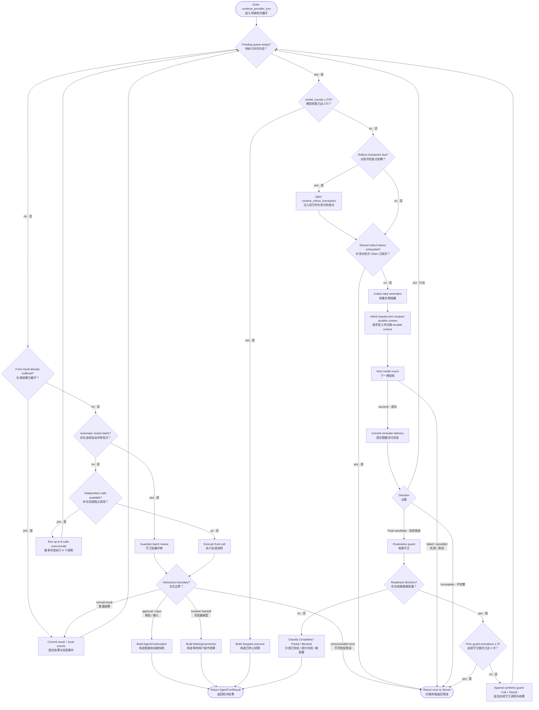

### 4.1 Pending Tool Queue 是循环的行动时钟

模型一次可以返回多个调用。AgentCore 会把它们保存为按模型原序排列的 `pending_tool_calls（待执行工具调用）`。只要队列不空，AgentCore 就不会启动下一模型轮。

队列只在 `ModelDecision::Act（模型行动决策）`出现时生成：首个模型响应和后续模型响应都走同一规则。AgentCore 同时做两份记录：

- 把调用追加到 `provider_tool_calls（提供商工具调用账本）`，用于之后重建完整模型上下文；
- 把本批调用赋给 `pending_tool_calls（待执行工具调用）`，作为尚未提交结果的工作队列。

所谓“已清空”不是把历史删除，而是每个队首调用都已经得到一个可提交的结果，并按模型原序从 Pending Queue 移入 Call / Result Ledger（调用 / 结果账本）。并发调用即使提前完成，也只先进入缓冲区；轮到它成为队首并提交后才会从待执行队列移除。

这个设计保证：

- 同一模型响应产生的所有调用形成一个明确行动批次；
- 交互边界可以冻结“执行到哪里、还剩什么”；
- 下一模型轮总能看到这一批已经确定顺序的 Call / Result 对。

### 4.2 Reach Round Boundary 是什么，为什么清空后还能继续

`Reach Round Boundary（到达模型轮边界）`不是一个持久业务状态，而是外层循环中的安全检查点：

> 上一次模型决策产生的全部行动，都已经转化为按序观察；现在可以让模型基于这些观察重新决策。

它的优势是把一轮模型决策变成明确的“行动批次事务”：旧批次没有处理完时不会启动新模型轮，因此不会出现模型一边继续决策、前一批工具还在改变事实的竞态。队列清空后，调用与结果仍在账本中，`build_model_request（构建模型请求）`会把它们带给下一模型轮，所以循环当然可以正常继续。

到达边界后的准确顺序是：

1. 判断主模型轮数是否达到 270；是则返回 `Stopped（已停止）`；
2. 判断第 90 / 180 轮检查点是否到期；是则追加一对合成 Call / Result；
3. 判断共享 Rollout Token Budget（长轮次 Token 预算）是否耗尽；是则返回错误；
4. 收集步骤提醒，并让完整请求经过统一的 context pressure admission；Round 0 也经过同一边界；
5. 调用下一模型轮；成功返回后才提交提醒交付状态；
6. 新决策若为 `Act`，生成下一批待执行队列；若为 `Final`，进入收尾守卫。

旧图中的 `continue（继续）`不是一个第三种判断值。它只是“硬轮数判断为 No（否），并且 Token 耗尽判断也为 No（否）”后的自然路径；新版图已经拆成两个明确的 Yes / No 节点。

### 4.3 Rollout Checkpoint 到期时到底注入什么

第 90 和 180 个已完成主模型轮之后，AgentCore 追加 `runtime_rollout_checkpoint（运行时长轮次检查点）`合成调用及成功结果，内容只有：

- `completedModelRounds（已完成模型轮数）`；
- `maximumModelRounds（最大模型轮数）`；
- `remainingBudgetTokens（剩余预算 Token）`；
- `recordedPlan（已记录计划）`的各状态步骤计数。

它不进入 Pending Queue，也不调用另一个工具或 Reviewer（评审模型）。它只是成为下一模型请求中的一条客观观察，要求主模型自行检查原始需求、已有证据、计划和资源，再自行选择继续、换方法、完成或报告阻塞。因此注入后仍能正常进入下一模型轮。

### 4.4 并行执行与顺序提交如何同时成立

AgentCore 会分析调用声明的资源和副作用，选择互不冲突的调用并发执行，最多并发 8 个。每个并行调用使用自己的局部 `TurnEvents`，完成后先进入 `parallel_outcomes（并行结果缓冲）`。

只有当前队首调用的结果存在时，AgentCore 才把该结果和对应事件写入主历史，然后移除队首。即使后面的调用先完成，也必须等待前面的调用提交。

所以并行发生在执行层，确定性发生在提交层：

> Concurrent execution, provider-order commit（并发执行，按提供商调用顺序提交）。

### 4.5 自动审批批次为什么只能覆盖连续队首

自动评审会把连续的 approval-bound actions（受审批约束动作）合成一个 Provider batch（提供商批次），但批次必须从待执行队首开始，而且返回后会逐个核对 call ID 与位置。

原因不是接口方便，而是授权与队列位置必须一一对应：评审不能跳过前面的交互边界，也不能把某次授权扩展到未评审的兄弟调用。

### 4.6 工具错误如何进入模型

可表示为 `ProviderToolResult（提供商工具结果）`的工具错误通常不会直接终止 AgentCore。它们被规范化为带 `is_error` 和结构化 Error Record（错误记录）的结果，再送给主模型决定修正参数、换方法或解释失败。

真正中断循环的是无法形成可靠工具结果的基础错误、取消、或需要转成暂停/接管状态的交互边界。

## 5. AgentCore 的状态所有权

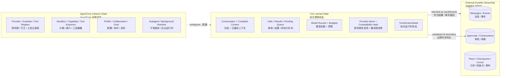

### 5.1 TurnRuntimeState 的真实含义

`TurnRuntimeState（轮次运行时状态）`只保存循环级 bookkeeping（记账信息）：

- 已经向模型报告过终局的子智能体 ID；
- 最近 12 个规范化工具调用签名；
- 上次向模型报告重复调用遥测的轮数；
- 当前批量审批覆盖的精确 call ID。

它不保存“任务是否进展顺利”这样的主观判断。相同工具调用在窗口内出现至少 3 次时，AgentCore 只向模型报告客观次数；除同一 Schema-invalid（模式无效）调用重复 3 次触发熔断外，普通重复不会被运行时直接禁止。

### 5.2 TurnEvents 为什么既收集又流式发送

`TurnEvents（轮次事件）`同时维护本地事件数组和可选的 mpsc sender（消息通道发送端）。每个事件进入 AgentCore 时可以立即被服务端消费，同时仍保留在最终 `AgentTurnResult.events` 中。

但 AgentCore 产生的只是未持久化 `AgentEventPayload（智能体事件载荷）`：它不分配数据库序号，也不保证客户端已经看到。持久化和发布顺序仍由服务端负责。

### 5.3 Planning Tools 为什么不是一个独立控制器

本节的完整独立说明见 [`planning-tools-architecture-current.md`](planning-tools-architecture-current.md)，包括工具可见模式、计划数据模型、修订冲突、步骤状态、需求覆盖、工具调用证据和收尾校验流程。

规划相关能力在代码中确实存在，但它不是 AgentCore 内部一个会“自动推进任务”的 `Planner Controller（规划控制器）`。真实关系是：主模型通过普通工具调用读写一份外部化、可验证的 `TaskPlan（任务计划）`；AgentCore 只负责把计划结果投影成事件、在后续调用中提供当前计划，并在客观边界处读取它。

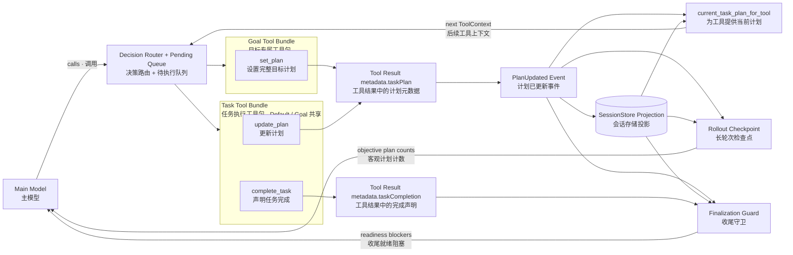

三类任务状态工具的职责不同：

- `set_plan（设置计划）`：Default / Goal 共享，创建或替换带目标、需求、步骤、依赖和验收标准的完整执行清单；运行时分别选择当前 Turn scope 或服务器 Goal scope；
- `update_plan（更新计划）`：Default / Goal 共享，用 revision（修订号）保护的增量操作创建或修改步骤、状态、需求覆盖和工具证据，并可用 `currentScopeComplete（当前范围已完成）`标记本次范围是否已经完整闭合；
- `complete_task（声明任务完成）`：Default / Goal 共享。它不修改 `TaskPlan`，而是返回 `metadata.taskCompletion`中的摘要、验证和剩余工作；其中 `remainingWork（剩余工作）`参与最终 `Completed / Partial`分类。Goal Mode 下还会额外要求计划已经没有 Pending / In Progress Step。

`set_plan / update_plan`返回的 Tool Result（工具结果）在 `metadata.taskPlan`携带新计划。AgentCore 识别该字段并产生 `PlanUpdated（计划已更新）`事件；服务端再把事件投影到持久 Goal / Plan 状态。后续工具执行前，AgentCore 会从本 Turn 最新事件或 Store（存储）读取当前计划放入 `ToolContext（工具上下文）`。

计划不是行动队列：`nextRunnableStep（下一可运行步骤）`只是建议，AgentCore 不会看见 Pending Step（待处理步骤）就自动执行某个工具。主模型仍然决定下一次工具调用。计划真正约束控制流的位置只有客观边界：

- Goal Mode（目标模式）没有计划时，收尾守卫拒绝完成；
- 非 Plan Mode（规划模式）下还有 Pending / In Progress Step（待处理 / 进行中步骤）时，收尾守卫拒绝完成；
- Requirement Coverage / Evidence（需求覆盖 / 证据）不完整或无效时，收尾守卫拒绝完成；
- 第 90 / 180 轮检查点把计划状态计数交给主模型自审。

Plan Mode 是例外：它的交付物本身可以是一份仍含待执行步骤的计划，因此收尾守卫不会用 Pending / In Progress Step 阻止它结束。这就是规划工具没有被画成通用工具执行模块内部细节、但又必须作为独立“计划状态子系统”展示的原因。

## 6. 观察、提醒与长轮次控制

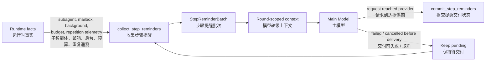

### 6.1 提醒是证据，不是控制流

AgentCore 会观察：

- 新完成的子智能体和 mailbox 消息；
- 后台命令的完成或仍在运行；
- Rollout Budget 剩余量；
- 最近工具调用的重复计数。

这些事实被包装为 Round-scope（模型轮级）的 Developer / Environment Context（开发者 / 环境上下文）或合成工具观察。它们影响模型判断，但不会直接让运行时切换任务、禁用工具或结束循环。

`collect_step_reminders（收集步骤提醒）`在两个位置执行：新 Turn 首个模型轮之前执行一次，此后每次 Pending Queue（待执行队列）清空、准备启动下一模型轮之前再执行。它按当前 Turn 的 scope（作用域）抓取五类增量事实：

1. 已终止但本 Turn 尚未报告的 descendant agents（后代智能体），以及当前 mailbox（邮箱）消息；
2. 已完成但尚未报告的 background jobs（后台任务），包括输出尾部、错误和被截断字节数；
3. Rollout Budget（长轮次预算）达到提醒阈值后产生的待交付预算提醒；
4. 最近 12 个工具调用签名中，名称和 JSON 参数相同且出现至少 3 次的重复遥测；
5. 尚未结束的子智能体或后台任务名称，作为当前仍在运行的客观状态。

普通提醒以 `Environment / Developer / Round（环境 / 开发者 / 模型轮）`上下文加入本轮请求；后台命令输出为了不改写可缓存的 Developer Prefix（开发者前缀），会被追加成一个 `runtime_background_completion（运行时后台完成）`合成 Call / Result。两者都明确标为 observation（观察），其中子智能体和后台输出还标为 untrusted（不受信任），不能升级成指令。

### 6.2 为什么提醒必须“确认交付后再提交”

`collect_step_reminders` 先产生提醒和待提交状态；只有 `complete_model` 已成功把包含这些提醒的请求送达 Provider 后，`commit_step_reminders` 才更新已报告 ID、预算提醒级别和重复遥测轮次。

提交时会分别执行：确认 mailbox 消息已交付、把后台任务标记为已报告、记录已报告子智能体 ID、标记预算提醒已送达，以及记录本次重复调用遥测的报告轮数。它采用的是 `collect → deliver → commit（收集 → 交付 → 提交）`协议，不是简单地“读过就清空”。

如果模型请求在交付前失败或被取消，这批提醒仍保持未交付，会在下次恢复时重新发送。这样不会因一次失败轮次丢掉重要外部事实。

### 6.3 Rollout Checkpoint 不是第二个 Reviewer

AgentCore 在第 90 和 180 个已完成主模型轮之后注入 `runtime_rollout_checkpoint（运行时长轮次检查点）`。它只提供：

- 当前模型轮数；
- 剩余共享 Token 预算；
- 当前计划状态。

主模型自己进行 self-review（自我审视）并决定继续或调整。运行时不会启动另一个“进度裁判模型”。第 270 轮是硬上限，到达后保留已完成工作并返回停止结果。

### 6.4 Durable context compaction 为什么仍然不具备指令权

每次 Provider 请求（包括新 Turn 的 Round 0）都先装配唯一的规范 `ModelRequest`，再用该请求的完整输入估算和生成预留计算 context pressure。默认达到 80% 时，AgentCore 把同一份请求通过 `RoundContextCompactor` 交给服务端，一次生成结构化 durable checkpoint；成功后 checkpoint 替换旧 checkpoint 与该请求中的历史 conversation，已完成且纳入请求的 Call / Result 被移除，当前用户输入和 live round state 保留。压缩后不设 65% 固定目标，而是记录请求重建前后的实际 token 与剩余比例。

Checkpoint 是 provider-neutral 的历史状态投影，不是新指令。它按阶段保存时间、问题、根因、解决方式、结果与指标；当前用户输入、未完成工具调用、竞态中尚未持久化的结果和审批边界都不会被裁剪。本地 checkpoint 建立后会清除旧 Provider 的 opaque lineage，避免把不兼容的 reasoning / compaction 状态混入新请求 epoch。

## 7. 暂停与恢复是同一个状态机

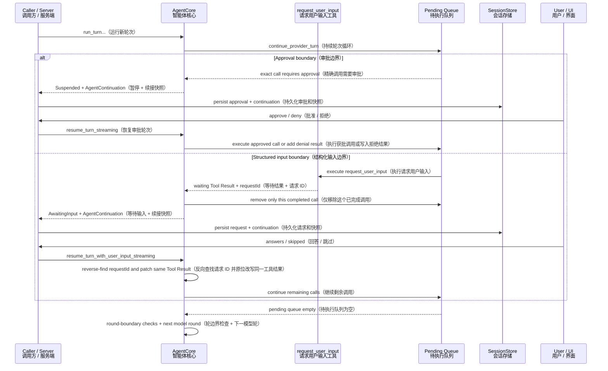

### 7.1 AgentContinuation 保存什么

Continuation 保存两类状态：

**Turn 身份与环境：**

- thread ID、user message ID、workspace root；
- context summary、conversation、permission mode；
- context / rollout budgets；
- CompiledModelContext、collaboration mode、goal。

**Provider 循环控制点：**

- 当前用户原始消息和附件；
- Tool Candidates（工具候选）；
- 所有 Provider Tool Calls 与 Results；
- Pending Tool Queue；
- 兼容旧 continuation schema 的已压缩工具历史字段（新路径保持为空）；
- Provider Response Items；
- model rounds、rollout reviews、TurnRuntimeState；
- branch instructions 与 provider compatibility hash。

因此恢复不需要重新请求模型猜测之前做到了哪里，也不会重新执行已经提交的调用。

### 7.2 审批恢复和用户输入恢复的区别

`resume_turn_streaming` 会把批准或拒绝应用到 Continuation 中记录的精确调用 ID。批量审批时还会校验 ID 和队列顺序；批准则走 scoped approved execution（限定作用域的已批准执行），拒绝则生成 User Denied Tool Result（用户拒绝工具结果）。

`resume_turn_with_user_input_streaming` 不执行新工具，而是在已有结果中反向查找匹配 request ID 的等待记录，把用户回答写成成功 Tool Result，再回到同一循环。

二者最终都重新进入 `continue_provider_turn`，而不是调用新 Turn 入口。

### 7.3 “替换匹配的等待工具结果”到底替换了什么

这个词容易误解。它不是“找另一个工具结果替代它”，也不是“重新执行 `request_user_input`”。准确过程如下：

1. 只有 Plan Mode（规划模式）的 root agent（根智能体）会暴露 `request_user_input（请求用户输入）`；它用于 1–3 个会实质改变架构、范围、风险或成本的结构化选择题；
2. 该工具执行时生成唯一 `requestId（请求 ID）`，立即返回一个成功的 Tool Result，其中 `metadata.userInputRequest`保存完整问题，正文状态表示正在等待用户；
3. `continue_provider_turn`先把这个等待结果追加到 `provider_tool_results（提供商工具结果账本）`，再从 Pending Queue 移除对应调用；若同一模型响应还有后续调用，它们仍保留在 Continuation 的待执行队列中；
4. AgentCore 发出 `UserInputRequested（已请求用户输入）`和 `TurnAwaitingInput（轮次等待输入）`事件，并返回带完整 `AgentContinuation（续接快照）`的 `AwaitingInput（等待输入）`；
5. 用户在 UI 中提交 option ID（选项 ID）、custom text（自定义文本）或选择 skipped（跳过）后，服务端用同一个 request ID 取回 Continuation；
6. 恢复函数从结果数组尾部向前查找最新的 `metadata.userInputRequest.requestId`匹配项，原位把它的 `output / content`改成序列化的 `UserInputResponse（用户输入响应）`，设置 `is_error = false`，写入 `metadata.userInputResponse`并把 `waitingForUserInput`设为 false；
7. 然后携带尚未执行的队列、原调用 ID、原模型轮数和全部历史重新进入 `continue_provider_turn`。

这里采用“原位改写同一个 Tool Result（工具结果）”是为了维持 Provider Transcript（提供商记录）的调用配对：模型原来发出的 `request_user_input` Call ID 仍然只对应一个 Result；恢复后这个 Result 从“等待占位观察”变成“用户已经回答的最终观察”。反向查找是因为结果按时间追加，如果极端情况下历史中出现多个等待请求，应该匹配最近的同 ID 记录。

这种情况只发生在模型确实调用了能返回 `userInputRequest`元数据的交互工具时；当前标准实现就是 Plan Mode 的 `request_user_input`。普通用户在新消息框里发一条文本，会启动新的 Turn，不会走这条恢复函数。审批、浏览器接管和普通工具错误也各自有不同边界，不能混用。

## 8. Model Request 的装配关系

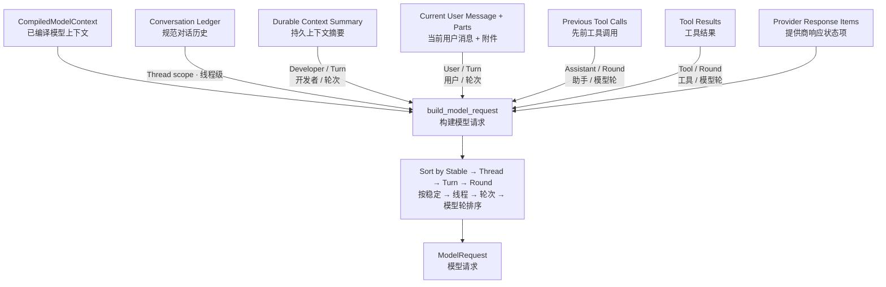

AgentCore 每个模型轮都重新构造逻辑请求，但不会重写规范历史：

- Conversation 是 immutable ledger items（不可变账本项）；
- Durable Summary 单独以 Developer / Turn 身份出现，不能覆盖当前用户；
- 当前用户保持 User / Turn；
- 工具调用保持 Assistant / Round；
- 工具结果保持 Tool / Round 且标记 Sensitive（敏感）；
- Prompt Cache Breakpoint Policy 使用 `AppendOnlyUsers（仅追加用户锚点）`。

`build_model_request` 是上下文汇合点，不是上下文真相源。它的职责是维持角色、作用域和顺序。

## 9. Finalization Guard：AgentCore 如何防止过早结束

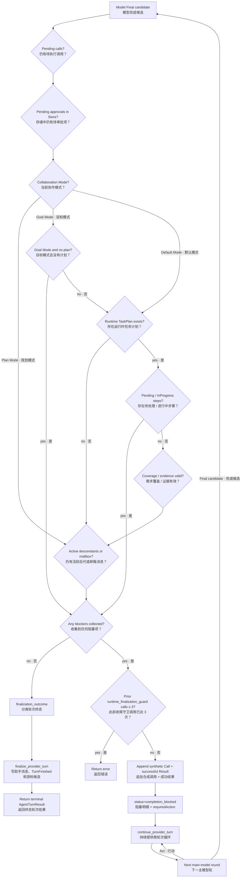

Finalization Guard 检查事实，不评价最终文本写得是否好。每次主模型给出 `Final candidate（完成候选）`都会从头执行以下流程：

1. 检查当前内存中的 Pending Tool Calls（待执行工具调用）；
2. 查询 Store（存储）中的 Pending Approvals（待审批项）；
3. 从本 Turn 最新 `PlanUpdated`事件、工具结果 `metadata.taskPlan`或 Store 中读取最新计划；
4. Goal Mode（目标模式）没有 Durable Plan（持久计划）时加入 `plan_missing`；
5. 非 Plan Mode 下仍有 In Progress / Pending Steps（进行中 / 待处理步骤）时加入 `plan_in_progress / plan_pending`；
6. 若计划带 Coverage（覆盖信息），逐项验证需求是否映射到步骤、证据 revision 是否为当前版本、证据引用的步骤是否已完成、引用的 Provider Tool Call 是否有成功结果；
7. 每个需求必须同时有 fulfillment evidence（实现或观察证据）和 verification evidence（验证证据）；
8. 查询当前作用域的后代智能体和 mailbox；仍有运行中的后代或未交付消息时加入 `descendant_agents_unresolved`。

这里的计划状态与模式工具面是两层：Default Mode 与 Goal Mode 都能通过 `set_plan / update_plan`写入执行期 `WorkForm`状态；Plan Mode 的交付物则是从 `<proposed_plan>`解析出的 `MessagePart::ProposedPlan`。为保持 prompt cache，根 Agent 的 schema 目录跨模式稳定，Plan 仍会看见执行清单工具，但工具执行入口会确定性拒绝；schema 暴露不代表模式授权。

Default 的复杂任务闭环由三部分组成：Base Prompt（基础提示词）要求非简单多步骤任务使用计划机制作为 Durable External Memory（持久外部记忆）；主模型根据语义判断任务复杂度，通过 `set_plan`创建 WorkForm，随后选择普通工具工作，并反复调用 `update_plan`把条目从 Pending / InProgress 推到终态；Finalization Guard 在仍有阻塞性未完成条目时阻止收尾。`nextRunnableItem`只提供依赖提示，不代替主模型调度。

证据检查也是 Referential Validation（引用校验），不是语义审判。主模型负责把抽象需求拆成 Requirement、Step 和 Acceptance Criteria；代码只检查需求覆盖集合、当前修订号、Completed Step 和成功 Tool Call ID 之间的关系。它不会执行自然语言验收标准，也不会重新阅读成功工具结果来判断内容是否真的支持证据摘要。完整细节见 [Planning Tools 当前架构与完整流程](./planning-tools-architecture-current.md)。

若没有任何阻塞项，守卫返回 Ready（可收尾），但还没有决定一定是 Completed。接着 `finalization_outcome（终态分类）`按最新结构化事实区分：

- 计划含 `Blocked Step（被阻塞步骤）` → `Blocked（被阻塞）`；
- 有 Deferred / Cancelled Step（延后 / 取消步骤）且 `currentScopeComplete（当前范围完成）`不是 true，或工具元数据仍声明 `remainingWork（剩余工作）` → `Partial（部分完成）`；
- 否则 → `Completed（已完成）`。

这解释了为什么收尾守卫“没有未解决就绪阻塞”后仍可能得到 Partial 或 Blocked：守卫负责阻止不一致状态下过早退出，`finalization_outcome`负责给已经稳定的终态分类。比如一个步骤已被明确标成 Blocked，不再是 Pending，所以无需强迫模型无限重试，但整个 Turn 的业务结果仍是 Blocked。

若存在阻塞项，AgentCore 不调用真实工具，而是追加一对内部合成记录：名为 `runtime_finalization_guard（运行时收尾守卫）`的 Provider Call，以及 `is_error = false`的 Tool Result。结果中的 `status = completion_blocked`并不代表这个合成调用执行失败；它表示“守卫成功地发现了完成条件尚未满足”，并携带阻塞数组和 requiredAction（要求动作）。随后进入 `continue_provider_turn`，因为待执行队列此时通常为空，它会经过轮边界并立刻启动下一主模型轮。

主模型看到阻塞事实后可以调用 `update_plan（更新计划）`、执行补充工作、请求必要输入，或等待外部结果；AgentCore 本身不自行完成计划、不伪造证据，也不根据自然语言猜测状态。若之前已经追加过 3 个 `runtime_finalization_guard`调用而阻塞仍存在，第 4 次尝试不再注入，直接返回错误，避免 Final → Guard → Final 的无限循环。

守卫通过后，`finalize_provider_turn` 才会：

- 创建最终 Assistant Message（助手消息）；
- 产生 TurnFinished（轮次完成）事件；
- 接收已经分类好的 Completed / Partial / Blocked；
- 从最终 Provider 响应提取可续接状态，创建 Provider Conversation Cursor 候选。

## 10. AgentTurnResult 的出口语义

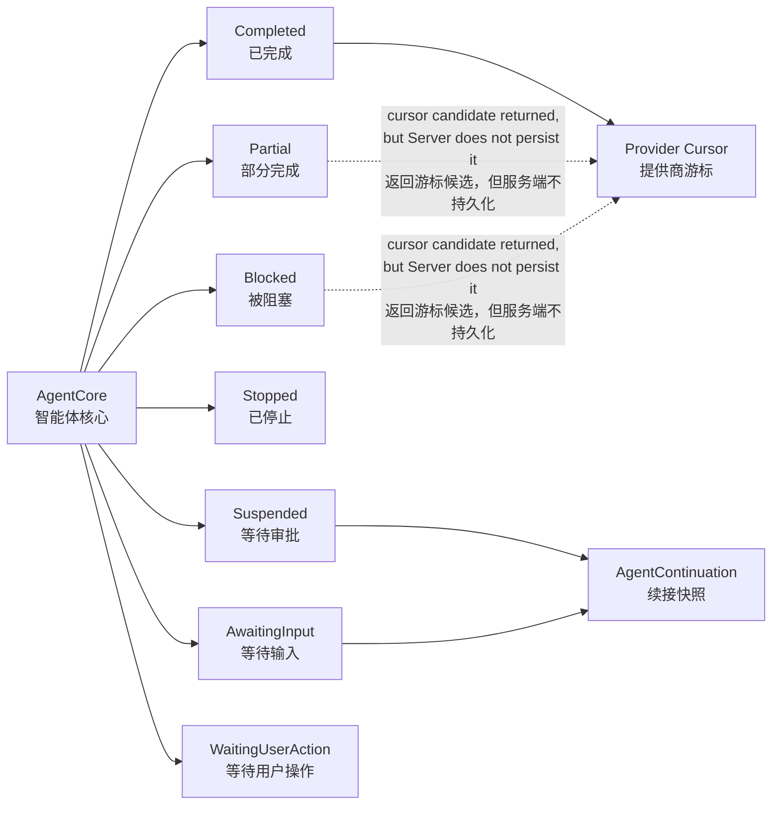

`AgentTurnResult（智能体轮次结果）`把内存循环的终止原因显式化，而不是依靠异常字符串推断产品状态：

- `Completed（已完成）`：收尾守卫通过；
- `Partial（部分完成）`：存在已完成工作，但整体未完全满足；
- `Blocked（被阻塞）`：客观条件阻止继续完成；
- `Stopped（已停止）`：例如达到 270 轮硬上限；
- `Suspended（已暂停）`：等待精确审批，并携带 Continuation；
- `AwaitingInput（等待输入）`：等待结构化用户回答，并携带 Continuation；
- `WaitingUserAction（等待用户操作）`：例如浏览器接管，需要外部动作。

`finalize_provider_turn`可能随 Completed / Partial / Blocked 都构造一个游标候选，但服务端的 `persist_provider_cursor（持久化提供商游标）`只在 Outcome 确实为 Completed 时保存它。Provider Cursor 是跨 Turn 的性能优化；Continuation 是同一 Turn 暂停路径的正确性状态。两者目的完全不同，不能互换。

### 10.1 Provider Conversation Cursor 是什么，干什么用

`ProviderConversationCursor（提供商对话游标）`是“下一 Turn 可以从提供商原生状态继续”的一次性候选引用，不是数据库游标，也不是 Pending Queue 的位置。它包含：

- `response_id（响应 ID）`：Provider 保存的上一条响应标识，可作为 `previous_response_id`继续原生响应链；
- `compatibility_hash（兼容性哈希）`：对稳定上下文、线程谱系、工具候选和相关分支策略计算的指纹；
- `response_items（响应状态项）`：没有可用响应 ID 时，可本地重放的加密 reasoning（推理）或 compaction（压缩）状态；
- `state_kind（状态类型）`：`StoredResponse（已存响应）`、`CompactionItems（压缩状态项）`或 `Hybrid（混合）`；
- `compaction_item_count（压缩项数量）`：用于记录原生状态里有多少压缩项。

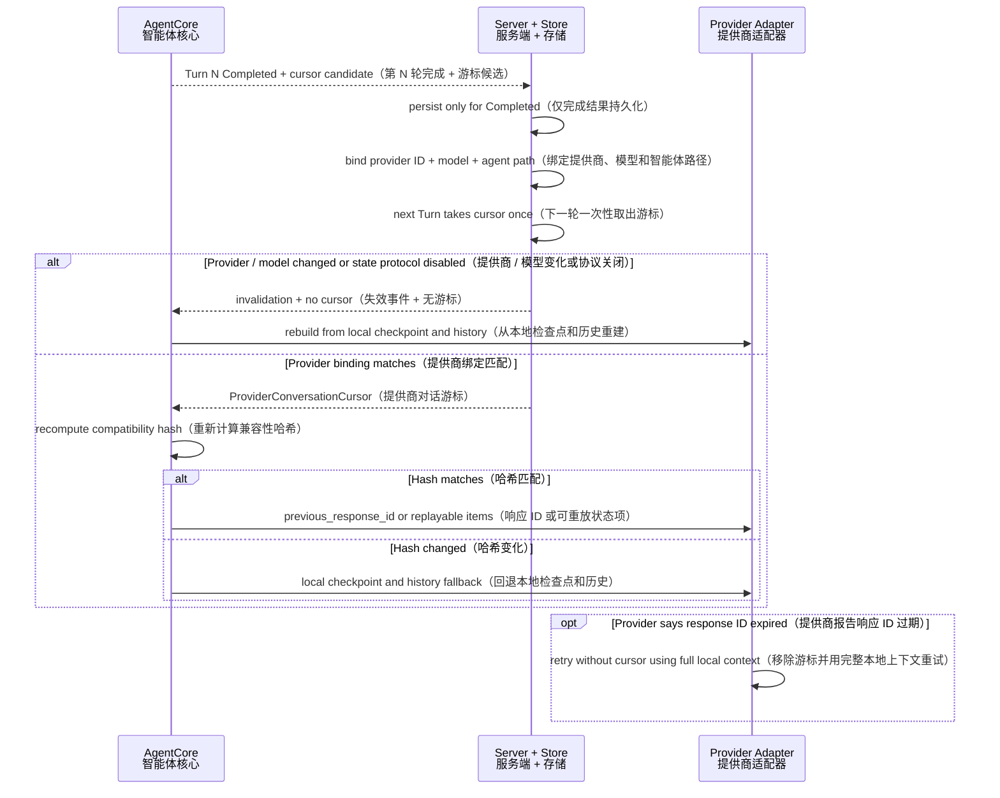

它的用途主要是减少跨 Turn 重放成本并保留 Provider 原生推理 / 压缩连续性。使用前有两层兼容检查：服务端先检查 Provider ID、Model（模型）和协议能力，AgentCore 再检查 `compatibility_hash`。即使两层都通过，Provider 仍可能说响应 ID 已过期；Adapter 会移除 `previous_response_id`并用请求中一直保留的完整本地上下文重试。

因此 Cursor 是可丢弃优化，不是正确性真相源。Conversation Ledger（对话账本）、Context Checkpoint（上下文检查点）和本地历史才是回退基础；审批或用户输入暂停则依赖 `AgentContinuation`，不会依赖 Cursor。

### 10.2 AgentCore Outcome 与服务端 Turn Status 不是同一个枚举

AgentCore 返回后，服务端还要把细粒度 Outcome（结果语义）映射成持久化的 `TurnStatus（轮次状态）`：

| AgentCore Outcome | 中文含义 | Server TurnStatus |
|---|---|---|
| `Completed` | 已完成 | `Succeeded（成功）` |
| `Partial` | 部分完成 | `Failed（失败）`，错误文本保留 `partial:` 原因 |
| `Blocked` | 被客观条件阻塞 | `Failed（失败）`，错误文本保留 `blocked:` 原因 |
| `Stopped` | 被硬限制停止 | `Failed（失败）` |
| `Suspended` | 等待审批，可恢复 | `WaitingApproval（等待审批）` |
| `AwaitingInput` | 等待结构化输入，可恢复 | `WaitingApproval（等待审批）`；当前持久状态枚举复用这一等待态 |
| `WaitingUserAction` | 等待浏览器等外部操作 | `WaitingUserAction（等待用户操作）` |

因此图上的共同返回点既没有抹平 AgentCore Outcome，也不等于数据库最终状态；它只是把状态解释权交还给拥有持久化生命周期的服务端。

## 11. 工具暴露与执行为什么分层

AgentCore 对工具有三种不同问题：

1. **Eligible（有资格）**：插件、MCP、Experience Mode、Capability Projection 是否让工具属于当前 Agent；
2. **Exposed（向模型暴露）**：工具 Schema 是否本轮直接送给模型，还是通过 `tool_search` 延迟揭示；
3. **Executable（可执行）**：具体调用在执行时是否仍通过 allowed / denied、Sandbox、Policy 和 Approval 检查。

当外部工具不少于 24 个或 Schema 估算不少于 12,000 Tokens 时，Automatic Tool Disclosure（自动工具披露）可以启用渐进式暴露。`tool_search` 最多返回 12 个匹配工具，其 Schema 在下一模型轮才可用。

这个机制只优化模型上下文，不扩大权限。搜索到工具不等于允许执行；未暴露工具也不会因知道名字就绕过执行检查。

## 12. AgentCore 刻意不负责什么

保持这些“非职责”比增加功能更重要：

- **不拥有数据库事务。** SessionStore 可被 AgentCore 用于事实查询或 effect journal（副作用日志），但 Turn 持久化生命周期属于服务端。
- **不拥有客户端状态。** UI 只消费持久事件和显式 Outcome。
- **不实现具体 Provider 协议。** prepare / stream / normalize 属于 ModelProvider Adapter。
- **不实现工具内部。** Tool Runtime 是黑盒；AgentCore 只做目录、调度、边界和结果规范化。
- **不替主模型做语义进度判断。** 重复调用、预算、计划、子智能体都是观察或客观约束。
- **不把模型 Final 当作事实完成。** Final 必须经过收尾守卫。
- **不依赖 Provider Cursor 保证恢复。** 本地 Conversation、Checkpoint 与 Continuation 才是正确性基础。

## 13. 关键参数与它们表达的设计意图

| 参数 | 当前值 | 架构含义 |
|---|---:|---|
| `MAX_PARALLEL_TOOL_CALLS` | 8 | 有界并发，避免调用洪泛，同时保留吞吐量 |
| `REPEATED_TOOL_CALL_WINDOW` | 12 | 只观察最近行为，不把整个历史永久标记为重复 |
| `REPEATED_TOOL_CALL_REPORT_THRESHOLD` | 3 | 达到一定频次才把客观遥测送给模型 |
| `REPEATED_TOOL_CALL_REPORT_COOLDOWN_ROUNDS` | 12 | 避免每轮重复提醒同一事实 |
| `INVALID_TOOL_CALL_REPEAT_LIMIT` | 3 | 相同模式无效调用有明确熔断，避免无意义死循环 |
| `ROLLOUT_REVIEW_INTERVAL` | 90 | 长轮次按稀疏检查点让主模型自审 |
| `MAX_ROLLOUT_MODEL_ROUNDS` | 270 | 运行时硬上限，避免无限主模型循环 |
| `MAX_FINALIZATION_GUARD_ACTIVATIONS` | 3 | 收尾阻塞反馈有界，避免无限 Final 往返 |
| `OPENTOPIA_CONTEXT_COMPACT_THRESHOLD_PERCENT` | 80%（可配置，50%–95%） | 每个 Provider round 的统一 pressure 触发线 |
| `AUTOMATIC_TOOL_DISCLOSURE_COUNT_THRESHOLD` | 24 | 大目录开始采用渐进式工具披露 |
| `AUTOMATIC_TOOL_DISCLOSURE_TOKEN_THRESHOLD` | 12,000 | Schema 成本过高时保护模型上下文 |
| `MAX_TOOL_SEARCH_RESULTS` | 12 | 单次揭示有界，避免搜索重新膨胀目录 |

这些常量共同表达一个原则：AgentCore 使用明确上限和客观遥测控制资源，但把任务语义选择留给主模型。

## 14. 最重要的 AgentCore 不变量

1. **One Turn, one continuous loop（一个 Turn，一条连续循环）。** 工具、提醒、暂停和恢复都属于同一控制链。
2. **Model decides meaning; runtime enforces facts（模型决定语义，运行时执行事实约束）。**
3. **Provider-neutral above the adapter（适配器之上保持提供商无关）。**
4. **Capability restrictions are monotonic（能力限制单调收窄）。**
5. **Tool intent never bypasses policy（工具意图永远不能绕过策略）。**
6. **Parallel execution preserves ordered transcript（并发执行保持有序记录）。**
7. **Observations are committed only after delivery（观察只在确认交付后提交）。**
8. **Suspension serializes the exact control point（暂停序列化精确控制点）。**
9. **A resumed Turn does not redo committed work（恢复轮次不重做已提交工作）。**
10. **Final is provisional until guard approval（Final 在守卫批准前只是候选）。**
11. **Events are outputs, not loop inputs（事件是输出，不是循环输入）。**
12. **Optimization state is disposable（优化状态可丢弃）。** Cursor、缓存和压缩可失效，但本地真相仍能继续。

## 15. 主要源码锚点

- `crates/opentopia-core/src/agent.rs:136` — `AgentTurnResult（智能体轮次结果）`
- `crates/opentopia-core/src/agent.rs:156` — `AgentTurnOutcome（智能体轮次结果类型）`
- `crates/opentopia-core/src/agent.rs:184` — `AgentContinuation（智能体续接快照）`
- `crates/opentopia-core/src/agent.rs:235` — `TurnEvents（轮次事件收集器）`
- `crates/opentopia-core/src/agent.rs:513` — `AgentCore（智能体核心）`
- `crates/opentopia-core/src/agent.rs:1047` — `collect_step_reminders（收集步骤提醒）`
- `crates/opentopia-core/src/agent.rs:1228` — `commit_step_reminders（提交提醒交付状态）`
- `crates/opentopia-core/src/agent.rs:1296` — `apply_finalization_guard（应用收尾守卫）`
- `crates/opentopia-core/src/agent.rs:1583` — `apply_rollout_checkpoint_observation（应用长轮次检查点观察）`
- `crates/opentopia-core/src/agent.rs:1754` — `run_turn_detailed_streaming_with_context（运行新轮次）`
- `crates/opentopia-core/src/agent.rs:2033` — `resume_turn_streaming（从审批恢复）`
- `crates/opentopia-core/src/agent.rs:2155` — `resume_turn_with_user_input_streaming（从用户输入恢复）`
- `crates/opentopia-core/src/agent.rs:2246` — `parallel_tool_call_indices（选择并发调用）`
- `crates/opentopia-core/src/agent.rs:2414` — `automatic_review_batch_candidates（选择自动评审批次）`
- `crates/opentopia-core/src/agent.rs:2468` — `continue_provider_turn（持续轮次循环）`
- `crates/opentopia-core/src/agent.rs:3346` — `complete_model（完成模型轮）`
- `crates/opentopia-core/src/agent.rs:3488` — `eligible_provider_tool_candidates（计算有资格工具）`
- `crates/opentopia-core/src/agent.rs:3602` — `provider_tool_candidates（生成模型工具目录）`
- `crates/opentopia-core/src/agent.rs:4018` — `execute_provider_tool_call（执行提供商工具调用）`
- `crates/opentopia-core/src/agent.rs:4854` — `finalize_provider_turn（完成提供商轮次）`
- `crates/opentopia-core/src/agent.rs:5028` — `finalization_outcome（分类完成 / 部分完成 / 被阻塞）`
- `crates/opentopia-core/src/agent.rs:5187` — `current_task_plan_for_tool（为工具装配当前计划）`
- `crates/opentopia-core/src/agent/context_pressure.rs` — `admitted_round_request（统一 Provider round 请求准入）`
- `crates/opentopia-core/src/round_compaction.rs` — `RoundContextCompactor（durable 压缩端口）`
- `crates/opentopia-server/src/context_api/round_compaction.rs` — `ServerRoundContextCompactor（完整规范请求的一次性 checkpoint 实现）`
- `crates/opentopia-core/src/agent.rs:5656` — `build_model_request（构建模型请求）`
- `crates/opentopia-core/src/agent.rs:6207` — `AgentTurnInput（智能体轮次输入）`
- `crates/opentopia-core/src/tools.rs:1257` — `RequestUserInputTool（请求用户输入工具）`
- `crates/opentopia-core/src/tools.rs:1606` — `SetPlanTool（设置计划工具）`
- `crates/opentopia-core/src/tools.rs:1826` — `UpdatePlanTool（更新计划工具）`
- `crates/opentopia-server/src/main.rs:7433` — `take_provider_cursor（取出提供商游标）`
- `crates/opentopia-server/src/main.rs:7482` — `persist_provider_cursor（持久化提供商游标）`
- `crates/opentopia-core/src/model_context.rs:234` — `CompiledModelContext（已编译模型上下文）`
- `crates/opentopia-core/src/provider.rs:73` — `ModelRequest（模型请求）`
- `crates/opentopia-core/src/provider.rs:303` — `ModelResponse::decision（模型响应决策）`
- `crates/opentopia-core/src/provider.rs:659` — `ModelProvider（模型提供商边界）`
- `crates/opentopia-core/src/guardian.rs:361` — `GuardianReviewSessionManager（守卫评审会话管理器）`

---

最简洁的 AgentCore 心智模型是：

> **它把主模型的语义决策放进一条受权限约束、可观察、可暂停、可恢复且结果顺序确定的循环；它拥有循环，但不拥有应用生命周期、工具内部或任务语义。**
