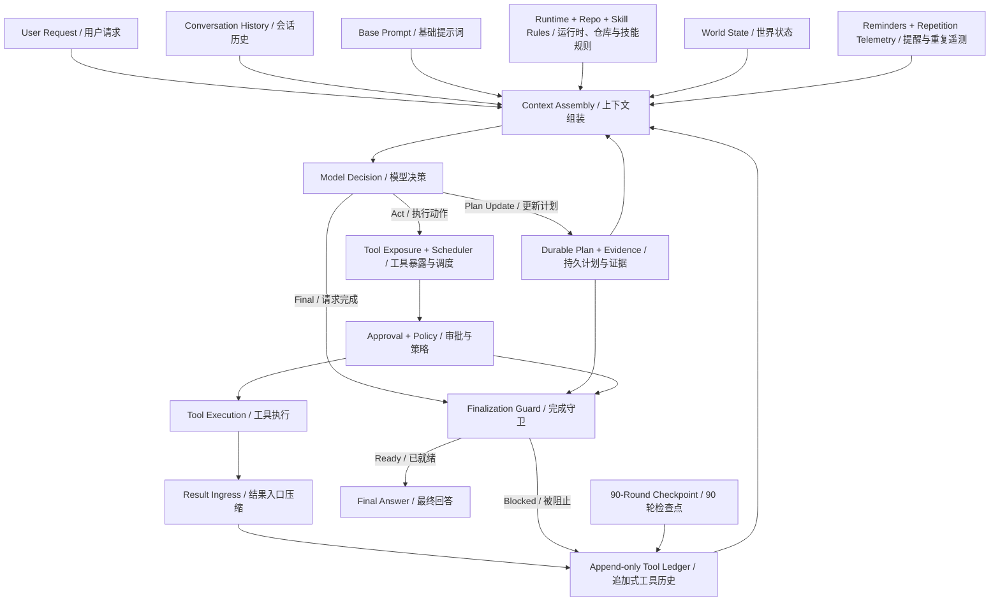
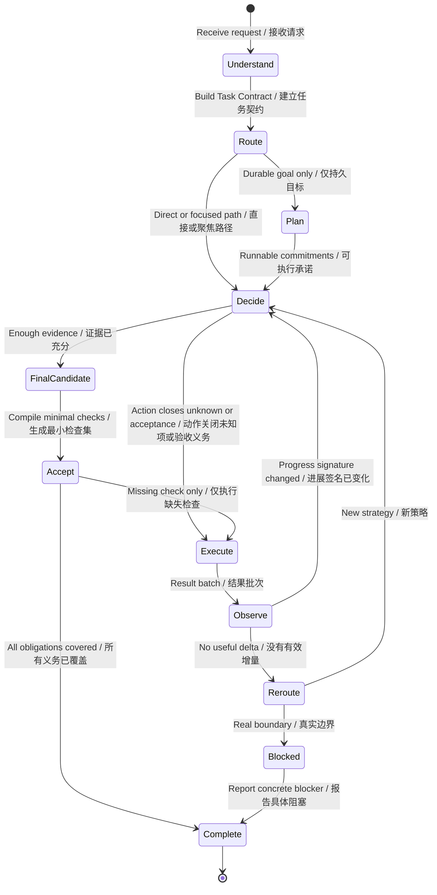

# OpenTopia Agent Core 效率架构审查与重构方案

审查日期：2026-08-13（Asia/Shanghai）

审查对象：当前工作区中的 Agent Core、基础提示词、运行时提示词、规划与完成机制、搜索与附件读取、工具编排、工具结果入口、上下文组装、Provider 适配和评测体系。

本文讨论的是 **Harness Architecture（代理运行框架架构）**，不是针对某一个失败任务增加特殊分支。工具内部实现只在它确实造成 Agent 路径膨胀时讨论。

## 1. 结论

当前 OpenTopia 的主要问题，不是 `while` Loop（循环）本身比别人多了几个分支，而是缺少一个位于 Loop 之上的 **Quality-Constrained Minimal Path Policy（质量约束的最短充分路径策略）**。

当前架构把很多局部合理的机制叠在了一起：

- Base Prompt（基础提示词）要求深入追踪代码关系、规划、验证和完成闭环。
- Model（模型）自行决定何时探索、何时停止、何时验证。
- Plan / Evidence（计划 / 证据）机制记录要求、步骤和工具证据。
- Finalization Guard（完成守卫）再次检查计划、证据、审批、子 Agent 和未完成工具。
- Repetition Telemetry（重复调用遥测）只报告完全相同的调用。
- Rollout Checkpoint（长程检查点）到 90 个模型轮次才触发第一次自检。
- Tool Result Ingress（工具结果入口）压缩单个结果，但不判断一组结果对当前目标是否提供了新信息。

这些机制各自没有明显错误，但它们没有共享同一个 Task Contract（任务契约）、同一个 Progress Ledger（进展账本）和同一个 Stop Rule（停止规则）。结果是：安全、规划、观察、验证和完成分别形成反馈控制器，复杂任务进入深探索后，很难沿“最短充分路径”收敛。

更严重的问题出现在大文件和表格任务：模型不再只负责理解、映射和决策，而是在充当分页器、批处理循环和 ETL Executor（抽取、转换、加载执行器）。这会天然把一个逻辑操作膨胀成几十到上百次工具调用，并让每一批数据重复进入模型上下文。

目标架构应遵循一个约束优化目标：

```text
在 Outcome Quality（结果质量）、Safety（安全）和 Acceptance Coverage（验收覆盖）达标的前提下，
最小化 Model Rounds（模型轮次）+ Tool Calls（工具调用）+ Context Growth（上下文增长）
+ Failure Recovery（失败恢复）+ Wall Time（墙钟时间）。
```

最值得优先做的不是拆分 `agent.rs` 文件，也不是把 270 轮改成 50 轮，而是：

1. 引入 Task Contract（任务契约）与 Strategy Router（策略路由器），让每个任务先进入合适的短路径。
2. 把大文件扫描、分页、过滤、联接、映射、批量写入和确定性校验下沉到 Data Plane（数据执行层），不再逐页回到模型。
3. 用一个 Progress & Evidence Ledger（进展与证据账本）替代普通任务中重叠的计划记账、提醒和完成回弹。
4. 用 Acceptance Policy（验收策略）从风险和变更影响推导“最小充分验证集”，而不是让模型自由堆叠检查。
5. 用信息增量和状态变化判断是否继续，而不是等到 90 轮才提醒模型自我反思。

## 2. 真实运行证据

以下数据来自 `.opentopia/opentopia.db` 的只读查询。Model Rounds（模型轮次）按成功返回 usage 的 Provider 轮次统计；取消中的最后一个未返回请求不计入完成轮次。

| Turn | 用户任务形状 | 结果 | 模型轮次 | 工具调用 | 主要调用 | 累计输入 Token | 耗时 | 说明 |
| --- | --- | --- | ---: | ---: | --- | ---: | ---: | --- |
| `6fc12bf6` | 审查 500 行错误报告 | 成功 | 3 | 2 | `spreadsheet` × 2 | 1,757,783 | 3 分 02 秒 | 工具路径短，但简单任务仍重放了巨量历史上下文 |
| `db1f5a7e` | 根据上一轮承诺继续生成表格 | 成功 | 12 | 52 | `read_attachment` × 40、`spreadsheet` × 11 | 6,441,477 | 47 分 42 秒 | 模型分块读取 3.1 MB CSV，再分批写入和抽查 |
| `b99a7465` | 更换 3.1 MB CSV 并重新调查 | 成功 | 4 | 13 | `read_attachment` × 12 | 1,194,920 | 7 分 06 秒 | 仍通过字符窗口读取大文件 |
| `78d58398` | 把大型 income 表填入模板 | 用户取消 | 27 | 130 | `spreadsheet` × 125 | 9,166,140 | 24 分 23 秒 | 连续多轮每轮读取 6–7 个区间，尚未进入最终闭环 |
| `4b1472a9` | 在 Plan Mode（计划模式）调查多表合并 | 成功给出计划 | 10 | 22 | 表格、目录、Shell、Tool Search | 390,491 | 2 分 39 秒 | 为确认“附件能否落盘/如何执行”发生多轮能力探索 |

这组数据说明两件事：

1. 当前 Loop 并非固定很长。明确、工具匹配良好的任务可以在 3 轮内结束。
2. 缺少按任务形状收缩路径的机制。大文件、能力不匹配或需要跨源映射时，模型会进入开放式探索；当前架构没有在 5、10、20 轮附近提供与任务相关的收敛信号，90 轮检查点对这类真实失控没有帮助。

已有的同任务对比也记录了相同方向的差距：2026-08-05 的一个 UI 修改任务中，OpenTopia 在失败前进行了 33 个模型轮次和 34 次 Provider 尝试；Codex 轨迹有 14 条 usage 记录并成功完成。OpenTopia 的累计输入 Token 约为该 Codex 轨迹的 8.36 倍。这个单样本不能证明 Codex 的内部架构，但足以证明 OpenTopia 存在可复现的路径放大问题，详见 [同任务 Token 与验收审计](agent-token-history-comparison-2026-08-05.md)。

## 3. 当前架构中模块的真实关系



这张图最重要的不是接口，而是控制关系：

- `AgentCore` 是循环、策略、调度、审批、并行、Continuation（续接状态）、工具暴露、上下文压缩、提醒、完成守卫和长程限制的共同所有者。当前 `agent.rs` 已有 12,668 行、294 个函数。文件大不是路径变长的直接原因，但说明不同控制策略缺少清晰的所有权边界。
- Base Prompt 明确说 Harness 不规定固定工作流，但又同时对代码追踪、计划证据和验证提出较强的通用要求。任务策略实际上被分散在 Prompt 和运行时保护器之间。
- Plan（计划）一旦存在，Finalization Guard 就会把它变成强完成约束；Goal Mode（目标模式）还要求每条 Requirement（要求）同时具有 Implementation / Observation Evidence（实现 / 观察证据）和 Verification Evidence（验证证据）。这对长程目标合理，对普通任务可能产生重复记账。
- Tool Result Ingress 已能把超长原始结果存入 Artifact（产物）并给模型有界摘要，这是正确方向；但它只压缩单个结果，不知道连续 20 个不同区间的读取是否仍在提供决策价值。
- Repetition Telemetry 只比较“工具名 + 完全相同参数”。连续读取 `rows 1–30`、`31–60`、`61–90` 不算重复，尽管它们在控制层面属于同一种低价值分页策略。
- Rollout Checkpoint 只报告客观计数，且第一次发生在 90 轮。它是资源安全网，不是日常效率控制器。

关键源码证据：

- `AgentCore` 的责任集合：`crates/opentopia-core/src/agent.rs:513`
- Finalization Guard：`crates/opentopia-core/src/agent.rs:1296`
- 90 / 270 轮控制：`crates/opentopia-core/src/agent.rs:94`
- 主 Turn 入口：`crates/opentopia-core/src/agent.rs:1754`
- Provider Tool Loop（Provider 工具循环）：`crates/opentopia-core/src/agent.rs:2468`
- 工具候选投影：`crates/opentopia-core/src/agent.rs:3488`
- 客户端 Tool Search（工具搜索）：`crates/opentopia-core/src/agent.rs:3602`
- 模型请求把历史和工具结果重新物化：`crates/opentopia-core/src/agent.rs:5656`

## 4. 六个方面的系统性诊断

### 4.1 Search & Exploration（搜索与探索）

#### 当前问题

1. Workspace Search（工作区搜索）本质上是单查询的 `rg` 文本搜索。它能快速找到候选文本，但没有 Symbol Graph（符号图）、Caller / Callee（调用方 / 被调用方）、配置绑定、测试映射或任务相关性排序。
2. Base Prompt 要求从定义继续查看直接调用者、被调用者、构造器、实现、重导出、配置和测试，并逐跳确认。这个要求保证严谨，却没有与“当前还缺哪条决策证据”绑定，容易从必要追踪变成惯性追踪。
3. `read_attachment` 每次最多返回 16,000 个字符。对 3.1 MB CSV，这等价于邀请模型自己做分页循环。
4. `spreadsheet` 目前提供 Inspect、List Sheets、Read Range 和 Write 等有界原语。对 1,000 行以上的跨表映射，模型需要自己安排窗口、拼接数据、生成写入批次和抽样检查。
5. Deferred Tool Search（延迟工具搜索）按工具名和描述做词项匹配，客户端路径还需要下一模型轮才能使用新工具。它解决“大目录 Schema”问题，但不解决“这个输入能否转成那个输出”的能力关系判断。

源码位置：

- 文本搜索能力与限制：`crates/opentopia-core/src/tools.rs:6380`
- `read_attachment` 的 16,000 字符窗口：`crates/opentopia-core/src/tools.rs:5255`
- 表格动作集合：`crates/opentopia-core/src/tools.rs:800`
- Tool Search 的词项评分：`crates/opentopia-core/src/agent.rs:3672`
- 深度代码追踪提示：`crates/opentopia-core/src/prompts/base/codebase_exploration.md`

#### 根因

当前提供的是 Retrieval Primitives（检索原语），但 Agent 需要的是 Evidence Acquisition（证据获取）能力。前者返回匹配，后者回答“为了做下一个决定，还缺什么证据，以及哪一批读取最可能一次补齐”。

#### 目标设计

建立 Source Intelligence Layer（源码与数据源智能层）：

- 对代码维护 Repository Map（仓库地图）：文件、语言、模块、符号定义、引用、导入、注册、配置、测试和最近变更。
- 对文档、CSV、XLSX 在接入时生成 Source Profile（数据源概况）：Schema、类型、行数、空值、唯一值、代表性样本、可搜索列和 Artifact 索引。
- 搜索由一组 Evidence Question（证据问题）驱动，例如“哪个模块拥有完成守卫”“哪些测试覆盖这条路径”，而不是只接收一个关键词。
- 返回 Task Slice（任务切片）：最相关定义、关系、配置、测试和未确定边，而不是未排序的全部匹配。
- 每个证据问题都有 Stop Condition（停止条件）。当做出下一步决策所需的不确定性已经关闭，就停止继续扩展调用图。

### 4.2 Reasoning & Planning（推理与规划）

#### 当前问题

当前第一等决策只有 `Incomplete / Act / Final`（不完整 / 动作 / 最终）。系统没有一个显式的 Task Contract 来保存：用户真正要的结果、非目标、授权边界、当前未知项、风险等级和验收条件。

`AgentRuntimeSettings` 主要控制 Personality（人格）、Autonomy（自主性）、Multi-Agent（多智能体）和 Progress Updates（进度更新），并不按任务形状选择执行策略。结果是任务分类发生在模型的隐式推理中，每轮都可能重新解释。

另一方面，Base Prompt 对“非简单多步任务”推荐 Durable Plan（持久计划），而当前计划协议要求 Requirement ID（要求编号）、Source Reference（来源引用）、步骤覆盖和 Provider Tool Call Evidence（Provider 工具调用证据）。这适合需要重启、多人协作、Goal Mode 或数小时运行的目标；用在普通修改上，会把“做事”变成“做事 + 维护计划数据库 + 维护证据映射”。

#### 根因

系统缺少 Planning Policy（规划策略），只有 Planning Capability（规划能力）。模型知道可以规划，却不知道何时使用零计划、轻量执行草图、持久计划或长程 DAG（有向无环图）。

#### 目标设计

引入 Task Contract 和 Strategy Router：

```text
TaskContract / 任务契约
  kind                 请求类型：回答、诊断、修改、数据转换、监控、计划
  objective            用户真正要得到的结果
  deliverables         必须交付的文件、状态或答案
  constraints          用户、仓库、权限和安全约束
  nonGoals             明确不做的事情
  unknowns             做出下一不可逆决策前必须解决的问题
  authorization        允许读取、修改或外部写入的边界
  risk                 失败影响与变更爆炸半径
  acceptance           最终状态必须满足的可观察条件
  revision             用户纠正后递增的语义版本
```

Task Contract 不应新增一个模型轮次。第一轮模型响应应同时给出 Contract Delta（契约增量）和首个 Action / Final（动作 / 最终），或者由 Harness 从当前模式、附件、会话承诺和用户文本先确定可确定部分，再让模型只补语义部分。

规划分为三级：

| Planning Level（规划级别） | 适用任务 | 状态形式 | 是否要求显式计划调用 |
| --- | --- | --- | --- |
| Direct（直接） | 简单回答、单次读取 | 无计划 | 否 |
| Execution Sketch（执行草图） | 普通诊断、代码修改、产物生成 | Turn 内轻量步骤和停止条件 | 否 |
| Durable Plan（持久计划） | Goal、Flow、重启恢复、多角色、长时间任务 | 持久 DAG、要求修订和证据 | 是 |

### 4.3 Tool Calling（工具调用）

#### 当前问题

当前工具调度器已经支持独立调用并行、按 Provider 顺序提交结果、审批、取消和安全策略，这些不应推倒重来。问题在于模型仍然承担了过多可确定循环：

- 分页读取直到文件末尾。
- 对多个范围做相同聚合。
- 把一组行映射到另一种 Schema。
- 把大量单元格分批写入。
- 逐段重新读取以确认批次写入。
- 失败后试探不同的能力路径。

这些步骤中的大部分不需要每批都进行一次新的语义判断。

#### 根因

Agent Loop（代理循环）和 Data Plane（数据执行层）的边界错误。模型应定义操作，而不是执行操作的每一个迭代。

#### 目标设计

新增 Bounded Operation Runtime（有界操作运行时），支持安全、可取消、可审计的逻辑操作：

- Scan / Filter / Project（扫描 / 过滤 / 投影）
- Join / Group / Aggregate（联接 / 分组 / 聚合）
- Map Schema（字段映射）
- Batch Transform（批量转换）
- Validate Invariants（验证不变量）
- Sample Exceptions（抽样异常）

模型只负责：

1. 解释用户意图和字段含义。
2. 选择或提出映射规则。
3. 声明不确定项和异常策略。
4. 审查运行时返回的摘要与异常。

运行时负责：

1. 遍历所有页和行。
2. 应用确定性映射。
3. 写出产物。
4. 生成行数、空值、类型、不变量、哈希和异常报告。

这可以由 OpenTopia 自己的安全 DSL（领域语言）实现，也可以在 Provider 支持时使用 Programmatic Tool Calling（程序化工具调用）。关键是语义判断与机械循环只有一个清晰交接点，不能在两种路径间来回切换。

每个工具批次还应携带 Action Intent（动作意图）：它关闭哪个 `unknown`、满足哪个 `acceptance`、预期产生什么状态变化。这个元数据属于 Loop 协议，不应污染每个具体工具的业务 Schema。

### 4.4 Observation, Reflection & Acceptance（环境观察、反思与验收）

#### 当前问题

`tool_result_ingress.rs` 已经完成单结果去噪、失败摘要、Artifact 回退和有界输出，这是应保留的正确基础。但模型下一轮仍会看到一串独立结果，系统没有把它们归纳成“相对上一轮发生了什么变化”。

当前重复检测使用精确参数签名。它能发现相同命令原样重试，却无法发现：

- 连续不同 offset 的附件分页。
- 连续不同 row range 的同类表格读取。
- 换一个关键词但命中同一批无关文件。
- 多次验证同一 Acceptance Obligation（验收义务），却没有增加独立覆盖。

90 轮 Rollout Checkpoint 对典型的 10–30 轮失控过晚；而且它只让模型再次自我判断，没有提供任务相关的边际收益信息。

#### 目标设计

在 Tool Result Ingress 之后增加 Observation Reducer（观察归约器），把一批结果变成 Observation Capsule（观察胶囊）：

```text
ObservationCapsule / 观察胶囊
  outcome              成功、失败、部分成功或等待
  newFacts             新增的任务相关事实
  changedResources     新增或变化的文件、状态和外部资源
  diagnostics          失败类型与最可能原因
  evidence             可供验收复用的证据引用
  unresolved           仍未关闭的不确定项
  rawArtifacts         原始结果引用
  noveltyFingerprint   相对于先前观察的新颖性指纹
```

Progress Supervisor（进展监督器）维护：

```text
ProgressSignature =
  Acceptance State（验收状态）
  + Unresolved Questions（未解决问题）
  + Changed Resources（变化资源）
  + New Evidence Fingerprints（新证据指纹）
  + Active Failure Cause（当前失败原因）
```

如果一轮调用没有改变 Progress Signature，系统不应立即硬终止，但应要求下一次决策选择以下之一：改变策略、直接利用已有证据、进入更合适的有界执行器、报告真实阻塞或完成。连续无增量不能继续使用同一 Action Family（动作族）。

### 4.5 Step Efficiency（处理步骤效率）

当前系统没有为每个步骤建立“它为什么存在”的统一账本。工具调用可能来自搜索惯性、验证惯性、计划维护、能力试探或实际工作，运行时只知道它合法，不知道它是否关闭了任务中的某个缺口。

目标架构要求每个模型动作至少满足一个 Relevance Gate（相关性门）：

- 关闭一个尚未解决的 Evidence Question。
- 推进一个尚未满足的 Acceptance Obligation。
- 产生一个用户要求的 Deliverable。
- 恢复一个已分类且可恢复的 Failure。
- 满足一个安全、审批或持久化边界。

如果都不满足，这一步默认是无效步骤。这个判断首先用于遥测和 A/B 评测，不应一开始就用另一个 LLM 在线审批每次调用，否则会为了减少步骤而新增步骤。

固定 90 轮检查点应降级为最终资源保护。日常使用 Route Budget（路径预算）：预算由任务路由、风险和历史基线决定，并在观察到新复杂度时可升级。它是软预算和重新路由信号，不是简单粗暴的调用上限。

### 4.6 Intent Understanding（准确的问题识别）

最近轨迹中最昂贵的成功任务，其当前用户消息只有“嗯。”。这说明真实目标不在当前字符串里，而在上一轮承诺、用户已经接受的方案、被替换的附件和未完成产物中。

当前大量重放 Conversation History（会话历史）可以让模型自行恢复语义，但代价很高，也容易把已废弃方案、旧工具输出和当前目标放在同一注意力平面。

目标设计应维护 Conversation Commitment Ledger（会话承诺账本）：

- Active Objective（当前目标）
- Accepted Decisions（已接受决策）
- Superseded Decisions（已替换决策）
- User Corrections（用户纠正）
- Promised Next Action（已承诺的下一动作）
- Current Artifacts（当前产物）
- Open Questions（未决问题）
- Authorization Boundary（授权边界）

“嗯”“就这么做”“换这个，之前那个别用”应首先更新这个账本，再形成当前 Task Contract。用户纠正只使相关约束和证据失效，不应迫使系统重新读取全部无关历史。

## 5. 目标架构：Quality-Constrained Minimal Loop（质量约束的最短充分循环）

```mermaid
flowchart LR
    U["User + Conversation Commitments / 用户与会话承诺"] --> IC["Intent Compiler / 意图编译器"]
    IC --> TC["Task Contract / 任务契约"]
    TC --> SR["Strategy Router / 策略路由器"]

    SR --> CP["Context Planner / 上下文规划器"]
    CP --> M["Model Decision / 模型决策"]
    M --> AO["Action Orchestrator / 动作编排器"]

    AO -->|"Semantic Action / 语义动作"| TR["Tool Runtime / 工具运行时"]
    AO -->|"Bounded Operation / 有界操作"| DP["Data Plane / 数据执行层"]
    TR --> OR["Observation Reducer / 观察归约器"]
    DP --> OR

    OR --> PL["Progress & Evidence Ledger / 进展与证据账本"]
    PL --> PS["Progress Supervisor / 进展监督器"]
    PS -->|"More evidence needed / 仍需证据"| M
    PS -->|"Strategy mismatch / 策略不匹配"| SR
    PS -->|"Acceptance ready / 可验收"| AE["Acceptance Engine / 验收引擎"]

    AE -->|"Missing obligation only / 仅补缺失义务"| AO
    AE -->|"Passed / 通过"| F["Final Answer or Artifact / 最终回答或产物"]

    TK["Turn Kernel / Turn 内核"] -. "owns state, cancel, approval, resume / 管理状态、取消、审批、恢复" .-> SR
    TK -.-> AO
    TK -.-> AE
    EV["Event Store + Telemetry / 事件存储与遥测"] -.-> TK
```



### 5.1 模块不是接口集合，而是决策所有权

| 模块 | 真正负责什么 | 与其他模块的关系 | 不负责什么 |
| --- | --- | --- | --- |
| Intent Compiler（意图编译器） | 把用户话语、会话承诺、附件、模式和权限合成一份可修订的任务语义 | Task Contract 是 Router、Context、Acceptance 的共同事实源 | 不选择具体工具，不执行任务 |
| Strategy Router（策略路由器） | 选择当前最短可行路径，并在新证据出现后升级或降级 | 决定加载什么上下文、工具能力、计划级别和路径预算 | 不替模型做领域判断 |
| Context Planner（上下文规划器） | 只组装当前决策需要的稳定规则、任务切片和未决问题 | 从 Task Contract、Repository Map、Commitment Ledger 取信息 | 不默认重放全部历史和全部工具结果 |
| Evidence Planner（证据规划器） | 把未知项转成最少的一组可并行证据问题和停止条件 | 驱动源码搜索、附件查询和诊断读取 | 不把“多看一点”当作进展 |
| Action Orchestrator（动作编排器） | 区分需要模型逐步判断的动作与可一次下沉的有界操作 | 调用 Tool Runtime 或 Data Plane，处理安全重试和并行 | 不重新理解用户目标 |
| Observation Reducer（观察归约器） | 提取新增事实、状态变化、失败原因、证据和原始 Artifact 引用 | 只把任务相关增量送入 Ledger 和下一轮上下文 | 不丢弃原始证据，不自行宣布语义完成 |
| Progress & Evidence Ledger（进展与证据账本） | 统一要求、未知项、动作、观察、验收覆盖和修订 | 取代普通任务中分散的计划记账、提醒和证据回填 | 不要求普通任务显式调用计划工具 |
| Acceptance Engine（验收引擎） | 从任务风险和变更影响选择最小充分验证集，并判断可观察义务是否覆盖 | 一次验证可覆盖多条 Requirement；只补真正缺失的检查 | 不相信模型口头声称，不强制无关全量检查 |
| Turn Kernel（Turn 内核） | 管理确定性生命周期：执行、审批、取消、挂起、恢复、并行结果有序提交和终态 | 是各策略模块的协调者，而不是所有策略的实现文件 | 不拥有搜索启发式、领域 ETL 或 Prompt 内容 |

### 5.2 推荐的任务路由

| Route（路由） | 典型任务 | 正常路径 | 规划与验收策略 |
| --- | --- | --- | --- |
| Direct Answer（直接回答） | 当前上下文足够的解释、格式化、总结 | Understand → Final | 无工具、无计划；检查必要事实即可 |
| Focused Inspection（聚焦调查） | 代码解释、状态审查、根因诊断 | Contract → Evidence Batch → Final | 轻量证据问题；没有变更就不运行构建 |
| Scoped Change（限定修改） | 常规修复、UI 小改、配置变更 | Contract → Task Slice → Change → Impact Validation → Final | Turn 内执行草图；按影响选择测试 |
| Data Pipeline（数据管道） | CSV/XLSX 映射、批量转换、聚合 | Profile → Mapping Decision → Bounded Operation → Deterministic Validation → Final | 模型不参与分页和每批写入 |
| Deep Investigation（深度调查） | 跨模块架构、疑难性能、未知故障 | Hypotheses → Ranked Evidence → Decision → Targeted Validation | 有假设、信息增益和停止条件，可升级为持久计划 |
| Durable Goal / Flow（持久目标 / 流程） | 多小时、可恢复、多角色、依赖图 | Durable Plan → Execute / Resume → Milestone Acceptance → Complete | 保留完整计划、证据、修订和严格完成守卫 |

Router 必须可逆。一个看似小的修改发现高风险迁移后可以升级；一个原本标成深度调查的任务，在首批证据已确定答案后可以立即降级完成。

## 6. 简化后的 Turn State Machine（Turn 状态机）



这个状态机比当前 Loop 少的不是安全边界，而是重复决策：

- Task Contract 只在语义变化时修订，不在每轮重新推断。
- 普通任务没有独立的 `set_plan → update_plan → complete_task` 记账循环。
- 机械分页和批处理在一次 Bounded Operation 内完成。
- Observation 先归约成增量，再进入下一轮。
- Final Candidate 只会因具体缺失的 Acceptance Obligation 回到执行，不会收到笼统的“再检查一次”。

## 7. 验收架构：减少验证但不降低质量

减少步骤最容易犯的错误，是把“少验证”当成“高效率”。正确做法是把验收建模为 Coverage Problem（覆盖问题）。

### 7.1 Acceptance Obligation（验收义务）

验收义务来自四个来源：

1. 用户要求，例如“两个框都移除边框”。
2. 仓库硬规则，例如 UI 变更必须运行 `design:check` 和类型检查。
3. 变更影响，例如改公共解析器需要覆盖调用方。
4. 安全与数据完整性，例如生成 500 行表格不能有空必填字段。

每个候选验证动作声明它覆盖哪些义务、成本和适用前提。Acceptance Engine 选择能覆盖全部义务的低成本组合，而不是依次运行所有可用检查。

示例：

```text
UI 小改的义务：目标选择器正确、没有新增设计规范违规、桌面类型正确、Diff 无意外变化。

最小充分验证：
  focused source inspection
  + pnpm design:check
  + desktop typecheck
  + final diff inspection

不自动增加：全仓库测试、无关 package build、重复截图，
除非变更影响或失败信号要求升级。
```

### 7.2 证据自动归属

普通任务不应要求模型再次调用 `update_plan` 把刚刚成功的 Tool Call ID 手工贴回每个步骤。Action Intent 已声明本次动作关联的 Acceptance ID，运行时可以自动记录成功结果、变更资源和验证覆盖。

Durable Goal 仍保留严格证据，但同一次成功验证应能覆盖多条 Requirement，而不是要求为每条要求制造一份形式重复的证据。

### 7.3 Completion Guard（完成守卫）的新边界

应保留的机械阻断：

- 仍有待执行工具。
- 仍有待审批动作。
- 仍有必要的子 Agent 或后台任务。
- 发生取消、权限或持久化错误。
- Durable Goal 中仍有可执行承诺。

应从普通 Turn 完成守卫移出的工作：

- 强迫普通任务维护持久 DAG。
- 对每条要求重复要求实现证据和验证证据。
- 在模型已经得到同一检查结果后，因记账格式不完整再回弹一轮。

这些应由统一 Ledger 自动维护，Finalization Guard 只检查 Ledger 的最终状态。

## 8. Agent Core 的模块重组

物理拆分本身不会减少模型步骤，因此不应先做“把大文件拆成十个文件”的重构。先改变控制协议，再沿真实责任边界拆分。

| 当前位置 | 目标归属 | 说明 |
| --- | --- | --- |
| `agent.rs` 的 Turn Loop、挂起、恢复、取消、审批状态 | `turn_kernel.rs` | 保留确定性状态机和 Continuation，不包含搜索和完成启发式 |
| 工具候选、能力投影、延迟暴露 | `capability_router.rs` | 根据 Task Contract 和 Provider 能力生成稳定的最小能力面 |
| Tool Search 与附件预加载规则 | `capability_index.rs` | 建立输入类型、输出类型、副作用和能力关系，不只做名称搜索 |
| Step Reminders、重复遥测、Rollout Checkpoint | `progress_supervisor.rs` | 统一使用 Progress Signature 和 Route Budget |
| Finalization Guard 的计划与证据检查 | `acceptance_engine.rs` | 与 Task Contract 和 Ledger 使用同一套义务，不再双重实现 |
| Tool Result Ingress | `observation_reducer.rs` | 保留现有压缩和 Artifact，再增加跨结果增量、去重和失败分类 |
| Base / Runtime Prompt 组装 | `context_planner.rs` | 稳定核心保持精简，代码追踪、数据处理、Goal 等规则按 Route 加载 |
| `tools.rs` 的领域能力 | 各 Tool / Plugin Runtime | Registry 只负责类型化执行；数据循环下沉到领域运行时 |
| Plan、Evidence、Conversation History | `task_ledger.rs` | 普通 Turn 使用轻量 Ledger；Goal / Flow 使用持久 Ledger |

### 8.1 应保留的当前设计

- 确定性的权限、审批、沙箱和能力投影。
- 完整的挂起 / 恢复 Continuation。
- 并行执行独立工具，并按 Provider 顺序提交结果。
- 追加式事件存储和原始 Provider 可观测性。
- 超长结果的 Artifact-backed Ingress（Artifact 支撑的结果入口）。
- Provider Schema 校验、结构化错误和重复无效调用熔断。
- 大型外部工具目录的渐进披露。
- Goal / Flow 的持久计划、修订和恢复能力。

### 8.2 应改变的当前设计

- 固定 Base Prompt 中面向所有任务的深度代码追踪和重型计划协议，改为 Route 条件模块。
- 普通任务的计划证据手工回填，改为运行时自动 Ledger。
- 大文件的字符 / 单元格分页，改为 Source Profile + Bounded Operation。
- 精确参数重复检测，升级为动作族和进展增量检测。
- 90 轮才自检，改为任务路径预算和无增量触发重新路由。
- 完成守卫中的重复语义验收，改为一个 Acceptance Engine。
- 全历史重放，改为 Commitment Ledger + 当前相关证据 + 原始 Artifact 按需取回。

## 9. 预期路径变化

以下是架构目标，不是未经评测的性能承诺。

### 9.1 普通代码修改

```text
当前常见路径：
隐式理解 → 列目录 → 搜索 → 读定义 → 搜索引用 → 读调用方 → 建计划
→ 更新计划证据 → 修改 → 多种验证 → 再更新证据 → Final → Guard 回弹 → Final

目标路径：
Task Contract + Route
→ 一批 Task Slice 证据
→ 修改
→ 一批最小影响验证
→ Final
```

目标是把普通修改稳定在约 3–5 个模型决策点，而不是规定所有任务最多 5 轮。发现跨模块风险时可以升级 Deep Investigation。

### 9.2 大表转换

```text
当前已观察路径：
Inspect → 多轮 Read Range / Read Attachment → 模型拼接 → 多轮分批 Write
→ 多段 Read Range 抽查 → Final

目标路径：
Profile sources → 模型确认字段映射和异常规则
→ 一次 Bounded Operation 执行全量转换
→ 一次确定性完整性报告
→ Final
```

`78d58398` 的 27 个完成模型轮次和 130 次工具调用，目标不是把每个 `read_range` 加缓存，而是让这些 range 根本不进入模型 Loop。

## 10. 迁移顺序

### Phase 0：Instrumentation First（先补效率可观测性）

不改变行为，先为每个 Turn 记录：

- `task_route`
- `task_contract_revision`
- `logical_operation_id`
- `action_family`
- `closes_unknown_ids`
- `covers_acceptance_ids`
- `observation_novelty_fingerprint`
- `progress_signature_before / after`
- `route_budget_exceeded`
- `reroute_reason`

同时把 Model Round、Provider Attempt、Tool Call 和 Logical Operation 分开统计。否则一个逻辑表格转换的 125 次内部分页，和 125 次真正需要模型判断的调用无法区分。

### Phase 1：Data Plane 与 Source Intelligence

优先解决已有数据中最大的成本源：

1. CSV / XLSX 接入时生成 Schema、行数、类型、缺失值、样本和可查询索引。
2. 增加安全的过滤、映射、联接、批量写入和完整性校验运行时。
3. 对代码提供 Repository Map 和 Task Slice，先从 Rust / TypeScript 的定义、引用、注册和测试映射开始。
4. 原始数据留在 Artifact，模型只接收映射决策需要的字段概况和异常样本。

### Phase 2：Task Contract 与 Strategy Router

1. 先 Shadow Mode（影子模式）生成 Route，不改变现有执行。
2. 用真实轨迹比较影子 Route 与最终实际任务形状。
3. 对 Direct、Focused Inspection、Scoped Change、Data Pipeline 逐步启用条件 Prompt 和能力投影。
4. Route 低置信度时允许模型覆盖，并记录 Route Regret（路由后悔 / 重新路由）用于校准。

### Phase 3：统一 Progress / Evidence / Acceptance

1. 建立 Task Ledger，把 Action Intent、Tool Result、Artifact 和 Acceptance Coverage 自动关联。
2. 普通 Turn 默认停用重型计划证据协议；Goal / Flow 保持不变。
3. 让 Finalization Guard 只消费统一 Ledger，不再自行重建另一套计划与证据判断。
4. 引入最小充分验证选择和无增量重新路由。

### Phase 4：缩小 Turn Kernel

当新协议稳定后，再把 `agent.rs` 中的能力路由、进展监督、观察归约和验收策略迁出。此阶段的目标是降低策略耦合和回归风险，不直接作为模型调用数优化来宣传。

## 11. 评测与发布门槛

现有评测体系已经正确区分 Outcome（结果）、Trajectory（轨迹）、Safety（安全）和 Efficiency（效率），也要求成对实验、相同模型 / Provider / 预算和至少三次重复。应直接扩展，不另建一套总分。

### 11.1 质量硬门槛

候选架构只有同时满足以下条件，才允许把“调用更少”视为进步：

- `task_success` 不下降。
- `false_completion_rate` 不上升。
- 安全硬门槛零新增失败。
- 用户要求、仓库硬规则和数据完整性义务全部覆盖。
- 失败任务不能通过删除验证步骤变成表面成功。

### 11.2 需要新增或强化的效率指标

| Metric（指标） | 定义 | 要发现的问题 |
| --- | --- | --- |
| Model Rounds per Success（每成功任务模型轮次） | 成功任务中的模型决策次数 | Loop 是否真正缩短 |
| Logical Operations per Success（每成功任务逻辑操作） | 去除内部分页后的用户意义操作数 | 工具调用数是否只是被隐藏 |
| Tool Calls per Logical Operation（每逻辑操作工具调用数） | 物理调用 / 逻辑操作 | Data Plane 是否有效 |
| Time to First Relevant Evidence（首条相关证据时间） | 从提交到首次关闭 Unknown 的时间 | 搜索是否快速命中 |
| Evidence Yield（证据产出率） | 带来新 Acceptance / Unknown 覆盖的调用 / 总调用 | 无效搜索和观察比例 |
| No-Progress Round Rate（无进展轮次率） | Progress Signature 不变的模型轮次 / 总轮次 | 反思与下一步是否有效 |
| Validation Redundancy（冗余验证率） | 没有提供独立验收覆盖的检查 / 总检查 | 是否重复验收 |
| Context Amplification（上下文放大率） | 累计输入 Token / 任务唯一有效上下文估计 | 历史和工具结果是否反复膨胀 |
| Finalization Bounce Rate（完成回弹率） | Guard 拒绝次数 / 请求完成次数 | 计划与完成协议是否重复 |
| Capability Discovery Round Trips（能力发现往返） | 为找到工具而新增的模型轮次 | Tool Search 是否增加路径 |
| Route Regret（路由后悔） | 因初始 Route 不合适而重新路由的比例 | Task Contract / Router 是否准确 |

### 11.3 成对实验

至少建立以下任务族，每项运行基线和候选各 3 次，高影响发布前 5 次：

- 无工具直接回答。
- 单模块代码解释。
- 小范围 UI 修改。
- 跨模块根因诊断。
- 3 MB CSV → XLSX 映射。
- 1,000+ 行 XLSX 跨表转换。
- 工具 Schema 错误和 Provider 协议恢复。
- Goal 重启恢复与计划修订。
- 用户用“嗯”“就这么做”“换这个”续接上轮承诺。

比较必须画 Quality / Cost Pareto Frontier（质量 / 成本帕累托前沿）。只在质量不退化时，P50 / P90 模型轮次、Token、墙钟时间和无进展率的下降才是有效优化。

## 12. 优先级建议

| 优先级 | 架构工作 | 原因 |
| --- | --- | --- |
| P0 | Task Contract + Route 的影子遥测 | 没有任务形状，就无法解释为什么路径变长 |
| P0 | CSV / XLSX Source Profile 与 Bounded Operation | 当前真实数据中最大的轮次和 Token 放大源 |
| P0 | Progress Signature 与无增量检测 | 90 轮检查点无法阻止 10–30 轮的常见失控 |
| P1 | Repository Map + Evidence Question + Task Slice | 降低代码搜索的多轮文本追踪 |
| P1 | 普通 Turn 的轻量 Ledger 和自动证据归属 | 去除计划维护与完成守卫的重复控制 |
| P1 | Acceptance Engine 的最小充分验证集 | 保证“少步骤”不以漏验证换取 |
| P2 | 基于 Route 的 Prompt / Tool Projection | 减少首轮噪声和错误能力选择，同时保护缓存稳定性 |
| P2 | Agent Core 物理模块化 | 在新控制边界稳定后降低长期维护成本 |

## 13. 风险与约束

### 13.1 初始路由错误

过早把任务判为 Direct 可能漏掉隐藏复杂度。解决方法不是取消 Router，而是让 Route 可升级，并把低置信度和触发升级的观察记录下来。

### 13.2 观察摘要丢失关键细节

Observation Capsule 只进入模型上下文，原始输出必须完整保存在 Artifact / Event Store 中，并允许按证据引用取回。摘要不能成为唯一事实副本。

### 13.3 批量执行扩大错误影响

Bounded Operation 必须先 Dry Run / Profile（试运行 / 概况）、声明输出范围、支持取消、采用临时产物与原子提交，并生成完整性报告。外部副作用仍遵守审批和幂等策略。

### 13.4 过度自动化验收

Acceptance Engine 只能自动处理可观察义务。视觉质量、产品语义或高风险业务决策仍需要模型或用户判断；不能用“测试通过”替代这些判断。

### 13.5 Prompt 变短导致行为回归

不要一次性删除深度追踪、Git、安全、Skills、Goal 和验证规则。把它们从固定 Base Prompt 移到条件 Route 模块，并逐组做成对评测。

## 14. 最终建议

OpenTopia 不需要追求“任何任务都比 Codex 少一次调用”，而应建立一个可验证的系统不变量：

> Every model round must either reduce decision-relevant uncertainty, change task state, satisfy an acceptance obligation, recover a classified failure, or cross a required control boundary.
>
> 每一个模型轮次都必须至少做到一件事：减少与决策相关的不确定性、改变任务状态、满足一项验收义务、恢复一个已分类失败，或跨越一个必要的控制边界。

如果一轮什么都没有改变，它就不应继续沿相同策略运行。

真正优美的 Agent Loop 不是状态最少，而是：

- 任务语义只有一个事实源。
- 每类决策只有一个控制器。
- 机械循环不回到模型。
- 原始证据完整保存，但上下文只携带有效增量。
- 普通任务走短路径，长程任务才支付持久规划成本。
- 验收由明确义务驱动，既不漏做，也不重复做。

这套方向能同时减少无效 Search、无效 Tool Call、无进展推理、重复验证、上下文膨胀和完成回弹，而且保留 OpenTopia 当前在权限、恢复、事件、Artifact、Goal 和 Provider 兼容性上的优势。
