# OpenTopia Agent Core 目标架构与重构方案

> 状态：Proposed（提案）<br>
> 日期：2026-08-15<br>
> 适用范围：OpenTopia Agent Core（智能体核心）、Turn Runtime（轮次运行时）、Provider Adapter（模型供应商适配器）、Tool Runtime（工具运行时）、模型按需规划与用户决策、Goal（目标）、Multi-agent（多智能体）、Plugin（插件）及相关持久化边界。Flow Mode（流程模式）不在本次重构范围内。

## 0. 文档目的与术语约定

本文把外部设计文档中的内容视为 Architecture Input（架构输入），而不是执行指令。本文的任务是把该方向整理成一套可实现、可迁移、可验证的目标架构。

本文遵循以下术语规则：

- 英文架构术语在第一次出现时使用“English Term（中文解释）”格式。
- Rust 类型、函数名和字段名保持代码拼写，例如 `TurnKernel`，并在相邻文字中解释其含义。
- “Agent Core（智能体核心）”特指单个 Agent Turn（智能体轮次）内部的确定性执行内核，不包含 HTTP（超文本传输协议）、SSE（服务器发送事件）、数据库和桌面 UI（用户界面）。

---

## 1. Executive Summary（执行摘要）

### 1.1 核心结论

本次重构不应建设一个能力更多的 Agent Core（智能体核心），而应把现有 Agent Core 收缩成一个 Thin Turn Kernel（薄轮次内核）。

目标原则是：

> Model provides intelligence; Harness provides tools and deterministic boundaries.<br>
> 模型提供智能；运行框架提供工具和确定性边界。

模型负责：

- 理解用户意图。
- 决定是否搜索、调用什么工具、是否分解任务。
- 选择执行策略并根据结果调整策略。
- 决定何时提出 Final Candidate（最终回答候选）。
- 通过工具创建或更新 Task List（任务列表）和 Goal（目标）。

Harness（运行框架）负责：

- 组装上下文并保持历史语义正确。
- 适配不同 Provider（模型供应商）协议。
- 校验、授权、调度和执行工具。
- 维护审批、暂停、恢复和取消边界。
- 持久化会话、事件、Checkpoint（检查点）和结构化表单。
- 检查已注册 Completion Form（完成表单）中的阻塞项，并把非阻塞事项作为 Reminder（提醒）交付。

Harness（运行框架）不负责：

- 替模型选择固定工作流。
- 在普通任务中重新判断“是否已经做得足够好”。
- 根据工具结果推断复杂业务语义。
- 为 Plan（计划）、Goal（目标）、Multi-agent（多智能体）分别维护独立 Agent Loop（智能体循环）。
- 在 Agent Core 内直接理解 Plugin（插件）、MCP（模型上下文协议）、Browser（浏览器）或 Computer Use（计算机操作）的业务细节。

### 1.2 目标架构的一句话描述

Server Turn Coordinator（服务端轮次协调器）拥有产品生命周期，Thin Turn Kernel（薄轮次内核）拥有单 Turn 循环，Model（模型）拥有语义决策，Tool Runtime（工具运行时）拥有行动边界，Completion Gate（完成闸门）只对已注册事项进行“阻塞或提醒”的机械分类。

### 1.3 本次明确不建设的控制器

为了避免“用新复杂度替换旧复杂度”，第一阶段不建设以下独立控制器：

- Strategy Router（策略路由器）。
- Progress Supervisor（进展监督器）。
- Observation Reducer（观察归约器）。
- Acceptance Engine（验收引擎）。
- Planner Controller（计划控制器）。
- Goal-specific Loop（目标专用循环）。

如果后续评测证明某一能力确实需要确定性控制，再以独立需求增加；不能先把所有可能的策略抽象放进核心。

---

## 2. Architecture Goals（架构目标）

### 2.1 必须实现的目标

1. Single Ownership（单一所有权）：每类决策只有一个模块负责。
2. One Semantic Source of Truth（单一语义事实源）：模型历史只从追加式会话账本构建。
3. Thin Kernel（薄内核）：Turn Kernel 不感知具体业务工具和产品模式。
4. Generic Suspension（通用暂停）：审批、结构化输入和外部行动使用同一种暂停与恢复协议。
5. Generic Completion（通用完成）：完成闸门只读取已注册表单，区分 Blocking（阻塞）与 Advisory（提醒），不重新解释任务语义。
6. Capability Narrowing（能力单向收窄）：子 Agent 和 Agent Template 只能收窄权限，不能扩权。
7. Deterministic Tool Ordering（确定性工具顺序）：工具可以并行执行，但结果必须按模型调用顺序提交。
8. Provider Neutrality（供应商中立）：核心只理解统一模型协议，不理解供应商 Wire Format（线协议格式）。
9. Cache-stable Context（缓存稳定上下文）：控制面动态 ID、时间和状态不得污染可缓存前缀。
10. Append-only Context（追加式上下文）：后续变化不能改写之前的语义历史。
11. Incremental Migration（增量迁移）：先建立端口，再移动实现，最后删除兼容层。

### 2.2 非目标

本次不以以下事项为直接目标：

- 一次性拆分为大量新 Crate（Rust 包）。
- 重写所有工具实现。
- 改变现有权限、沙箱和审批语义。
- 取消 Provider Cursor（供应商游标）或 Context Compaction（上下文压缩）。
- 让普通 Plugin（插件）动态替换安全关键的 Turn Kernel。
- 强制所有任务创建 Plan（计划）或 Goal（目标）。
- 重新设计 Flow Mode（流程模式）；Flow 由独立重构处理，本方案只要求它未来通过通用端口接入，不能向 Kernel 增加专用分支。

---

## 3. Current Problems（当前问题）

### 3.1 AgentCore 成为依赖汇合点

当前 `AgentCore` 同时直接持有 Provider（模型供应商）、Guardian（自动审批评审器）、Tool Registry（工具注册表）、MCP Host（MCP 主机）、Browser Runtime（浏览器运行时）、Computer Runtime（计算机运行时）、Subagent Scheduler（子智能体调度器）、Background Registry（后台任务注册表）、Plugin Activation（插件激活状态）、Goal（目标）和多种 Prompt（提示词）设置。现有 Flow Harness（流程运行框架）接点不在本文展开。

源码锚点：[`agent.rs`](../crates/opentopia-core/src/agent.rs#L489)。

这导致配置、产品能力、业务状态和 Turn 内动态状态在同一个类型中汇合。

### 3.2 Context Assembly（上下文组装）存在双重所有权

服务端在 `build_turn_model_context` 中加载 Repository Instructions（仓库指令）、Skill（技能）、Plugin（插件）、World State（世界状态）和权限信息；Agent Core 随后又追加执行分支、工具搜索和 Turn/Round（轮次/模型轮）信息。

源码锚点：

- [`main.rs`](../crates/opentopia-server/src/main.rs#L7997)
- [`agent.rs`](../crates/opentopia-core/src/agent.rs#L1510)

结果是没有一个模块能够完整证明最终请求的顺序、缓存边界和指令来源。

### 3.3 Plan 与 Goal 存在重复状态模型

当前同时存在：

- `TaskPlanStep` 与 `TaskPlan`。
- `GoalTask`、`GoalTaskAttempt` 与 `GoalSnapshot`。
- 服务端的 `TaskPlan -> Goal` 投影。
- Completion Guard 对 Plan、Requirement（要求）和 Evidence（证据）的再次扫描。

源码锚点：

- [`model.rs`](../crates/opentopia-core/src/model.rs#L430)
- [`model.rs`](../crates/opentopia-core/src/model.rs#L667)
- [`completion_guard.rs`](../crates/opentopia-core/src/agent/completion_guard.rs#L17)
- [`main.rs`](../crates/opentopia-server/src/main.rs#L7803)

这形成了“工具写一份、事件带一份、Store 再投影一份、Guard 再解释一份”的多重事实源。

### 3.4 ToolContext 与 SessionStore 是宽接口

`ToolContext` 暴露 Store、Subagent、Background、Browser、Computer、MCP、Plan 和 Goal 等大量能力。`SessionStore` 同时覆盖 Project（项目）、Thread（会话）、Goal（目标）、Message（消息）、Turn（轮次）、Artifact（产物）、Approval（审批）、Subagent（子智能体）、Provider State（供应商状态）和 Plugin Settings（插件设置）。

源码锚点：

- [`tools.rs`](../crates/opentopia-core/src/tools.rs#L80)
- [`store.rs`](../crates/opentopia-core/src/store.rs#L40)

这使具体工具可以依赖整个产品状态，破坏清晰的依赖方向。

### 3.5 Turn 内输入只有排队，没有 Steer

当前活跃 Turn 收到新消息时会保存消息并排入下一个 Turn。该行为正确实现了 Queue Next（排队到下一轮），但尚未形成 Steer Current Turn（引导当前轮次）的安全边界协议。

源码锚点：[`main.rs`](../crates/opentopia-server/src/main.rs#L2716)。

---

## 4. Target Architecture Overview（目标架构总览）

### 4.1 模块关系总图

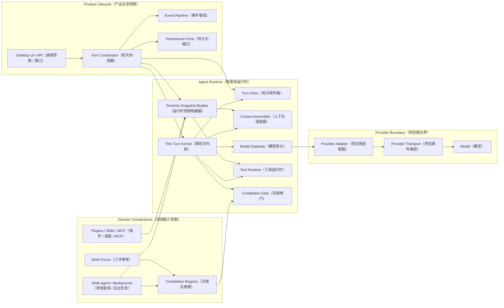

### 4.2 核心依赖方向

```text
Product Lifecycle（产品生命周期）
        ↓
Turn Runtime Ports（轮次运行时端口）
        ↓
Thin Turn Kernel（薄轮次内核）
        ↓
Pure Protocol Types（纯协议类型）
```

外围模块依赖核心协议，核心不能反向依赖外围实现。

禁止的依赖方向：

```text
Turn Kernel → SQLite
Turn Kernel → Plugin Manager
Turn Kernel → Browser Runtime
Turn Kernel → MCP Host
Turn Kernel → Goal Store
Turn Kernel → Subagent Scheduler
```

允许的依赖方向：

```text
Turn Kernel → ModelGateway trait（模型网关接口）
Turn Kernel → ToolRuntime trait（工具运行时接口）
Turn Kernel → ContextAssembler trait（上下文组装接口）
Turn Kernel → CompletionGate trait（完成闸门接口）
Turn Kernel → TurnInbox trait（轮次收件箱接口）
```

---

## 5. Core Domain Model（核心领域模型）

### 5.1 身份层级

| 标识 | 中文含义 | 生命周期 |
| --- | --- | --- |
| `ThreadId` | 会话标识 | 从创建会话到删除会话 |
| `TurnId` | 逻辑轮次标识 | 从一条用户请求开始，到最终完成、失败或取消 |
| `InvocationId` | 运行片段标识 | 一次进程内启动或恢复；暂停后恢复会产生新值 |
| `RoundId` | 模型轮标识 | 一次模型请求与响应 |
| `ToolCallId` | 工具调用标识 | 一个模型工具调用及其唯一结果 |
| `FormId` | 完成表单标识 | 一个 Task List（任务列表）、Goal（目标）或 Pending Handle（待处理句柄） |
| `ProviderCursorId` | 供应商游标标识 | 可丢弃的供应商缓存或续接优化 |

`TurnId` 必须跨审批暂停、用户输入暂停和外部行动暂停保持不变。`InvocationId` 用于区分每次实际运行片段。

### 5.2 Turn State（轮次状态）

```rust
enum TurnPhase {
    ReadyForModel,
    RunningTools,
    FinalCandidate,
    Waiting(WaitReason),
    Completed,
    Failed,
    Cancelled,
}

enum WaitReason {
    Approval,
    UserInput,
    ExternalAction,
}
```

说明：

- `ReadyForModel`：已具备调用模型所需的完整上下文。
- `RunningTools`：正在处理一批模型工具调用。
- `FinalCandidate`：模型已给出最终回答候选，等待机械完成检查。
- `Waiting`：已经形成可持久化的暂停边界。
- `Completed`：最终回答已提交。
- `Failed`：不可恢复的运行时错误。
- `Cancelled`：用户或上层系统取消。

### 5.3 Turn State Machine（轮次状态机）

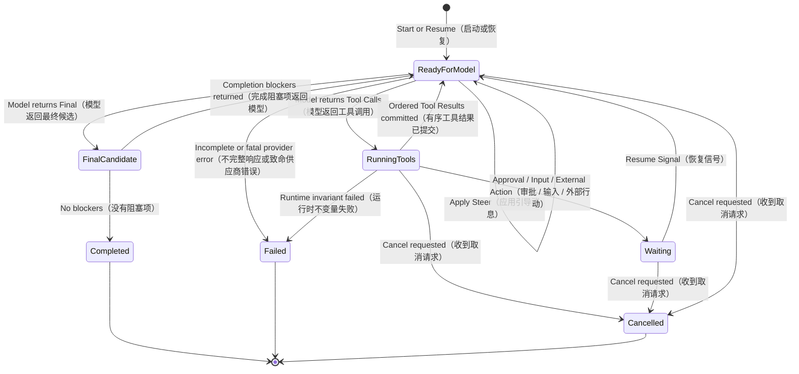

### 5.4 Conversation Ledger（会话账本）与 Event Log（事件日志）

Conversation Ledger（会话账本）和 Event Log（事件日志）必须分离：

| 数据 | 作用 | 是否进入模型上下文 | 是否是语义事实源 |
| --- | --- | --- | --- |
| Conversation Ledger（会话账本） | 保存 User、Assistant、Tool Call、Tool Result 和必要 Harness Observation | 是 | 是 |
| Event Log（事件日志） | UI 展示、调试、Token、流式增量、状态通知 | 默认否 | 否 |

事件日志不能反向驱动 Kernel，也不能被扫描后重新推断会话语义。

### 5.5 TurnCheckpoint（轮次检查点）

暂停时持久化的是控制状态引用，不应复制完整会话和整个工具目录：

```rust
struct TurnCheckpoint {
    turn_id: TurnId,
    invocation_id: InvocationId,
    phase: TurnPhase,
    round: u32,
    pending_call_ids: Vec<ToolCallId>,
    wait: WaitRecord,
    runtime_snapshot_id: RuntimeSnapshotId,
    context_epoch_id: ContextEpochId,
    ledger_cursor: LedgerCursor,
    budget: TurnBudget,
}
```

完整 Conversation（会话）、Tool Result（工具结果）和 Prompt Module（提示词模块）从不可变快照与追加式账本恢复。Provider Cursor（供应商游标）单独保存，失效时可以丢弃并从本地账本重建。

---

## 6. Module Design（模块设计）

### 6.1 Turn Coordinator（轮次协调器）

#### 职责

Turn Coordinator 位于 Server（服务端），拥有产品层 Turn 生命周期：

- 接收用户消息并决定 Start（开始）、Steer（引导当前轮次）或 Enqueue Next（排队到下一轮）。
- 为每个 Thread（会话）保证最多一个正在运行的 Invocation（运行片段）。
- 创建并保持稳定 `TurnId`。
- 创建新的 `InvocationId` 并启动或恢复 Turn Kernel。
- 持久化 Kernel Event（内核事件）和发布 UI Event（界面事件）。
- 在暂停时先持久化 Checkpoint（检查点），再发布 Waiting Event（等待事件）。
- 在终态后启动排队消息。

#### 不负责

- 不解析模型响应。
- 不决定调用哪些工具。
- 不执行 Goal 或 Task List 的完成逻辑。
- 不组装 Provider Wire Request（供应商线协议请求）。

#### 输入与输出

```rust
enum TurnCommand {
    Start { message_id: MessageId },
    Steer { turn_id: TurnId, message_id: MessageId },
    EnqueueNext { message_id: MessageId },
    Resume { turn_id: TurnId, signal: ResumeSignal },
    Cancel { turn_id: TurnId },
}
```

---

### 6.2 Runtime Snapshot Builder（运行时快照构建器）

#### 职责

Runtime Snapshot Builder 在 Turn 启动或授权允许的快照刷新点，将产品配置解析为不可变 Runtime Snapshot（运行时快照）：

```rust
struct RuntimeSnapshot {
    provider: ProviderSelection,
    tool_catalog: ToolCatalogSnapshot,
    capability_projection: CapabilityProjection,
    prompt_modules: Vec<PromptModuleRef>,
    repository_instructions: Vec<InstructionRef>,
    selected_skills: Vec<SkillRef>,
    work_context: WorkContext,
    permission_profile: PermissionProfile,
    prompt_epoch: PromptEpochRef,
}

enum WorkContext {
    Turn,
    Goal { goal_id: GoalId },
}
```

`RuntimeSnapshotId`、`TurnId`、`InvocationId` 等运行控制标识保存在 Control Plane（控制面），不自动序列化到模型上下文。`PromptEpochRef` 使用稳定的内容摘要标识语义版本；只要指令、工具定义和能力没有变化，跨 Turn 复用同一个提示词世代。

#### 数据来源

- Thread 设置。
- Provider 设置和模型选择。
- Sandbox（沙箱）与 Permission Mode（权限模式）。
- Repository Instructions（仓库指令）。
- Agent Template（智能体模板）。
- 已选择 Skill（技能）。
- 已启用 Plugin（插件）及 MCP（模型上下文协议）能力。
- Multi-agent（多智能体）容量与 Agent 身份。

#### 不变量

- 快照创建后不可原地扩权。
- 子 Agent 只能从父快照做 Capability Narrowing（能力收窄）。
- Plugin 只能贡献能力描述，不能直接修改 Kernel 状态机。
- 中途新增工具时创建新的 Catalog Revision（目录修订），不能改写旧快照。
- 随机 ID、请求 ID、Turn 编号、Invocation 编号、构建时间和当前时间不能进入 Cacheable Prompt Prefix（可缓存提示词前缀）。
- `PromptEpochRef` 和 Prompt Module（提示词模块）标识必须是 Content-addressed Identity（内容寻址标识），不能使用每次构建都变化的随机 ID。

---

### 6.3 Thin Turn Kernel（薄轮次内核）

#### 职责

Thin Turn Kernel 是 Agent Core 重构后的主体。它只编排五个端口：

```rust
trait ContextAssembler;
trait ModelGateway;
trait ToolRuntime;
trait CompletionGate;
trait TurnInbox;
```

Kernel 内的主循环伪代码：

```rust
loop {
    apply_safe_inbox_messages();

    let request = context_assembler.compile(turn_state).await?;
    let response = model_gateway.run(request).await?;

    match response.decision() {
        ModelDecision::ToolCalls(calls) => {
            let outcome = tool_runtime.execute_batch(calls).await?;
            match outcome {
                BatchOutcome::Completed(results) => commit_in_model_order(results),
                BatchOutcome::Waiting(wait) => return checkpoint(wait),
            }
        }
        ModelDecision::Final(candidate) => {
            let report = completion_gate.check().await?;
            if report.blockers.is_empty() {
                return complete(candidate, report.reminders);
            }
            append_completion_observation(report.blockers);
        }
        ModelDecision::Incomplete(reason) => return fail(reason),
    }
}
```

#### Kernel（内核）允许的业务知识

Kernel 可以知道：

- 模型返回的是 Final（最终候选）、Tool Calls（工具调用）还是 Incomplete（不完整响应）。
- 工具批次完成、暂停或发生致命错误。
- Completion Gate 是否返回 Blocker（阻塞项），以及需要随终态交付哪些 Reminder（提醒项）。
- Turn 是否收到取消或 Steer。

Kernel 不可以知道：

- 某个工具是不是 Browser、MCP、Shell 或 Subagent。
- 当前是不是 Goal Mode 并据此走另一套循环。
- Plan 中有哪些 Requirement 或 Evidence。
- Plugin 是如何安装和连接的。
- SQLite 表结构。

---

### 6.4 Turn Inbox（轮次收件箱）

#### 职责

Turn Inbox 保存当前 Turn 运行期间到达的控制消息：

```rust
enum InboxItem {
    Steer(UserMessageRef),
    AsyncToolResult(AsyncToolResultRef),
    Reminder(ReminderRef),
    Cancel,
}
```

排队到下一 Turn 的消息不进入 Turn Inbox，而进入 Thread Queue（会话队列）。

#### Safe Point（安全点）

Kernel 只在以下安全点读取 Turn Inbox：

1. 发起模型请求之前。
2. Provider 响应已经完整归一化之后、执行新 Tool Call 之前。
3. 工具调用之间或一个并行批次提交之后。
4. Completion Gate 返回之后、下一次模型请求之前。

后台任务完成时，Turn Inbox 只负责把新的 Async Tool Result（异步工具结果）带到安全点；如果原 Turn 已经结束，结果仍然直接追加到账本，并在下一 Turn 可见，不会重新打开已经完成的 Turn。

#### Steer（引导当前轮次）语义

“立即引导”定义为 At Earliest Safe Point（在最早安全点处理），不是字节级中断 Provider 流。

如果 Steer 到达时：

- Provider 正在流式返回：先完成当前可解析响应，再应用 Steer。
- 工具尚未启动：为未启动调用生成 `cancelled_by_steer` 结果。
- 工具已经启动且有副作用：等待完成或通过工具自己的取消协议取消，并记录实际结果。
- 当前批次完成：按模型顺序提交结果，再追加新的 User Message（用户消息）。

---

### 6.5 Conversation Ledger（会话账本）

#### 职责

Conversation Ledger 是模型可见语义历史的唯一事实源。

推荐条目类型：

```rust
enum LedgerEntry {
    UserMessage(UserMessage),
    AssistantMessage(AssistantMessage),
    ToolCall(CanonicalToolCall),
    ToolResult(CanonicalToolResult),
    AsyncToolResult(AsyncToolResult),
    HarnessObservation(HarnessObservation),
    ContextCheckpoint(ContextCheckpointRef),
}
```

#### 追加规则

- 条目只能追加，不能原地修改。
- 用户排队消息必须带目标 Turn 或可见性游标，当前 Turn 不得提前读取。
- Tool Call 和 Tool Result 通过稳定 `ToolCallId` 一一配对。
- 后台工具的原始 Tool Call 立即得到一次 Accepted（已接受）结果；真正完成时以 `JobId` 关联新的 `AsyncToolResult` 条目，不能伪装成同一 `ToolCallId` 的第二个同步结果。
- `AsyncToolResult` 即使在原 Turn 结束后到达也必须追加；它既可触发 UI Reminder（界面提醒），也会进入下一次模型可见的账本尾部。
- 压缩只创建新的 Context Checkpoint（上下文检查点），不删除原始账本。
- UI 流式 Delta（增量）不直接成为语义账本条目；最终归一化内容才提交。

---

### 6.6 Context Assembler（上下文组装器）

#### 职责

Context Assembler 是唯一可以把 Runtime Snapshot、Conversation Ledger 和当前 Round 状态编译为 Canonical Model Request（规范模型请求）的模块。

#### 上下文分层

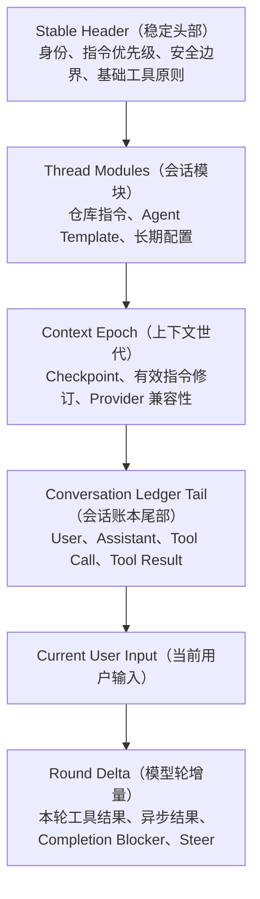

#### Cache（缓存）规则

首先把 Identity（标识）分成两个平面：

| 标识平面 | 示例 | 是否允许进入可缓存前缀 |
| --- | --- | --- |
| Semantic Identity（语义标识） | 指令内容摘要、工具 Schema 摘要、模型配置摘要 | 是；内容不变时字节必须稳定 |
| Control Identity（控制标识） | `TurnId`、`InvocationId`、`RoundId`、请求 ID、时间戳 | 否；只保存在运行状态、日志和事件中 |

具体规则：

1. Stable Header（稳定头部）按 Runtime Build（运行时构建版本）固定，禁止插入当前时间、Turn ID、Round ID、追踪 ID 或随机生成的模块 ID。
2. Thread Modules（会话模块）使用规范化内容的不可变哈希；内容未变时，跨 Turn 的序列化字节和顺序必须完全一致。
3. `RuntimeSnapshotId` 是控制面引用，不是提示词内容。Context Assembler 不得因为新建 Turn 或 Invocation 就把它写进请求正文。
4. Tool Catalog（工具目录）按稳定键排序；工具描述、JSON Schema 和 Provider 工具字段不能混入会话级动态标识。
5. 指令发生语义变化时创建新的 Context Epoch（上下文世代）或追加 Superseding Item（替代条目），不重写历史条目。
6. 动态时间、Git 状态、异步工具结果和临时提醒只追加到 Conversation Tail（会话尾部），不能插入稳定前缀中间。
7. 新 Turn 只在已有会话尾部追加新 User Message（用户消息）；即使 `TurnId` 变化，之前的 Provider-visible Prefix（供应商可见前缀）仍应保持字节一致。
8. Tool Schema（工具模式）优先通过 Provider 原生 `tools` 字段传输，不重复序列化进普通 Prompt；Provider Adapter 需要保证工具列表稳定排序。
9. 每次请求记录 `stable_prefix_hash` 与 `dynamic_tail_hash`，用回归测试证明动态控制状态没有污染前缀。
10. 缓存命中是优化；供应商无法保持缓存时，必须优先保证指令语义正确。

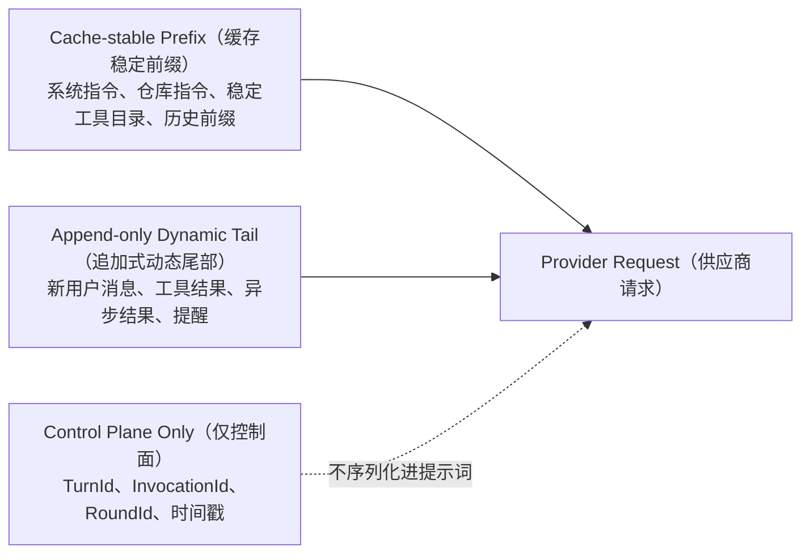

#### Context Compaction（上下文压缩）

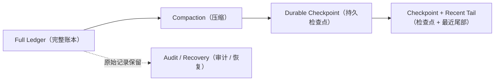

Provider Cursor（供应商游标）与 Durable Checkpoint（持久检查点）是不同机制：前者可以丢弃，后者必须能够恢复语义。

---

### 6.7 Model Gateway（模型网关）与 Provider Adapter（供应商适配器）

#### Canonical Model Protocol（规范模型协议）

Kernel 只理解以下统一请求与事件：

```rust
struct CanonicalModelRequest {
    context: Vec<ContextItem>,
    tools: ToolCatalogSnapshot,
    provider_cursor: Option<ProviderCursor>,
    output_contract: Option<JsonSchema>,
}

enum CanonicalModelEvent {
    TextDelta(String),
    ReasoningDelta(String),
    ToolCallDelta(ToolCallDelta),
    Usage(ModelUsage),
    Completed(ModelCompletion),
}
```

#### Provider Boundary（供应商边界）分层

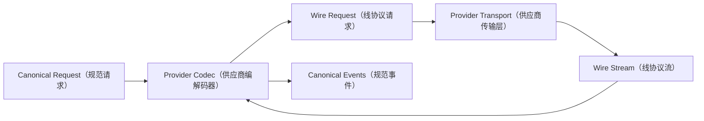

模块职责：

- Provider Codec（供应商编解码器）：角色映射、工具 Schema 映射、流式事件解析、Finish Reason（结束原因）归一化。
- Provider Transport（供应商传输层）：HTTP、SSE、进程通信、超时和网络重试。
- Model Gateway（模型网关）：选择 Adapter、发送请求、将规范事件交给 Kernel 和 Event Pipeline。

#### Capability Negotiation（能力协商）

每个 Adapter 明确声明：

| 能力 | 可能状态 |
| --- | --- |
| System Role（系统角色） | Native（原生）/ Emulated（模拟）/ Unsupported（不支持） |
| Developer Role（开发者角色） | Native / Folded Into System（合并到系统角色）/ Unsupported |
| Function Tools（函数工具） | Native / Compatibility Encoding（兼容编码）/ Unsupported |
| Parallel Tool Calls（并行工具调用） | Supported（支持）/ Unsupported |
| Reasoning Summary（推理摘要） | Supported / Unsupported |
| Provider Cursor（供应商游标） | Stored Response（已存响应）/ Replay Items（重放条目）/ None（无） |

Kernel 不允许根据 Provider 名称或模型名称增加行为分支。

---

### 6.8 Tool Runtime（工具运行时）

#### 完整执行管线

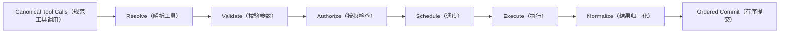

#### Tool Descriptor（工具描述符）

```rust
struct ToolDescriptor {
    name: ToolName,
    description: String,
    input_schema: JsonSchema,
    effect: EffectClass,
    resource_keys: Vec<ResourceKey>,
    parallel_safe: bool,
    background_capable: bool,
}
```

Tool Descriptor 是调度和授权元数据，不应依靠工具名称猜测行为。

#### 动态调用上下文

```rust
struct ToolInvocationContext {
    thread_id: ThreadId,
    turn_id: TurnId,
    invocation_id: InvocationId,
    workspace_root: PathBuf,
    agent_identity: AgentIdentity,
    cancellation: CancellationToken,
    execution_grant: ExecutionGrant,
}
```

Browser Runtime、MCP Host、Artifact Store 等领域依赖由具体 Tool Executor（工具执行器）通过构造器持有，不放进通用上下文。

#### 结果语义

```rust
enum ToolResultStatus {
    Succeeded,
    Failed,
    Denied,
    Cancelled,
    AcceptedInBackground,
}
```

所有预期失败都返回 Canonical Tool Result（规范工具结果）。只有以下错误直接使 Turn 失败：

- 账本无法持久化。
- 工具调用与结果无法配对。
- 安全不变量被破坏。
- Checkpoint 无法创建。
- Runtime Snapshot 无法恢复。

#### Parallel Execution（并行执行）与 Ordered Commit（有序提交）

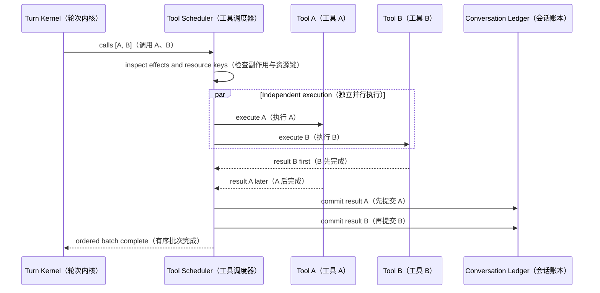

---

### 6.9 Authorization Service（授权服务）与 Approval Decider（审批决策器）

#### 统一决策结果

```rust
enum AuthorizationDecision {
    Allowed(ExecutionGrant),
    Denied { reason: String },
    AwaitingApproval(ApprovalRequest),
}
```

#### Manual（人工）与 Automatic（自动）

- Manual Approval（手动审批）：用户是 Approval Decider（审批决策器）。
- Automatic Review（自动评审）：Guardian 是 Approval Decider 的另一种实现。
- Full Access（完全访问）：仍需要满足固定安全边界和 Capability Projection（能力投影）。

Kernel 不知道审批由用户还是 Guardian 完成，只处理 `Allowed`、`Denied` 或 `AwaitingApproval`。

#### 授权流程图

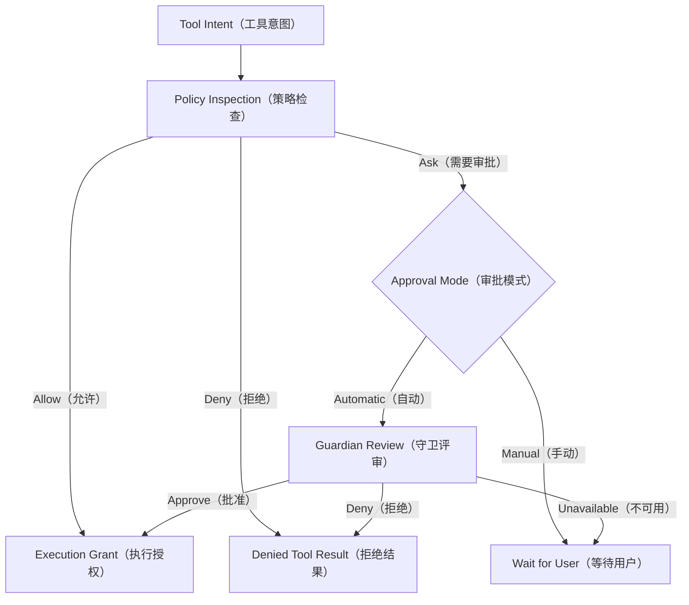

---

### 6.10 Completion Registry（完成注册表）与 Completion Gate（完成闸门）

#### 设计原则

模型返回 Final（最终候选）只表示“模型认为可以结束”，不直接代表 Turn 已完成。

Completion Gate 只检查：

1. 没有尚未提交的 Tool Call。
2. 当前不处于未解决等待状态。
3. 所有已注册 Completion Form（完成表单）都没有 Blocking Item（阻塞项）。

Completion Registry（完成注册表）中的未完成事项必须显式声明 Completion Disposition（完成处置级别）：

```rust
enum CompletionDisposition {
    Blocking, // 阻止当前 Final，并要求模型继续处理
    Advisory, // 不阻止 Final，只产生提醒或后续可见结果
}
```

长时后台任务默认是 `Advisory`。仅仅因为一个后台任务仍在运行，不能阻止模型提交 Final；只有调用方明确声明“当前回答必须依赖该结果”时，才注册为 `Blocking`。

#### Completion Form（完成表单）接口

```rust
trait CompletionForm {
    fn id(&self) -> FormId;
    fn pending_signals(&self) -> Vec<CompletionSignal>;
}

struct CompletionSignal {
    source_id: String,
    disposition: CompletionDisposition,
    message: String,
}

struct CompletionReport {
    blockers: Vec<CompletionSignal>,
    reminders: Vec<CompletionSignal>,
}
```

Completion Gate 只按 `disposition` 分组，不读取 Plan 的业务字段，也不扫描工具 metadata 重新建立证据关系。

#### 典型表单

| 表单或句柄 | 注册时机 | 默认级别 | 完成语义 |
| --- | --- | --- | --- |
| Turn Task List（轮次任务列表） | 模型创建复杂任务列表 | `Blocking` | 仍有 Pending 或 In Progress 项时阻止 Final |
| Goal Work Form（目标工作表单） | Goal 创建或恢复 | `Blocking` | Goal 为 Active 且仍有未解决阻塞项时阻止 Final |
| Child Agent Handle（子智能体句柄） | Spawn Agent 成功 | 由创建请求声明 | 必要子任务可阻塞，探索性子任务只提醒 |
| Background Job Handle（后台任务句柄） | 后台任务被接受 | `Advisory` | 运行中只提醒；完成后追加 Async Tool Result（异步工具结果） |

#### Final Candidate（最终回答候选）流程

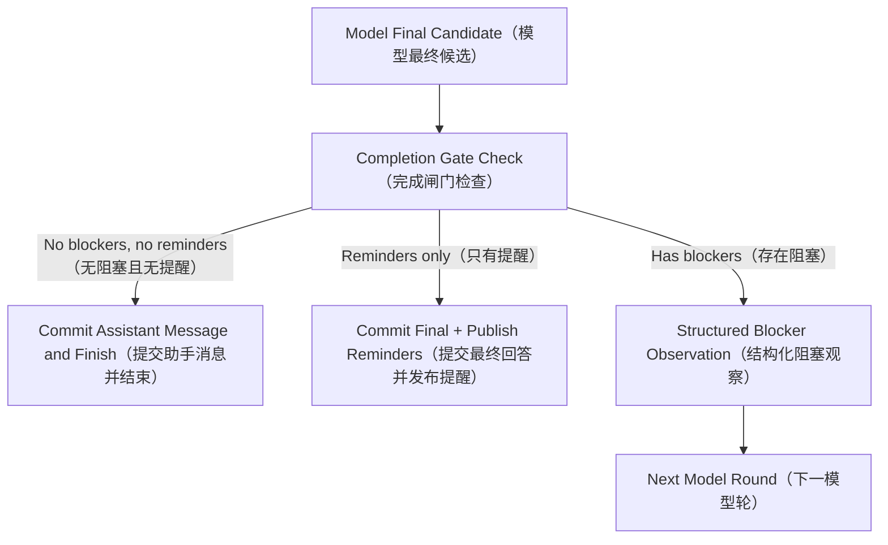

Reminder 不触发 Completion Bounce（完成回弹），也不要求额外模型轮。如果后台结果在模型仍运行时到达，它通过 Turn Inbox 在下一安全点加入上下文；如果在 Turn 结束后到达，则追加到账本并通知 UI，在下一 Turn 自动可见。

如果没有注册任何表单，也没有待处理工具，Final Candidate 直接完成，不应要求额外 `complete_task` 调用。

---

### 6.11 Work Form（工作表单）、Default Task（默认任务）与 Goal（目标）

#### 统一数据模型

```rust
struct WorkForm {
    id: FormId,
    scope: WorkScope,
    objective: Option<String>,
    constraints: Vec<String>,
    acceptance: Vec<String>,
    status: WorkStatus,
    revision: u64,
    items: Vec<WorkItem>,
}

enum WorkScope {
    Turn(TurnId),
    Goal(GoalId),
}

struct WorkItem {
    id: String,
    title: String,
    status: WorkItemStatus,
    completion_disposition: CompletionDisposition,
    depends_on: Vec<String>,
    note: Option<String>,
    evidence_refs: Vec<EvidenceRef>,
}
```

#### 不同模式如何复用

| 场景 | 是否创建 Work Form | 持久级别 | 完成规则 |
| --- | --- | --- | --- |
| Default 简单任务 | 否 | 无 | 模型 Final 直接结束 |
| Default 复杂任务 | 可选 | Turn | 所有阻塞项解决后结束 |
| 模型发起用户决策 | 默认否 | 当前 Turn 的 Wait Record | 用户选择后恢复同一 Turn 并继续执行 |
| Goal Mode（目标模式） | 是 | Goal | Goal 表单完成、阻塞或暂停 |

#### Model-driven Plan（模型驱动规划）的准确定位

Plan 不是强制 Run Profile（运行配置），也不是“只规划、不执行”的独立循环。它是模型在普通执行过程中按需采用的推理与交互行为：

```rust
enum WorkContext {
    Turn,
    Goal { goal_id: GoalId },
}
```

当模型识别到两个或多个实质性方向，并且选择会明显影响范围、成本、风险或最终产物时，可以：

1. 先使用必要的只读或低风险工具调查上下文。
2. 形成 2–3 个清晰、互斥、带影响说明的选项。
3. 调用 `request_user_input` 工具，让 Turn 进入可恢复的 Waiting User Input（等待用户输入）状态。
4. 收到选择后恢复同一个 Turn，必要时调用 `update_plan` 更新执行计划。
5. 继续调用执行工具并完成原任务，而不是把“给出计划”当成默认终点。

是否需要向用户选择由模型判断，Harness 不根据任务类型强制切换 Plan Mode。没有实质性分岔时，模型应直接执行。用户明确要求“只给方案、不执行”时，停止执行来自用户意图，而不是来自架构中的 `PlanOnly` 模式。

`request_user_input` 是通用的可暂停工具；`update_plan` 是可选的可视化进度工具。二者都复用普通 Agent Loop（智能体循环），不会改变 Tool Runtime、Completion Gate 或权限模型。

#### Goal Work Form（目标工作表单）注册完成守卫

Goal 创建或恢复时，Turn Coordinator 必须把同一个 Goal Work Form 注册到 Completion Registry：

```rust
let goal_form = goal_store.load(goal_id).await?;
completion_registry.register(GoalCompletionForm::new(goal_form.id));
```

`GoalCompletionForm` 通过 `FormId` 读取权威 Work Form，不复制 Goal 状态：

- `Active` 且存在未完成的 `Blocking` Work Item：阻止当前 Final，并把结构化阻塞项返回模型。
- `Active` 但只剩 `Advisory` Work Item：允许 Final，同时发布提醒。
- `Completed`：允许 Goal 正常完成。
- `Blocked`、`Paused` 或 `Cancelled`：允许当前 Invocation（运行片段）结束，但保留 Goal 自身的非完成状态。

因此 Goal 的工作表单就是结束守卫的数据源，不再额外维护一份 Goal Completion Guard（目标完成守卫）投影。

#### Goal（目标）状态模型

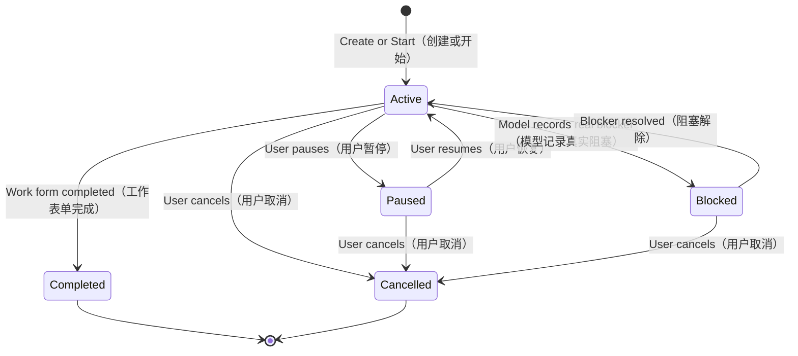

推荐删除或外移：

- `Draft` 和 `Ready`：属于创建 UI 流程，不是运行状态。
- `Failed`：属于一次 Invocation 的结果；Goal 本身应转为 `Blocked` 或保持 `Active`。

#### Goal（目标）修改入口

- Pause、Resume、Cancel 等确定性控制由用户 UI 直接发 Goal Command（目标命令），不需要模型调用。
- 修改 objective、constraints 或 acceptance 等语义内容时，追加明确的 Goal Edit User Message（目标修改用户消息），由模型调用 Goal Tool（目标工具）更新表单。
- 普通会话输入仍是 User Message；模型根据语义决定是否更新 Goal。

---

### 6.12 Multi-agent（多智能体）与 Background Job（后台任务）

#### Multi-agent（多智能体）是工具能力，不是 Kernel（内核）分支

Multi-agent Runtime（多智能体运行时）通过 Tool Registry 贡献：

- `spawn_agent`
- `send_message`
- `followup_task`
- `interrupt_agent`
- `wait_agent`
- `list_agents`

父 Kernel 不识别这些工具名称。

Spawn 成功后：

1. 返回正常 Tool Result。
2. 注册 Child Agent Handle（子智能体句柄）。
3. 子 Agent 在更窄的 Runtime Snapshot 下运行同一个 Turn Kernel。
4. 终态结果通过 Harness Observation 追加到父账本。
5. 必要结果被读取或整合后，完成句柄解除阻塞。

#### Background Job（后台任务）的工具配对规则

原始 Tool Call 必须立即得到一个 Accepted Tool Result（已接受工具结果），使模型可以继续推理或直接完成：

```json
{
  "status": "accepted_in_background",
  "jobId": "job-123"
}
```

任务完成后追加：

```text
LedgerEntry::AsyncToolResult {
    job_id,
    source_tool,
    status,
    output,
    completed_at,
}
```

这里的 `AsyncToolResult` 是以 `JobId` 关联的新增账本条目，不是同一 `ToolCallId` 的第二个同步 Tool Result，因此不会破坏 Provider 的工具调用配对协议。Provider 不支持原生异步工具结果时，Provider Adapter 将其编码为结构化的模型可见消息，但 Conversation Ledger 中仍保留工具结果类型。

后台句柄默认注册为 `Advisory`：

- 仍在运行时，Completion Gate 允许模型 Final，并向 UI 发布“后台任务仍在运行”的提醒。
- 在当前 Turn 结束前完成，`AsyncToolResult` 通过 Turn Inbox 在安全点追加；如果后续本来就有模型轮则可见，但它本身不额外触发模型轮。
- 在当前 Turn 结束后完成，仍然追加到账本、发布完成提醒，并在下一 Turn 对模型可见。
- 只有调用方显式声明结果是当前回答的必要前置条件时，相关 Work Item 或句柄才使用 `Blocking`。

#### Multi-agent（多智能体）与后台任务流程

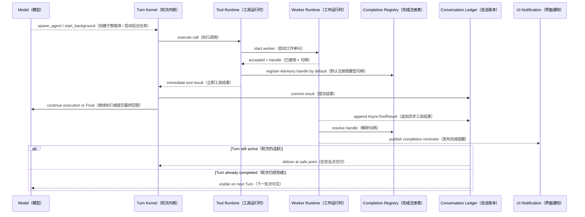

---

### 6.13 Plugin（插件）、Skill（技能）与 MCP Composition（MCP 组合）

#### Plugin Contribution（插件贡献）

Plugin 可以贡献：

- Tool Descriptor 与 Tool Executor（工具描述符与执行器）。
- Skill Descriptor（技能描述符）和 Skill Instructions（技能指令）。
- MCP Server Binding（MCP 服务器绑定）。
- Prompt Module（提示词模块）。
- Capability Metadata（能力元数据）。

Plugin 不可以：

- 修改 Turn Kernel 状态机。
- 绕过 Authorization Service。
- 扩大 Runtime Snapshot 中未授予的能力。
- 直接把动态文本插入历史中间位置。
- 注册新的 Provider Transport，除非通过单独的受信 Provider Driver 机制。

#### 组合流程

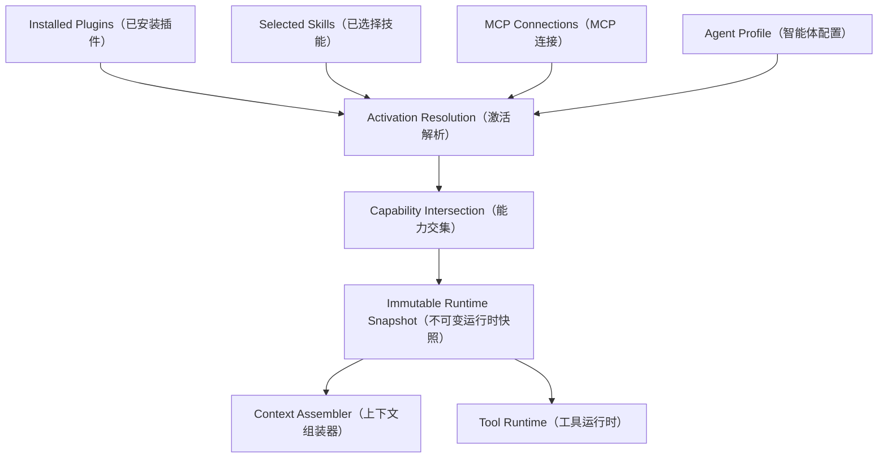

---

### 6.14 Persistence Ports（持久化端口）与 Event Pipeline（事件管线）

#### 拆分宽 `SessionStore`（会话存储接口）

目标不是马上拆数据库实现，而是先拆调用接口：

```rust
trait ConversationLedgerStore;
trait TurnStore;
trait TurnCheckpointStore;
trait ApprovalStore;
trait WorkFormStore;
trait ArtifactStore;
trait ProviderCursorStore;
trait EventStore;
```

同一个 `SqliteSessionStore` 可以暂时实现全部接口，但调用方只能持有所需的窄端口。

#### 事件顺序不变量

对于暂停边界：

```text
1. Commit Tool Call / Tool Result（提交工具调用 / 结果）
2. Persist Approval or Input Request（持久化审批或输入请求）
3. Persist TurnCheckpoint（持久化轮次检查点）
4. Persist Waiting Event（持久化等待事件）
5. Publish Waiting Event（发布等待事件）
```

客户端不能先看到一个无法恢复的等待状态。

---

## 7. End-to-End Flows（端到端流程）

### 7.1 新 Turn（轮次）完整流程

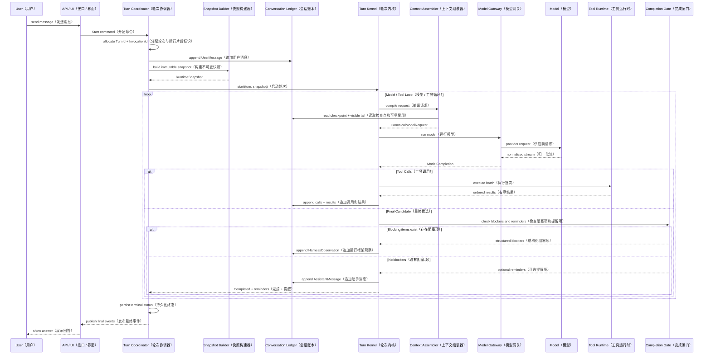

### 7.2 工具调用、审批与恢复流程

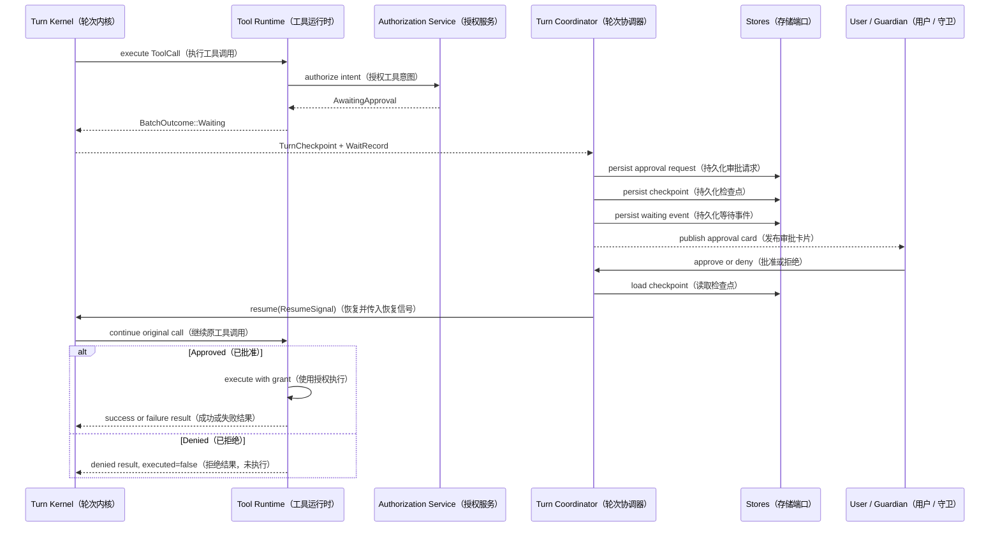

### 7.3 模型按需规划、用户选择与继续执行

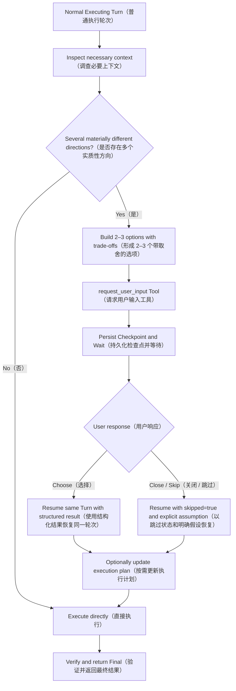

Plan/选择卡片被关闭时需要统一产品语义。推荐保存 `skipped=true` 的工具结果并恢复，让模型采用推荐选项或写明假设后继续执行；如果产品决定关闭即停止，也应产生明确 Cancel/Stop Signal（取消/停止信号），不能留下不可恢复的 Waiting 状态。

### 7.4 用户输入 Start（启动）、Steer（引导当前轮次）与 Queue（排队）

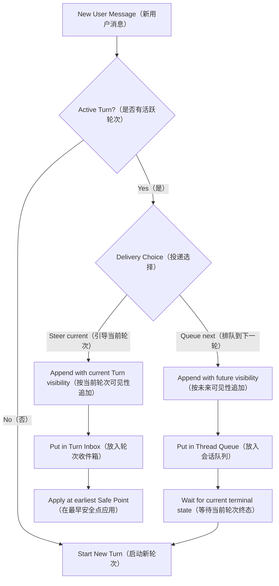

### 7.5 Goal（目标）执行与用户暂停

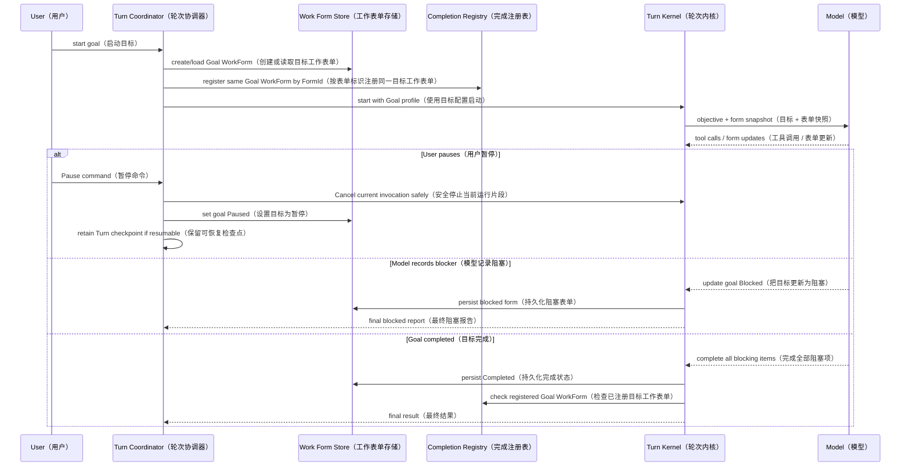

### 7.6 Provider Failure（供应商失败）、Network Failure（网络失败）与 Incomplete Response（不完整响应）

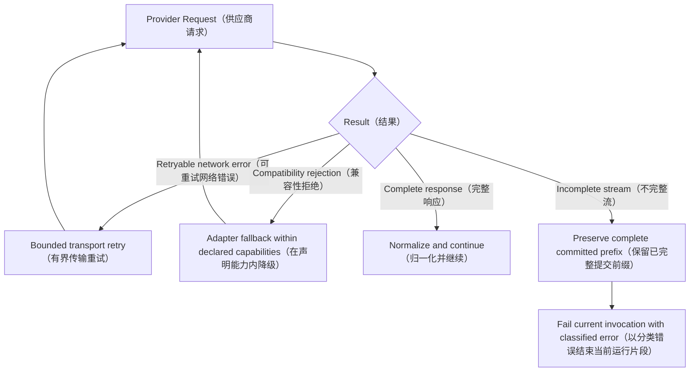

Adapter 不能把 Length Limit（长度限制）、Content Filter（内容过滤）或 Stream Interrupted（流中断）伪装成正常 Final。

### 7.7 Crash Recovery（崩溃恢复）

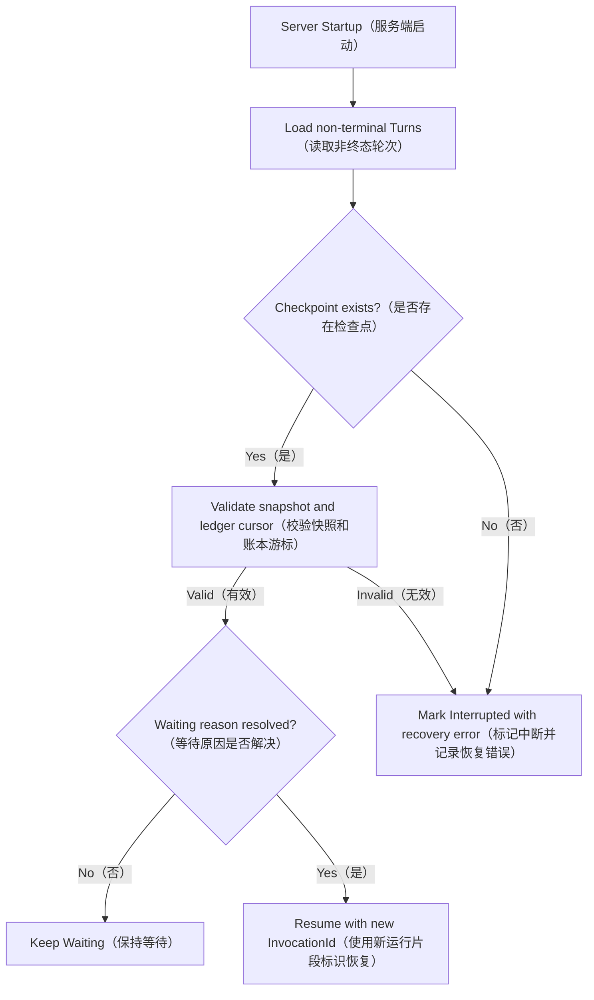

不能只因为进程重启就把 Waiting Approval（等待审批）或 Waiting User Input（等待用户输入）标记为失败。

---

## 8. Error and Cancellation Semantics（错误与取消语义）

### 8.1 错误分类

| 类别 | 示例 | 处理方式 |
| --- | --- | --- |
| Provider Transport Error（供应商传输错误） | 网络中断、超时 | 有界重试，失败后结束 Invocation |
| Provider Protocol Error（供应商协议错误） | 非法 Tool Call、流未终止 | 返回分类错误；不能伪装完成 |
| Tool Business Failure（工具业务失败） | 文件不存在、命令退出码非零 | 规范 Tool Result 返回模型 |
| Authorization Denial（授权拒绝） | 用户拒绝、策略禁止 | `executed=false` Tool Result |
| Runtime Invariant Failure（运行时不变量失败） | 结果无法配对、账本写入失败 | Turn Failed（轮次失败） |
| User Cancellation（用户取消） | 停止按钮 | 停止新工作，清理已启动工作并记录真实结果 |
| Goal Blocker（目标阻塞） | 缺少外部权限或必要输入 | Goal Blocked（目标阻塞），不是运行时失败 |

### 8.2 取消原则

1. 不启动新的 Tool Call。
2. 请求可取消工具停止。
3. 已经发生的副作用必须记录，不能假装未执行。
4. 未执行调用获得 Cancelled Tool Result（已取消工具结果）。
5. 提交完整结尾事件后进入 `Cancelled`。
6. Goal 的用户暂停与 Turn 取消分开：暂停 Goal 通常取消当前 Invocation，但 Goal 状态设为 `Paused`。

---

## 9. Current-to-Target Mapping（当前到目标的映射）

| 当前实现 | 目标归属 | 最终删除或简化内容 |
| --- | --- | --- |
| `AgentCore` 大量配置字段 | `RuntimeSnapshot` + 窄端口 | Browser、Computer、MCP、Subagent、Plugin、Goal 等直接字段 |
| `apply_collaboration_mode` | `WorkContext` + Prompt Module | Kernel 内固定 Plan 分支和 Goal 专用循环 |
| 服务端与 Core 双重 Context 组装 | `ContextAssembler` | 第二套追加和排序逻辑 |
| `ModelRequest` 多份并行历史表示 | Canonical Model Request | `system_prompt`、`conversation`、`context_items` 的长期重复表示 |
| `ToolContext` 宽上下文 | `ToolInvocationContext` + Executor 构造器注入 | Store、Browser、MCP 等通用字段 |
| `SessionStore` God Interface（上帝接口） | 多个 Persistence Port | 调用方依赖完整 Store 接口 |
| `TaskPlan` + `GoalTask` | `WorkForm` | 双状态、投影和同步代码 |
| `complete_task` | Model Final + Completion Gate | 额外完成工具轮次 |
| Plan/Evidence Completion Guard | 通用 Completion Form | Guard 中业务字段扫描和工具 metadata 反查 |
| 多套 Resume 方法 | `resume(turn_id, ResumeSignal)` | 审批和输入的重复恢复入口 |
| Background 二次补同步 Tool Result | 立即 Accepted Result + `AsyncToolResult` | 同一 `ToolCallId` 多同步结果风险，同时保留后台完成输出 |
| Kernel 中 Subagent 特判 | 普通工具 + Pending Handle | `is_subagent_tool` 等工具名称分支 |
| Plugin 激活状态进入 AgentCore | Snapshot Builder | Core 直接管理插件状态 |

---

## 10. Proposed Source Layout（建议源码布局）

第一阶段只做模块拆分，不立即拆 Crate：

```text
crates/opentopia-core/src/
  agent_runtime/
    mod.rs                    # 公共运行入口
    kernel.rs                 # Thin Turn Kernel（薄轮次内核）
    state.rs                  # TurnState / TurnPhase（轮次状态）
    protocol.rs               # Kernel 命令、事件与结果
    checkpoint.rs             # TurnCheckpoint（轮次检查点）
    inbox.rs                  # Turn Inbox 端口

  context_runtime/
    assembler.rs              # Context Assembler（上下文组装器）
    ledger.rs                 # Conversation Ledger 协议
    cache.rs                  # Context Epoch 与缓存键

  model_gateway/
    mod.rs                    # Canonical Model Protocol（规范模型协议）
    provider_adapter.rs       # Provider Adapter 接口
    transport.rs              # Provider Transport 接口
    openai_chat.rs            # OpenAI Chat 编解码
    openai_responses.rs       # OpenAI Responses 编解码
    anthropic.rs              # Anthropic Messages 编解码

  tool_runtime/
    registry.rs               # Tool Registry（工具注册表）
    authorization.rs          # Authorization Service（授权服务）
    scheduler.rs              # Tool Scheduler（工具调度器）
    executor.rs               # Tool Executor 调用
    result.rs                 # Tool Result 归一化
    async_result.rs           # 后台任务完成结果追加

  completion/
    registry.rs               # Completion Registry（完成注册表）
    gate.rs                   # Completion Gate（完成闸门）
    signal.rs                 # Blocking / Advisory 完成信号
    work_form.rs              # WorkForm / WorkItem

crates/opentopia-server/src/
  turns/
    coordinator.rs            # Turn Coordinator（轮次协调器）
    runner.rs                 # 启动、恢复和事件排空
    queue.rs                  # Thread Queue（会话队列）
    persistence.rs            # 窄 Store 端口适配
```

等依赖图稳定后，再评估是否拆出独立 Crate。不能把“文件拆开”当成架构已经解耦。

---

## 11. Migration Plan（迁移计划）

### Phase 0：Behavior Freeze（行为冻结）

目标：建立迁移基线，不改变行为。

工作：

- 固化新 Turn、Tool Batch、Approval、User Input、Goal Resume 和 Provider Cursor 测试。
- 记录当前模型轮次、工具调用、完成回弹、暂停恢复和事件顺序。
- 为关键结构生成兼容序列化样例。
- 记录跨 Turn 的 `stable_prefix_hash`，建立缓存命中基线。
- 固化后台任务“立即接受、非阻塞 Final、完成后追加结果”的回放样例。

退出条件：

- 核心与服务端测试稳定。
- 关键 Continuation（续接状态）具备回放样例。

### Phase 1：Introduce Ports（引入端口）

目标：先改变依赖方向，不改变执行行为。

工作：

- 引入 `ContextAssembler`、`ModelGateway`、`ToolRuntime`、`CompletionGate`、`TurnInbox` 接口。
- 旧 `AgentCore` 通过 Adapter（适配器）调用现有实现。
- Server 通过统一 `AgentTurnDriver` 启动新旧实现。

退出条件：

- Kernel 入口只依赖五个端口。
- 现有测试和事件序列不变。

### Phase 2：Extract Tool Runtime（提取工具运行时）

目标：移除 AgentCore 对具体工具运行时的直接依赖。

工作：

- 把参数校验、Authorization、Guardian、审批、调度、执行和结果归一化移动到 Tool Runtime。
- 工具 Executor 使用构造器注入领域服务。
- 保留现有并行执行和有序提交行为。
- 引入 Accepted Tool Result 与 `AsyncToolResult` 的分离协议，后台完成结果按 `JobId` 追加到账本。

退出条件：

- Kernel 不 import Browser、Computer、MCP、Subagent、Background 和 Guardian。
- 所有 Provider Tool Call 在成功、失败、拒绝、取消和后台接受时都有唯一同步结果；后台终态以独立异步结果追加。

### Phase 3：Unify Context and Provider Protocol（统一上下文与供应商协议）

目标：建立一个上下文事实源和一个规范模型协议。

工作：

- Context Assembler 成为唯一请求组装入口。
- Provider 拆分 Codec（编解码器）与 Transport（传输层）。
- 逐步弃用 `ModelRequest` 的重复字段。
- 保持旧 Provider Driver 的兼容外观。
- 把 Control Identity（控制标识）从模型可见上下文中移除，并稳定 Tool Catalog 和 Prompt Module 的序列化顺序。

退出条件：

- Context Hash（上下文哈希）可以解释每一个输入项。
- 仅改变 `TurnId`、`InvocationId`、`RoundId` 或时间戳时，`stable_prefix_hash` 必须保持不变。
- 新 Turn 追加用户消息时，之前的供应商可见前缀必须字节一致。
- Adapter 测试覆盖角色降级、工具映射、推理增量和不完整响应。

#### Phase 2 / Phase 3 实现结果（2026-08-15）

状态：**Completed（已完成）**。这里的“完成”指 Phase 2、Phase 3 的边界和退出条件已经落地；`LegacyToolExecutor` 与旧 `ModelProvider` 外观仍作为兼容适配器保留，它们的删除属于后续清理阶段，不再是 Kernel 的运行时依赖。

Phase 2 已落地：

- `ToolRuntime` 现在拥有 Provider Tool Call（供应商工具调用）的参数校验、授权预检、Guardian Review（守卫审查）、调度、单调用执行、批次执行、Effect Journal（副作用日志）、结果归一化以及后台完成挂接。
- `execute_provider_batch` 并发执行独立调用，但按 Provider 原始调用顺序返回 `ProviderToolExecutionReport`；事件也延迟到有序提交点发布。
- 旧 `Tool` 实现通过构造器注入的 `LegacyToolExecutor` 执行。宽 `ToolContext` 只存在于兼容边界内，执行器不能回读 `AgentCore` 的可变循环状态。
- Detached Job（分离后台任务）首先返回唯一的 `AcceptedToolResult`；终态使用独立的 `AsyncToolResult`，以 `JobId` 关联并追加到 Durable Ledger（持久账本）与 `TurnInbox`，不会阻塞模型 Final（最终回答）。
- Effect Replay（副作用回放）、Reconciliation（对账）、拒绝、执行失败和后台接受都在 Tool Runtime 内生成规范同步结果；`AgentCore` 不再实现 Effect Journal 或并行 `join_all`。
- `TurnKernel` 的架构守卫测试禁止导入 Browser、Computer、MCP、Subagent、Background、Guardian 和具体 Tool 模块。

Phase 3 已落地：

- `ContextAssembler::prepare_context` 是 Lineage Module（谱系模块）、Tool Search Protocol（工具搜索协议）和 Prompt Cache Key（提示缓存键）的唯一准备入口；`ContextAssembler::compile` 是 `CanonicalModelRequest`（规范模型请求）的唯一 Agent 请求组装入口。
- `ContextAssemblyManifest` 为每次请求提供 `context_hash`、`stable_prefix_hash`、`dynamic_tail_hash`、逐项 Content Hash（内容哈希）以及 `provider_prefix_segments`（供应商前缀分段）。因此可以解释每个输入项，也可以直接验证跨 Turn 的追加式前缀不变量。
- `stable_prefix_hash` 只哈希供应商实际可见的 Stable/Thread 指令字节与规范排序后的 Tool Catalog（工具目录）。`TurnId`、`InvocationId`、`RoundId`、Provider Call Id、时间戳和 Provider Cursor（供应商游标）只允许进入 Dynamic Tail（动态尾部）或控制面。
- Tool Catalog 按 Disclosure（披露方式）、Namespace（命名空间）和 Name（名称）规范排序；Prompt Module 按 Cache Scope（缓存范围）稳定放置。仅改变工具调用 ID 不会改变稳定前缀。
- `ModelGateway` 已拆成 `ProviderCodec`（供应商编解码器）与 `ProviderTransport`（供应商传输层）。`LegacyProviderCodec` / `LegacyProviderTransport` 保留旧 Driver 行为，但编码和 I/O 已可独立替换、测试。
- Guardian Review、Thread Title（会话标题）和 Context Compaction（上下文压缩）等辅助模型调用也通过 Canonical Request + Model Gateway，不再在产品层直接构造 `ModelRequest`。
- `ModelRequest` 现在是 Provider 兼容层的 Legacy Logical Shape（旧逻辑形状）；Agent Runtime 的规范事实源是 `CanonicalModelRequest`，后续可以在不改变 Kernel 的情况下逐项删除重复字段。

对应回归：

- Tool Runtime：并发完成顺序与 Provider 有序提交、同步 Call Id 唯一性、Accepted/Async 不复用关联 ID、后台终态精确追加一次。
- Context：动态 Turn 尾部不改写稳定前缀、控制 ID 只改变动态哈希、工具目录顺序规范化、新 Turn 保留此前全部 Provider Prefix Segment（供应商前缀分段）。
- Provider Adapter：Developer Role Fallback（开发者角色降级）、Tool Schema/Call Mapping（工具映射）、Reasoning Delta（推理增量）、Incomplete Response（不完整响应）以及 Codec/Transport 独立组合。

### Phase 4：Unify Work Forms（统一工作表单）

目标：删除 Default Task 和 Goal 的双模型。

工作：

- 新增 WorkForm Store（工作表单存储）。
- `set_plan` / `update_plan` 暂时映射到 WorkForm Command（工作表单命令）。
- GoalSnapshot 暂时从 WorkForm 投影，进入兼容双读阶段。
- Goal 创建或恢复时，把同一个 Goal Work Form 按 `FormId` 注册到 Completion Registry。
- Completion Gate 改为读取 Completion Registry，并只按 `Blocking` / `Advisory` 分类。
- 删除 `PlanOnly` 强制分支；`request_user_input` 作为模型按需调用的通用交互工具，恢复后继续执行原任务。
- 停止要求普通任务调用 `complete_task`。

退出条件：

- Goal 恢复、修订、暂停和阻塞测试全部通过。
- Goal Work Form 是结束守卫的唯一事实源，不存在第二份 Guard 投影。
- 模型请求用户选择、恢复并继续执行的完整链路通过。
- Guard 不再包含 Plan Requirement/Evidence 的业务扫描。

### Phase 5：Unify Turn Lifecycle and Steer（统一轮次生命周期与引导输入）

目标：稳定 Turn 身份并支持当前轮次引导。

工作：

- 引入稳定 `TurnId` 与递增 `InvocationId`。
- 将审批和用户输入恢复统一为 `ResumeSignal`。
- 建立 Turn Inbox 和 Thread Queue 的明确分流。
- 实现最早安全点 Steer。

退出条件：

- 暂停恢复不创建新的逻辑 Turn。
- Steer 不产生孤立 Tool Call 或重复副作用。
- Queue Next 消息不会进入当前 Turn 上下文。

#### Phase 4 实现结果（2026-08-16）

状态：**Completed（已完成）**。P4 完成时旧 Plan/Goal 表只作为待删除兼容存储存在；P6 已删除这些表与投影。

落地模块：

| Module（模块） | Responsibility（职责） |
| --- | --- |
| `work_form.rs` | 定义 `WorkForm / WorkItem / WorkScope`（工作表单、工作项、工作作用域）以及稳定 `FormId`；普通复杂 Turn 与 Goal 复用同一模型 |
| `store.rs` | 提供 WorkForm Store（工作表单存储）；Goal 创建、状态变更、崩溃恢复和 Plan 兼容更新都同步同一个 Goal WorkForm |
| `tool_runtime.rs` | 把 `set_plan / update_plan` 的旧输入翻译为 `WorkFormCommand::SyncTaskPlan`（同步任务计划命令），不让 Plan 数据模型继续扩散 |
| `completion_runtime.rs` | 提供 `CompletionRegistry`（完成注册表）和 `CompletionGate`（完成闸门）；Registry 从 WorkForm 生成信号，Gate 只分类 `Blocking / Advisory`（阻塞/提醒） |
| `agent/completion_guard.rs` | 每次 Final Candidate（最终回答候选）检查时，按稳定 FormId 读取并注册当前 Turn/Goal WorkForm；不扫描 Requirement、Evidence 或 Plan Step 业务字段 |
| `agent.rs` / `tool_surface.rs` | 删除 Plan 的只读运行语义；`request_user_input` 由根模型按需调用，恢复后继续执行；普通任务不再被要求调用 `complete_task` |

兼容边界只有两处：

1. `TaskPlan -> WorkForm`：旧工具和旧事件进入系统时单向翻译；Completion Gate 不读取 TaskPlan。
2. `WorkForm -> GoalSnapshot`：旧 API 暂时读取投影；Attempt Count（尝试次数）等旧执行记录合并到投影中，但完成状态来自 WorkForm。

```mermaid
flowchart LR
    M["Model（模型）"]
    PC["set_plan / update_plan<br/>Legacy Plan Command（旧计划命令）"]
    WC["WorkFormCommand<br/>工作表单命令适配器"]
    WS["WorkForm Store<br/>工作表单存储"]
    WF["Same WorkForm + stable FormId<br/>同一工作表单与稳定表单标识"]
    CR["Completion Registry<br/>完成注册表"]
    CG["Completion Gate<br/>完成闸门"]
    B["Blocking<br/>阻止 Final 并返回模型"]
    A["Advisory<br/>仅提醒，不阻止 Final"]
    GS["GoalSnapshot Projection<br/>目标快照兼容投影"]

    M --> PC --> WC --> WS --> WF
    WF --> CR --> CG
    CG --> B
    CG --> A
    WF -. "compatibility read（兼容读取）" .-> GS
```

Goal Lifecycle（目标生命周期）现在遵循同一事实源：

```mermaid
sequenceDiagram
    participant TC as Turn Coordinator（轮次协调器）
    participant WS as WorkForm Store（工作表单存储）
    participant CR as Completion Registry（完成注册表）
    participant CG as Completion Gate（完成闸门）
    participant M as Model（模型）

    TC->>WS: create/load Goal WorkForm by FormId（按表单标识创建或读取）
    WS-->>TC: same durable WorkForm（同一持久工作表单）
    TC->>CR: register current WorkForm（注册当前工作表单）
    M->>WS: WorkForm command: revise/pause/block/complete（修订、暂停、阻塞或完成）
    M-->>CG: Final Candidate（最终回答候选）
    CG->>CR: resolve registered signals（解析已注册信号）
    CR->>WS: read same FormId（读取同一表单标识）
    alt Blocking item exists（存在阻塞项）
        CG-->>M: reject candidate + structured blocker（拒绝候选并返回结构化阻塞项）
    else Advisory only or ready（仅提醒或已就绪）
        CG-->>TC: allow invocation end（允许本次调用结束）
    end
```

Phase 4 退出条件验证：

- Goal create/revise/pause/block/crash-recovery（创建、修订、暂停、阻塞、崩溃恢复）均通过 WorkForm Store。
- `Goal WorkForm` 是 Completion Registry 的唯一 Goal 工作状态来源；旧 GoalSnapshot 仅为输出投影。
- Default complex task（普通复杂任务）使用 `WorkScope::Turn(TurnId)`；Goal 使用 `WorkScope::Goal(GoalId)`。二者共享 schema，但 FormId 命名空间不同，不会冲突。
- `request_user_input` 在 Default、Plan、Goal 根模型中均可按需使用；用户回答后恢复原 Turn 并继续执行。
- Completion Guard 源码守卫测试禁止重新引入 `TaskPlanStepStatus`、`TaskEvidenceKind`、`requirements_uncovered`、`plan_evidence_invalid` 和 `plan_missing` 扫描。

#### Phase 5 实现结果（2026-08-16）

状态：**Completed（已完成）**。

身份与恢复模型：

- `TurnId（逻辑轮次标识）`：从用户请求开始到最终终态保持不变。
- `InvocationId（调用片段序号）`：初次执行为 1，每次从 Approval（审批）或 User Input（用户输入）恢复时递增。
- `AgentResumeSignal（智能体恢复信号）`：统一承载 Approval 与 UserInput；Server 不再为两种恢复创建两套 Turn 生命周期。
- `AgentContinuation（智能体续接点）`：同时持久化 TurnId 与 InvocationId；旧续接数据通过 serde 默认值兼容。
- TurnId、InvocationId、RoundId 和 Provider Call Id 都属于 Control Identity（控制标识），不会写入 Cacheable Prompt Prefix（可缓存提示词前缀）。

```mermaid
sequenceDiagram
    participant S as Server / Turn Coordinator（服务端/轮次协调器）
    participant DB as Turn Store（轮次存储）
    participant K as Turn Kernel（轮次内核）
    participant U as User Boundary（用户交互边界）

    S->>DB: begin Turn T, Invocation 1（启动逻辑轮次 T）
    S->>K: run T/1
    K-->>S: Waiting + durable continuation（等待并持久化续接点）
    S->>DB: status = waiting
    U->>S: ResumeSignal（审批或用户答案）
    S->>DB: resume same Turn T（恢复同一逻辑轮次）
    DB-->>S: T, Invocation 2
    S->>K: resume continuation with signal（携带信号恢复续接点）
    K-->>S: Final / Waiting / Cancelled（最终、再次等待或取消）
```

输入分流由显式 `MessageDelivery（消息投递方式）` 决定：

```mermaid
flowchart TD
    U["Incoming user message<br/>新用户消息"]
    D{"MessageDelivery<br/>消息投递方式"}
    ST["steer_current<br/>引导当前轮次"]
    QN["queue_next<br/>排队下一轮（默认）"]
    AI["Active Turn lookup<br/>查找运行中的轮次"]
    IN["Turn Inbox keyed by TurnId<br/>按轮次标识隔离的收件箱"]
    SP["Earliest Safe Point<br/>最早安全点"]
    PP{"Provider response parsed?<br/>供应商响应是否已完整解析"}
    DT["Discard unstarted calls<br/>丢弃尚未启动的调用"]
    CT["Commit started batch in order<br/>已启动批次按序收尾"]
    NM["Append steer observation and call model<br/>追加引导观察并再次调用模型"]
    TQ["Thread Queue<br/>会话队列"]
    TF["Current Turn terminal<br/>当前轮次终态"]
    NT["Start new TurnId<br/>启动新的逻辑轮次"]

    U --> D
    D --> ST --> AI --> IN --> SP --> PP
    PP -->|"parsed, calls not started（已解析、调用未启动）"| DT --> NM
    PP -->|"batch already started（批次已启动）"| CT --> NM
    D --> QN --> TQ --> TF --> NT
```

Safe Point（安全点）语义：

1. Provider 响应未形成完整协议项时不注入 Steer。
2. 响应完成解析、工具尚未启动时，优先消费 Steer，丢弃该响应建议的未启动 Tool Calls，再进入下一模型轮。
3. 工具批次已经启动时，真实收集并按 Provider 原顺序提交该批次结果；Steer 在批次后的下一安全点生效。
4. Async Tool Result（异步工具结果）、Reminder（提醒）和 Cancel（取消）与 Steer 共用 Turn Inbox，但按类型处理；非控制观察不会被 Post-Parse Drain（解析后排空）误消费。
5. `queue_next` 消息只进入 Thread Queue；当前 Turn 的历史构造在该消息之前截止。

Phase 5 退出条件验证：

- Waiting Turn 恢复后 TurnId 不变，InvocationId 从 1 递增到 2。
- Post-Parse Steer（解析后引导）端到端测试验证：未启动的 `write_file` 被丢弃、无 ToolCallStarted 孤儿事件、无文件副作用，引导内容仅在下一模型轮出现一次。
- Turn Inbox 按 TurnId 隔离并保持 FIFO（先进先出）顺序。
- Queue Next 历史测试验证排队消息不会进入当前 Turn 上下文。
- Provider Cursor 与 Cache Lineage（缓存谱系）回归验证控制标识变化不破坏稳定前缀命中。

本阶段保留给 P6 删除的内容：`TaskPlan / GoalTask` 旧表、旧 Plan 工具 schema、`complete_task` 兼容工具以及 Resume 兼容辅助方法。这些内容已经不再拥有第二套完成判断或第二套 Turn 身份。

Verification Snapshot（验证快照，2026-08-16）：

- `cargo test -p opentopia-core`：Unit Tests（单元测试）730 passed / 0 failed / 1 ignored；Integration Tests（集成测试）9 passed / 0 failed。
- `cargo test -p opentopia-server`：108 passed / 0 failed。
- `pnpm test`：Desktop Tests（桌面测试）273 passed / 0 failed。
- `cargo fmt --all -- --check` 与 scoped `git diff --check`：通过。

### Phase 6：Delete Compatibility Layers（删除兼容层）

状态：**Completed（已完成）**。

目标：实际完成减法，删除过渡期兼容层，使依赖方向与目标架构一致。

已完成的删除与收敛：

- 删除 `TaskPlan`、`TaskPlanStep`、`GoalTask`、`GoalTaskAttempt`、旧 Plan/Goal 数据表、事件和双向投影；Turn 与 Goal 只使用同一种 `WorkForm（工作表单）` 模型，并通过 `WorkScope（工作作用域）` 隔离身份。
- 删除 `PlanOnly（仅规划）` 运行配置、固定 Plan 循环和桌面端 Plan 模式。模型在确有多个方向时按需调用 `request_user_input（请求用户输入）`，获得选择后继续执行同一个 Turn。
- 删除 `complete_task（完成任务）` 工具。模型 Final（最终回答）进入 `CompletionGate（完成闸门）`；后台任务运行中仅产生 Advisory（提醒），完成后追加独立 `AsyncToolResult（异步工具结果）`。
- 删除按审批与用户输入分裂的多套 Resume（恢复）入口；统一为 `resume_from_signal_streaming(..., AgentResumeSignal, ...)`。
- 把 AgentCore 原先平铺的 Tool Registry、Tool Runtime、Browser、Computer、MCP、Subagent 与 Background 字段收敛进单一 `ToolRuntimeHost（工具运行时宿主）` 组合根。
- 删除旧 `ToolContext` 与 `LegacyTool*` 名称。执行边界统一为 `ToolInvocationContext（工具调用上下文）`、`ToolExecutor（工具执行器）` 和 `DefaultToolRuntime（默认工具运行时）`。
- `ToolInvocationContext` 不再暴露完整 `SessionStore（会话存储）`，只暴露能力受限的 `ToolStateStore（工具状态存储端口）`。Flow（流程）暂时通过显式 `flow_session_store` 兼容桥接使用旧接口，边界已隔离，留给 Flow 独立重构。
- 删除 `ModelRequest` 的 `system_prompt`、`context_items`、`conversation`、`user_message`、`user_content`、`previous_tool_calls`、`tool_results`、`branch_developer_instructions` 和独立 `prompt_cache_key` 等并行字段。新的请求只包含 `instructions（分类指令上下文）` 与 `input ledger（类型化输入账本）`；Provider（供应商）只负责协议适配。
- `ContextAssembler（上下文组装器）` 是运行时唯一组装入口。分支指令被物化为 Thread-scoped（会话作用域）分类项；动态 Turn/Invocation/Round ID（轮次/运行片段/模型轮标识）不进入稳定缓存前缀。

#### P6 模块边界

```mermaid
flowchart LR
    A["AgentCore（智能体协调器）"] --> C["ContextAssembler（上下文组装器）"]
    A --> H["ToolRuntimeHost（工具运行时宿主）"]
    A --> G["CompletionGate（完成闸门）"]
    C --> R["CanonicalModelRequest（规范模型请求）"]
    R --> I["instructions（分类指令上下文）"]
    R --> L["input ledger（类型化输入账本）"]
    H --> X["ToolInvocationContext（工具调用上下文）"]
    X --> P["ToolStateStore（最小持久化端口）"]
    X --> E["ToolExecutor（工具执行器）"]
    P -. "temporary explicit bridge（临时显式桥接）" .-> F["Flow Store（流程存储）"]
```

#### P6 模型请求与缓存流程

```mermaid
sequenceDiagram
    participant K as Turn Kernel（轮次内核）
    participant C as Context Assembler（上下文组装器）
    participant R as Canonical Request（规范请求）
    participant P as Provider Adapter（供应商适配器）

    K->>C: semantic inputs（语义输入）
    C->>C: classify stable/thread/turn/round items（分类稳定/会话/轮次/模型轮项）
    C->>C: materialize branch instruction once（一次性物化分支指令）
    C-->>R: instructions + typed input ledger（指令 + 类型化输入账本）
    Note over R: Runtime IDs stay outside stable prefix（运行时标识不进入稳定前缀）
    R->>P: one logical request（唯一逻辑请求）
    P->>P: encode provider protocol only（只编码供应商协议）
```

Phase 6 退出条件：

1. Core、Server 与 Desktop 代码不存在 `TaskPlan`、`GoalTask`、`PlanOnly`、`complete_task` 注册、旧 Plan 事件或旧 Plan 数据表。
2. `AgentCore` 不再平铺持有具体工具服务；所有工具依赖从 `ToolRuntimeHost` 进入。
3. `ToolInvocationContext` 不依赖完整 `SessionStore`；工具持久化只能通过 `ToolStateStore` 的明确方法。
4. `ModelRequest` 不再保留并行的文本历史与 `context_items`；Context Assembler 生成唯一规范请求。
5. 只有一个 Resume Signal（恢复信号）入口，且 Waiting Turn（等待轮次）恢复后保留 TurnId、递增 InvocationId。
6. 缓存回归测试证明：只改变控制标识或动态尾部不会改变 `stable_prefix_hash（稳定前缀哈希）`。

Verification Snapshot（验证快照，2026-08-16）：

- `cargo test -p opentopia-core`：Unit Tests（单元测试）712 passed / 0 failed / 1 ignored；Integration Tests（集成测试）9 passed / 0 failed，总计 721 passed。
- `cargo test -p opentopia-server`：106 passed / 0 failed。
- `pnpm --filter @opentopia/desktop test`：Desktop Tests（桌面测试）273 passed / 0 failed。
- `pnpm --filter @opentopia/desktop typecheck`：通过。
- `pnpm design:check`：通过。
- `cargo fmt --all -- --check`、P6 旧符号审计与 scoped `git diff --check`：通过。

---

## 12. Verification Strategy（验证策略）

### 12.1 架构级检查

- `kernel.rs` 不得 import Plugin、MCP、Browser、Computer、Goal、Subagent 或 SQLite 模块。
- Kernel 中不得按 Tool Name（工具名称）分支。
- Kernel 中不得按 Provider Name（供应商名称）分支。
- Kernel 中不得按 `CollaborationMode` 选择另一套循环。
- 每个 Provider Tool Call 必须存在唯一同步终态结果；异步后台结果必须使用独立 `JobId` 追加。
- 每个 Waiting Event 必须存在已持久化 Checkpoint。
- Completion Gate 中 `Advisory` 项不得产生新的模型轮。
- Control Identity 不得出现在 Cacheable Prompt Prefix 中。

### 12.2 流程测试矩阵

| 场景 | 必须验证 |
| --- | --- |
| 无工具直接回答 | 一次 Final，无 Completion 回弹 |
| 单工具成功 | Call/Result 配对和消息顺序 |
| 单工具失败 | 失败作为 Tool Result 返回模型 |
| 多工具并行 | 执行并行、提交有序 |
| 手动审批批准 | 同 Turn 恢复且只执行一次 |
| 手动审批拒绝 | `executed=false` 且模型可继续 |
| Guardian 批准/拒绝/不可用 | 与手动审批共享 Kernel 路径 |
| 模型发现多个实质方向 | 按需调用用户选择工具，不依赖固定 Plan 模式 |
| 用户完成选择 | 恢复同一 Turn，更新计划后继续执行原任务 |
| 选择卡片关闭 | 明确 Skip 或 Cancel 语义，不留下 Waiting 状态 |
| Steer during model stream（模型流期间引导） | 在安全点追加且不产生残缺协议项 |
| Steer during tool batch（工具批次期间引导） | 已启动调用真实收尾，未启动调用显式取消 |
| Queue Next | 当前上下文不可见，终态后自动启动 |
| Goal Pause/Resume | Goal 状态与 Invocation 状态分离 |
| Goal Blocked | 以结构化阻塞结束，不标成运行时失败 |
| Goal 完成检查 | Completion Registry 直接读取同一个 Goal Work Form |
| 子 Agent 完成 | 终态观察只交付一次 |
| 后台任务运行中 | 默认 `Advisory`，不阻止 Final，只发布提醒 |
| 后台任务完成于 Turn 内 | 追加一次 `AsyncToolResult`；后续模型轮可见，但不单独触发模型轮 |
| 后台任务完成于 Turn 后 | 追加结果并通知 UI，下一 Turn 自动可见 |
| 跨 Turn 缓存 | 仅 Turn/Invocation/Round ID 变化时稳定前缀哈希不变 |
| Provider Cursor 失效 | 从本地账本重建 |
| Server Crash（服务端崩溃） | Waiting Turn 可恢复，Running Turn 有明确中断语义 |

### 12.3 推荐验证命令

```powershell
cargo test -p opentopia-core
cargo test -p opentopia-server
pnpm test
```

涉及桌面可见 UI 时，继续执行仓库规定的：

```powershell
pnpm design:check
```

并运行 Desktop Type Check（桌面类型检查）。

---

## 13. Release Gates（发布门槛）

候选实现必须同时满足：

1. Task Success（任务成功率）不下降。
2. False Completion Rate（错误完成率）不上升。
3. 安全策略和审批路径零新增绕过。
4. Goal 暂停、恢复和崩溃恢复能力不下降。
5. Provider Tool Call 配对错误为零。
6. Completion Bounce（完成回弹）在普通任务中明显减少。
7. Context Cache Prefix（上下文缓存前缀）在只追加 Turn 尾部时保持字节稳定；跨 Turn 的动态 ID 变化不得改变前缀哈希。
8. 长时后台任务默认不产生 Completion Bounce；完成输出必须可靠追加并可在后续 Turn 读取。
9. Goal Work Form 是 Goal 完成检查的唯一事实源。
10. 新架构允许旧 Provider、Tool 和 Store 通过 Adapter 逐步迁移。

---

## 14. Architecture Invariants（架构不变量）

以下规则应写入测试和代码注释，而不是只留在文档中：

1. Server owns lifecycle; Kernel owns the loop.<br>
   服务端拥有生命周期；内核拥有单 Turn 循环。

2. Model owns semantic decisions.<br>
   模型拥有语义决策。

3. Tool Runtime owns action safety and ordering.<br>
   工具运行时拥有行动安全与结果顺序。

4. Completion Gate classifies registered signals; advisories never block.<br>
   完成闸门只分类已注册信号；提醒项永不阻塞完成。

5. Conversation Ledger is append-only and authoritative.<br>
   会话账本采用追加式写入，并且是模型历史的权威来源。

6. Provider Cursor is optional; Turn Checkpoint is correctness state.<br>
   供应商游标是可选优化；轮次检查点是正确性状态。

7. Parallel execution never changes provider-visible result order.<br>
   并行执行不得改变供应商可见的结果顺序。

8. Every provider Tool Call has exactly one synchronous terminal Tool Result.<br>
   每个供应商工具调用必须且只能拥有一个同步终态工具结果；后台完成使用独立异步结果。

9. Capabilities can be narrowed, never implicitly widened.<br>
   能力可以收窄，不能隐式扩大。

10. Control IDs never enter the cache-stable prompt prefix.<br>
    Turn、Invocation、Round 和请求标识永不进入缓存稳定提示词前缀。

11. Planning is model-driven and resumes into execution.<br>
    规划由模型按需发起；用户选择后恢复同一轮次并继续执行。

12. Background completion is append-only and non-blocking by default.<br>
    后台完成结果只追加写入，并且默认不阻塞模型完成。

13. A new feature contributes through ports, tools, prompt modules, or forms—not by adding Kernel branches.<br>
    新功能应通过端口、工具、提示词模块或表单接入，不能通过增加内核分支接入。

---

## 15. First Implementation PR（首个实施 PR）

首个 PR 只实施 Phase 1，不改数据库和业务语义：

1. 新增五个端口接口。
2. 新增 `TurnKernel` 外观，内部委托现有 `AgentCore`。
3. 把 Server 新 Turn 和 Resume 的调用统一到同一个 `AgentTurnDriver` 外观。
4. 为现有事件序列增加 Golden Test（黄金测试）。
5. 写入依赖禁止测试，防止新 Kernel import 具体工具和产品模块。

首个 PR 不做：

- WorkForm 数据迁移。
- Provider 大拆分。
- Steer 新功能。
- Plugin 重构。
- 删除旧接口。

这样可以先固定 Dependency Direction（依赖方向），再逐步搬迁实现，避免 Big-bang Rewrite（大爆炸式重写）。

---

## 16. Glossary（术语表）

| English | 中文解释 |
| --- | --- |
| Agent Core | 智能体核心；单 Turn 内的确定性执行核心 |
| Harness | 运行框架；为模型提供工具、安全边界、状态和上下文 |
| Thread | 会话；多个用户与助手消息组成的长期对话 |
| Turn | 逻辑轮次；从一次用户请求到最终终态 |
| Invocation | 运行片段；一次实际启动或恢复执行 |
| Model Round | 模型轮；一次模型请求与响应 |
| Thin Turn Kernel | 薄轮次内核；只编排模型、工具、等待和完成检查 |
| Turn Coordinator | 轮次协调器；管理产品层生命周期和持久化 |
| Runtime Snapshot | 运行时快照；某一 Turn 使用的不可变能力与配置集合 |
| Context Assembler | 上下文组装器；把指令、历史和本轮增量编译为模型请求 |
| Conversation Ledger | 会话账本；追加式、模型可见的语义历史 |
| Event Log | 事件日志；用于 UI、调试和可观测性 |
| Context Epoch | 上下文世代；一组不可变有效指令和检查点边界 |
| Provider Adapter | 供应商适配器；在规范协议和供应商协议之间转换 |
| Provider Codec | 供应商编解码器；负责请求编码和响应解析 |
| Provider Transport | 供应商传输层；负责 HTTP、SSE、进程通信和重试 |
| Provider Cursor | 供应商游标；可丢弃的供应商续接或缓存优化 |
| Tool Runtime | 工具运行时；负责工具校验、授权、调度、执行和结果归一化 |
| Authorization Service | 授权服务；把工具意图解析为允许、拒绝或等待审批 |
| Approval Decider | 审批决策器；用户或 Guardian 的统一决策接口 |
| Completion Registry | 完成注册表；保存当前 Turn 注册的表单、句柄和完成处置级别 |
| Completion Gate | 完成闸门；把已注册事项分类为阻塞项或提醒项 |
| Completion Form | 完成表单；Task List、Goal 或待处理句柄的统一检查接口 |
| Completion Disposition | 完成处置级别；明确事项是 Blocking（阻塞）还是 Advisory（提醒） |
| Work Form | 工作表单；Default Task 与 Goal 复用的结构化工作状态 |
| Goal Completion Form | 目标完成表单；直接引用 Goal Work Form 的完成守卫适配器 |
| Work Context | 工作上下文；区分普通 Turn 与 Goal，但不创建 PlanOnly 循环 |
| Model-driven Plan | 模型驱动规划；模型在存在实质性方向分岔时按需请求用户选择，随后继续执行 |
| Turn Inbox | 轮次收件箱；保存当前 Turn 的 Steer、异步工具结果、提醒和 Cancel 控制消息 |
| Steer | 引导当前轮次；在最早安全点向当前 Turn 追加用户信息 |
| Enqueue Next | 排队到下一轮；当前 Turn 结束后再启动新 Turn |
| Safe Point | 安全点；不会破坏 Provider 或 Tool Call 协议的输入处理边界 |
| Checkpoint | 检查点；用于暂停、恢复或上下文压缩的持久状态 |
| Capability Narrowing | 能力收窄；子运行环境只能减少父环境授予的能力 |
| Ordered Commit | 有序提交；即使并行完成，也按模型调用顺序写入结果 |
| Async Tool Result | 异步工具结果；后台任务完成后按 JobId 追加的结构化工具结果 |
| Semantic Identity | 语义标识；由稳定内容摘要生成，可以进入可缓存前缀 |
| Control Identity | 控制标识；TurnId、InvocationId、RoundId 等只用于运行控制，不进入提示词前缀 |
| Harness Observation | 运行框架观察；向模型报告完成阻塞项等确定性事实 |
| Big-bang Rewrite | 大爆炸式重写；一次替换大量模块的高风险迁移方式 |
