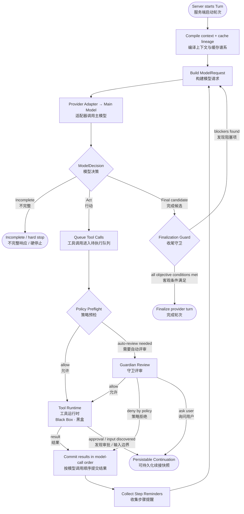
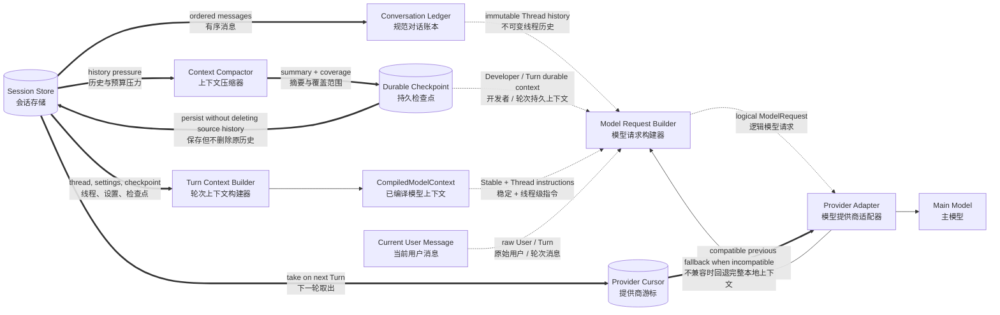
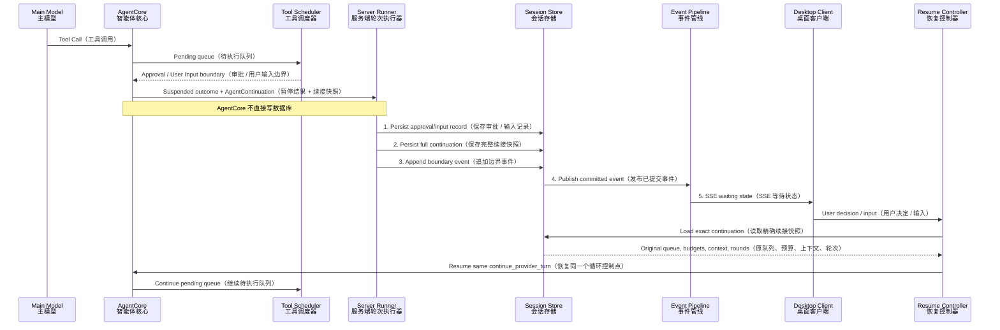

# OpenTopia Agent Loop 当前架构详解

> 基于当前代码重新梳理，更新时间：2026-08-12。
>
> 本文描述的是模块的真实职责、状态所有权和模块间关系，不是接口清单。
>
> `Tool Runtime（工具运行时）`按要求保持为黑盒，不展开内部工具注册与执行协议。

## 1. 一句话结论

OpenTopia 的 Agent Loop（智能体循环）不是“服务端写死步骤、模型被动填空”，而是一个 **Server-authoritative（服务端权威）**、**Model-directed（模型主导语义决策）**、**Event-driven（事件驱动）**、**Resumable（可恢复）** 的循环：

- `Server Turn Runner（服务端轮次执行器）`拥有生命周期、持久化和对外状态；
- `AgentCore（智能体核心）`拥有单个 Turn 内可恢复的控制循环；
- `Main Model（主模型）`决定下一步是行动还是回答；
- `Policy Engine（策略引擎）`与 `Guardian（守卫评审器）`约束行动边界；
- `Finalization Guard（收尾守卫）`只检查客观完成条件，不替模型判断答案质量；
- `Session Store（会话存储）`是恢复和客户端观察的持久化真相源。

## 2. 图例

本文 Mermaid（流程图语法）使用以下连线含义：

- `A --> B`：Control Flow（控制流），A 调用或推进 B；
- `A -.-> B`：Context Flow（上下文流），A 提供给模型阅读的语义材料；
- `A ==> B`：Durable State Flow（持久状态流），状态被保存、读取或恢复；
- 标有“Guard（约束）”的边：必须满足权限或完成条件才能跨越；
- 标有“Event（事件）”的边：变化被持久化并投影给客户端。

## 3. 总体模块关系图

```mermaid
flowchart LR
    UI["Desktop Client<br/>桌面客户端"]
    SR["Server Turn Runner<br/>服务端轮次执行器"]
    CB["Turn Context Builder<br/>轮次上下文构建器"]
    AC["AgentCore<br/>智能体核心"]
    RB["Model Request Builder<br/>模型请求构建器"]
    PA["Provider Adapter<br/>模型提供商适配器"]
    MM["Main Model<br/>主模型"]
    DC{"Decision Classifier<br/>决策分类器"}
    TS["Tool Scheduler<br/>工具调度器"]
    PE{"Policy Engine<br/>策略引擎"}
    GU["Guardian<br/>守卫评审器"]
    TR["Tool Runtime<br/>工具运行时<br/>Black Box · 黑盒"]
    FG{"Finalization Guard<br/>收尾守卫"}
    CT["AgentContinuation<br/>智能体续接快照"]
    RC["Resume Controller<br/>恢复控制器"]
    SS[("Session Store<br/>会话存储")]
    EP["Event Pipeline<br/>事件管线"]

    UI -->|"User message<br/>用户消息"| SR
    SS ==>|"history / checkpoint / cursor<br/>历史 / 检查点 / 游标"| CB
    SR -->|"build turn context<br/>构建轮次上下文"| CB
    CB -.->|"CompiledModelContext<br/>已编译模型上下文"| AC
    SR -->|"start / await<br/>启动并等待"| AC

    AC -->|"each model round<br/>每个模型轮"| RB
    RB -.->|"provider-neutral request<br/>提供商无关请求"| PA
    PA -->|"wire request<br/>线协议请求"| MM
    MM -.->|"streamed response<br/>流式响应"| PA
    PA -.->|"normalized response<br/>规范化响应"| DC

    DC -->|"Act · 行动"| TS
    TS -->|"Guard: deterministic preflight<br/>约束：确定性预检"| PE
    PE -->|"allowed exact call<br/>允许精确调用"| TR
    PE -->|"Guard: ambiguous approval<br/>约束：模糊审批"| GU
    GU -->|"allow / deny / ask<br/>允许 / 拒绝 / 询问"| TS
    TR -.->|"Tool Result<br/>工具结果"| TS
    TS -.->|"results become evidence<br/>结果成为下一轮证据"| RB

    DC -->|"Final candidate<br/>完成候选"| FG
    FG -.->|"blockers as runtime evidence<br/>阻塞项作为运行时证据"| RB
    FG -->|"ready to finalize<br/>允许收尾"| AC

    TS ==>|"approval / user input boundary<br/>审批 / 用户输入边界"| CT
    CT -->|"suspended outcome<br/>暂停结果"| SR
    SR ==>|"persist before publish<br/>先持久化再发布"| SS
    UI -->|"approval / input<br/>审批 / 输入"| RC
    SS ==>|"load exact snapshot<br/>读取精确快照"| RC
    RC -->|"resume same loop<br/>恢复同一循环"| AC

    AC -->|"AgentTurnResult<br/>轮次结果"| SR
    AC -->|"Event payloads<br/>事件载荷"| EP
    SR ==>|"messages / events / cursor<br/>消息 / 事件 / 游标"| SS
    SS -->|"Event: committed sequence<br/>事件：已提交序列"| EP
    EP -->|"history then live SSE<br/>历史后接实时流"| UI

    classDef core fill:#dbeafe,stroke:#2563eb,color:#172554
    classDef decision fill:#dcfce7,stroke:#16a34a,color:#052e16
    classDef guard fill:#ffe4e6,stroke:#e11d48,color:#4c0519
    classDef state fill:#fef3c7,stroke:#d97706,color:#451a03
    classDef external fill:#ede9fe,stroke:#7c3aed,color:#2e1065
    class AC,RB,TS,SR,CB,RC,EP core
    class MM,DC decision
    class PE,GU,FG guard
    class SS,CT state
    class UI,PA,TR external
```

### 如何读这张总图

图的中心不是某个“超级控制器”，而是三个不同层级的所有权：

1. **产品生命周期归服务端。** 服务端创建 Turn、准备上下文、持久化结果并给客户端广播事件。
2. **单 Turn 的循环归 AgentCore。** AgentCore 在模型响应、工具结果、提醒和收尾检查之间反复推进，直到完成或形成可恢复边界。
3. **任务语义归主模型。** 运行时提供事实与约束，但“继续做什么、如何解决阻塞、何时给出候选答案”仍由主模型决定。

这三个所有权彼此分离，是整个架构最重要的关系。

## 4. 运行时主循环

### 4.1 为什么 AgentCore 是“循环所有者”

`AgentCore（智能体核心）`不是一个单次的 `model → tool → answer` 包装函数。它持有一个显式循环，并在循环里维护：模型轮数、工具调用队列、工具结果、Provider 原生状态项、预算、运行时遥测、提醒交付状态、收尾守卫状态和兼容性哈希。

首轮从 `run_turn_detailed_streaming_with_context` 开始；只要模型返回 `Act（行动）`，控制权就进入 `continue_provider_turn（继续提供商轮次）`。这个函数反复处理待执行队列，再把结果送回下一模型轮。因此工具结果不是终点，而是主模型的下一批证据。

### 4.2 为什么主模型才是“语义决策者”

`ModelResponse::decision（模型响应决策分类）`只做三种机械分类：

- `Incomplete（不完整）`：响应因长度、异常结束等原因不可视为完整结果；
- `Act（行动）`：响应包含工具调用；
- `Final（完成候选）`：正常结束、没有工具调用且有非空文本。

分类器不判断任务是否真的做对。运行时观察到预算、重复调用、子智能体状态或计划进度后，会把这些事实变成 `Step Reminder（步骤提醒）`或收尾阻塞证据，再交给主模型。主模型据此决定继续、换方法或回答。

### 4.3 并行工具为什么仍然产生确定性历史

`Tool Scheduler（工具调度器）`可以并发启动资源相互独立的调用，但并发结果不能直接按完成先后写入历史。调度器会暂存并行结果，只有队首调用的结果可提交时，才按模型原始调用顺序追加 Tool Result（工具结果）和 Durable Event（持久事件）。

因此系统同时获得：

- 执行层面的并发效率；
- Provider transcript（提供商对话记录）的稳定顺序；
- 重放、测试与恢复的一致性。

### 4.4 Guardian 的真实位置

`Guardian（守卫评审器）`不是第二个任务规划模型，也不评价“任务有没有完成”。它只是 `Policy Engine（策略引擎）`在自动审批模式下的一条条件分支：当确定性策略无法直接允许某个精确动作，但该动作又允许自动评审时，Guardian 才读取有限证据，并输出严格结构化结果：

- `allow（允许）`；
- `needs_user_approval（需要用户审批）`；
- `deny_by_policy（按策略拒绝）`。

Guardian 技术失败不会伪装成“需要用户审批”；策略禁止的动态危险动作也不会被交给 Guardian 猜测。

### 4.5 Finalization Guard 的真实职责

`Finalization Guard（收尾守卫）`位于模型 `Final（完成候选）`与真正完成之间。它检查的都是可验证事实：

- 是否仍有待执行工具或待审批项；
- Goal 模式是否缺少计划；
- 是否仍有 Pending / In Progress（待处理 / 进行中）步骤；
- 需求是否有当前版本的实现、观察和验证证据；
- 是否仍有未终止的子智能体或未处理的 mailbox（邮箱）消息。

发现阻塞时，它不会自己修改计划，也不会自行调用工具，而是生成一个合成的 Runtime Guard Tool Result（运行时守卫工具结果）送回主模型。主模型决定如何消除阻塞。守卫最多干预 3 次，防止无限收尾循环。

## 5. 上下文与持久状态

### 5.1 CompiledModelContext 不是“最终 Prompt”

`CompiledModelContext（已编译模型上下文）`是一个 Provider-neutral IR（提供商无关的中间表示）。每个 `ModelContextItem（模型上下文项）`都带有角色、来源、内容哈希、Token 估算、缓存作用域、敏感度和元数据。

它按以下作用域稳定排序：

1. `Stable（稳定级）`：系统级且跨线程稳定的基础说明；
2. `Thread（线程级）`：技能、工作区投影、执行谱系等线程语义；
3. `Turn（轮次级）`：持久检查点和本轮动态状态；
4. `Round（模型轮级）`：工具结果、提醒等只属于当前模型轮的材料。

只有 System / Developer（系统 / 开发者）角色的上下文项会进入 instructions（指令）；User / Assistant / Tool（用户 / 助手 / 工具）继续保持原生角色，不会被拼成一整段伪文本。

### 5.2 Model Request Builder 是语义汇合点

`Model Request Builder（模型请求构建器）`每个模型轮都会重新材料化统一的 `ModelRequest（模型请求）`。它把以下内容放到各自正确的位置：

- Stable / Thread 指令前缀；
- Durable Checkpoint（持久检查点），以 Developer / Turn 身份出现；
- Conversation Ledger（规范对话账本），作为不可变 Thread 历史；
- 当前用户原始消息，保持 User / Turn 身份；
- 工具调用和工具结果，保持 Assistant / Tool / Round 身份；
- 当前步骤提醒，作为 Round 级环境事实。

所以它的价值不是“拼字符串”，而是维持角色、作用域、缓存和恢复语义不互相污染。

### 5.3 Conversation Ledger 与 Durable Checkpoint 的关系

两者不是互相替代：

- `Conversation Ledger（对话账本）`保存规范、只追加的原始消息历史；
- `Durable Checkpoint（持久检查点）`保存旧任务状态的压缩表示及覆盖范围；
- 压缩成功后，原消息仍在 Store 中，检查点只告诉后续 Turn 哪段旧历史可由摘要代表；
- 当前用户消息永远不被折叠进旧检查点。

因此数据库中的原历史是审计与重建基础，检查点是长上下文优化，不是新的真相源。

### 5.4 Prompt Cache Lineage 与 Provider Cursor 是两套机制

`Prompt Cache Lineage（提示缓存谱系）`描述可复用的稳定逻辑前缀。它主要包含 Stable / Thread 的 System / Developer 内容、持久检查点和规范工具候选，不包含当前用户消息、工具结果、日期或 Git 动态状态。

`Provider Cursor（提供商游标）`则是成功完成后保存的 Provider 原生连续性，例如 previous response ID（前序响应 ID）或可重放状态项。它必须通过 Provider、Model 和 compatibility hash（兼容性哈希）检查；不兼容或 Provider 拒绝时，系统回退到本地检查点与规范历史。

所以：缓存谱系优化“相同逻辑前缀”，Provider Cursor 优化“提供商原生续接”；任何一个失败都不能破坏本地恢复能力。

## 6. 暂停、恢复与客户端观察

### 6.1 AgentContinuation 为什么是完整控制点

`AgentContinuation（智能体续接快照）`不只是一个 approval ID（审批 ID）。它序列化了恢复同一循环所需的完整状态，包括：

- thread / user / workspace（线程 / 用户 / 工作区）；
- conversation / context summary（对话 / 上下文摘要）；
- permission / budgets（权限 / 预算）；
- `CompiledModelContext（已编译模型上下文）`；
- collaboration mode / goal（协作模式 / 目标）；
- tool candidates / all calls / all results / pending queue（工具候选 / 全部调用 / 全部结果 / 待执行队列）；
- compacted tool history / Provider items（压缩工具历史 / 提供商状态项）；
- model rounds / review count / runtime state（模型轮数 / 评审次数 / 运行时状态）；
- provider compatibility hash（提供商兼容性哈希）。

恢复不是从 UI 当前显示内容重建新循环，而是从 Store 读取这个精确快照，写入用户决定后回到原 `continue_provider_turn` 控制点。已经完成的调用不会重复执行，预算和轮数也不会归零。

### 6.2 为什么必须“先持久化，再发布等待事件”

审批或用户输入事件对客户端意味着“现在可以操作”。如果服务端先广播事件，数据库却还没有保存 Continuation，那么用户可能看到一个永远无法恢复的等待按钮。

因此服务端把边界事件暂存，依次完成审批记录、完整 Continuation 和事件历史的持久化，最后才通过 EventBus（事件总线）发布。这个顺序是不变量：

> Persist before publish（先持久化，再发布）。

普通事件也遵循同一原则：`publish_payload` 先调用 Store 追加带线程序号的事件，再向线程广播通道发送。

### 6.3 为什么 SSE 先历史、后实时

桌面端订阅线程时，服务端先读取已持久化历史，再接入实时 Broadcast（广播），并用线程内事件序号去重。这样即使客户端断线期间发生了模型、工具或审批事件，重连也不会丢失；实时流中看到的事件也一定能从历史接口重放。

客户端 Conversation Projection（对话投影）会过滤推理内容和敏感请求体，所以事件存储、实时广播与最终 UI 展示仍是三个不同层次。

## 7. 模块理解与关系说明

### 7.1 Server Turn Runner（服务端轮次执行器）

**为什么存在：** AgentCore 是可测试的内存循环，不应同时承担 HTTP、数据库、SSE 和产品状态机。服务端执行器把运行循环与产品生命周期分开。

**真正负责：** 构造 `AgentTurnInput（智能体轮次输入）`、启动或恢复 AgentCore、排空事件通道、持久化消息/审批/续接/游标、映射最终 TurnStatus（轮次状态）。

**与其他模块的关系：**

- 向 `Turn Context Builder` 发起轮前准备；
- 启动并等待 `AgentCore`，但不指挥每个模型轮；
- 从 AgentCore 接收显式 `AgentTurnResult`；
- 把持久化交给 `Session Store`；
- 只有状态提交成功后才把事件送入 `Event Pipeline`。

**刻意不负责：** 不决定下一工具，不判断答案语义，不在数据库中保存半成品内存引用。

### 7.2 AgentCore（智能体核心）

**为什么存在：** 把“模型—行动—观察—再模型—收尾”的控制逻辑放在一个 Provider 无关、可恢复、可测试的核心里。

**真正负责：** 维护单 Turn 状态机；构造每轮请求；解释 `Act / Final / Incomplete`；推进工具队列；收集运行时提醒；执行收尾守卫；返回完成或暂停结果。

**与其他模块的关系：**

- 上游由 Server Runner 创建和等待；
- 下游通过 Request Builder 与 Provider Adapter 间接访问主模型；
- 把具体工具执行委托给 Tool Scheduler / Tool Runtime；
- 遇到交互边界时输出 AgentContinuation，而非自行等待 HTTP 用户请求；
- 发出无序号 Event Payload，由服务端持久化时赋序号。

**刻意不负责：** 不直接写数据库、不拥有桌面端状态、不实现 Provider 协议、不替主模型做任务语义判断。

### 7.3 Model Request Builder（模型请求构建器）

**为什么存在：** 上下文来源很多，但 Provider 需要一个角色与顺序明确的逻辑请求；若让各模块直接拼 Prompt，会破坏缓存、角色和恢复语义。

**真正负责：** 把 CompiledModelContext、对话账本、检查点、当前用户、工具调用/结果、Provider 状态项和提醒材料化为统一 `ModelRequest`。

**关系本质：** 它是所有“给模型看的信息”的汇合点，但不是任何一类信息的所有者。

### 7.4 Provider Adapter（模型提供商适配器）

**为什么存在：** Agent Loop 不应理解 OpenAI Responses、Chat Completions 或其他提供商的线协议差异。

**真正负责：** `prepare（准备）`逻辑请求为线协议请求；应用角色、工具、缓存和兼容性降级；流式发送；把文本、推理、工具调用、Usage（用量）和结束原因归一化成 `ModelResponse`。

**关系本质：** 对上保持统一语义，对下吸收提供商差异。协议降级只影响本次线请求，不能回写规范 Conversation Ledger。

### 7.5 Main Model（主模型）

**为什么存在：** 任务的下一步依赖自然语言目标、工具观察和动态事实，无法由固定状态机穷举。

**真正负责：** 阅读当前逻辑上下文，决定发起哪些调用、如何解释结果、如何消除运行时阻塞，以及何时提出最终回答候选。

**关系本质：** 模型拥有语义决策，但不拥有副作用权限、持久状态和最终完成闸门。

### 7.6 Tool Scheduler（工具调度器）

**为什么存在：** 模型产生的是行动意图，不是可直接执行的副作用；多个调用还涉及顺序、并发、审批和暂停。

**真正负责：** 管理 Pending Queue（待执行队列）；确定独立调用的并行批次；保持结果提交顺序；调用策略预检和 Guardian；在审批/用户输入边界冻结 Continuation；把所有工具结果送回下一模型轮。

**关系本质：** 它连接“模型意图”和“受控执行”，但不理解工具内部实现，也不判断任务是否完成。

### 7.7 Policy Engine（策略引擎）

**为什么存在：** 权限、工作区和副作用边界应有确定性、可审计的第一道判断，不能全部交给概率模型。

**真正负责：** 根据精确工具名、参数、工作区、Permission Mode（权限模式）、Sandbox（沙箱）和动作类型作 allow / deny / approval-required（允许 / 拒绝 / 需要审批）预检。

**关系本质：** 低风险精确调用可直接进入工具黑盒；只有可自动评审的模糊边界才进入 Guardian。

### 7.8 Guardian（守卫评审器）

**为什么存在：** 某些动作的安全性依赖父对话中的用户授权语义，确定性策略无法独立判断。

**真正负责：** 用有限、可复用且保持 append-only（只追加）一致性的评审会话读取审批证据；必要时使用只读证据工具；输出严格结构化安全结论。

**关系本质：** 它服务于 Policy / Scheduler 的审批分支，而不是 AgentCore 的进度或质量评审器。

### 7.9 Finalization Guard（收尾守卫）

**为什么存在：** 模型可能在仍有计划步骤、证据缺口或活跃子智能体时过早给出自然语言答案。

**真正负责：** 检查可计算的完成不变量；发现缺口时生成结构化阻塞事实并重新进入模型循环；条件满足时允许 AgentCore 创建 Assistant Message 与 TurnFinished。

**关系本质：** 模型提出 Final，守卫验证“是否允许 Finalize”；守卫不评价回答文风或方案优劣。

### 7.10 Session Store（会话存储）

**为什么存在：** 内存循环会因暂停、重启和断线消失；客户端也需要可重放历史。

**真正负责：** 保存规范消息、事件、审批、Continuation、上下文检查点、计划状态和成功完成后的 Provider Cursor。

**关系本质：** 它是恢复和观察的持久化真相源，但不直接推进 Agent 控制流。

### 7.11 Event Pipeline（事件管线）

**为什么存在：** 运行时需要实时反馈，但实时反馈必须与持久历史一致。

**真正负责：** 接收已经提交、带序号的事件；按线程广播；为 SSE 提供“历史后接实时”的去重流；生成脱敏的客户端投影。

**关系本质：** 事件管线投影状态变化，不反向控制 AgentCore。

## 8. 最关键的架构不变量

1. **Server owns lifecycle（服务端拥有生命周期），AgentCore owns the loop（AgentCore 拥有循环）。**
2. **Main Model owns semantic decisions（主模型拥有语义决策），运行时只提供事实与边界。**
3. **Tool intent is not permission（工具意图不等于执行权限）。** 所有副作用必须跨过策略边界。
4. **Parallel execution, ordered commit（并行执行、按序提交）。** 工具可以乱序完成，但历史和事件必须按模型调用顺序提交。
5. **Persist before publish（先持久化，再发布）。** 尤其是审批和用户输入边界。
6. **Resume the same loop（恢复同一循环），不是根据 UI 重建一个新循环。**
7. **Final is a candidate（Final 只是候选）。** 客观完成条件通过后才能真正 Finalize。
8. **Local history is the fallback truth（本地历史是回退真相）。** Provider Cursor 和 Prompt Cache 都只是优化。
9. **Context scopes do not collapse（上下文作用域不混叠）。** Stable / Thread / Turn / Round 维持各自角色与缓存语义。
10. **Events observe but do not drive（事件负责观察，不负责驱动）。** Agent 控制流不依赖客户端是否在线。

## 9. 主要源码锚点

- `crates/opentopia-core/src/agent.rs:180` — `AgentContinuation（智能体续接快照）`
- `crates/opentopia-core/src/agent.rs:1014` — `collect_step_reminders（收集步骤提醒）`
- `crates/opentopia-core/src/agent.rs:1263` — `apply_finalization_guard（应用收尾守卫）`
- `crates/opentopia-core/src/agent.rs:1721` — `run_turn_detailed_streaming_with_context（运行流式轮次）`
- `crates/opentopia-core/src/agent.rs:2427` — `continue_provider_turn（继续提供商轮次循环）`
- `crates/opentopia-core/src/agent.rs:3305` — `complete_model（完成一次模型调用）`
- `crates/opentopia-core/src/agent.rs:4761` — `finalize_provider_turn（完成提供商轮次）`
- `crates/opentopia-core/src/agent.rs:5525` — `build_model_request（构建模型请求）`
- `crates/opentopia-core/src/model_context.rs:85` — `ModelContextItem（模型上下文项）`
- `crates/opentopia-core/src/model_context.rs:234` — `CompiledModelContext（已编译模型上下文）`
- `crates/opentopia-core/src/provider.rs:73` — `ModelRequest（模型请求）`
- `crates/opentopia-core/src/provider.rs:303` — `ModelResponse::decision（模型响应分类）`
- `crates/opentopia-core/src/provider.rs:659` — `ModelProvider（模型提供商边界）`
- `crates/opentopia-core/src/guardian.rs:361` — `GuardianReviewSessionManager（守卫评审会话管理器）`
- `crates/opentopia-server/src/main.rs:979` — `EventBus（事件总线）`
- `crates/opentopia-server/src/main.rs:6374` — `publish_payload（持久化后发布事件）`
- `crates/opentopia-server/src/main.rs:6847` — 构造 `AgentTurnInput`
- `crates/opentopia-server/src/main.rs:7036` — `run_resumed_agent_turn（运行恢复轮次）`
- `crates/opentopia-server/src/main.rs:7521` — `persist_suspended_continuation（持久化暂停续接）`

---

如果只保留一个心智模型，可以记成：

> **服务端守住生命周期与真相，AgentCore 守住可恢复循环，主模型负责语义决策，策略与守卫负责边界，Store 让一切可恢复和可观察。**
