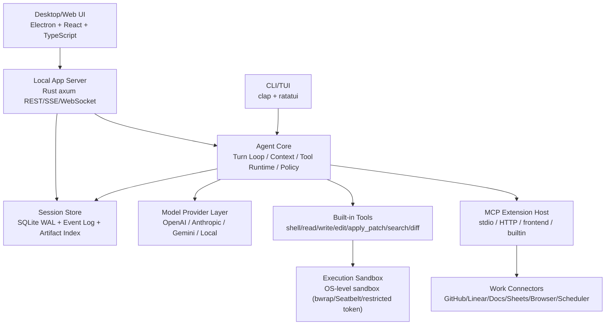
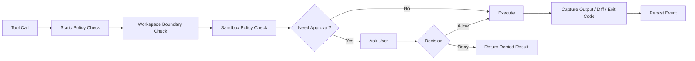
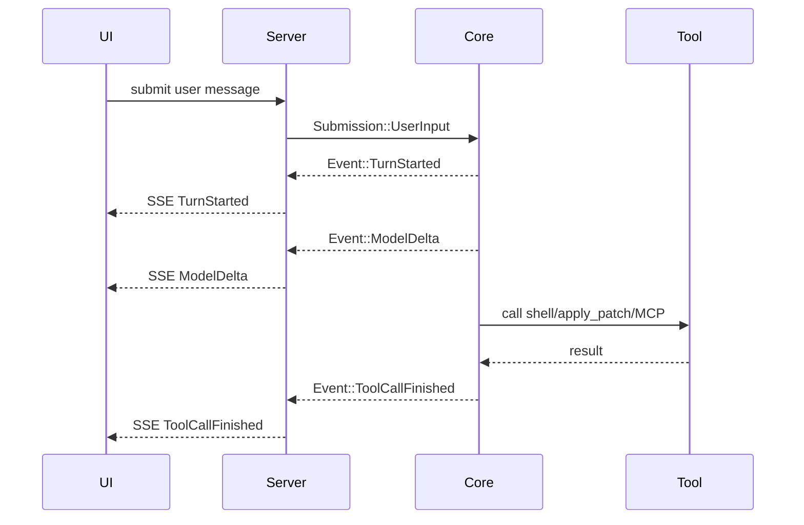

# AI Coding + Work Agent 系统设计方案

> 目标：构建一个类似 Codex、Trae Work 的本地优先 AI Coding + Work Agent 应用。它既能可靠地完成代码仓库内的开发任务，也能扩展到文档、表格、浏览器、终端、项目管理、定时任务等工作场景。设计原则是：核心能力自控，通用协议复用，成熟模块借鉴，避免重复造轮子。

## 1. 结论先行

推荐采用 **Rust Agent Core + TypeScript/React UI + MCP/ACP 扩展协议 + 本地 SQLite 事件存储 + 可插拔沙箱执行层** 的组合。

第一阶段不要做 Rust Agent + Go Server + 多语言控制面的大而全架构。Codex、Goose、OpenHands、opencode、Trae 各自都有值得借鉴的部分，但真正适合组合成一个产品的方式不是“把所有模块拼起来”，而是明确每个项目负责启发哪一层：

| 层级 | 建议主要参考 | 原因 |
| --- | --- | --- |
| Agent 核心协议、执行安全、补丁编辑、上下文压缩 | Codex | 安全边界、终端执行、事件队列、补丁应用、权限模型成熟 |
| Provider/MCP/Extension、权限检查、TUI/服务端经验 | Goose | MCP 扩展体系完整，Provider 和工具检查设计可借鉴 |
| 会话/消息 Part 模型、轻量多客户端 API、编辑体验 | opencode | 对“消息-工具调用-结果-局部更新”的建模适合 UI 和回放 |
| 多沙箱控制面、Web App、用户/设置/Secret/远程运行 | OpenHands | 适合作为后续团队版、远程沙箱、浏览器控制台的控制面参考 |
| 简洁 SWE Agent loop、工具 schema、轨迹记录、Benchmark | Trae Agent | 适合作为最小可行 Agent 和评测基线，不适合作为生产安全底座 |

最终产品不应把所有工具都塞进 MCP。建议采用：

- **内置高信任工具**：shell、read、write、edit、apply_patch、diff、search、sandbox exec、browser control。
- **MCP 扩展工具**：GitHub、Linear、Office、浏览器自动化、数据库、云服务、设计工具、企业系统。
- **前端工具**：用户确认、图片/文件选择、浏览器/桌面交互、可视化编辑。

这样能同时获得安全、速度和可扩展性。

## 2. 产品边界

这个系统不是一个单纯的 CLI，也不是一个只会跑命令的代码助手。它应该是一个本地优先的工作代理平台：

- 可以打开一个项目目录，理解代码、执行命令、修改文件、运行测试。
- 可以通过聊天、任务列表、计划、diff、日志和可视化面板协作。
- 可以通过 MCP 连接外部服务和本地能力。
- 可以在受控沙箱内执行不可信命令。
- 可以保留完整线程、工具调用、权限决策、文件变更和事件日志。
- 可以从本地单用户逐步演进到团队/远程沙箱/云控制面。

非目标：

- 第一版不做完整 IDE。
- 第一版不做云多租户平台。
- 第一版不做所有办公套件原生解析器。
- 第一版不自研新的工具协议、Agent 协议、Provider SDK。

## 3. 总体架构

推荐架构如下：



核心原则：

1. **Agent Core 是产品心脏**：所有对话、工具调用、权限、上下文压缩、事件流都经过 Core。
2. **App Server 是本地控制面**：第一阶段直接用 Rust `axum` 内嵌，不单独引入 Go 或 Python 服务。
3. **UI 是事件消费者**：UI 不直接管理 Agent 状态，只消费事件、提交用户动作。
4. **工具系统分两层**：高风险/高频工具内置，生态工具走 MCP。
5. **沙箱独立于工具协议**：工具调用能否执行，由权限策略和执行环境共同决定。

## 4. 推荐技术栈

### 4.1 Core

建议：

- Rust workspace
- `tokio`：异步运行时
- `serde` / `serde_json`：协议序列化
- `tracing` / `opentelemetry`：日志和可观测性
- `clap`：CLI
- `anyhow` / `thiserror`：错误处理
- `sqlx` + SQLite：本地持久化
- `axum`：本地 HTTP/SSE 服务
- `rmcp` 或等价 MCP SDK：MCP 客户端/服务端

原因：

- Codex 和 Goose 都证明 Rust 适合做本地 Agent Core。
- Rust 对进程、文件、权限、并发、事件流、跨平台打包都更稳。
- 统一 Rust Core 可以避免第一阶段维护 Rust + Go + Python 三套服务边界。

### 4.2 UI

建议：

- React + TypeScript
- Vite
- Zustand/Jotai 或 Redux Toolkit 管理前端状态
- Tailwind CSS + Radix UI/shadcn-style primitives，建立自己的 design tokens
- Monaco Editor 或 CodeMirror 作为代码/diff 编辑器
- Xterm.js 作为终端输出视图
- Electron 作为默认桌面壳，Tauri 作为轻量替代壳，后续可补 Web 部署

桌面壳选择：

| 方案 | 建议 | 优点 | 代价 |
| --- | --- | --- | --- |
| Electron + React | 默认首选 | Chromium 行为一致，生态成熟，调试顺滑，最适合快速做 Codex/Trae 类复杂桌面工作台 | 包体大，资源占用高，Node/IPC 安全面需要严格治理 |
| Tauri + React | 轻量备选 | 包体小，Rust 集成顺，权限边界清晰，适合轻量本地 Agent | WebView 跨系统差异更明显，复杂桌面体验和调试成本更高 |
| Native Swift/Kotlin/C# | 不建议 MVP | 原生体验最好 | 多端成本高，UI 迭代慢，和 Web 工作台复用差 |
| VS Code Extension | 后续补充 | 贴近开发者工作流 | 不适合作为第一主产品壳，受 IDE 生命周期限制 |

如果目标是先做出 Codex Desktop、Trae Work 这类成熟工作台体验，建议使用 **Electron + React + TypeScript + Vite + Tailwind/Radix + Monaco + Xterm.js**。这样可以获得稳定一致的 Chromium 渲染、成熟的窗口/菜单/托盘/更新/调试生态，以及更低的复杂 UI 迭代成本。Rust 侧仍然负责 Agent Core、本地 app server、文件系统、进程、安全策略和 MCP。

这个判断和几个项目的真实实现更一致：

- Codex App：OpenAI 官方招聘页描述其 stack centered on TypeScript/Node/Electron，并与 Codex CLI 和 Rust app server 集成。
- Goose：本地源码 `J:\Project\Goose\ui\desktop` 明确是 Electron Forge + React，`CONTRIBUTING.md` 也写到 Rust binaries alongside an electron app for the GUI。
- opencode：本地源码 `J:\Project\opencode\source\packages\desktop` 使用 Tauri 2，说明 Tauri 路线也可行，但它更像轻量替代方案。
- Trae/Trae Work：目前没有本地源码级证据，不把“它可能用 Electron”作为架构依据。

多系统适配策略：

| 目标 | 建议 |
| --- | --- |
| Windows | Electron + Chromium；重点处理路径、PowerShell/cmd、Windows Job Object、WSL 路径转换、Squirrel/NSIS/MSIX、代码签名 |
| macOS | Electron + Chromium；重点处理签名、公证、权限弹窗、Keychain、`.app`/DMG、auto updater |
| Linux | Electron + Chromium；重点处理 deb/rpm/AppImage/Flatpak、Wayland/X11、沙箱兼容性、系统依赖 |
| Web | 复用同一套 React app，换成 Web Platform Adapter；本地能力通过远程 server 或 browser-safe API 提供 |

桌面端要设计一个 `PlatformAdapter`，让 UI 不直接调用 Electron 或 Tauri API：

```ts
export interface PlatformAdapter {
  platform: "desktop" | "web"
  os?: "windows" | "macos" | "linux"
  openDirectoryPicker(options?: PickerOptions): Promise<string | string[] | null>
  openFilePicker(options?: PickerOptions): Promise<string | string[] | null>
  openExternal(url: string): Promise<void>
  openPath(path: string): Promise<void>
  readClipboardImage?(): Promise<Blob | null>
  notify?(input: NotificationInput): Promise<void>
  getStore(key: string): Promise<string | null>
  setStore(key: string, value: string): Promise<void>
}
```

这样桌面版默认用 Electron adapter，轻量版可以换 Tauri adapter，Web 版用 Browser adapter，测试环境用 Mock adapter。opencode 的 `PlatformProvider` 思路可以借鉴，但不要照搬实现。

Electron 安全基线：

- renderer 禁用 `nodeIntegration`。
- 开启 `contextIsolation`。
- 只通过 preload 暴露最小 API。
- IPC 入参用 `zod`/JSON schema 校验。
- 外部链接和协议做 allowlist。
- CSP 默认收紧。
- 本地 Rust server 绑定 localhost，并使用随机 token。
- 文件系统和命令执行仍走 Rust PolicyEngine，不让 Electron main process 直接绕过权限模型。

跨平台桌面能力清单：

- sidecar/local server：桌面壳启动本地 Agent server，并健康检查。
- single instance：重复打开时聚焦已有窗口。
- deep link：支持 `opentopia://...`。
- window state：保存窗口大小、位置、缩放。
- updater：生产版自更新。
- logging：桌面壳和 sidecar 日志分离。
- file picker：跨平台文件/目录选择。
- path normalization：Windows、WSL、macOS、Linux 路径统一。
- process cleanup：应用退出时清理子进程。
- keyring/secret：密钥不放 localStorage。

不要第一阶段做完整 VS Code 插件。可以后续通过 ACP/MCP/Language Server 方式接入 IDE。

### 4.3 存储

本地版：

- SQLite WAL
- append-only event log
- artifact 文件目录
- keyring 保存密钥

团队版：

- PostgreSQL
- 对象存储保存 artifacts/logs
- Redis/NATS 用于事件广播和任务队列
- Secret Manager / Vault

### 4.4 协议

内部协议：

- Codex 风格的 `Submission Queue` / `Event Queue`
- turn、thread、event、tool_call、approval、diff 都结构化建模

外部协议：

- MCP：工具扩展
- ACP：Agent 与编辑器/客户端互通
- REST/SSE：Web UI 和本地服务通信
- WebSocket：实时终端、浏览器控制、长连接交互

不要发明一个全新的工具协议。

## 5. 核心模块设计

### 5.1 Agent Core

职责：

- 管理 thread/session/turn 生命周期
- 组装模型上下文
- 调用模型 Provider
- 解析模型输出和工具调用
- 调度工具运行
- 处理权限审批
- 压缩上下文
- 生成事件流
- 记录轨迹

推荐参考：

- Codex：`J:\Project\codex cli\codex\codex-rs\protocol\src\protocol.rs`
- Codex：`J:\Project\codex cli\codex\codex-rs\core\src\lib.rs`
- Goose：`J:\Project\Goose\crates\goose\src\agents\agent.rs`
- Trae：官方 `base_agent.py` / `trae_agent.py`

建议设计：

```rust
pub struct AgentCore {
    session_store: Arc<dyn SessionStore>,
    provider: Arc<dyn ModelProvider>,
    tool_runtime: Arc<ToolRuntime>,
    policy_engine: Arc<PolicyEngine>,
    context_manager: Arc<ContextManager>,
}

pub enum Submission {
    UserInput(UserInput),
    ApprovalDecision(ApprovalDecision),
    Interrupt,
    Resume,
    AddContext(ContextItem),
}

pub enum AgentEvent {
    TurnStarted,
    ModelDelta(ModelDelta),
    ToolCallStarted(ToolCall),
    ToolCallDelta(ToolOutputDelta),
    ToolCallFinished(ToolResult),
    ApprovalRequested(ApprovalRequest),
    FileChanged(FileChange),
    TurnFinished(TurnSummary),
    Error(AgentError),
}
```

Codex 的 SQ/EQ 模型很适合这里：用户提交动作进入 Submission Queue，Agent 所有输出进入 Event Queue。这样 CLI、桌面 UI、Web UI、自动化调度器可以共享一个内核。

### 5.2 Session 与事件存储

职责：

- 保存 thread、turn、message、message part、tool call、approval、diff、artifact
- 支持回放、fork、恢复、中断
- 支持 UI 局部渲染和断线重连
- 支持后续审计

推荐参考：

- opencode 的 session/message/part 思路
- Codex 的 rollout/thread/event 思路
- OpenHands 的 conversation/event API 思路

建议模型：

```text
threads
  id
  title
  workspace_root
  created_at
  updated_at

turns
  id
  thread_id
  status
  model
  started_at
  finished_at

messages
  id
  thread_id
  turn_id
  role
  created_at

message_parts
  id
  message_id
  type
  payload_json
  order_index

events
  id
  thread_id
  turn_id
  seq
  type
  payload_json
  created_at

tool_calls
  id
  turn_id
  tool_name
  input_json
  output_json
  status
  approval_id

approvals
  id
  policy
  decision
  scope
  expires_at
```

关键点：

- `events` 是事实来源，用于回放和审计。
- `messages/message_parts` 是渲染友好的投影。
- `tool_calls` 和 `approvals` 是查询友好的索引。
- 文件 diff 和大输出放 artifact，不直接塞数据库。

### 5.3 Provider Layer

职责：

- 统一 OpenAI、Anthropic、Gemini、本地模型等接口
- 支持 streaming
- 支持 tool call/function call
- 支持 prompt caching / reasoning / structured output 差异
- 支持模型能力描述

推荐参考：

- Goose：`crates\goose-providers`
- Trae：Provider 与 Tool schema 的简洁抽象
- Codex：模型客户端与工具调用整合方式

建议接口：

```rust
#[async_trait]
pub trait ModelProvider: Send + Sync {
    async fn stream(
        &self,
        request: ModelRequest,
    ) -> Result<Pin<Box<dyn Stream<Item = ModelEvent> + Send>>>;

    fn capabilities(&self) -> ModelCapabilities;
}
```

不要从零写所有 Provider。第一版可以只接：

- OpenAI Responses API 或 Chat Completions 兼容层
- Anthropic Messages API
- Gemini API
- OpenAI-compatible local endpoint

后续再补 Bedrock、Vertex、Azure OpenAI。

### 5.4 Tool Runtime

工具分为三类：

1. Built-in tools
2. MCP tools
3. Frontend tools

Built-in tools：

- `shell`
- `read_file`
- `write_file`
- `edit_file`
- `apply_patch`
- `search`
- `list_files`
- `git_diff`
- `browser_control`
- `task_done`

MCP tools：

- GitHub
- Linear/Jira
- Office 文档
- 表格
- PDF
- 浏览器自动化
- 数据库
- 云服务

Frontend tools：

- 用户选择文件
- 用户审批
- 显示图片/截图
- 浏览器或桌面交互

推荐参考：

- Codex：`apply_patch`、`exec`、`mcp_tool_call`、`tools`
- Goose：`ToolInspectionManager`、`ExtensionManager`
- Trae：`bash_tool.py`、`edit_tool.py`、`mcp_tool.py`

核心建议：

- 高频核心工具内置，不要全部走 MCP。
- 第三方和工作流集成走 MCP。
- 工具调用前统一过 `PolicyEngine`。
- 工具输出必须限流、截断、分块、可取消。
- 每次工具调用都要写入事件日志。

### 5.5 权限与安全策略

这是系统成败的底座。建议以 Codex 为主参考，Goose 为辅助参考。

推荐参考：

- Codex：`J:\Project\codex cli\codex\codex-rs\core\src\exec_policy.rs`
- Codex：`J:\Project\codex cli\codex\codex-rs\core\src\exec.rs`
- Goose：`J:\Project\Goose\crates\goose\src\permission\permission_inspector.rs`
- Goose：`J:\Project\Goose\crates\goose\src\tool_inspection.rs`

权限模型：

| 模式 | 行为 |
| --- | --- |
| Chat | 不执行写入和命令，只回答 |
| ReadOnly | 允许读文件、搜索、查看 git diff |
| Auto | 允许低风险读写，危险命令审批 |
| Approve | 大部分写入/执行需要审批 |
| FullAccess | 用户明确授予，高风险操作仍记录 |

审批维度：

- 命令是否危险
- 是否写入工作区外
- 是否访问网络
- 是否删除/移动大量文件
- 是否读取 secret
- 是否修改 git 历史
- 是否安装依赖
- 是否执行下载脚本
- 是否启动后台服务

每个 tool call 的安全流程：



不要只依赖 LLM 判断权限。LLM 可以作为 Goose SmartApprove 那样的辅助信号，但最终必须有确定性策略。

### 5.6 执行与沙箱

采用 **OS 级本地沙箱**作为执行环境的安全底座，Docker/Remote 沙箱作为后续可扩展方向：

**默认路径（前期专注）：OS 级本地沙箱**
- **Linux**：bubblewrap（文件系统/process/network namespace；seccomp + Landlock 为后续纵深）
- **macOS**：sandbox-exec + Seatbelt profile（读/写路径 allowlist + 端口限制）
- **Windows**：复用 Codex native sandbox；默认验证 `unelevated` restricted token + ACL，`elevated` 需管理员设置并独立验收
- 直接在用户工作区内执行，无需 Docker；延迟由平台后端决定，不承诺统一 `<10ms`。

**Codex 对齐的权限模型**

- `sandbox_mode`：`read-only` / `workspace-write` / `danger-full-access`，定义技术边界。
- backend enforcement：`disabled` / `best-effort` / `enforce`，只定义 helper 缺失时的行为。
- approval policy：独立决定何时暂停询问；`never` 不等于关闭沙箱。
- `workspace-write` 默认网络受限，通过 writable roots 增加额外写目录。
- 内置 read/write/apply_patch 与 spawned command 必须遵守相同边界。
- writable root 下 `.git`、`.agents`、`.codex` 默认只读，避免 hooks/config 扩权。

**后续方向：Docker/Remote 沙箱**（优先级后移）
- 用于固定 CI 环境、多租户部署、或需要完整容器隔离的场景
- 共享同一 `ExecutionEnvironment` trait，工具层不感知执行后端差异

执行必须支持：

- timeout
- cancellation
- process group kill
- stdout/stderr 分流
- output cap
- long-running session
- background service registry
- working directory validation
- env whitelist/blacklist
- secret redaction

推荐参考：

- Codex exec/sandboxing：OS 级沙箱架构（bwrap/Seatbelt/restricted token）、本地执行策略、输出截断、取消、超时。
- OpenHands sandbox service：容器生命周期、secret broker——作为 Docker 沙箱后续方向的参考。

### 5.7 上下文管理

职责：

- 收集 repo context、文件、diff、终端输出、tool result
- 控制 token budget
- 自动压缩旧上下文
- 保留关键事实、计划、决策、文件变更
- 支持恢复和跨 turn 延续

推荐参考：

- Codex：`compact_*`、`context`、`turn_metadata`
- Goose：`context_mgmt\mod.rs`

建议：

- 每个 turn 有 context budget。
- tool result 可以按重要性进入上下文。
- 大输出先摘要，原文保存在 artifact。
- 历史 turn 定期压缩为 summary。
- 文件修改和审批决策必须进入长期记忆。

压缩策略：

```text
recent messages: full
recent tool outputs: truncated + artifact link
old user intents: summary
old tool pairs: summary
file changes: structured diff summary
open decisions: preserved verbatim
```

### 5.8 MCP Extension Host

职责：

- 加载 MCP server 配置
- 支持 stdio、HTTP/SSE、streamable HTTP、frontend/builtin server
- 拉取 tools/resources/prompts
- 处理工具调用和结果
- 管理 extension 权限

推荐参考：

- Goose：`J:\Project\Goose\crates\goose\src\agents\extension.rs`
- Goose：`J:\Project\Goose\crates\goose\src\agents\extension_manager.rs`
- Codex：`mcp`、`mcp_tool_call`

建议：

- MCP server 配置独立存储。
- 每个 MCP tool 有安全标签：read/write/network/secret/destructive。
- MCP 调用同样经过 PolicyEngine。
- 支持 frontend MCP，让 UI 能提供用户交互工具。
- 允许内置 MCP server，但核心工具不必强行 MCP 化。

### 5.9 UI 与交互

UI 应围绕“可控地完成任务”设计，不做营销式首页。

Codex Desktop、Trae Work、opencode、Goose Desktop 这类产品的 UI 看起来接近，是因为它们都在解决同一类任务：线程列表、聊天流、工具调用、diff、终端、文件树、审批、设置。这些是功能性布局模式，可以借鉴，但不要像素级复刻某一家产品的品牌化表达。

核心视图：

- Thread list
- Chat/Agent stream
- Plan/task checklist
- File diff
- Terminal output
- Tool call timeline
- Approval modal
- Workspace explorer
- Browser/preview panel
- Settings: model、provider、permission、MCP、sandbox

推荐第一版工作台布局：

```text
┌─────────────────────────────────────────────────────────────┐
│ Top Bar: workspace / model / permission / run status         │
├──────────────┬──────────────────────────────┬───────────────┤
│ Left Rail    │ Main Agent Thread             │ Right Panel    │
│ threads      │ chat stream                   │ diff/files     │
│ workspaces   │ tool timeline                 │ terminal       │
│ settings     │ approvals inline              │ preview        │
├──────────────┴──────────────────────────────┴───────────────┤
│ Composer: prompt / attachments / mode / submit               │
└─────────────────────────────────────────────────────────────┘
```

这个布局可以向 Codex/Trae/opencode 学习，但要形成 OpenTopia 自己的视觉系统：

- 自己的产品名、logo、图标体系和空状态插图。
- 自己的 color tokens、spacing、border radius、阴影、动效。
- 自己的按钮文案、错误文案、审批文案和工具说明。
- 自己的 task timeline、diff review、artifact panel 细节。
- 不使用对方截图、图标、商标、宣传语、独有命名。
- 不做 pixel-perfect clone，不照搬 CSS、组件层级和视觉资产。

工程上建议把 UI 拆成：

```text
apps/desktop/src/
  app/
    routes/
    providers/
  components/
    layout/
    thread/
    composer/
    timeline/
    approvals/
    diff/
    terminal/
    settings/
  design/
    tokens.ts
    themes.ts
  stores/
    thread-store.ts
    event-store.ts
  api/
    client.ts
    sse.ts
```

UI 相似性风险边界：

- 可以借鉴行业通用交互模式，例如侧边栏、聊天流、底部输入框、diff 面板、终端面板。
- 可以借鉴功能组织，例如工具调用时间线、审批弹窗、模型选择器。
- 不建议逐像素复刻 Codex 或 Trae Work 的整体视觉外观。
- 不建议复用对方 logo、图标、插图、截图、营销文案、组件源码、特有动画和独有命名。
- 对外发布时，应强调自己的定位和差异，例如 work artifacts、MCP registry、local-first audit、multi-sandbox 等。

这不是法律意见，但工程上最稳的做法是：**复用通用模式，重做视觉表达，保留功能差异。**

事件驱动 UI：



UI 不应自己推断 Agent 状态。所有状态都来自事件和数据库投影。

### 5.10 Control Plane

第一阶段：

- 本地 app server 内嵌在 Rust 进程。
- 提供 REST/SSE。
- 管理 session、settings、secrets、MCP config、workspace。

第二阶段：

- 引入 OpenHands 式控制面。
- 支持远程 sandbox。
- 支持多用户、多 workspace、多 agent backend。
- 支持组织级设置、secret、审计。

推荐参考：

- OpenHands：`J:\Project\openhand\openhands\app_server`
- OpenHands：conversation/sandbox/settings/secrets/users/status 路由
- OpenHands：Docker sandbox service

不要第一阶段复制 OpenHands 的整个 app_server。它适合作为后续平台化参考，不适合作为本地 MVP 的主干。

## 6. 各开源项目借鉴清单

### 6.1 Codex

应该重点借鉴：

- SQ/EQ 异步协议
- thread/turn/event 模型
- `apply_patch`
- command exec 设计
- exec policy
- sandbox policy
- output cap、timeout、cancel
- MCP 调用边界
- skill/plugin/context 注入方式
- conversation compaction
- turn diff tracking

建议做法：

- 架构上以 Codex 作为安全和 Agent Runtime 的主参考。
- 代码是否直接复用要先检查 license 和模块边界。
- 至少要复刻其“执行前策略检查 + 沙箱 + 输出管控 + 事件记录”的思想。

不要只把 Codex 当成一个 CLI。它更值得借鉴的是本地 agent runtime 的安全底座。

### 6.2 Goose

应该重点借鉴：

- Provider 抽象
- MCP ExtensionManager
- ToolInspectionManager
- PermissionInspector
- scheduler/recipe/subagent 的产品思路
- SSE server 事件流
- TUI/desktop 多前端共用 core 的结构
- Electron Forge + React 桌面应用结构
- Electron main/preload/renderer 的系统能力桥接
- Rust binaries + Electron GUI 的打包方式

建议做法：

- Provider 和 MCP extension 设计可以深度参考 Goose。
- Goose agent loop 不建议直接搬，因为它与内部 session、hook、extension、permission、config 耦合较深。
- SmartApprove 可以借鉴，但必须放在确定性 policy 之后。
- 如果 OpenTopia 选择 Electron，Goose 的 `ui\desktop` 比 opencode 的 Tauri 壳更值得直接参考。

### 6.3 opencode

源码已定位到 `J:\Project\opencode\source`。这是一个 Bun/TypeScript monorepo，license 为 MIT。关键结构：

- `J:\Project\opencode\source\package.json`：Bun workspace，包含 `dev:desktop`、`dev:web` 等脚本。
- `J:\Project\opencode\source\packages\desktop`：Tauri 2 桌面应用。
- `J:\Project\opencode\source\packages\desktop\src-tauri`：Rust 桌面壳、sidecar、窗口、更新、deep link、WSL、日志。
- `J:\Project\opencode\source\packages\app`：Solid/Vite Web app。
- `J:\Project\opencode\source\packages\ui`：共享 UI 组件、theme、icons、i18n、markdown/diff 渲染。
- `J:\Project\opencode\source\packages\sdk`：JS SDK。

应该重点借鉴：

- message part 模型
- session API
- tool part / text part / file part 的渲染结构
- editor-friendly 的用户体验
- 多客户端共享会话的 API 风格
- Tauri desktop + Web app 复用同一 app package 的结构
- `PlatformProvider`/平台适配层思路
- sidecar local server 启动、健康检查、密码/URL 传递
- Windows WSL 路径转换和进程清理
- deep link、single instance、window state、updater、notification、dialog 等桌面能力
- `packages\ui` 独立为共享设计系统包

不建议：

- 照搬 opencode 的 UI 视觉、图标、logo、文案和品牌表达。
- 在 OpenTopia 中直接采用 Solid，除非团队明确偏好 Solid；React 的组件生态、招聘和长期维护更稳。
- 把 opencode 的桌面 sidecar 模型原样搬过来。OpenTopia 的 Agent Core 本来就是 Rust，更适合把 local server/core 放在同一 Rust workspace 中，而不是额外包一层 CLI sidecar。
- 按旧文档假设 opencode 是 Go server + Bubble Tea 架构；当前本地源码显示它是 Bun/TypeScript monorepo + Tauri 2 desktop。

结论：opencode 现在可以作为 **桌面应用工程结构、跨平台 Tauri 经验、session/message UI 建模** 的重要参考。OpenTopia 可以借鉴它的 monorepo 拆包和 PlatformAdapter 思路，但 UI 框架建议换成 React，Agent Core 和安全执行仍以 Codex/Rust 为主。

### 6.4 OpenHands

应该重点借鉴：

- app server 控制面
- conversation 管理
- sandbox 生命周期
- Docker/远程执行
- 用户设置、secret、认证
- 多 agent backend 适配
- 浏览器/VS Code/agent server 暴露方式

建议做法：

- 第二阶段开始引入 OpenHands 风格控制面。
- 如果要做团队版或远程运行，OpenHands 的 sandbox service 很有价值。
- 本地 MVP 不建议把 OpenHands 作为 agent loop 主体。

### 6.5 Trae Agent

应该重点借鉴：

- 简洁 BaseAgent loop
- max_steps 控制
- ToolExecutor
- bash/edit/MCP tool 的 schema 组织
- 轨迹记录
- SWE-bench/评测思路

建议做法：

- 用它作为最小 agent loop 和评测基线。
- 不要把它作为生产安全模型。
- 适合拿来验证“一个任务能不能跑通”，不适合作为“用户机器上安全执行任意任务”的底座。

## 7. 组合方案

推荐组合：

| 系统模块 | 采用来源 | 复用方式 |
| --- | --- | --- |
| Agent 协议 | Codex | 参考/重构 |
| Event Queue | Codex + Goose SSE | 参考/重构 |
| Tool Runtime | Codex + Goose + Trae | 自研薄封装 |
| Shell 执行 | Codex | 深度参考，尽量复用策略 |
| apply_patch | Codex | 优先直接复用或等价实现 |
| 权限策略 | Codex + Goose | Codex 确定性策略为主，Goose inspector 为辅 |
| MCP 管理 | Goose + Codex | 参考 Goose extension manager |
| Provider | Goose + SDK | 参考 Goose，结合官方 SDK |
| Session/message | opencode + Codex | 自研数据库模型 |
| 上下文压缩 | Codex + Goose | 自研策略，参考实现 |
| 本地服务 | Goose server + Codex app | Rust axum 自研 |
| Web/Desktop UI | Codex App/Goose Electron + opencode/OpenHands/Trae Work 产品体验 | Electron + React 自研 |
| Docker sandbox | OpenHands | 后续可选参考 |
| 控制面 | OpenHands | 第二阶段参考 |
| SWE Agent baseline | Trae | 参考和评测 |

一句话：

**Codex 做内核安全骨架，Goose 做扩展生态骨架，opencode 做会话/体验参考，OpenHands 做远程沙箱和控制面参考，Trae 做轻量 agent loop 和评测参考。**

## 8. 第一版 MVP 架构

第一版目标：本地可用、能安全修改代码、能运行测试、有 UI、有持久化、有 MCP。

### 8.1 MVP 功能

- 打开 workspace
- 选择模型/provider
- 聊天式 coding agent
- 读文件/搜索/编辑/apply_patch
- 运行 shell 命令
- 权限审批
- 查看 diff
- 运行测试
- 保存 thread
- SSE 实时事件流
- MCP server 配置和调用
- 上下文压缩

### 8.2 MVP 模块

```text
crates/
  opentopia-core/
    agent/
    context/
    protocol/
    tools/
    policy/
    exec/
    mcp/
    provider/
    store/
  opentopia-server/
    routes/
    sse/
    settings/
  opentopia-cli/

apps/
  desktop/
    electron/
    src/
      views/
      components/
      stores/
```

### 8.3 MVP 不做

- 多租户
- 云端队列
- 完整 IDE 插件
- 大规模 agent marketplace
- 复杂工作流编排
- 所有 Provider 全覆盖
- 完整 Docker remote sandbox

## 9. 第二阶段能力

第二阶段补齐“Work Agent”：

- Browser automation
- 文档/PDF/表格/演示文稿 MCP
- GitHub/Linear/Jira
- 定时任务
- 长任务后台运行
- 多 agent handoff
- Docker sandbox（后续方向）
- artifact gallery
- thread fork/replay
- prompt/skill/plugin marketplace

这个阶段可以更多借鉴：

- OpenHands 控制面
- Goose scheduler/recipe
- Codex skill/plugin
- Codex thread management

## 10. 第三阶段平台化

当本地版稳定后，再平台化：

- 远程 workspace
- 多用户组织
- 权限和审计
- sandbox pool
- shared MCP registry
- centralized secrets
- agent backend routing
- billing/usage
- enterprise policy

这个阶段可以考虑把 Control Plane 拆出来。语言可以继续 Rust，也可以用 Go/TypeScript，但不要在 MVP 过早引入。

## 11. 不要重复造轮子的地方

不要自研：

- 新工具协议：用 MCP。
- 新编辑器协议：优先兼容 ACP/LSP/已有 IDE 扩展。
- 新 Provider 生态：封装官方 SDK 和 Goose 风格 provider。
- 新 shell parser：参考/复用 Codex exec policy。
- 新 patch 格式：用 apply_patch/diff。
- 新 Office 解析器：用 Python/Node 成熟库，通过 MCP 暴露。
- 新浏览器自动化协议：用 Playwright/CDP。
- 新数据库迁移框架：用 sqlx migrations。
- 新 telemetry 体系：用 OpenTelemetry。
- 新终端组件：用 xterm.js。
- 新 diff editor：用 Monaco/CodeMirror。

可以自研的地方：

- 产品级 agent event model
- 安全策略组合
- 上下文压缩策略
- UI 工作台
- 本地 thread/artifact 存储
- 多工具协作的用户体验

## 12. 关键风险

### 12.1 过早多语言微服务化

风险：

- Rust core、Go server、Python tools、TS UI 同时维护，调试成本高。

建议：

- MVP 用 Rust core + Rust local server。
- Python/Node 只作为 MCP tool server 出现。

### 12.2 全工具 MCP 化

风险：

- 高频工具性能差。
- 权限边界模糊。
- 基础能力依赖外部进程。

建议：

- 内置核心工具。
- MCP 做生态扩展。

### 12.3 权限只靠 Prompt

风险：

- LLM 判断不稳定。
- 用户机器安全不可控。

建议：

- 确定性 policy 先行。
- LLM inspector 只能辅助。

### 12.4 Session 只存聊天文本

风险：

- 无法回放。
- 无法审计。
- UI 断线恢复困难。
- 长任务状态丢失。

建议：

- append-only event log 是事实来源。

### 12.5 沙箱太晚做

风险：

- 后续所有工具接口都要返工。

建议：

- MVP 就定义 `ExecutionEnvironment` trait。
- 第一版默认使用 OS 级本地沙箱（bwrap/Seatbelt/restricted token），启动阶段即配置好沙箱策略。

## 13. 推荐开发路线

### Phase 0：源码与 license 梳理

目标：

- 确认 Codex、Goose、OpenHands、Trae 的 license 和可复用范围。
- 标记可直接复制、可参考重写、只做产品参考的模块。
- 梳理公共协议类型。

输出：

- `architecture-decision-records`
- `third-party-attribution`
- `module-reuse-matrix`

### Phase 1：Local Coding Agent

目标：

- Rust Agent Core
- Provider: OpenAI-compatible + Anthropic
- Built-in tools: read/search/edit/apply_patch/shell
- Permission policy
- SQLite event store
- CLI

验收：

- 能在真实 repo 中改一个 bug。
- 能运行测试。
- 能展示 diff。
- 能中断/恢复。
- 能保存 thread。

### Phase 2：Desktop/Web Workbench

目标：

- Electron + React UI
- local axum server
- SSE event stream
- diff/terminal/tool timeline
- approvals
- settings
- MCP 配置

验收：

- 用户不打开终端也能完成 coding task。
- UI 断线重连后能恢复状态。

### Phase 3：MCP + Work Tools

目标：

- GitHub/Linear/Jira
- Browser
- Docs/Sheets/PDF
- Scheduler
- Artifacts

验收：

- 能完成从 issue 到 PR 的闭环。
- 能读取文档/表格并生成代码或报告。

### Phase 4：沙箱增强与远程运行（后续方向）

目标：

- OS 级沙箱策略持续加固（更细粒度的文件/网络/进程权限控制）
- 沙箱状态可视化（API + UI 面板）
- 沙箱性能优化
- platform-specific 沙箱特性补齐（如 Landlock、AppArmor 等）
- Docker/Remote 沙箱作为可选后端就绪（同一 `ExecutionEnvironment` trait 的新实现）

验收：

- 用户可清晰看到当前线程的沙箱状态和策略。
- 沙箱对工具调用的性能影响稳定在微秒级。
- 可选后端（Docker/Remote）可在不修改工具 API 的前提下替换执行环境。

### Phase 5：团队版/平台化

目标：

- org/user/project
- audit log
- shared MCP registry
- centralized secret
- sandbox pool
- multi-agent orchestration

## 14. 建议的仓库结构

```text
OpenTopia/
  crates/
    opentopia-core/
      src/
        agent/
        protocol/
        context/
        provider/
        tools/
        policy/
        exec/
        sandbox/
        mcp/
        store/
        telemetry/
    opentopia-server/
      src/
        routes/
        sse/
        settings/
        secrets/
        workspaces/
    opentopia-cli/
  apps/
    desktop/
      electron/
      src/
        app/
        components/
        views/
        stores/
        api/
  mcp-servers/
    docs/
    browser/
    office/
  docs/
    adr/
    architecture/
  migrations/
  fixtures/
  tests/
```

## 15. 最小核心接口

### 15.1 Tool

```rust
#[async_trait]
pub trait Tool: Send + Sync {
    fn name(&self) -> &str;
    fn schema(&self) -> JsonSchema;
    fn risk(&self, input: &serde_json::Value) -> ToolRisk;

    async fn execute(
        &self,
        input: serde_json::Value,
        ctx: ToolContext,
    ) -> Result<ToolResult>;
}
```

### 15.2 Policy

```rust
pub enum PolicyDecision {
    Allow,
    Deny { reason: String },
    Ask { request: ApprovalRequest },
}

pub trait PolicyEngine: Send + Sync {
    fn inspect_tool_call(&self, call: &ToolCall, ctx: &PolicyContext) -> PolicyDecision;
    fn inspect_command(&self, command: &CommandSpec, ctx: &PolicyContext) -> PolicyDecision;
    fn inspect_file_write(&self, path: &Path, ctx: &PolicyContext) -> PolicyDecision;
}
```

### 15.3 Execution Environment

```rust
#[async_trait]
pub trait ExecutionEnvironment: Send + Sync {
    async fn exec(&self, command: CommandSpec, policy: ExecPolicy) -> Result<ExecResult>;
    async fn read_file(&self, path: &Path) -> Result<Vec<u8>>;
    async fn write_file(&self, path: &Path, contents: &[u8]) -> Result<()>;
    async fn apply_patch(&self, patch: Patch) -> Result<PatchResult>;
}
```

### 15.4 Event Stream

```rust
pub trait EventSink: Send + Sync {
    fn emit(&self, event: AgentEvent) -> Result<()>;
}
```

## 16. 与另一份文档的关键修正

如果另一份设计文档把系统描述成“Rust Agent Core + Go Server + Bubble Tea/opencode + OpenHands UI + Trae Work tools”的混合架构，需要做以下修正：

1. **不要默认使用 Go Server**  
   MVP 用 Rust `axum` 足够。Go Server 只在已有团队能力或明确性能/部署需求时再引入。

2. **Codex 不只是沙箱参考**  
   Codex 应作为协议、权限、安全执行、上下文、patch、thread 的主参考。

3. **opencode 源码可参考，但不要误判架构**  
   源码位于 `J:\Project\opencode\source`，实际是 Bun/TypeScript monorepo + Tauri 2 desktop + Solid/Vite app，不是 Go server + Bubble Tea。适合参考桌面工程结构、PlatformProvider、共享 UI 包、session/message UI 建模；不建议直接照搬 Solid UI 或品牌化视觉。

4. **OpenHands 不适合作为 MVP agent loop 主体**  
   它更适合作为远程沙箱和控制面参考。

5. **Trae Agent 是 baseline，不是安全底座**  
   它的简洁 loop 适合测试和快速验证，但权限、沙箱、审计要另建。

6. **MCP first 不等于 MCP only**  
   核心执行工具要内置，生态工具走 MCP。

## 17. 推荐落地顺序

最实际的顺序：

1. 建 `opentopia-core`，先跑通一个 thread/turn/event。
2. 接一个 OpenAI-compatible provider。
3. 做 read/search/apply_patch/shell 四个工具。
4. 做确定性 permission policy。
5. 做 SQLite event store。
6. 做 CLI。
7. 做 local axum server + SSE。
8. 做 Electron + React UI 的 chat、timeline、diff、approval。
9. 接 MCP extension host。
10. 加 context compaction。
11. 加 GitHub/Linear/Docs/Browser 等 Work tools。

这个顺序可以最快得到一个可用产品，同时不会把后续平台化路径堵死。

## 18. 本地源码参考索引

Codex：

- `https://openai.com/careers/software-engineer-codex-app-san-francisco/`
- `J:\Project\codex cli\codex\codex-rs\protocol\src\protocol.rs`
- `J:\Project\codex cli\codex\codex-rs\core\src\lib.rs`
- `J:\Project\codex cli\codex\codex-rs\core\src\exec_policy.rs`
- `J:\Project\codex cli\codex\codex-rs\core\src\exec.rs`

Goose：

- `J:\Project\Goose\crates\goose\src\agents\agent.rs`
- `J:\Project\Goose\crates\goose\src\agents\extension.rs`
- `J:\Project\Goose\crates\goose\src\agents\extension_manager.rs`
- `J:\Project\Goose\crates\goose\src\permission\permission_inspector.rs`
- `J:\Project\Goose\crates\goose\src\tool_inspection.rs`
- `J:\Project\Goose\crates\goose\src\context_mgmt\mod.rs`
- `J:\Project\Goose\crates\goose-server\src\routes\reply.rs`
- `J:\Project\Goose\ui\desktop\package.json`
- `J:\Project\Goose\ui\desktop\forge.config.ts`
- `J:\Project\Goose\ui\desktop\src\main.ts`

OpenHands：

- `J:\Project\openhand\README.md`
- `J:\Project\openhand\openhands\app_server\README.md`
- `J:\Project\openhand\openhands\app_server\sandbox\docker_sandbox_service.py`
- `J:\Project\openhand\openhands\app_server\app_conversation\app_conversation_router.py`
- `J:\Project\openhand\openhands\app_server\app_conversation\skill_loader.py`

opencode：

- `J:\Project\opencode\opencode-desktop-win-x64.exe`
- `J:\Project\opencode\source\package.json`
- `J:\Project\opencode\source\packages\desktop\package.json`
- `J:\Project\opencode\source\packages\desktop\src-tauri\Cargo.toml`
- `J:\Project\opencode\source\packages\desktop\src-tauri\tauri.conf.json`
- `J:\Project\opencode\source\packages\desktop\src-tauri\src\lib.rs`
- `J:\Project\opencode\source\packages\desktop\src-tauri\src\cli.rs`
- `J:\Project\opencode\source\packages\desktop\src-tauri\src\server.rs`
- `J:\Project\opencode\source\packages\desktop\src-tauri\src\windows.rs`
- `J:\Project\opencode\source\packages\desktop\src\index.tsx`
- `J:\Project\opencode\source\packages\app\package.json`
- `J:\Project\opencode\source\packages\ui\package.json`

Trae Agent：

- 主要参考官方公开仓库中的 `base_agent.py`、`trae_agent.py`、`bash_tool.py`、`edit_tool.py`、`mcp_tool.py`。

## 19. 最终建议

如果现在开始做 OpenTopia，建议把产品定位为：

> 本地优先、可扩展、可审计的 AI Coding + Work Agent 平台。

技术上：

- Rust 做 Core 和本地 Server。
- Electron + React/TypeScript 做默认 Desktop UI，同一套 React app 保留 Web 版能力。
- SQLite 做本地事件存储。
- MCP 做扩展生态。
- Codex 风格 policy/sandbox 做安全底座。
- Goose 风格 extension/provider 做生态底座。
- OpenHands 风格 sandbox/control plane 做后续远程能力。

架构上：

- 不追求一次性复刻 Codex/Trae/OpenHands 的全部能力。
- 先做一个安全、可恢复、可审计、可扩展的最小 Agent。
- 再逐步叠加 Work Agent 能力。

这条路线能最大程度复用已有项目的成熟经验，同时避免被多语言服务、重复协议、过早平台化和不完整安全模型拖慢。
