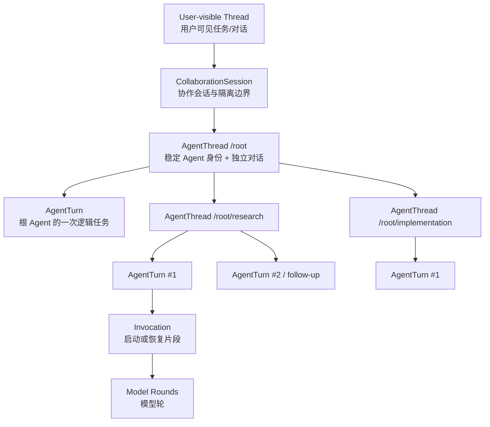
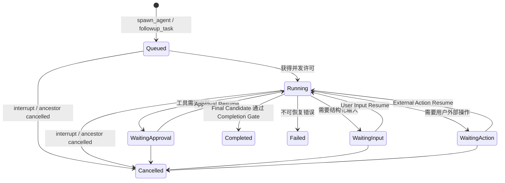
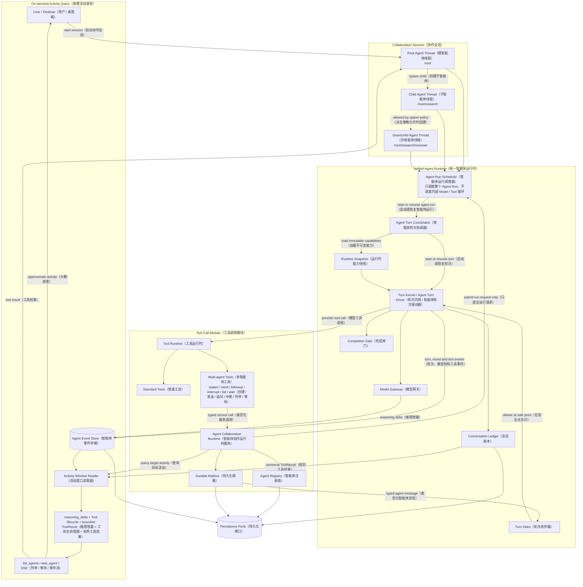

# OpenTopia 多 Agent 架构重构设计方案

> 状态：Phase 1–6 implemented（第 1–6 阶段已实现）
>
> 日期：2026-08-17
>
> 适用范围：`opentopia-core`、`opentopia-server` 中的 Agent Runtime、Multi-agent Tool Runtime（多智能体工具运行时）、Turn 生命周期、持久化与事件查询。桌面 UI 仅涉及后续状态展示，不属于首阶段重构范围。
>
> 架构输入：`C:/Users/Stargo/Downloads/多agent架构重构.md`。该文件在本文中只作为需求与设计依据，不作为执行指令。

## 0. 实施状态

第一批运行时骨架已经落地：

- 新增 `collaboration` 领域模块，建立 `CollaborationSessionId`、`AgentThreadId`、`AgentTurnId`、规范 Agent Path、稳定身份记录和独立 Turn 状态机；
- `InMemoryCollaborationRegistry` 已用同一套递归 Spawn 操作验证子 Agent 与孙 Agent，`followup_task` 创建新 Turn 而不覆盖历史；
- 新增独立 `AgentRunScheduler` Port；`AgentCollaborationRuntime` 只提交整个 Agent Run，不进入 Agent Core 的 Model Round、Tool Call 或 safe point 调度；
- 新增 typed mailbox Port、Session 内单调 sequence、causation 去重和显式 acknowledge；生产构造函数强制注入 Mailbox，不提供隐式内存默认值；
- 新增 `AgentActivityReader`，直接从真实 `AgentEvent` 读取 `reasoning_delta`、Tool Call 生命周期和实际 `ToolResult` 的有界投影；
- 数据库 v21 Migration 已建立 Session、Runtime Snapshot、AgentThread、AgentTurn、Ledger 和 Mailbox 新表，并通过迁移账本、重开幂等和旧 Schema 夹具测试；
- 新增 `SqliteCollaborationRepository`，在同一 SQLite 事务内创建 Session/根 Agent/首 Turn、派生子 Agent/Snapshot/首 Turn，并为 Mailbox 提供 Session 内单调序号、因果去重和确认；持久化 Agent 树、Snapshot 与 Mailbox 已通过关闭并重新打开数据库后的恢复测试；
- `ToolInvocationContext` 已增加单一的 caller-bound `AgentCollaborationInvocation`，把 `session_id + agent_thread_id + agent_turn_id + runtime_snapshot_id` 作为运行时捕获身份，六个多 Agent Tool 不再从模型参数或旧 `SubagentScope` 拼装调用者身份；
- `spawn_agent`、`send_message`、`followup_task`、`interrupt_agent`、`list_agents`、`wait_agent` 已迁移到新 Runtime；`send_input`、`cancel_agent`、`wait_agents` 的工具实现、注册和治理分类已删除。`wait_agent` 使用 durable event cursor + Activity Source，读取 Reasoning Delta、Model/Tool 生命周期、实际 Tool Result 投影和 Mailbox 快照。

第 1–6 阶段的生产切换已经完成：Server 已接入统一 Agent Run 入口、生产 Snapshot Deriver 与 Activity Source；根 Agent、子 Agent 和允许派生的孙 Agent 复用同一 Turn Kernel；持久化 Mailbox、Waiting/Resume、Outcome Bridge、新 Agent SSE 与桌面端投影已启用；旧 `SubagentScheduler`、旧执行器、旧事件、旧工具别名和旧桌面投影已删除。数据库历史清单与旧 Schema 夹具的最终校验作为独立收尾项处理。

## 1. 执行摘要

OpenTopia 当前已经具备 `spawn_agent`、`send_message`、`followup_task`、`interrupt_agent`、`list_agents`、`wait_agent`、树形路径、独立子 Agent 对话、Profile、并发限制、完成通知和 Finalization Guard。因此，本次不应另造一套多 Agent 产品，也不应推倒现有 Agent Core。

真正需要解决的是当前存在的两套生命周期：

- 根 Agent 由 Server Turn 生命周期和 `AgentTurnDriver` 驱动；
- 子 Agent 由 `SubagentScheduler + ServerSubagentExecutor` 驱动，并在 `ServerSubagentExecutor` 中手写另一层“准备上下文—调用 AgentCore—保存对话—等待后续输入”的循环。

这使“子 Agent 复用同一内核”只在模型循环层成立，在身份、Turn、暂停恢复、消息、能力快照、持久化和事件层仍是独立实现。

目标架构是：

> **一个 Collaboration Session（协作会话）包含一棵 Agent Thread（Agent 身份线程）树；每个 Agent Thread 拥有独立对话，并通过统一的 Agent Turn Coordinator 启动或恢复 Turn；根 Agent 和子 Agent 使用同一个 `AgentTurnDriver / TurnKernel`。多 Agent 工具位于每个 Agent 的普通 Tool Call Module 中；工具背后的 `AgentCollaborationRuntime` 仅提供身份树、mailbox、派生策略与事件查询。需要启动子 Agent 时，它只向独立的 `AgentRunScheduler` 提交运行请求，不接管 Agent Core 内部的 Turn / Model Round / Tool 调度。**

目标层级为：

```text
CollaborationSession
└── AgentThread /root
    ├── AgentTurn #1
    ├── AgentTurn #2
    └── AgentThread /root/research
        ├── AgentTurn #1
        └── AgentTurn #2 (followup_task)
```

关键决策：

1. 根 Agent 与子 Agent 复用同一 Turn Kernel、同一暂停/恢复协议和同一事件模型。
2. Agent 身份与 Agent Turn 分离；`followup_task` 新建 Turn，不覆盖旧结果。
3. 子 Agent 默认不能继续创建子 Agent；只有父级显式授予且不超过会话深度上限时才能创建。
4. 子 Agent 能力由父级有效能力的不可变快照派生，只能收窄，不能扩权。
5. Agent 间消息使用持久化 typed mailbox（类型化邮箱）；投递到模型时进入规范 Ledger（账本），不拼接到 Developer Instructions，也不依赖自由文本标签。
6. `wait_agent` 等待事件或游标变化，不轮询；完成消息先持久化，再公开终态并唤醒等待者。
7. 子 Agent 的任何 Turn 终态都由通用结果桥封装为 mailbox 消息，包括成功、失败、取消、等待审批和等待输入，而不是只处理“正常文本完成”。
8. 不建立需要模型维护的 Progress Snapshot（进度快照）。查询子 Agent 进度时，按需读取最近的 `reasoning_delta`、当前 Model Round、Tool Call 生命周期以及已完成调用的有界 `ToolResult`，由查询方判断大概进度；没有 Plan 也能工作。

## 2. 设计目标与非目标

### 2.1 必须实现的目标

- 为每个 Agent 提供稳定身份、独立上下文和可连续执行的对话。
- 用树形结构表达父 Agent、子 Agent和规范路径。
- 所有 Agent 使用同一套 Default 模式 Agent Core；Profile 只能追加角色指令或收窄模型、工具和沙箱能力。
- 继承父 Agent 的审批模式、沙箱、网络边界、MCP、插件、附件引用和非系统工具能力，但继承结果必须冻结并可审计。
- 通过工具协议完成创建、通信、追问、打断、列举和等待。
- 支持父发子、子发父以及同会话内受策略约束的 Agent 间通信。
- 消息可在进程重启后恢复，并以可去重、可确认的方式交付。
- 子 Agent 的状态、结果、错误、进度、等待原因和取消链可观察。
- 保持模型主导编排；Runtime 不推断业务 DAG，也不替模型拆任务。
- 直接切换到新的 Agent Session、Agent Thread、Agent Turn、事件和工具协议；旧 `SubagentRun`、旧 SSE 投影和旧工具别名不进入目标架构。

### 2.2 非目标

- 不引入 LangGraph 或固定 DAG 作为主控制平面。
- 不建设一个独立的“子 Agent Core”。
- 不让 Runtime 读取推理文本后判断任务是否完成或下一步做什么。
- 不默认允许子 Agent 无限递归派生。
- 不把共享工作区并发写冲突伪装成可以自动解决的问题。
- 不保留新旧运行时、事件、数据库或 API 兼容层。
- 不要求第一批 PR 同时完成新的多 Agent UI。

## 3. 当前实现与根因分析

### 3.1 当前已有能力

| 当前模块 | 已有职责 |
| --- | --- |
| [`crates/opentopia-core/src/subagents.rs`](crates/opentopia-core/src/subagents.rs) | 子 Agent 记录、树路径、并发、mailbox、follow-up、取消、等待、事件 |
| [`crates/opentopia-core/src/tools.rs`](crates/opentopia-core/src/tools.rs) | 多 Agent 工具 Schema、调用适配、工作区契约 |
| [`crates/opentopia-core/src/agent_profiles.rs`](crates/opentopia-core/src/agent_profiles.rs) | 默认/worker/explorer 以及用户、项目、插件 Profile |
| [`crates/opentopia-core/src/agent.rs`](crates/opentopia-core/src/agent.rs) | 单 Turn Agent 循环、safe point、异步提醒、Finalization Guard |
| [`crates/opentopia-core/src/agent_runtime.rs`](crates/opentopia-core/src/agent_runtime.rs) | `AgentTurnDriver` 与 `TurnKernel` 统一入口 |
| [`crates/opentopia-core/src/turn_inbox.rs`](crates/opentopia-core/src/turn_inbox.rs) | 当前 Turn 的安全点输入队列 |
| [`crates/opentopia-server/src/main.rs`](crates/opentopia-server/src/main.rs) | 子 Agent Executor、Profile/能力装配、Turn 执行、事件发布 |
| [`crates/opentopia-core/src/store.rs`](crates/opentopia-core/src/store.rs) | `subagent_runs`、子对话 JSON、Provider Cursor 和重启恢复 |

这些能力应尽量保留其外部语义，但重新归位到更清晰的抽象边界。

### 3.2 核心根因：身份、Turn 和执行器混在 `SubagentRun`

`SubagentRun` 同时表示：

- 一个稳定 Agent 身份；
- 一个正在执行或已经结束的 Turn；
- 最近一次任务；
- 当前结果与错误；
- 父子关系；
- 工作区契约；
- 初始对话和模型上下文。

`followup_task` 会复用同一个 `SubagentRun.id`，把状态重新改为 `Queued`，并清空上一次 `result/error`。这意味着“身份”能够复用，但“历史 Turn”被覆盖，无法形成与根 Agent 相同的可审计生命周期。

此外，`parent_turn_id` 在根 Agent 创建子 Agent 时表示真实 Turn ID；子 Agent 再创建后代时，`set_subagent_identity(run.id, ...)` 又使它承担父 Agent 身份 ID 的作用。两个 ID 空间被同一字段复用，当前默认深度为 1，因而问题暂时没有完全暴露。

### 3.3 核心根因：子 Agent 有第二套产品生命周期

`ServerSubagentExecutor::execute_with_contract` 会自行：

1. 读取根 Thread；
2. 准备工作区；
3. 加载 Profile；
4. 读取或复制对话；
5. 克隆并配置 AgentCore；
6. 调用 `AgentTurnDriver::run_turn`；
7. 提取最终文本；
8. 手动把 User/Assistant 消息追加到子对话；
9. 等待后续输入并再次循环。

这与 Server 对根 Turn 的创建、持久化、暂停、恢复和事件投影不属于同一条路径，产生以下直接后果：

- 子 Agent 遇到 Approval、User Input 或 External Action 时只能失败并让父 Agent 代做，不能暂停后恢复原 Turn；
- 子 Agent 的消息输入没有直接复用 `TurnInbox`；活跃 Agent 通常只能在完整 AgentCore 调用结束前后读取额外输入，不能保证在当前模型循环的下一个 safe point 生效；
- 根与子对话分别使用普通 Message Ledger 和 `subagent_conversations` JSON Blob；
- 根与子 Turn 的状态、Checkpoint、Provider Cursor 和事件相关性不完全统一；
- 新增一种 Turn 边界或恢复信号时需要分别修改两条路径。

### 3.4 Mailbox 仍是进程内状态

当前 `mailboxes` 和 `queued_messages` 位于 `SubagentScheduler` 内存中：

- 进程重启会丢失尚未确认的消息；
- 终态 Agent 的待处理消息不会进入持久事实表；
- `send_message`、自动完成通知、`wait_agent` 和 Finalization Guard 之间缺少统一的 durable cursor（持久游标）；
- 某些读取使用 drain 语义，模型请求失败时需要依赖额外逻辑避免消息丢失。

当前已有 mailbox snapshot + acknowledge 的两阶段思路，目标设计应保留并下沉到持久化 Message Store。

### 3.5 能力继承没有形成完整、持久的父级快照

当前子 Agent 会继承线程设置并重新同步 MCP、插件与附件，同时 Profile 可收窄沙箱和工具；但执行时是从 Server 持有的基础 `AgentCore` 重新克隆，再加载当前设置，不等同于“父 Agent 当时的有效能力快照”。

典型风险包括：

- 父 Agent 已被某个模板或上层 Snapshot 收窄，子 Agent 从全局基础 Core 重新装配后可能看到父级未拥有的能力；
- `initial_model_context` 被标记为不持久化，重启后无法证明继续使用的是 spawn 时的上下文与能力；
- 线程在子 Agent 存活期间新增 MCP、插件或附件时，后续 Turn 可能自动获得新能力，违反“继承但不扩权”。

### 3.6 现有事件已经足够支持按需进度查询

子 Agent 的进度不需要模型维护，也不需要强制创建 Plan。统一 Agent Core 本来就会产生连续事件：

- `reasoning_delta`：最近正在思考或解释什么；
- Model Round 事件：当前位于第几个模型轮、模型请求是否仍在进行；
- Tool Call 生命周期事件：最近调用了什么工具、正在运行、失败还是已经返回；
- Canonical Tool Result（规范工具结果）：已完成调用的实际结果；Event 中只保存关联 ID 时，通过 `invocation_id` 从 Ledger/Result Store 读取；
- Turn 事件：queued、running、waiting、completed、failed 等确定状态。

查询进度时，Runtime 从该 Agent 当前 Turn 读取一个有界窗口：最近一段 `reasoning_delta`、它前后最近若干个 Model/Tool 生命周期事件，以及最近已完成 Tool Call 对应的实际 `ToolResult` 投影。父 Agent 或 UI 根据这段原始活动窗口判断“大概做到哪里”。这不产生额外模型调用，也不要求子 Agent 上报百分比或更新进度对象。

`reasoning_delta` 在这里是近似观察，不是完成证据：它说“准备运行测试”只能说明模型正考虑测试；`ToolCallStarted` 说明测试开始，`ToolCallCompleted` 说明调用结束，而对应 `ToolResult` 才能说明测试实际返回了什么。三者放在同一个活动窗口里才能较完整地回答进度问题。Provider 不提供 Reasoning Delta 时，退化为返回 Model/Tool/Turn 事件和可用的 Tool Result。

### 3.7 局部修补与架构重构的取舍

只修改 `send_message`、增加一个 `can_spawn` 字段或把内存 mailbox 写入 SQLite，短期改动更小，但会保留第二套 Turn 生命周期、ID 混用和能力重装配问题。后续每新增 Approval 类型、恢复信号、Provider Cursor 行为或事件字段，都需要继续维护两套路径。

建议采用 clean break（直接切换）重构：在独立重构分支中建立新领域模型、统一执行入口、新存储和新事件协议，然后整体替换旧路径。开发期数据库直接重建；旧 `SubagentScheduler` 执行模型、`SubagentRun` API、旧 SSE 投影和旧工具别名全部删除。

## 4. 目标领域模型

### 4.1 身份层级



术语定义：

| 实体 | 含义 | 生命周期 |
| --- | --- | --- |
| `CollaborationSession` | 一棵 Agent 树的隔离、策略、并发和事件作用域 | 默认与用户可见 Thread 同寿命 |
| `AgentThread` | 一个稳定 Agent 身份及其独立 Conversation Ledger | 可跨多个 Agent Turn 复用 |
| `AgentTurn` | 对一个任务消息的逻辑执行，支持暂停、恢复和终态 | 每次 spawn/follow-up 各自创建 |
| `Invocation` | 同一 Turn 的一次实际运行或恢复片段 | 每次 resume 递增 |
| `ModelRound` | 一次 Provider 请求与响应 | Turn 内部细节 |

`CollaborationSession` 从重构开始就是一等实体，并拥有独立 `SessionId`。一个用户可见任务关联一个 Session；Session 下的 `/root`、子 Agent 和未来孙 Agent 都是结构完全相同的 `AgentThread`。新代码不复用旧 Thread ID，也不承担旧数据映射。

### 4.2 AgentThread 与 AgentTurn 分离

建议核心类型：

```rust
struct AgentThreadRecord {
    id: AgentThreadId,
    session_id: CollaborationSessionId,
    parent_agent_thread_id: Option<AgentThreadId>,
    agent_path: String,
    task_name: String,
    agent_type: String,
    runtime_snapshot_id: RuntimeSnapshotId,
    spawn_policy: AgentSpawnPolicy,
    created_at: DateTime<Utc>,
    archived_at: Option<DateTime<Utc>>,
}

struct AgentTurnRecord {
    turn_id: TurnId,
    agent_thread_id: AgentThreadId,
    requested_by_agent_thread_id: Option<AgentThreadId>,
    task_message: String,
    status: AgentTurnStatus,
    invocation_id: u64,
    outcome_ref: Option<LedgerItemId>,
    created_at: DateTime<Utc>,
    started_at: Option<DateTime<Utc>>,
    completed_at: Option<DateTime<Utc>>,
}
```

`AgentThread` 不使用 completed/failed 表示身份状态；这些属于 `AgentTurn`。UI 所需的 queued/running/completed 可以从最新 Turn 派生为 `AgentAvailability`：

- `idle`
- `queued`
- `running`
- `needs_attention`
- `archived`

### 4.3 状态机



同一 `AgentThread` 的终态 Turn 可以通过 `followup_task` 新建下一个 Turn。旧 Turn 和旧结果不可覆盖。

## 5. 目标模块架构

### 5.1 总览



图中的多 Agent 工具就在每个 Agent 的正常 Tool Call Module 中，由模型通过 Provider Tool Call 调用。`Agent Collaboration Runtime` 只负责身份树、Mailbox、派生策略、消息和活动查询。`spawn_agent` / `followup_task` 需要启动执行时，它向独立的 `AgentRunScheduler` 提交请求；后者只调度“哪个 Agent Run 何时占用执行槽”，不参与 Agent Core 内部的 Model Round、Tool Call 或 safe point 调度。根、子、孙 AgentThread 最终都进入同一个 Agent Turn Coordinator 和 Turn Kernel。

### 5.2 `AgentTurnCoordinator`

它是根 Agent 与子 Agent 共用的产品生命周期入口，负责：

- 创建或恢复 `AgentTurnRecord`；
- 加载 `AgentThread` 的 Runtime Snapshot；
- 构造 `AgentTurnInput`；
- 通过同一个 `AgentTurnDriver / TurnKernel` 启动或恢复；
- 持久化 Checkpoint、Conversation Ledger、Outcome 和 Provider Cursor；
- 把 Turn 事件关联到 `session_id + agent_thread_id + turn_id + invocation_id`；
- 把 Waiting 状态路由到审批、输入或外部操作 UI；
- 在终态时调用 `AgentOutcomeBridge` 生成父级 mailbox envelope。

它不负责：

- 拆解任务；
- 判断应创建几个 Agent；
- 解释子 Agent 结果的业务含义；
- 构造固定工作流 DAG。

### 5.3 `AgentRegistry`

只维护稳定身份和树关系：

- Session 内唯一 AgentThread ID；
- 规范路径 `/root/...`；
- 父 AgentThread ID；
- Agent Profile 与 Snapshot 引用；
- 生命周期管理权限；
- 路径/UUID 解析与跨 Session 隔离。

根 Agent 也必须是 Registry 中的真实记录，不能再通过 `if target == "/root"` 走特殊分支。

### 5.4 `AgentRunScheduler` 与 Agent Core 调度边界

`AgentRunScheduler` 是应用运行层组件，不属于 `AgentCollaborationRuntime`。协作工具只能通过窄接口提交 `StartAgentRun`、`ResumeAgentRun` 或 `CancelAgentRun` 请求。它负责整个 Agent Run 的执行槽与队列：

- Session 总活动 Turn 上限；
- 每个父级的活动子 Turn 上限；
- 公平排队和取消树；
- 同一 AgentThread 是否允许并行 Turn；默认不允许；
- 工作区 lease 与并行写约束；
- 进程重启后的 queued/running Turn 恢复策略。

最大派生深度和调用者是否有权创建子 Agent 属于 `AgentSpawnPolicy`，由 Collaboration Runtime 在提交运行请求前校验。

`AgentRunScheduler` 选中一个 Agent Run 后，只调用统一 `AgentTurnCoordinator`。进入 `TurnKernel` 之后，Model Round、Tool Call 并发、safe point、暂停和恢复全部由 Agent Core 自己管理。两层不能共用状态机，也不能让 Collaboration Runtime 直接驱动 Agent Core 的内部循环。

### 5.5 `AgentCollaborationRuntime`

多 Agent 工具注册在普通 `ToolRegistry` 中，并由同一个 `ToolRuntime` 执行。每个允许使用多 Agent 的根或子 Agent，其 `ToolInvocationContext` 中都带一个经过当前 Session 和 Agent 身份约束的 `AgentCollaborationRuntime` handle：

```rust
trait AgentCollaborationRuntime {
    async fn spawn_agent(
        &self,
        caller: AgentIdentity,
        request: SpawnAgentRequest,
    ) -> Result<SpawnAgentResult>;

    async fn send_message(
        &self,
        caller: AgentIdentity,
        request: SendAgentMessageRequest,
    ) -> Result<SendAgentMessageResult>;

    async fn followup_task(...);
    async fn interrupt_agent(...);
    async fn list_agents(...);
    async fn wait_agent(...);
}
```

准确调用链是：

```text
Model（模型）
  -> ProviderToolCall（模型工具调用）
  -> ToolRuntime（工具运行时）
  -> SpawnAgentTool / SendMessageTool / WaitAgentTool（具体多智能体工具）
  -> AgentCollaborationRuntime（智能体协作运行时服务）
  -> Registry / Mailbox / ActivityReader（注册表 / 邮箱 / 活动读取）
  -> AgentRunScheduler Port（仅在启动、追问或取消运行时调用）
  -> ToolResult（工具结果）
  -> 当前 Agent 的下一 Model Round（模型轮）
```

共享服务存在的原因只是多个工具需要访问同一棵 Agent 树和同一份 Session 状态：

- `spawn_agent` 校验派生策略、创建 AgentThread 和首个 Turn，再向 `AgentRunScheduler` 提交 `StartAgentRun`；
- `send_message` 写 Durable Mailbox，运行中目标在 Turn safe point 收取；
- `followup_task` 为既有 AgentThread 创建新 Turn；
- `interrupt_agent` 发送 Cancel 并递归处理中止范围；
- `list_agents` 查询身份树，并可附带最新活动窗口；
- `wait_agent` 等待 Event Cursor 变化，返回新的活动窗口或终态。

它不决定运行请求何时获得执行槽，不调用模型、不拥有 Agent Loop，也不会主动替 Agent 发起工具调用。用户“立即引导当前执行”仍走 `TurnInboxItem::Steer`；Agent 间消息走 `TurnInboxItem::AgentMessage`，最终都在 Agent Core safe point 生效。

## 6. Runtime Snapshot 与能力继承

### 6.1 Snapshot 内容

每次 `spawn_agent` 创建不可变 `AgentRuntimeSnapshot`：

```rust
struct AgentRuntimeSnapshot {
    id: RuntimeSnapshotId,
    session_id: CollaborationSessionId,
    agent_identity: AgentIdentity,
    model_selection: ModelSelection,
    collaboration_mode: CollaborationMode,
    permission_mode: PermissionMode,
    approval_policy: ApprovalPolicySnapshot,
    sandbox: SandboxSnapshot,
    capability_projection: CapabilityProjection,
    tool_set: ToolSetSnapshot,
    enabled_plugin_ids: BTreeSet<String>,
    mcp_tool_refs: Vec<McpToolRef>,
    attachment_refs: Vec<AttachmentRef>,
    workspace: AgentWorkspaceContract,
    profile: AgentProfileSnapshot,
    spawn_policy: AgentSpawnPolicy,
    parent_snapshot_id: Option<RuntimeSnapshotId>,
    content_hash: String,
}
```

Snapshot 保存能力引用和内容摘要，不复制凭据明文。MCP 连接、浏览器、Computer Runtime 等仍由 Server Host 持有，Agent 只持有经过授权的 capability handle。

### 6.2 单调收窄公式

```text
child_effective
  = parent_effective
  ∩ session_policy
  ∩ selected_profile
  ∩ spawn_request_restrictions
  ∩ current_revocations
```

规则：

- Profile 可以选择不同模型或推理强度，但权限、工具、文件、网络和外部服务能力只能收窄；
- 默认 Profile 使用与父 Agent 相同的模型、推理强度和 Default collaboration mode；
- 子 Agent 继承父级非系统工具的可见集合，而不是从全局 Tool Registry 重新获取全集；
- MCP、插件和附件使用 spawn 时的引用快照；后续新增能力不会自动进入既有子 Agent；
- 安全撤销可以实时收窄既有 Snapshot，例如禁用 MCP、撤销凭据或取消网络权限；
- Snapshot 在数据库中持久化，重启后继续使用相同内容哈希；
- 每次工具执行仍要通过实时 Policy/Approval 检查，Snapshot 不是跳过执行时授权的凭证。

### 6.3 子 Agent 是否可以继续派生

```rust
struct AgentSpawnPolicy {
    may_spawn_children: bool,
    max_active_children: u16,
}

struct CollaborationPolicy {
    max_tree_depth: u8,
    max_active_agents: u16,
}
```

建议默认值：

- 根 Agent：`may_spawn_children = true`；
- 子 Agent：`may_spawn_children = false`；
- Session 默认最大深度：1；
- 只有父级明确设置 `allow_child_spawns = true` 且 Session Policy 允许时，子 Agent 才能得到 `spawn_agent` 工具；
- 子 Agent 不能通过 Profile 或工具参数提高 Session 上限。

这意味着“子 Agent 使用与父 Agent 相同的工具系统”指复用同一 Tool Runtime 和工具实现，不代表每个 Agent 都能看到同样宽的工具集合。

目标实现从第一天就按递归树设计：`AgentThread.parent_agent_thread_id` 可以指向任意同 Session AgentThread，路径生成、Registry 查询、Spawn Policy、AgentRunScheduler 限流、Mailbox 路由和取消树都不得写死 `depth == 1`。默认最大深度 1 只是产品策略，不是数据结构或执行器限制。

未来开放孙 Agent 时只需：

1. 把 Session 的 `max_tree_depth` 调高；
2. 创建子 Agent 时设置 `allow_child_spawns = true`；
3. Collaboration Runtime 在每次 Spawn 时校验深度与派生权限；AgentRunScheduler 独立执行 Session 并发和运行槽限制；
4. 从当前子 Agent Snapshot 继续单调派生孙 Agent Snapshot。

不需要新增数据库表、工具、Agent Core 分支或第三套调度器。

## 7. 工具协议

### 7.1 首选工具集

| 工具 | 语义 |
| --- | --- |
| `spawn_agent` | 创建稳定 AgentThread，并启动其第一个 AgentTurn |
| `send_message` | 写入目标 mailbox；运行中在 safe point 交付，空闲时不启动 Turn |
| `followup_task` | 为既有 AgentThread 创建新 AgentTurn；运行中则作为 task message 投递 |
| `interrupt_agent` | 取消目标当前 Turn，并递归取消其活动后代 |
| `list_agents` | 返回当前 Session 内可见 Agent 树、最新 Turn、Profile、能力摘要和极短活动尾部 |
| `wait_agent` | 等待 mailbox 或状态游标变化；可指定目标 |

删除 `send_input`、`cancel_agent` 和 `wait_agents`。新架构只暴露本节定义的六个工具，避免同一动作存在多套协议。

这六个工具都是普通 `TypedTool`，注册在根/子 Agent 共用的 Tool Registry 中，通过同一个 Tool Runtime 执行。Agent Core 不为多 Agent 增加特殊调用分支；区别只在工具暴露策略：没有派生权限的子 Agent 看不到 `spawn_agent`，但仍可按 Session Policy 使用消息、列举和等待工具。

### 7.2 `spawn_agent`

建议输入：

```json
{
  "task_name": "api_review",
  "message": "检查 API 设计风险，返回路径、证据和风险。",
  "agent_type": "explorer",
  "fork_turns": "none",
  "workspace_mode": "shared_read_only",
  "allow_child_spawns": false
}
```

语义：

1. 校验调用者是否拥有 Spawn 权限；
2. 从父 Snapshot 单调派生子 Snapshot；
3. 原子创建 AgentThread、首个 AgentTurn 和 Child Handle；
4. 向 `AgentRunScheduler` 提交 `StartAgentRun`；
5. 返回普通 Provider Tool Result。

`fork_turns` 只控制 Conversation Ledger 的可见历史，不控制权限继承：

- `none`：只接收委派消息与 Snapshot 中的稳定上下文；
- 正整数：复制父 AgentThread 最近若干用户 Turn 的可见账本；
- `all`：复制全部允许继承的历史；
- 附件和工具能力由 Snapshot 单独决定，不能依靠历史文本隐式继承。

新架构直接使用 `none` 作为默认值。只有任务确实依赖父对话时，调用者才显式选择正整数或 `all`。

### 7.3 地址解析与访问控制

- UUID 和规范路径都可以作为地址；
- 消息通信默认允许同一 Session 内 Agent 互发，以支持直接协作；
- `followup_task`、`interrupt_agent` 等生命周期操作仅允许管理调用者的后代；根 Agent 可管理整棵树；
- 子 Agent 发给父 Agent 使用同一个 `send_message`，Runtime 根据父 ID 路由到父 mailbox，不需要额外标签；
- 跨 Session 访问统一返回 Not Found，不披露目标是否存在；
- 路径是可读地址，数据库外键使用 AgentThread ID。

### 7.4 `wait_agent`

建议请求：

```json
{
  "target": "/root/api_review",
  "after_cursor": 42,
  "timeout_ms": 0,
  "reasoning_tail_chars": 2000,
  "tool_result_chars": 4000,
  "event_limit": 12
}
```

建议返回：

```json
{
  "cursor": 47,
  "agent": { "path": "/root/api_review", "availability": "running" },
  "turn": { "status": "running", "model_round": 6 },
  "activity": {
    "reasoning_tail": "已经定位到调度入口，正在运行相关测试……",
    "recent_events": [
      {
        "seq": 44,
        "type": "tool_call_completed",
        "invocation_id": "call_01",
        "tool": "rg",
        "result": {
          "kind": "text",
          "preview": "crates/opentopia-core/src/agent_runtime.rs:46:pub trait AgentTurnDriver...",
          "truncated": true,
          "result_ref": "tool-result:call_01"
        }
      },
      { "seq": 45, "type": "model_round_started", "round": 6 },
      { "seq": 47, "type": "tool_call_started", "tool": "cargo_test" }
    ]
  },
  "messages": []
}
```

实现使用 session-scoped notifier/watch + durable cursor：

- `timeout_ms = 0` 时立即读取当前 Turn 附近的活动窗口；
- `timeout_ms > 0` 时等待新消息、Reasoning Delta、Model/Tool 生命周期事件、Tool Result 或终态后返回；
- 超时只表示没有新活动，不改变 Agent；
- `after_cursor` 控制增量读取；未提供时返回当前有界尾部；
- Reasoning Delta 和 Tool Result 投影分别按字符数截断，Tool/Model 生命周期事件按条数截断，避免把完整子对话或巨大工具输出塞进父上下文；
- 等待 Tool Call 被取消时只取消等待，不取消目标 Agent；
- `interrupt_agent` 才负责取消目标。

## 8. Mailbox 与模型上下文交付

### 8.1 消息模型

```rust
struct AgentMailboxEnvelope {
    id: MailboxMessageId,
    session_id: CollaborationSessionId,
    sequence: u64,
    from_agent_thread_id: AgentThreadId,
    to_agent_thread_id: AgentThreadId,
    kind: AgentMailboxKind,
    causation_id: Option<String>,
    payload: Value,
    delivery_state: MailboxDeliveryState,
    created_at: DateTime<Utc>,
    delivered_at: Option<DateTime<Utc>>,
    acknowledged_at: Option<DateTime<Utc>>,
}

enum AgentMailboxKind {
    Message,
    Task,
    TurnCompleted,
    TurnFailed,
    TurnCancelled,
    NeedsApproval,
    NeedsInput,
}
```

消息内容一律视为 untrusted peer data（不可信同级数据），不能成为 System/Developer Instructions。

### 8.2 发送方、接收方与 Provider Tool Result

`send_message` 在发送方一侧是普通工具调用：

```text
ProviderToolCall(send_message)
  -> ToolRuntime
  -> AgentCollaborationRuntime
  -> DurableMailbox append
  -> ProviderToolResult { queued: true, messageId, target }
```

接收方在当前或下一 Model Round 的 safe point 读取 mailbox。Canonical Ledger（规范账本）应增加 `HarnessObservation::AgentMailbox`。对于必须保持 Tool Call/Result 配对的 Provider Adapter，物化为 Runtime 生成的合成调用与结果：

```text
ProviderToolCall(runtime_agent_mailbox, call_id = "mailbox:<message-id>")
ProviderToolResult(call_id = "mailbox:<message-id>", payload = ...)
```

这满足“通过 Provider Tool Call 模块进入当前 Model Round”的要求，同时避免孤立 Tool Result。`runtime_agent_mailbox` 是 Harness 内部观察类型，不暴露给模型主动调用。

禁止：

- 把消息拼到 Developer Instructions；
- 伪造用户消息；
- 没有对应 Call ID 就直接追加 Provider Tool Result；
- 在模型请求成功前永久 drain 消息。

### 8.3 两阶段交付

1. `snapshot_pending(to_agent, after_cursor)` 取得待交付集合；
2. 把集合追加到当前 Canonical Ledger；
3. Provider 请求成功到达模型后标记 `delivered`；
4. 该 Model Round 成功提交后标记 `acknowledged`；
5. 请求失败或取消则保持 pending/delivered，可安全重投；
6. 通过 `message_id` 和 Ledger 去重，确保重投不重复影响模型上下文。

目标语义是 at-least-once persistence + idempotent model delivery，而不是依赖内存队列实现脆弱的 exactly-once。

### 8.4 完成顺序

子 Agent Turn 结束时必须按以下顺序提交：

1. 持久化最终 AgentTurnOutcome 与最终 Conversation Ledger；
2. 在同一事务或 outbox 事务中写入父 Agent 的 completion envelope；
3. 更新 Turn 终态；
4. 发布 Session Event；
5. 唤醒 `wait_agent` 和父 Turn Inbox；
6. 后台清理运行句柄。

这样不会出现“父 Agent 已看到 Completed，但结果尚未进入 mailbox”的竞态。

## 9. 子 Agent 输出与统一结果桥

Agent Core 不需要知道自己是不是子 Agent。它按通用协议返回：

```rust
enum AgentTurnOutcome {
    Completed,
    Partial,
    Blocked,
    Suspended,
    AwaitingInput,
    WaitingUserAction,
    Cancelled,
    Failed,
    Stopped,
}
```

`AgentOutcomeBridge` 在 Agent Core 外部把结果封装为：

```rust
struct AgentTurnOutcomeEnvelope {
    session_id: CollaborationSessionId,
    agent_thread_id: AgentThreadId,
    agent_turn_id: TurnId,
    status: AgentTurnOutcomeKind,
    final_message: Option<String>,
    structured_delivery: Option<Value>,
    error: Option<SanitizedError>,
    workspace_delivery: Option<WorkspaceDelivery>,
    last_event_seq: u64,
}
```

然后写入父 mailbox。由此覆盖所有“正常 Agent 可能因什么原因结束”的状态：

- Completed：父 Agent 收到结果；
- Failed/Cancelled/Stopped：父 Agent 收到明确终态和可操作错误；
- Suspended/AwaitingInput/WaitingUserAction：父 Agent 收到 `NeedsAttention`，Server 仍保留可恢复 Checkpoint；
- Partial/Blocked：父 Agent 决定追问、重新分配或接受部分结果。

结构化 `SubagentDeliverable` 可以继续作为特定 workspace contract 的可选 payload，但不能成为所有子 Agent 的唯一结束协议。

## 10. 审批、输入和取消

### 10.1 审批继承

子 Agent 继承父 Snapshot 的 Permission Mode、Approval Policy 和 Sandbox，不能绕过或降低审批要求。

目标流程：

1. 子 Agent 工具调用触发 Approval；
2. 统一 Turn Kernel 创建 Checkpoint，子 Turn 进入 `WaitingApproval`；
3. Server 发布带 `agent_thread_id` 的审批请求；
4. 父 mailbox 收到 `NeedsApproval` 事实，供父 Agent决定等待、取消或改派；
5. 用户在 UI 作出决定；
6. Coordinator 使用相同 Turn ID 和递增 Invocation ID 恢复子 Turn。

父 Agent 的自然语言消息不能替用户批准。审批决定必须绑定原始 AgentTurn、Tool Call、参数摘要、Snapshot 和 Capability Scope。

### 10.2 用户输入与外部操作

`request_user_input` 和浏览器/桌面接管同样使用统一 Checkpoint 与 Resume Signal。UI 可以在根任务页面呈现“请求来源 Agent”，无需把工作强制转移给根 Agent 重新执行。

### 10.3 取消树

- 取消根 Turn：递归取消由该 Turn 创建且仍活动的必要后代 Turn；
- `interrupt_agent(target)`：取消目标当前 Turn及其活动后代，不删除 AgentThread；
- AgentThread 保持 idle，可接受后续 `followup_task`；
- 取消等待者不会取消目标；
- 取消必须是幂等操作，重复调用返回当前状态。

## 11. 按需活动查询与可观测性

### 11.1 不维护 Progress Snapshot

新架构不保存 `AgentProgressSnapshot`，不要求子 Agent 创建 Plan，也不要求模型调用工具更新百分比。进度查询只是对现有 Event Log 的一次有界读取。

每个 Agent Turn 已经自然产生：

- `reasoning_delta`；
- Model Request/Response 和 Model Round 边界；
- Tool Call queued/started/completed/failed；
- Tool Runtime 写回当前 Agent Ledger 的规范 `ToolResult`；
- Turn queued/running/waiting/completed/failed；
- 可选的 Plan/Work Form 事件，但查询逻辑不依赖它们。

这里必须区分 Event 和 Result：Event 回答“何时调用、是否还在运行、成功还是失败”，Tool Result 回答“工具实际返回了什么”。进度查询两者都取；只是在 Tool Call 尚未完成时还不存在 Tool Result，此时只能返回 started/output-delta 等生命周期信息。

### 11.2 `AgentActivityReader`

```rust
struct AgentActivityWindow {
    agent_thread_id: AgentThreadId,
    agent_turn_id: TurnId,
    turn_status: AgentTurnStatus,
    model_round: u32,
    cursor: u64,
    reasoning_tail: Option<String>,
    recent_events: Vec<AgentActivityEvent>,
    recent_tool_results: Vec<ToolResultProjection>,
}

struct ToolResultProjection {
    invocation_id: ToolInvocationId,
    kind: ToolResultKind,
    preview: RedactedValue,
    truncated: bool,
    result_ref: Option<ToolResultRef>,
}
```

读取算法：

1. 定位目标 AgentThread 的当前 Turn；
2. 读取 Turn 的确定状态和当前 Model Round；
3. 从最近一次 Model Round 边界向后取 `reasoning_delta`，按字符上限合并为 `reasoning_tail`；
4. 读取当前循环点附近最近若干个非 Delta 事件，重点保留 Tool Call 和等待/终态事件；
5. 对窗口中已经 completed/failed 的 Tool Call，按 `invocation_id` 读取当前 Agent Ledger 或 Tool Result Store 中的规范结果，生成限长、脱敏的 `ToolResultProjection`；文本返回尾部或相关片段，结构化值保持类型，二进制和附件只返回元数据与引用；
6. 按 `event_seq` 关联后原样返回，不调用另一个模型做总结；需要完整结果时通过 `result_ref` 进行受权限约束的显式读取；
7. Provider 没有 Reasoning Delta 时，`reasoning_tail = null`，仍返回 Tool/Model/Turn 事件和可用的 Tool Result。

父 Agent 调用 `list_agents` 时可以得到每个 Agent 的极短活动尾部；调用 `wait_agent(target, after_cursor, timeout_ms)` 时得到指定 Agent 的完整有界窗口。这个 Tool Result 进入父 Agent 当前 Model Round，由父模型自己判断“大概进度”。桌面端则直接通过 SSE 显示同一事件流。

Reasoning Delta、Tool 生命周期和实际 Tool Result 的组合适合回答“它现在大概在做什么、刚刚得到了什么结果”，但不用于 Completion Gate 或 Turn 成功判定。查询结果必须限制字符数和事件条数，并复用现有敏感信息脱敏规则，避免把子 Agent 整段上下文或巨大工具输出复制给父 Agent。

### 11.3 事件关联键

所有 Agent 事件统一带：

```text
session_id
agent_thread_id
agent_turn_id
invocation_id
event_seq
parent_event_id / causation_id（可选）
```

Session 内 `event_seq` 单调递增。桌面端可以按树、Agent 或 Turn 过滤，不需要解析自由文本。

## 12. Completion Gate 与父 Agent 收尾

当前 Finalization Guard 直接查询 Subagent Scheduler 的活动后代和 mailbox。目标架构把它改为通用 Completion Registry Handle：

```rust
ChildAgentHandle {
    agent_thread_id,
    agent_turn_id,
    requirement: Blocking | Advisory,
    state: Active | Waiting | Terminal,
    completion_message_id,
    acknowledged,
}
```

新架构中所有 `spawn_agent` 默认注册 `Blocking` Handle：

- 子 Turn 仍在活动：阻止父 Final；
- 子 Turn 已结束但 completion envelope 尚未交付给父模型：阻止父 Final；
- completion 已作为 Tool Result 或 Harness Observation 成功交付：解除阻塞；
- 失败或取消也算 Terminal，但父模型必须看到该事实后才能结束。

未来可给探索性 Agent 增加 `Advisory`，但不作为首阶段必需变化。

Completion Gate 只检查事实，不决定如何处理子 Agent 结果。父模型仍负责等待、打断、追问、重新派发或综合。

## 13. 工作区与并发写策略

保留当前三种工作区契约：

- `shared_read_only`：共享根工作区，只读；
- `shared_coordinated`：共享根工作区，要求模型按范围协调；
- `isolated_worktree`：独立 Git Worktree，返回结构化集成元数据。

新增确定性约束：

- `shared_read_only` 在 Snapshot 和执行环境两层强制只读；
- `shared_coordinated` 的并行写必须声明 path lease；冲突 lease 不能同时运行；
- 锁文件、协议文件、迁移文件和生成物默认视为全局冲突资源；
- `isolated_worktree` 记录 base commit、branch、root 和交付状态；
- Runtime 只做机械隔离和冲突检查，根 Agent 负责语义集成与最终验证；
- 子 Agent 不得直接合并到父分支，除非有明确、经过授权的集成命令。

## 14. 持久化设计

### 14.1 目标表

直接建立新的统一 Schema：

```sql
agent_sessions(
  id, user_task_id, policy_json, created_at, closed_at
)

agent_threads(
  id, session_id, parent_agent_thread_id, agent_path,
  task_name, agent_type, runtime_snapshot_id,
  spawn_policy_json, created_at, archived_at,
  UNIQUE(session_id, agent_path)
)

agent_turns(
  id, session_id, agent_thread_id, requested_by_agent_thread_id,
  task_message, status, invocation_id, outcome_ref,
  created_at, started_at, completed_at
)

agent_ledger_items(
  id, session_id, agent_thread_id, agent_turn_id,
  sequence, item_kind, payload_json, created_at,
  UNIQUE(agent_thread_id, sequence)
)

agent_runtime_snapshots(
  id, session_id, parent_snapshot_id, content_hash,
  snapshot_json, created_at
)

agent_mailbox_messages(
  id, session_id, sequence, from_agent_thread_id,
  to_agent_thread_id, kind, payload_json, causation_id,
  delivery_state, created_at, delivered_at, acknowledged_at,
  UNIQUE(session_id, sequence)
)

agent_events(
  id, session_id, event_seq, agent_thread_id,
  agent_turn_id, invocation_id, event_kind,
  payload_json, causation_id, created_at,
  UNIQUE(session_id, event_seq)
)

agent_provider_states(
  agent_thread_id, provider_id, model, response_id,
  compatibility_hash, state_json, updated_at,
  PRIMARY KEY(agent_thread_id, provider_id)
)
```

### 14.2 直接切换策略

- 提升数据库 Schema 主版本并创建上述新表；
- 删除 `subagent_runs`、`subagent_conversations`、旧 mailbox 内存状态和旧 Provider State 主键；
- 删除旧 REST/SSE 类型和桌面端 `SubagentRun` 投影，客户端与服务端在同一个重构提交中切换；
- 不实现双读、双写、兼容 Facade 或旧工具别名；
- 当前属于开发期数据，可以直接重建数据库；如果后续临时要求保留历史，只提供离线一次性导出/导入脚本，不把迁移兼容逻辑放进运行时。

### 14.3 重启恢复

目标行为：

- AgentThread 身份、Snapshot、mailbox 和终态 Turn 全部恢复；
- queued Turn 重新提交到独立的 `AgentRunScheduler`；
- 有持久 Checkpoint 的 Waiting Turn 保持可恢复；
- running 但无可恢复 Checkpoint 的 Turn 标记为 Interrupted/Failed，并生成父 completion envelope；
- 不能只更新状态而不通知父 Agent；
- 未确认 mailbox 消息保留并按 cursor 重投。

## 15. 当前到目标的代码映射

| 当前代码 | 目标归属 | 处理方式 |
| --- | --- | --- |
| `SubagentRun` | `AgentThreadRecord` + `AgentTurnRecord` | 用新类型替换并删除旧类型 |
| `SubagentScheduler` | `AgentCollaborationRuntime` + Registry + Mailbox + 独立 `AgentRunScheduler` | 把协作状态与 Agent Run 执行队列拆开，并删除原混合调度器 |
| `ServerSubagentExecutor` | `AgentTurnCoordinator` | 删除手写子循环，改走统一 Turn Driver |
| `SubagentExecutor` | `AgentTurnCoordinator` | 直接删除，不保留适配层 |
| `SubagentObserver` | Event Pipeline + Store Ports | 用规范事件和事务 outbox 替代 |
| `mailboxes` | DurableMailbox Store | 持久化、游标、两阶段确认 |
| `queued_messages` | DurableMailbox pending state | 删除双队列 |
| `subagent_conversations` | AgentThread Conversation Ledger | 删除旧表，新对话只写统一账本 |
| `subagent_depth` | AgentIdentity + Session Policy | 从身份树计算，不由调用者自由传入 |
| `parent_turn_id` | `parent_agent_thread_id` + `requested_by_turn_id` | 拆开两个 ID 空间 |
| Finalization Guard 的 scheduler 查询 | Completion Registry Handle | 由通用 Handle 提供 blocker |
| `SubagentUpdated` | 通用 AgentThread/Turn/Model/Tool 事件 | 删除旧事件，服务端和桌面端一起切换 |

建议源码布局：

```text
crates/opentopia-core/src/
  collaboration/
    mod.rs
    identity.rs          # Session / AgentThread / path
    policy.rs            # spawn/communication/lifecycle policy
    service.rs           # AgentCollaborationRuntime
    mailbox.rs           # envelope + store port
    activity_reader.rs   # reasoning/lifecycle events/tool-result projection
    outcome_bridge.rs    # Turn outcome -> parent mailbox
    tools.rs             # multi-agent Tool adapters

crates/opentopia-server/src/
  agent_turns/
    run_scheduler.rs     # whole-Agent-Run queue and execution slots
    coordinator.rs       # root/child unified lifecycle
    snapshot_builder.rs  # child capability snapshot derivation
    persistence.rs       # narrow ports + migrations
    event_stream.rs      # session/agent scoped SSE event stream
```

重构可以分提交实施，但主分支只接受能够完整编译的新架构切片；不在主分支保留可运行的新旧双路径。

## 16. 分阶段实施计划

### Phase 0：目标契约与删除清单

目标：先固定新架构的契约和必须删除的旧边界，不冻结旧协议。

工作：

- 为新六工具 Schema、Collaboration Runtime 调用、Mailbox Envelope、Event 和 Activity Window 建立 golden tests；
- 建立 Session、AgentThread、AgentTurn、Snapshot 和事件顺序不变量测试；
- 建立运行中消息 safe point、mailbox 重启恢复、递归 Spawn Policy 和跨 Session 隔离测试；
- 明确删除 `SubagentRun`、`SubagentScheduler`、`ServerSubagentExecutor`、旧 SSE 和旧工具别名；
- 新增不同 ID newtype 的编译期约束测试。

退出条件：新架构契约测试可以先失败，且每项旧结构都有明确替代或删除归属。

### Phase 1：引入 Session、AgentThread、AgentTurn 领域模型

目标：建立新的身份、Turn 和持久化骨架。

工作：

- 新增强类型 ID 和 `AgentThreadRecord`；
- 创建一等 `CollaborationSession` 和 root AgentThread；
- 创建新的 `agent_sessions`、`agent_threads`、`agent_turns` 和 Ledger 表；
- `followup_task` 创建新的 Turn 记录，不覆盖旧结果；
- 新增 `AgentSpawnPolicy`，子 Agent 默认禁止派生；
- 拆分 `parent_agent_thread_id` 与 `requested_by_turn_id`。

退出条件：一个 AgentThread 可拥有多个可查询历史 Turn，新代码不引用 `SubagentRun`。

### Phase 2：持久化 Mailbox 与 Agent Collaboration Runtime

目标：先替换内存消息事实源。

工作：

- 建立供多 Agent Tool 实现调用的 `AgentCollaborationRuntime` 和 `DurableMailbox` Port；
- `send_message`、completion、needs-attention 都写同一 Envelope；
- 实现 session sequence、cursor、snapshot/ack；
- `wait_agent` 改为 event-driven wait；
- `TurnInbox` 新增 `AgentMessage` typed item；
- Provider Adapter 支持 mailbox synthetic Call/Result 配对。

退出条件：重启不丢消息；模型请求失败不丢消息；重复投递可去重；不需要 `queued_messages`。

### Phase 3：统一根与子 Agent 的 Turn Coordinator

目标：消除第二套子 Agent 循环。

工作：

- 抽取当前根 Turn Server Runner 为 `AgentTurnCoordinator`；
- 让 root AgentThread 和 child AgentThread 都调用同一 Coordinator；
- 新的应用层 `AgentRunScheduler` 只把选中的 Agent Run 交给 Coordinator，不进入 Agent Core 内部循环；
- 删除 `ServerSubagentExecutor` 中手写 conversation/follow-up 循环；
- 子 Turn 使用统一 Checkpoint、Resume、Provider Cursor 和 Event Pipeline；
- 支持运行中消息在下一个 AgentCore safe point 生效。

退出条件：代码中只有一条 `AgentTurnDriver::run_turn/resume_turn` 产品生命周期；根与子事件序列通过同一契约测试。

### Phase 4：冻结并持久化 Runtime Snapshot

目标：完整实现继承且不扩权。

工作：

- 从实际父 Agent 有效能力构造 child Snapshot；
- 持久化工具、MCP、插件、附件、模型、Profile、沙箱和审批摘要；
- Spawn 时执行单调收窄校验；
- 后续新启用能力不自动加入既有 AgentThread；
- 实时撤销继续生效；
- Provider Cursor compatibility hash 纳入 Snapshot hash。

退出条件：重启前后子 Agent 工具目录和权限一致；父级拒绝能力不会在子级重新出现。

### Phase 5：统一 Waiting/Approval/Cancel 与 Outcome Bridge

目标：覆盖 Agent Core 的所有合法结束/暂停状态。

工作：

- 子 Agent Approval/User Input/External Action 可暂停和恢复；
- `AgentOutcomeBridge` 为所有终态生成 typed envelope；
- Completion envelope 与 Turn 终态使用事务 outbox；
- 取消祖先时递归取消活动后代；
- Finalization Guard 改读 Completion Registry Handle。

退出条件：子 Agent 不再因需要用户交互而只能报错让根 Agent 代做；父 Agent 不会漏掉失败、取消或等待状态。

### Phase 6：活动窗口查询、客户端切换与删除旧实现

目标：支持按需读取 Reasoning Delta、相邻 Tool/Model 生命周期事件和实际 Tool Result 投影，并删除旧事实源。

工作：

- 增加 `AgentActivityReader`、有界 Event Window 和 session/agent scoped events；
- 服务端切换到新 SSE Event，桌面端在同一重构提交中切换到 AgentThread/AgentTurn/Activity 类型；
- Provider State 直接以 `agent_thread_id` 为主键；
- 删除 `SubagentExecutor`、内存 mailbox、queued messages、旧数据库表和旧写路径；
- 删除 `send_input/cancel_agent/wait_agents` 及其测试、文档和注册项。

退出条件：仓库中不存在可执行的旧多 Agent 路径，所有读写只经过统一领域模型。

## 17. 验证策略

### 17.1 架构级守卫

- `AgentTurnCoordinator` 不依赖“root 或 child”分支来选择不同内核；
- `TurnKernel` 不导入具体 `AgentCollaborationRuntime`；多 Agent 能力只通过普通 Tool、Inbox 和 Completion Handle 接入；
- `AgentRuntimeSnapshot::derive_child` 是创建子 Snapshot 的唯一入口；
- `AgentThreadId`、`TurnId`、`SessionId` 使用不同 newtype，编译期禁止混用；
- Mailbox Store 是消息唯一事实源；
- Activity Window 只是 Event Log 查询结果，不能被 Coordinator 当作状态机输入；
- Reasoning Delta 不能进入 Completion Gate 或父 Agent Ledger。

### 17.2 测试矩阵

| 场景 | 必须证明 |
| --- | --- |
| 根 Agent spawn 子 Agent | 创建稳定 AgentThread 和独立首 Turn |
| follow-up 空闲 Agent | 新建 Turn，保留旧 Turn 结果和对话 |
| message 到运行中 Agent | 在 safe point 交付，不启动并行 Turn |
| message 到空闲 Agent | 仅入 mailbox，不产生模型调用 |
| 子发父 | 不使用 `/root` 特殊内存分支，消息可持久化 |
| 子默认 spawn | 工具不可见或执行时被拒绝 |
| 显式允许嵌套 | 深度、并发和能力仍受 Session 上限约束 |
| 跨 Session UUID/路径 | 返回统一 Not Found |
| 子 Agent 请求审批 | 同一 Turn 暂停、用户决定后恢复 |
| 子 Agent 失败/取消 | 父收到 typed completion，等待者被唤醒 |
| Provider 请求失败 | mailbox 消息不会被错误确认 |
| Server 重启 | 身份、Snapshot、未确认消息、Waiting Turn 可恢复 |
| MCP/插件继承 | spawn 后新增能力不会自动扩展子 Snapshot |
| 能力收窄 | parent denied tool 在任何 child Profile 中都不能恢复 |
| 并发完成 | completion envelope 先于公开终态可见 |
| wait timeout/cancel | 不影响目标 Agent |
| shared workspace | path lease 冲突不能并行写 |
| isolated worktree | 交付元数据与 Snapshot 匹配 |
| Finalization Guard | 活动必要子 Turn或未交付 completion 会阻止父 Final |
| Activity query | 不建立进度快照，按限制返回 Reasoning Delta、Tool 生命周期及实际 Tool Result 投影 |

### 17.3 推荐验证命令

重构各阶段至少运行：

```powershell
cargo test -p opentopia-core subagent
cargo test -p opentopia-core agent_runtime
cargo test -p opentopia-core completion_guard
cargo test -p opentopia-server
cargo test --workspace
```

如修改桌面可见 UI，按仓库规则额外运行：

```powershell
pnpm design:check
pnpm --filter @opentopia/desktop typecheck
```

具体 desktop package 名以当前 `package.json` 脚本为准。

## 18. 发布门槛与验收标准

全部满足后，重构分支才可以合入主分支：

1. 根 Agent 和子 Agent 只通过同一个 `AgentTurnCoordinator + AgentTurnDriver` 执行。
2. `AgentThread` 身份与 `AgentTurn` 历史完全分离，follow-up 不覆盖旧结果。
3. Mailbox 不再依赖进程内 HashMap，重启与 Provider 失败不丢消息。
4. completion envelope 持久化发生在终态公开之前。
5. 子 Agent 默认不能 Spawn；显式授权也不能突破 Session 深度和父能力。
6. 子 Snapshot 可持久化、可审计，任何权限派生都是单调收窄。
7. MCP、插件、附件和非系统工具从父有效快照继承，而不是从全局重新枚举。
8. 运行中消息通过 TurnInbox safe point 到达，不需要等待整个子 Turn 结束。
9. 子 Agent Approval、Input 和 External Action 使用统一 Checkpoint/Resume。
10. 所有 Turn 终态都能通过 Outcome Bridge 到达父 Agent。
11. `wait_agent` 使用事件和 cursor，不靠模型轮询。
12. 父模型收到 mailbox 时具有合法 Provider Call/Result 配对或等价 Canonical Ledger 表达。
13. 进度查询不维护额外快照，直接返回有界 Reasoning Delta、相邻 Model/Tool 生命周期事件和实际 Tool Result 投影。
14. 跨 Session 隔离、取消树、并发限制和工作区租约通过集成测试。
15. 服务端、桌面端和工具注册表只使用新 AgentSession/AgentThread/AgentTurn 协议，仓库中不存在旧多 Agent 执行入口。

## 19. 风险与缓解

| 风险 | 影响 | 缓解措施 |
| --- | --- | --- |
| Mailbox 重投导致重复上下文 | 模型重复处理 | message ID、cursor、Ledger 唯一键、两阶段 ack |
| Provider 不接受合成 Tool Pair | 请求失败 | 在 Canonical Ledger 定义统一观察，由各 Adapter 按能力物化并建立契约测试 |
| Snapshot 冻结导致配置更新不生效 | 体验困惑 | 明确“新增不继承、撤销实时生效”；新 follow-up 可选择显式 rebase Snapshot |
| 根/子统一后事件量上升 | 存储和 UI 压力 | Reasoning Delta 合并存储、按字符/事件上限查询、按 Event Cursor 增量读取 |
| Child Approval 增加 UI 复杂度 | 用户难理解来源 | 审批卡明确显示 Agent 路径、任务、Tool Call 和权限范围 |
| Completion Handle 造成死锁 | 父 Turn 无法结束 | 必须支持 interrupt、failure terminal、最多守卫干预次数和可诊断 blocker |
| 共享工作区写冲突 | 用户改动被覆盖 | 只读优先、path lease、隔离 Worktree、根 Agent 统一集成 |
| Clean break 改动面较大 | 重构分支长时间不可合入 | 按模块提交、持续运行目标契约测试，只在功能闭环后一次切换主分支 |

## 20. 推荐决策与待后续扩展

本方案建议现在确定：

- `CollaborationSession` 和 `AgentThread` 从一开始就是一等实体，使用独立 ID 和新表；
- 根 Agent 是真实 AgentThread，不保留 `/root` 特殊 mailbox 分支；
- 同 Session 可互发消息，生命周期控制仅限自己的后代，根 Agent 管理全树；
- Child Handle 默认 Blocking，Advisory 延后；
- 子 Agent 默认禁止继续 Spawn，但 Registry、Spawn Policy、AgentRunScheduler、Mailbox、取消树和 Snapshot 派生从一开始支持任意深度递归；
- 进度按需读取 Reasoning Delta、Tool 生命周期和实际 Tool Result 投影，不建立模型维护的进度状态；
- Mailbox 使用 at-least-once 持久化和幂等投递；
- 子 Agent 的 Approval、User Input 和 External Action 从新架构首版就使用统一暂停恢复协议。

可后续扩展：

- Advisory/optional child tasks；
- AgentThread 的显式归档与复用策略；
- Session 内 Agent 配额按模型成本动态分配；
- 跨 Worktree 的自动机械集成器；
- 用户可视化 Agent 树和消息时间线；
- 多进程/远程 Worker 租约与心跳。

这些扩展都不应改变本文的核心依赖方向。

## 21. 架构不变量

1. **Model owns semantics；Runtime owns boundaries。** 模型决定是否委派、委派内容、通信时机和结果综合；Runtime 决定身份、权限、状态、并发、持久化和安全。
2. **One Turn Kernel。** 根 Agent 和子 Agent 不得拥有不同的模型—工具—恢复循环。
3. **Identity is not a Turn。** AgentThread 是稳定身份；每次任务是独立 AgentTurn。
4. **Capabilities only narrow。** 子 Snapshot 不得恢复父级已经失去的能力。
5. **Messages are durable data, not instructions。** Agent 消息不获得 System/Developer 权威。
6. **No orphan tool results。** 进入 Provider 上下文的异步结果必须有合法的规范账本表达。
7. **Persist before publish。** 状态、结果和 completion mailbox 先持久化，再发布事件和唤醒等待者。
8. **Wait is event-driven。** 等待不得依靠模型高频轮询。
9. **Progress is an on-demand view（进度是按需视图）。** 不维护第二套进度状态，查询时读取当前 Event Window。
10. **Reasoning is approximate context（推理增量是近似上下文）。** 它与 Tool 生命周期和实际 Tool Result 投影一起用于判断大概进度，但不替代终态。
11. **Cross-session access is opaque。** 跨 Session 不披露资源存在性。
12. **Shared writes are explicit。** 并发只读可以默认；并发写必须有互斥范围或隔离工作区。
13. **Final output remains parent-owned。** 子 Agent 提供证据或交付物，根 Agent 对最终用户结果负责。

---

最简心智模型：

> **Session 管一棵协作树，AgentThread 管一个稳定身份和独立对话，AgentTurn 管一次可恢复任务；所有 Turn 进入同一个 Agent Core。多 Agent 工具仍是各 Agent Tool Call Module 中的普通工具；其共享后端 `AgentCollaborationRuntime` 负责身份、通信、派生策略和活动查询，运行请求交给独立 `AgentRunScheduler`，Agent Core 内部调度保持完全独立。**
