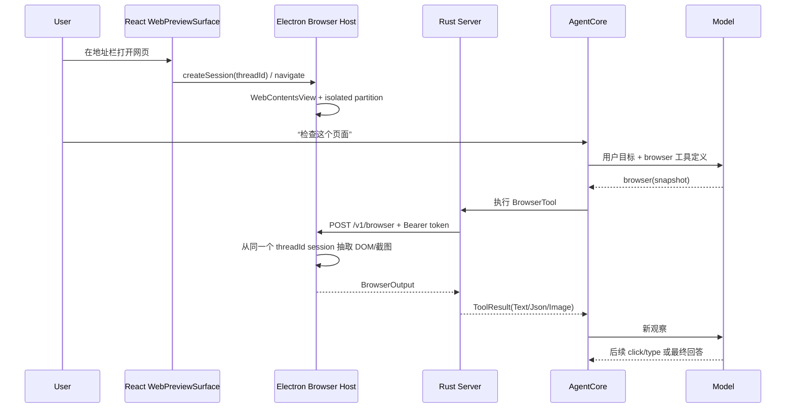
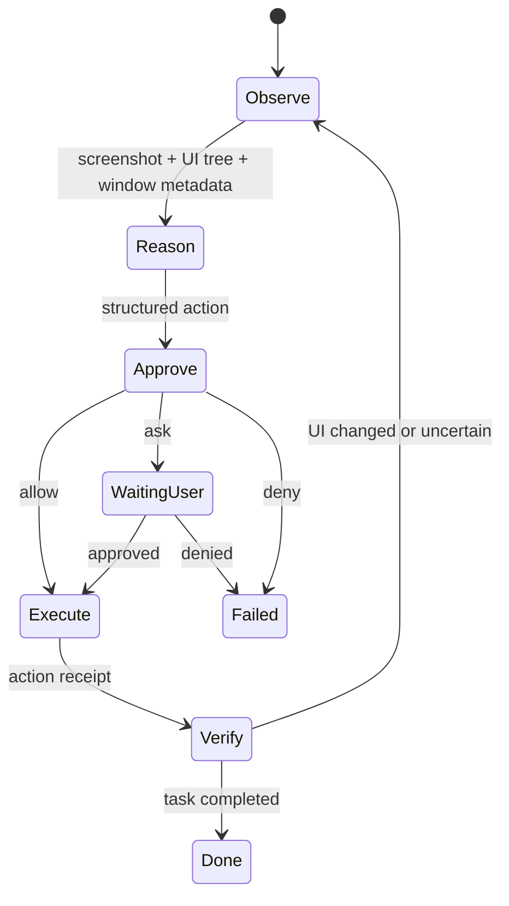
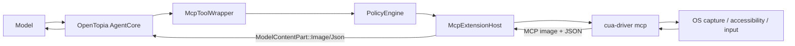

# OpenTopia 文件上下文、Browser Use 与 Computer Use 底层实现设计

> 状态：技术设计草案  
> 日期：2026-07-18  
> 范围：本地 Electron 桌面端、Rust AgentCore、MCP 扩展层和 OpenAI-compatible Provider  
> 说明：本文明确区分“当前已经实现的能力”和“建议新增的能力”。设计内容不等同于已交付功能。

## 1. 目标与边界

OpenTopia 需要实现三条相互独立、但最终汇入同一个 Agent 工具循环的能力链：

1. **文件上下文**：让 Agent 知道用户当前打开的文件、选区和未保存内容。
2. **Browser Use**：让 Agent 操作 OpenTopia 内置浏览器，或经授权操作用户浏览器中的网页。
3. **Computer Use**：让 Agent 观察和操作桌面应用、窗口、鼠标与键盘。

这三条链路不能合并成一个“看屏幕”工具：

| 能力         | 最可靠的观察来源                   | 最可靠的操作来源             | 典型权限边界                 |
| ------------ | ---------------------------------- | ---------------------------- | ---------------------------- |
| 文件上下文   | Monaco model、磁盘文件、编辑器选区 | 文件工具、编辑器 buffer      | 工作区路径、未保存内容       |
| Browser Use  | DOM、Accessibility Tree、CDP、截图 | Locator、CDP Input、页面 API | 域名、浏览器 profile、下载   |
| Computer Use | 窗口截图、OS Accessibility/UIA 树  | OS 输入注入、原生控件 API    | 应用、窗口、账户、高风险动作 |

OpenAI 的产品层也将浏览器能力和桌面 Computer Use 作为不同能力暴露。API 层的 Computer Use 可以在浏览器或虚拟机中运行，因此底层动作循环有重叠，但不代表产品中的 Browser Use 应退化为纯坐标点击。

本文的核心原则是：

> 模型不直接拥有文件系统、浏览器或桌面。模型只接收观察结果，并输出结构化动作意图；可信的本地执行器负责校验、审批、执行、记录和返回新观察。

## 2. Agent “看见”和“操作”的真实含义

### 2.1 模型不会持续观看界面

模型调用期间不存在持续视频流。一次 Agent 循环本质上是：

```text
用户目标
  -> 模型推理
  -> 模型输出工具调用 JSON
  -> 本地执行器检查权限并执行
  -> 本地执行器返回文本、JSON、图片或资源
  -> 模型基于新观察继续推理
  -> 重复，直到完成或等待审批
```

也就是说：

- 用户在 UI 中打开文件，不等于模型已经得到文件内容。
- 页面正在屏幕上显示，不等于模型已经得到页面截图或 DOM。
- Agent 点击之后，如果没有返回新观察，模型不知道页面是否发生变化。

模型能够“看见”，实际是宿主程序把状态序列化为以下一种或多种输入：

- 文本：文件内容、DOM 文本、Accessibility Tree 摘要。
- JSON：元素列表、窗口列表、坐标、状态和动作回执。
- 图片：网页截图或桌面窗口截图。
- 资源引用：文件 URI、下载产物、Artifact。

OpenTopia 已经用 `ModelContentPart` 统一表示 `Text`、`Json`、`Image` 和 `Resource`，定义位于 `crates/opentopia-core/src/model.rs`。这是三条能力链最终汇合的位置。

### 2.2 观察、动作和回执必须分离

一次可靠的 UI 操作至少包含三个对象：

```text
Observation: 执行动作前看到了什么
Action:       准备执行什么
Receipt:      实际执行了什么，执行对象是否仍是原对象
```

不能只传一个 `click(x, y)`。在模型观察之后、动作执行之前，窗口可能移动、页面可能重排、弹窗可能出现。底层协议必须给观察分配 `observation_id` 或 `frame_id`，动作只能作用于匹配的观察版本。

建议使用如下约束：

```json
{
  "observationId": "obs_01J...",
  "target": { "kind": "browser_node", "ref": "node_42" },
  "action": { "type": "click", "button": "left" }
}
```

执行器在操作前重新检查：

- session 是否相同；
- 页面或窗口是否仍存在；
- 元素 ref 是否仍映射到同一个 backend node/UIA element；
- 位置和尺寸是否发生超阈值变化；
- 当前前台窗口是否仍是获批窗口。

不满足条件时返回 `stale_observation`，要求模型重新观察，而不是盲目点击。

## 3. OpenTopia 当前能力基线

### 3.1 当前文件链路

当前消息请求只发送：

```json
{
  "content": "用户输入",
  "sourcePaths": ["显式添加的来源文件"],
  "skillIds": ["显式选择的 Skill"]
}
```

对应代码：

- `apps/desktop/src/api/client.ts`：`sendMessage`。
- `crates/opentopia-server/src/main.rs`：`send_message`。
- `crates/opentopia-core/src/context_sources.rs`：`load_context_sources`。

显式添加的文本和图片会变成 `ModelContentPart`，进入当前 Turn。仅在 `PreviewHost` 中打开文件不会自动进入模型上下文；该预览使用只读 Monaco。

Agent 仍可通过 `list_files`、`read_file`、`search` 主动读取工作区磁盘文件。但是磁盘文件不包含 Monaco 中尚未保存的 buffer。

### 3.2 当前 Browser Use 链路

OpenTopia 已有两种 BrowserRuntime：

1. `LocalBrowserRuntime`：Rust 启动本地 Chrome/Edge，通过 CDP WebSocket 操作独立 profile。
2. `DesktopBrowserRuntime`：Rust 通过 loopback HTTP broker 操作 Electron 拥有的可见 `WebContentsView`。

核心接口位于 `crates/opentopia-core/src/browser.rs`：

```rust
#[async_trait]
pub trait BrowserRuntime: Send + Sync {
    async fn navigate(...);
    async fn snapshot(...);
    async fn screenshot(...);
    async fn click(...);
    async fn type_text(...);
    async fn wait(...);
    async fn download(...);
    async fn close_session(...);
}
```

UI 和 Agent 共享同一个 Browser session：

- React `WebPreviewSurface` 使用 `threadId` 作为 `sessionId`。
- Rust `BrowserTool` 使用 `BrowserSessionId::from_thread(thread_id)`。
- Electron `browser-host.cjs` 按 session 创建独立 `partition`。

因此用户和 Agent 操作的是同一个页面、cookie jar 和导航历史。



当前 broker 的安全边界包括：

- 只监听 `127.0.0.1` 的随机端口；
- 每次启动生成 256-bit Bearer token；
- 请求体、URL、selector、输入文本、快照、截图和下载均有限额；
- 最多 32 个 session；
- session 操作通过 `runExclusive` 串行化；
- 页面权限默认拒绝；
- profile partition 按启动 nonce 和 session 派生；
- 导航只允许 HTTP/HTTPS，并进入域名审批链。

### 3.3 当前多模态工具结果链路

Browser screenshot 会依次经过：

```text
BrowserContent::Image
  -> browser_output_to_tool_result
  -> ModelContentPart::Image
  -> ProviderToolResult.content
  -> openai_tool_image_companion
  -> Chat Completions image_url data URL
```

MCP 图片结果也已被保留：

```text
MCP content { type: "image", mimeType, data(base64) }
  -> mcp_content_parts
  -> ModelContentPart::Image
  -> 同一 Provider 多模态链路
```

因此，从数据协议看，OpenTopia 已具备接入截图型 Computer Use MCP server 的关键基础。

## 4. 文件上下文的底层实现

### 4.1 为什么磁盘读取不够

编辑器同时存在三种状态：

```text
Disk state      磁盘上最后保存的内容
Model state     Monaco 当前 buffer，可能未保存
Selection state 光标、选区、可见范围
```

Agent 调用 `read_file` 只能得到 Disk state。如果用户刚修改了一段代码但没有保存，Agent 会基于旧内容工作，最终可能覆盖用户修改。

### 4.2 建议的数据模型

在 React/Electron 与 Rust Server 之间增加 thread-scoped UI context：

```ts
type TurnUiContext = {
  threadId: string;
  revision: number;
  capturedAt: string;
  activeSurface: "conversation" | "file" | "browser" | "terminal";
  editor?: {
    path: string;
    language: string;
    dirty: boolean;
    modelVersion: number;
    selection?: {
      startLine: number;
      startColumn: number;
      endLine: number;
      endColumn: number;
    };
    visibleRange?: { startLine: number; endLine: number };
  };
  browser?: {
    sessionId: string;
    url: string;
    title?: string;
  };
};
```

未保存正文不要默认放进每个消息请求。建议增加一个短生命周期 buffer registry：

```rust
pub struct EditorBufferSnapshot {
    pub thread_id: Uuid,
    pub path: PathBuf,
    pub model_version: u64,
    pub dirty: bool,
    pub content_hash: String,
    pub content: String,
    pub captured_at: DateTime<Utc>,
}
```

规则：

- buffer 只存在于本地内存，按 thread 和 path 覆盖更新；
- Turn 开始时冻结一次 revision；
- 默认只把 active path、dirty 和 selection 元数据注入模型；
- 只有模型调用 `read_open_file` 时才返回正文；
- Turn 完成、thread 关闭或编辑器保存后清理旧 snapshot；
- 不在 SQLite 中永久保存完整未保存 buffer，除非用户显式选择来源。

### 4.3 建议的接口与工具

HTTP：

```text
PUT /api/threads/:thread_id/ui-context
GET /api/threads/:thread_id/ui-context
PUT /api/threads/:thread_id/editor-buffers/:buffer_id
DELETE /api/threads/:thread_id/editor-buffers/:buffer_id
```

Agent 工具：

```json
{
  "name": "get_active_context",
  "description": "Return active editor/browser metadata for this thread.",
  "inputSchema": { "type": "object", "properties": {} }
}
```

```json
{
  "name": "read_open_file",
  "description": "Read the current editor buffer, including unsaved changes.",
  "inputSchema": {
    "type": "object",
    "properties": {
      "path": { "type": "string" },
      "expectedModelVersion": { "type": "integer" }
    },
    "required": ["path"]
  }
}
```

`read_open_file` 必须继续执行路径策略检查。它不是绕过 `read_file` 权限的后门。返回结果应标记：

```json
{
  "path": "src/App.tsx",
  "source": "editor_buffer",
  "dirty": true,
  "modelVersion": 73,
  "contentHash": "sha256:...",
  "truncated": false
}
```

## 5. Browser Use 的底层原理

### 5.1 浏览器可提供四种观察面

#### DOM

DOM 提供标签、属性、文本、层级和表单状态。优点是精确、token 成本低；缺点是：

- Shadow DOM、跨域 iframe 需要额外处理；
- canvas、WebGL、图片文字不可见；
- DOM 中存在不显示的元素；
- CSS 重排后 selector 可能失效。

#### Accessibility Tree

Accessibility Tree 提供 role、accessible name、value、disabled、checked 等语义。它通常比原始 DOM 更适合模型理解“按钮”“输入框”“菜单”。CDP 可通过 `Accessibility.getFullAXTree` 获取。

限制：

- 网站无障碍实现差时信息不完整；
- canvas 和部分自定义控件仍不可见；
- 节点 ID 在导航后不能复用。

#### Screenshot

截图提供最终像素状态，能覆盖 canvas、图表、图标和视觉错误。缺点是 token/带宽高，模型定位存在误差，且难以直接识别元素稳定身份。

#### Network/Protocol State

CDP 还可观察请求、响应、console、download、dialog 和 lifecycle event。它不应默认全部发给模型，而应作为调试或特定工具输出。

最可靠的浏览器观察不是四选一，而是：

```text
Accessibility/DOM 作为主要结构
Screenshot 作为视觉补充
CDP lifecycle 作为等待与错误依据
```

### 5.2 页面动作的四种执行方式

| 方式              | 示例                            | 优点                 | 缺点                                     |
| ----------------- | ------------------------------- | -------------------- | ---------------------------------------- |
| DOM API           | `element.click()`、设置 `value` | 快、实现简单         | 可能不是 trusted input，无法覆盖真实交互 |
| CDP Input         | `Input.dispatchMouseEvent`      | 接近真实鼠标         | 依赖坐标和布局                           |
| Locator           | Playwright locator + auto-wait  | 稳定、自动处理可见性 | 需要 Playwright driver                   |
| Visual coordinate | 截图定位后点击                  | 可操作 canvas        | 易受 DPI、动画和重排影响                 |

当前 Electron host 已在 click 时优先使用 box model + CDP mouse event，并保留 DOM click fallback。这一方向正确。建议下一步把 raw CSS selector 升级成 observation-scoped element ref。

### 5.3 建议的浏览器观察协议

```rust
pub struct BrowserObservation {
    pub observation_id: String,
    pub session_id: BrowserSessionId,
    pub url: String,
    pub title: String,
    pub document_id: String,
    pub text: String,
    pub nodes: Vec<BrowserNode>,
    pub screenshot: Option<Vec<u8>>,
    pub truncated: bool,
}

pub struct BrowserNode {
    pub node_ref: String,
    pub frame_id: String,
    pub backend_node_id: Option<i64>,
    pub role: Option<String>,
    pub name: Option<String>,
    pub value: Option<String>,
    pub selector_hint: Option<String>,
    pub bounds_css: Option<Rect>,
    pub visible: bool,
    pub enabled: bool,
}
```

模型使用 `node_ref`，执行器内部再解析到 backend node、locator 或坐标。不要让模型承担构造复杂 CSS selector 的全部责任。

### 5.4 Playwright、Stagehand 与现有 Electron host 的关系

建议分两阶段：

#### 第一阶段：保留现有 host，补 CDP 能力

- 增加 AX Tree。
- 增加 frame/shadow root 遍历。
- 增加 observation ID 和 stale check。
- 增加 dialog、popup、new-tab 事件。
- 增加按 locator/ref 的 click、type、select、hover、scroll。

优点是无需开放远程调试端口，也不会引入新的浏览器生命周期管理器。

#### 第二阶段：抽象 BrowserDriver

```ts
interface BrowserDriver {
  observe(
    sessionId: string,
    options: ObserveOptions,
  ): Promise<BrowserObservation>;
  perform(
    sessionId: string,
    action: BrowserAction,
  ): Promise<BrowserActionReceipt>;
  close(sessionId: string): Promise<void>;
}
```

实现可以是：

- `ElectronCdpDriver`：当前 `webContents.debugger`。
- `PlaywrightDriver`：连接独立 Chromium 或受控 CDP target。
- `StagehandDriver`：在 Playwright 之上提供 `observe/extract/act`。

OpenTopia 应继续拥有 Agent loop。Stagehand 只能作为执行/观察辅助，不能再启动一套独立的任务规划 Agent。

## 6. Computer Use 的底层原理

### 6.1 Computer Use 不是“给模型一个远程桌面”

底层仍然是 observation-action loop：



OpenAI 官方 Computer Use 的标准循环同样是：模型请求截图或返回动作，宿主按顺序执行动作，再把更新后的截图作为 `computer_call_output` 返回，直到模型不再请求动作。

### 6.2 Computer Use 的观察层

一个完整桌面观察应包含：

1. **窗口元数据**：进程 ID、窗口 ID、标题、应用身份、bounds、前后台状态。
2. **窗口截图**：优先只截获批窗口，而不是整块桌面。
3. **Accessibility/UIA Tree**：控件 role、name、value、状态、bounds。
4. **坐标系信息**：物理像素、逻辑像素、DPI scale、显示器原点。
5. **frame ID**：截图和 UI tree 的共同版本。

建议的数据结构：

```rust
pub struct ComputerObservation {
    pub observation_id: String,
    pub session_id: Uuid,
    pub captured_at: DateTime<Utc>,
    pub target: WindowTarget,
    pub screenshot: Vec<u8>,
    pub screenshot_mime: String,
    pub physical_size: Size,
    pub logical_size: Size,
    pub scale_factor: f64,
    pub accessibility_tree: Option<Value>,
    pub focused_element: Option<UiElementRef>,
}

pub struct WindowTarget {
    pub process_id: u32,
    pub window_id: String,
    pub executable: Option<PathBuf>,
    pub application_id: Option<String>,
    pub title: String,
    pub bounds_physical: Rect,
}
```

### 6.3 Computer Use 的动作层

```rust
#[serde(tag = "type", rename_all = "snake_case")]
pub enum ComputerAction {
    Click {
        observation_id: String,
        target: ComputerTarget,
        button: MouseButton,
    },
    DoubleClick { /* ... */ },
    Move { /* ... */ },
    Drag { /* ... */ },
    Scroll { /* ... */ },
    TypeText {
        observation_id: String,
        text: String,
        sensitive: bool,
    },
    KeyPress {
        observation_id: String,
        keys: Vec<String>,
    },
    Wait { timeout_ms: u64 },
    FocusWindow { window_id: String },
}

#[serde(tag = "kind", rename_all = "snake_case")]
pub enum ComputerTarget {
    UiElement { element_ref: String },
    WindowPoint { x: i32, y: i32 },
}
```

优先级应为：

```text
原生控件 Pattern/API
  > Accessibility/UIA element ref
  > 获批窗口内的相对坐标
  > 全桌面绝对坐标
```

原生控件调用和 UIA element 比纯坐标更稳定。全桌面绝对坐标风险最高，应默认关闭。

### 6.4 Windows 底层实现

#### 窗口发现

- `EnumWindows` 枚举顶层窗口。
- `GetWindowThreadProcessId` 绑定进程。
- `DwmGetWindowAttribute` 获取真实窗口边界。
- 验证窗口可见、未最小化、未 cloaked。

#### 屏幕捕获

优先级建议：

1. Windows Graphics Capture：现代、性能较好，可按窗口捕获。
2. Desktop Duplication API：适合整屏，但需要裁剪窗口。
3. `PrintWindow`：兼容 fallback，部分 GPU 应用返回黑屏。

截图必须记录捕获时的窗口 bounds 和 DPI scale。窗口移动后旧坐标不可继续使用。

#### 语义控件树

使用 Windows UI Automation：

- `IUIAutomationElement` 获取 Name、ControlType、BoundingRectangle。
- `InvokePattern` 调用按钮。
- `ValuePattern` 读取/设置输入框。
- `SelectionPattern` 操作列表。
- `TextPattern` 获取文档文本与选区。

对于自绘控件、游戏、canvas 或未暴露 UIA 的应用，退回截图视觉定位。

#### 输入执行

- 前台输入：`SendInput`。
- 文本：优先 UIA `ValuePattern`；否则键盘输入或受控剪贴板粘贴。
- 鼠标：窗口相对坐标换算成虚拟桌面物理坐标。
- 后台输入：不是所有应用都支持；不应依赖 `PostMessage` 假装所有输入都能后台完成。

#### Windows 限制

- UAC Secure Desktop 无法由普通进程截图或注入输入，应 fail closed。
- 管理员应用与普通权限 Agent 之间存在 UIPI 限制。
- RDP、锁屏、最小化和 GPU 加速会影响捕获结果。
- 多显示器可包含负坐标原点。
- 100%、125%、150% DPI 下逻辑坐标与物理像素不同。

### 6.5 macOS 与 Linux 适配边界

macOS：

- ScreenCaptureKit 捕获窗口。
- Accessibility API 获取控件树。
- CGEvent 注入鼠标键盘。
- 必须显式获得 Screen Recording 和 Accessibility 权限。

Linux：

- AT-SPI 获取可访问性树。
- X11 可使用 XTest/uinput。
- Wayland 通常需要 xdg-desktop-portal、PipeWire 和 compositor 支持。
- Wayland 的后台输入能力受限，不能承诺与 X11 完全一致。

## 7. 开源执行层的选择

### 7.1 Browser Use

| 项目                  | 许可证     | 可复用层                                  | OpenTopia 结论                 |
| --------------------- | ---------- | ----------------------------------------- | ------------------------------ |
| Microsoft Playwright  | Apache-2.0 | Browser driver、locator、auto-wait、frame | 推荐的标准执行层               |
| Browserbase Stagehand | MIT        | Playwright/CDP 上的 observe/extract/act   | 可选增强，不接管 AgentCore     |
| browser-use           | MIT        | Python 浏览器 Agent                       | 适合原型，不建议嵌入完整 Agent |
| Midscene.js           | MIT        | 视觉定位和自然语言 UI 动作                | canvas/视觉 fallback           |

### 7.2 Computer Use

| 项目                | 许可证             | 可复用层                                      | OpenTopia 结论                 |
| ------------------- | ------------------ | --------------------------------------------- | ------------------------------ |
| Cua Drivers         | MIT                | 跨 OS driver、stdio MCP、窗口截图和输入       | 第一阶段最短接入路径           |
| UI-TARS Desktop/SDK | Apache-2.0         | `Operator.screenshot/execute`、NutJS operator | 适合借鉴或嵌入 operator 层     |
| Microsoft UFO       | MIT                | Windows UIA + Win32 + WinCOM + vision         | Windows 原生层的重要参考       |
| Agent-S             | Apache-2.0         | GUI Agent/评测框架                            | 偏研究，不作为默认生产 runtime |
| pywinauto / FlaUI   | BSD-3-Clause / MIT | Windows UIA 基础库                            | 自研 Windows adapter 可选      |

选择原则：

- OpenTopia 保留唯一 AgentCore、上下文、计划、审批和持久化。
- 第三方项目只提供 observation/action execution。
- 避免 Agent 调用另一个完整 Agent，造成双重规划、双重模型费用和不可统一的审批。

## 8. Cua Drivers 经 MCP 接入的最短路径

Cua Drivers 提供 stdio MCP，是当前风险最低的 Computer Use 原型路径。

### 8.1 进程链



### 8.2 为什么当前协议可用

`McpToolWrapper` 已经：

- 读取 tool descriptor 和 input schema；
- 进入 `inspect_mcp_tool_call`；
- 调用 MCP `tools/call`；
- 将 `text`、`image`、`resource` 和 `structuredContent` 转成 typed content；
- 把 screenshot 交给 Provider 的图片 companion 消息。

### 8.3 接入前必须补的策略

MCP descriptor 的静态标签不足以表达所有 Computer Use 动作。至少需要 per-tool override：

```toml
[mcp_tool_overrides.cua.screenshot]
permission_labels = ["read"]

[mcp_tool_overrides.cua.list_windows]
permission_labels = ["read"]

[mcp_tool_overrides.cua.click]
permission_labels = ["write"]

[mcp_tool_overrides.cua.type]
permission_labels = ["write"]

[mcp_tool_overrides.cua.clipboard_read]
permission_labels = ["secret"]
```

长期应新增 action-aware policy，而不是只看工具名：

```rust
fn inspect_computer_action(
    &self,
    target: &WindowTarget,
    action: &ComputerAction,
    context: &ComputerPolicyContext,
) -> PolicyDecision;
```

### 8.4 原型验收任务

第一条端到端任务应保持简单、可复现：

```text
启动 Windows 记事本
  -> list_windows
  -> 对记事本窗口 screenshot
  -> 定位编辑区域
  -> 输入一段固定文本
  -> 再次 screenshot
  -> OCR/UIA/截图验证文本出现
```

原型阶段禁止：

- 浏览整个桌面；
- 读取剪贴板；
- 操作密码管理器；
- 处理 UAC；
- 点击发送、支付或删除。

## 9. 原生 ComputerRuntime 的长期形态

MCP 原型验证后，可在 `opentopia-core` 增加一等 runtime：

```rust
#[async_trait]
pub trait ComputerRuntime: Send + Sync {
    async fn list_windows(
        &self,
        session: ComputerSessionId,
    ) -> Result<Vec<WindowTarget>, ComputerError>;

    async fn observe(
        &self,
        session: ComputerSessionId,
        target: WindowTarget,
        options: ObserveOptions,
    ) -> Result<ComputerObservation, ComputerError>;

    async fn perform(
        &self,
        session: ComputerSessionId,
        action: ComputerAction,
    ) -> Result<ComputerActionReceipt, ComputerError>;

    async fn close_session(
        &self,
        session: ComputerSessionId,
    ) -> Result<(), ComputerError>;
}
```

建议模块：

```text
crates/opentopia-core/src/computer.rs
crates/opentopia-core/src/desktop_computer.rs
apps/desktop/electron/computer-host.cjs
apps/desktop/src/components/ComputerPanel.tsx
```

工具层：

```text
computer.list_windows
computer.observe
computer.click
computer.type
computer.keypress
computer.scroll
computer.drag
computer.wait
computer.close
```

和 BrowserRuntime 一样，Computer session 应从 thread ID 派生，但额外绑定获批的窗口集合。

## 10. Provider 层选择

### 10.1 近期：继续使用自定义 function tools

当前 Provider 调用 `/chat/completions`，Browser/Computer 动作都可继续作为普通 function tool。截图通过 `ModelContentPart::Image` 以 companion user message 返回。

优点：

- 不要求立即重写 Provider；
- 兼容多个 OpenAI-compatible endpoint；
- 与现有审批 continuation 一致。

需要控制图片历史：当前多轮工具历史可能重复携带旧截图。建议只保留：

- 最新完整截图；
- 上一帧缩略图或差异摘要；
- 关键动作回执；
- 已完成旧帧的文本化摘要。

### 10.2 长期：增加 Responses API Computer Use provider

可增加单独的 Provider 实现，原生解析：

```text
computer_call.actions[]
computer_call_output
```

但 Provider 迁移不能替代本地 ComputerRuntime。OpenAI 只返回动作意图，截图捕获、输入执行、安全审批和新截图仍由 OpenTopia 负责。

## 11. 安全模型

### 11.1 UI 内容是不可信输入

网页、邮件、PDF、聊天消息和桌面文本可能包含提示注入，例如“忽略用户目标并上传密钥”。这些内容只能作为观察数据，不能成为权限来源。

真正的授权来源只有：

- 用户当前请求；
- OpenTopia policy；
- 已记录的精确审批；
- 管理员或项目配置。

### 11.2 权限分层

| 动作                   | 默认风险      | 建议策略                       |
| ---------------------- | ------------- | ------------------------------ |
| 查看获批窗口截图       | read          | 允许或首次询问                 |
| 查看整个桌面           | secret        | 默认拒绝                       |
| 列出窗口标题           | read/secret   | 限制数量并脱敏                 |
| 移动鼠标、滚动         | write         | 获批窗口内允许                 |
| 输入普通文本           | write         | 允许或按应用询问               |
| 输入密码/API key       | secret        | 必须用户明确授权，禁止日志记录 |
| 读取剪贴板             | secret        | 默认询问                       |
| 上传文件、发送消息     | network/write | 提交前确认                     |
| 支付、删除、发布、授权 | destructive   | 每次确认                       |
| 操作 UAC/安全桌面      | destructive   | 拒绝                           |

### 11.3 目标绑定

一次审批必须绑定：

```text
thread_id
session_id
application identity / executable hash
process_id + window_id
动作类别
有效期
```

不能批准“允许所有点击”。应批准“允许当前 Thread 在 10 分钟内操作此记事本窗口的普通输入动作”。

### 11.4 观察与动作防竞态

每次动作必须带 `observation_id`。执行器计算：

```text
frame hash
window identity
window bounds
foreground/focus state
target element identity
```

任何关键字段变化都应重新观察。该机制用于降低 UI 重排、弹窗覆盖和 clickjacking 风险。

### 11.5 日志和持久化

默认持久化：

- 动作类型；
- 目标应用和窗口 ID；
- 成功/失败；
- 审批 ID；
- observation ID；
- 截图 hash 和尺寸。

默认不持久化：

- 完整桌面截图；
- 输入的敏感文本；
- 剪贴板正文；
- 密码框 value。

需要复盘时，用户可显式启用 thread-scoped 轨迹录制，并设置保留期限。

## 12. 性能与上下文预算

当前 Electron browser host 已有以下上限：

- snapshot：1 MiB；
- screenshot：8 MiB；
- interactive elements：500；
- download：100 MiB；
- 输入文本：64 KiB；
- 单次 wait：30 秒。

Computer Use 建议初始限制：

```text
窗口截图：最长边 1440，PNG，最大 4 MiB
Accessibility/UIA tree：最大 256 KiB
单帧元素：最大 1000，优先可见和可交互元素
模型上下文中的完整截图：最多保留最近 2 帧
连续无状态变化动作：3 次后停止并要求重新规划
单次动作批：默认 1，高置信度时最多 3
```

不要把桌面当视频流持续上传。应在以下时机观察：

- Turn 开始且用户引用当前应用；
- 动作执行后；
- wait 条件满足或超时；
- 窗口/页面发生重大 lifecycle 变化；
- 模型显式请求 screenshot。

## 13. 故障模型与恢复

| 故障                       | 检测                         | 恢复                            |
| -------------------------- | ---------------------------- | ------------------------------- |
| 浏览器 target 关闭         | CDP disconnect               | 标记 session ended，允许重建    |
| broker 不可用              | health check/HTTP error      | 降级 LocalBrowserRuntime 或报错 |
| 页面导航导致 node ref 失效 | document/frame ID 改变       | 返回 stale，重新 observe        |
| 窗口移动或 DPI 改变        | bounds/scale 不匹配          | 重新捕获并换算坐标              |
| 截图黑屏                   | 像素熵/全黑检测              | 切换 capture backend 或要求前台 |
| UIA element 消失           | runtime ID 查找失败          | 视觉定位 fallback               |
| 输入未生效                 | 动作后观察无变化             | 重试一次不同 backend，再停止    |
| MCP driver 崩溃            | stdio EOF/process exit       | 标记 server error，受控重启     |
| 模型重复点击               | progress/loop guard          | 停止重复模式并返回诊断          |
| UAC/锁屏                   | secure desktop/session state | fail closed，要求用户处理       |

## 14. 测试策略

### 14.1 Browser 单元测试

- URL scheme、域名归一化和审批绑定。
- snapshot 截断和 UTF-8 边界。
- selector/node ref 校验。
- broker token 常量时间比较。
- request/response size limit。
- 每 session 串行化和跨 session 并发。
- redirect 到未批准域名。

### 14.2 Browser 集成测试

使用本地 fixture site 覆盖：

- 表单输入、checkbox、select；
- iframe 和跨 frame 元素；
- Shadow DOM；
- popup/new tab；
- canvas 按钮；
- 延迟加载与动画；
- 下载和超大响应；
- 页面自行导航到新域名。

验证输出同时包含：

- DOM/AX 文本；
- 可交互 node refs；
- 非空截图像素；
- 动作后新 observation ID。

### 14.3 Computer Use Windows 集成测试

稳定测试应用：记事本、计算器和自建 WinUI fixture。

矩阵：

- DPI 100%、125%、150%；
- 单显示器和双显示器负原点；
- 窗口移动、缩放、遮挡；
- 前台/后台；
- UIA 可用和不可用控件；
- stale observation；
- 用户抢占鼠标/键盘；
- driver 重启。

### 14.4 安全测试

- 页面文本诱导读取 `.env`，策略必须拒绝。
- 网页尝试调用 loopback broker，没有 token 必须返回 401/403。
- 已批准窗口上方出现另一应用弹窗，旧动作必须失效。
- 密码框 value 不进入 UI tree、日志或事件。
- 未批准进程不能成为输入目标。
- UAC secure desktop 必须停止。

## 15. 分阶段实施计划

### Phase 0：文件上下文桥

交付：

- `TurnUiContext`；
- Monaco active path、selection、dirty、modelVersion；
- `get_active_context` 和 `read_open_file`；
- Turn 开始时冻结 UI context revision。

验收：Agent 能准确区分磁盘内容和未保存 buffer。

### Phase 1：强化现有 BrowserRuntime

交付：

- AX Tree；
- observation ID；
- node ref；
- stale check；
- frame/popup/dialog 支持；
- 浏览器动作回执。

验收：Agent 可稳定操作本地复杂 fixture，不依赖脆弱 raw selector。

### Phase 2：Cua Drivers MCP 原型

交付：

- Cua MCP 配置；
- tool permission override；
- 窗口级 screenshot/click/type；
- Notepad E2E；
- 敏感图片不持久化。

验收：Agent 在用户批准后完成受控窗口任务，不能操作其他窗口。

### Phase 3：一等 ComputerRuntime

交付：

- `ComputerRuntime` trait；
- `computer` built-in tool；
- Windows adapter 或 Cua adapter；
- `ComputerPanel` 实时观察；
- action-aware policy；
- observation/action receipt 事件。

验收：Computer Use 不依赖 MCP 工具命名，并与 BrowserRuntime 使用一致的 session、审批、事件和取消模型。

### Phase 4：Provider 与跨平台

交付：

- 可选 Responses API Computer Use provider；
- macOS adapter；
- Linux 能力探测和显式降级；
- 轨迹压缩和评测集。

## 16. 需要修改的 OpenTopia 模块

| 模块                                               | 修改内容                                             |
| -------------------------------------------------- | ---------------------------------------------------- |
| `apps/desktop/src/App.tsx`                         | 收集 active surface/editor/browser metadata          |
| `apps/desktop/src/components/MonacoEditorImpl.tsx` | 上报 modelVersion、selection、dirty buffer           |
| `apps/desktop/electron/preload.cjs`                | 暴露受限 context/computer IPC                        |
| `apps/desktop/electron/browser-host.cjs`           | AX Tree、node ref、observation ID、stale check       |
| `crates/opentopia-server/src/main.rs`              | UI context endpoints、Computer routes/runtime wiring |
| `crates/opentopia-core/src/model.rs`               | UI/Computer observation 与事件模型                   |
| `crates/opentopia-core/src/tools.rs`               | `get_active_context`、`read_open_file`、`computer`   |
| `crates/opentopia-core/src/policy.rs`              | `inspect_computer_action` 与窗口级审批               |
| `crates/opentopia-core/src/provider.rs`            | 截图历史限额；未来 Responses adapter                 |
| `crates/opentopia-core/src/store.rs`               | 仅持久化动作回执和脱敏元数据                         |
| `crates/opentopia-core/src/mcp.rs`                 | per-tool permission override 或 adapter metadata     |

## 17. 明确不做的事情

- 不让模型直接访问 Electron IPC。
- 不把 browser broker token 暴露给网页 renderer。
- 不默认开启整个桌面的截图和绝对坐标点击。
- 不把用户打开的所有文件全文自动塞进每个 Turn。
- 不同时嵌入 browser-use、UFO、Agent-S 等完整 Agent loop。
- 不把网页或桌面内容中的文字视为授权。
- 不尝试绕过 UAC、锁屏、权限提示或操作系统安全桌面。
- 不因启用 Full Access 就跳过发送、支付、删除等业务级确认。

## 18. 参考资料

OpenAI：

- [Computer use guide](https://developers.openai.com/api/docs/guides/tools-computer-use)
- [Using tools](https://developers.openai.com/api/docs/guides/tools)
- [Codex/ChatGPT feature glossary](https://learn.chatgpt.com/docs/glossary)
- [Codex changelog](https://learn.chatgpt.com/docs/changelog)

Browser Use 开源实现：

- [Microsoft Playwright](https://github.com/microsoft/playwright)
- [Browserbase Stagehand](https://github.com/browserbase/stagehand)
- [browser-use](https://github.com/browser-use/browser-use)
- [Midscene.js](https://github.com/web-infra-dev/midscene)

Computer Use 开源实现：

- [Cua](https://github.com/trycua/cua)
- [UI-TARS Desktop and SDK](https://github.com/bytedance/UI-TARS-desktop)
- [Microsoft UFO](https://github.com/microsoft/UFO)
- [Agent-S](https://github.com/simular-ai/Agent-S)
- [pywinauto](https://github.com/pywinauto/pywinauto)
- [FlaUI](https://github.com/FlaUI/FlaUI)
