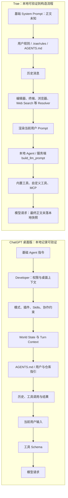

# ChatGPT 桌面版与 Trae Harness 提示词对比分析

日期：2026-07-19  
范围：本机 ChatGPT 桌面版（Codex 工作流）与 Trae CN；TRAE SOLO CN 仅作旁证

## 1. 结论先行

两个应用提交给模型的内容都远多于输入框中的用户文字。它们实际运行的是一套 harness：把基础行为约束、权限与运行环境、持久规则、对话历史、动态上下文、工具定义和当前输入组合后，再交给模型。

两者最大的差别不是“谁的 System Prompt 更长”，而是最终上下文的可见性和组装边界：

- **ChatGPT 桌面版的证据更完整。** 本地 rollout 直接保存了基础指令、`developer` 消息、`world_state`、`turn_context`、历史消息和工具调用，因此可以较可靠地回答“模型看到了哪些层、角色和顺序”。
- **Trae 的流程证据完整，但最终提示词正文不完整。** 本地原生 Agent、Workbench 代码和日志能证明历史、规则、编辑器、终端、浏览器、Web Search、自定义工具、MCP 等会参与上下文构造；日志还显示服务端存在 `build_llm_prompt` 阶段。但本机没有一份等价于 rollout 的最终模型可见快照，不能可靠还原完整基础 System Prompt。
- **两者都采用动态组装，而不是一份固定大提示词。** 当前模式、工作区、规则文件、Skill/插件、工具目录、历史和权限变化都会改变最终请求。
- **若目标是让 OpenTopia 接近 Codex，重点应是复现分层协议、角色、追踪、缓存和评测，而不是复制某个版本的文字。** 当前项目三阶段改造方向正确，已经覆盖这一核心。

## 2. 调研对象与版本

### 2.1 ChatGPT 桌面版

本机当前安装包：

| 项目 | 值 |
| --- | --- |
| Windows 包身份 | `OpenAI.Codex_26.715.4045.0_x64__2p2nqsd0c76g0` |
| Manifest 显示名 | `ChatGPT` |
| 可执行文件 | `app/ChatGPT.exe` |
| 内置 Agent 服务 | `resources/codex.exe ... app-server` |
| 本次 rollout 的 `originator` | `Codex Desktop` |
| 本次 rollout 的 Agent Runtime | `0.145.0-alpha.18` |

这里比较的是当前 ChatGPT Windows 桌面应用中的 Codex 工作流，不是另外安装的 Codex CLI。Windows 包名仍保留 `OpenAI.Codex`，不代表本次证据来自 CLI。

静态包和本地进程参数共同表明，`ChatGPT.exe` 主要承担 Electron 桌面前端，内置 `codex.exe app-server` 承担 Agent 编排、上下文组装、工具循环和会话协议。因而不能只搜索 `app.asar` 就断言已经找到全部基础提示词。

### 2.2 Trae

本机同时存在两个版本：

| 产品 | 版本 | 安装目录 | 本报告用途 |
| --- | ---: | --- | --- |
| Trae CN | `3.3.72` | `J:\Trae CN` | 主要比较对象；有实际 Chat Agent 日志 |
| TRAE SOLO CN | `0.1.36` | `D:\Software\TRAE SOLO CN` | 对规则加载、原生 Agent 和工具机制作旁证 |

两者的核心 Agent 都包含原生模块 `resources\app\modules\ai-agent\ai_agent.dll`，但二进制 Hash 不同，不能假设两者逐字使用同一份提示词。

调研时正在运行的是 TRAE SOLO CN `0.1.36`；报告仍以 Trae CN `3.3.72` 的实际 Chat trace 作为主流程样本，因为该日志完整出现了从历史读取到 Prompt 构建的同一条 trace。SOLO 的当前日志和二进制用于交叉验证新版流程。

## 3. 证据等级与边界

本报告采用以下证据等级：

| 等级 | 定义 | 本次例子 |
| --- | --- | --- |
| A：模型可见记录 | 本地记录直接保存了角色、正文或模型历史项 | ChatGPT rollout 中的 `base_instructions`、`response_item`、`world_state`、`turn_context` |
| B：确定的组装机制 | 应用代码、配置或日志直接证明某输入源/阶段存在 | Trae Workbench 的规则导入代码、`rs_03_get_history_message`、`rs_13_render_user_prompt` |
| C：能力线索 | 二进制符号或命名模板证明功能存在，但不能证明某一请求一定启用 | Trae `ChatPromptBuilderImpl`、`systemPrompt`、`custom_tools` 等字符串 |

边界说明：

- 本次没有中间人解密 TLS，也没有记录 Authorization、Cookie、API Key 或账号令牌。
- ChatGPT rollout 是可重放的上下文记录，不等于逐字节 HTTP 抓包。
- Trae 本地日志没有完整 `systemPrompt` 字面量；凡涉及其完整基础 Prompt 的内容，最多是结构重建，不是逐字还原。
- 二进制中出现某字符串，只能证明相关代码或模板存在，不能证明每次请求都使用它。

## 4. 两套 Harness 的组装流程



这张图的关键不是节点数量，而是证据终点：ChatGPT 可以从 rollout 检查模型可见项；Trae 当前只能从本机确认输入源与处理阶段，最终角色、顺序和完整正文仍有缺口。

## 5. ChatGPT 桌面版实际可见提示词

### 5.1 当前 rollout 的前置上下文

主要证据文件：

```text
C:\Users\Stargo\.codex\sessions\2026\07\19\
rollout-2026-07-19T18-07-02-019f79d7-ee10-7f21-9eb4-4122c2c15dbe.jsonl
```

在第一条普通用户消息之前，本地记录显示：

| 角色/载体 | 英文标识 | 中文含义 | 观察到的字符数 | 证据 |
| --- | --- | --- | ---: | --- |
| 会话元数据 | `base_instructions.text` | 基础 Agent 身份、工作方式、工具使用和交付约束 | 16,299 | A |
| `developer` | `<permissions instructions>` | 文件系统、网络、沙箱和审批策略 | 363 | A |
| `developer` | `<app-context>` | 桌面应用特有的文件、自动化、任务协调、评论和 Git 约定 | 5,314 | A |
| `developer` | `<collaboration_mode>` | 当前协作模式下的执行边界和自治规则 | 977 | A |
| `developer` | `<plugins_instructions>` | 插件能力的发现、选择和使用规则 | 1,014 | A |
| `developer` | `<skills_instructions>` | Skill 触发、完整读取、渐进加载和回退规则 | 15,117 | A |
| `developer` | 主 Agent/团队协作指令 | 主 Agent、子 Agent、消息和并行槽位的协调规则 | 2,183 | A |
| `developer` | `<multi_agent_mode>` | 当前是否允许主动多 Agent 委派 | 271 | A |
| `user` 包装上下文 | `<environment_context>` | cwd、工作区根、日期、时区和权限配置 | 471 | A |

注意：这些字符数用于说明上下文规模，不应直接换算为精确 Token；`world_state` 与部分 developer 内容也可能是同一状态的持久化和渲染视图，不能简单相加计算账单输入。

### 5.2 World State 与 Turn Context

同一 rollout 还记录了：

- `world_state.agents_md`：当前适用的持久仓库/用户指引。
- `world_state.apps_instructions`：应用连接器或桌面能力说明。
- `world_state.environments` 与 `environments_instructions`：可用执行环境及其约束。
- `world_state.host_skills`：Host 发现的 Skill 清单。
- `world_state.plugins_instructions` 与 `skills`：插件、Skill 的状态和附加内容。
- `turn_context`：cwd、工作区根、日期、时区、审批策略、沙箱、权限 profile、模型、reasoning effort、个性、协作模式和摘要状态。

官方 app-server 文档也明确说明：`turn/start` 可以使用所选协作模式的内建 developer instructions；`thread/inject_items` 可以向“模型可见历史”追加 Responses API items；`thread/compact/start` 会压缩历史。这与本地 rollout 看到的分层结构一致。参见 [Codex app-server API overview](https://learn.chatgpt.com/docs/app-server#api-overview)。

### 5.3 中文语义翻译

以下是结构化意译，不是把 4 万余字符逐字公开复制：

| 层 | 中文语义摘要 |
| --- | --- |
| 基础 Agent 契约 | 你是负责在真实工作区完成任务的代理；先读代码和现状，使用可用工具执行，保护用户已有修改，按风险做验证，并清楚汇报结果与限制。 |
| 权限层 | 所有读取、写入、命令、网络和升级操作都受当前沙箱与审批策略约束；不能把“可以调用工具”误解为“拥有无限权限”。 |
| 桌面应用层 | 桌面端可以处理本地文件、图片、任务、Git、自动化和行内评论；不同动作有特定协议和 UI 指令。 |
| 协作模式层 | 根据任务是回答、诊断、修改还是等待，决定是否允许写入以及要持续工作到什么程度。 |
| 插件/Skill 层 | 先匹配能力；命中 Skill 时完整读取其说明，再按需加载引用和脚本；插件和外部工具只在相关且授权时使用。 |
| 团队层 | 主 Agent 可以把独立子任务交给子 Agent，并负责整合；线程、消息和并行资源有明确边界。 |
| 环境层 | 当前工作目录、工作区、日期、时区、文件权限、网络和模型配置是本轮的事实输入。 |
| 历史与工具层 | 之前的用户/助手消息、推理项、工具调用、工具输出、压缩摘要以及本轮可调用工具的 Schema 都会影响下一步。 |

因此，ChatGPT 桌面版的有效 Prompt 不是一段文字，而是一个带角色、状态和工具接口的有序上下文包。

## 6. Trae 实际可证实的提示词结构

### 6.1 原生 Agent 与 Prompt Builder

主要原生模块：

```text
J:\Trae CN\resources\app\modules\ai-agent\ai_agent.dll
D:\Software\TRAE SOLO CN\resources\app\modules\ai-agent\ai_agent.dll
```

二进制字符串提供了以下结构线索：

| 英文标识 | 中文翻译 | 能证明什么 | 证据 |
| --- | --- | --- | --- |
| `ChatPromptBuilder` | 对话提示词构建器 | 存在专门的 Prompt 组装对象 | C |
| `ChatPromptBuilderImpl` | 对话提示词构建器实现 | Prompt 组装不是简单直传输入框文本 | C |
| `build_llm_prompt` | 构建大模型提示词 | 模型请求前存在明确预处理阶段 | B/C |
| `systemPrompt` | 系统提示词 | 自定义 Agent 或模板数据结构支持 System Prompt | C |
| `whenToUse` | 何时使用 | 自定义 Agent/能力带有选择条件 | C |
| `custom_tools` | 自定义工具 | 工具目录会进入 Agent 请求流程 | B/C |

这里不能从 `systemPrompt` 字符串推出“已经找到了 Trae 的基础 System Prompt”。它也可能属于自定义 Agent、标题生成或其他辅助任务的数据结构。

### 6.2 可验证的 Chat 请求阶段

主要日志：

```text
C:\Users\Stargo\AppData\Roaming\Trae CN\logs\20260704T182846\Modular\
ai-agent_0_1783160928385_stdout.log
```

同一条 Chat trace 中出现了以下顺序：

| 日志阶段 | 中文翻译 | 观察位置 | 含义 |
| --- | --- | ---: | --- |
| `rs_01_chat_begin` | 开始 Chat 请求 | 2471 | 一次 Chat pipeline 开始 |
| `rs_02_get_session` | 读取会话 | 2497 | 加载当前会话状态 |
| `rs_03_get_history_message` | 读取历史消息 | 2508 | 历史不是只在 UI 中显示，而是请求构造输入 |
| `rs_06_resolver_*` | 解析各类上下文 | 2515 起 | Web Search、浏览器选择、终端、日志、当前编辑器等按需注入 |
| `rs_06_resolver_user_message` | 解析当前用户消息 | 2559 | 当前输入只是上下文的一部分 |
| `rs_06_resolve_contexts` | 汇总上下文 | 2581 | 多来源上下文在后续步骤前合并 |
| `rs_12_list_01_agent_tools` | 列出 Agent 工具 | DLL 阶段符号 | 内置 Agent 工具目录有独立枚举阶段 |
| `rs_12_list_02_mcp_tools` | 列出 MCP 工具 | DLL 阶段符号 | MCP 工具与 Agent 工具分开枚举 |
| `rs_13_render_user_prompt` | 渲染用户 Prompt | 2690 | 用户消息经过模板化/上下文化渲染 |
| `rs_14_get_history_plan` | 读取历史计划 | DLL 阶段符号 | 原生 Agent 为计划历史保留独立阶段 |
| `rs_15_before_generate_plan` | 生成计划前处理 | 2745 | Agent 规划还有独立阶段 |
| `rs_16_llm_generate_plain_item` | 调用模型生成普通项 | 2932 | 进入模型生成阶段 |
| `rs_17_before_request_llm` | 请求模型前 | DLL 阶段符号 | 最终模型请求前还有独立边界 |
| `build_llm_prompt` | 构建大模型 Prompt | 2957 起 | 服务端/网关预处理明示 Prompt 构建 |

日志没有输出完整 `systemPrompt`，但非常明确地否定了“只发送用户输入”这一假设。

### 6.3 规则和持久指令注入

可读的 Workbench 主包确认了以下规则源：

- 工作区 `.trae/rules/**/*.md`。
- 单文件 `project_rules.md`。
- 产品数据目录 `user_rules/` 和旧版 `user_rules.md`。
- `AGENTS.md`，配置文字为 `Include AGENTS.md in context.`，默认开启。
- `CLAUDE.md` 与 `CLAUDE.local.md`，配置文字为 `Include CLAUDE.md in context`，默认关闭。
- `.agents/skills`，配置文字为 `Automatically load agent skills from the .agents/skills folder.`，默认开启。
- 规则可以按 `alwaysApply`、文件匹配、模型决定或手动选择等模式启用。

两条配置的中文翻译：

> `Include AGENTS.md in context.`：把 `AGENTS.md` 纳入模型上下文。

> `Include CLAUDE.md in context`：把 `CLAUDE.md` 纳入模型上下文。

> `Automatically load agent skills from the .agents/skills folder.`：自动从 `.agents/skills` 文件夹加载 Agent Skills。

这证明 Trae 和 ChatGPT/Codex 一样，会把仓库级持久指令加在用户输入之外；但两者的优先级、冲突解决和最终角色是否完全相同，当前证据不足。

### 6.4 可见的条件提示片段与远程配置边界

原生模块中可以找到一些完整的 harness 片段。以下为语义翻译：

- Todo 提醒：当前待办列表为空；不要向用户明确提及这条提醒；适用时使用 Todo 工具。
- 搜索引用提醒：使用搜索结果中的信息时，必须遵守 `web_citation_guideline` 指定的引用格式。
- 用户取消调度提醒：用户已经主动取消整个调度操作，不得重试、恢复或重复。

这些片段能证明 Trae 会按状态和能力注入条件指令，但不能当成基础 System Prompt。二进制还包含标题、图标、项目名、分支名、Pull Request、输入优化和自定义 Agent 等专用 Prompt 配置键，并出现“已加载远程 Prompt 版本”和“本地 stash 中未找到 Prompt 配置”等诊断文本。这意味着 Prompt 可能由本地模板、远程配置、产品模式和服务端预处理共同选择。

### 6.5 Trae 的中文语义重建

下面是依据 B/C 级证据给出的结构重建，不是逐字 Prompt：

```text
[基础 System Prompt：本机未获得完整正文]
+ [产品/模式/自定义 Agent 配置]
+ [用户规则与工作区规则]
+ [AGENTS.md，及可选的 CLAUDE.md]
+ [会话历史]
+ [当前编辑器、终端、浏览器、Web Search、日志等解析上下文]
+ [经过渲染的当前用户消息]
+ [内置工具、自定义工具、MCP/Skill 工具及历史结果]
-> [本地 Agent 与服务端/网关继续 build_llm_prompt]
-> [最终模型请求：本机日志未保存完整正文和角色]
```

行内代码补全是 Trae 的另一个子系统，通常还会加入文件路径、前缀、后缀、编辑历史、检索代码和 FIM 标记。本报告不把补全 Prompt 与 Chat Agent Prompt 混为一谈。

## 7. 逐项对比

| 维度 | ChatGPT 桌面版 | Trae CN | 判断 |
| --- | --- | --- | --- |
| 基础 Agent 指令 | rollout 中有完整 `base_instructions` | 本机没有完整基础正文 | ChatGPT 可审计性明显更强 |
| 角色分层 | 可观察 `developer`、`user`、assistant、tool/reasoning items | 最终消息角色未从本机日志证实 | Trae 不应按字符串顺序猜角色 |
| 持久仓库指令 | `AGENTS.md`/World State 可见 | `.trae/rules`、`project_rules.md`、`AGENTS.md` 可见 | 两者都支持，优先级未必相同 |
| 用户级规则 | 用户/全局 Codex 指引进入上下文 | `user_rules/`、`user_rules.md` | 两者都支持 |
| 动态环境 | `turn_context` 明确记录 cwd、日期、时区、权限、模型等 | Resolver 明确读取编辑器、终端、浏览器、Web Search 等 | 两者都有；ChatGPT 记录更结构化 |
| Skill/插件 | Skill 和插件说明、触发规则、目录进入 developer/world state | Skill/MCP/custom tools 有代码与日志线索 | 两者都不是只有固定 Prompt |
| 工具 Schema/历史 | Runtime 按轮组装，tool call/result 保存在历史 | `custom_tools`、MCP、工具结果链路可见 | 都是工具使用型 Agent |
| 历史与压缩 | rollout 保留历史、摘要、reasoning、工具项；支持 compaction | `get_history_message`、裁剪/压缩相关机制可见 | 两者都管理长上下文 |
| 权限与沙箱 | developer 指令、turn context、审批策略明确 | 产品配置有 sandbox、命令规则、Guardian/auto-run；是否逐字注入 Prompt 未证实 | 两者都受策略层控制，落点不同 |
| 最终请求可观测性 | 高：可从 rollout 重放上下文；仍非 TLS payload | 中低：流程和来源可见，完整最终 Prompt 不可见 | 这是当前最重要的产品差异 |
| 本地/服务端边界 | 桌面 Host + app-server + Runtime 分层清晰 | 日志显示网关/服务端继续 `build_llm_prompt` | Trae 的最终文本更可能跨本地与服务端共同生成 |

## 8. 对 OpenTopia 三阶段改造的判断

现有实现记录 `docs/codex-harness-parity-implementation.md` 已覆盖三阶段：

1. **结构化模型上下文**：区分 base、developer、仓库规则、Skill、World State、历史和工具，不再只拼一个 `systemPrompt`。
2. **World State 与持久观测事件**：把 thread、turn、逻辑请求、provider 请求、重试和响应用 `request_id` 串联，并做脱敏。
3. **Provider Adapter 与 Responses API**：保留 system/developer 角色，支持 Responses 原生 items、工具调用和兼容 provider 的降级路径。

这三个阶段比“抄一份 Codex Prompt”更接近 Codex 的真正优势。原因是固定文案会随版本变化，而以下能力才是可持续的：

- 来源、角色、顺序和优先级可解释。
- 每轮 World State 与上一轮的变化可检查。
- 逻辑上下文与 provider 实际传输分开观测。
- 稳定层可以缓存，动态层按轮更新。
- 工具 Schema、调用和结果是上下文的一等公民。
- 对长任务进行摘要时，不破坏工具和 provider 原生 item 语义。

当前工作树还有未提交改动，因此报告只能说“三阶段已在本地实现并验证过”，不能表述为“已经进入主分支或正式发布”。

## 9. 仍应补强的地方

按优先级建议：

1. **为每个上下文 item 显示来源和最终角色。** UI 不只显示拼接后的文字，还应显示 `source -> role -> cache scope -> sensitivity -> hash`。
2. **保留逻辑请求与实际 provider body 的差异视图。** 尤其标出 developer 降级、工具历史压平、Responses instructions/input 的映射。
3. **把内部摘要请求也纳入同一追踪协议。** 使用独立 round/type，避免漏掉 harness 自己发起的模型调用。
4. **建立 Prompt 行为评测，而不是文本相似度评测。** 重点测指令优先级、AGENTS override、Skill 触发、工具选择、长历史压缩、权限拒绝和 provider 降级。
5. **对敏感上下文做展示级脱敏和传输级策略。** 仅“不记录 API Key”还不够；仓库规则、工具结果、终端输出和文件内容也可能敏感。
6. **增加可选的导出包。** 导出脱敏后的 thread/turn/context/provider trace，便于复现同一请求，而不是靠截图或复制日志。

## 10. 最终判断

如果只看“提示词正文”，ChatGPT 的本地证据明显更完整，Trae 无法做公平的逐字对照。但从 harness 结构看，两者非常接近：都把用户输入放进一套由规则、环境、历史、工具和模式共同驱动的动态上下文系统。

ChatGPT 桌面版的强项是**分层协议和本地可重放性**；Trae 的明显特点是**IDE 上下文 Resolver 丰富、规则兼容面广，并存在服务端继续组装 Prompt 的阶段**。OpenTopia 要接近 Codex，应继续加强协议、观测、角色和评测，而不是追求一份看起来相似的超长 System Prompt。

## 11. 证据索引

### 项目内文档

- `docs/model-request-observability-and-harness-notes.md`
- `docs/codex-harness-parity-implementation.md`
- `crates/opentopia-core/src/model_context.rs`
- `crates/opentopia-core/src/instructions.rs`
- `crates/opentopia-core/src/provider.rs`

### ChatGPT 桌面版

- `C:\Users\Stargo\.codex\sessions\2026\07\19\rollout-2026-07-19T18-07-02-019f79d7-ee10-7f21-9eb4-4122c2c15dbe.jsonl`
- `C:\Program Files\WindowsApps\OpenAI.Codex_26.715.4045.0_x64__2p2nqsd0c76g0\app\resources\app.asar`
- [Codex app-server API overview](https://learn.chatgpt.com/docs/app-server#api-overview)

### Trae

- `J:\Trae CN\resources\app\product.json`
- `J:\Trae CN\resources\app\out\vs\workbench\workbench.desktop.main.js`
- `J:\Trae CN\resources\app\modules\ai-agent\ai_agent.dll`
- `D:\Software\TRAE SOLO CN\resources\app\product.json`
- `D:\Software\TRAE SOLO CN\resources\app\out\vs\workbench\workbench.desktop.main.solo-lite.js`
- `D:\Software\TRAE SOLO CN\resources\app\modules\ai-agent\ai_agent.dll`
- `C:\Users\Stargo\AppData\Roaming\Trae CN\logs\20260704T182846\Modular\ai-agent_0_1783160928385_stdout.log`
- `C:\Users\Stargo\AppData\Roaming\TRAE SOLO CN\logs\20260715T181528\Modular\ai-agent_0_1784110529766_stdout.log`
