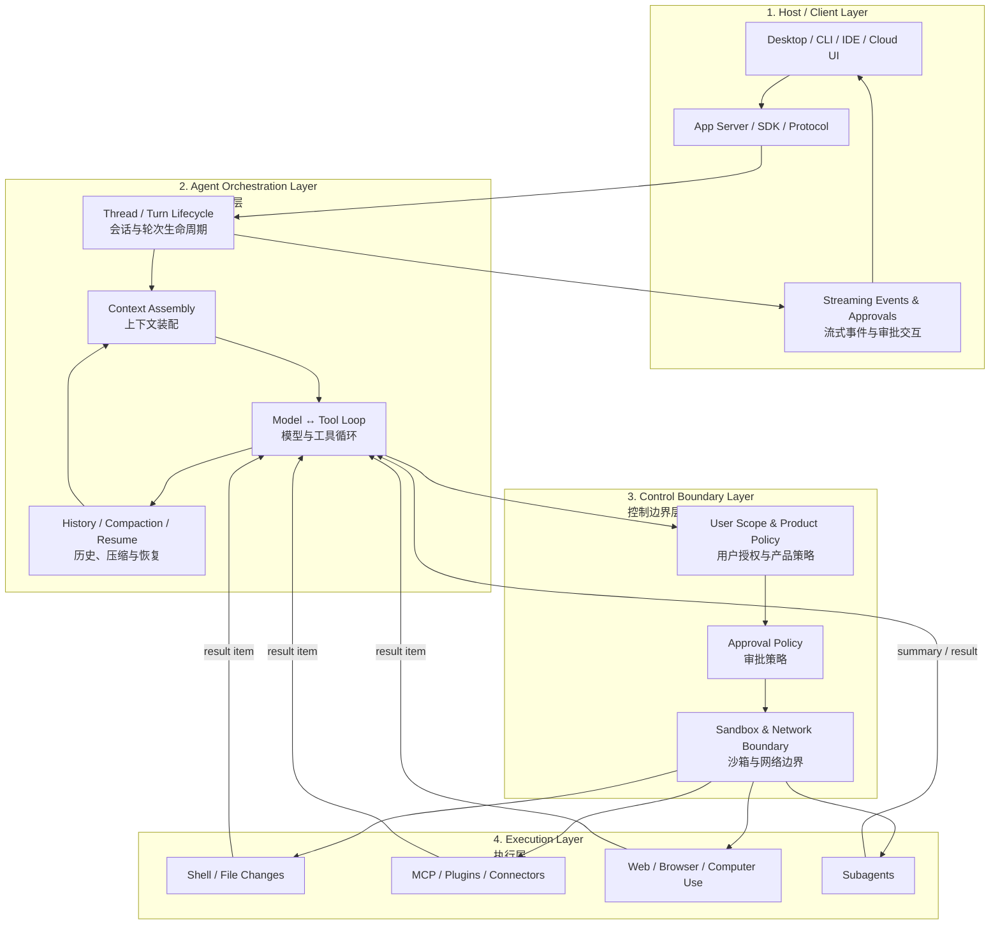
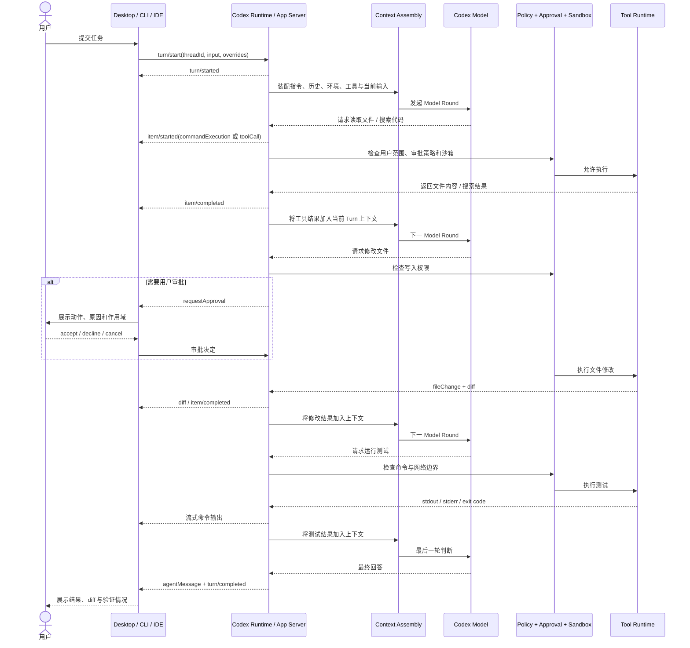
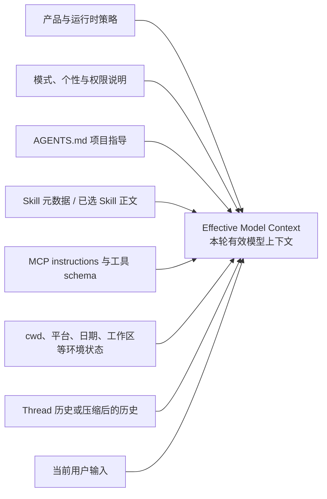
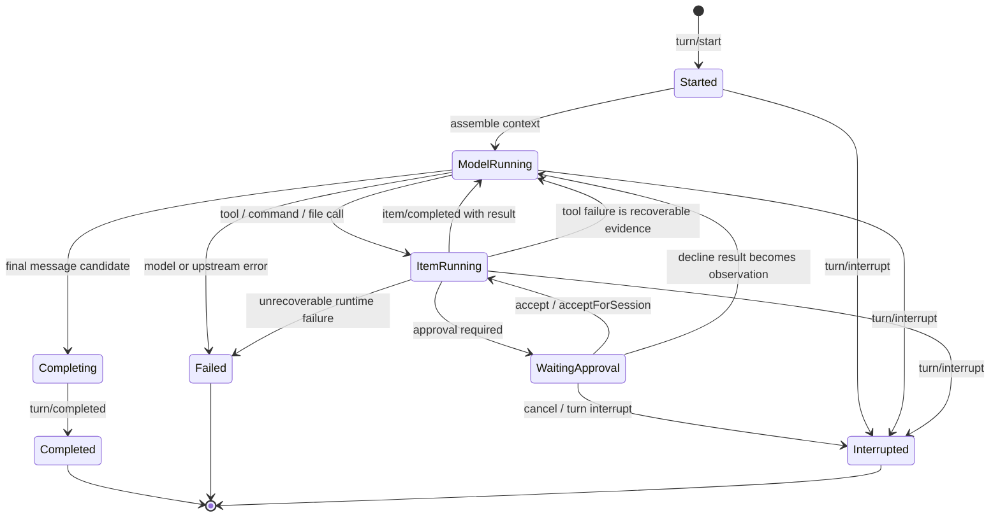

# Codex Agent Core 核心流程详解

> 最后核对：2026-08-14<br>
> 适用范围：Codex Desktop、Codex CLI、IDE Extension、Codex Cloud，以及基于 Codex App Server / SDK 的集成。<br>
> 本文描述的是 **OpenAI 官方公开协议能够确认的运行契约**，以及基于这些契约整理出的架构模型；不是对未公开服务端源码、隐藏系统提示词或模型思维链的逆向声明。

## 1. 核心结论

Codex 的 Agent Core 不是“一次模型请求”，而是一个围绕用户目标持续推进的闭环：

```text
接收任务
  → 装配上下文与能力边界
  → 模型判断下一步
  → 请求工具或生成回答
  → 运行时检查权限与沙箱
  → 执行动作并记录结果
  → 把结果送回模型
  → 验证是否已经完成
  → 继续循环或结束 Turn
```

从公开协议看，最稳定的三个核心对象是：

- `Thread`：持续存在的会话容器，包含多个 Turn；
- `Turn`：一条用户请求以及 Agent 为它完成的全部工作；
- `Item`：Turn 内可流式观察的最小工作单元，例如用户消息、Agent 消息、命令执行、文件修改、MCP 调用、Web 搜索和上下文压缩。

OpenAI 的 [Codex App Server 文档](https://learn.chatgpt.com/docs/app-server)直接公开了这三个原语、Turn 生命周期和 Item 事件。因此，理解 Codex Agent Core 的最佳入口不是“猜模型内部怎么想”，而是观察：

1. Runtime 给模型提供了什么上下文和工具；
2. 模型选择了什么动作；
3. Runtime 如何审批、隔离并执行动作；
4. 动作结果如何成为下一轮判断的证据；
5. Turn 最终以什么状态结束。

## 2. 本文的证据边界

为了避免把推导写成事实，本文使用三类表述：

| 标记           | 含义                                           | 示例                                                     |
| -------------- | ---------------------------------------------- | -------------------------------------------------------- |
| **官方契约**   | OpenAI 文档明确公开的对象、字段、事件或行为    | `Thread → Turn → Item`、`turn/start`、审批请求、沙箱模式 |
| **可观测行为** | 可以从客户端事件、工具调用和会话表现稳定观察到 | 工具结果进入后续模型上下文，Agent 会根据失败结果调整方案 |
| **架构推导**   | 为解释公开行为而抽象出的合理模块               | Context Compiler、Action Router、Completion Check        |

本文中的模块名如“上下文编译器”“动作路由器”“完成检查器”主要是 **概念职责名**，不表示 OpenAI 内部一定存在同名类或服务。

本文也不会展开模型的私有思维链。这里的“推理”只表示模型根据当前输入选择下一步动作；可观察、可调试的对象应当是计划摘要、工具调用、工具结果、文件差异、状态事件和最终输出。

## 3. 四层架构模型

可以把 Codex Agent Core 理解为四层：



这四层的责任不同：

- 宿主层负责连接、展示、输入、审批 UI 和事件流；
- 编排层负责维护 Thread / Turn、装配上下文并推进循环；
- 控制边界层负责判断动作是否被允许、是否要询问用户，以及技术上能访问什么；
- 执行层负责真正运行命令、修改文件、访问外部系统或调度子 Agent。

关键点是：**模型提出动作，但模型本身不应该成为副作用的最终授权者。** 真正的执行仍需经过 Runtime 暴露的工具、审批策略和沙箱边界。

## 4. 核心运行原语

### 4.1 Thread：长期会话容器

`Thread` 保存一段用户与 Codex 的持续协作历史。一个 Thread 可以：

- 新建：`thread/start`；
- 恢复：`thread/resume`；
- 分叉：`thread/fork`；
- 归档或取消归档；
- 包含多个依次发生的 Turn。

Thread 的职责是“保持连续性”，而不是代表一次正在执行的动作。同一个 Thread 中，用户可以先要求分析，再要求实施，最后要求测试；每条用户请求通常形成一个新的 Turn。

### 4.2 Turn：一条请求的执行边界

`Turn` 是一条用户请求和 Agent 后续工作的容器。官方协议允许在启动 Turn 时覆盖一部分运行参数，例如：

- 模型与推理强度；
- personality；
- 当前工作目录 `cwd`；
- approval policy；
- sandbox policy；
- 输出结构约束。

Turn 不等于一次模型调用。一个 Turn 内可以发生多次：

```text
模型判断 → 工具调用 → 工具结果 → 再次模型判断
```

直到完成、失败或被中断。

### 4.3 Item：可观察的工作单元

App Server 将 Turn 内部工作投影为 `Item`。常见类型包括：

| Item                | 含义                                                         |
| ------------------- | ------------------------------------------------------------ |
| `userMessage`       | 用户输入                                                     |
| `agentMessage`      | Agent 的进度消息或最终消息                                   |
| `plan`              | 计划文本或计划状态                                           |
| `reasoning`         | 可供客户端展示的推理摘要或相关载荷；不应等同于完整私有思维链 |
| `commandExecution`  | 命令执行及其状态、输出、退出码                               |
| `fileChange`        | 文件变更及 diff                                              |
| `mcpToolCall`       | MCP 工具调用                                                 |
| `dynamicToolCall`   | 客户端实现的动态工具调用                                     |
| `collabToolCall`    | 多 Agent 协作调用                                            |
| `webSearch`         | Web 搜索行为                                                 |
| `imageView`         | 本地图像查看                                                 |
| `contextCompaction` | 会话上下文发生压缩                                           |

Item 通常经历：

```text
item/started → 若干 delta / progress → item/completed
```

`item/completed` 是该 Item 的最终权威状态。工具输出、消息增量和文件差异可以在执行过程中流式到客户端。

### 4.4 Model Round：解释循环所需的概念

`Model Round` 不是 App Server 对外定义的核心对象，而是解释 Agent Loop 很有用的概念：

> 从 Runtime 向模型提交一次当前上下文，到模型返回文本、工具调用或结束候选，称为一个 Model Round。

因此，一个 Turn 通常包含一个或多个 Model Round；一个 Model Round 又可能提出一个或多个 Tool Call。

## 5. 一次 Turn 的完整时序

下面的时序图描述最典型的“修改代码并运行测试”流程：



这个流程包含三个互相嵌套的循环：

1. **Thread 循环**：用户不断在同一 Thread 中追加新的 Turn；
2. **Turn 循环**：围绕一条用户请求反复进行模型判断和工具执行；
3. **Item 生命周期**：每次消息、命令、文件修改或工具调用独立地开始、流式更新并完成。

## 6. 阶段一：连接初始化与 Thread 恢复

使用 App Server 时，客户端首先完成连接级初始化：

```text
initialize → initialized
```

随后客户端选择：

- 创建新 Thread；
- 恢复已有 Thread；
- 从已有 Thread 分叉新 Thread。

初始化主要建立宿主能力和协议会话，不等于用户任务已经开始。真正的任务从 `turn/start` 开始。

恢复 Thread 也不意味着机械重放所有历史副作用。正确的恢复目标是重新获得对话连续性；已经执行过的 shell、网络或外部写操作是否可安全重试，仍需依据持久状态和幂等性判断。

## 7. 阶段二：冻结本轮运行配置

Turn 启动时，Runtime 需要得到本轮的有效配置。概念上包括：

```text
TurnConfig =
    model
  + reasoning effort
  + personality / collaboration mode
  + cwd / workspace roots
  + sandbox policy
  + approval policy
  + network policy
  + available tool schemas
  + output constraints
```

这些配置决定两个不同问题：

1. 模型看见哪些动作；
2. Runtime 最终允许执行哪些动作。

二者不能混为一谈。一个工具出现在 Tool Schema 中，只表示模型可以提出该调用，不代表该调用一定能绕过审批、沙箱或用户授权。

更准确的表达是：

```text
实际可执行动作
  = 用户请求允许的范围
  ∩ 产品与开发者策略允许的范围
  ∩ 本轮暴露的工具能力
  ∩ 审批策略放行的范围
  ∩ 沙箱与网络技术上可达的范围
```

## 8. 阶段三：上下文装配

Codex 不是把“用户最后一句话”单独发给模型。一次有效输入通常由多个层次共同组成：



这张图表达“语义组成”，不声称这些内容在所有 Codex 版本中都以完全相同的 wire order 发送。

### 8.1 产品与运行时策略

这一层定义 Agent 的基本工作方式，例如：

- 如何处理读、写、诊断和实现请求；
- 如何使用工具；
- 如何与用户沟通进度；
- 如何对待工作区已有改动；
- 哪些动作需要显式授权。

它是 Agent 行为边界，不是项目知识。

### 8.2 `AGENTS.md` 项目指导

Codex 会在开始工作前发现适用的 `AGENTS.md`。官方文档公开的发现规则包括：

1. 先读取 Codex home 中的全局指导；
2. 再从项目根目录沿路径走到当前工作目录；
3. 每一层最多选择一个匹配文件；
4. 更接近当前目录的指导出现在后面，因而可以覆盖更上层的项目指导；
5. `AGENTS.override.md` 可在相应层级覆盖普通 `AGENTS.md`。

详细规则见 [Custom instructions with AGENTS.md](https://learn.chatgpt.com/docs/agent-configuration/agents-md)。

`AGENTS.md` 适合承载持久的团队约定，例如构建命令、测试要求、目录规范和评审标准。它不应被用来伪造工具结果，也不能让一个技术上不存在的能力突然可用。

### 8.3 Skills 的渐进披露

Skill 不是把所有工作流正文永久塞进上下文。官方文档描述的流程是：

```text
先暴露 Skill 名称与描述
  → Agent 判断是否适用
  → 选择后读取完整 SKILL.md
  → 按 Skill 引用读取必要脚本、参考资料或资产
```

这种设计称为渐进披露。它让 Agent 能发现大量能力，又避免所有 Skill 正文同时占满上下文。详见 [Build skills](https://learn.chatgpt.com/docs/build-skills)。

因此：

- Skill 出现在目录中，不等于正文已经加载；
- Skill 被加载，不等于其中提到的外部系统已经授权；
- Skill 规定的是工作流，实际副作用仍受工具、审批和沙箱控制。

### 8.4 MCP 与外部工具上下文

MCP 为 Codex 提供第三方工具和上下文。Runtime 可以把 MCP Server 暴露的：

- Tool Schema；
- Server Instructions；
- Resources；
- 鉴权后的外部能力；

加入本轮能力面。官方的 [MCP 文档](https://learn.chatgpt.com/docs/extend/mcp)说明，本地 Codex 客户端可以直接连接 MCP Server，并在同一 Codex host 上共享配置。

MCP 仍然只是能力协议。某个服务已配置，不代表当前用户对每个对象都有访问权，也不代表所有操作都无需确认。

### 8.5 历史与当前用户输入

Thread 历史为模型提供先前决定、已知事实、工具结果和用户偏好。当前用户输入则定义本 Turn 的直接目标。

当用户在进行中的 Turn 里追加说明时，App Server 支持 `turn/steer`：新输入被追加到当前活动 Turn，而不是强制创建新 Turn。Steer 适合修正方向，例如“先处理失败测试”，但不会重新定义已经在 Turn 启动时冻结的所有配置覆盖项。

## 9. 阶段四：模型决策

上下文装配完成后，Runtime 发起一个 Model Round。模型的可观察输出通常可以归入三类：

### 9.1 直接回答

如果任务只需解释、总结或当前证据已经充分，模型可以生成 Agent Message，进入 Turn 收尾。

### 9.2 请求动作

如果还需要信息或副作用，模型会产生 Tool Call，例如：

- 搜索文件或读取代码；
- 运行 shell 命令；
- 提交文件变更；
- 调用 MCP、Web、Browser 或 Computer Use；
- 请求用户输入；
- 调度子 Agent。

模型只负责提出结构化动作。Runtime 才负责验证 Tool Schema、检查策略并实际执行。

### 9.3 输出计划或进度

复杂任务可能产生 Plan Item 或进度消息。计划用于帮助用户理解和帮助 Agent 维护工作状态，但计划本身不执行任何动作。只有后续真实工具调用及其成功结果才能证明工作已经发生。

## 10. 阶段五：动作路由与安全门

一个工具调用在执行前至少要经过三类边界。

### 10.1 用户授权范围

用户让 Agent “解释问题”，并不自动授权修改代码；让 Agent “修改代码”，也不自动授权发布、推送、发送消息或操作无关系统。

用户授权范围是语义边界。即使技术权限足够，Agent 也不应把请求扩展成实质不同的外部动作。

### 10.2 Approval Policy

Approval Policy 决定 Runtime 在什么情况下必须暂停并询问用户。App Server 公开的命令审批决定包括：

- 接受一次；
- 本会话接受；
- 拒绝；
- 取消；
- 在支持时，以更精确的执行策略修订后接受。

文件修改也可以拥有独立审批流程。审批请求会携带 Thread、Turn 和 Item 标识，使客户端能把 UI 状态绑定到正确的工作单元。

### 10.3 Sandbox Policy

Sandbox 决定命令技术上能访问什么，例如：

- 哪些路径可读写；
- 是否可以访问工作区外部；
- 是否允许网络；
- 子进程继承什么边界。

[Sandbox 文档](https://learn.chatgpt.com/docs/sandboxing)明确区分了两者：

| 控制     | 回答的问题                       |
| -------- | -------------------------------- |
| Sandbox  | “这个动作在技术上能触达什么？”   |
| Approval | “跨越某个边界前是否必须问用户？” |

它们协同工作，但不是同一个开关。

### 10.4 三类边界不能互相替代

```text
沙箱很宽 ≠ 用户授权很宽
用户授权了 ≠ 技术沙箱一定允许
工具存在 ≠ 审批策略一定放行
审批通过 ≠ 可以超出被批准的具体作用域
```

关于默认网络关闭、OS 级沙箱和 Cloud 两阶段环境，见 [Agent approvals & security](https://learn.chatgpt.com/docs/agent-approvals-security)。

## 11. 阶段六：工具执行与结果回灌

工具被允许后，Runtime 执行动作并生成 Item 事件。

### 11.1 命令执行

命令执行 Item 可以包含：

- command；
- cwd；
- in-progress / completed / failed / declined 状态；
- stdout / stderr 增量；
- exit code；
- duration。

退出码为零只是“命令进程成功退出”，不自动证明业务目标完成。Agent 仍需结合测试内容、输出和预期行为判断。

### 11.2 文件修改

文件修改 Item 描述路径、变更类型和 diff。客户端还可以接收 Turn 级聚合 diff 更新。

文件变更产生后，下一轮模型能够基于真实 diff 决定：

- 是否还需修正；
- 是否需要格式化；
- 应运行哪些测试；
- 是否意外修改了无关文件。

### 11.3 MCP、Web 与客户端动态工具

这些调用的共同模式仍然是：

```text
结构化调用
  → Runtime / Client 执行
  → 结构化结果或错误
  → Item 完成
  → 结果进入后续模型上下文
```

外部工具返回的文本应被视为数据或观察结果，而不是自动提升为高优先级指令。Runtime 和系统提示需要防止外部内容借工具结果改变授权边界。

### 11.4 工具失败也是有效观察

工具失败通常不意味着 Turn 必须立即失败。模型可以根据错误：

- 修改命令参数；
- 换一种工具；
- 缩小读取范围；
- 先安装或定位依赖；
- 请求用户提供缺失信息；
- 在无法安全继续时解释阻塞。

这正是 Agent Loop 与固定流水线的区别：Runtime 把失败事实反馈给模型，模型根据新证据选择下一步。

## 12. 阶段七：循环、验证与收尾

工具结果被追加到当前 Turn 后，Runtime 再次发起 Model Round。循环持续到以下任一条件成立：

- 模型生成最终回答，并且没有待处理工具或审批；
- 用户或客户端中断 Turn；
- 发生不可恢复错误；
- 用户拒绝关键动作，模型随后给出可解释的降级结果或阻塞说明；
- Runtime 达到产品限制或资源限制。

对于代码任务，可靠的完成路径通常是：

```text
理解现状
  → 修改
  → 检查 diff
  → 运行相关测试 / 类型检查 / 构建
  → 根据失败继续修复
  → 汇总变更和验证证据
```

“完成检查”在本文中是架构职责名。公开文档可以确认 Codex 会编辑、运行检查并尝试验证工作，但没有公开证明所有产品表面都由一个叫 `FinalizationGuard` 的独立内部组件实现。因此，不应把某个概念模块误写成 OpenAI 的内部类名。

## 13. Turn 状态机

下面的状态机以公开事件为基础，并把审批等待表示为 Turn 内部的可恢复子状态：



App Server 对外的 Turn 最终状态包括 `completed`、`failed` 和 `interrupted`。等待审批时，客户端能看到待决 Server Request 和进行中的 Item；审批解决后，同一个 Turn 可以继续推进。

## 14. 流式事件与可观测性

Codex 的 UI 不是等 Agent 全部完成后才一次性拿结果。App Server 会持续发送事件。

### 14.1 Turn 级事件

| 事件                        | 用途                                          |
| --------------------------- | --------------------------------------------- |
| `turn/started`              | Turn 已进入进行中状态                         |
| `turn/plan/updated`         | 计划状态更新                                  |
| `turn/diff/updated`         | 当前 Turn 聚合文件差异更新                    |
| `thread/tokenUsage/updated` | Thread token 使用变化                         |
| `turn/completed`            | Turn 以 completed / failed / interrupted 结束 |

### 14.2 Item 级事件

| 事件                                | 用途               |
| ----------------------------------- | ------------------ |
| `item/started`                      | 一个工作单元开始   |
| `item/agentMessage/delta`           | Agent 消息流式文本 |
| `item/commandExecution/outputDelta` | 命令输出增量       |
| `item/completed`                    | Item 最终状态      |

### 14.3 审批事件

审批是 Server 向 Client 发起的请求，而不是普通 Agent 文本。标准顺序可抽象为：

```text
item/started
  → requestApproval
  → client decision
  → serverRequest/resolved
  → item/completed
```

这套结构很重要，因为它让“模型说自己得到批准”和“Runtime 真正收到批准”成为两件不同的事。

## 15. 上下文增长与 Compaction

长任务会不断积累：

- 用户消息；
- Agent 消息；
- 命令输出；
- 文件 diff；
- MCP 结果；
- 计划与状态；
- 多轮修复记录。

当历史过长时，Codex 可以产生 `contextCompaction` Item。公开协议确认“发生了压缩”这一事实，但没有承诺公开每个产品版本的完整压缩算法。

从架构角度，安全的 Compaction 必须尽量保留：

- 当前目标和用户约束；
- 已经完成的工作；
- 未解决的阻塞；
- 关键文件与关键决定；
- 测试和验证结果；
- 待处理审批或外部依赖；
- 继续工作所需的最小上下文。

同时应舍弃或浓缩：

- 重复命令输出；
- 已被后续事实覆盖的中间猜测；
- 与当前目标无关的长日志；
- 已经总结过的搜索过程。

压缩摘要是会话连续性的载体，不是新的授权来源，也不能把“尚未执行”总结成“已经执行”。

## 16. Skill、MCP 与 Subagent 如何接入核心循环

### 16.1 Skill：改变“怎么做”

Skill 为模型提供可复用工作流、脚本、参考资料和资产。它主要影响：

- 上下文装配；
- 工具选择策略；
- 验证步骤；
- 输出格式。

Skill 不直接取代 Runtime 的审批和沙箱。

### 16.2 MCP：扩展“能调用什么”

MCP 扩展工具和上下文表面。它主要影响：

- Tool Schema；
- 外部系统连接；
- MCP Server 级指导；
- Tool Result 的结构。

MCP 调用仍然作为 Item 进入相同的 Turn Loop。

### 16.3 Subagent：把独立工作分支出去

Subagent 适合彼此独立、可以并行的工作，例如：

- 大型代码库的多方向探索；
- 测试、日志和文档的并行分析；
- 多个互不冲突的研究分支。

官方 [Subagents 文档](https://learn.chatgpt.com/docs/agent-configuration/subagents)说明，主 Agent 可以创建专门 Agent 并汇总结果。每个 Subagent 会进行自己的模型与工具工作，因此会增加 token 消耗；并行写同一工作区还可能产生冲突。

在核心循环中，Subagent 可以抽象为一种异步工具：

```text
主 Agent 提交有界子任务
  → Subagent 独立运行自己的 Turn / Tool Loop
  → 返回摘要或结果
  → 主 Agent 将结果纳入当前判断
```

主 Agent 仍负责最终整合、冲突处理和面向用户的完成结论。

## 17. Local、Worktree 与 Cloud 的流程差异

Agent Loop 的语义基本一致，但执行环境不同。

| 模式     | 工作位置              | 隔离方式             | 网络与依赖                                             | 典型用途                        |
| -------- | --------------------- | -------------------- | ------------------------------------------------------ | ------------------------------- |
| Local    | 当前项目目录          | 本机沙箱             | 受本地配置和审批控制                                   | 直接修改当前工作区              |
| Worktree | 独立 Git worktree     | 本机目录隔离 + 沙箱  | 可运行项目 setup script                                | 并行任务、避免污染当前分支      |
| Cloud    | OpenAI 管理的远程容器 | 与主机及无关数据隔离 | Setup 阶段可联网；Agent 阶段默认关闭网络，可按环境配置 | 远程执行、PR 工作流、可复现环境 |

模式选择见 [Codex environments](https://learn.chatgpt.com/docs/environments/modes)。Cloud 的公开流程包括：创建容器、checkout 指定代码、运行 setup、应用网络策略、进入命令与编辑循环、展示答案和 diff；详见 [Cloud environments](https://learn.chatgpt.com/docs/environments/cloud-environment)。

无论在哪种模式中，都应维持相同的原则：模型提出动作，执行环境控制副作用，结果再回到模型。

## 18. 失败、中断、拒绝与恢复

### 18.1 工具失败

工具失败可以作为普通结果反馈给模型。如果模型有安全替代方案，Turn 可以继续。

### 18.2 审批拒绝

拒绝不必等于整个 Turn 失败。Runtime 可以把 `declined` 状态交给模型，模型随后：

- 选择无副作用方案；
- 缩小请求范围后再次申请；
- 输出部分结果；
- 解释为什么无法完成剩余部分。

### 18.3 Turn 中断

`turn/interrupt` 会让 Turn 以 `interrupted` 结束。中断后如果继续工作，新的 Turn 应依据已持久化历史和当前工作区状态重新判断，而不是盲目重放最后一个未知结果的副作用。

### 18.4 上游错误

公开错误类型包括上下文窗口超限、使用限额、连接失败、上游 HTTP 错误、沙箱错误和内部错误等。客户端应把：

- 协议失败；
- 工具失败；
- 任务业务阻塞；

区分展示，因为三者的恢复策略不同。

## 19. 概念伪代码

下面的伪代码用于说明控制关系，不对应 OpenAI 未公开的真实函数名：

```text
function runTurn(thread, userInput, overrides):
    turn = startTurn(thread, userInput, overrides)
    emit(turn.started)

    while turn.status == IN_PROGRESS:
        context = compileContext(
            productPolicy,
            turn.config,
            discoverAgentsMd(turn.cwd),
            selectedSkills,
            mcpInstructions,
            availableToolSchemas,
            thread.historyOrCompaction,
            turn.items,
            latestUserInput
        )

        modelOutput = callModel(context)

        if modelOutput.requestsActions():
            for action in modelOutput.actions:
                item = startItem(action)
                emit(item.started)

                if not withinUserScope(action):
                    result = declined("outside user authorization")
                else if requiresApproval(action, turn.approvalPolicy):
                    decision = requestApproval(action)
                    result = executeOrDecline(decision, action, turn.sandboxPolicy)
                else:
                    result = execute(action, turn.sandboxPolicy)

                item.complete(result)
                persist(item)
                emit(item.completed)

            maybeCompactContext(thread, turn)
            continue

        finalMessage = modelOutput.message
        persist(finalMessage)
        completeTurn(turn, finalMessage)
        emit(turn.completed)

    return turn.result
```

这段伪代码强调五个架构不变量：

1. 上下文是运行时装配的，不是单一静态 Prompt；
2. 模型输出动作意图，Runtime 执行动作；
3. 每个副作用都受用户范围、审批和沙箱共同约束；
4. 工具结果先持久化为事实，再进入下一轮模型判断；
5. Turn 完成与单个工具完成是不同层级的状态。

## 20. 最容易误解的地方

### 20.1 “Agent Core 就是大模型”

不准确。模型负责语义判断，Agent Core 还包括上下文、工具协议、审批、沙箱、状态、事件和恢复。

### 20.2 “一个 Turn 就是一次 API 调用”

不准确。一个 Turn 内通常有多个 Model Round 和多个 Item。

### 20.3 “工具列表里有，就一定能执行”

不准确。工具暴露、用户授权、审批策略和沙箱是不同层级。

### 20.4 “沙箱放开，就等于 Agent 可以做任何事”

不准确。沙箱描述技术能力，不会自动扩大用户请求的语义授权。

### 20.5 “审批只是模型问一句话”

不准确。可靠审批是 Runtime 与 Client 之间的结构化协议请求，必须绑定具体 Thread、Turn 和 Item。

### 20.6 “Skill 列表就是所有 Skill 正文”

不准确。Skill 使用渐进披露，先暴露元数据，选中后再读取完整说明。

### 20.7 “Compaction 就是删除旧消息”

过于简单。Compaction 的目的应是用更短的状态表示保留继续任务所需的语义连续性。

### 20.8 “Subagent 越多越好”

不准确。Subagent 适合独立、可并行的子任务；共享工作区的并行写入会增加冲突与协调成本。

### 20.9 “模型说完成，就一定完成”

不准确。高质量的 Agent Runtime 应以真实文件状态、工具结果和验证证据支撑完成结论。

## 21. 对 OpenTopia Agent Core 的实现启示

如果要在 OpenTopia 中实现与 Codex 同类的 Agent Core，优先对齐的不是隐藏提示词文字，而是下面这些可验证的运行契约。

### 21.1 保持 Thread、Turn、Item 三层分离

- Thread 负责跨请求连续性；
- Turn 负责一次用户目标的生命周期；
- Item 负责流式观察和精确状态。

不要把所有状态塞进一个“message”表或一个超大枚举。

### 21.2 把语义决策与副作用控制分开

模型决定“下一步想做什么”；Runtime 决定“能否做、是否需审批、在哪里做、结果如何记录”。

### 21.3 把上下文装配做成显式边界

建议让 Context Compiler 明确接收：

```text
base policy
+ collaboration mode
+ project instructions
+ selected skills
+ MCP instructions
+ tool schemas
+ environment state
+ durable history / compaction
+ current turn items
+ user input
```

这样才能测试指令覆盖、缓存谱系、Skill 渐进披露和上下文预算。

### 21.4 审批必须是可恢复协议

审批等待应保存精确的：

- Thread ID；
- Turn ID；
- Item ID；
- 原始动作；
- 请求原因；
- 可选决定；
- 已有沙箱和能力边界。

恢复时继续同一个逻辑工作单元，不能让模型凭自然语言猜“用户刚才批准了什么”。

### 21.5 事件流应当来自持久化事实

客户端应能先读取已经提交的历史事件，再无缝接入实时事件。命令输出 delta 可以是暂态流，但 Item 最终状态、文件 diff、审批结果和 Turn 终态应有稳定真相源。

### 21.6 Completion 要依赖证据

对于实现类任务，至少检查：

- 是否仍有待处理工具；
- 是否仍有待审批动作；
- 文件变更是否已经产生；
- 相关测试是否执行以及结果如何；
- 子 Agent 是否仍在运行；
- 用户要求的交付物是否真实存在。

OpenTopia 当前更具体的模块边界和状态所有权，见：

- [`agent-loop-architecture-current.md`](./agent-loop-architecture-current.md)
- [`agent-core-architecture-current.md`](./agent-core-architecture-current.md)
- [`agent-runtime-boundaries.md`](./agent-runtime-boundaries.md)
- [`codex-system-prompt-modular-analysis-zh-cn.md`](./codex-system-prompt-modular-analysis-zh-cn.md)

## 22. 架构检查清单

实现或评审一个 Codex-like Agent Core 时，可以逐项检查：

### 生命周期

- [ ] Thread、Turn、Item 是否有独立 ID 和状态？
- [ ] Turn 是否支持 start、interrupt、resume 或后续继续？
- [ ] Item 是否有 started、progress、completed 语义？

### 上下文

- [ ] 项目指导是否按作用域发现和覆盖？
- [ ] Skill 是否采用渐进披露？
- [ ] MCP instructions 与 Tool Schema 是否进入正确层次？
- [ ] 历史压缩是否保留目标、约束、证据和未完成事项？

### 工具与安全

- [ ] Tool Schema 暴露与 Tool Execution 授权是否分离？
- [ ] 用户授权、Approval Policy、Sandbox Policy 是否分离？
- [ ] 审批是否绑定精确的 Thread / Turn / Item？
- [ ] 工具结果和错误是否都会回灌给模型？

### 持久化与恢复

- [ ] 已完成副作用是否不会在恢复时被盲目重放？
- [ ] 审批等待是否能从精确快照恢复？
- [ ] 终态是否来自持久事实而不是仅来自 UI 内存？

### 完成质量

- [ ] Agent 是否区分“提出修改”和“修改已落盘”？
- [ ] 是否区分“运行测试”和“测试通过”？
- [ ] 最终回答是否能引用真实 diff、命令和验证结果？
- [ ] 未完成或被阻塞的部分是否明确说明？

## 23. 官方资料

- [Codex App Server：Thread、Turn、Item、事件、审批与错误](https://learn.chatgpt.com/docs/app-server)
- [Codex SDK：创建、继续和恢复 Thread](https://learn.chatgpt.com/docs/codex-sdk)
- [Codex Customization：AGENTS.md、Skills、MCP 与 Subagents](https://learn.chatgpt.com/docs/customization/overview)
- [AGENTS.md 发现与覆盖规则](https://learn.chatgpt.com/docs/agent-configuration/agents-md)
- [Build Skills：Skill 结构与渐进披露](https://learn.chatgpt.com/docs/build-skills)
- [Model Context Protocol：外部工具与上下文](https://learn.chatgpt.com/docs/extend/mcp)
- [Sandbox：沙箱与审批的职责区别](https://learn.chatgpt.com/docs/sandboxing)
- [Agent approvals & security：审批、网络与环境安全](https://learn.chatgpt.com/docs/agent-approvals-security)
- [Subagents：并行工作与主 Agent 汇总](https://learn.chatgpt.com/docs/agent-configuration/subagents)
- [Codex environments：Local、Worktree 与 Cloud](https://learn.chatgpt.com/docs/environments/modes)
- [Cloud environments：Cloud Agent 的公开运行步骤](https://learn.chatgpt.com/docs/environments/cloud-environment)

## 24. 一句话记忆模型

> Codex Agent Core 是一个以 `Thread → Turn → Item` 为外部状态骨架、以“模型判断 → 受控动作 → 结果回灌”为内部循环、以用户授权、审批与沙箱为副作用边界、以事件流和持久化状态支撑交互与恢复的 Agent Runtime。
