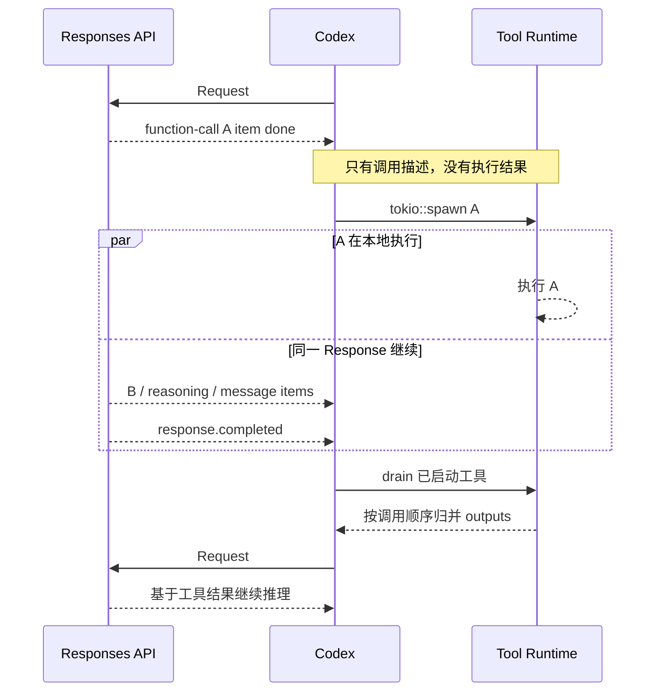
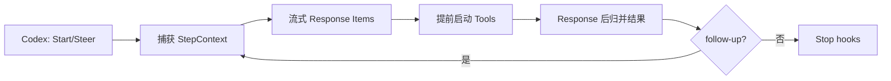
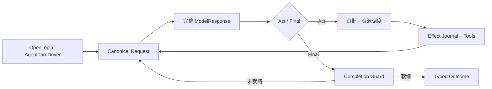
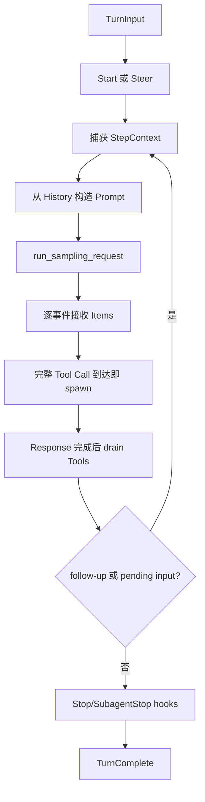
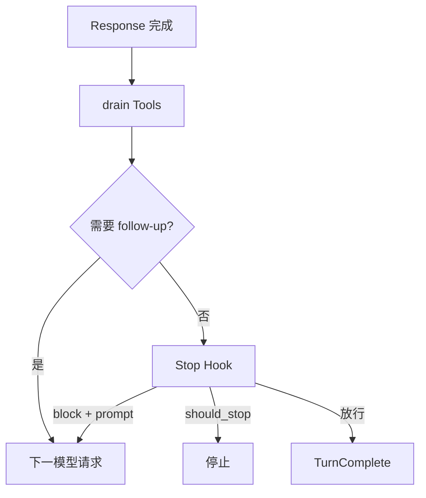
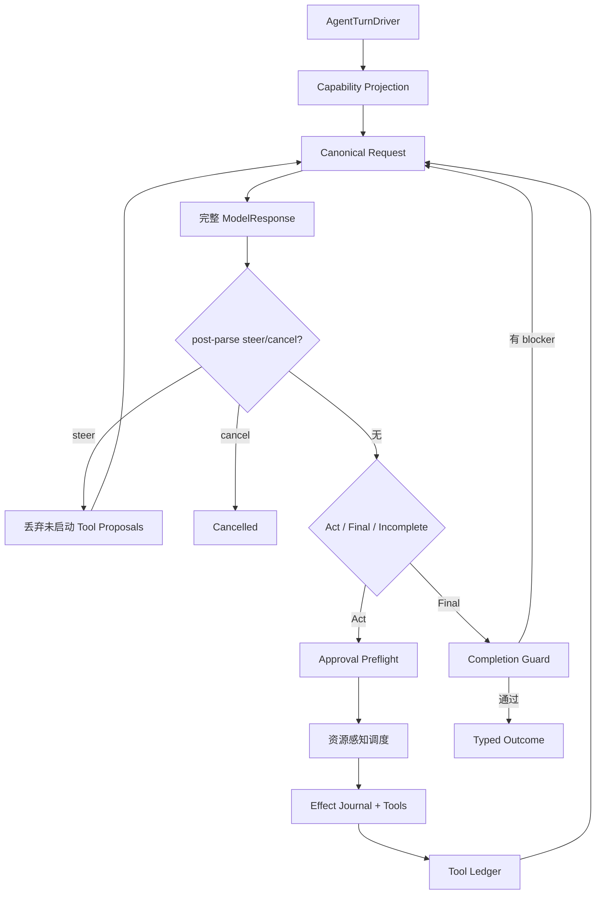
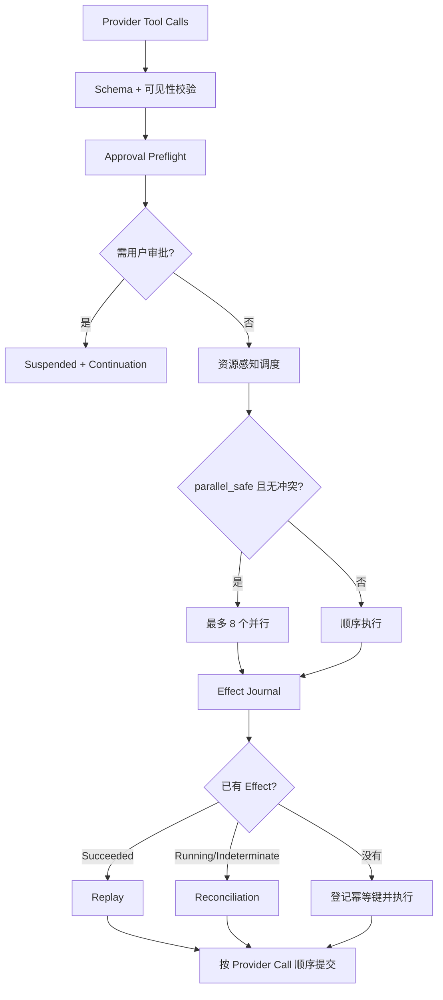
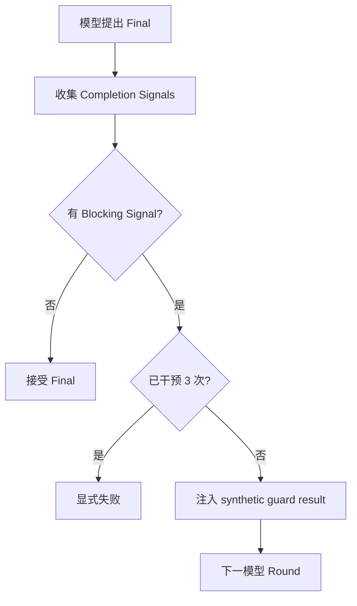

# Codex 与 OpenTopia Agent Loop 对比

## 核心澄清

Codex 不会把工具结果插入一个仍在生成的模型 Response。它只是把工具的开始时间提前：当 function-call 的工具名、call_id 和 arguments 已经生成完整时，立即启动工具；结果仍在本次 response.completed 之后归并，并作为下一次模型请求的输入。

一次模型请求返回一个 Response，一个 Response 可以含多个有序 output item。因此 A 的 tool-call item 完整后，同一 Response 还可能继续产生 B、reasoning 或 message item。

```text
Request #1
  → call A item done（只有调用描述，没有结果）
  → 启动工具 A
  → Response 继续输出其他 items
  → response.completed
  → 等待并归并 A/B 工具结果
Request #2（输入包含 tool outputs）
```

Codex 有结束门控和可配置的 Stop/SubagentStop hook，但没有 OpenTopia 那种默认集中收集业务 blocker 的 Completion Guard。

## 三种“完成”

| 名称 | 含义 | 有工具结果吗？ |
| --- | --- | --- |
| tool-call item done | 工具名、call_id、arguments 已生成完整 | 没有 |
| tool execution done | 本地或 MCP 工具执行结束 | 有，但不能插入同一 Response |
| response.completed | 本次模型 Response 完全结束 | 此后归并结果并准备下一请求 |

## Codex 的真实时序



所以“结果批量返回”基本正确：实现上逐条 drain 并记入 history；模型在下一次请求中看到这些 outputs。Codex 的优化点只是工具提前开跑。

源码证据：

- [stream_events_utils.rs](J:/Project/OpenAI/codex/codex-rs/core/src/stream_events_utils.rs)：`OutputItemDone` 变成 tool future。
- [parallel.rs](J:/Project/OpenAI/codex/codex-rs/core/src/tools/parallel.rs)：构造 future 时内部立即 `tokio::spawn`。
- [turn.rs](J:/Project/OpenAI/codex/codex-rs/core/src/session/turn.rs)：`response.completed` 后调用 `drain_in_flight`。
- [tool_parallelism.rs](J:/Project/OpenAI/codex/codex-rs/core/tests/suite/tool_parallelism.rs)：专门验证 shell 工具在 Response 完成前已启动。

## 两套循环的最高层对照





Codex 的细粒度处理单位是 `ResponseItem`；OpenTopia 的控制单位更接近完整 `ModelResponse + Round State`。

## Codex 主循环



关键行为：

- 每次 sampling 前重新捕获 `StepContext`，让 prompt、工具目录和执行共享同一请求快照。
- 并行工具获取共享 read lock；非并行工具获取独占 write lock。
- `FuturesOrdered` 保证工具结果按模型调用顺序写回。
- Pre-turn 和 Mid-turn 都可能进行 compaction。
- 普通 `run_turn` 没有 OpenTopia 那种显式 270 轮硬上限。

## Codex 有结束守卫吗？

**广义上有结束门控；狭义上没有 OpenTopia 那种默认集中式 Completion Guard。**

Codex 先检查机械条件：工具全部 drain、`needs_follow_up=false`、没有 pending input。通过后才运行可配置的 `Stop` 或 `SubagentStop` hook。

Stop hook 可以：

- 放行，Turn 正常完成；
- `should_block` 并给出 continuation prompt，让 Codex 再跑一轮；
- `should_stop`，直接停止 Turn。



| 结束能力 | Codex | OpenTopia |
| --- | --- | --- |
| 未完成工具阻止结束 | sampling 返回前强制 drain | pending tool 是 blocker |
| 新输入阻止结束 | pending input 触发 follow-up | pending message 可成为 blocker |
| 自定义结束检查 | Stop/SubagentStop hook | Completion Registry 可扩展 |
| 默认收集审批、Work Form、子 Agent 等业务 blocker | 没有同等级集中注册表 | 有 |
| 反馈模型重试 | Hook 可注入 prompt | synthetic guard call/result |
| 干预上限 | 无等价固定 3 次上限 | 最多 3 次 |
| Durable continuation | 普通 Turn 更依赖活跃 Session | 核心设计 |

准确说法：

> Codex 有“结束条件 + 可配置 Stop hooks”，但没有 OpenTopia 那种默认理解业务状态并集中证明“任务真的完成”的 Completion Guard。

## OpenTopia 主循环



当前主路径通常等完整 `ModelResponse` 后才启动工具，因此失去 Codex 的 early-start 点，但换来更明确的审批、steer 和副作用边界。

### 工具调度和副作用



OpenTopia 不只问“工具是否可并行”，还检查授权、`parallel_safe`、`resource_keys`、读写冲突和批次上限。

Effect Journal 区分：

- 已成功：replay 结果，不重复执行；
- Running：要求 reconciliation；
- 非幂等且结果不确定：标记 Indeterminate，不自动重试；
- 可安全执行：先登记 Running，再执行。

### 暂停、恢复和上下文

OpenTopia 把 Approval、UserInput、ExternalAction 建模成显式恢复信号。Continuation 保存 Turn identity、workspace、权限、conversation/model context、budget、tool candidates、pending calls/results、provider items、runtime snapshot 和兼容哈希。

恢复时会重新校验 workspace、权限、sandbox、capability projection、Turn identity、Provider/Runtime snapshot 和工具目录。

每个 Round 经过 context-pressure gate，需要时生成 provider-neutral durable checkpoint；checkpoint 后进入新的 provider request epoch，旧 cursor 不能跨过边界。

### Completion Guard 和长回合保护

模型提出 `Final` 后，OpenTopia 继续检查 pending tools、pending approvals、Work Form、活跃子 Agent、未投递 mailbox message 和 Completion Registry 信号。



其他上限：第 90/180 轮提醒，第 270 轮硬停止；rollout token budget 用完时停止；连续三轮非法调用或非法 arguments JSON 时熔断。

## 核心差异表

| 维度 | Codex | OpenTopia | 影响 |
| --- | --- | --- | --- |
| 循环单位 | 流式 `ResponseItem` | 完整 `ModelResponse + Round State` | Codex 延迟低；OpenTopia 整轮一致性强 |
| 工具启动 | call item 完整后，可早于 Response 完成 | 通常完整 ModelResponse 后 | Codex 可以提前开跑 |
| 结果给模型 | drain 后进入下一请求 | 工具批次后进入下一 Round | 两者都不会插入同一生成中 Response |
| 并行模型 | supports_parallel + RwLock | 授权 + resource read/write conflicts | OpenTopia 调度更细 |
| 结果顺序 | FuturesOrdered | 按 provider call 顺序归并 | 都保持稳定顺序 |
| 副作用恢复 | 无同等级通用 Effect Journal | Replay/Indeterminate/Reconciliation | OpenTopia 更适合业务写操作 |
| 审批和用户输入 | 多数在活跃 Session future 内等待 | Typed durable continuation | OpenTopia 可跨进程恢复 |
| Steer | input queue，在 sampling 间消费 | post-parse safe point | Codex 更即时；OpenTopia 边界更明确 |
| 工具目录 | 每次 sampling 捕获 StepContext | Turn 开始、tool search、resume 刷新 | Codex 动态性更强 |
| 压缩 | Pre/Mid-turn 多种 compactor | 每 Round pressure gate + durable checkpoint | OpenTopia 强调可恢复 epoch |
| 最终完成 | tools drained + 无 follow-up/input + Stop hooks | Model Final + Completion Guard | OpenTopia 默认业务 blocker 更多 |
| Round 上限 | 主循环无显式 270 轮计数 | 270 轮硬上限 | OpenTopia 更确定 |
| 终态 | 完成/错误/中断生命周期为主 | 多种 Typed Outcomes | OpenTopia 产品状态更丰富 |

## 为什么 Codex 的提前启动有价值

假设工具 A 需要 8 秒，从 A 的 call item 完整到 `response.completed` 还需要 2 秒：

- 等完整 Response 后启动：约 `2 + 8 = 10 秒`；
- Codex 提前启动：前 2 秒重叠，约 `max(2, 8) = 8 秒`。

这个优化不改变工具结果进入下一轮的事实，只缩短等待下一轮开始前的工具尾延迟。

## 对 OpenTopia 的建议

保留 `AgentTurnDriver`、typed continuation、Effect Journal、resource-aware scheduler、Completion Guard 和 provider-neutral checkpoint。

若借鉴 Codex early dispatch，应仅允许完整、已校验、已授权、幂等或无副作用、资源独立的 `ToolCallReady` 提前执行。需要审批、有业务副作用或可能与 steer 冲突的调用仍等 Response commit。

建议把 [provider_turn_loop.rs](J:/Project/OpenTopia/crates/opentopia-core/src/agent/provider_turn_loop.rs) 按职责拆为：

- `PendingToolQueue`；
- `ApprovalCoordinator`；
- `TurnSuspensionBuilder`；
- `ProviderRoundDriver`；
- `ToolExecutionCoordinator`。

还可以把每 Round 的工具可见性、MCP/Plugin 状态、Provider capability、workspace projection 和 permission leases 收敛为 request-scoped 不可变快照。

## 源码阅读顺序

### Codex

1. [turn_input.rs](J:/Project/OpenAI/codex/codex-rs/core/src/session/turn_input.rs)：Start/Steer 入口
2. [regular.rs](J:/Project/OpenAI/codex/codex-rs/core/src/tasks/regular.rs)：普通 Turn Task
3. [turn.rs](J:/Project/OpenAI/codex/codex-rs/core/src/session/turn.rs)：`run_turn`、sampling、drain 与 completion
4. [stream_events_utils.rs](J:/Project/OpenAI/codex/codex-rs/core/src/stream_events_utils.rs)：Response Item 到 tool future
5. [parallel.rs](J:/Project/OpenAI/codex/codex-rs/core/src/tools/parallel.rs)：spawn、并行锁与取消
6. [registry.rs](J:/Project/OpenAI/codex/codex-rs/core/src/tools/registry.rs)：hooks 与 dispatch
7. [hook_runtime.rs](J:/Project/OpenAI/codex/codex-rs/core/src/hook_runtime.rs)：Stop/SubagentStop hook
8. [tool_parallelism.rs](J:/Project/OpenAI/codex/codex-rs/core/tests/suite/tool_parallelism.rs)：Response 完成前工具已启动的测试

### OpenTopia

1. [agent_runtime.rs](J:/Project/OpenTopia/crates/opentopia-core/src/agent_runtime.rs)
2. [turn_entry.rs](J:/Project/OpenTopia/crates/opentopia-core/src/agent/turn_entry.rs)
3. [provider_turn_loop.rs](J:/Project/OpenTopia/crates/opentopia-core/src/agent/provider_turn_loop.rs)
4. [provider_round.rs](J:/Project/OpenTopia/crates/opentopia-core/src/agent/provider_round.rs)
5. [tool_disclosure.rs](J:/Project/OpenTopia/crates/opentopia-core/src/agent/tool_disclosure.rs)
6. [tool_scheduler.rs](J:/Project/OpenTopia/crates/opentopia-core/src/agent/tool_scheduler.rs)
7. [tool_runtime.rs](J:/Project/OpenTopia/crates/opentopia-core/src/tool_runtime.rs)
8. [context_pressure.rs](J:/Project/OpenTopia/crates/opentopia-core/src/agent/context_pressure.rs)
9. [completion_guard.rs](J:/Project/OpenTopia/crates/opentopia-core/src/agent/completion_guard.rs)
10. [turn_control.rs](J:/Project/OpenTopia/crates/opentopia-core/src/agent/turn_control.rs)

[OpenAI Responses API 官方参考](https://developers.openai.com/api/reference/cli/resources/responses/methods/create)

## 最终判断

Codex 是为交互式编码优化的 Live Runtime：item-level streaming、工具尽早启动、Session 状态连续、动态 StepContext 和可配置 Stop hooks。

OpenTopia 是为业务副作用、Flow、多 Agent 和长期恢复优化的 Durable Runtime：显式 continuation、Effect Journal、资源感知调度、Completion Guard、durable checkpoint 和确定性熔断。

> 最合适的方向是保留 OpenTopia 的 durable control plane，只借鉴经过严格验证的 item-level early dispatch 和更清晰的流式事件分层。
