# Codex 与 OpenTopia Agent Loop 对比

> 本文根据本机源码梳理，而不是根据产品文档推测。
>
> - Codex：`J:\Project\OpenAI\codex`，提交 `9ded177ce7c1`
> - OpenTopia：`J:\Project\OpenTopia`，提交 `404e59670fc9` 加当前工作区已有未提交改动
> - 分析日期：2026-08-28
>
> 本文中的 “Codex” 指 `codex-rs/core` 的普通 Agent Turn，不包含 Realtime Voice 等独立循环。

## 先看结论

两套 Agent Loop 的根本区别不是“有没有 while/loop”，而是**循环由什么状态驱动，以及暂停后状态放在哪里**。

- **Codex 是活跃 Session 驱动的流式循环。**模型流里一旦完成一个 tool-call item，就能立刻启动工具；审批、用户输入等通常在这个活跃 Turn 的 future 里等待。
- **OpenTopia 是显式状态和可持久化 continuation 驱动的 round 循环。**它通常等整个模型响应解析完，再调度工具；遇到审批、用户输入或外部动作时，把完整续跑状态返回产品层并落盘。

可以把它们理解成：

- Codex 像一次持续进行的电话会议：所有人保持在线，边说边做。
- OpenTopia 像一套带检查点的事务工作流：每一步结束都能留下可恢复的状态。

因此：

| 目标 | 更有优势的一方 | 原因 |
| --- | --- | --- |
| 首个工具尽快启动 | Codex | tool-call item 完成后即可执行，不必等完整 response |
| 流式交互延迟 | Codex | 模型输出、UI 事件和工具执行可以部分重叠 |
| 宕机后恢复审批现场 | OpenTopia | continuation 是显式、可序列化、可持久化的 |
| 防止副作用重复执行 | OpenTopia | 有通用 Effect Journal、幂等键和 reconciliation 状态 |
| 长任务确定性保护 | OpenTopia | 有 270 轮硬上限、重复错误熔断和 completion guard |
| 每轮动态刷新工具环境 | Codex | 每次 sampling 前重新捕获 StepContext 和 ToolRouter |

## 1. 先统一几个术语

### Turn

用户提交一次消息后，从开始处理到最终回答或进入等待状态的完整生命周期。

### Round / Sampling Request

Turn 内部的一次模型调用。

一个 Turn 可能包含很多 Round：

1. 模型请求工具；
2. Runtime 执行工具；
3. 工具结果回给模型；
4. 模型再发起下一轮；
5. 直到模型给出最终回答。

### Response Item

Codex Responses 协议中的细粒度输出项，例如：

- reasoning；
- assistant message；
- function call；
- web search call；
- image generation call。

### Safe Point

Runtime 可以安全接收 steer、取消、Agent mailbox 或后台任务结果，而不会留下孤立 tool call 或重复副作用的位置。

### Continuation

暂停 Turn 时保存的“以后从这里继续”状态。OpenTopia 把它建模成显式数据结构；Codex 普通交互等待更多依赖当前活跃 Session 和内存中的 future。

## 2. 两套循环的最高层对照

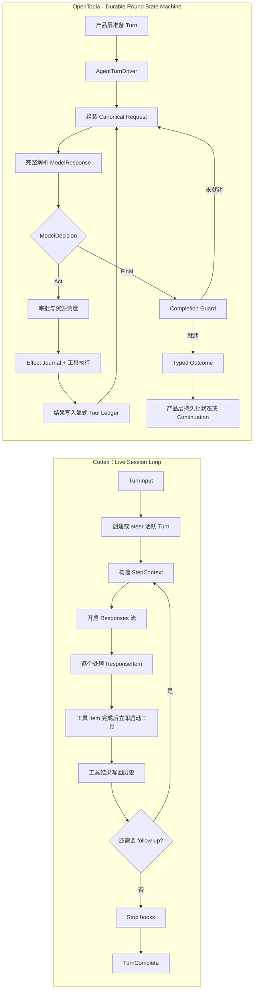

最重要的一条线是：

> Codex 的核心处理单位是流中的 `ResponseItem`；OpenTopia 的核心处理单位更接近完整的 `ModelResponse + Round State`。

## 3. Codex Agent Loop

### 3.1 Turn 如何开始

入口在：

- [turn_input.rs](../../OpenAI/codex/codex-rs/core/src/session/turn_input.rs)
- [regular.rs](../../OpenAI/codex/codex-rs/core/src/tasks/regular.rs)

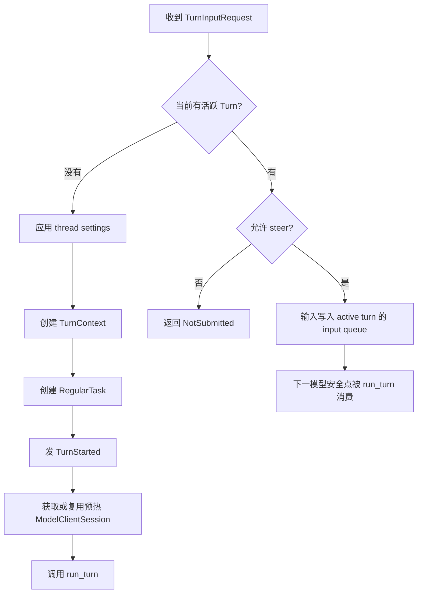

关键代码：

- `turn_input.rs:141-249`：决定 Start、Steer 或拒绝。
- `turn_input.rs:478-564`：把 steer 放入活跃 Turn 的 input queue。
- `regular.rs:39-90`：发 TurnStarted、复用预热 session、调用 `run_turn`。

`RegularTask` 外面还有一层小循环：如果 `run_turn` 返回时 input queue 又出现了新输入，它会再次运行 `run_turn`，而不是立刻结束整个 Task。

### 3.2 Codex 的主循环

主循环在 [turn.rs](../../OpenAI/codex/codex-rs/core/src/session/turn.rs) 的 `run_turn`。

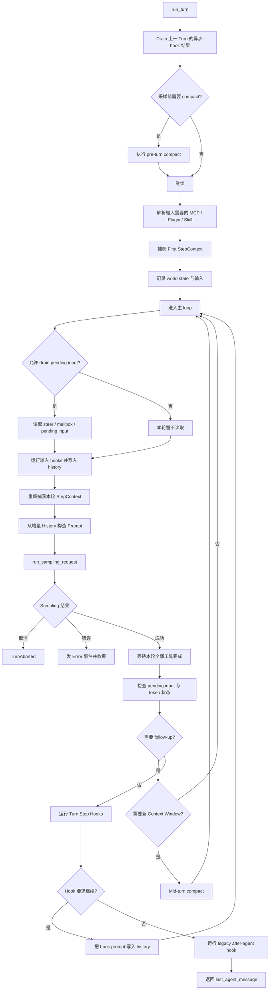

### 3.3 Sampling 流和工具为什么能重叠

Codex 的低延迟优势主要来自这里。

入口仍在 [turn.rs](../../OpenAI/codex/codex-rs/core/src/session/turn.rs) 的 sampling 处理部分。

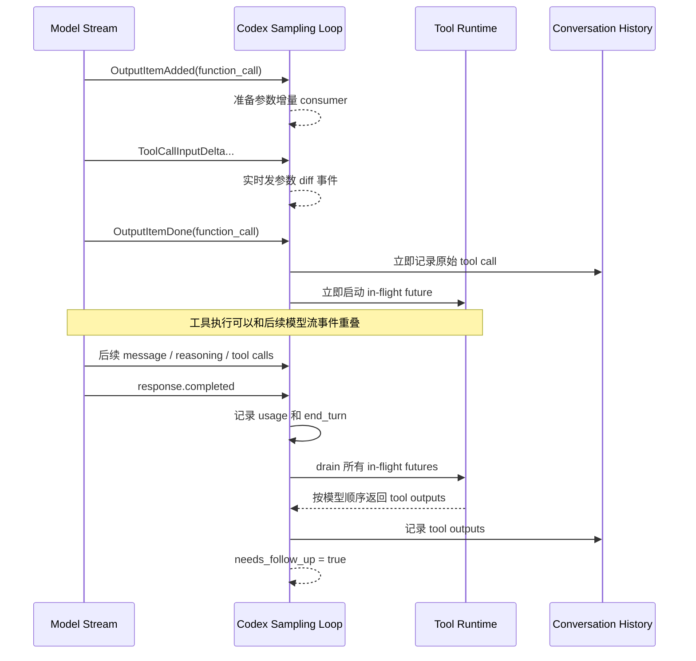

关键点：

1. `OutputItemDone` 一出现就调用 `handle_output_item_done`。
2. 如果它是 tool call，就立刻生成一个 future，放进 `FuturesOrdered`。
3. 模型流仍可继续产生其他 item。
4. 收到 `response.completed` 后，Codex 才统一等待尚未完成的工具。
5. `FuturesOrdered` 保证工具结果仍按模型调用顺序进入历史。

所以 Codex 并不是：

> 等模型完整响应 → 再一次性执行全部工具。

而是：

> 模型流里哪个工具 item 先完成，就尽快让它开始执行。

### 3.4 Codex 的工具执行路径

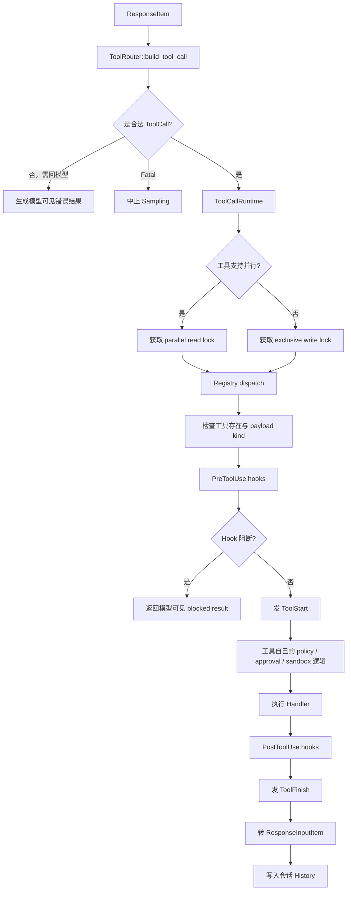

代码位置：

- `stream_events_utils.rs:288-389`：把 response item 变成 tool future。
- `tools/parallel.rs:41-223`：并行锁、取消和 aborted result。
- `tools/registry.rs:481-760`：工具注册表、pre/post hooks 与 handler 调度。
- `tools/handlers/request_user_input.rs:71-97`：用户输入直接在当前 tool future 内等待。

Codex 的并行规则相对简单：

- 支持并行的工具共享读锁；
- 不支持并行的工具获取写锁；
- 写锁会等待当前并行工具完成，并阻止其他工具同时执行。

它没有在这一层建立 OpenTopia 那种通用的 `resource_keys + read/write conflict` 调度模型。

### 3.5 Codex 的上下文压缩

Codex 有两个主要压缩位置：

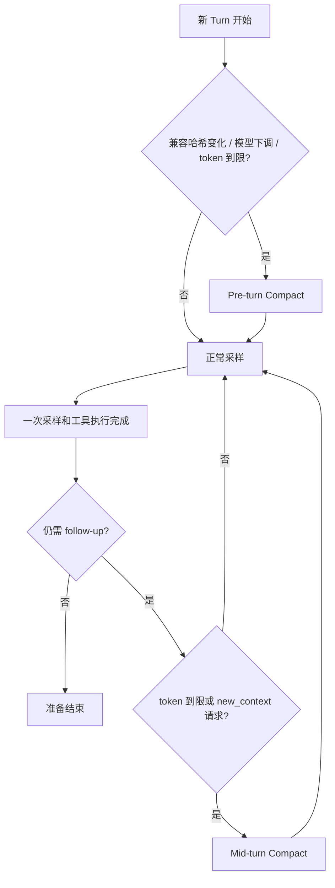

可选择的 compactor 包括：

- Token Budget compactor；
- Remote Compaction V2；
- Remote Compaction V1；
- Local compactor。

对应代码：`session/turn.rs:994-1239`。

### 3.6 Codex 什么时候认为 Turn 完成

主要条件是：

1. 模型没有产生需要 follow-up 的工具调用；
2. provider 没有返回 `end_turn=false`；
3. 没有新的 pending input 或 mailbox 输入；
4. stop hook 没有要求继续；
5. 没有取消或致命错误。

Codex 的普通 `run_turn` 主循环里没有显式的模型轮数计数器或 270 轮这样的硬上限。它主要依赖：

- token/context 限制；
- 取消；
- hooks；
- 外部 budget 状态；
- 模型最终停止请求工具。

## 4. OpenTopia Agent Loop

### 4.1 产品层和 Kernel 的边界

OpenTopia 没有让 HTTP、SSE、数据库代码直接拥有第二套模型/工具循环。

边界定义在：

- [agent_runtime.rs](../crates/opentopia-core/src/agent_runtime.rs)
- [turn_execution.rs](../crates/opentopia-server/src/agent_turn_coordinator/turn_execution.rs)

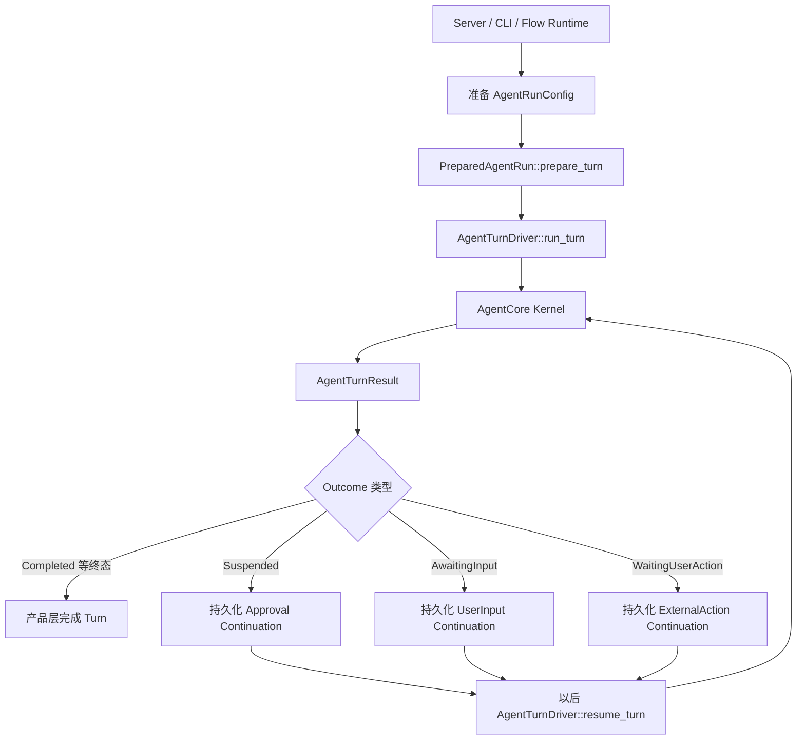

这个边界的含义是：

- Agent Kernel 负责模型、工具、上下文和控制决策；
- 产品层负责 Turn 生命周期、SSE、数据库和 continuation 持久化；
- Root Agent 和子 Agent 都走同一套 `AgentTurnDriver`；
- 暂停后不要求原来的 future 一直活着。

### 4.2 OpenTopia 的主循环

入口和循环分别在：

- [turn_entry.rs](../crates/opentopia-core/src/agent/turn_entry.rs)
- [provider_turn_loop.rs](../crates/opentopia-core/src/agent/provider_turn_loop.rs)
- [provider_round.rs](../crates/opentopia-core/src/agent/provider_round.rs)

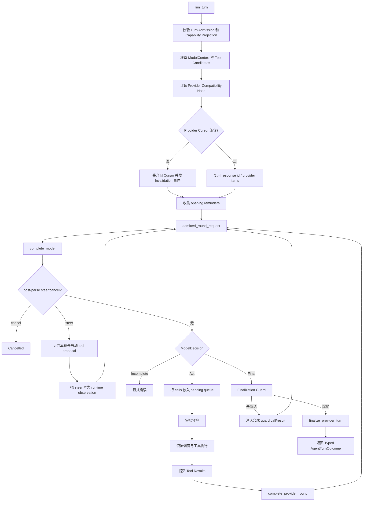

### 4.3 OpenTopia 为什么等完整 ModelResponse

`complete_model` 会实时发送文本、reasoning、usage 和 provider transport 事件，但它的控制流通常要等 `ModelResponse` 完整解析后才继续。

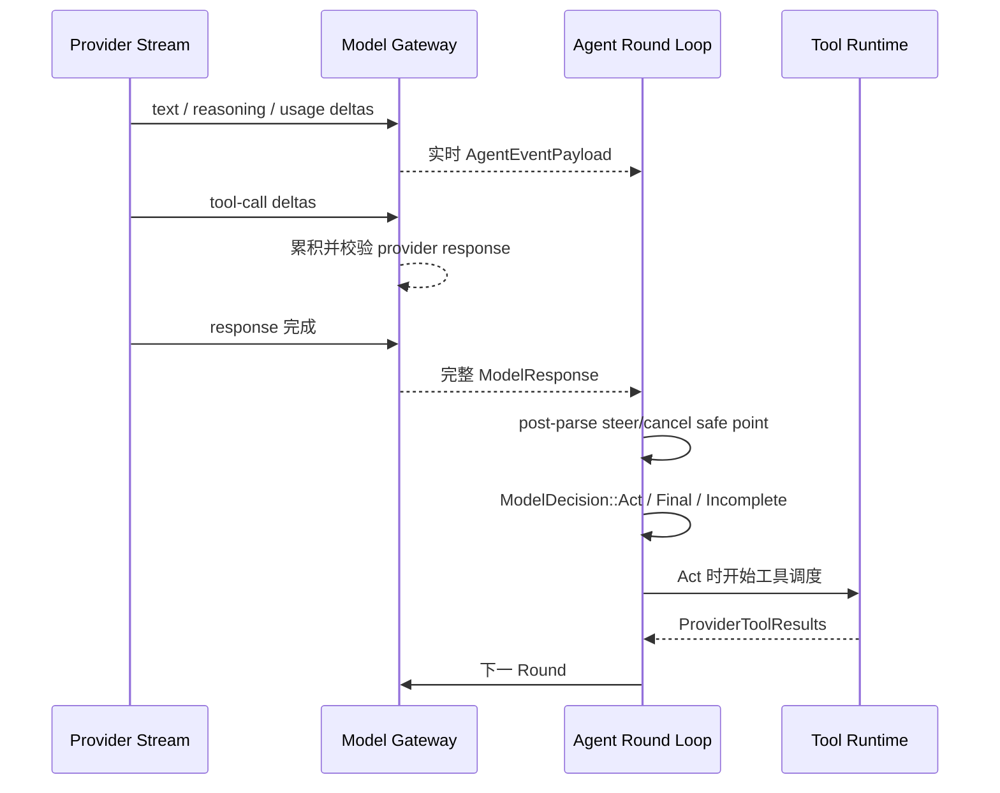

这让 OpenTopia 更容易做到：

- 在工具开始前统一消费 steer；
- 丢弃未启动的 tool proposal；
- 对整批 tool calls 做审批和资源冲突分析；
- 保证工具结果和 durable events 按 provider 顺序提交。

代价是工具启动时间晚于 Codex。

### 4.4 OpenTopia 的工具调度

工具调度核心在 [tool_runtime.rs](../crates/opentopia-core/src/tool_runtime.rs)。

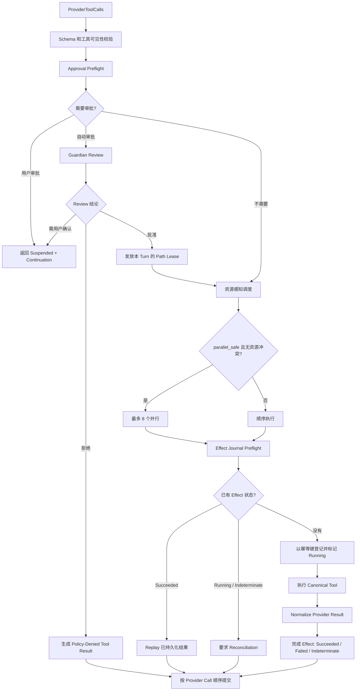

#### 与 Codex 并行模型的区别

OpenTopia 不是只问“这个工具支不支持并行”，还会问：

- 它是否已经获得授权；
- `parallel_safe` 是否为真；
- 它读写哪些 `resource_keys`；
- 两个工具是否读写同一资源；
- 当前批次是否超过 8 个工具。

例如：

- 两个只读、不同资源的工具可以并行；
- 一个写工作区、一个读同一工作区的工具需要避免并行；
- 需要审批的工具不会混进“已授权并行批次”。

#### Effect Journal 的作用

每个可能产生副作用的工具调用会形成一个 `EffectIntent`，包含：

- thread/turn/agent path；
- tool operation；
- 输入哈希；
- side-effect class；
- 是否幂等；
- 幂等键。

如果 Runtime 重启或重复收到同一个逻辑调用：

- 已成功：直接 replay 结果，不重复执行；
- 仍是 Running：要求人工或 Runtime reconciliation；
- 非幂等操作结果不确定：标记 Indeterminate，不自动重试；
- 可安全执行：登记 Running 后再执行。

这是 OpenTopia 相比 Codex 普通 Tool Runtime 最明显的可靠性增强。

### 4.5 OpenTopia 的暂停与恢复

OpenTopia 有三种显式恢复信号：

```rust
pub enum AgentResumeSignal {
    Approval { ... },
    UserInput { ... },
    ExternalAction { ... },
}
```

Continuation 会保存：

- thread、turn、invocation identity；
- workspace root；
- permission mode；
- execution authority；
- context summary 和 conversation；
- model context；
- context/rollout budget；
- tool candidates；
- provider tool calls/results/pending calls；
- provider response items；
- runtime state；
- compatibility hash；
- collaboration mode 和 goal。

恢复时不会简单相信当前设置，而会校验：

- workspace 是否一致；
- permission/sandbox/capability projection 是否仍匹配；
- Turn identity 是否一致；
- Provider 和 Runtime Snapshot 是否一致；
- Tool catalog 是否变化；如果变化则刷新候选工具和兼容哈希。

这使暂停可以跨进程和较长时间存在，但 continuation 结构也比 Codex 的 in-process wait 更重。

### 4.6 OpenTopia 的上下文压缩

OpenTopia 让每个 Round 都经过同一个 pressure boundary：

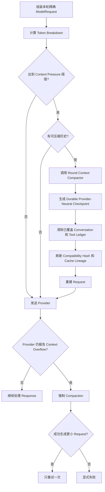

与 Codex 的区别：

- Codex 支持本地或远程 compaction，并把它集成到 live Session history 中；
- OpenTopia 强调 provider-neutral durable checkpoint；
- OpenTopia checkpoint 后开启新的 provider request epoch，不允许旧 cursor 穿过这个边界；
- Provider 真正拒绝 context window 时，OpenTopia 会强制压缩并只重试一次。

### 4.7 OpenTopia 的 Completion Guard

OpenTopia 不把模型的 Final 直接等价为“任务真的完成”。

Runtime 还会检查：

- 是否有 pending tool calls；
- 是否有 pending approvals；
- Work Form 是否还有未完成的强约束项；
- 是否有活跃子 Agent；
- 是否有尚未投递的 Agent mailbox message；
- 其他 Completion Registry 信号。

后台命令仍在运行通常只是 advisory，不一定阻止当前 Turn 结束，因为它的最终结果可以通过 durable completion sink 以后投递。

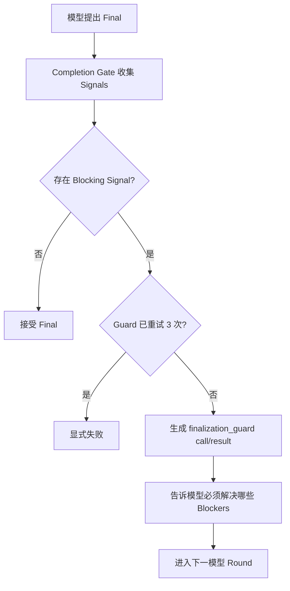

所以 OpenTopia 的完成语义是：

> 模型说完成，并且 Runtime 证明允许完成。

### 4.8 OpenTopia 的长回合保护

OpenTopia 有明确的确定性上限：

- 第 90 轮：注入一次 self-review checkpoint observation；
- 第 180 轮：再注入一次；
- 第 270 轮：硬停止；
- rollout token budget 用完：停止；
- 连续 3 轮无效 tool call 或无效 arguments JSON：熔断；
- finalization guard 最多干预 3 次。

这些规则避免模型无期限循环，但也需要谨慎调参，防止正常的超长任务被过早终止。

## 5. 逐项差异表

| 维度 | Codex | OpenTopia | 实际影响 |
| --- | --- | --- | --- |
| 核心循环单位 | 流式 `ResponseItem` | 完整 `ModelResponse` 和显式 Round State | Codex 更低延迟；OpenTopia 更容易做整轮一致性检查 |
| 循环所有者 | 活跃 `Session + RegularTask` | `AgentTurnDriver + AgentCore`，产品层持久化 | OpenTopia 的 Kernel 更容易复用到 Root、Child、Flow |
| Provider 抽象 | Responses item/event 语义很深入 | `CanonicalModelRequest / ModelResponse` provider-neutral 抽象 | OpenTopia 更易支持多 Provider；Codex 更能利用 Responses 原生能力 |
| 工具启动时间 | Tool item done 后立即启动 | 通常等完整 ModelResponse 后启动 | Codex 工具延迟更低 |
| 流与工具重叠 | 支持 | 当前主路径不重叠 | Codex 对慢模型或慢工具更有性能优势 |
| 并行工具 | `supports_parallel + RwLock` | 最多 8 个，resource keys、读写冲突、授权状态共同决定 | OpenTopia 调度更精细 |
| 工具结果顺序 | `FuturesOrdered` | `join_all` 后按 provider call 顺序提交 | 两者都保证模型观察顺序稳定 |
| 通用副作用日志 | 主循环里没有同等级通用 Effect Journal | 有 EffectIntent、幂等键、Replay、Indeterminate、Reconciliation | OpenTopia 更适合真实业务写操作 |
| 审批等待 | 多数在活跃 tool future 中等待 | 返回 `Suspended + Continuation` 并落盘 | Codex 简单直接；OpenTopia 可跨进程恢复 |
| 用户输入 | `request_user_input` 在 Session 内 await | `AwaitingInput + Continuation` | 同上 |
| 外部人工动作 | 依赖具体工具/产品交互 | 一等 `WaitingUserAction` 状态 | OpenTopia 更适合浏览器登录、线下确认、effect reconciliation |
| Steer | input queue，在 sampling 之间消费；部分事件后可提前结束流 | response 完整解析后的 safe point；丢弃未启动 calls | Codex 更即时；OpenTopia 更强调“副作用尚未开始”保证 |
| 工具目录刷新 | 每个 sampling 捕获新的 StepContext/ToolRouter | Turn 开始准备，tool search 可增量 reveal；resume 时刷新 | Codex 对动态 MCP 环境更敏感 |
| 上下文压缩 | Pre-turn + Mid-turn；local/remote/token-budget 多实现 | 每 Round pressure gate；durable provider-neutral checkpoint | 两者目标不同，OpenTopia 更强调可恢复 epoch |
| Provider overflow | 当前主循环中通常成为 Turn error；另有普通 stream retry | 强制 checkpoint 后只重试一次 | OpenTopia 对估算偏差更有恢复能力 |
| 最终完成 | 无 follow-up + 无 pending input + hooks 通过 | Model Final + Completion Guard 通过 | OpenTopia 的完成条件更严格 |
| Round 硬上限 | `run_turn` 内无显式 round counter | 270 轮硬上限，90/180 轮提醒 | OpenTopia 更确定，Codex 更开放 |
| 重复无效调用熔断 | 主要靠模型、错误结果和外部控制 | 连续 3 轮无效调用/JSON 熔断 | OpenTopia 更能阻止 provider 兼容性死循环 |
| 后台任务完成 | 工具可返回 session/process，后续需工具或 mailbox 机制继续观察 | Durable sink 主动写 Turn Inbox/ledger | OpenTopia 明确减少模型轮询 |
| 终态类型 | 主要是完成、错误或中断 lifecycle | Completed/Partial/Blocked/Stopped/Cancelled/Suspended/AwaitingInput/WaitingAction | OpenTopia 产品状态表达更丰富 |

## 6. 为什么 Codex 会更快

假设模型一次返回两个工具：

- Tool A 需要 8 秒；
- Tool B 需要 5 秒；
- 模型从 Tool A item 完成到整个 response 完成还需要 2 秒。

Codex 可以在第一个 Tool A item 完成后就启动 A。模型继续输出的 2 秒和 A 的前 2 秒重叠。

OpenTopia 当前主路径通常先等整个 response 完成，再分析审批、资源冲突和 Effect Journal，之后才启动工具。

粗略时序：

```mermaid
gantt
    title 同一模型响应中的工具启动时序
    dateFormat X
    axisFormat %s

    section Codex
    模型继续输出       :0, 2
    Tool A             :0, 8
    Tool B             :1, 6

    section OpenTopia
    等模型完整响应     :0, 2
    Tool A             :2, 10
    Tool B             :2, 7
```

这不表示 Codex 永远更快，因为审批、工具串行限制和 Provider 行为都会影响结果；但在“一个 response 内产生多个可并行工具”的场景里，Codex 的架构拥有更早的启动点。

## 7. 为什么 OpenTopia 会更稳

OpenTopia 多出来的复杂度主要在保护以下情况：

### 情况一：付款工具执行后进程崩溃

没有 Effect Journal 时，恢复后很难知道：

- 付款没有发出；
- 已经成功；
- 请求发出但结果丢失。

OpenTopia 会将非幂等副作用标记为 Running 或 Indeterminate，要求 reconciliation，而不是自动重试。

### 情况二：等待审批期间服务重启

Codex 的普通工具审批更依赖活跃 future。OpenTopia 把 pending calls、权限、上下文、工具结果和身份全部放进 continuation，因此重启后能重新验证并恢复同一个逻辑 Turn。

### 情况三：模型说“完成”，但子 Agent 还在运行

OpenTopia Completion Guard 会拒绝 Final，并把未完成状态作为模型可见 observation 注入下一轮。

### 情况四：Provider 连续产生同一个非法工具调用

OpenTopia 连续 3 轮后熔断，避免浪费数十轮 token。

## 8. 对 OpenTopia 的改进建议

### P0：保留 OpenTopia 已有的可靠性边界

不建议为了模仿 Codex 而移除：

- `AgentTurnDriver`；
- typed continuation；
- Effect Journal；
- resource-aware scheduler；
- Completion Guard；
- provider-neutral checkpoint。

这些正是 OpenTopia 面向真实业务流程、Flow 和多 Agent 场景的核心优势。

### P1：研究“验证后的 item-level early dispatch”

可以借鉴 Codex 的低延迟路径，但不能直接在收到任意 tool-call delta 时执行。

较安全的方案是：

1. Provider Adapter 产生一个“完整且已校验的 ToolCallReady item”；
2. Tool Runtime 完成 schema、authorization、effect preflight；
3. 只有已授权、幂等或无副作用、资源独立的调用允许 early dispatch；
4. 有副作用、需要审批或可能与 steer 冲突的调用仍等 response commit；
5. 工具事件和结果继续按 provider call 顺序提交。

这样可以获得一部分 Codex 延迟优势，又不破坏 OpenTopia 的一致性保证。

### P1：把 `provider_turn_loop.rs` 进一步状态机化

[provider_turn_loop.rs](../crates/opentopia-core/src/agent/provider_turn_loop.rs) 已超过 1,000 行，并同时处理：

- pending queue；
- 并行结果归并；
- 用户审批；
- Guardian 审批；
- browser handoff；
- user input；
- reconciliation；
- continuation 构造；
- Round 推进。

建议按真实职责拆成：

- `PendingToolQueue`：工具顺序和并行结果归并；
- `ApprovalCoordinator`：用户与 Guardian 审批；
- `TurnSuspensionBuilder`：统一构造 continuation；
- `ProviderRoundDriver`：只保留状态转移；
- `ToolExecutionCoordinator`：连接 scheduler 和 Tool Runtime。

这不是为了减少文件行数而拆文件，而是为了让每个模块拥有一个明确不变量。

### P2：借鉴 Codex 的 request-scoped StepContext

OpenTopia 当前工具候选主要在 Turn 开始准备，在 tool search 和 resume 时刷新。可以考虑把以下易变化部分收敛成每 Round 的不可变快照：

- 当前可见工具；
- MCP/Plugin 连接状态；
- Provider capabilities；
- Environment/Workspace projection；
- permission/sandbox leases；
- prompt cache lineage。

这样能减少“构造 prompt 时的工具目录”和“实际执行时工具目录”不一致的可能性。

### P2：把 Provider Stream Parser 与 Round Policy 完全分离

Codex 将 `ResponseEvent` 消费、turn item 生命周期和工具 future 分成多个清晰层次。OpenTopia 可以继续强化：

- Provider Adapter 只负责协议解析；
- Stream Projector 只负责实时 UI/telemetry 事件；
- Round Policy 只处理 Act/Final/Incomplete；
- Tool Scheduler 只处理授权、资源和执行时序。

这样以后增加 early dispatch 时，不会把 Provider 协议细节重新泄漏进主循环。

## 9. 不建议从 Codex 直接照搬的部分

### 不要把所有审批改成 in-process await

这会削弱 OpenTopia 的跨进程恢复能力，也会让 Flow、子 Agent 和长期业务任务更依赖单个服务进程存活。

### 不要删除 Effect Journal 来换取更小延迟

对于只读编码工具可能问题不大；对于付款、发邮件、数据库写入、浏览器提交和外部 API mutation，重复副作用比几百毫秒延迟严重得多。

### 不要取消所有确定性上限

Codex 更依赖产品 budget、token window 和用户中断。OpenTopia 面向后台自动化时需要明确上限，否则一个无人值守 Flow 可能无限消耗资源。

## 10. 建议阅读顺序

如果要继续深入源码，建议按下面顺序阅读。

### Codex

1. [turn_input.rs](../../OpenAI/codex/codex-rs/core/src/session/turn_input.rs)：Turn 的 Start/Steer 入口
2. [regular.rs](../../OpenAI/codex/codex-rs/core/src/tasks/regular.rs)：普通 Turn Task 包装层
3. [turn.rs](../../OpenAI/codex/codex-rs/core/src/session/turn.rs)：`run_turn`、sampling 与 compaction 主体
4. [stream_events_utils.rs](../../OpenAI/codex/codex-rs/core/src/stream_events_utils.rs)：Response Item 到工具 future
5. [parallel.rs](../../OpenAI/codex/codex-rs/core/src/tools/parallel.rs)：工具并发和互斥
6. [registry.rs](../../OpenAI/codex/codex-rs/core/src/tools/registry.rs)：工具注册、hooks 和 dispatch
7. [request_user_input.rs](../../OpenAI/codex/codex-rs/core/src/tools/handlers/request_user_input.rs)：活跃 future 内等待用户输入

### OpenTopia

1. [agent_runtime.rs](../crates/opentopia-core/src/agent_runtime.rs)
2. [turn_entry.rs](../crates/opentopia-core/src/agent/turn_entry.rs)
3. [provider_turn_loop.rs](../crates/opentopia-core/src/agent/provider_turn_loop.rs)
4. [provider_round.rs](../crates/opentopia-core/src/agent/provider_round.rs)
5. [tool_disclosure.rs](../crates/opentopia-core/src/agent/tool_disclosure.rs)
6. [tool_scheduler.rs](../crates/opentopia-core/src/agent/tool_scheduler.rs)
7. [tool_runtime.rs](../crates/opentopia-core/src/tool_runtime.rs)
8. [context_pressure.rs](../crates/opentopia-core/src/agent/context_pressure.rs)
9. [completion_guard.rs](../crates/opentopia-core/src/agent/completion_guard.rs)
10. [turn_control.rs](../crates/opentopia-core/src/agent/turn_control.rs)

## 11. 最终判断

Codex 的 Agent Loop 更像一个为交互式编码优化的高性能 Live Runtime：

- item-level streaming；
- 工具尽早启动；
- Session 内状态连续；
- 动态环境每轮刷新；
- UI 与工具生命周期高度流式化。

OpenTopia 的 Agent Loop 更像一个为真实业务副作用、Flow、多 Agent 和长期恢复优化的 Durable Runtime：

- Provider-neutral Round；
- 显式 continuation；
- Effect Journal；
- 资源感知工具调度；
- Completion Guard；
- Durable context checkpoint；
- 明确的长回合与错误熔断。

因此，不建议把 OpenTopia 整体改成 Codex 的循环。更合适的方向是：

> 保留 OpenTopia 的 durable control plane，只从 Codex 借鉴经过严格验证的 item-level early dispatch 和更清晰的流式事件分层。
