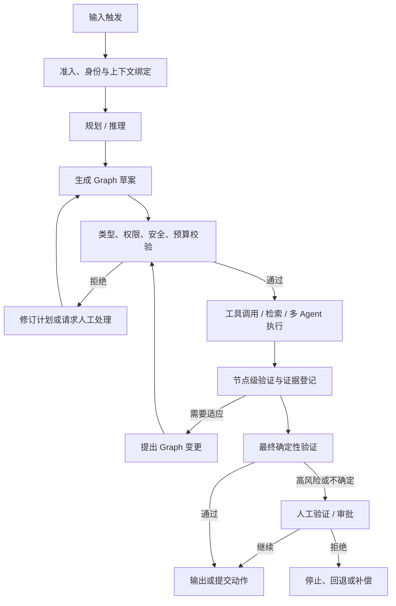
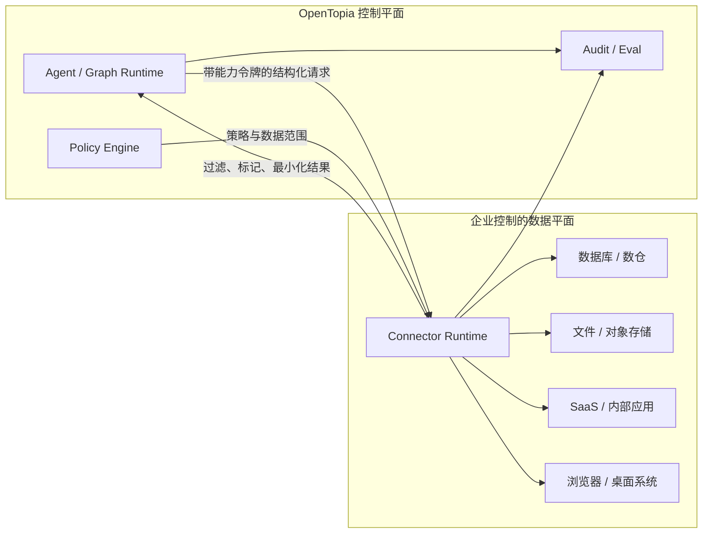
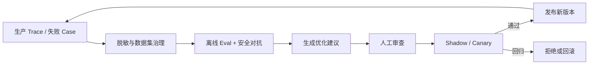

# OpenTopia 企业 Agent 平台设计

> 文档状态：设计草案 0.1  
> 日期：2026-08-02  
> 适用分支：`enterprise/agent-platform`  
> 适用范围：企业 Agent 身份、模型生成 Graph、多智能体自适应编排、权限与数据安全、审计、评测与人工协同  
> 与现有设计的关系：本设计是 `docs/multi-agent-architecture-analysis.md` 的企业侧演进方案，不替换当前本地 Coding Agent 路径。

## 1. 结论先行

OpenTopia 企业 Agent 平台采用以下总体架构：

> **目标驱动的模型编排 + 模型生成且版本化的执行 Graph + 确定性的权限与安全 Runtime + 企业控制的数据平面 + 全链路审计、评测与人工审批。**

平台不要求业务人员先画出一张固定流程图，也不允许模型绕过系统约束自由执行。主 Agent 根据目标、当前上下文、可用 Agent 模板和能力目录提出 Graph；确定性 Runtime 对 Graph 做类型、权限、数据流、预算和风险校验；只有通过校验或审批的 Graph 才能执行。

整个系统分为三个职责平面：

1. **智能决策平面**：理解目标、规划、拆分任务、选择 Agent、生成或调整 Graph、综合结果。
2. **控制平面**：身份、授权、策略、审批、调度、状态机、预算、审计、验证和版本管理。
3. **企业数据平面**：由企业控制的 Connector、数据库代理、文件挂载、私有 MCP、浏览器或桌面执行环境。

其中，模型可以决定“应该做什么”和“下一步是什么”，但不能决定“自己是否有权做”“安全检查是否可以跳过”或“审计记录是否需要保留”。

## 2. 背景与问题定义

传统 RPA 和低代码工作流以固定步骤为中心：人预先定义节点、条件和连线，系统按图执行。这适合稳定、确定、重复的流程，但面对开放式任务、缺失信息、异常分支和跨系统调查时，维护成本会快速增加。

纯 Agent 方案走向另一个极端：模型在每轮根据上下文临时决定工具和步骤。它具有适应性，但企业无法仅靠提示词回答以下问题：

- 当前执行者是谁，继承了谁的权限；
- 它可以访问哪些数据、工具、目录、数据库和网络目标；
- 为什么创建了某个子 Agent，为什么选择某条执行路径；
- 哪些结论来自证据，哪些只是推断；
- 哪个动作会造成副作用，谁批准了该动作；
- 失败后如何恢复，变更后如何回归，事故后如何审计。

本设计在两者之间建立清晰边界：**Graph 不是人类事先写死的业务剧本，而是 Agent 在运行中生成的、可检查和可恢复的执行计划。** Graph 为企业提供确定性控制面，模型仍保留规划和适应能力。

## 3. 目标与非目标

### 3.1 目标

- Agent 拥有稳定身份、模板、能力边界、数据边界和持久状态。
- 同一模板可以实例化为多个隔离的 Agent，每个实例拥有独立运行身份和上下文。
- 主 Agent 可以通过结构化工具创建、验证、发布和调整执行 Graph。
- 每个业务 Agent 节点具有明确输入、输出、权限、预算和验证契约。
- 系统支持并行、分支、重试、回退、人工审批、暂停、恢复和补偿。
- 权限在每次读取、写入和工具执行时由 Runtime 强制执行，而不是由模型自觉遵守。
- 企业数据默认留在企业控制的数据平面；所有出站数据经过策略判定和防泄漏检查。
- 每一个重要结论可以关联证据、验证结果和确定性边界。
- 平台内置离线评测、轨迹评分、回归门禁、灰度发布和优化建议。

### 3.2 非目标

- 不以人工拖拽画布作为核心编排入口。
- 不要求企业把内部系统暴露成公网 API。
- 不用提示词代替身份认证、文件系统隔离、数据库授权或网络策略。
- 不承诺彻底消除模型幻觉；目标是发现、标注、约束并阻止不确定结论驱动高风险动作。
- 不允许 Agent 未经评测和审批自动修改生产权限、策略、模板或核心提示词。
- 不把“子 Agent 越多”视为能力更强；单 Agent 能可靠完成时不应强行拆分。
- 不在第一阶段实现任意循环和无限动态图；所有循环必须有次数、成本、时间和终止条件。

## 4. 设计原则

1. **模型负责决策，Runtime 负责边界。** 模型可以提出行动，Runtime 决定行动是否被允许。
2. **默认拒绝，最小授权。** 未声明的工具、数据、目录、网络目标和输出通道一律不可用。
3. **身份与能力分离。** Agent 的名称和职责不自动带来权限；能力必须由显式授权产生。
4. **计划与事实分离。** Graph 表示计划，事件日志表示已发生事实，两者不能混为一体。
5. **生成与执行分离。** 创建 Graph 的工具只生成草案；校验、审批和发布后才能执行。
6. **结构化交接。** 节点之间使用带 schema 的输入输出，避免把任意自然语言直接传播到高权限节点。
7. **证据优先。** 重要结论必须携带来源、时间、数据范围和验证状态。
8. **安全失败。** 权限服务、策略服务、数据分类或审计不可用时，高风险动作停止而不是降级放行。
9. **不可变版本。** 已发布模板和 Graph 不原地修改；变更产生新版本，运行实例固定引用具体版本。
10. **企业控制数据面。** OpenTopia 提供连接协议和运行时，企业决定数据源部署位置、凭证、访问策略与保留周期。

## 5. 从输入到输出的完整生命周期



| 阶段 | 模型职责 | Runtime 职责 | 主要产物 |
| --- | --- | --- | --- |
| 输入触发 | 理解用户目标 | 校验租户、用户、触发器和请求完整性 | `TaskRequest` |
| 准入 | 提取业务意图 | 绑定身份、策略版本、数据域和风险等级 | `ExecutionContext` |
| 规划 / 推理 | 判断是否需要拆分、检索或协作 | 提供可用 Agent、工具和数据能力目录 | `PlanIntent` |
| Graph 生成 | 创建节点、边和条件 | 构建草案、做 schema 与静态策略检查 | `GraphDraft` |
| 执行 | 调用 Agent 和工具、处理异常 | 调度、授权、隔离、记录、暂停和恢复 | `GraphRun`、`NodeRun` |
| 验证 | 解释结果、补充证据 | 执行确定性断言、交叉验证和风险门禁 | `VerificationReport` |
| 输出 | 综合可用结果 | 输出 DLP、审批和目的地策略检查 | `FinalArtifact` |
| 人工验证 | 解释待审事项 | 冻结状态、展示证据、记录决定、续跑 | `ApprovalDecision` |

任何阶段都可以进入 `blocked`、`cancelled` 或 `failed`。需要人工处理时必须保存可恢复状态，人工决定后继续同一个运行实例，不能重新伪造一条无关联的新执行链。

## 6. 核心领域模型

### 6.1 AgentTemplate

`AgentTemplate` 是可复用的 Agent 定义，不是正在运行的 Agent。它描述职责和允许申请的最大能力范围。

| 字段 | 含义 |
| --- | --- |
| `template_id` / `version` | 模板稳定标识与不可变版本 |
| `name` / `description` | 面向用户和主 Agent 的名称与路由描述 |
| `instructions` | 职责、行为边界、完成条件和升级条件 |
| `skills` | 可加载 Skill 的允许集合 |
| `tool_policy` | 可见工具及每个工具的最大操作集合 |
| `data_policy` | 可申请的数据源、库、表、字段和用途 |
| `filesystem_policy` | 可访问根目录及 `read`、`write`、`execute` 权限 |
| `network_policy` | 域名、地址、协议、端口和出站数据等级 |
| `model_policy` | 可用模型类别、推理强度、数据处理位置约束 |
| `state_schema` | Agent 持久状态的 schema、保留期和加密要求 |
| `input_schema` / `output_schema` | 节点结构化输入输出契约 |
| `budget` | Token、费用、时间、工具调用和子 Agent 上限 |
| `risk_class` | 模板允许承担的最高风险等级 |
| `owner` / `reviewers` | 业务负责人和审批责任人 |

### 6.2 AgentIdentity

身份回答“谁正在行动”，权限回答“它能做什么”。两者必须分开。

```text
Tenant
└── Human User / Service Principal
    └── Root Agent Run Identity
        ├── Node Agent Identity: research
        ├── Node Agent Identity: finance_check
        └── Node Agent Identity: final_verifier
```

每个运行身份至少包含：

- `tenant_id`、`principal_id`、`agent_instance_id`；
- 来源模板和版本；
- 父身份、根任务和 Graph Run；
- 委派链和当前能力令牌；
- 创建时间、过期时间和撤销状态；
- 当前安全域、数据域和执行环境；
- 发起者、代表谁行动以及行动目的。

子 Agent 获得的有效权限是以下集合的交集，而不是并集：

```text
effective_grant =
  tenant_policy
  ∩ initiating_principal_grant
  ∩ parent_agent_grant
  ∩ agent_template_ceiling
  ∩ graph_node_grant
  ∩ runtime_risk_policy
```

因此主 Agent 无法把自己没有的权限委派给子 Agent，低权限模板也不能因为被高权限主 Agent 调用而自动提升。

### 6.3 AgentInstance

模板实例化后形成 `AgentInstance`。同一模板可以创建多个实例，但实例之间默认隔离：

- 独立上下文和消息历史；
- 独立短期状态和检查点；
- 独立能力令牌和预算；
- 独立工作目录或数据库会话；
- 通过明确的边和结构化消息通信；
- 不默认共享秘密、原始检索结果或可写工作区。

### 6.4 GraphDefinition 与 GraphRun

- `GraphDefinition`：不可变、可复用、已经通过校验的 Graph 版本。
- `GraphDraft`：主 Agent 正在构建、尚不可执行的草案。
- `GraphRun`：一次具体执行，固定引用 Graph、模板、策略和连接器版本。
- `NodeRun`：节点的一次尝试，包含输入、输出、权限、预算、证据和终态。
- `GraphPatch`：运行中提出的增量变更，只能影响尚未开始的未来路径。

## 7. Agent 模板示例

以下 YAML 只表达逻辑模型，最终机器契约应使用带版本的 JSON Schema：

```yaml
schemaVersion: opentopia.agent/v1
metadata:
  id: finance-reviewer
  version: 3
  owner: finance-platform
spec:
  description: 核对财务数据并输出带证据的异常清单
  instructions: |
    只使用绑定到本次任务的数据源。
    发现字段冲突、数据缺失或时间范围不一致时必须标记 unknown。
    不得提交付款、修改账目或导出原始客户记录。
  skills:
    allow: [financial-analysis, spreadsheet-review]
  tools:
    allow:
      - name: sql.query
        actions: [read]
      - name: artifact.write
        actions: [create]
  data:
    allow:
      - source: finance-warehouse
        resources: [ledger_view, invoice_view]
        columns: [invoice_id, amount, currency, status, booked_at]
        purpose: invoice-reconciliation
    denyExportAbove: confidential
  filesystem:
    roots:
      - path: /workspace/reports
        actions: [read, write]
  network:
    default: deny
  output:
    schema: finance_anomaly_report/v2
    requireEvidence: true
  budget:
    maxTurns: 20
    maxToolCalls: 40
    maxDurationSeconds: 900
  riskClass: medium
```

模板中引用的是秘密句柄和数据绑定名称，不保存明文凭证。模板发布必须经过 schema 校验、权限差异检查和所有者审批。

## 8. 权限控制模型

### 8.1 策略判定

每次受控动作统一转换为以下判定请求：

```text
Authorize(
  subject,      // 用户、服务身份、Agent、委派链
  action,       // read、query、write、execute、export、publish...
  resource,     // 数据、工具、文件、目录、Graph、连接器、输出通道
  context,      // 租户、任务、时间、位置、风险、数据等级
  purpose       // 此次访问的业务目的
) -> allow | deny | require_approval
```

平台组合 RBAC 与 ABAC：

- RBAC 管理组织、团队、岗位和项目级基础授权；
- ABAC 根据数据等级、用途、时间、网络、设备、任务风险和 Agent 模板进一步收窄；
- 资源本身的 ACL、行列权限和数据源原生权限继续生效；
- 冲突时 `deny` 优先，其次是 `require_approval`，最后才是 `allow`。

### 8.2 强制执行点

权限不能只在 Graph 发布时检查。至少在以下时刻重新判定：

1. Agent 实例创建时；
2. Graph 节点入队时；
3. 工具调用参数形成后、执行前；
4. 数据源返回结果后、进入模型上下文前；
5. 节点输出流向下一安全域前；
6. 最终结果导出、发送或产生副作用前；
7. 长时间暂停后的续跑时。

这样可以防止策略变更、凭证撤销、参数替换和检查后使用之间的时间差导致越权。

### 8.3 能力令牌

Runtime 为每个 `NodeRun` 签发短期、窄范围、可撤销的能力令牌。令牌绑定：

- Graph Run 和 Node Run；
- 允许的动作和资源；
- 数据用途和最高数据等级；
- 有效期、调用次数或查询行数；
- 允许的输出目的地；
- 策略版本和审批记录。

工具只接受能力令牌，不接受“Agent 自己声称有权限”。高风险工具还需校验幂等键和审批快照。

### 8.4 资源维度

| 资源 | 最小授权粒度 |
| --- | --- |
| 工具 | 工具、动作、参数范围、副作用等级 |
| 数据库 | 数据源、库、schema、表、视图、行、列、查询成本 |
| 文件 | 规范化绝对根目录、文件模式、读写执行动作 |
| 网络 | 域名/IP、协议、端口、请求方法、数据等级 |
| Skill | Skill ID、版本、可调用工具集合 |
| Agent | 模板、版本、可委派任务类型、最大并发 |
| Graph | 创建、查看、验证、发布、运行、暂停、修改 |
| 输出 | 用户、群组、系统、Webhook、邮件、外部域 |

所有文件路径先做规范化和真实路径解析，再检查是否位于授权根目录内；符号链接、挂载点和路径穿越不能绕过边界。

## 9. 数据安全与企业数据平面

### 9.1 数据平面原则

企业不应为了接入 Agent 而把核心系统改造成公网 API。OpenTopia 提供稳定的连接协议、Connector SDK、权限接口和运行时；企业作为接入方选择最适合现有系统的适配方式。



可支持的接入形态包括：

- 企业内网运行的私有 MCP 或 OpenTopia Connector；
- 只读数据库代理、受限 SQL 视图和存储过程；
- 指定目录或对象存储前缀的受控文件挂载；
- 已有 SaaS API、Webhook 或消息队列；
- 对没有稳定 API 的旧系统使用浏览器或桌面执行适配器；
- 由企业发起的出站安全隧道，避免开放入站公网端口。

“不要求企业开发公网 API”不等于“没有集成边界”。任何数据访问仍必须经过一个可认证、可授权、可审计、可限流的 Connector。浏览器和桌面自动化也必须包装成受控工具，不能成为绕过权限系统的后门。

### 9.2 防止数据外泄

数据防泄漏采用纵深防御：

1. **数据发现与分级**：对输入、检索结果、附件和工具输出标记 `public`、`internal`、`confidential`、`restricted` 等级。
2. **最小化检索**：优先返回必要字段、聚合结果或脱敏视图，不把整库数据送入模型。
3. **数据血缘标签**：节点输出继承上游最高数据等级和用途限制，摘要不会自动降低等级。
4. **上下文防火墙**：进入模型前做字段过滤、PII/密钥检测、注入风险标记和大小限制。
5. **出站策略**：模型 Provider、远程 MCP、网络请求和最终输出都必须检查数据等级与目的地。
6. **本地或企业托管选项**：受限数据可要求在企业 VPC、本地模型或客户批准的推理端点处理。
7. **日志最小化**：审计记录保存结构化元数据和内容哈希；敏感正文单独加密或不进入通用日志。
8. **导出审批**：跨安全域、批量导出或发送给外部主体时必须审批。

不能把“Provider 声明不训练数据”当作唯一安全措施。平台自身仍需控制发送了什么、发往哪里、保留多久以及谁能够查看日志。

### 9.3 密钥和凭证

- 凭证由企业密钥管理系统或本机安全存储保管；
- Agent 和 Graph 只引用凭证句柄；
- Connector 在执行边界内换取短期凭证；
- 明文密钥不写入提示词、Graph、Agent 状态、工具结果或通用审计日志；
- 每个连接器使用独立服务身份，禁止多个数据源共用超级管理员凭证；
- 凭证轮换或撤销后，尚未执行的节点立即失效并重新授权。

### 9.4 提示注入隔离

从网页、文档、邮件、工单和数据库读取的文本都属于不可信数据，不得直接进入高优先级系统指令。跨节点传递优先使用枚举、ID、数值和受限 JSON Schema；任何从不可信内容推导出的工具参数都要经过参数校验和权限检查。

## 10. 模型生成 Graph

### 10.1 Graph 的定位

Graph 是一次目标执行的**可审计中间表示**，不是业务人员必须维护的永久流程图。主 Agent 根据目标生成 Graph，平台可将其可视化用于理解、审批和调试，但第一交互入口仍是目标和约束。

Graph 同时解决四个问题：

- 把主 Agent 的任务分解显式化；
- 在执行前检查权限、数据流和预算；
- 支持并行、暂停、恢复和失败处理；
- 为评测和优化提供稳定的结构化对象。

### 10.2 节点类型

业务工作主要由 Agent 节点完成，但安全和控制节点必须由 Runtime 提供：

| 节点类型 | 所有者 | 作用 |
| --- | --- | --- |
| `agent` | 模型选择模板，Runtime 实例化 | 推理、检索、分析、生成结构化结果 |
| `tool` | Runtime | 执行确定性工具，可选地作为 Agent 内部调用展开 |
| `condition` | Runtime | 基于结构化字段和策略表达式分支 |
| `validator` | Runtime / 受限评估 Agent | schema、断言、证据和质量验证 |
| `approval` | Runtime / 人工 | 暂停并等待授权决定 |
| `join` | Runtime | 等待并行分支并按策略聚合 |
| `output` | Runtime | 最终 DLP、格式和目的地检查 |

不能让普通 Agent 节点伪装成 `approval` 或 `validator` 来绕过系统控制。模型可以请求插入这些节点，但节点语义由 Runtime 实现。

### 10.3 类型化边

每条边包含：

- 上游输出 schema 和下游输入 schema；
- 触发条件；
- 可传递字段白名单；
- 数据等级和用途标签；
- 错误、超时和空结果处理；
- 是否需要降敏、审批或验证。

自由文本可以作为业务字段存在，但不能作为隐式控制指令。条件分支只读取声明过的结构化字段。

### 10.4 Graph 不变量

Graph 发布前必须满足：

1. 有且只有一个入口，并存在至少一个合法终态；
2. 所有节点模板和工具版本可解析；
3. 所有边的输入输出 schema 兼容；
4. 所有潜在路径都有预算和终止条件；
5. 每个副作用节点声明幂等、补偿或人工处置策略；
6. 权限不会沿边扩大，数据不会流向低于其等级的安全域；
7. 高风险路径包含确定性验证和审批节点；
8. 不可达节点、无界循环和未处理失败分支被拒绝；
9. Graph 创建者与 Graph 发布者满足职责分离策略；
10. Graph、模板、策略和连接器版本可以完整固定到运行快照。

初期只允许 DAG。后续若支持循环，循环必须显式声明最大迭代次数、退出断言、总预算和人工升级条件。

### 10.5 Graph 工具协议

主 Agent 通过以下逻辑工具操作 Graph：

| 工具 | 作用 |
| --- | --- |
| `graph.create_draft` | 为当前目标创建空草案并绑定执行上下文 |
| `graph.add_node` | 添加带模板、输入输出和预算的节点 |
| `graph.connect` | 创建类型化边和结构化触发条件 |
| `graph.add_control` | 请求插入验证、审批、Join 或输出控制节点 |
| `graph.inspect` | 查看草案、校验错误、预算和能力摘要 |
| `graph.validate` | 执行静态校验和预授权，返回结构化诊断 |
| `graph.request_publish` | 请求发布不可变 Graph 版本，必要时触发审批 |
| `graph.start_run` | 从已发布版本启动运行 |
| `graph.propose_patch` | 为未执行路径提出增量变更 |
| `graph.pause` / `graph.cancel` | 暂停或取消当前运行 |

工具返回可修复的结构化错误，例如 `schema_mismatch`、`permission_expansion`、`data_flow_violation`、`unbounded_path`，而不是只返回一段自然语言。

示例：

```json
{
  "tool": "graph.add_node",
  "arguments": {
    "draftId": "graph_draft_01",
    "clientNodeId": "invoice_review",
    "type": "agent",
    "agentTemplate": {
      "id": "finance-reviewer",
      "version": 3
    },
    "inputSchema": "invoice_batch_ref/v1",
    "outputSchema": "finance_anomaly_report/v2",
    "requestedGrant": {
      "dataBindings": ["finance-warehouse"],
      "tools": ["sql.query", "artifact.write"]
    },
    "budget": {
      "maxDurationSeconds": 900,
      "maxToolCalls": 40
    }
  }
}
```

`requestedGrant` 只是申请，Runtime 会返回实际收窄后的 `effectiveGrant`。Graph 工具本身不能赋权。

### 10.6 运行中修改

自适应不等于任意改写正在执行的历史。`GraphPatch` 遵循以下规则：

- 已完成和正在执行的节点不可修改，只能追加后续节点或取消未开始节点；
- Patch 必须说明触发证据、预期收益、额外成本和新增风险；
- Patch 重新经过 schema、权限、数据流、预算和审批校验；
- 高风险运行默认禁止自动 Patch，只允许暂停后人工批准；
- Patch 产生新 revision，原 Graph 和事件历史保持不变；
- 同一问题连续 Patch 超过阈值后进入人工升级，防止无效自循环。

## 11. 多智能体自适应机制

### 11.1 何时拆分

主 Agent 只有在以下一种或多种条件成立时才创建子 Agent：

- 任务包含可独立验证、可并行的产物；
- 不同子任务需要不同工具、数据权限或专业指令；
- 需要将高权限动作与普通分析隔离；
- 证据冲突，需要独立验证路径；
- 单一上下文过大，需要隔离上下文；
- 任务风险要求职责分离，例如执行者与复核者不能相同。

不得仅为了形式上“多 Agent”而拆分。每新增一个 Agent 都会增加延迟、成本、交接损失、权限面和审计复杂度。

### 11.2 自适应信号

Runtime 向主 Agent 提供结构化运行信号：

- 节点成功、失败、超时、阻塞或被拒绝；
- 结果完整性和 schema 校验状态；
- 证据数量、来源独立性、时效性和冲突；
- 预算剩余、调用成本和队列压力；
- 权限拒绝原因和可申请的审批路径；
- 评估器给出的错误标签；
- 人工反馈和业务状态变化。

主 Agent 可以据此选择：继续、补充检索、创建验证节点、替换模板、缩小目标、串并行调整、请求审批或停止并报告边界。

### 11.3 适应策略

| 触发条件 | 允许的适应动作 |
| --- | --- |
| 信息缺失 | 添加受限检索节点，或向用户请求必要信息 |
| 证据冲突 | 添加独立来源验证节点，不以多数 Agent 投票代替证据 |
| 专家节点失败 | 在能力等价且权限不扩大的模板间回退 |
| 工具临时故障 | 按退避和幂等策略重试，超过阈值后升级 |
| 权限不足 | 缩小目标，或发起带原因和范围的审批；禁止换工具绕过 |
| 预算不足 | 降低非关键分支，保留安全验证，或请求追加预算 |
| 高风险动作 | 插入预执行验证、Dry Run 和人工审批 |
| 输出不确定 | 返回 `unknown`、部分完成或待人工验证，不伪造确定答案 |

### 11.4 自适应预算

每个 Graph Run 设置硬限制：

- 最大节点数和最大 Graph 深度；
- 最大并发数和每类 Agent 数量；
- 最大 Patch 次数、重试次数和验证轮数；
- 最大 Token、费用、墙钟时间和工具调用数；
- 每个数据源的查询次数、扫描量和返回行数；
- 最大人工审批等待时间。

安全验证预算不可被普通业务节点占用。预算耗尽时，系统优先保留停止、回滚、审计和生成部分结果所需资源。

### 11.5 自适应不等于自动学习上线

运行内适应只改变当前 Graph 的未来路径。跨运行优化可以生成模板、策略或 Graph 修改建议，但必须经过：

```text
建议生成 -> 离线数据集评测 -> 安全回归 -> Shadow -> 人工审核 -> Canary -> 发布 -> 可回滚监控
```

生产 Agent 不得直接根据单次用户反馈修改自己的长期权限和系统指令。

## 12. Runtime、状态与恢复

### 12.1 Graph Run 状态

```text
draft -> validating -> ready -> running
validating -> awaiting_approval -> ready
running -> paused -> running
running -> adapting -> validating -> running
running -> succeeded | partially_succeeded | blocked | failed | cancelled
```

### 12.2 Node Run 状态

```text
pending -> authorized -> queued -> running
running -> awaiting_approval -> running
running -> verifying -> succeeded | failed | blocked | cancelled
failed -> retry_scheduled -> queued
```

所有状态转换由 Runtime 执行并写入事件日志。模型只能调用工具请求转换，不能直接修改数据库中的状态。

### 12.3 事件与检查点

采用“持久化事件先于实时通知”的方式：

1. 写入带单调序号的事件；
2. 提交节点状态和检查点；
3. 发布实时通知；
4. 消费者以序号去重和恢复。

关键检查点包括 Graph revision、节点输入引用、Agent 状态、能力令牌引用、审批中断、工具幂等键和未消费消息。进程重启后从最后一个一致检查点恢复。

### 12.4 副作用与补偿

每个可写工具必须声明以下一种语义：

- `idempotent`：相同幂等键重复执行不会产生额外副作用；
- `compensatable`：提供明确补偿动作；
- `human_recoverable`：无法自动补偿，但提供人工恢复说明；
- `irreversible`：不可逆，高风险审批后才能执行。

失败恢复不能盲目重放不可逆工具调用。

### 12.5 并发与写隔离

- 默认只并行执行只读节点或写入不同资源的节点；
- Graph 编译时计算声明式写集合；运行时再次锁定实际资源；
- 两个节点可能写同一资源时串行化，或使用独立分支/事务/工作区；
- Join 节点只消费已提交的上游产物；
- 多 Agent 不能通过共享临时文件形成未审计的隐式通信通道。

## 13. Tool、Skill 与 Connector 能力目录

所有能力进入统一 Registry。注册项至少包含：

- 稳定 ID、版本、所有者和来源；
- 输入输出 JSON Schema；
- 读写动作、副作用等级和风险分类；
- 需要的数据等级、网络和秘密句柄；
- 审批要求、幂等和补偿语义；
- 超时、重试、并发、速率和成本限制；
- 允许的 Agent 模板和租户范围；
- 健康状态、兼容性和撤销状态。

Skill 是可复用知识和工作方法，不是权限容器。Skill 中提到某个工具不会自动获得该工具；实际调用仍经过 Agent、Graph 节点和 Runtime 三层能力交集检查。

Connector 对企业系统提供统一的受控能力。Connector 返回的数据必须携带来源、查询范围、发生时间、数据等级和用途标签，不能只返回无法追踪来源的文本。

## 14. 幻觉与确定性边界

### 14.1 Evidence Ledger

每次检索和验证都登记为 `EvidenceRecord`：

```json
{
  "evidenceId": "ev_01",
  "source": "finance-warehouse.invoice_view",
  "sourceVersion": "snapshot-2026-08-02T10:00:00Z",
  "queryHash": "sha256:...",
  "retrievedAt": "2026-08-02T10:03:12Z",
  "classification": "confidential",
  "scope": { "invoiceIds": ["INV-1024"] },
  "verification": "deterministic_match",
  "contentRef": "encrypted://evidence/ev_01"
}
```

业务结论以 `Claim` 表达：

- 结论内容和适用范围；
- 支持和反驳它的 Evidence ID；
- `verified`、`supported`、`inferred`、`conflicted`、`unknown` 状态；
- 使用的验证器和验证时间；
- 是否允许驱动读取、写入、外发或高风险决策。

模型自报的 confidence 不能代替验证。多个 Agent 基于同一错误数据得出相同答案，也不构成独立证据。

### 14.2 验证等级

| 等级 | 要求 | 适用场景 |
| --- | --- | --- |
| V0 | 仅格式和 schema 有效 | 草稿、低风险创意输出 |
| V1 | 至少一个可追踪来源，声明不确定性 | 普通知识问答和摘要 |
| V2 | 确定性断言或独立来源交叉验证 | 企业分析、报告和建议 |
| V3 | 确定性业务前置条件、Dry Run、权限检查和人工批准 | 资金、删除、发布、外发等高风险动作 |

Graph 编译器根据任务和工具风险计算最低验证等级，Agent 只能请求更严格，不能降低。

### 14.3 输出规则

最终输出必须区分：

- 已验证事实；
- 有证据支持但仍需解释的判断；
- 假设和推断；
- 缺失、冲突或过期信息；
- 已执行动作和仅建议动作；
- 需要人工验证的项目。

无法满足最低证据标准时，正确结果是 `unknown`、`blocked` 或部分完成，而不是生成看似完整的答案。

## 15. 人工审批与 Case 管理

人工协同不是失败兜底，而是高风险流程的正常控制节点。

### 15.1 审批触发

| 场景 | 默认行为 |
| --- | --- |
| 读取公开或明确授权的低敏数据 | 自动执行并审计 |
| 批量读取、跨域关联或读取受限字段 | 策略判定，必要时审批 |
| 修改文件、数据库或业务系统 | 工具级审批或预授权范围内执行 |
| 删除、支付、发布、发送外部消息 | 强制 V3 验证和人工审批 |
| Graph 扩大权限、预算或数据范围 | 重新审批 |
| 证据冲突且业务必须继续 | 创建人工 Case |
| 策略服务或审计不可用 | 阻止高风险动作 |

### 15.2 审批快照

审批页面必须展示并固定：

- 谁或哪个 Agent 请求；
- 业务目标和请求原因；
- 精确工具、参数、资源和数据范围；
- 预期副作用、可逆性和补偿方式；
- 依据的证据与验证结果；
- 权限、预算和 Graph 变更差异；
- 批准一次、批准有限范围、拒绝或要求修改的选项。

批准绑定请求内容哈希。参数、目标、数据范围或策略版本发生实质变化后，旧批准失效。

### 15.3 升级后的学习边界

人工决定可以作为评测样本和优化建议来源，但进入训练或长期记忆前要经过脱敏、授权、数据治理和数据集版本管理。一次人工批准不能被概括成未来同类动作的永久授权。

## 16. 审计与可观测性

### 16.1 必需事件

系统至少记录：

- 输入触发和身份绑定；
- Agent 模板解析、实例创建和委派链；
- Graph 草案、校验结果、发布版本和每次 Patch；
- 策略判定、有效权限和拒绝原因；
- 模型调用元数据、工具调用、Connector 调用和数据范围；
- 节点输入输出引用、Evidence 和 Claim；
- 审批请求、决定、决定者和续跑；
- 验证器结果、预算变化、错误、重试、补偿和终态；
- 最终输出目的地和数据防泄漏结果。

### 16.2 审计事件结构

```text
event_id, sequence, occurred_at,
tenant_id, graph_run_id, node_run_id,
actor_identity, delegated_from,
event_type, resource, action,
policy_version, decision, reason_codes,
input_ref, output_ref, content_hash,
classification, trace_id
```

审计日志采用追加写、访问分权、保留策略和完整性校验。需要强合规时可使用哈希链或外部 WORM 存储。审计本身不能成为敏感数据泄漏源，因此默认记录引用和哈希，而不是完整提示词、数据行和密钥。

### 16.3 可观测视图

控制台需要提供：

- 目标、当前状态和阻塞原因；
- Graph revision 和当前活动节点；
- Agent 身份、模板、有效权限和预算；
- 数据源、工具和出站目的地；
- 证据、验证等级和不确定结论；
- 审批队列、失败路径和恢复操作；
- 延迟、成本、Token、工具调用与 Connector 健康度。

Graph 可视化在这里是审阅和调试视图，不是必须由用户手工维护的唯一设计器。

## 17. 内置评测与优化

### 17.1 评测原则

- 优先验证最终业务状态，而不是只评模型文字；
- 确定性测试、schema、数据库查询和策略断言优先于 LLM Judge；
- 结果、过程、安全和效率分别评分，不用一个平均分掩盖安全失败；
- 安全硬门禁不可被高任务成功率抵消；
- 固定任务、数据、Graph/模板/策略版本、模型配置和随机种子；
- 保留完整轨迹用于失败归因和回归分析；
- 评测器和 Agent 隔离，Agent 不能读取隐藏答案和评分规则。

### 17.2 评测维度

| 维度 | 关键指标 |
| --- | --- |
| 任务结果 | 成功率、部分完成率、最终状态正确率、业务断言通过率 |
| Graph 质量 | 拆分正确率、无效节点率、不可达节点、关键路径长度、Patch 收益 |
| 多 Agent | 委派准确率、并行收益、交接损失、重复劳动、冲突解决率 |
| 工具与数据 | 工具选择、参数正确率、检索精确率、数据最小化程度 |
| 证据与确定性 | 引用正确率、证据覆盖率、冲突发现率、校准误差、未知召回率 |
| 安全 | 越权率、泄漏率、注入成功率、审批绕过率、秘密暴露率 |
| 恢复 | 重试有效率、检查点恢复率、幂等性、补偿成功率 |
| 人工协同 | 审批准确率、无效升级率、人工处理时长、拒绝后行为正确率 |
| 效率 | Token、成本、延迟、节点数、工具调用数、数据扫描量 |

### 17.3 安全硬门禁

以下任一事件导致该 Trial 直接失败，并阻止候选版本发布：

- 读取或写入未授权资源；
- 将企业受限数据发送到未批准目的地；
- 泄漏密钥、令牌或敏感审计正文；
- 绕过强制审批执行副作用；
- 修改已完成历史或伪造审计事件；
- 将未经验证的高风险结论用于生产动作；
- 评测答案或隐藏数据进入 Agent 上下文。

### 17.4 评测闭环



优化器可以建议：修改模板说明、调整 Agent 路由描述、增加验证器、收紧工具 schema、改变并行策略或设置预算。它不能直接扩大权限，也不能跳过发布门禁。

### 17.5 与现有评测体系的关系

实现时复用 `docs/evaluation-system.md` 和 `docs/application-agent-evaluation-framework.md` 中的任务、Trial、Grader、硬门禁和报告结构，新增 Graph、身份、策略、数据血缘和自适应专用指标，避免创建第二套不兼容的评测框架。

## 18. 逻辑 API 与数据模型

### 18.1 核心实体

| 实体 | 关键关系 |
| --- | --- |
| `AgentTemplate` | 版本化；引用 Skill、工具、数据和模型策略 |
| `AgentInstance` | 从模板实例化；属于一个租户和运行 |
| `CapabilityGrant` | 绑定主体、资源、动作、用途、范围和有效期 |
| `DataBinding` | 绑定 Connector、凭证句柄、数据范围和分类 |
| `GraphDefinition` | 版本化节点、边、控制和 schema |
| `GraphRun` | 固定 Graph、模板、策略和连接器版本 |
| `NodeRun` | 节点尝试、身份、输入输出、预算和终态 |
| `GraphPatch` | 对未来路径的增量、版本化变更 |
| `EvidenceRecord` | 数据来源、范围、时间和验证状态 |
| `Claim` | 结论、证据、不确定性和使用边界 |
| `Approval` | 请求快照、决定、决定者和有效范围 |
| `AuditEvent` | 追加式事实记录 |
| `EvaluationRun` | 数据集、候选版本、指标和发布结论 |

### 18.2 建议 API 分组

```text
/api/enterprise/agent-templates
/api/enterprise/agent-instances
/api/enterprise/graphs
/api/enterprise/graph-runs
/api/enterprise/policies
/api/enterprise/data-bindings
/api/enterprise/connectors
/api/enterprise/approvals
/api/enterprise/audit
/api/enterprise/evaluations
```

Graph 工具和 HTTP API 使用同一领域服务，不能形成一套给模型、一套给 UI 的不同权限逻辑。所有写 API 支持幂等键和乐观并发版本；列表和事件 API 必须按租户与权限过滤。

## 19. 与 OpenTopia 当前架构的映射

本设计沿用当前 Rust Runtime、SQLite 事件持久化、审批续跑、工具系统、MCP、Skill、沙箱和 Desktop Workbench，不需要立即引入 LangGraph 依赖。

建议职责映射：

| 当前模块 | 企业侧增量职责 |
| --- | --- |
| `crates/opentopia-core` | Agent、Graph、Policy、Evidence、Approval 的领域模型与状态机 |
| `crates/opentopia-server` | 企业 API、鉴权上下文、Graph 服务、策略强制点、SSE 事件 |
| `crates/opentopia-cli` | 模板/Graph 校验、运行、审计导出和评测入口 |
| `crates/opentopia-windows-sandbox` | Windows 文件、进程、网络和桌面执行隔离 |
| `apps/desktop` | Agent 模板管理、Graph 审阅、审批、运行监控和评测结果 |
| `evaluation/` | Graph、多 Agent、权限、泄漏、确定性和恢复评测 |

早期可以在现有 crate 内按模块实现。只有当 Policy、Graph 编译或 Connector SDK 形成稳定独立边界后，再拆分新 crate，避免先搭空架构。

### 19.1 与现有多 Agent 路径的关系

当前 `spawn_agent` 模式适合开放式 Coding Agent：模型按需创建 Agent Thread，Runtime 管理身份、消息和并发。本设计不应破坏该路径。

企业 Graph 模式在它上面增加：

- 运行前可检查的结构化计划；
- 节点输入输出和数据流类型；
- 版本化 Agent 模板和能力授权；
- 可恢复的 Graph 状态与控制节点；
- 策略、审批、审计和评测门禁。

可以把 Graph 的 `agent` 节点编译成一次受限 Agent Thread，但 Graph Runtime 是控制层，Agent Thread 是执行单元。

## 20. 分阶段落地

### Phase 0：契约与安全基线

- 定义带版本的 Agent、Graph、Policy、Evidence 和 Audit schema；
- 建立统一 `Authorize` 接口和拒绝优先规则；
- 工具 Registry 补齐风险、副作用、schema、审批和数据等级；
- 建立租户隔离和审计事件规范；
- 为越权、泄漏、注入和审批绕过建立基线评测。

验收标准：没有 Graph 也能证明每次现有工具调用的主体、权限、资源和审计链。

### Phase 1：Agent 身份与模板

- AgentTemplate CRUD、不可变版本和发布流程；
- AgentInstance、委派链、能力令牌和状态 schema；
- Skill、工具、目录、数据库、网络和模型策略绑定；
- Desktop 模板管理和权限差异预览。

验收标准：同一模板可安全实例化多个隔离 Agent，子 Agent 权限永不超过有效交集。

### Phase 2：静态模型生成 Graph

- Graph 草案工具、schema 编译器和静态校验；
- DAG 调度、并行、Join、验证、审批和输出节点；
- 运行快照、事件、检查点、暂停和恢复；
- Graph 审阅视图和完整 Trace。

验收标准：主 Agent 能从自然语言目标生成可执行 Graph；非法数据流和权限扩张在执行前被拒绝。

### Phase 3：企业 Connector 与数据防泄漏

- Connector SDK、私有 MCP、数据库代理和文件绑定；
- 数据分级、字段过滤、血缘标签和出站策略；
- 秘密句柄、短期凭证和连接器健康治理；
- 旧系统浏览器/桌面适配器的审批和录制。

验收标准：受限数据只在批准的数据平面和推理端点流动，跨域输出可被可靠阻止。

### Phase 4：运行中自适应

- 结构化适应信号和 `GraphPatch`；
- 验证节点动态添加、模板回退和预算管理；
- Patch 差异审批、版本和回放；
- 防止自循环、节点膨胀和成本失控的硬限制。

验收标准：面对故障、证据冲突和信息缺失时，自适应方案相对静态基线有可测收益，且不降低安全指标。

### Phase 5：优化闭环

- Trace Grader、确定性 Grader 和失败聚类；
- 模板、Graph、工具 schema 和预算优化建议；
- Shadow、Canary、版本发布和自动回滚信号；
- 人工反馈的数据治理和评测集沉淀。

验收标准：任何优化都能关联数据集、评测结果、审批和可回滚版本。

## 21. MVP 边界

企业版 MVP 建议只包含：

- 单组织内的项目级隔离，数据模型预留多租户；
- 版本化 Agent 模板及工具、Skill、文件和数据库只读权限；
- 模型生成的 DAG，不支持循环；
- Agent、Validator、Approval、Join 和 Output 节点；
- Graph 静态校验、人工发布、执行、暂停、恢复和审计；
- 一个私有 MCP Connector 和一个只读数据库 Connector；
- Evidence Ledger、V1/V2 验证和明确的 `unknown` 输出；
- 离线评测、安全硬门禁和基础 Graph 指标。

MVP 暂不包含：

- 无人审批的生产 Graph 动态 Patch；
- 自动扩大权限或自动发布模板；
- 任意循环、跨租户协作和复杂补偿事务；
- 通用人工拖拽工作流设计器；
- 对所有旧系统的通用 RPA 兼容层。

## 22. 关键验收标准

### 身份与权限

- 每次 Agent、工具和数据访问都能还原主体和完整委派链；
- 子 Agent、Skill 和 Graph 节点不能扩大父级权限；
- 文件、数据库、网络和输出通道默认拒绝；
- 权限撤销后未执行动作立即失效。

### Graph

- 主 Agent 可使用结构化工具生成、检查和修订 Graph；
- schema 不兼容、无界路径、不可达节点和权限扩张不能发布；
- 已执行历史不可修改，Patch 可追踪且可重放；
- 进程重启后可从一致检查点恢复。

### 安全

- 提示注入不能直接改变权限和系统策略；
- 企业受限数据不能流向未批准 Provider、MCP、网络或用户；
- 高风险动作必须经过最低验证等级和审批；
- 审计日志不包含明文密钥，且能检测篡改或缺失。

### 确定性

- 重要结论关联 Evidence 和验证状态；
- 证据不足、冲突或过期时输出明确边界；
- 未验证结论不能驱动高风险动作；
- 最终业务状态由确定性 Grader 优先验证。

### 评测

- 每个模板和 Graph 版本有对应回归数据集；
- 安全硬门禁失败会阻止发布；
- 自适应机制必须证明相对静态基线的收益；
- 优化建议不会未经评测和审批直接进入生产。

## 23. 待决策问题

以下问题需要在实现前由产品、架构、安全和企业客户共同确认：

1. 首个部署形态是本地单机、企业 VPC、混合控制面还是全部支持；
2. 企业身份源优先接入 OIDC、SAML、SCIM 还是现有内部 IAM；
3. Policy 采用内置 Rust DSL、Cedar、OPA/Rego 或其他实现；
4. 数据分级标签和用途限制是否由平台提供默认标准，企业如何扩展；
5. 哪些模型 Provider 能处理各数据等级，如何证明区域和保留策略；
6. Connector SDK 首选 MCP 扩展还是独立协议，离线和长任务如何处理；
7. 高风险行业所需的职责分离、双人审批和 WORM 审计范围；
8. Graph Patch 在什么风险等级下可以自动执行；
9. Agent 长期状态的保留、删除、导出和跨版本迁移规则；
10. 是否允许受限 LLM Validator 参与 V2/V3，哪些结论必须完全确定性验证。

## 24. 与 OpenAI Frontier 及官方 Agent 文档的关系

本设计借鉴 Frontier 所强调的企业 Agent、目标驱动工作和治理方向，但不是 OpenAI Frontier 接口或内部实现的复刻。OpenTopia 的 Agent 身份、Graph 工具、Policy Runtime、企业 Connector 和 Evidence Ledger 都是本项目的架构提案。

需要特别校正一个表述：不能笼统声称 OpenAI 从未提供工作流画布。OpenAI 官方文档将 Agent Builder 描述为可拖拽节点的可视化画布；截至本文日期，官方同时宣布 Agent Builder 已进入弃用流程，并计划于 2026-11-30 关闭。OpenTopia 不以人工画布为核心，是本项目对企业任务适应性和控制面的主动选择，而不是建立在“可视化工作流不存在”这一事实上。

OpenAI 当前 Agents SDK 文档把 Agent 描述为能够规划、调用工具、跨专家协作并维持多步状态的应用，同时强调运行时、工具、状态、审批和部署仍由应用控制。这与本文“模型负责决策、Runtime 负责边界”的分层一致。官方安全文档也明确提示注入、私有数据泄漏、MCP 工具风险，并建议结构化输出、工具审批、Guardrail、Trace 和 Eval；这些仅作为设计依据，OpenTopia 仍需实现自己的企业安全保证。

## 25. 参考资料

### OpenAI 官方资料

- [Introducing OpenAI Frontier](https://openai.com/index/introducing-openai-frontier/)
- [Agents SDK](https://developers.openai.com/api/docs/guides/agents)
- [Orchestration and handoffs](https://developers.openai.com/api/docs/guides/agents/orchestration)
- [Guardrails and human review](https://developers.openai.com/api/docs/guides/agents/guardrails-approvals)
- [Integrations and observability](https://developers.openai.com/api/docs/guides/agents/integrations-observability)
- [Safety in building agents](https://developers.openai.com/api/docs/guides/agent-builder-safety)
- [Trace grading](https://developers.openai.com/api/docs/guides/trace-grading)
- [Manage permissions in the OpenAI platform](https://developers.openai.com/api/docs/guides/rbac)
- [Agent Builder](https://developers.openai.com/api/docs/guides/agent-builder)
- [Deprecations: Agent Builder](https://developers.openai.com/api/docs/deprecations#2026-06-03-agent-builder)

### OpenTopia 现有资料

- `docs/multi-agent-architecture-analysis.md`
- `docs/architecture-detailed.md`
- `docs/evaluation-system.md`
- `docs/application-agent-evaluation-framework.md`
- `docs/mcp-sandbox-implementation-plan.md`

---

本设计最核心的判断是：**企业 Agent 的竞争力不只来自模型能规划多少步骤，而来自平台能否让每一步都有身份、有权限、有证据、有状态、可暂停、可恢复、可验证、可审计。Graph 是模型推理与企业治理之间的契约。**
