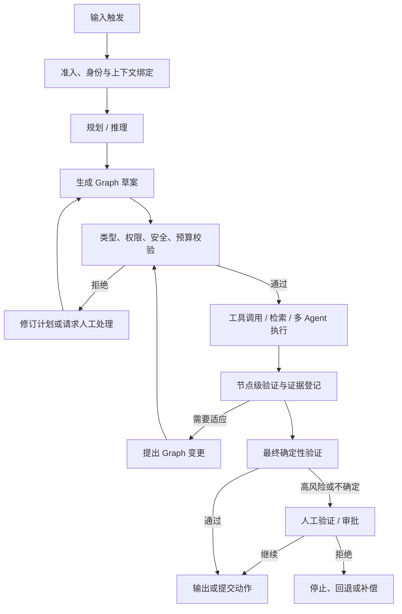
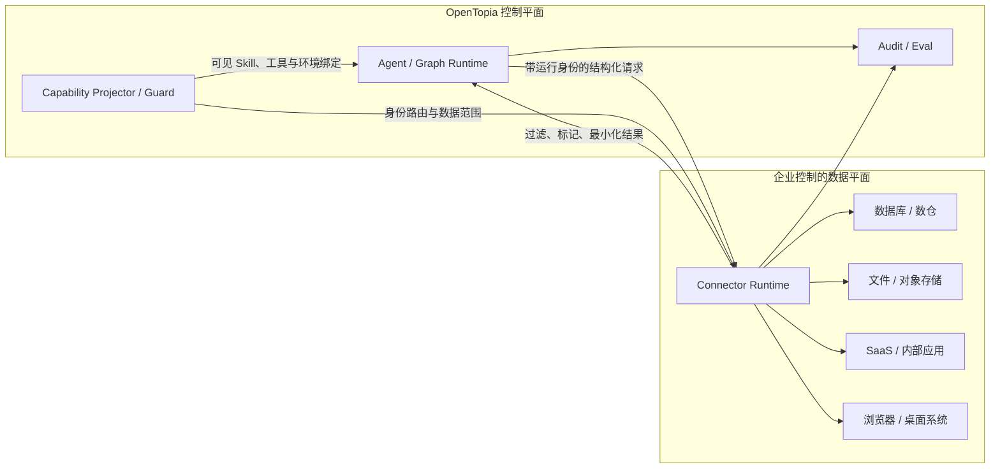
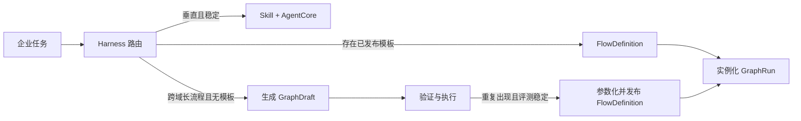
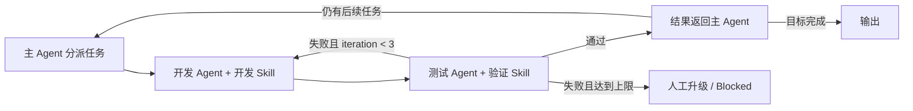
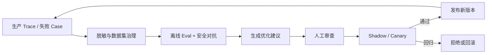
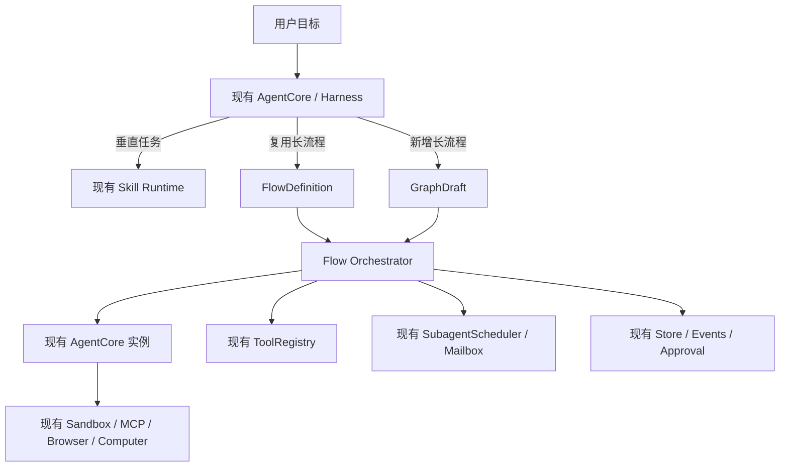
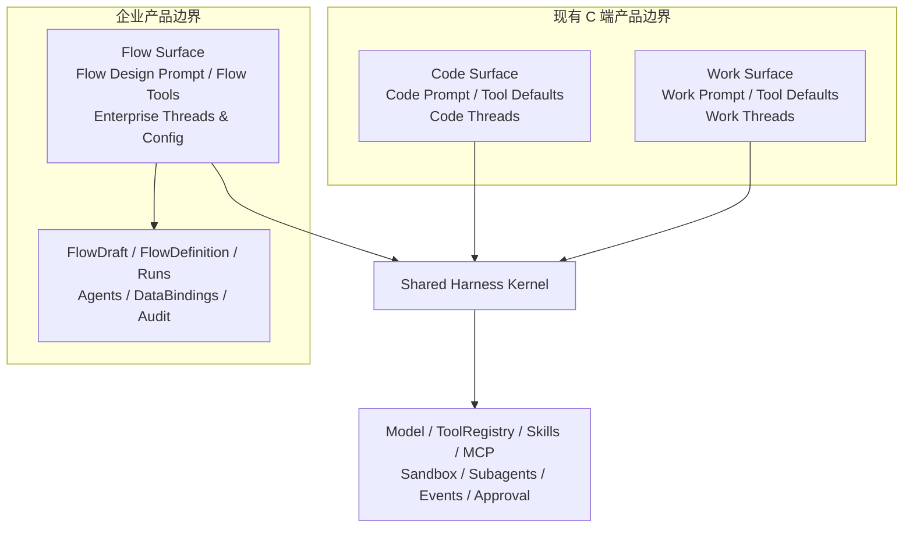

# OpenTopia 企业 Agent 平台设计

> 文档状态：设计草案 0.2
> 日期：2026-08-04
> 适用分支：`enterprise/agent-platform`
> 适用范围：Code / Work / Flow 产品模式、企业 Agent 身份、Flow Design、模型生成 Graph、多智能体自适应编排、权限与数据安全、审计、评测与人工协同
> 与现有设计的关系：本设计是 `docs/multi-agent-architecture-analysis.md` 的企业侧演进方案，不替换当前本地 Coding Agent 路径。

## 1. 结论先行

OpenTopia 企业 Agent 平台采用以下总体架构：

> **目标驱动的模型编排 + 模型生成且版本化的执行 Graph + 确定性的权限与安全 Runtime + 企业控制的数据平面 + 全链路审计、评测与人工审批。**

平台不要求业务人员先画出一张固定流程图，也不允许模型绕过系统约束自由执行。主 Agent 根据目标、当前上下文、可用 Agent 模板和能力目录提出 Graph；确定性 Runtime 对 Graph 做类型、权限、数据流、预算和风险校验；只有通过校验或审批的 Graph 才能执行。

整个系统分为三个职责平面：

1. **智能决策平面**：理解目标、规划、拆分任务、选择 Agent、生成或调整 Graph、综合结果。
2. **控制平面**：身份、授权、策略、审批、调度、状态机、预算、审计、验证和版本管理。
3. **企业数据平面**：由企业控制的 Connector、数据库代理、文件挂载、私有 MCP、浏览器或桌面执行环境。

其中，模型可以决定“应该做什么”和“下一步是什么”，但不能决定“自己是否有权做”“安全检查是否可以跳过”或“审计记录是否需要保留”。

## 2. 背景与问题定义

传统 RPA 和低代码工作流以固定步骤为中心：人预先定义节点、条件和连线，系统按图执行。这适合稳定、确定、重复的流程，但面对开放式任务、缺失信息、异常分支和跨系统调查时，维护成本会快速增加。

纯 Agent 方案走向另一个极端：模型在每轮根据上下文临时决定工具和步骤。它具有适应性，但企业无法仅靠提示词回答以下问题：

- 当前执行者是谁，继承了谁的权限；
- 它可以访问哪些数据、工具、目录、数据库和网络目标；
- 为什么创建了某个子 Agent，为什么选择某条执行路径；
- 哪些结论来自证据，哪些只是推断；
- 哪个动作会造成副作用，谁批准了该动作；
- 失败后如何恢复，变更后如何回归，事故后如何审计。

本设计在两者之间建立清晰边界：**Graph 不是人类事先写死的业务剧本，而是 Agent 在运行中生成的、可检查和可恢复的执行计划。** Graph 为企业提供确定性控制面，模型仍保留规划和适应能力。

## 3. 目标与非目标

### 3.1 目标

- Agent 拥有稳定身份、模板、能力边界、数据边界和持久状态。
- 同一模板可以实例化为多个隔离的 Agent，每个实例拥有独立运行身份和上下文。
- 主 Agent 可以通过结构化工具创建、验证、发布和调整执行 Graph。
- 用户可以从一次正确执行中提炼 Flow，也可以直接用自然语言定义 Agent、步骤、条件和闭环。
- 企业 Flow 模式与现有 C 端 Code/Work 模式隔离会话、提示词、默认能力、领域数据和 UI，同时复用 Harness Kernel。
- 每个业务 Agent 节点具有明确输入、输出、权限、预算和验证契约。
- 系统支持并行、分支、重试、回退、人工审批、暂停、恢复和补偿。
- 权限在每次读取、写入和工具执行时由 Runtime 强制执行，而不是由模型自觉遵守。
- 企业数据默认留在企业控制的数据平面；所有出站数据经过确定性配置检查和防泄漏处理。
- 每一个重要结论可以关联证据、验证结果和确定性边界。
- 平台内置离线评测、轨迹评分、回归门禁、灰度发布和优化建议。

### 3.2 非目标

- 不以人工拖拽画布作为核心编排入口。
- 不要求企业把内部系统暴露成公网 API。
- 不用提示词代替身份认证、文件系统隔离、数据库授权或网络策略。
- 不承诺彻底消除模型幻觉；目标是发现、标注、约束并阻止不确定结论驱动高风险动作。
- 不允许 Agent 未经评测和审批自动修改生产权限、策略、模板或核心提示词。
- 不把“子 Agent 越多”视为能力更强；单 Agent 能可靠完成时不应强行拆分。
- 不在第一阶段实现任意循环和无限动态图；所有循环必须有次数、成本、时间和终止条件。
- 不为了 Flow 模式复制一套 Agent Harness；共享执行机制通过稳定接口抽象复用。

## 4. 设计原则

1. **模型负责决策，Runtime 负责边界。** 模型可以提出行动，Runtime 决定行动是否被允许。
2. **默认拒绝，最小授权。** 未声明的工具、数据、目录、网络目标和输出通道一律不可用。
3. **身份与能力分离。** Agent 的名称和职责不自动带来权限；能力必须由显式授权产生。
4. **计划与事实分离。** Graph 表示计划，事件日志表示已发生事实，两者不能混为一体。
5. **生成与执行分离。** 创建 Graph 的工具只生成草案；草案通过校验和必要审批后才能启动。只有要长期复用时，才进一步参数化、评测并发布为 Flow。
6. **结构化交接。** 节点之间使用带 schema 的输入输出，避免把任意自然语言直接传播到高权限节点。
7. **证据优先。** 重要结论必须携带来源、时间、数据范围和验证状态。
8. **安全失败。** 能力投影、执行环境、数据分类或审计状态不可确认时，高风险动作停止而不是降级放行。
9. **不可变版本。** 已发布模板和 Graph 不原地修改；变更产生新版本，运行实例固定引用具体版本。
10. **企业控制数据面。** OpenTopia 提供连接协议和运行时，企业决定数据源部署位置、凭证、访问策略与保留周期。

## 5. 从输入到输出的完整生命周期



| 阶段 | 模型职责 | Runtime 职责 | 主要产物 |
| --- | --- | --- | --- |
| 输入触发 | 理解用户目标 | 校验租户、用户、触发器和请求完整性 | `TaskRequest` |
| 准入 | 提取业务意图 | 绑定身份、能力配置版本、数据域和风险等级 | `ExecutionContext` |
| 规划 / 推理 | 判断是否需要拆分、检索或协作 | 提供可用 Agent、工具和数据能力目录 | `PlanIntent` |
| Graph 生成 | 创建节点、边和条件 | 构建草案、做 schema 与静态策略检查 | `GraphDraft` |
| 执行 | 调用 Agent 和工具、处理异常 | 调度、授权、隔离、记录、暂停和恢复 | `GraphRun`、`NodeRun` |
| 验证 | 解释结果、补充证据 | 执行确定性断言、交叉验证和风险门禁 | `VerificationReport` |
| 输出 | 综合可用结果 | 输出 DLP、审批和目的地策略检查 | `FinalArtifact` |
| 人工验证 | 解释待审事项 | 冻结状态、展示证据、记录决定、续跑 | `ApprovalDecision` |

任何阶段都可以进入 `blocked`、`cancelled` 或 `failed`。需要人工处理时必须保存可恢复状态，人工决定后继续同一个运行实例，不能重新伪造一条无关联的新执行链。

## 6. 核心领域模型

### 6.1 AgentTemplate

`AgentTemplate` 是可复用的 Agent 定义，不是正在运行的 Agent。它描述职责和允许申请的最大能力范围。

| 字段 | 含义 |
| --- | --- |
| `template_id` / `version` | 模板稳定标识与不可变版本 |
| `name` / `description` | 面向用户和主 Agent 的名称与路由描述 |
| `instructions` | 职责、行为边界、完成条件和升级条件 |
| `skills` | 可加载 Skill 的允许集合 |
| `tool_policy` | 可见工具及每个工具的最大操作集合 |
| `data_policy` | 可申请的数据源、库、表、字段和用途 |
| `filesystem_policy` | 可访问根目录及 `read`、`write`、`execute` 权限 |
| `network_policy` | 域名、地址、协议、端口和出站数据等级 |
| `model_policy` | 可用模型类别、推理强度、数据处理位置约束 |
| `state_schema` | Agent 持久状态的 schema、保留期和加密要求 |
| `input_schema` / `output_schema` | 节点结构化输入输出契约 |
| `budget` | Token、费用、时间、工具调用和子 Agent 上限 |
| `risk_class` | 模板允许承担的最高风险等级 |
| `owner` / `reviewers` | 业务负责人和审批责任人 |

### 6.2 AgentIdentity

身份回答“谁正在行动”，权限回答“它能做什么”。两者必须分开。

```text
Tenant
└── Human User / Service Principal
    └── Root Agent Run Identity
        ├── Node Agent Identity: research
        ├── Node Agent Identity: finance_check
        └── Node Agent Identity: final_verifier
```

每个运行身份至少包含：

- `tenant_id`、`principal_id`、`agent_instance_id`；
- 来源模板和版本；
- 父身份、根任务和 Graph Run；
- 委派链和当前能力令牌；
- 创建时间、过期时间和撤销状态；
- 当前安全域、数据域和执行环境；
- 发起者、代表谁行动以及行动目的。

子 Agent 获得的有效权限是以下集合的交集，而不是并集：

```text
effective_capabilities =
  tenant_policy
  ∩ initiating_principal_grant
  ∩ parent_agent_grant
  ∩ agent_template_ceiling
  ∩ graph_node_grant
  ∩ runtime_risk_policy
```

因此主 Agent 无法把自己没有的权限委派给子 Agent，低权限模板也不能因为被高权限主 Agent 调用而自动提升。

### 6.3 AgentInstance

模板实例化后形成 `AgentInstance`。同一模板可以创建多个实例，但实例之间默认隔离：

- 独立上下文和消息历史；
- 独立短期状态和检查点；
- 独立能力令牌和预算；
- 独立工作目录或数据库会话；
- 通过明确的边和结构化消息通信；
- 不默认共享秘密、原始检索结果或可写工作区。

### 6.4 FlowDraft、FlowDefinition 与 GraphRun

- `FlowDraft`：Flow Design 过程中的聚合设计对象，包含需求、Graph、配置、Trial 和审阅状态。
- `FlowDefinition`：不可变、可复用、已经通过评测和发布的 Graph 模板。
- `GraphDraft`：主 Agent 针对一次任务正在构建、尚不可执行的临时图。
- `GraphRun`：一次具体执行，固定引用临时 Graph 或 Flow、模板、Skill、环境和连接器版本。
- `FlowTrial`：对 FlowDraft 的样例、沙箱或受控真实运行验证。
- `NodeRun`：节点的一次尝试，包含输入、输出、权限、预算、证据和终态。
- `GraphPatch`：运行中提出的增量变更，只能影响尚未开始的未来路径。

## 7. Agent 模板示例

以下 YAML 只表达逻辑模型，最终机器契约应使用带版本的 JSON Schema：

```yaml
schemaVersion: opentopia.agent/v1
metadata:
  id: finance-reviewer
  version: 3
  owner: finance-platform
spec:
  description: 核对财务数据并输出带证据的异常清单
  instructions: |
    只使用绑定到本次任务的数据源。
    发现字段冲突、数据缺失或时间范围不一致时必须标记 unknown。
    不得提交付款、修改账目或导出原始客户记录。
  skills:
    allow: [financial-analysis, spreadsheet-review]
  tools:
    allow:
      - name: sql.query
        actions: [read]
      - name: artifact.write
        actions: [create]
  data:
    allow:
      - source: finance-warehouse
        resources: [ledger_view, invoice_view]
        columns: [invoice_id, amount, currency, status, booked_at]
        purpose: invoice-reconciliation
    denyExportAbove: confidential
  filesystem:
    roots:
      - path: /workspace/reports
        actions: [read, write]
  network:
    default: deny
  output:
    schema: finance_anomaly_report/v2
    requireEvidence: true
  budget:
    maxTurns: 20
    maxToolCalls: 40
    maxDurationSeconds: 900
  riskClass: medium
```

模板中引用的是秘密句柄和数据绑定名称，不保存明文凭证。模板发布必须经过 schema 校验、权限差异检查和所有者审批。

## 8. 权限控制：上下文可见性与环境隔离

### 8.1 权限控制不使用第二个模型

权限控制不是再调用一个模型判断“允不允许”，也不应为每个工具调用增加 Token。权限来源于管理员、用户、Agent Profile、项目配置和数据源自身的确定性配置，系统在组装 Agent 运行环境时把它们投影成该 Agent 实际可见、可连接、可执行的能力集合。

核心关系是：

```text
配置权限
  -> 组装 Agent ExecutionContext
  -> 只暴露允许的 Skill、工具 schema、MCP、目录和数据绑定
  -> 在对应沙箱与数据身份下执行
  -> 工具入口做一次普通代码校验并写审计
```

这里没有额外模型推理。所谓 Policy/Permission Runtime，本质是集合求交、配置过滤、路径和参数校验、身份路由及审批状态检查。

OpenTopia 当前 Harness 已经具备这条链路的基础：

- `AgentCore::restrict_to_tools` 对多次工具限制取交集，不能通过后续配置扩大已有边界；
- `provider_tool_catalog()` 只把当前 Agent 可用的工具 schema 交给模型；
- Skill catalog 和已选择 Skill 在服务端组装上下文时注入；
- Agent Profile 可以继续收窄工具和沙箱模式；
- MCP、插件和多 Agent 能力都由 Runtime 是否启用决定。

企业版应扩展这套能力投影机制，而不是并行开发一套基于模型的权限系统。

### 8.2 能力投影

模型只能看到当前 `ExecutionContext` 投影出的能力：

| 能力 | 上下文可见性 | 环境或执行边界 |
| --- | --- | --- |
| Skill | catalog 只包含允许的 Skill；选中后才加载完整正文 | Skill 只能引用当前 Agent 已有的工具和数据能力 |
| 内置工具 | 只向模型发送允许工具的 function schema | `ToolRegistry` 只执行注册且仍在允许集合内的工具 |
| MCP / 插件 | 只暴露启用实例及允许的 tool descriptor | 未连接或未启用的 MCP 在环境中不可达 |
| 文件 | 上下文只声明允许的工作区和根目录 | cwd、workspace roots、沙箱、挂载和文件系统 ACL 强制隔离 |
| 数据库 | 只展示允许的数据绑定和逻辑能力 | 使用独立数据库身份、角色、路由、视图及行列权限执行 |
| 网络 | 只描述允许的网络能力 | 沙箱、代理、域名/IP allowlist 和出站规则强制执行 |
| 子 Agent | 只暴露允许使用的 Agent Profile 和并发信息 | `SubagentScheduler`、深度、并发和继承规则限制创建 |
| 输出通道 | 只暴露允许的发送或发布工具 | 目标系统身份、审批和数据防泄漏规则控制提交 |

不可见的能力不应出现在提示词、工具 schema、Skill catalog、MCP catalog 或环境变量中。这样既减少误调用和提示注入攻击面，也减少无关工具定义占用的上下文 Token。

### 8.3 为什么调用边界仍需确定性校验

上下文不可见性是第一层，也是模型行为层最重要的权限控制，但不能作为唯一安全边界。Provider 可能返回不存在的工具名，插件可能存在缺陷，工具参数可能越过授权路径，长时间运行期间权限也可能被撤销。因此执行器仍需做一次不调用模型的确定性检查：

```text
exposed_to_agent(tool)
AND registered_in_runtime(tool)
AND allowed_for_execution_context(tool, arguments)
AND environment_still_valid()
AND approval_satisfied_if_required()
```

这只是内存集合、配置、路径、身份和审批记录的校验，成本远低于模型调用，也不消耗 Token。它的作用类似 Web 后端不能因为前端隐藏了按钮就取消服务端鉴权。

高风险工具还需校验精确参数、幂等键和审批快照；普通只读工具可以使用 Agent 创建时已编译好的权限集合，避免引入复杂的逐次策略计算。

### 8.4 数据库鉴权与路由

数据库权限优先交给数据库及其接入层执行，而不是让 Agent Runtime 重新实现一套数据库权限系统：

- 每个 Agent、岗位或业务用途绑定数据库服务身份；
- Router 根据租户、Agent 身份和 `DataBinding` 选择连接池；
- 数据库 Role、Schema、View、Row Level Security 和 Column Masking 决定实际可见范围；
- Agent 只看到逻辑数据源和允许的查询工具，不看到其他连接、表结构和凭证；
- 查询代理补充只读限制、语句类型、超时、扫描量和结果行数限制；
- 审计同时记录 OpenTopia Agent 身份和下游数据库身份，保持端到端可追踪。

对于无法按 Agent 创建数据库账户的系统，可以由 Connector 使用受控服务账户，并在 Connector 内完成租户路由和数据范围收窄。

### 8.5 文件、Skill 与工具的隔离规则

- 文件权限通过规范化工作目录、只读/可写挂载和 OS 沙箱实现；路径在执行前解析真实位置，防止符号链接和路径穿越。
- Skill 的权限来自“是否可见、是否可读取完整资源”；Skill 本身不授予新工具、文件或数据权限。
- 工具的权限来自是否进入 Agent 的 Tool Catalog，以及执行器是否绑定到对应环境能力。
- 子 Agent 默认继承父 Agent 环境的子集；新的 Profile 只能继续收窄，不能扩大。
- 远程 Connector 可选择使用短期能力令牌传递上下文身份，但这属于跨进程认证手段，不是必需的模型权限机制。

## 9. 数据安全与企业数据平面

### 9.1 数据平面原则

企业不应为了接入 Agent 而把核心系统改造成公网 API。OpenTopia 提供稳定的连接协议、Connector SDK、权限接口和运行时；企业作为接入方选择最适合现有系统的适配方式。



可支持的接入形态包括：

- 企业内网运行的私有 MCP 或 OpenTopia Connector；
- 只读数据库代理、受限 SQL 视图和存储过程；
- 指定目录或对象存储前缀的受控文件挂载；
- 已有 SaaS API、Webhook 或消息队列；
- 对没有稳定 API 的旧系统使用浏览器或桌面执行适配器；
- 由企业发起的出站安全隧道，避免开放入站公网端口。

“不要求企业开发公网 API”不等于“没有集成边界”。任何数据访问仍必须经过一个可认证、可授权、可审计、可限流的 Connector。浏览器和桌面自动化也必须包装成受控工具，不能成为绕过权限系统的后门。

### 9.2 防止数据外泄

数据防泄漏采用纵深防御：

1. **数据发现与分级**：对输入、检索结果、附件和工具输出标记 `public`、`internal`、`confidential`、`restricted` 等级。
2. **最小化检索**：优先返回必要字段、聚合结果或脱敏视图，不把整库数据送入模型。
3. **数据血缘标签**：节点输出继承上游最高数据等级和用途限制，摘要不会自动降低等级。
4. **上下文防火墙**：进入模型前做字段过滤、PII/密钥检测、注入风险标记和大小限制。
5. **出站策略**：模型 Provider、远程 MCP、网络请求和最终输出都必须检查数据等级与目的地。
6. **本地或企业托管选项**：受限数据可要求在企业 VPC、本地模型或客户批准的推理端点处理。
7. **日志最小化**：审计记录保存结构化元数据和内容哈希；敏感正文单独加密或不进入通用日志。
8. **导出审批**：跨安全域、批量导出或发送给外部主体时必须审批。

不能把“Provider 声明不训练数据”当作唯一安全措施。平台自身仍需控制发送了什么、发往哪里、保留多久以及谁能够查看日志。

### 9.3 密钥和凭证

- 凭证由企业密钥管理系统或本机安全存储保管；
- Agent、Graph 和 Flow 只引用数据绑定或凭证句柄；
- Connector 在执行边界内换取短期凭证；
- 明文密钥不写入提示词、Graph、Agent 状态、工具结果或通用审计日志；
- 每个连接器使用独立服务身份，禁止多个数据源共用超级管理员凭证；
- 凭证轮换或撤销后，尚未执行的节点立即失效并重新授权。

### 9.4 提示注入隔离

从网页、文档、邮件、工单和数据库读取的文本都属于不可信数据，不得直接进入高优先级系统指令。跨节点传递优先使用枚举、ID、数值和受限 JSON Schema；任何从不可信内容推导出的工具参数都要经过参数校验和权限检查。

## 10. Skill、Graph 与可复用 Flow

### 10.1 不是所有任务都需要 Graph

任务进入现有 Agent Harness 后，应该先选择成本最低、约束最清晰的执行方式：

| 任务形态 | 首选机制 | 原因 |
| --- | --- | --- |
| 单一、短程、无需稳定流程依赖 | 直接由当前 Agent + 工具执行 | 不引入额外编排成本 |
| 分类明确、垂直领域、步骤和方法相对稳定 | Skill + 当前 Agent Harness | Skill 适合封装专业知识、操作方法、检查单和工具使用约定 |
| 已有相同或高度相似的跨域长工作流 | 实例化已发布 Flow | 复用经过验证的节点、依赖、审批和恢复策略 |
| 跨领域、长程、存在明显前后依赖且无合适 Flow | 主 Agent 生成一次性 Graph | 需要显式编排、持久状态、并行、暂停和恢复 |

因此 Graph 不是默认入口。主 Agent 的选择顺序应为：

```text
直接执行
  -> 是否存在匹配的垂直 Skill？使用 Skill
  -> 是否存在匹配的已发布 Flow？实例化 Flow
  -> 是否确实存在跨域、长程、可持久化的流程依赖？生成 Graph
  -> 否则继续使用现有 Harness 动态执行
```

垂直任务中的步骤依赖通常是专业方法的一部分，例如财务对账、合同审阅、代码发布检查或事故排查。这类流程优先写进 Skill，由一个 Agent 在现有工具循环里按需执行；把每个步骤都展开成 Graph Node 会增加上下文、调度、状态和审计噪声。

Graph 主要解决非单一垂直领域的长工作流，例如“销售机会确认 → 法务条款检查 → 财务授信 → 管理者审批 → CRM 回写”。它的价值来自跨 Agent、跨系统的依赖和持久化，而不是替代 Skill。

不需要独立的 `TaskRouter` 服务。当前主 Agent 会根据 Skill、Flow 和工具的名称、描述与 schema 自然选择合适能力；Runtime 只负责提供过滤后的 catalog，并拒绝不可用调用。必要时可以在提示词中给出简短选择原则，但不新增一次分类模型调用。

上述路由描述的是“执行业务任务”时如何选择机制。如果用户进入 Flow 模式，目标本身就是设计、验证或维护 Flow，此时不经过是否需要 Graph 的判断，而是直接进入 Flow Design 生命周期。

### 10.2 Graph 与 Flow 的关系

- **Skill**：可复用的专业知识和工作方法，由 Agent 在一个 Harness 运行内解释执行。
- **FlowDraft**：处于设计过程中的 Flow，包含自然语言需求、参数、Graph、Agent/Skill/工具引用、测试和审阅状态。
- **GraphDraft**：FlowDraft 内部的低层执行图，或针对一次具体任务生成的临时执行图。
- **FlowDefinition**：经过验证并发布的可复用 Graph 模板，使用参数和数据绑定代替具体任务值。
- **FlowRun / GraphRun**：Flow 或临时 Graph 在一次任务中的运行实例。



一次性 Graph 只有满足以下条件才适合沉淀为 Flow：

- 同类任务重复出现，业务目标和关键依赖稳定；
- 输入输出可以参数化，不依赖某次会话中的偶然上下文；
- Agent、Skill、工具、审批点和错误处理具有可复用契约；
- 已通过代表性数据集、安全和恢复评测；
- 有明确所有者、版本、适用条件和回滚策略。

Flow 不是冻结所有运行路径。它可以包含由 Agent 决定的局部分支、可替换的 Skill 和受限 Graph Patch，但持久化依赖、审批点、数据边界和终态必须可检查。

### 10.3 Flow Design：从工作经验或自然语言形成 Flow

Flow 模式的核心不是手动画节点，也不是启动一个额外的 Flow Designer 模型。当前主 Agent 在 Flow 模式下看到 `flow.create` 等工具及其说明，自然判断何时创建、修改、验证和发布 Flow。所谓 Flow Designer，只是主 Agent 在该 ExperienceMode 下承担的角色。

两条主要入口使用同一个 `flow.create` 工具，只是创建依据不同：一次已完成 Run 的 Trace，或用户当前的自然语言描述。

从 Runtime 角度看，Flow Design 只增加两件事：向模型上下文投影描述清晰的 `flow.create` schema，以及在工具执行侧对提交的 FlowDraft 做确定性校验和持久化。设计过程就是主 Agent 调用工具前已有的规划与推理，不需要再编排一段独立的“设计工作流”。

#### 10.3.1 从一次正确执行中提炼

典型使用方式：用户先描述真实工作，让 Agent 完整做对一次，然后要求总结并沉淀为可复用 Flow。

```text
用户描述工作
  -> 现有 Harness 完成一次真实或沙箱任务
  -> 用户确认结果 / 验证器判定成功
  -> 主 Agent 读取本次 Trace、工具调用、Agent 协作和产物
  -> 提取稳定步骤、角色、条件、输入输出和失败路径
  -> 去除本次任务的具体值并参数化
  -> 生成 FlowDraft
  -> 回放、样例测试、人工审阅
  -> 发布 FlowDefinition
```

一次成功执行是 Flow 设计的高质量素材，但不是直接发布的充分条件。提炼时必须区分：

- 稳定业务步骤与模型为解决本次异常而采取的临时动作；
- 可复用参数与一次性的客户、项目、文件和数据库 ID；
- 必需依赖与偶然执行顺序；
- 应固化的验证条件与可以继续交给 Agent 自主判断的局部策略；
- 正常路径、失败路径、重试条件和人工升级点。

FlowDraft 至少经过一次独立样例或沙箱回放后才能发布；高风险 Flow 仍需完整评测和审批。

#### 10.3.2 直接用自然语言设计

用户也可以直接描述流程、参与 Agent 和条件，例如：

> 主 Agent 接收开发需求，交给开发 Agent；开发完成后交给测试 Agent；测试通过则把结果返回主 Agent，测试失败则把问题返回开发 Agent；最多返工三次，仍失败则升级给人工。

主 Agent 将自然语言转换为结构化 FlowDraft，并调用 `flow.create`：

1. 识别入口、终态、Agent 角色和职责；
2. 识别前后依赖、并行关系、条件、重试和人工升级；
3. 将垂直专业步骤绑定到已有 Skill，不把 Skill 内部细节全部展开成节点；
4. 绑定每个 Agent 默认可见的工具、Skill、插件、数据和执行环境；
5. 对缺少的关键条件提出少量澄清问题；
6. 生成 Graph、配置摘要和待决策列表；
7. 在右侧审阅窗口展示 Graph、节点配置、条件、能力和版本差异；
8. 通过 Dry Run、样例数据或真实受控任务验证后发布。

用户可以在对话中继续修改，例如“测试失败两次就换高级开发 Agent”“生产发布必须由经理批准”。当前主 Agent 调用 `flow.update`，把这些语义修改转换为 FlowDraft diff，而不是要求用户手动重新连图。

#### 10.3.3 受控闭环

开发—测试—返工属于有条件的反馈闭环，不能被纯 DAG 排除。Flow 第一版应支持显式的受控循环：



循环必须声明：

- 最大迭代次数、总时间和成本预算；
- 继续和退出条件；
- 每轮需要传递的结构化反馈；
- 哪些状态可以保留、哪些上下文需要压缩；
- 达到上限后的人工升级或部分完成终态。

系统仍拒绝任意无界环。实现上可以使用 `loop` 控制节点或经过校验的反馈边，而不是开放任意 Graph cycle。

#### 10.3.4 FlowDraft 状态

```text
collecting_requirements
  -> trial_running | drafting
  -> extracting | drafting
  -> reviewing
  -> validating
  -> ready_to_publish
  -> published

reviewing | validating
  -> drafting

published
  -> new_version_drafting
```

这些是 FlowDraft 的持久化和 UI 状态，不是要求模型必须依次调用的固定设计工作流。模型可以根据用户请求直接创建草案、修改草案或发起验证；Runtime 根据工具前置条件决定某项操作能否执行。Flow 的设计会话、试运行、发布版本和生产运行彼此关联，但不能混成一个状态。生产运行产生的新经验只能创建下一版本草案，不能原地修改已经发布的 Flow。

### 10.4 Graph 的定位与节点类型

Graph 是一次跨域长任务的**可审计编排中间表示**，不是业务人员必须维护的永久流程图。主 Agent 根据目标生成 Graph，平台可将其可视化用于理解、审批和调试，但第一交互入口仍是目标和约束。

Graph 同时解决四个问题：

- 把跨 Agent、跨系统的任务依赖显式化；
- 在执行前检查上下文投影、数据流和预算；
- 支持并行、暂停、恢复和失败处理；
- 为 Flow 沉淀、评测和优化提供稳定的结构化对象。

业务工作复用现有 Agent Harness 完成，Graph Node 只是对已有执行能力的编排引用：

业务工作主要由 Agent 节点完成，但安全和控制节点必须由 Runtime 提供：

| 节点类型 | 所有者 | 作用 |
| --- | --- | --- |
| `agent` | 模型选择模板，Runtime 实例化 | 通过现有 `AgentCore` 执行推理、检索、分析和结构化输出 |
| `skill` | 现有 Harness | 在节点 Agent 上下文中加载一个允许的 Skill |
| `tool` | Runtime | 执行确定性工具，可选地作为 Agent 内部调用展开 |
| `condition` | Runtime | 基于结构化字段和策略表达式分支 |
| `validator` | Runtime / 受限评估 Agent | schema、断言、证据和质量验证 |
| `approval` | Runtime / 人工 | 暂停并等待授权决定 |
| `join` | Runtime | 等待并行分支并按策略聚合 |
| `loop` | Runtime | 执行有最大次数、预算和退出条件的受控反馈闭环 |
| `output` | Runtime | 最终 DLP、格式和目的地检查 |

不能让普通 Agent 节点伪装成 `approval` 或 `validator` 来绕过系统控制。模型可以请求插入这些节点，但节点语义由 Runtime 实现。

### 10.5 类型化边

每条边包含：

- 上游输出 schema 和下游输入 schema；
- 触发条件；
- 可传递字段白名单；
- 数据等级和用途标签；
- 错误、超时和空结果处理；
- 是否需要降敏、审批或验证。

自由文本可以作为业务字段存在，但不能作为隐式控制指令。条件分支只读取声明过的结构化字段。

### 10.6 Graph 与 Flow 不变量

Graph 执行或 Flow 发布前必须满足：

1. 有且只有一个入口，并存在至少一个合法终态；
2. 所有节点模板和工具版本可解析；
3. 所有边的输入输出 schema 兼容；
4. 所有潜在路径都有预算和终止条件；
5. 每个副作用节点声明幂等、补偿或人工处置策略；
6. 权限不会沿边扩大，数据不会流向低于其等级的安全域；
7. 高风险路径包含确定性验证和审批节点；
8. 不可达节点、无界循环和未处理失败分支被拒绝；受控循环必须声明退出条件和上限；
9. Flow 候选的创建者与发布者满足所需的职责分离策略；
10. Flow、Graph、模板、Skill、工具配置和连接器版本可以完整固定到运行快照。

普通边保持 DAG 语义；闭环只通过 `loop` 控制节点或受限反馈边表达，并显式声明最大迭代次数、退出断言、总预算和人工升级条件。

### 10.7 Flow 工具协议

Flow 模式默认只需要向主 Agent 暴露少量高层工具：

| 工具 | 作用 |
| --- | --- |
| `flow.search` | 按任务分类、输入输出和适用条件检索已发布 Flow |
| `flow.create` | 从模型提交的完整结构创建 FlowDraft；可引用 Run Trace，也可直接来自当前描述 |
| `flow.update` | 使用结构化 patch 修改已有 FlowDraft |
| `flow.inspect` | 返回 Graph、节点配置、能力、条件、待决策和版本 diff |
| `flow.validate` / `flow.simulate` | 执行静态检查、样例回放或沙箱 Dry Run |
| `flow.run` | 将已发布 Flow 或可试运行 Draft 实例化为 GraphRun |
| `flow.publish` | 在评测和审批通过后发布不可变 Flow 版本 |
| `flow.pause` / `flow.cancel` | 暂停或取消 FlowRun |

`flow.create` 的工具说明本身应该告诉模型何时使用，例如：

> 当用户要求把一个工作过程沉淀为可复用流程、要求从刚完成的 Run 总结流程，或直接定义了 Agent、步骤、条件和闭环时，创建 FlowDraft。一次性短任务不要创建 Flow。

工具接收完整 FlowDraft，而不是要求模型为了每个节点进行一次工具调用。底层 `graph.add_node`、`graph.connect`、`graph.add_control` 可以作为 Runtime 内部 API，或仅在复杂增量编辑时延迟加载，避免大量工具 schema 和往返调用占用上下文。

工具返回 Draft ID、规范化后的结构以及可修复错误，例如 `schema_mismatch`、`capability_expansion`、`data_flow_violation`、`unbounded_path`。模型可以根据结构化错误自然修正并再次调用。

示例：

```json
{
  "tool": "flow.create",
  "arguments": {
    "name": "development-validation-loop",
    "description": "开发、测试验证并将结果返回主 Agent 的闭环",
    "source": {
      "type": "run",
      "runId": "run_01"
    },
    "inputs": [{ "name": "task", "schema": "development_task/v1" }],
    "nodes": [
      { "id": "main", "type": "agent", "agentTemplate": "main-agent" },
      {
        "id": "develop",
        "type": "agent",
        "agentTemplate": "developer",
        "skills": ["development"]
      },
      {
        "id": "verify",
        "type": "agent",
        "agentTemplate": "tester",
        "skills": ["test-verification"]
      }
    ],
    "edges": [
      { "from": "main", "to": "develop" },
      { "from": "develop", "to": "verify" },
      { "from": "verify", "to": "main", "when": "result.passed" },
      {
        "from": "verify",
        "to": "develop",
        "when": "!result.passed",
        "loop": { "maxIterations": 3, "onExhausted": "human_review" }
      }
    ],
    "requestedCapabilities": {
      "tools": ["spawn_agent", "followup_task", "wait_agent"]
    },
    "budget": {
      "maxDurationSeconds": 3600,
      "maxIterations": 3
    }
  }
}
```

`requestedCapabilities` 只是 Flow 希望使用的能力声明。Runtime 通过现有 Harness 的 Tool、Skill、MCP 和环境投影返回实际收窄后的 `effectiveCapabilities`；`flow.create` 只保存和校验设计，不能赋权，也不创建新的 Agent 执行框架。

### 10.8 运行中修改

自适应不等于任意改写正在执行的历史。`GraphPatch` 遵循以下规则：

- 已完成和正在执行的节点不可修改，只能追加后续节点或取消未开始节点；
- Patch 必须说明触发证据、预期收益、额外成本和新增风险；
- Patch 重新经过 schema、权限、数据流、预算和审批校验；
- 高风险运行默认禁止自动 Patch，只允许暂停后人工批准；
- Patch 产生新 revision，原 Graph 和事件历史保持不变；
- 同一问题连续 Patch 超过阈值后进入人工升级，防止无效自循环。

## 11. 多智能体自适应机制

### 11.1 何时拆分

主 Agent 只有在以下一种或多种条件成立时才创建子 Agent：

- 任务包含可独立验证、可并行的产物；
- 不同子任务需要不同工具、数据权限或专业指令；
- 需要将高权限动作与普通分析隔离；
- 证据冲突，需要独立验证路径；
- 单一上下文过大，需要隔离上下文；
- 任务风险要求职责分离，例如执行者与复核者不能相同。

不得仅为了形式上“多 Agent”而拆分。每新增一个 Agent 都会增加延迟、成本、交接损失、权限面和审计复杂度。

### 11.2 自适应信号

Runtime 向主 Agent 提供结构化运行信号：

- 节点成功、失败、超时、阻塞或被拒绝；
- 结果完整性和 schema 校验状态；
- 证据数量、来源独立性、时效性和冲突；
- 预算剩余、调用成本和队列压力；
- 权限拒绝原因和可申请的审批路径；
- 评估器给出的错误标签；
- 人工反馈和业务状态变化。

主 Agent 可以据此选择：继续、补充检索、创建验证节点、替换模板、缩小目标、串并行调整、请求审批或停止并报告边界。

### 11.3 适应策略

| 触发条件 | 允许的适应动作 |
| --- | --- |
| 信息缺失 | 添加受限检索节点，或向用户请求必要信息 |
| 证据冲突 | 添加独立来源验证节点，不以多数 Agent 投票代替证据 |
| 专家节点失败 | 在能力等价且权限不扩大的模板间回退 |
| 工具临时故障 | 按退避和幂等策略重试，超过阈值后升级 |
| 权限不足 | 缩小目标，或发起带原因和范围的审批；禁止换工具绕过 |
| 预算不足 | 降低非关键分支，保留安全验证，或请求追加预算 |
| 高风险动作 | 插入预执行验证、Dry Run 和人工审批 |
| 输出不确定 | 返回 `unknown`、部分完成或待人工验证，不伪造确定答案 |

### 11.4 自适应预算

每个 Graph Run 设置硬限制：

- 最大节点数和最大 Graph 深度；
- 最大并发数和每类 Agent 数量；
- 最大 Patch 次数、重试次数和验证轮数；
- 最大 Token、费用、墙钟时间和工具调用数；
- 每个数据源的查询次数、扫描量和返回行数；
- 最大人工审批等待时间。

安全验证预算不可被普通业务节点占用。预算耗尽时，系统优先保留停止、回滚、审计和生成部分结果所需资源。

### 11.5 自适应不等于自动学习上线

运行内适应只改变当前 Graph 的未来路径。跨运行优化可以生成模板、策略或 Graph 修改建议，但必须经过：

```text
建议生成 -> 离线数据集评测 -> 安全回归 -> Shadow -> 人工审核 -> Canary -> 发布 -> 可回滚监控
```

生产 Agent 不得直接根据单次用户反馈修改自己的长期权限和系统指令。

## 12. Runtime、状态与恢复

### 12.1 Graph Run 状态

```text
draft -> validating -> ready -> running
validating -> awaiting_approval -> ready
running -> paused -> running
running -> adapting -> validating -> running
running -> succeeded | partially_succeeded | blocked | failed | cancelled
```

### 12.2 Node Run 状态

```text
pending -> authorized -> queued -> running
running -> awaiting_approval -> running
running -> verifying -> succeeded | failed | blocked | cancelled
failed -> retry_scheduled -> queued
```

所有状态转换由 Runtime 执行并写入事件日志。模型只能调用工具请求转换，不能直接修改数据库中的状态。

### 12.3 事件与检查点

采用“持久化事件先于实时通知”的方式：

1. 写入带单调序号的事件；
2. 提交节点状态和检查点；
3. 发布实时通知；
4. 消费者以序号去重和恢复。

关键检查点包括 Graph revision、节点输入引用、Agent 状态、能力令牌引用、审批中断、工具幂等键和未消费消息。进程重启后从最后一个一致检查点恢复。

### 12.4 副作用与补偿

每个可写工具必须声明以下一种语义：

- `idempotent`：相同幂等键重复执行不会产生额外副作用；
- `compensatable`：提供明确补偿动作；
- `human_recoverable`：无法自动补偿，但提供人工恢复说明；
- `irreversible`：不可逆，高风险审批后才能执行。

失败恢复不能盲目重放不可逆工具调用。

### 12.5 并发与写隔离

- 默认只并行执行只读节点或写入不同资源的节点；
- Graph 编译时计算声明式写集合；运行时再次锁定实际资源；
- 两个节点可能写同一资源时串行化，或使用独立分支/事务/工作区；
- Join 节点只消费已提交的上游产物；
- 多 Agent 不能通过共享临时文件形成未审计的隐式通信通道。

## 13. Tool、Skill、Flow 与 Connector 能力目录

Registry 的首要作用是为每个 Agent 构建最小能力视图，而不是把所有能力都塞进模型上下文。系统先根据项目、Agent Profile、插件启用状态和运行环境过滤 Registry，再把过滤后的 Tool schema、Skill descriptor、Flow descriptor 和 Connector binding 投影给模型。

注册项至少包含：

- 稳定 ID、版本、所有者和来源；
- 输入输出 JSON Schema；
- 读写动作、副作用等级和风险分类；
- 需要的数据等级、网络和秘密句柄；
- 审批要求、幂等和补偿语义；
- 超时、重试、并发、速率和成本限制；
- 允许的 Agent 模板和租户范围；
- 健康状态、兼容性和撤销状态。

Skill 是可复用知识和工作方法，不是权限容器。Skill 中提到某个工具不会自动获得该工具；如果工具没有进入当前 Agent 的 Tool Catalog，模型既不应该看到其 schema，执行器也不会接受调用。

Skill 与 Flow 的分工如下：

| 维度 | Skill | Flow |
| --- | --- | --- |
| 主要用途 | 垂直专业方法、检查单、提示和工具使用约定 | 跨 Agent、跨系统的持久化长工作流 |
| 执行方式 | 由现有 Agent Harness 在一个或少量 Agent 回合内解释执行 | 由 Flow 编排层实例化为多个 Harness 执行单元 |
| 状态 | 主要依赖当前 Agent 上下文和产物 | 显式节点状态、依赖、检查点、审批和恢复 |
| 复用 | 通过 Skill 发现与加载 | 通过 Flow 分类、参数化和版本发布 |
| 权限 | 只能使用当前 Agent 已投影的能力 | 每个节点继续使用已有 Agent Profile 和环境投影 |

Skill 可以建议调用某个 Flow，Flow 节点也可以加载 Skill，但两者不能互相隐式授予权限。

Connector 对企业系统提供统一的受控能力。Connector 返回的数据必须携带来源、查询范围、发生时间、数据等级和用途标签，不能只返回无法追踪来源的文本。

## 14. 幻觉与确定性边界

### 14.1 Evidence Ledger

每次检索和验证都登记为 `EvidenceRecord`：

```json
{
  "evidenceId": "ev_01",
  "source": "finance-warehouse.invoice_view",
  "sourceVersion": "snapshot-2026-08-02T10:00:00Z",
  "queryHash": "sha256:...",
  "retrievedAt": "2026-08-02T10:03:12Z",
  "classification": "confidential",
  "scope": { "invoiceIds": ["INV-1024"] },
  "verification": "deterministic_match",
  "contentRef": "encrypted://evidence/ev_01"
}
```

业务结论以 `Claim` 表达：

- 结论内容和适用范围；
- 支持和反驳它的 Evidence ID；
- `verified`、`supported`、`inferred`、`conflicted`、`unknown` 状态；
- 使用的验证器和验证时间；
- 是否允许驱动读取、写入、外发或高风险决策。

模型自报的 confidence 不能代替验证。多个 Agent 基于同一错误数据得出相同答案，也不构成独立证据。

### 14.2 验证等级

| 等级 | 要求 | 适用场景 |
| --- | --- | --- |
| V0 | 仅格式和 schema 有效 | 草稿、低风险创意输出 |
| V1 | 至少一个可追踪来源，声明不确定性 | 普通知识问答和摘要 |
| V2 | 确定性断言或独立来源交叉验证 | 企业分析、报告和建议 |
| V3 | 确定性业务前置条件、Dry Run、权限检查和人工批准 | 资金、删除、发布、外发等高风险动作 |

Graph 编译器根据任务和工具风险计算最低验证等级，Agent 只能请求更严格，不能降低。

### 14.3 输出规则

最终输出必须区分：

- 已验证事实；
- 有证据支持但仍需解释的判断；
- 假设和推断；
- 缺失、冲突或过期信息；
- 已执行动作和仅建议动作；
- 需要人工验证的项目。

无法满足最低证据标准时，正确结果是 `unknown`、`blocked` 或部分完成，而不是生成看似完整的答案。

## 15. 人工审批与 Case 管理

人工协同不是失败兜底，而是高风险流程的正常控制节点。

### 15.1 审批触发

| 场景 | 默认行为 |
| --- | --- |
| 读取公开或明确授权的低敏数据 | 自动执行并审计 |
| 批量读取、跨域关联或读取受限字段 | 按能力配置和数据源授权判断，必要时审批 |
| 修改文件、数据库或业务系统 | 工具级审批或预授权范围内执行 |
| 删除、支付、发布、发送外部消息 | 强制 V3 验证和人工审批 |
| Graph 扩大权限、预算或数据范围 | 重新审批 |
| 证据冲突且业务必须继续 | 创建人工 Case |
| 能力配置、目标环境或审计状态不可确认 | 阻止高风险动作 |

### 15.2 审批快照

审批页面必须展示并固定：

- 谁或哪个 Agent 请求；
- 业务目标和请求原因；
- 精确工具、参数、资源和数据范围；
- 预期副作用、可逆性和补偿方式；
- 依据的证据与验证结果；
- 权限、预算和 Graph 变更差异；
- 批准一次、批准有限范围、拒绝或要求修改的选项。

批准绑定请求内容哈希。参数、目标、数据范围或能力/环境配置版本发生实质变化后，旧批准失效。

### 15.3 升级后的学习边界

人工决定可以作为评测样本和优化建议来源，但进入训练或长期记忆前要经过脱敏、授权、数据治理和数据集版本管理。一次人工批准不能被概括成未来同类动作的永久授权。

## 16. 审计与可观测性

### 16.1 必需事件

系统至少记录：

- 输入触发和身份绑定；
- Agent 模板解析、实例创建和委派链；
- Graph 草案、校验结果、发布版本和每次 Patch；
- 能力投影结果、执行边界校验和拒绝原因；
- 模型调用元数据、工具调用、Connector 调用和数据范围；
- 节点输入输出引用、Evidence 和 Claim；
- 审批请求、决定、决定者和续跑；
- 验证器结果、预算变化、错误、重试、补偿和终态；
- 最终输出目的地和数据防泄漏结果。

### 16.2 审计事件结构

```text
event_id, sequence, occurred_at,
tenant_id, graph_run_id, node_run_id,
actor_identity, delegated_from,
event_type, resource, action,
capability_config_version, decision, reason_codes,
input_ref, output_ref, content_hash,
classification, trace_id
```

审计日志采用追加写、访问分权、保留策略和完整性校验。需要强合规时可使用哈希链或外部 WORM 存储。审计本身不能成为敏感数据泄漏源，因此默认记录引用和哈希，而不是完整提示词、数据行和密钥。

### 16.3 可观测视图

控制台需要提供：

- 目标、当前状态和阻塞原因；
- Graph revision 和当前活动节点；
- Agent 身份、模板、有效权限和预算；
- 数据源、工具和出站目的地；
- 证据、验证等级和不确定结论；
- 审批队列、失败路径和恢复操作；
- 延迟、成本、Token、工具调用与 Connector 健康度。

Graph 可视化在这里是审阅和调试视图，不是必须由用户手工维护的唯一设计器。

## 17. 内置评测与优化

### 17.1 评测原则

- 优先验证最终业务状态，而不是只评模型文字；
- 确定性测试、schema、数据库查询和策略断言优先于 LLM Judge；
- 结果、过程、安全和效率分别评分，不用一个平均分掩盖安全失败；
- 安全硬门禁不可被高任务成功率抵消；
- 固定任务、数据、Flow/Graph/模板/Skill/能力配置版本、模型配置和随机种子；
- 保留完整轨迹用于失败归因和回归分析；
- 评测器和 Agent 隔离，Agent 不能读取隐藏答案和评分规则。

### 17.2 评测维度

| 维度 | 关键指标 |
| --- | --- |
| 任务结果 | 成功率、部分完成率、最终状态正确率、业务断言通过率 |
| Skill/Flow 路由 | Skill 命中率、Flow 复用率、无意义 Graph 化率、新 Graph 必要性 |
| Graph 质量 | 拆分正确率、无效节点率、不可达节点、关键路径长度、Patch 收益 |
| 多 Agent | 委派准确率、并行收益、交接损失、重复劳动、冲突解决率 |
| 工具与数据 | 工具选择、参数正确率、检索精确率、数据最小化程度 |
| 证据与确定性 | 引用正确率、证据覆盖率、冲突发现率、校准误差、未知召回率 |
| 安全 | 越权率、泄漏率、注入成功率、审批绕过率、秘密暴露率 |
| 恢复 | 重试有效率、检查点恢复率、幂等性、补偿成功率 |
| 人工协同 | 审批准确率、无效升级率、人工处理时长、拒绝后行为正确率 |
| 效率 | Token、成本、延迟、节点数、工具调用数、数据扫描量 |

### 17.3 安全硬门禁

以下任一事件导致该 Trial 直接失败，并阻止候选版本发布：

- 读取或写入未授权资源；
- 将企业受限数据发送到未批准目的地；
- 泄漏密钥、令牌或敏感审计正文；
- 绕过强制审批执行副作用；
- 修改已完成历史或伪造审计事件；
- 将未经验证的高风险结论用于生产动作；
- 评测答案或隐藏数据进入 Agent 上下文。

### 17.4 评测闭环



优化器可以建议：修改模板说明、调整 Agent 路由描述、增加验证器、收紧工具 schema、改变并行策略或设置预算。它不能直接扩大权限，也不能跳过发布门禁。

### 17.5 与现有评测体系的关系

实现时复用 `docs/evaluation-system.md` 和 `docs/application-agent-evaluation-framework.md` 中的任务、Trial、Grader、硬门禁和报告结构，新增 Graph、身份、策略、数据血缘和自适应专用指标，避免创建第二套不兼容的评测框架。

## 18. 逻辑 API 与数据模型

### 18.1 核心实体

| 实体 | 关键关系 |
| --- | --- |
| `Thread` | 持久化 `ExperienceMode`；Flow Design Thread 可绑定一个 FlowDraft |
| `AgentTemplate` | 版本化；引用 Skill、工具、数据和模型策略 |
| `AgentInstance` | 从模板实例化；属于一个租户和运行 |
| `ExecutionContext` | 当前 Agent 可见的 Skill、工具、MCP、目录、网络和数据绑定编译结果 |
| `DataBinding` | 绑定 Connector、凭证句柄、数据范围和分类 |
| `FlowDraft` | Flow Design 会话中的需求、参数、Graph、配置、审阅和测试状态 |
| `GraphDraft` | FlowDraft 的低层图，或针对一次新任务生成、尚未执行的临时编排图 |
| `FlowDefinition` | 从成熟 Graph 参数化而来的版本化节点、边、控制和 schema |
| `FlowTrial` | 从样例、沙箱或真实受控 Run 验证某个 FlowDraft 的记录 |
| `GraphRun` | 固定临时 Graph 或 Flow、模板、Skill、环境和连接器版本 |
| `NodeRun` | 节点尝试、身份、输入输出、预算和终态 |
| `GraphPatch` | 对未来路径的增量、版本化变更 |
| `EvidenceRecord` | 数据来源、范围、时间和验证状态 |
| `Claim` | 结论、证据、不确定性和使用边界 |
| `Approval` | 请求快照、决定、决定者和有效范围 |
| `AuditEvent` | 追加式事实记录 |
| `EvaluationRun` | 数据集、候选版本、指标和发布结论 |

### 18.2 建议 API 分组

```text
/api/enterprise/agent-templates
/api/enterprise/agent-instances
/api/enterprise/graph-drafts
/api/enterprise/flow-drafts
/api/enterprise/flows
/api/enterprise/flow-trials
/api/enterprise/graph-runs
/api/enterprise/capability-profiles
/api/enterprise/data-bindings
/api/enterprise/connectors
/api/enterprise/approvals
/api/enterprise/audit
/api/enterprise/evaluations
```

`flow.*` 工具、内部 Graph API 和 HTTP API 复用同一领域服务与现有 Harness 能力投影，不能形成一套给模型、一套给 UI 的不同执行逻辑。所有写 API 支持幂等键和乐观并发版本；列表和事件 API 必须按租户及其环境身份过滤。

## 19. 与 OpenTopia 当前架构的映射

本设计必须复用当前已经较完整的 Agent Harness，不重新开发模型循环、工具执行、Skill 加载、多 Agent 通信、沙箱、审批或事件系统。Graph/Flow 只是现有 Harness 上面的一层薄编排和复用抽象，也不需要立即引入 LangGraph 依赖。

现有能力与新抽象的关系：



建议职责映射：

| 当前模块 | 企业侧增量职责 |
| --- | --- |
| `AgentCore` / `prompt_runtime` / `model_context` | 继续负责模型循环、提示词组装，以及 Skill、工具和环境能力投影 |
| `ToolRegistry` | 继续作为工具发现、schema 暴露和执行入口；增加 `flow.*` 高层工具，底层 Graph 原语保留为内部领域 API |
| `skills.rs` / Skill 工具 | 继续负责垂直任务方法的发现、选择和按需加载 |
| `SubagentScheduler` / mailbox | 继续执行 Flow 中的 Agent 节点、通信、等待和生命周期 |
| Store / events / approval | 复用现有持久化、SSE、审批中断和续跑，增加 Flow/Graph 事件字段 |
| `crates/opentopia-core` | 增加 `FlowDefinition`、`GraphDraft`、`GraphRun`、Node 和 Evidence 领域模型 |
| `crates/opentopia-server` | 增加 Flow 检索、实例化、Graph 编排 API，并把节点编译到现有 Harness |
| `crates/opentopia-cli` | 增加 Flow/Graph 校验、运行、审计导出和评测入口 |
| `crates/opentopia-windows-sandbox` | Windows 文件、进程、网络和桌面执行隔离 |
| `apps/desktop` | Agent 模板、Flow 库、Graph 审阅、审批、运行监控和评测结果 |
| `evaluation/` | Skill/Flow 路由、Graph、多 Agent、隔离、泄漏、确定性和恢复评测 |

早期直接在现有 crate 内按模块实现。只有当 Flow 编译或 Connector SDK 形成稳定独立边界后，再考虑拆分新 crate，避免复制 Harness 或先搭空架构。

### 19.1 与现有多 Agent 路径的关系

当前 `spawn_agent` 模式适合开放式 Coding Agent：模型按需创建 Agent Thread，Runtime 管理身份、消息和并发。本设计不应破坏该路径。

企业 Flow/Graph 模式只在它上面增加：

- 通过过滤后的工具目录，让主 Agent 在 Skill、已有 Flow、创建 Flow 和直接执行之间自然选择；
- 跨领域长任务可检查的结构化依赖；
- 节点输入输出和数据流类型；
- 版本化 Flow 和 Agent 模板引用；
- 可恢复的 Graph 状态与控制节点；
- 基于现有能力投影、审批、审计和评测的门禁。

Graph 的 `agent` 节点编译成一次现有 Agent Thread 或 `spawn_agent`/`followup_task` 调用；`skill` 节点编译成现有 Skill 加载；`tool` 节点进入现有 `ToolRegistry`；审批和恢复复用现有 Turn/事件机制。Flow Orchestrator 只维护依赖和节点状态，Agent Thread 仍是执行单元。

### 19.2 最小新增组件

第一版只需要增加：

1. `ExperienceMode::Flow` 与 `FlowSurfaceAdapter`：提供模式提示词、默认能力、会话和 UI ViewModel；
2. `FlowDraftStore` 与 `FlowRegistry`：保存草案、可复用 Flow 的分类、版本、参数和评测状态；
3. `flow.*` 工具处理器：注册到现有 `ToolRegistry`，接收主 Agent 生成的结构化 FlowDraft，并完成持久化、校验、试运行和发布；
4. `GraphCompiler`：把 Graph/Flow Node 编译为现有 Harness 调用；
5. `GraphRunCoordinator`：只维护节点依赖、受控循环、就绪状态和检查点。

这里不新增 `TaskRouter` 或 `FlowDesignerService`。直接执行、Skill、已有 Flow 与 `flow.create` 的选择，复用模型已有的工具调用能力；自然语言设计和从 Run Trace 总结只是同一个 `flow.create` 工具的两种输入来源。

它们都调用现有 Agent Harness，不拥有第二套模型客户端、工具注册表、权限系统、沙箱、Agent 生命周期或消息总线。

## 20. Code / Work / Flow 产品模式与隔离

### 20.1 扩展现有 ExperienceMode

OpenTopia 当前已经存在 `ExperienceMode::Code | Work`：

- `Thread` 持久化 `experience_mode`；
- Desktop 按 ExperienceMode 选择和创建会话；
- 切换 Code/Work 会准备一个新会话，而不是把当前会话原地变成另一模式；
- `prompt_runtime` 根据 ExperienceMode 注入模式提示词。

企业侧应沿这条现有边界扩展：

```rust
enum ExperienceMode {
    Code,
    Work,
    Flow,
}
```

`Flow` 是第三种产品体验模式，不是新的 `CollaborationMode`。两类模式职责正交：

- `ExperienceMode` 决定产品表面、模式提示词、默认能力投影、会话命名空间和 UI；
- `CollaborationMode` 决定当前会话如何计划或执行，例如 `default`、`plan`、`goal`；
- Flow 的 `drafting`、`reviewing`、`validating`、`published` 是 Flow 领域状态，不应塞进 `CollaborationMode`。

### 20.2 模式化提示词与默认能力

三种模式复用公共 Harness 指令，只加载不同的模式模块。不要复制三份完整系统提示词，否则安全规则和工具协议会逐渐漂移。

```text
Shared Harness Prompt
  + ExperienceMode Prompt
  + Mode Default Skill / Plugin / Tool Catalog
  + Project / Tenant Capability Filter
  + Agent Profile Filter
  + Thread-selected Skills and Context
  + Runtime Environment Description
```

模式默认能力是“默认加载和可见的子集”，不是新的授权来源：

```text
effective_capabilities =
  global_registry
  ∩ tenant_and_project_boundary
  ∩ experience_mode_defaults
  ∩ agent_profile
  ∩ thread_overrides
  ∩ runtime_environment
```

| 模式 | 模式提示词重点 | 默认加载能力 |
| --- | --- | --- |
| Code | 文件、代码、Diff、测试、调试、技术验证 | Coding Skill、文件、Git、Shell、测试、代码浏览与开发插件 |
| Work | 业务目标、资料、协作、文档和可交付成果 | 文档、表格、浏览器、Computer、业务 Connector 与 Work Skill |
| Flow | 需求澄清、流程提炼、Agent/条件设计、试运行、审阅和发布 | Flow Design 工具、Agent/Skill/Tool/Plugin catalog、Trace、Eval、模拟、审批和 Connector schema |

Flow Design 阶段默认不直接暴露高风险生产写工具。需要试运行时，由 `flow.simulate` 或受控 Trial 创建独立执行环境；运行已发布 Flow 时，每个 Node 再按自己的 Agent Profile 和数据绑定获得能力投影。

这要求修改当前 ExperienceMode 只影响“collaboration and presentation”的语义：模式仍不能扩大权限，但可以改变默认注入的提示词模块、Skill、插件和工具集合。

### 20.3 会话与数据隔离

Code、Work、Flow 会话必须在服务端和存储层拥有明确模式，不能只靠前端隐藏：

- 切换模式时选择或创建目标模式自己的 Thread；
- 默认列表、搜索、最近会话和恢复查询都按 ExperienceMode 过滤；
- Flow Design Thread 绑定 `flow_draft_id`，Trial Thread 绑定 `flow_draft_id + trial_id`，生产 Run 使用独立 `flow_run_id`；
- Code/Work 的历史消息、工具结果和临时上下文不会自动进入 Flow；
- Flow 的企业数据绑定、Agent 配置和审计信息不会自动出现在 C 端 Code/Work 会话；
- 跨模式复用只能通过显式 `ArtifactRef`、`TraceRef`、`SkillRef`、`FlowRef` 或用户批准的上下文导入；
- Flow API、实体和权限检查位于企业命名空间，只有企业 Workspace/租户可以启用 `ExperienceMode::Flow`。

会话隔离不一定要求三套物理数据库，但服务端查询必须以 `tenant_id + experience_mode` 作为边界。高合规部署可以进一步使用独立数据库、加密密钥或进程。

### 20.4 Harness 复用与产品隔离

复用的是 Harness Kernel，而不是让 Flow 模式直接耦合 Code/Work 的产品逻辑。



| 共享 Harness Kernel | 模式专属 Adapter |
| --- | --- |
| Model Provider 与 Agent Loop | 模式系统提示词和 Prompt Profile |
| ToolRegistry 与 Tool execution | 默认工具、Skill、插件和 Connector 投影 |
| Skill / Plugin / MCP Runtime | 模式配置与资源目录 |
| Sandbox / Browser / Computer | 模式默认执行环境 |
| SubagentScheduler / Mailbox | Flow Node 编译和协调 |
| Store / Event / Approval / Trace | 模式会话查询、领域实体和 UI ViewModel |

第一步可以在 `opentopia-core` 内形成清晰的 `HarnessKernel`、`PromptProfile`、`CapabilityProjection` 和 `SurfaceAdapter` 接口。边界稳定后再抽成独立 `opentopia-harness` crate，供 Code、Work、Flow 三个 Surface Adapter 复用。

任何抽取都必须保持行为不变并由现有 Harness 测试保护；不能为了模块名字重新实现 Agent Loop、ToolRegistry 或 Subagent Runtime。

### 20.5 Flow 模式界面

Flow 模式沿用当前三栏总体布局，但每个区域承担企业 Flow 设计职责：

```text
┌────────────────────┬────────────────────────────────────┬──────────────────────────┐
│ 左侧栏             │ 中间：对话式 Flow Designer         │ 右侧：可展开审阅窗口     │
│                    │                                    │                          │
│ 企业 / 项目        │ 用户描述流程或发起一次 Trial       │ Graph / 节点配置         │
│ Design 会话        │ 主 Agent 澄清关键条件              │ Agent 身份与 Profile     │
│ Agent 模板         │ 生成或修改 FlowDraft               │ Skill / Tool / Plugin    │
│ Flow 库            │ 展示试运行、验证和发布进度         │ 数据绑定与环境           │
│ Runs / Cases       │ 接收自然语言修改                   │ 条件 / 循环 / 审批       │
│ Approvals          │ 返回结果、错误和待决策项           │ Trace / Eval / 版本 Diff │
└────────────────────┴────────────────────────────────────┴──────────────────────────┘
```

左侧栏负责对象导航，不承担复杂配置表单；中间区域保持 Agent 对话为主要设计入口；右侧窗口把模型生成的结构化结果变得可见、可检查和可修改。

右侧审阅窗口建议包含：

1. **Overview**：Flow 目标、输入输出、所有者、状态和适用条件；
2. **Graph**：节点、边、条件、循环、当前选择和验证错误；
3. **Agent**：身份、Profile、模型、Skill 和输出 schema；
4. **Capabilities**：工具、插件、Connector、目录、数据库和网络环境；
5. **Review**：审批点、风险、未决问题和人工意见；
6. **Test & Eval**：Trial、回放、断言、失败 Case 和回归结果；
7. **Versions**：当前 Draft 与已发布版本的结构化 Diff、发布和回滚。

Flow 图默认是审阅模型生成结果的视图。可以允许用户选择节点并编辑关键字段，但不把拖拽连线设为完成设计的必经路径。

### 20.6 Flow 模式的核心用户旅程

#### 从一次工作创建 Flow

```text
新建 Flow Design 会话
  -> 描述工作并让 Agent 试做
  -> 检查 Trial 结果
  -> “把刚才正确的过程总结成 Flow”
  -> 右侧审阅提取出的 Agent、步骤、条件和能力
  -> 用第二个样例验证
  -> 发布 Flow v1
```

#### 直接设计 Flow

```text
新建 Flow Design 会话
  -> 自然语言描述 Agent、顺序、条件和闭环
  -> 主 Agent 提问并调用 flow.create 生成 FlowDraft
  -> 右侧检查 Graph 与配置
  -> Dry Run / Eval
  -> 修改并发布
```

#### 使用已发布 Flow

```text
在 Work、Flow 或外部触发器中选择 Flow
  -> 填写参数并绑定允许的数据源
  -> 创建独立 FlowRun
  -> 在 Runs / Cases 中观察、审批和处理异常
  -> 结果返回调用方或主 Agent
```

## 21. 分阶段落地

### Phase 0：Harness 能力投影与隔离基线

- 定义带版本的 Agent、ExecutionContext、Flow、Graph、Evidence 和 Audit schema；
- 将现有 `ExperienceMode` 扩展为 Code、Work、Flow，并在服务端固化模式会话过滤和企业启用边界；
- 抽象共享 Harness Kernel 与模式专属 Prompt/Capability/Surface Adapter；
- 固化 Tool、Skill、MCP、插件和工作区从配置到模型上下文的过滤链；
- 工具 Registry 补齐风险、副作用、schema、审批和数据等级元数据；
- 为文件、网络和数据库身份路由建立确定性执行边界；
- 为不可见能力误暴露、越权参数、泄漏、注入和审批绕过建立基线评测。

验收标准：不新增模型调用，能够证明一个 Agent 只看见并只能执行其 `ExecutionContext` 投影出的能力；Code/Work/Flow 切换不会复用错误模式的会话和上下文。

### Phase 1：Agent 身份与模板

- AgentTemplate CRUD、不可变版本和发布流程；
- AgentInstance、委派链、ExecutionContext 和状态 schema；
- Skill、工具、目录、数据库、网络和模型策略绑定；
- Desktop 模板管理和权限差异预览。

验收标准：同一模板可安全实例化多个隔离 Agent，子 Agent 权限永不超过有效交集。

### Phase 2：Flow Design 与编排

- 在 Flow 模式默认投影 `flow.search/create/update/inspect/validate/simulate/publish` 工具，并通过工具名称、说明和 schema 引导主 Agent 自然选择；
- 让同一个 `flow.create` 同时支持从成功 Run/Trace 提炼流程和从自然语言直接设计流程；
- 实现 Flow Registry、FlowDraft、`flow.*` 高层工具、内部 Graph API、schema 编译器和静态校验；
- 把 Agent、Skill、Tool、Approval、Join 和受控 Loop 节点编译到现有 Harness；
- 复用现有运行事件、检查点、审批、暂停和恢复；
- 增加 Flow 模式三栏界面、右侧审阅窗口、Flow 库和完整 Trace。

验收标准：用户能从一次正确执行或自然语言描述生成可审阅 FlowDraft；开发—测试—返工等闭环受到次数和预算限制；所有节点仍由现有 Harness 执行。

### Phase 3：企业 Connector 与数据防泄漏

- Connector SDK、私有 MCP、数据库代理和文件绑定；
- 数据分级、字段过滤、血缘标签和出站策略；
- 秘密句柄、短期凭证和连接器健康治理；
- 旧系统浏览器/桌面适配器的审批和录制。

验收标准：受限数据只在批准的数据平面和推理端点流动，跨域输出可被可靠阻止。

### Phase 4：运行中自适应

- 结构化适应信号和 `GraphPatch`；
- 验证节点动态添加、模板回退和预算管理；
- Patch 差异审批、版本和回放；
- 防止自循环、节点膨胀和成本失控的硬限制。

验收标准：面对故障、证据冲突和信息缺失时，自适应方案相对静态基线有可测收益，且不降低安全指标。

### Phase 5：优化闭环

- Trace Grader、确定性 Grader 和失败聚类；
- 模板、Skill 路由、Flow、Graph、工具 schema 和预算优化建议；
- Shadow、Canary、版本发布和自动回滚信号；
- 人工反馈的数据治理和评测集沉淀。

验收标准：任何优化都能关联数据集、评测结果、审批和可回滚版本。

## 22. MVP 边界

企业版 MVP 建议只包含：

- 单组织内的项目级隔离，数据模型预留多租户；
- 企业 Workspace 才可启用的 `ExperienceMode::Flow`，以及模式专属提示词、默认能力和会话；
- 左侧导航、中间对话式 Designer、右侧可展开审阅窗口的 Flow UI；
- 基于现有 Harness 的 Agent Profile，以及 Tool、Skill、文件、MCP 和数据库能力投影；
- 直接执行、Skill、已有 Flow、新 Graph 四级任务路由；
- 从成功 Trace 提炼 FlowDraft，以及从自然语言设计 FlowDraft；
- 可复用 FlowDefinition、模型按需生成的 Graph 和有界反馈循环；
- Agent、Skill、Tool、Validator、Approval、Join、Loop 和 Output 节点；
- Graph 静态校验、Flow 发布、执行、暂停、恢复和审计；
- 一个私有 MCP Connector 和一个只读数据库 Connector；
- Evidence Ledger、V1/V2 验证和明确的 `unknown` 输出；
- 离线评测、安全硬门禁和基础 Graph 指标。

MVP 暂不包含：

- 无人审批的生产 Graph 动态 Patch；
- 自动扩大权限或自动发布模板；
- 任意无界循环、跨租户协作和复杂补偿事务；
- 通用人工拖拽工作流设计器；
- 对所有旧系统的通用 RPA 兼容层。

## 23. 关键验收标准

### 产品模式与隔离

- `ExperienceMode::Flow` 是与 Code/Work 同级的产品模式，并且只对企业 Workspace 开放；
- 三种模式加载各自的模式提示词、默认 Skill/Plugin/Tool catalog，且模式不能扩大上层权限；
- 切换模式时进入该模式自己的 Thread，历史和临时上下文不会自动跨模式传播；
- Flow API、FlowDraft、FlowRun、Agent 配置和审计数据在服务端按企业租户与模式过滤；
- 三种模式复用相同 Harness Kernel，不存在第二套 Agent Loop、ToolRegistry 或 Subagent Runtime。

### 身份与权限

- 每次 Agent、工具和数据访问都能还原主体和完整委派链；
- 模型上下文中只出现当前 Agent 可见的 Skill、Tool、MCP、Flow 和数据绑定；
- 子 Agent、Skill、Flow 和 Graph 节点不能扩大父级环境能力；
- 所有权限检查均为配置、环境或普通代码校验，不新增模型调用；
- 文件、数据库、网络和输出通道默认拒绝；
- 权限撤销后未执行动作立即失效。

### Skill、Flow 与 Graph

- 垂直稳定任务优先使用 Skill，不被强制拆成 Graph；
- 相同的跨域长任务优先复用已发布 Flow；
- 用户可以从一次正确 Run 的 Trace 生成 FlowDraft；
- 用户可以自然语言指定 Agent、依赖、条件、循环和审批并生成 FlowDraft；
- FlowDraft 的 Graph、Agent、能力、条件、测试和版本 Diff 可以在右侧窗口审阅；
- 主 Agent 可使用结构化工具生成、检查和修订 Graph；
- 成熟 Graph 可参数化、评测并发布为版本化 Flow；
- 反馈闭环必须有退出条件、迭代上限、预算和升级终态；
- schema 不兼容、无界路径、不可达节点和环境能力扩张不能执行或发布；
- 已执行历史不可修改，Patch 可追踪且可重放；
- 进程重启后可从一致检查点恢复。

### 安全

- 提示注入不能直接改变权限和系统策略；
- 企业受限数据不能流向未批准 Provider、MCP、网络或用户；
- 高风险动作必须经过最低验证等级和审批；
- 审计日志不包含明文密钥，且能检测篡改或缺失。

### 确定性

- 重要结论关联 Evidence 和验证状态；
- 证据不足、冲突或过期时输出明确边界；
- 未验证结论不能驱动高风险动作；
- 最终业务状态由确定性 Grader 优先验证。

### 评测

- 每个模板、Skill 路由和 Flow 版本有对应回归数据集；
- 安全硬门禁失败会阻止发布；
- 自适应机制必须证明相对静态基线的收益；
- 优化建议不会未经评测和审批直接进入生产。

## 24. 待决策问题

以下问题需要在实现前由产品、架构、安全和企业客户共同确认：

1. 首个部署形态是本地单机、企业 VPC、混合控制面还是全部支持；
2. 企业身份源优先接入 OIDC、SAML、SCIM 还是现有内部 IAM；
3. 现有 Agent Profile 和配置过滤是否足够，哪些复杂场景才需要额外的确定性策略 DSL；
4. 数据分级标签和用途限制是否由平台提供默认标准，企业如何扩展；
5. 哪些模型 Provider 能处理各数据等级，如何证明区域和保留策略；
6. Connector SDK 首选 MCP 扩展还是独立协议，离线和长任务如何处理；
7. 高风险行业所需的职责分离、双人审批和 WORM 审计范围；
8. Graph Patch 在什么风险等级下可以自动执行；
9. Agent 长期状态的保留、删除、导出和跨版本迁移规则；
10. 是否允许受限 LLM Validator 参与 V2/V3，哪些结论必须完全确定性验证。

## 25. 与 OpenAI Frontier 及官方 Agent 文档的关系

本设计借鉴 Frontier 所强调的企业 Agent、目标驱动工作和治理方向，但不是 OpenAI Frontier 接口或内部实现的复刻。OpenTopia 的 Agent 身份、能力投影、`flow.*` 工具与 Graph 执行 IR、企业 Connector 和 Evidence Ledger 都是本项目的架构提案。

需要特别校正一个表述：不能笼统声称 OpenAI 从未提供工作流画布。OpenAI 官方文档将 Agent Builder 描述为可拖拽节点的可视化画布；截至本文日期，官方同时宣布 Agent Builder 已进入弃用流程，并计划于 2026-11-30 关闭。OpenTopia 不以人工画布为核心，是本项目对企业任务适应性和控制面的主动选择，而不是建立在“可视化工作流不存在”这一事实上。

OpenAI 当前 Agents SDK 文档把 Agent 描述为能够规划、调用工具、跨专家协作并维持多步状态的应用，同时强调运行时、工具、状态、审批和部署仍由应用控制。这与本文“模型负责决策、Runtime 负责边界”的分层一致。官方安全文档也明确提示注入、私有数据泄漏、MCP 工具风险，并建议结构化输出、工具审批、Guardrail、Trace 和 Eval；这些仅作为设计依据，OpenTopia 仍需实现自己的企业安全保证。

## 26. 参考资料

### OpenAI 官方资料

- [Introducing OpenAI Frontier](https://openai.com/index/introducing-openai-frontier/)
- [Agents SDK](https://developers.openai.com/api/docs/guides/agents)
- [Orchestration and handoffs](https://developers.openai.com/api/docs/guides/agents/orchestration)
- [Guardrails and human review](https://developers.openai.com/api/docs/guides/agents/guardrails-approvals)
- [Integrations and observability](https://developers.openai.com/api/docs/guides/agents/integrations-observability)
- [Safety in building agents](https://developers.openai.com/api/docs/guides/agent-builder-safety)
- [Trace grading](https://developers.openai.com/api/docs/guides/trace-grading)
- [Manage permissions in the OpenAI platform](https://developers.openai.com/api/docs/guides/rbac)
- [Agent Builder](https://developers.openai.com/api/docs/guides/agent-builder)
- [Deprecations: Agent Builder](https://developers.openai.com/api/docs/deprecations#2026-06-03-agent-builder)

### OpenTopia 现有资料

- `docs/multi-agent-architecture-analysis.md`
- `docs/architecture-detailed.md`
- `docs/evaluation-system.md`
- `docs/application-agent-evaluation-framework.md`
- `docs/mcp-sandbox-implementation-plan.md`

---

本设计最核心的判断是：**企业 Agent 的竞争力不只来自模型能规划多少步骤，而来自平台能否让每一步都有身份、有权限、有证据、有状态、可暂停、可恢复、可验证、可审计。Graph 是模型推理与企业治理之间的契约。**
