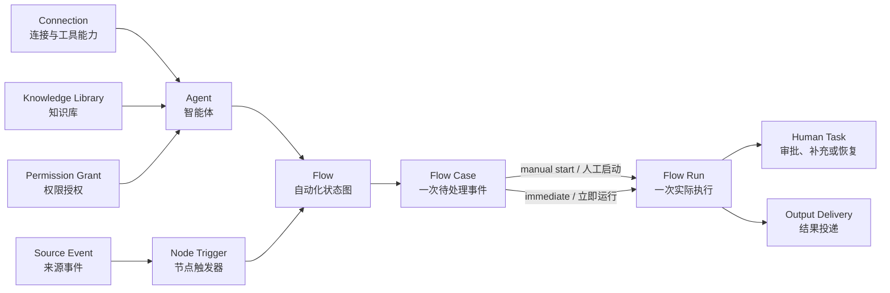
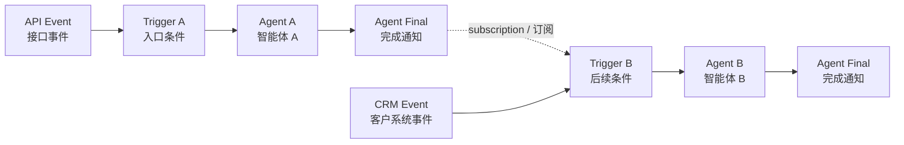
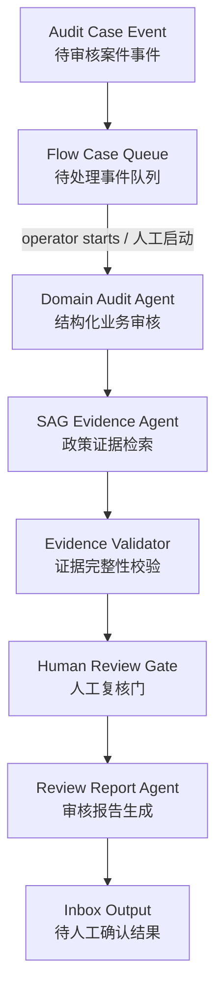

# OpenTopia Agent 与 Flow 设计方案

> 状态：Flow 单一产品模型实施基线 v3.0
> 日期：2026-08-28
> 参考：OpenAI Frontier 的控制面布局、LangGraph 的状态图语义
> 核心目标：先稳定跑通单 Agent、Flow 创建、事件待审、启动和完整运行

## 1. 已确认的产品原则

1. 用户直接创建 `Agent`，不需要理解 Agent Template。不可变 Agent 配置版本只作为内部实现存在。
2. 多数任务优先用单 Agent；只有需要事件驱动、分支/汇合、长时间状态或人工门时才使用 Flow。
3. `Flow` 是唯一面向用户的自动化对象。创建、配置、测试、激活、暂停、复制都在 Flow 上完成。
4. Flow 不拥有额外的全局 Trigger；能进入图的节点 Trigger 决定入口。默认入口通常是第一个 Agent 节点。
5. 后续 Agent 的 Trigger 也可以是 API、定时器、Connection Event，或上游 Agent 的 Final 完成通知。
6. Flow 的顺序由订阅关系形成，支持链、分支、汇合和有终止条件的环，不限定为线性流程。
7. 一次事件产生一个 `Flow Case`。同一个 Flow 被触发 N 次，对应 Case 1…N；真正开始执行后，每个 Case 关联一个 `Flow Run`。
8. Trigger 可以设置 `立即运行` 或 `等待人工确认`。等待确认的事件进入 Inbox，用户点击启动后才创建 Run。
9. Connection 类似带账号和授权上下文的 MCP 服务，向 Agent 暴露工具；工具结果不需要预先拼入提示词。
10. 事件参数保留来源原始结构。提示词通过 `@Flow.input` 和 `@Trigger.input` 引用，Agent 需要详情时再调用 Connection 工具。

旧的独立发布、部署和发布通道产品层已移除，不提供兼容入口。稳定性改由 Flow 内部不可变 Revision 和 Case 冻结快照保证。

## 2. 核心领域模型



图中英文对应代码/协议名，中文对应界面含义：

- `Connection`：账号、远端服务、MCP 工具和授权范围的组合；
- `Agent`：Instructions、Connections、Knowledge、Permissions、Tools 和 Final schema 的稳定业务身份；
- `Flow`：Agent 和控制节点构成的状态图，也是用户创建和复用的唯一自动化对象；
- `Flow Case`：某个 Flow 接收到的一次业务事件，可等待人工启动；
- `Flow Run`：Case 开始后产生的实际执行，固定使用 Case 保存的 Flow Revision；
- `Human Task`：执行中的审批、中断恢复、补充输入或输出复核；
- `Output Delivery`：Inbox、Webhook 或 Connection 写操作等结果投递。

### 2.1 Flow 内部版本

```text
Flow（稳定业务身份）
  ├── status: active | paused
  ├── activeRevision（当前不可变执行版本）
  │     ├── compiledGraph
  │     ├── frozenAgentSpecs
  │     ├── trigger
  │     ├── ingressPolicy
  │     ├── output
  │     └── contentHash
  └── revision（Flow 管理操作的 CAS 版本）
```

激活新草稿会替换 `activeRevision`，但已经进入队列的 Case 仍保存旧 Revision。这样无需单独的 Deployment，也能保证“事件进入时看到的配置”和“稍后人工启动时执行的配置”完全一致。

### 2.2 Case 与 Run

```text
Source event
  -> accept and deduplicate
  -> FlowCase(status = accepted, frozen FlowRevision, immutable input)
  -> ingressPolicy == require_review ? stay in Inbox : start immediately
  -> FlowRun(status = running/...)
  -> HumanTask when needed
  -> Output delivery
```

Case 使用 `(flowId, idempotencyKey)` 去重。同一个 key 且输入相同返回原 Case；同一个 key 但输入不同必须拒绝，不能静默覆盖或重复产生副作用。

## 3. Trigger 与图语义

### 3.1 Trigger 属于节点



`Agent Final` 直接复用 Agent Loop 的完成结果和完成通知，不创建新的 Final Trigger 类型。界面把“订阅上游 Final”显示在后续节点的 Trigger 区域，因为用户配置的是该节点何时启动。

### 3.2 多来源表达式

Trigger 表达式支持 `AND / OR / NOT`：

```text
OR(
  AgentFinal("risk_check"),
  AND(Api("manual_override"), NOT(ConnectionEvent("account_locked")))
)
```

运行时规则：

- 根节点外部事件：`@Trigger.input == @Flow.input`；
- 上游 Final：`@Trigger.input` 是该 Final 的结构化产物；
- 多个 Final 汇合：`@Trigger.input` 是以来源节点 ID 为 key 的对象；
- `@Flow.input` 在整次 Run 中保持不变，所有 Agent 都知道自己正在处理哪个原始事件；
- 边负责数据投影和依赖，Trigger 负责真正的激活条件。

### 3.3 事件原始参数

邮件、CRM、ERP、Webhook 和 API 的参数不强制转换成统一大 Schema。入口适配器只负责来源鉴权、提取幂等键和保存原始 payload：

```json
{
  "messageId": "msg_123",
  "customerId": "cus_456",
  "subject": "需要修改收货地址"
}
```

Agent 可直接读取已有字段；需要邮件全文或客户详情时，通过 Connection 暴露的 MCP 工具按 ID 查询。Instructions 可以说明何时使用工具，但系统不把工具调用结果静态复制进提示词。

## 4. 创建与运行流程

### 4.1 单 Agent

1. 用户进入 Agents，点击新建。
2. 中间区使用自然语言描述需求。
3. Agent Loop 调用受控创建工具生成/修改配置。
4. 右侧实时显示 Instructions、Connections、Knowledge、Permissions、Tools、Trigger 和 Final schema。
5. 用户测试并保存 Agent。
6. 如果 Agent 自带外部 Trigger，事件同样可以先形成待处理 Case，再人工启动。

本阶段只保证单 Agent 路径；现有多 Agent 框架保持独立，不并入本次产品流程。

### 4.2 Flow

1. 用户进入 Flow，点击创建，中央页面切换到新的 Flow 编辑页。
2. 创建时即配置入口 Agent 的 Trigger 和 `立即运行/等待确认`，不能创建完成后才临时补 Trigger。
3. 从已有 Agent 目录添加节点，通过图形化边和 Trigger 订阅配置时序。
4. 点击节点进入该 Agent 的独立设置页；左上角返回回到原 Flow 图，Agent 与 Flow 仍高度解耦。
5. 运行静态校验、模拟和真实 Test Run。
6. 点击激活，Flow 保存不可变 Active Revision；之后可以暂停、继续或复制。
7. 外部事件到达时创建 Case。需人工确认的 Case 出现在 Inbox，立即模式则自动创建 Run。
8. 用户从 Case 查看原始输入、冻结版本、运行状态、人工任务、节点产物和最终输出。

复制 Flow 会生成新草稿，并默认把自动入口改为手动确认，避免复制后意外监听同一个生产事件源。

## 5. UI 信息架构

固定一级导航：

```text
Overview / 总览
Inbox / 待处理
Agents / 智能体
Flows / 工作流
Runs / 运行记录
Connections / 连接
Trust / 权限与风险
Knowledge / 知识库
```

不再展示独立 Deployments 或 Automation 一级入口。

### 5.1 页面切换和返回

- 新建 Agent、新建 Flow、编辑节点 Trigger 等复杂操作使用中央页面切换，不堆叠大弹窗；
- 返回按钮统一放在标题最左侧；
- 标题后展示路径，例如 `Flows / 创建 Flow`、`Flows / 工伤审核 / 结构化审核 Agent`；
- 返回时恢复原页面的搜索、筛选、滚动位置和已选节点；
- URL/route 保存 `section + objectId + subpage`，支持通知 deep link。

### 5.2 Frontier 风格三栏

```text
┌──────────────────┬────────────────────────────────────┬──────────────────────┐
│ Global navigation│ Main editor / cases / run timeline │ Live configuration   │
│ 全局一级导航      │ 主编辑区、事件列表、运行时间线       │ 实时配置与权限预览     │
└──────────────────┴────────────────────────────────────┴──────────────────────┘
```

- 左侧保持稳定一级导航和当前集合；
- 中间是 Agent Instructions、Flow Graph、Case 列表或 Run 时间线；
- 右侧实时显示 Resources、Connections、Knowledge、Permissions、Trigger 和 Final；
- 表单容器只有一层视觉边框，Select/Input 自身不再套重复卡片边框；
- 所有图标按钮都有可见焦点和 `aria-label`，颜色、间距、圆角只使用设计系统 token。

### 5.3 多次触发在哪里显示

- Flow 列表只显示稳定 Flow 本身；
- Inbox 显示 `accepted` 且等待人工启动的 Case；
- Flow 详情的 Cases 页显示该 Flow 的 Case 1…N；
- Runs 显示已启动的执行；
- Case 详情同时展示输入和关联 Run，因此不会把模板身份与执行实例混在一起。

## 6. Connection、Knowledge 和权限

Connection 是固定一级配置入口，一个 Connection 至少包含：

- Provider/MCP Server 身份；
- 登录账号、tenant/workspace 与 credential reference；
- 已发现的 Tools，以及每个工具的输入/输出 Schema；
- Agent 可使用的操作级 grant；
- 健康状态和被哪些 Agent/Flow 引用的影响范围。

密码、OAuth token 和 API key 必须只存 Vault 引用，不能复制进 Agent 或 Flow Revision。运行时从 Flow Revision 固定的 Agent capability 获取工具授权，再由当前 Connection 注入凭据；权限只能收窄，不能因 Thread 或模型请求而扩大。

SAG 知识库使用独立 namespace 隔离业务：

- `opentopia.audit.work-injury.v2`：工伤医疗审核政策知识；
- `opentopia.audit.credit-review.v1`：信贷审核政策知识。

案件数据不是知识源。案件是被审核的事件，进入对应 Flow 的 Case 队列；知识库只保存政策、规则和说明文档。

## 7. 工伤与信贷审核 Demo

两个审核项目统一映射为新架构：



- 工伤 Flow 和信贷 Flow 各有自己的 Agent、Connection、SAG namespace 和事件 Trigger；
- 入口策略为 `require_review`，Demo 案件批量进入 Inbox，不自动执行；
- Agent 都能读取同一个不可变 `@Flow.input`；
- 后续 Agent 通过 `@Trigger.input` 接收上游产物；
- 报告只提供人工审核辅助，不自动做赔付、授信、拒贷等高风险最终决定；
- 真实验收固定使用 NowCoding Connection 的 `gpt-5.6-terra`，不使用 TokenHub。

## 8. API 与存储边界

核心 API：

```text
GET  /api/flows
GET  /api/flows/:flowId
POST /api/flow-drafts/:draftId/activate
POST /api/flows/:flowId/pause
POST /api/flows/:flowId/resume
POST /api/flows/:flowId/copy
POST /api/flows/:flowId/invoke
POST /api/flow-events
GET  /api/flow-cases
POST /api/flow-cases/:caseId/start
POST /api/flow-cases/:caseId/supersede
GET  /api/flow-runs/:runId
```

核心表：

```text
flows                    -- 稳定 Flow 与当前 Active Revision
flow_cases               -- 事件、幂等键、冻结 Revision、关联 Run
flow_runs                -- 实际状态图执行
flow_checkpoints         -- Run 检查点
flow_pending_writes      -- superstep 待提交写入
human_tasks              -- 审批、恢复、补充输入和输出复核
flow_delivery_receipts   -- 输出投递状态
flow_evaluations         -- 运行评估
```

新迁移会删除旧自动化产品表和旧格式 Run。生产迁移前必须备份数据库；Demo Case 通过新 Flow API 重新导入。

## 9. 当前核心范围与后续范围

当前必须跑通：

- 单 Agent 创建/配置和真实执行；
- Flow 图创建、节点 Trigger、校验、模拟、Test Run 和激活；
- `require_review` 与 `immediate` 两种事件入口；
- Case 去重、冻结 Revision、人工启动并创建 Run；
- Agent Final 订阅、分支/汇合、人工任务和 Inbox 输出；
- 工伤/信贷独立 SAG、Connection、55 个 Demo Case 入队；
- 至少一个 NowCoding `gpt-5.6-terra` 真实案例成功。

不阻塞核心流程的后续能力：

- 完整 OAuth 回调、Vault 自动轮转、远程 HTTP MCP；
- MCP Resources/Prompts 发现和字段级权限；
- Connection 影响分析索引与失效后自动 Reconnect HumanTask；
- 长期 Event/Checkpoint 查询、Replay/Fork；
- 分布式 Worker、Lease/Heartbeat；
- 第三方副作用 Exactly-once 和通用补偿事务；
- 企业组织、部门、队列路由、SLA、升级、DLP、法务和真正多租户治理；
- 前台像素、焦点与完整人工交互验收。

这些能力可以继续建立在 `Flow -> Case -> Run` 边界上，不应重新引入已经移除的独立部署层。
