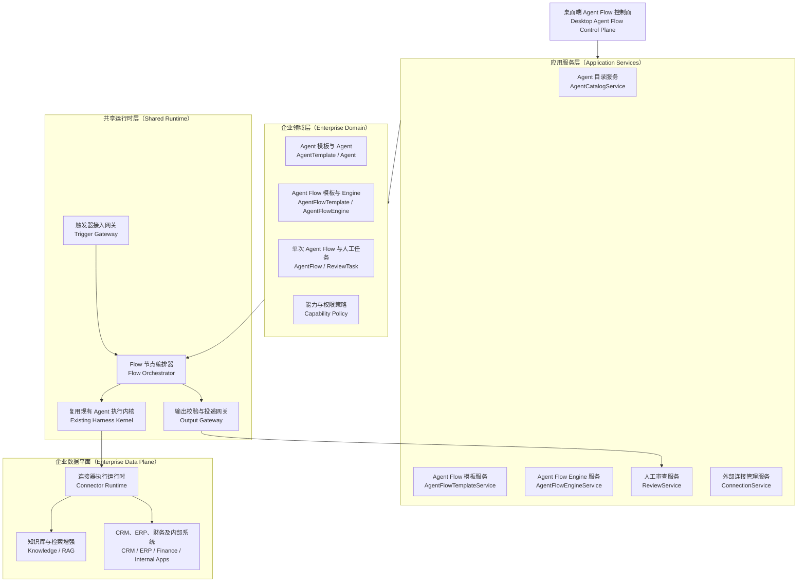

# OpenTopia Agent / Agent Flow 模式重构设计方案

> 状态：设计提案 v1.1
> 日期：2026-08-17
> 输入：`Flow模式重构.md`、当前仓库实现、`docs/enterprise-agent-platform-design-zh-cn.md`
> 范围：企业 Agent 与 Agent Flow 控制面、模板、Engine、触发器、输出、连接器权限、人工审查和桌面 UI

## 1. 结论

Flow 模式不应继续被定义成“对话旁边的一块流程 JSON/Trace 面板”，而应升级为企业 Agent 的控制面。产品对象以两条创建链为核心：

```text
Agent Template
  ├── 创建独立 Agent -> 可直接对话、执行任务
  └── 创建 Flow Agent -> 进入 Agent Flow Template

Agent Flow Template
  = Flow Agents + 编排关系 + Trigger + Output
  -> 跑通并激活为 Agent Flow Engine
  -> Trigger 被触发后创建 Agent Flow
  -> 需要人工时创建 ReviewTask / Inbox
```

这里有五个需要严格区分的产品对象：

1. `AgentTemplateVersion`：Agent 的完整可复用配置；
2. `Agent`：由 Agent Template 创建、可独立对话的 Agent；
3. `AgentFlowTemplateVersion`：由一个或多个 Flow Agent、编排关系、触发器和输出接口组成的模板；
4. `AgentFlowEngine`：Agent Flow Template 跑通后创建的、已激活且等待触发的执行实例；
5. `AgentFlow`：Engine 每次被触发后创建的一次具体执行。

推荐保留当前已经实现的 `AgentTemplateVersion`、`AgentInstance`、`FlowDraft`、`FlowDefinition`、`FlowRun`、静态校验、试运行和不可变发布，在其上补齐四个缺失层：

1. `OrgUnit`：部门或项目的企业业务边界；
2. `AgentFlowEngine`：将 Agent Flow Template 激活为可接收 Trigger 的执行实例，内部可复用现有 `FlowDeployment` 语义；
3. `ConnectorOperationGrant`：连接器操作级、默认拒绝的确定性权限；
4. `ReviewTask`：与 Run 解耦、可聚合 Agent 和非 Agent 工作项的人工协同对象。

`AgentFlowEngine` 是一等产品对象，表示“哪个模板版本已经在什么部门和环境中被激活”。它不是一套独立进程或一份复制的 Harness；所有 Engine 仍由共享 `FlowRuntime` 调度执行。这样既保留用户可理解的 Engine 概念，也不会把每个 Engine 实现成一套新的运行基础设施。

## 2. 当前实现判断

### 2.1 已经具备的基础

当前代码不是从零开始：

- `enterprise.rs` 已有默认拒绝、只允许收窄的 `CapabilityProjection`；
- 已有不可变的 Agent 模板版本、能力差异和实例化；
- `flow.rs` 已有 FlowDraft、FlowDefinition、FlowTrial、Graph 节点/边、受控循环和校验；
- `flow_runtime.rs` 已有 FlowRun、NodeRun、暂停、恢复、审批等待和 Transcript；
- 服务端已有 Agent 模板和 Flow 的创建、验证、模拟、发布、运行 API；
- Desktop 已有 Flow 模式、Agent 模板面板和运行 Trace。

因此本次重构应增加企业控制面，不应重写 Harness、模型循环、工具注册、Flow 校验器或节点执行器。

### 2.2 根因与缺口

当前实现的主要问题不是某个组件缺字段，而是产品对象边界还不完整：

| 现状 | 根因 | 结果 |
| --- | --- | --- |
| FlowDraft、发布 Flow 和 Run 集中在同一个面板 | Template、Engine、AgentFlow 没有独立产品入口 | 配置密集、对象关系不清晰 |
| 直接编辑 Flow spec JSON | 领域对象没有形成业务化编辑器 | 只有开发者可用，难以审查权限和数据流 |
| Agent 模板用逗号列表和 JSON 配资源 | 能力目录没有被产品化 | 无法看见 App 的操作级权限和来源 |
| 已发布 Flow 可直接在会话中启动 | 缺少 Agent Flow Engine | 无法把跑通的模板激活为稳定、可触发的执行实例 |
| Approval 只是 Run 的一种状态 | 缺少独立人工任务模型 | 无法形成统一 Inbox、分派、SLA 和审计 |
| Library、Plugin、MCP、App 概念并列 | 包、连接实例、业务数据和授权没有分层 | 用户不知道“装了什么”“连了什么”“谁能做什么” |
| Flow 是右侧 Tool Stage | Flow 仍被当作会话的附属工具 | 无法承载企业运营工作台 |

当前 `ExperienceSurfaceProfile::Flow` 使用 unrestricted 能力，再依赖后续上下文收窄。对 Flow 设计态来说边界过宽。设计会话默认只应看见目录、设计、验证、模拟和发布工具；生产操作必须通过独立 Trial 或 AgentFlowEngine 的执行快照获得。

## 3. 统一术语与领域模型

### 3.1 企业范围

```text
EnterpriseWorkspace
└── OrgUnit（type = department | project）
    ├── Agents
    ├── AgentFlowTemplates
    ├── AgentFlowEngines
    ├── Connections / Knowledge
    ├── AgentFlows / Cases
    └── ReviewTasks
```

不建议直接复用当前 `Project` 表示部门。当前 `Project` 的语义是本地工作目录和会话分组，带 `workspace_root`；企业部门/项目是身份、策略、连接和运行数据的治理边界。两者可以建立显式关联，但不应使用同一实体承担两种职责。

推荐领域名为 `OrgUnit`，UI 可根据 `kind` 显示“部门”或“项目”。

### 3.2 AgentTemplateVersion：岗位模板

Agent Template 是 Agent 的完整可复用配置来源，不代表正在工作的身份。它同时用于创建独立 Agent，也用于创建 Agent Flow Template 内部的 Flow Agent：

- 名称、职责、指令和完成条件；
- 允许的模型策略；
- Skill、Plugin 和工具能力；
- 已绑定的 Library、知识库与允许检索的数据范围；
- 已连接的 CRM、ERP、财务系统、数据库、MCP 或其他外部 Connection；
- 每个 Connection 上允许使用的工具、操作、资源和字段范围；
- 输入、输出和持久状态 schema；
- 委派范围、预算、风险等级和审批规则；
- 所有者、审阅者、版本和发布状态。

模板可以保存具体 `LibraryBindingRef` 和 `ConnectionBindingRef`，因为这正是创建 Agent 时需要复用的配置。引用中只保存 Connection ID、能力和范围，不复制明文凭证；凭证继续由 Connection/Vault 管理。模板发布后固定这些引用及其授权版本，创建 Agent 时再生成不可变的 `AgentConfigSnapshot`。

```text
AgentTemplateFactory
  ├── createStandaloneAgent(templateVersion)
  └── createFlowAgent(templateVersion, flowTemplateId, roleKey)
```

两条路径使用相同的 Agent 配置契约。区别只是归属和生命周期：独立 Agent 可以直接对话；Flow Agent 属于某个 Agent Flow Template，负责工作流中的一个角色。

### 3.3 Agent：AI 员工

建议把当前对外名称 `AgentInstance` 简化为 `Agent`，代码内部可保留兼容名称。它代表一个可以被分配工作的稳定身份：

- 固定引用已发布的模板版本；
- 属于一个 `OrgUnit`；
- 有独立身份、状态、记忆范围、预算和审计；
- 可以独立接受用户对话，也可以被显式分配给其他业务对象；
- 实际权限是模板上限与当前环境授权的交集；
- 模板升级不会静默改变既有 Agent，必须显式升级并生成权限 Diff。

打开 Agent 对话时，系统从 `AgentConfigSnapshot` 投影其 Library、Connection、Skill 和工具目录，因此用户不需要在每个会话中重新配置。Agent 的对话记录和运行状态属于 Agent，不回写 Agent Template。

### 3.4 AgentFlowTemplateVersion：Agent 工作流模板

Agent Flow Template 定义一个可复用业务过程。它由 Agent、触发器、编排关系和输出组成：

- 一个或多个 `FlowAgent`；每个 Flow Agent 都由某个 `AgentTemplateVersion` 创建；
- Trigger 接口、输入 schema、认证和过滤契约；
- Output 接口、输出 schema 和投递契约；
- Agent 节点之间的依赖、分支、并行、循环和审批关系；
- Agent、Skill、Tool、Condition、Validator、Approval、Join、Loop、Output 节点；
- 错误、重试、超时、补偿和人工升级策略；
- 连接器和知识能力需求；
- 预算、风险和评测门槛；
- 不可变版本和内容哈希。

一个 Flow Agent 至少包含 `role_key`、来源 Agent Template 版本、在该 Flow 中的职责和允许继续收窄的覆盖配置。它可以在设计时呈现为一个“Agent”，但此时不运行，也没有生产会话状态。

```text
AgentFlowTemplateVersion
  trigger_contracts[]
  flow_agents[]
    - role_key
    - source_agent_template_version
    - agent_config_snapshot
    - flow_specific_overrides
  graph
  output_contracts[]
```

这保证 Agent Template 是唯一配置来源，同时避免让一个模板直接持有正在运行、会产生状态的 Agent。Agent Flow Engine 创建时，Flow Agent 才被物化成 Engine 范围内的 Agent 身份；每次 Agent Flow 再建立独立 Run Context。

### 3.5 AgentFlowEngine：已激活的工作流引擎

`AgentFlowEngine` 是 Agent Flow Template 跑通、验证并激活后的执行实例。它回答“哪个模板版本正在什么部门和环境中等待触发”：

```text
AgentFlowEngine
  agent_flow_template_version
  org_unit
  environment
  materialized_agents[]
  trigger_endpoints[]
  output_endpoints[]
  review_policy
  runtime_policy
  release_state
```

状态建议：

```text
draft -> validating -> ready -> active -> paused -> retired
                    \-> blocked
```

Engine 创建时生成不可变 `EngineSnapshot`，固定 Agent Flow Template、内部 Agent 配置、Library/Connection 引用、Trigger 和 Output。所有新 Agent Flow 固定引用该快照；修改配置产生新 Engine revision，不能改写已经开始的 Agent Flow。

业务概念叫 `AgentFlowEngine`；内部应用层可以继续使用 `FlowDeployment` 作为实现类型或迁移兼容名。Engine 的 `active` 仅表示可接收触发，不代表独占线程或常驻 Harness。

### 3.6 AgentFlow / Case：一次业务执行

Trigger 命中 Agent Flow Engine 后创建一个 `AgentFlow`。`FlowRun` 是其内部技术实现，`Case` 是面向运营人员的业务视图。MVP 可以共用 ID 和表，但 API/ViewModel 应区分三个视角：

- `AgentFlow`：用户可理解的一次工作流执行；
- `FlowRun`：图快照、节点、状态机、预算、事件和检查点；
- `CaseView`：业务标题、关键字段、当前负责人、SLA、结果和待处理事项。

推荐导航三级结构：

```text
部门 / 项目
  -> Agent Flow Engines
  -> Agent Flows / Cases
```

### 3.7 ReviewTask：人工任务

Inbox 是一个查询和工作界面，不应成为所有输出数据的事实源。事实源是可独立分派和审计的 `ReviewTask`：

```text
ReviewTask
  type: approval | output_review | exception | data_correction | manual
  source_type: flow_run | external_event | manual
  source_ref
  org_unit
  assignee / candidate_group
  priority / due_at / sla
  reason_code
  evidence_snapshot
  decision_schema
  continuation_ref?
  status
```

一个 AgentFlow 可以产生多个 ReviewTask；一个 ReviewTask 的决定通过幂等 continuation 恢复对应节点。

文档提出“所有 Agent Flow 输出统一进入 Inbox”。MVP 可以把 `review_mode=all` 设为默认，但领域模型应从一开始支持：

- `all`：全部人工审查；
- `risk_based`：由确定性风险规则决定；
- `sampled`：按比例抽检；
- `exceptions_only`：仅异常和低置信度；
- `none`：仅低风险且策略允许。

高风险和带副作用输出仍由平台策略强制审查，Agent Flow Engine 不能关闭。

## 4. Apps、Plugin、Connection 与知识库

### 4.1 四层模型

```text
Plugin / ConnectorProvider
  -> ConnectorManifest + OperationCatalog
  -> Connection（某个企业账号、环境和凭证）
  -> CapabilityGrant（谁可以调用哪些操作）
```

- `Plugin`：安装到平台的能力包，可能提供 Skill、工具或 Connector Provider；
- `ConnectorManifest`：描述 App 类型、认证方式、资源和操作目录；
- `Connection`：CRM/ERP/财务系统的具体企业连接实例；
- `ConnectorOperationGrant`：对操作、资源范围、字段、用途和风险的授权。

知识库单独建模：

```text
KnowledgeSource -> KnowledgeBase -> KnowledgeGrant
```

`KnowledgeSource` 负责同步，`KnowledgeBase` 是可检索集合，`KnowledgeGrant` 约束查询范围、数据等级和可导出字段。不要把 RAG 资料与可写业务 App 都塞进一个泛化 Library 字符串列表。

### 4.2 Apps 权限在哪里配置

Agent Template 是配置 Library 和 Connection 的主入口；Connector 侧只提供可选操作目录和组织级安全上限：

1. Connector 侧定义它有哪些操作、各操作的风险和该 Connection 的组织级上限；
2. Agent Template 直接选择具体 Library、Connection 以及允许的操作、资源和字段范围；
3. 创建独立 Agent 或 Flow Agent 时完整复用这些绑定，生成固定配置快照；
4. Agent Flow Template 可以按 Flow Agent 或节点继续收窄，但不能扩权；
5. Agent Flow Engine 固定最终配置版本；
6. Runtime 在每次调用前做确定性校验。

```text
effective_app_operations =
  connector_operation_catalog
  ∩ connection_admin_policy
  ∩ initiating_principal_grant
  ∩ agent_template_ceiling
  ∩ agent_config_snapshot
  ∩ flow_agent_or_node_grant
  ∩ engine_snapshot
  ∩ runtime_risk_policy
```

因此不存在“Agent 模板还没创建，App 怎么配置”的循环：先在 Connections 中创建 CRM、ERP 等真实连接，Connection 根据 Connector Manifest 暴露操作目录；然后在 Agent Template 中选择这个连接和允许的操作。没有可用 Connection 时，模板可以保存草稿，但不能发布为可实例化版本。

UI 中以 Agent Template 的 `Libraries` 和 `Connections` 页作为配置主入口；Connections 页面展示连接健康、组织级上限和反向引用，例如“哪些 Agent Template、Agent Flow Template 和 Engine 正在使用此操作”。

### 4.3 操作级权限示例

```json
{
  "capabilityId": "crm.customer",
  "operations": ["read", "search", "update_status"],
  "resourceScope": { "region": ["cn-east"], "team": ["enterprise-sales"] },
  "fieldAllow": ["id", "name", "status", "owner"],
  "fieldDeny": ["personal_phone", "identity_number"],
  "purpose": "lead-qualification",
  "maxClassification": "confidential",
  "approval": { "requiredFor": ["update_status"] }
}
```

不要只授权 MCP server 或 Plugin ID。那只能回答“能不能看见这个工具集合”，不能回答“CRM 里可以读客户还是可以删除客户”。

## 5. 触发器与输出端口

### 5.1 Agent Flow Template 定义接口，Engine 将接口激活

Agent Flow Template 必须包含 Trigger 和 Output。模板定义逻辑接口、schema 和行为契约：

```text
TriggerPort(name, input_schema, semantic_contract)
OutputPort(name, output_schema, delivery_semantics)
```

创建 Agent Flow Engine 时，将模板中的接口激活为真实端点：

- Trigger：manual、webhook、schedule、event_subscription、poll；
- Output：Inbox、Webhook、App operation、消息通道、Artifact、调用方响应。

Agent Flow Template 可以保存接口类型和逻辑配置，但不得复制明文凭证、真实 Webhook secret 或其他秘密；Agent Flow Engine 的 `EngineSnapshot` 保存端点引用和凭证句柄。

### 5.2 触发链路

```text
接收事件
  -> 认证来源
  -> 规范化为 TriggerEnvelope
  -> 幂等键去重
  -> 输入 schema 校验
  -> 过滤与速率限制
  -> 解析 EngineSnapshot
  -> 创建 AgentFlow / FlowRun
```

过滤可以由外部系统先做，但平台仍必须完成认证、schema、幂等、租户边界和限流校验，不能把外部过滤视为信任边界。

### 5.3 输出链路

```text
节点输出
  -> output schema 校验
  -> 数据分级与 DLP
  -> ReviewPolicy
  -> 创建 ReviewTask 或直接投递
  -> Connector 操作级鉴权
  -> 幂等投递
  -> 保存 DeliveryReceipt
```

每个有副作用的输出都必须声明幂等键和失败处置。首版不实现通用分布式补偿事务，失败后进入 ReviewTask，由人工核对外部状态再重试。

## 6. 目标架构



依赖规则：

- UI 和 `flow_*` 模型工具调用同一 Application Service；
- Application Service 负责用例和事务，不复制权限逻辑；
- Domain 不依赖 React、Axum、SQLite、具体 Connector 或模型 Provider；
- Flow Orchestrator 只协调节点，不拥有第二套 Agent Loop；
- 所有 Agent 节点继续进入现有 Harness Kernel；
- Connector Runtime 是企业系统的执行边界；
- 审计事件先持久化，再更新投影和通知 UI。

## 7. 推荐 API

在现有 API 旁增加缺失资源，并让 UI 与模型工具复用同一服务：

```text
/api/enterprise/org-units
/api/enterprise/agent-templates
/api/enterprise/agents
/api/enterprise/agent-flow-template-drafts
/api/enterprise/agent-flow-templates
/api/enterprise/agent-flow-engines
/api/enterprise/agent-flows
/api/enterprise/review-tasks
/api/enterprise/connector-manifests
/api/enterprise/connections
/api/enterprise/knowledge-bases
/api/enterprise/audit-events
/api/enterprise/evaluations
```

关键动作：

```text
POST /agent-flow-templates/{id}:run-trial
POST /agent-flow-engines/{id}:validate
POST /agent-flow-engines/{id}:activate
POST /agent-flow-engines/{id}:pause
POST /agent-flow-engines/{id}:test-trigger
POST /review-tasks/{id}:claim
POST /review-tasks/{id}:decide
POST /connections/{id}:test
GET  /connections/{id}/effective-usage
GET  /agents/{id}/effective-capabilities
```

所有写操作带 `Idempotency-Key` 和 `expectedRevision`。列表、搜索、事件和对象读取都以 `enterprise_workspace_id + org_unit_id` 为强制边界。

## 8. 持久化建议

首版需要新增或规范化以下关系：

```text
enterprise_workspaces
org_units

agent_templates
agent_template_versions
agents
agent_assignments

connector_manifests
connector_operations
connections
capability_grants
knowledge_sources
knowledge_bases
knowledge_grants

agent_flow_template_drafts
agent_flow_template_versions
flow_agents
agent_flow_engines
agent_flow_engine_revisions
trigger_bindings
output_bindings

agent_flows
flow_runs
flow_node_runs
review_tasks
review_decisions
delivery_receipts
audit_events
```

Graph、schema 和策略可以继续用版本化 JSON 文档存储，但经常查询、关联和授权的字段必须规范化，例如 `org_unit_id`、版本、状态、角色绑定、Connection、操作 ID、assignee、SLA 和风险等级。

## 9. 桌面 UI 信息架构

### 9.1 产品定位

Flow 模式应是与 Code/Work 同级的完整 Surface，而不是右侧工具页。整体继续使用 OpenTopia 已有三栏骨架，但职责改为：

```text
┌────────────────────┬───────────────────────────────────────┬────────────────────────────┐
│ 对象导航           │ 主工作区                              │ 上下文 Inspector           │
│                    │                                       │                            │
│ Overview           │ 列表 / 对话式设计 / Graph / Timeline │ 当前对象配置               │
│ Inbox              │                                       │ 权限与数据                  │
│ Agents             │                                       │ 验证、风险与版本 Diff       │
│ Flow Templates     │                                       │ Trace / Evidence / Audit    │
│ Flow Engines       │                                       │                            │
│ Agent Flows        │                                       │                            │
│ Context            │                                       │                            │
│ Trust              │                                       │                            │
└────────────────────┴───────────────────────────────────────┴────────────────────────────┘
```

左侧按业务任务分组，避免平铺十几个同级入口：

- **Operate**：Overview、Inbox、Agent Flow Engines、Agent Flows；
- **Build**：Agents、Agent Flow Templates；
- **Context**：Connections、Knowledge；
- **Trust**：Permissions、Evaluations、Audit。

这对应企业 Agent 平台的四个稳定心智模型：业务上下文、生产执行、经验改进、信任治理。它借鉴 OpenAI Frontier 的产品方向，但不假设或复刻其未公开的内部界面。

### 9.2 Overview

Overview 是运营面板，不是营销首页：

- 活跃 Agent Flow Engines、今日 Agent Flows、成功率、P95 时长；
- 待审数量、逾期 SLA、高风险待办；
- 异常 Engine 和 Connection 健康；
- 最近版本发布和权限变更；
- 一条主操作：`新建 Agent` 或 `新建 Agent Flow Template`，根据当前空状态决定。

避免用大面积渐变、插画或无行动意义的指标卡。

### 9.3 Agent 模板与 Agent

Agent 页面使用列表—详情结构，并把“模板”和“员工”作为两个视图：

```text
Agents
  [AI 员工] [岗位模板]

岗位模板详情：
  Overview | Instructions | Libraries | Connections | Tools | Guardrails | Versions

AI 员工详情：
  Chat | Identity | Effective configuration | Activity | Memory | Audit
```

创建模板有两种入口：

1. “描述这个岗位”——自然语言生成草稿；
2. “手动配置”——结构化表单。

`Libraries` 直接选择 Agent 可以检索的知识库；`Connections` 直接选择 CRM、ERP 等连接，并按 App/资源分组展示 operation checkbox、范围、字段和审批要求。底部始终显示模板配置与最终有效配置的 Diff。

打开某个 Agent 后，`Chat` 是首要入口。对话 Composer 上方用紧凑摘要显示当前 Agent 已拥有的 Library、Connection 和工具；详细配置只在 Inspector 展开，不要求用户每次重新选择上下文。

### 9.4 Agent Flow Template Designer

Agent Flow Template 设计继续以对话为主要入口，Graph 是可审查的中间表示。设计过程中添加的每个 Flow Agent 都必须选择一个 Agent Template 作为来源：

```text
┌──────────────────────────────┬──────────────────────────────┐
│ 对话与设计记录               │ Graph / Inspector            │
│                              │                              │
│ 描述目标、Agent、条件        │ 当前版本、节点与验证状态     │
│ Agent 澄清少量关键问题       │ 选择节点后编辑关键字段       │
│ 生成/修改 Flow Template      │ Agent Template、输入输出     │
│ Trial、错误和发布进度        │                              │
└──────────────────────────────┴──────────────────────────────┘
```

关键规则：

- 默认不显示原始 JSON；在“高级”抽屉中只读查看，具备权限时才允许编辑；
- Graph 支持选中和关键字段修改，不要求用户拖拽连线才能完成设计；
- 添加 Agent 节点时使用 `从 Agent Template 创建`，并显示继承的 Library、Connection 和工具摘要；
- Agent Flow Template 顶部固定展示 Trigger 和 Output，两者不是可省略的普通节点；
- 节点使用一致的 Lucide 图标、类型标签和状态，不用彩虹色区分；
- 校验错误同时显示在 Graph、Inspector 和可跳转的问题列表；
- 发布按钮旁明确显示 Trial、审批和未决问题是否通过。

### 9.5 Agent Flow Engine Builder

将已经跑通的 Agent Flow Template 创建为 Engine，使用可返回的五步流程并自动保存草稿：

1. 选择已通过 Trial 的 Agent Flow Template 版本和目标部门/项目；
2. 将模板中的 Flow Agents 物化为 Engine Agents，并展示来源 Agent Template；
3. 验证每个 Agent 继承的 Library、Connection、工具和权限仍然有效；
4. 激活 Trigger、Output endpoint 与 ReviewPolicy；
5. Dry Run、权限 Diff、风险检查并激活。

右侧固定显示 `Engine readiness`：Agent Template 失效、Connection 异常、Trigger 未认证、Output 无幂等、扩权和未通过测试。`激活 Engine` 是唯一主操作。

### 9.6 Agent Flows / Cases

列表默认展示业务字段，不以内部 UUID 为主：

- Case 标题、Engine、状态、当前步骤、负责人；
- 触发时间、持续时间、SLA；
- 风险、需要人工、输出状态；
- 可保存的筛选器和按状态分组。

Agent Flow 详情为时间线：Trigger → Agent/Tool 节点 → Validator → Review → Output。节点展开后展示输入摘要、工具调用、结果、Evidence 和错误；隐藏模型私有推理。

### 9.7 Inbox

Inbox 使用高效率的列表—详情—决策布局：

```text
┌──────────────────────┬─────────────────────────────────────┬──────────────────────┐
│ Queue / Filters      │ Evidence & Case context             │ Decision             │
│                      │                                     │                      │
│ 我的 / 未分配 / 逾期│ 为什么需要人工                     │ 通过 / 拒绝 / 编辑   │
│ Approval / Output    │ 输入、输出、差异和来源              │ 备注、分派、升级     │
│ Exception / Manual   │ Flow 位置与影响范围                 │                      │
└──────────────────────┴─────────────────────────────────────┴──────────────────────┘
```

决定前必须看见：发起 Agent、代表谁行动、将调用哪个 App 操作、数据范围、不可逆影响和证据。拒绝必须可选原因；编辑后批准保存原值、修改值和决定者。

### 9.8 Connections 与 Knowledge

Connections 页面分为：

- Catalog：可用 CRM、ERP、数据库、消息和内部 App；
- Connections：真实账号/环境、健康和凭证状态；
- Operations：组织上限、风险、审批和使用情况；
- Usage：被哪些 Agent Template、Agent、Agent Flow Template 和 Engine 引用。

Knowledge 页面单独展示 Source、同步状态、索引、数据等级、检索范围和引用使用情况。

## 10. 视觉与交互规范

界面应遵守现有 `design-system/MASTER.md` 和 token，而不是引入一套“AI 紫色”主题：

- 工作区使用中性 surface、hairline border 和清晰分栏；
- 蓝色仅用于主操作、选择、焦点和链接；
- 绿/黄/红只表达状态，不作为装饰；
- 默认 14px 正文、12px 标签、11px 元数据；
- 32px 普通控件，28px 紧凑工具栏；
- 列表密度高但保持 4/8px 节奏，避免大卡片堆叠；
- transient UI 才使用阴影，常驻区域用 border；
- 微交互使用 120/180ms token，支持 reduced motion；
- 所有 icon-only 控件有 `aria-label`，Graph 和时间线可键盘导航；
- 状态不能只靠颜色，必须有文字或图标；
- 超过 300ms 的请求显示 skeleton/progress，异步按钮禁用并显示当前动作。

## 11. 代码组织建议

不要继续把所有 Flow UI 和状态塞进 `App.tsx` 或单一 `FlowWorkspacePanel.tsx`。建议形成独立 feature：

```text
apps/desktop/src/features/enterprise-flow/
  EnterpriseFlowSurface.tsx
  routes.ts
  api.ts
  viewModels.ts
  hooks/
  overview/
  inbox/
  agents/
  flow-templates/
  flow-engines/
  agent-flows/
  context/
  trust/
  components/
```

`App.tsx` 只负责模式切换、窗口骨架和 feature 挂载。feature 内使用现有 `components/ui`，共享的 ListDetail、InspectorSection、StatusBadge、ResourcePicker 等稳定后再提升为通用 primitive。

服务端建议增加 application 层，避免 HTTP handler、模型工具和 Store 各自拼接领域逻辑：

```text
crates/opentopia-core/src/enterprise/
  agents/
  capabilities/
  connectors/
  flow_templates/
  flow_engines/
  reviews/

crates/opentopia-server/src/enterprise/
  routes/
  services/
  events/
```

不要求为了目录整洁立即拆 crate；先通过接口和测试固定依赖方向。

## 12. 分阶段实施

### Phase 0：冻结领域契约

- 确定本文术语和 ID 边界；
- 建立 `AgentTemplate -> StandaloneAgent | FlowAgent -> AgentFlowTemplate -> AgentFlowEngine -> AgentFlow -> ReviewTask` 契约测试；
- 为配置复用、权限只收窄、版本不可变、EngineSnapshot、幂等触发和幂等决定建立不变量；
- 保留现有 API 行为，先增加 application service，不做 UI 大改。

退出条件：新实体职责明确，模型工具和 HTTP API 可调用同一服务。

### Phase 1：连接器操作目录与能力授权

- 引入 ConnectorManifest、OperationCatalog、Connection；
- 把 Agent Template 的 Plugin/MCP 字符串授权升级为结构化 LibraryBinding、ConnectionBinding 和 OperationGrant；
- 增加操作级权限、资源/字段范围和有效权限解释 API；
- Flow 设计态从 unrestricted 改为最小默认工具目录。

退出条件：能回答“这个 Agent 为什么能对哪个 App 的哪个对象执行哪个操作”。

### Phase 2：Agent Flow Template、Engine 与手动触发

- 允许同一个 Agent Template 创建独立 Agent 和 Flow Agent；
- 新增 AgentFlowTemplateVersion，包含 Flow Agents、Graph、Trigger 和 Output；
- Trial 跑通后显式创建 AgentFlowEngine；
- Engine 物化 Flow Agents，校验其 Library/Connection，并生成不可变 EngineSnapshot；
- 首版仅提供 manual trigger 和 Inbox output；
- 现有 `startFlowRun` 改为优先从 EngineSnapshot 创建 AgentFlow，保留受控兼容路径。

退出条件：Agent Flow Template 未跑通不能创建 active Engine；生产 AgentFlow 必须由 Engine 的 Trigger 创建。

### Phase 3：ReviewTask 与 Inbox

- 将 approval、output review、exception 统一成 ReviewTask；
- 增加 claim、assign、decide、SLA 和幂等 continuation；
- 构建 Inbox 列表—详情—决策界面；
- 默认全部输出进入人工审查，并支持后续 review policy。

退出条件：人工决定可恢复原 AgentFlow，完整记录决定前后快照和审计。

### Phase 4：Agent / Agent Flow 企业 Surface

- Flow 从 Tool Stage 升级为完整产品 Surface；
- 建立 Overview、Agents、Agent Flow Templates、Agent Flow Engines、Agent Flows、Connections 和 Trust 导航；
- 原始 JSON 降级为高级模式；
- 增加自然语言 Agent 模板创建和结构化权限选择器。

退出条件：非开发用户不接触 JSON，也能完成 Agent、Agent Flow Template、Engine、审查和 AgentFlow 追踪。

### Phase 5：外部触发、输出与优化闭环

- Webhook、Schedule、Event Subscription；
- App/Webhook/消息输出和 DeliveryReceipt；
- 评测、失败聚类、版本 Canary 和回滚；
- 非 Agent ReviewTask 接入统一 Inbox。

退出条件：外部事件到结果交付具备认证、幂等、DLP、权限、审计和恢复闭环。

## 13. MVP 范围

MVP 必须包含：

- 单 EnterpriseWorkspace、多 OrgUnit；
- Agent Template 版本和稳定 Agent 身份；
- 同一个 Agent Template 可以创建独立 Agent 和 Flow Agent；
- 独立 Agent 可以直接对话，并自动拥有模板中的 Library、Connection 和工具；
- Connector operation catalog 和最小权限；
- Agent Flow Template 包含 Flow Agents、Graph、Trigger 和 Output；
- AgentFlowEngine、manual trigger、Inbox output；
- ReviewTask 和全部输出人工审查；
- Agent Flow Template/Engine 静态验证、Trial、发布和运行快照；
- Overview、Agents、Agent Flow Templates、Agent Flow Engines、Agent Flows、Inbox、Connections；
- 全链路 AuditEvent。

MVP 暂不包含：

- 任意拖拽工作流编辑器；
- 无界循环或生产中任意 Graph Patch；
- 自动扩大权限、自动发布模板或自动跳过人工审查；
- 通用 RPA 和所有企业 App 适配；
- 跨租户协作和通用分布式补偿事务；
- 非 Agent 外部 Inbox 来源的完整业务规则，仅预留 source contract。

## 14. 验收标准

### 领域与版本

- Agent Template、Agent、Agent Flow Template、Agent Flow Engine、AgentFlow 和 ReviewTask ID 不混用；
- 已发布版本和运行快照不可原地修改；
- Agent Template 保存 Library/Connection 引用和权限，但不保存明文凭证；
- Agent Flow Template 中的每个 Flow Agent 都可追溯到 Agent Template 版本；
- Agent Flow Template 必须包含 Trigger 和 Output；
- EngineSnapshot 固定内部 Agents、Trigger endpoint、Output endpoint 和配置版本。

### 权限与安全

- Agent Template、Flow Agent、节点和 EngineSnapshot 权限只能逐层收窄；
- 每个 App 操作可以解释授权来源、资源范围和审批要求；
- 设计态默认不能看见高风险生产写工具；
- Trigger 具有认证、schema、幂等和限流；
- Output 经过 schema、DLP、ReviewPolicy 和操作级鉴权。

### 人工协同

- 一个 AgentFlow 可产生多个独立 ReviewTask；
- Inbox 可以聚合 Agent 和未来非 Agent 来源；
- 决定记录决定者、输入、证据、变更和影响范围；
- 重复提交决定不会重复恢复或重复执行副作用。

### UI

- Flow 是完整产品 Surface，不再只是 Tool Stage；
- 非开发用户无需编辑 JSON；
- 所有关键对象都有列表、详情、状态、版本和审计入口；
- 权限 Diff、Engine readiness、AgentFlow 当前步骤和人工影响范围可见；
- 键盘、焦点、对比度、加载和错误恢复满足现有设计系统要求。

### 运行与恢复

- 每个 AgentFlow 固定 EngineSnapshot、Agent Flow Template、Agent Template 和 Connection 版本；
- 暂停、审批、进程重启和人工核对后可以从一致检查点恢复；
- 所有外部副作用有幂等键或人工处置路径；
- Runtime 不包含第二套 Agent Harness。

## 15. 需要尽快确认的产品决策

1. `OrgUnit` 的 UI 是否统一称为“部门/项目”，还是由 Workspace 自定义；
2. Flow Agent 在 Engine 中采用稳定身份、每次 AgentFlow 使用隔离 Run Context，是否满足预期；
3. MVP 是否强制全部输出进入 Inbox；本方案建议是，但底层保留策略模型；
4. 首批两个 Connector 建议选“只读数据库 + 一个带读写操作的 CRM”，用于验证操作级权限；
5. Agent Flow Engine 激活是否要求模板发布者与审批者职责分离；
6. 是否允许同一 Agent 同时服务多个 OrgUnit；本方案建议默认禁止，跨单元必须显式授权；
7. Flow Agent 是否允许被提升为可独立对话的 Agent；本方案建议默认不允许，必须显式克隆；
8. 现有本地 `Project` 与 `OrgUnit` 是否需要显式映射，还是企业模式完全独立。

## 16. 推荐的首个纵向切片

不要先做完整 Graph 编辑器。建议用一个“客户线索审核”流程打通：

```text
Sales OrgUnit
  -> CRM Reviewer AgentTemplate（包含 CRM Connection + Library）
  -> 创建独立 CRM Reviewer Agent，验证可直接对话
  -> 用同一 AgentTemplate 创建 Flow Agent
  -> Lead Review AgentFlowTemplate v1
  -> Flow Agents + Manual Trigger + Inbox Output
  -> Trial 跑通
  -> AgentFlowEngine v1
  -> Trigger 创建 AgentFlow
  -> Output ReviewTask
  -> 人工通过
  -> CRM update_status
  -> DeliveryReceipt + AuditEvent
```

这个切片会同时验证同一 Agent Template 的两种创建路径、配置复用、操作级权限、Agent Flow Template、Engine、Trigger、AgentFlow、Inbox、输出副作用和审计，能够暴露架构边界问题；单独做一个新 Graph 画布无法验证这些核心能力。

## 17. 外部设计依据

OpenAI 对 Frontier 的公开描述强调四个方向：共享业务上下文、生产 Agent 执行、基于真实工作的评测优化、身份权限与可审计治理。本方案借鉴的是这组产品信息架构，而不是复刻未公开的内部 UI。

- [Introducing OpenAI Frontier](https://openai.com/index/introducing-openai-frontier/)
- [OpenAI Frontier enterprise platform](https://openai.com/business/frontier/)
