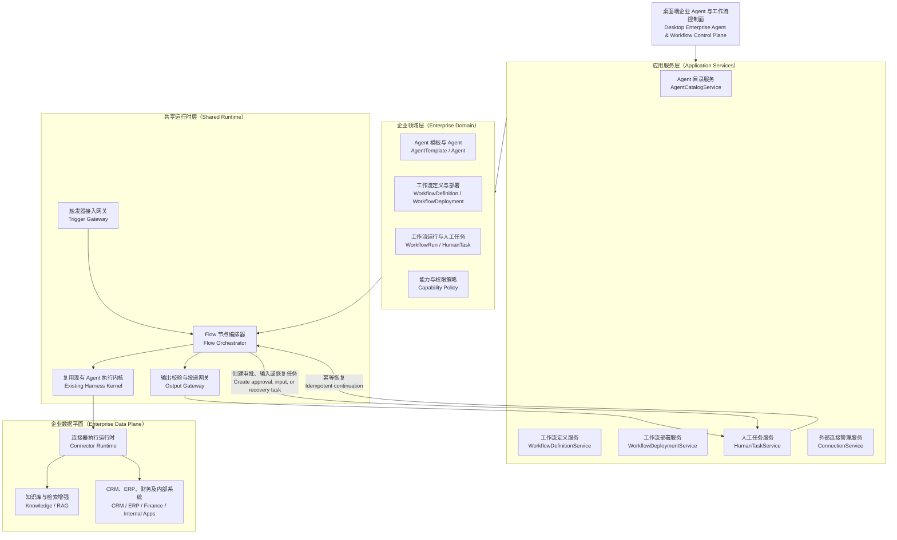
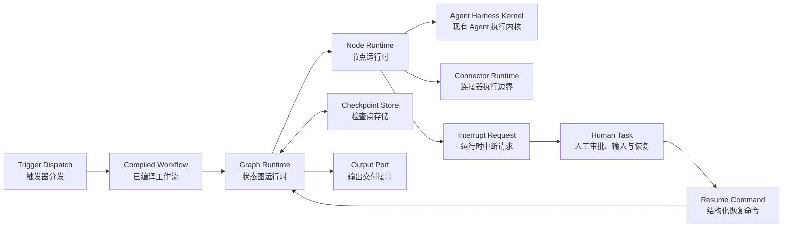

# OpenTopia 企业 Agent 与 Workflow 重构设计方案

> 状态：设计提案 v1.4
> 日期：2026-08-17
> 输入：`Flow模式重构.md`、当前仓库实现、`docs/enterprise-agent-platform-design-zh-cn.md`
> 范围：企业 Agent 与 Workflow 控制面、模板、状态图运行时、部署、触发器、输出、连接器权限、人工任务和桌面 UI

## 1. 结论

Flow 模式不应继续被定义成“对话旁边的一块流程 JSON/Trace 面板”，而应升级为企业 Agent 与 Workflow 控制面。推荐采用下面的对象链：

```text
AgentTemplate（Agent 模板）
  ├── 创建 Agent -> 独立身份，可直接对话和执行任务
  └── 派生 WorkflowAgentSpec -> 作为工作流中的 Agent 配置

WorkflowDefinition（UI：工作流模板）
  = WorkflowAgentSpecs + 编排关系 + TriggerContract + OutputContract
  -> Trial 跑通并发布
  -> 创建并激活 WorkflowDeployment（工作流部署）
  -> Trigger 被触发后创建 WorkflowRun（工作流运行）
  -> 需要人工时创建 HumanTask，并进入 Inbox
```

这里有六个需要严格区分的领域对象：

1. `AgentTemplateVersion`：Agent 的完整可复用配置；
2. `Agent`：由 Agent Template 创建、可独立对话的 Agent；
3. `WorkflowAgentSpec`：由 Agent Template 派生、嵌入 WorkflowDefinition 的 Agent 配置，不是运行实例；
4. `WorkflowDefinitionVersion`：由 Agent 配置、编排、触发契约和输出契约组成的不可变工作流定义；
5. `WorkflowDeployment`：工作流定义跑通后创建的、已配置环境并等待触发的部署；
6. `WorkflowRun`：Deployment 每次被触发后创建的一次具体执行。

推荐保留当前已经实现的 `AgentTemplateVersion`、`AgentInstance`、`FlowDraft`、`FlowDefinition`、`FlowRun`、静态校验、试运行和不可变发布，在其上补齐四个缺失层：

1. `OrgUnit`：部门或项目的企业业务边界；
2. `WorkflowDeployment`：将 WorkflowDefinition 激活为可接收 Trigger 的业务部署；
3. `CapabilityGrant`：基于已认证 Connection、操作级且默认拒绝的确定性权限；
4. `HumanTask`：与 Run 解耦、可聚合审批、补充输入、故障恢复和输出审查的人工协同对象。

不建议把已激活的工作流命名为 `Engine`。它表达的是“哪个定义版本已经在什么部门和环境中被部署”，准确名称是 `WorkflowDeployment`。`Engine` 应保留给共享的 `WorkflowRuntime`：所有 Deployment 都由同一个运行时调度，不为每个工作流复制 Harness 或常驻进程。

产品控制面参考 OpenAI Frontier，状态图运行时参考 LangGraph；OpenTopia 在二者之间保留自己的 Agent Template、账号级 Connection、WorkflowDeployment、HumanTask、AgentContinuation 和外部副作用安全边界。

### 1.1 命名约定

| 中文产品名称 | UI 英文 | 领域/代码名称 | 职责 |
| --- | --- | --- | --- |
| Agent 模板 | Agent templates | `AgentTemplateVersion` | Library、Connection、工具、模型、权限和行为的可复用配置 |
| Agent | Agents | `Agent` | 可独立对话和执行任务的稳定身份 |
| 流程 Agent 配置 | Workflow agent | `WorkflowAgentSpec` | 从 Agent 模板派生的工作流内嵌配置，不持有运行状态 |
| 工作流模板 | Workflow templates | `WorkflowDefinitionVersion` | Agent 配置、编排、Trigger 和 Output 的不可变定义 |
| 工作流部署 | Deployments | `WorkflowDeployment` | 将定义绑定到部门、环境和真实端点并激活 |
| 工作流运行 | Runs / Cases | `WorkflowRun` | 一次触发产生的具体执行 |
| 人工任务 | Inbox | `HumanTask` | 审批、补充输入、输出审查、恢复和人工处理 |
| 工作流运行时 | Workflow runtime | `WorkflowRuntime` | 共享调度和执行基础设施，不是用户创建的业务对象 |

## 2. 当前实现判断

### 2.1 已经具备的基础

当前代码不是从零开始：

- `enterprise.rs` 已有默认拒绝、只允许收窄的 `CapabilityProjection`；
- 已有不可变的 Agent 模板版本、能力差异和实例化；
- `flow.rs` 已有 FlowDraft、FlowDefinition、FlowTrial、Graph 节点/边、受控循环和校验；
- `flow_runtime.rs` 已有 FlowRun、NodeRun、暂停、恢复、审批等待和 Transcript；
- 服务端已有 Agent 模板和 Flow 的创建、验证、模拟、发布、运行 API；
- Desktop 已有 Flow 模式、Agent 模板面板和运行 Trace。

因此本次重构应增加企业控制面，不应重写 Harness、模型循环、工具注册、Flow 校验器或节点执行器。

### 2.2 根因与缺口

当前实现的主要问题不是某个组件缺字段，而是产品对象边界还不完整：

| 现状 | 根因 | 结果 |
| --- | --- | --- |
| FlowDraft、发布 Flow 和 Run 集中在同一个面板 | Definition、Deployment、Run 没有独立产品入口 | 配置密集、对象关系不清晰 |
| 直接编辑 Flow spec JSON | 领域对象没有形成业务化编辑器 | 只有开发者可用，难以审查权限和数据流 |
| Agent 模板用逗号列表和 JSON 配资源 | 能力目录没有被产品化 | 无法看见 App 的操作级权限和来源 |
| 已发布 Flow 可直接在会话中启动 | 缺少 WorkflowDeployment | 无法把跑通的模板部署为稳定、可触发的业务对象 |
| Approval 只是 Run 的一种状态 | 缺少独立 HumanTask 模型 | 无法统一处理审批、补充输入、恢复、分派、SLA 和审计 |
| Library、Plugin、MCP、App 概念并列 | 包、连接实例、业务数据和授权没有分层 | 用户不知道“装了什么”“连了什么”“谁能做什么” |
| Flow 是右侧 Tool Stage | Flow 仍被当作会话的附属工具 | 无法承载企业运营工作台 |

当前 `ExperienceSurfaceProfile::Flow` 使用 unrestricted 能力，再依赖后续上下文收窄。对 Flow 设计态来说边界过宽。设计会话默认只应看见目录、设计、验证、模拟和发布工具；生产操作必须通过独立 Trial 或 WorkflowDeployment 的执行快照获得。

### 2.3 当前类型到目标领域名的映射

命名调整不要求第一阶段立即重命名所有代码。先通过领域服务和 ViewModel 建立语义边界，再决定是否迁移底层类型：

| 当前实现 | 目标领域语义 | 迁移建议 |
| --- | --- | --- |
| `AgentTemplateVersionV1` | `AgentTemplateVersion` | 保留，名称已经准确 |
| `AgentInstanceV1` | `Agent` | API/UI 简化为 Agent，内部可暂时保留类型名 |
| `FlowDraftV1` | `WorkflowDraft` | 通过适配层迁移，不阻塞现有 `flow_*` 工具 |
| `FlowDefinitionV1` | `WorkflowDefinitionVersion` | 明确它是不可变定义，不是部署 |
| 新增 | `WorkflowAgentSpec` | 从 AgentTemplate 派生的工作流内嵌配置 |
| 新增 | `WorkflowDeployment` | 补齐定义到生产运行之间的部署层 |
| `FlowRunV1` | `WorkflowRun` | 保留存储兼容，逐步切换 API/ViewModel |
| `FlowRuntime` | `WorkflowRuntime` | 共享运行时，不暴露为用户可创建对象 |

## 3. 统一术语与领域模型

### 3.1 企业范围

```text
EnterpriseWorkspace
└── OrgUnit（type = department | project）
    ├── Agents
    ├── WorkflowDefinitions
    ├── WorkflowDeployments
    ├── Connections / Knowledge
    ├── WorkflowRuns / Cases
    └── HumanTasks
```

不建议直接复用当前 `Project` 表示部门。当前 `Project` 的语义是本地工作目录和会话分组，带 `workspace_root`；企业部门/项目是身份、策略、连接和运行数据的治理边界。两者可以建立显式关联，但不应使用同一实体承担两种职责。

推荐领域名为 `OrgUnit`，UI 可根据 `kind` 显示“部门”或“项目”。

### 3.2 AgentTemplateVersion：岗位模板

Agent Template 是 Agent 的完整可复用配置来源，不代表正在工作的身份。它有两个合法出口：创建独立 Agent，或派生工作流内部的 `WorkflowAgentSpec`：

- 名称、职责、指令和完成条件；
- 允许的模型策略；
- Skill、Plugin 和工具能力；
- 已绑定的 Library、知识库与允许检索的数据范围；
- 已连接的 CRM、ERP、财务系统、数据库、MCP 或其他外部 Connection；
- 每个 Connection 上允许使用的工具、操作、资源和字段范围；
- 输入、输出和持久状态 schema；
- 委派范围、预算、风险等级和审批规则；
- 所有者、审阅者、版本和发布状态。

模板可以保存具体 `LibraryBindingRef` 和 `ConnectionBindingRef`，因为这正是创建 Agent 时需要复用的配置。引用中只保存 Connection ID、能力和范围，不复制明文凭证；凭证继续由 Connection/Vault 管理。模板发布后固定这些引用及其授权版本，创建 Agent 时再生成不可变的 `AgentConfigSnapshot`。

```text
AgentTemplateFactory
  ├── createStandaloneAgent(templateVersion)
  └── deriveWorkflowAgentSpec(templateVersion, workflowDefinitionId, roleKey)
```

两条路径使用相同的 Agent 配置契约。区别是生命周期：独立 Agent 拥有稳定身份、对话和状态；WorkflowAgentSpec 只是 WorkflowDefinition 中的版本化配置，负责描述工作流角色。

### 3.3 Agent：AI 员工

建议把当前对外名称 `AgentInstance` 简化为 `Agent`，代码内部可保留兼容名称。它代表一个可以被分配工作的稳定身份：

- 固定引用已发布的模板版本；
- 属于一个 `OrgUnit`；
- 有独立身份、状态、记忆范围、预算和审计；
- 可以独立接受用户对话，也可以被显式分配给其他业务对象；
- 实际权限是模板上限与当前环境授权的交集；
- 模板升级不会静默改变既有 Agent，必须显式升级并生成权限 Diff。

打开 Agent 对话时，系统从 `AgentConfigSnapshot` 投影其 Library、Connection、Skill 和工具目录，因此用户不需要在每个会话中重新配置。Agent 的对话记录和运行状态属于 Agent，不回写 Agent Template。

### 3.4 WorkflowDefinitionVersion：工作流定义

UI 中可以称为“工作流模板”，领域层使用 `WorkflowDefinitionVersion`，因为已发布对象是精确且不可变的定义。它由 Agent 配置、触发器契约、编排关系和输出契约组成：

- 一个或多个 `WorkflowAgentSpec`；每个配置都由某个 `AgentTemplateVersion` 派生；
- Trigger 接口、输入 schema、认证和过滤契约；
- Output 接口、输出 schema 和投递契约；
- Agent 节点之间的依赖、分支、并行、循环和审批关系；
- Agent、Skill、Tool、Condition、Validator、Approval、Join、Loop、Output 节点；
- 错误、重试、超时、补偿和人工升级策略；
- 连接器和知识能力需求；
- 预算、风险和评测门槛；
- 不可变版本和内容哈希。

一个 WorkflowAgentSpec 至少包含 `role_key`、来源 Agent Template 版本、在该 Workflow 中的职责和允许继续收窄的覆盖配置。UI 可以把它呈现为工作流中的 Agent，但领域层明确它还不是运行身份。

```text
WorkflowDefinitionVersion
  trigger_contracts[]
  agent_specs[]
    - role_key
    - source_agent_template_version
    - agent_config_snapshot
    - workflow_specific_overrides
  graph
  output_contracts[]
```

这保证 Agent Template 是唯一配置来源，同时避免让一个模板直接持有正在运行、会产生状态的 Agent。创建 WorkflowDeployment 时，WorkflowAgentSpec 可以绑定现有 Agent，或物化为 Deployment 管理的 Agent 身份；每次 WorkflowRun 再建立独立 Run Context。

### 3.5 WorkflowDeployment：工作流部署

`WorkflowDeployment` 是 WorkflowDefinition 跑通、验证并绑定环境后的可触发对象。它回答“哪个定义版本正在什么部门、什么环境中运行”：

```text
WorkflowDeployment
  workflow_definition_version
  org_unit
  environment
  agent_bindings[]
  trigger_endpoints[]
  output_endpoints[]
  review_policy
  runtime_policy
  release_state
```

状态建议：

```text
draft -> validating -> ready -> active -> paused -> retired
                    \-> blocked
```

Deployment 激活时生成不可变 `DeploymentSnapshot`，固定 WorkflowDefinition、Agent bindings、Library/Connection 引用、Trigger 和 Output。所有新 WorkflowRun 固定引用该快照；修改配置产生新 Deployment revision，不能改写已经开始的 Run。

Deployment 的 `active` 仅表示可接收触发。真正执行工作的 `WorkflowRuntime` 是共享基础设施，不是 Deployment 的子进程。

### 3.6 WorkflowRun / Case：一次业务执行

Trigger 命中 WorkflowDeployment 后创建一个 `WorkflowRun`。`Case` 是同一运行面向运营人员的业务视图：

- `WorkflowRun`：图快照、节点、状态机、预算、事件和检查点；
- `CaseView`：业务标题、关键字段、当前负责人、SLA、结果和待处理事项。

推荐导航三级结构：

```text
部门 / 项目
  -> Workflow Deployments
  -> Workflow Runs / Cases
```

### 3.7 HumanTask：统一人工任务

Inbox 是一个查询和工作界面，不应成为审批或运行状态的事实源。事实源是可独立分派、审计和恢复 WorkflowRun 的 `HumanTask`：

```text
HumanTask
  type: approval | input_request | output_review | recovery | reconnect | data_correction | manual
  source_type: flow_run | external_event | manual
  source_ref
  workflow_run_ref? / node_run_ref?
  checkpoint_ref?
  org_unit
  assignee / candidate_group
  priority / due_at / sla
  reason_code
  evidence_snapshot
  action_schema
  continuation_ref?
  status
```

一个 WorkflowRun 可以产生多个 HumanTask；一个 HumanTask 的决定通过幂等 continuation 恢复对应节点。审批可使用 `approve/reject`，故障恢复则使用 `retry/skip/replace_connection/abort/escalate` 等由 `action_schema` 明确定义的动作，不能把所有人工处理都伪装成“批准”。

文档提出“所有 WorkflowRun 输出统一进入 Inbox”。MVP 可以把 `review_mode=all` 设为默认，但领域模型应从一开始支持：

- `all`：全部人工审查；
- `risk_based`：由确定性风险规则决定；
- `sampled`：按比例抽检；
- `exceptions_only`：仅异常和低置信度；
- `none`：仅低风险且策略允许。

高风险和带副作用输出仍由平台策略强制审查，WorkflowDeployment 不能关闭。

### 3.8 Flow 中断、人工任务与恢复

并非所有失败都应进入 Inbox。Runtime 先对中断进行分类：

| 中断类型 | WorkflowRun 行为 | 是否创建 HumanTask |
| --- | --- | --- |
| 短暂技术故障，例如超时或限流 | 按策略自动重试和退避 | 否，超过阈值后再转人工或失败 |
| 预先声明的审批检查点 | 保存 checkpoint，进入 `waiting_for_human` | 是：`approval` |
| 缺少业务输入或需要选择分支 | 保存 checkpoint，进入 `waiting_for_human` | 是：`input_request` |
| Connection 登录过期 | 保存 checkpoint，进入 `waiting_for_human` | 是：`reconnect` |
| 人可以采取恢复动作的中断性失败 | 保存错误、证据和外部副作用状态，进入 `waiting_for_human` | 是：`recovery` |
| 不可恢复或不应由人决定的终止错误 | 进入 `failed`，保留重新运行入口 | 否，避免制造无意义待办 |

```text
WorkflowRun: running
  -> InterruptPolicy（中断策略分类）
  -> Save Checkpoint（保存一致检查点）
  -> HumanTask: open
  -> WorkflowRun: waiting_for_human
  -> Human Action（人工决定，带 expectedRevision 和 Idempotency-Key）
  -> WorkflowRun: resuming
  -> Continue / Compensate / Fail（继续、补偿或终止）
```

“当前 Flow 内的审批卡片”和“Inbox 中的人工任务”必须引用同一个 `human_task_id`：

- 用户正在查看相关 WorkflowRun 时，在时间线阻断节点处显示 `HumanTaskPanel`，顶部同时出现紧凑的 `Flow interrupted` 状态条；
- 简单、低风险动作可以在就地面板完成；高风险动作只提供 `在 Inbox 中处理`，进入完整 Evidence + Decision 工作台；
- 用户不在当前 Run 时，通过 Inbox badge、桌面通知或外部消息发送 deep link；
- 任一入口完成动作后，其他入口实时变为已处理，不能重复恢复或重复执行副作用；
- 外部审批系统可以作为 HumanTask 的决策通道，但回调必须完成身份校验、权限校验、签名、幂等和审计，通知本身不是批准结果。

## 4. Apps、MCP、Connection 与知识库

### 4.1 MCP-first 统一集成模型

Connection 与 MCP 服务高度相关，但二者不应使用同一个领域对象。MCP 是接入协议和能力提供方式；Connection 是某个账号完成认证后，可被 Agent 实际使用的连接实例。同一个 MCP 服务登录账号 A 和账号 B，应产生两个 Connection，因为它们的数据边界、工具目录和授权范围可能完全不同。

```text
Plugin / IntegrationProvider（插件 / 集成提供方）
  -> IntegrationDefinition（集成定义：MCP Server、OAuth API、数据库或本地 App）
     -> Connection（已认证连接：账号、租户、环境与凭证句柄）
        -> DiscoveredCapabilityCatalog（该账号实际暴露的工具与资源目录）
           -> CapabilityGrant（允许 Agent 使用的能力子集）
```

- `Plugin`：安装到平台的能力包，可能提供 Skill、MCP Server 定义或其他 Integration Provider；
- `IntegrationDefinition`：描述接入类型、端点、认证方式和能力发现方式，`kind` 可以是 `mcp`、`oauth_api`、`database` 或 `local_app`；
- `Connection`：用户、企业共享账号或服务账号完成认证后形成的实例，保存账号身份、tenant/workspace、环境、scope、凭证句柄、健康状态和配置修订号；
- `DiscoveredCapabilityCatalog`：认证后从 MCP `tools/list`、`resources/list` 或其他 Provider 元数据中发现并规范化的实际能力；
- `CapabilityGrant`：对工具、操作、资源范围、字段、用途和风险的授权，是 Agent Template 可以选择的上限子集。

这样建模仍然允许 UI 把 MCP 服务展示在 Connections Catalog 中，但不会把“服务定义”“登录账号”和“Agent 获得的权限”混成一个对象。对于非 MCP 的 CRM REST API、数据库或本地 App，也复用同一套 Connection 生命周期，而无需伪装成 MCP。

知识库单独建模：

```text
KnowledgeSource -> KnowledgeBase -> KnowledgeGrant
```

`KnowledgeSource` 负责同步，`KnowledgeBase` 是可检索集合，`KnowledgeGrant` 约束查询范围、数据等级和可导出字段。不要把 RAG 资料与可写业务 App 都塞进一个泛化 Library 字符串列表。

### 4.2 登录、能力发现与配置版本

Connection 创建过程建议固定为：

```text
选择 IntegrationDefinition（选择集成定义）
  -> Authenticate（OAuth / API Key / Service Account 登录认证）
  -> Resolve Account Context（识别账号、租户、workspace 和环境）
  -> Discover Capabilities（发现该账号的 tools / resources / operations）
  -> Apply Admin Policy（应用组织级安全上限）
  -> Publish Connection Revision（发布连接能力修订版本）
```

凭证必须进入 Secret Vault，Connection、Agent Template 和 WorkflowDeployment 只保存 `credential_ref`，不得保存或复制 token。一个 Connection 至少包含：

- `provider_id`、`kind`、`endpoint_ref`；
- `account_principal`、`tenant_id/workspace_id`、`environment`；
- `auth_method`、`credential_ref`、`granted_scopes`、`expires_at`；
- `ownership = personal | org_shared | service_account`；
- `capability_catalog_revision`、`last_discovered_at`、`health`、`reauth_required`。

能力目录变化必须采用 fail-closed 规则：

- 登录过期、撤销授权或账号被移除时，Connection 进入 `reauth_required`，运行在调用工具前阻断；
- 工具或 scope 减少时，立即把受影响的 Agent 和 WorkflowDeployment 标记为 `degraded` 或 `blocked`，不能继续使用旧权限；
- 新增工具或扩大 scope 时，只更新可选目录，不自动授予已有 Agent Template；必须显式选择并发布新模板版本；
- 生产 Workflow 优先使用 `org_shared` 或 `service_account` Connection；个人 Connection 默认只用于个人 Agent 和 Trial，除非组织策略明确允许发布。

### 4.3 Apps 权限在哪里配置

Agent Template 是配置 Library 和 Connection 的主入口；Integration Provider 与 Connection 侧只提供可选能力目录和组织级安全上限：

1. Integration Provider 声明理论能力；Connection 登录后发现该账号实际拥有的工具、资源和 scope；
2. Agent Template 直接选择具体 Library、Connection 以及允许的操作、资源和字段范围；
3. 创建独立 Agent 或派生 WorkflowAgentSpec 时完整复用这些绑定，生成固定配置快照；
4. WorkflowDefinition 可以按 WorkflowAgentSpec 或节点继续收窄，但不能扩权；
5. WorkflowDeployment 固定最终配置版本；
6. Runtime 在每次调用前做确定性校验。

```text
effective_app_operations =
  provider_declared_capabilities
  ∩ connection_discovered_capabilities
  ∩ authenticated_account_scopes
  ∩ connection_admin_policy
  ∩ initiating_principal_grant
  ∩ agent_template_ceiling
  ∩ agent_config_snapshot
  ∩ workflow_agent_or_node_grant
  ∩ deployment_snapshot
  ∩ runtime_risk_policy
```

因此不存在“Agent 模板还没创建，App 怎么配置”的循环：先在 Connections 中启用 MCP/CRM/ERP 等 Integration Definition 并完成账号登录，Connection 根据账号上下文发现可用操作；然后在 Agent Template 中选择这个 Connection 和允许的能力子集。没有可用 Connection 时，模板可以保存草稿，但不能发布为可实例化版本。

UI 中以 Agent Template 的 `Libraries` 和 `Connections` 页作为配置主入口；Connections 页面展示 Provider/MCP Server、登录账号、tenant/workspace、归属类型、已发现能力、有效授权、健康状态和反向引用，例如“哪些 Agent Template、WorkflowDefinition 和 WorkflowDeployment 正在使用此操作”。

### 4.4 操作级权限示例

```json
{
  "capabilityId": "crm.customer",
  "operations": ["read", "search", "update_status"],
  "resourceScope": { "region": ["cn-east"], "team": ["enterprise-sales"] },
  "fieldAllow": ["id", "name", "status", "owner"],
  "fieldDeny": ["personal_phone", "identity_number"],
  "purpose": "lead-qualification",
  "maxClassification": "confidential",
  "approval": { "requiredFor": ["update_status"] }
}
```

不要只授权 MCP Server、Connection 或 Plugin ID。它们只能回答“连接到了哪个服务和账号”，不能回答“CRM 里可以读哪些客户、更新哪些字段，还是可以删除客户”。

## 5. 触发器与输出端口

### 5.1 WorkflowDefinition 定义接口，Deployment 将接口激活

WorkflowDefinition 必须包含 Trigger 和 Output。定义中保存逻辑接口、schema 和行为契约：

```text
TriggerPort(name, input_schema, semantic_contract)
OutputPort(name, output_schema, delivery_semantics)
```

创建 WorkflowDeployment 时，将定义中的接口激活为真实端点：

- Trigger：manual、webhook、schedule、event_subscription、poll；
- Output：Inbox、Webhook、App operation、消息通道、Artifact、调用方响应。

WorkflowDefinition 可以保存接口类型和逻辑配置，但不得复制明文凭证、真实 Webhook secret 或其他秘密；WorkflowDeployment 的 `DeploymentSnapshot` 保存端点引用和凭证句柄。

### 5.2 触发链路

```text
接收事件
  -> 认证来源
  -> 规范化为 TriggerEnvelope
  -> 幂等键去重
  -> 输入 schema 校验
  -> 过滤与速率限制
  -> 解析 DeploymentSnapshot
  -> 创建 WorkflowRun
```

过滤可以由外部系统先做，但平台仍必须完成认证、schema、幂等、租户边界和限流校验，不能把外部过滤视为信任边界。

### 5.3 输出链路

```text
节点输出
  -> output schema 校验
  -> 数据分级与 DLP
  -> ReviewPolicy
  -> 创建 HumanTask 或直接投递
  -> Connector 操作级鉴权
  -> 幂等投递
  -> 保存 DeliveryReceipt
```

每个有副作用的输出都必须声明幂等键和失败处置。首版不实现通用分布式补偿事务；只有人可以安全处置的失败才创建 `recovery` HumanTask，由人工核对外部状态后选择重试、跳过、补偿或终止。

## 6. 目标架构



依赖规则：

- UI 和 `flow_*` 模型工具调用同一 Application Service；
- Application Service 负责用例和事务，不复制权限逻辑；
- Domain 不依赖 React、Axum、SQLite、具体 Connector 或模型 Provider；
- Flow Orchestrator 只协调节点，不拥有第二套 Agent Loop；
- 所有 Agent 节点继续进入现有 Harness Kernel；
- Connector Runtime 是企业系统的执行边界；
- 审计事件先持久化，再更新投影和通知 UI。

### 6.1 LangGraph 的定位：运行时参考，不是产品领域替代品

Flow Runtime 建议系统性参考 LangGraph 的 `StateGraph`、持久化 Checkpoint、动态 Interrupt、Command Resume、State History 和 Subgraph 思想。LangGraph 适合作为“如何可靠执行一张有状态图”的参考；OpenAI Frontier 继续作为企业产品控制面和信息架构参考。二者在本方案中分别回答不同问题：

- OpenAI Frontier：Agent、业务上下文、身份权限、部署、评测和企业治理如何形成产品；
- LangGraph：长时间运行的有状态图如何编译、推进、暂停、保存和恢复；
- OpenTopia：在现有 Rust Agent Harness、Connection、Agent Template、HumanTask 和桌面端之上实现自己的统一控制面与运行时。

不建议把 Python LangGraph 作为 OpenTopia Runtime 的进程内依赖，也不建议把 LangGraph 的 Thread、Interrupt Payload 或 Deployment 概念直接暴露为产品 API。应提炼其运行时不变量，在 Rust 中形成稳定的 OpenTopia 领域协议。

### 6.2 LangGraph 概念映射

| LangGraph | OpenTopia 目标模型 | 中文解释与边界 |
|---|---|---|
| `StateGraph` | `WorkflowDefinitionVersion` | 已编译前的版本化工作流状态图 |
| Compiled Graph | `CompiledWorkflow` | 完成图结构、schema、权限和路由验证的不可变执行计划 |
| State | `WorkflowRunState` | 一次 Run 的类型化持久状态，不等于会话消息历史 |
| State Channel | `WorkflowStateChannel` | 节点可读写的状态字段及其数据等级 |
| Reducer | `StateReducer` | 串行或并行写入如何合并，禁止依赖隐式覆盖 |
| Node | `WorkflowNode` | Agent、Tool、Condition、Approval、Join、Output 等执行单元 |
| Edge / Conditional Edge | `WorkflowTransition` | 普通、条件、异常和循环转移 |
| Thread | `WorkflowRun` | LangGraph 的持久执行游标映射到一次 Run，不与 ConversationThread 混用 |
| Task | `NodeAttempt` | 某节点的一次可追踪执行尝试 |
| Checkpoint | `WorkflowCheckpoint` | 已提交 superstep 的可恢复运行快照 |
| Pending Writes | `WorkflowStateWrite` | 同一 superstep 中已完成节点的待合并结果 |
| `interrupt()` | `InterruptRequest` | Runtime 发出的暂停协议，随后投影为产品级 HumanTask |
| `Command(resume=...)` | `ResumeCommand` | 经权限验证、带 revision 的结构化恢复命令 |
| Subgraph | `NestedWorkflow` / `AgentNodeRuntime` | 子工作流或复用现有 Agent Harness 的节点内部执行 |
| State History | `Run Timeline` | Checkpoint、NodeAttempt、HumanTask 和状态差异时间线 |
| Replay / Fork | `TrialReplay` / `RunFork` | 从历史检查点重放或创建隔离试验分支 |

必须保留四种不同 ID：`conversation_thread_id`、`workflow_run_id`、`agent_node_session_id` 和 `human_task_id`。一个会话可以触发多个 WorkflowRun；一个 WorkflowRun 可以拥有多个 Agent 节点会话和多个人工任务。

### 6.3 参考 LangGraph 的 Runtime 分层



Runtime 内部拆为四个明确边界：

1. `WorkflowCompiler`：编译 Graph、State Channel、Reducer、schema、能力授权、循环和错误路由；
2. `GraphRuntime`：按 superstep 推进 ready nodes、条件边和并行 barrier，不执行企业权限推导；
3. `CheckpointEngine`：原子提交状态写入、NodeAttempt、下一批 ready nodes、Interrupt 和审计事件；
4. `InterruptCoordinator`：把 InterruptRequest 投影为 HumanTask，并在人工动作后验证 ResumeCommand。

Agent 节点仍调用现有 Agent Harness Kernel，不在 GraphRuntime 内复制模型循环、工具调度或 Agent continuation 逻辑。

### 6.4 应借鉴的运行时不变量

#### Typed State 与 Reducer

WorkflowDefinition 必须声明可检查的 `WorkflowRunState`。节点显式声明读取、写入和输出映射；并行节点可能写入同一个 State Channel 时必须有 Reducer。Reducer 必须是确定性的，并在发布前通过合并顺序测试。

```text
WorkflowRunState
  input
  variables
  agent_outputs
  tool_results
  human_responses
  errors
  output
```

状态字段同时携带 schema、数据等级和保留策略。边上的字段投影只能缩小数据范围，不能绕过 Connection 或 Agent Template 的权限边界。

#### Compile Before Run

`WorkflowDefinitionVersion` 先编译为 `CompiledWorkflow`，DeploymentSnapshot 固定编译产物的 content hash。编译必须拒绝不可达节点、缺失 Trigger/Output、无上限循环、没有 Reducer 的并行冲突、无效 Agent Template/Connection、权限扩大和缺少高风险审批门。

#### Checkpoint by Superstep

每个已提交的 superstep 生成 Checkpoint；同一 superstep 中已成功节点的写入单独记录为 pending writes。某个并行节点失败时，恢复不能重新执行已经成功且结果已持久化的兄弟节点。首版可保存完整状态快照，状态规模达到阈值后再引入 delta checkpoint。

#### Interrupt 不是 Failure

审批、补充输入、输出审阅、重新登录、人工修正和外部副作用不确定都属于 Interrupt，而不是普通异常。状态流转统一为：

```text
running -> waiting_for_human -> resuming -> running | succeeded | cancelled | failed
```

Interrupt 创建与 Run/Checkpoint 更新必须在同一事务中；ResumeCommand 也必须与 HumanTask 解决和 Run revision 更新原子提交，事务完成后才能重新调度节点。

#### Command-based Resume

UI 和外部调用者不能直接修改 Run 状态，只能提交受 task action schema 约束的命令：

```text
Approve | Reject | SubmitInput | Retry | Reconnect | CorrectData | Cancel
```

每个命令至少携带 `human_task_id`、`expected_revision`、操作者身份和输入；高风险命令还携带检查结果、证据或修改前后差异。

### 6.5 不直接照搬的部分

LangGraph 的动态 Interrupt 在恢复时会重新进入包含 Interrupt 的节点，因此 Interrupt 之前的副作用必须幂等。OpenTopia 面向 CRM 更新、付款、发信和 ERP 操作，不能默认整节点安全重放，应采用更严格的三层恢复模型：

```text
WorkflowCheckpoint
  -> 恢复整张图和已提交 superstep

AgentContinuation
  -> 恢复 Agent 节点内部的模型与工具调度安全点

ActivityReceipt / IdempotencyKey
  -> 证明外部副作用是否已经执行并防止重复调用
```

因此：

- 确定性 Condition/Join/纯转换节点可以从节点开头重放；
- Agent 节点优先从持久化 AgentContinuation 恢复；
- 外部 Tool/Connector 节点必须使用幂等键、操作回执或人工核对路径；
- 副作用状态为 unknown 时不能自动 retry，必须生成 recovery HumanTask；
- `InterruptRequest` 只是 Runtime 协议，`HumanTask` 才是拥有 assignee、SLA、权限、证据和审计的产品实体；
- Connection、Agent Template、WorkflowDeployment、Trigger、Output 和企业治理继续由 OpenTopia 控制面拥有，不下沉为 LangGraph Runtime 概念。

## 7. 推荐 API

在现有 API 旁增加缺失资源，并让 UI 与模型工具复用同一服务：

```text
/api/enterprise/org-units
/api/enterprise/agent-templates
/api/enterprise/agents
/api/enterprise/workflow-drafts
/api/enterprise/workflow-definitions
/api/enterprise/workflow-deployments
/api/enterprise/workflow-runs
/api/enterprise/human-tasks
/api/enterprise/integration-definitions
/api/enterprise/connections
/api/enterprise/knowledge-bases
/api/enterprise/audit-events
/api/enterprise/evaluations
```

关键动作：

```text
POST /workflow-definitions/{id}:run-trial
POST /workflow-deployments/{id}:validate
POST /workflow-deployments/{id}:activate
POST /workflow-deployments/{id}:pause
POST /workflow-deployments/{id}:test-trigger
POST /human-tasks/{id}:claim
POST /human-tasks/{id}:act
POST /connections/{id}:authorize
POST /connections/{id}:reauthorize
POST /connections/{id}:refresh-capabilities
POST /connections/{id}:test
GET  /connections/{id}/capabilities
GET  /connections/{id}/effective-usage
GET  /agents/{id}/effective-capabilities
```

所有写操作带 `Idempotency-Key` 和 `expectedRevision`。列表、搜索、事件和对象读取都以 `enterprise_workspace_id + org_unit_id` 为强制边界。

## 8. 持久化建议

首版需要新增或规范化以下关系：

```text
enterprise_workspaces
org_units

agent_templates
agent_template_versions
agents
agent_assignments

integration_definitions
connections
connection_auth_contexts
connection_capability_revisions
capability_grants
knowledge_sources
knowledge_bases
knowledge_grants

workflow_drafts
workflow_definition_versions
workflow_agent_specs
workflow_deployments
workflow_deployment_revisions
trigger_bindings
output_bindings

workflow_runs
flow_node_runs
workflow_checkpoints
workflow_state_writes
workflow_interrupts
human_tasks
human_task_actions
delivery_receipts
audit_events
```

Graph、schema 和策略可以继续用版本化 JSON 文档存储，但经常查询、关联和授权的字段必须规范化，例如 `org_unit_id`、版本、状态、角色绑定、Connection、账号 tenant/workspace、能力修订、操作 ID、assignee、SLA 和风险等级。`connection_auth_contexts` 只保存凭证句柄和非秘密认证元数据，实际 secret 由专用 Vault 管理。

## 9. 桌面 UI 信息架构

### 9.1 产品定位

Flow 模式应是与 Code/Work 同级的完整 Surface，而不是右侧工具页。保留当前 OpenTopia 侧栏的空间和交互习惯，但将其纵向分成“固定一级导航 + 随导航变化的对象列表”，再配合主工作区和 Inspector：

```text
┌──────────────────────────────┬───────────────────────────────────────┬────────────────────────────┐
│ Flow Sidebar（Flow 侧栏）    │ Main Workspace（主工作区）           │ Inspector（上下文检查器） │
│                              │                                       │                            │
│ Mode Switch / Global Actions │ 当前对象的详情、Chat、Graph、Timeline│ 配置、证据、风险与决定     │
│ 模式切换 / 全局操作          │                                       │                            │
│                              │                                       │                            │
│ Primary Navigation           │                                       │                            │
│ 一级导航                     │                                       │                            │
│ Overview / Inbox / Agents    │                                       │                            │
│ Workflows / Deployments/Runs │                                       │                            │
│ Connections / Knowledge      │                                       │                            │
│ Trust（按角色显示）          │                                       │                            │
│ ──────────────────────────── │                                       │                            │
│ Contextual Collection        │                                       │                            │
│ 上下文对象列表               │                                       │                            │
│ 搜索 / 筛选 / 分组 / 条目    │                                       │                            │
│ ──────────────────────────── │                                       │                            │
│ Organization / Settings      │                                       │                            │
│ 组织切换 / 设置              │                                       │                            │
└──────────────────────────────┴───────────────────────────────────────┴────────────────────────────┘
```

一级导航按业务任务分组，避免平铺十几个同级入口：

- **Operate**：Overview、Inbox、Deployments、Runs；
- **Build**：Agents、Workflow Templates；
- **Context**：Connections、Knowledge；
- **Trust**：Permissions、Evaluations、Audit。

`Connections` 和 `Knowledge` 是固定一级导航中的一等入口，不属于侧栏底部的设置区。Agent Template 配置、Deployment readiness、Connection 失效处理和故障恢复都会频繁跳转到 Connections；把它放到底部会错误地表达成低频系统设置。侧栏底部只保留组织切换、Settings、Help 等全局工具；Trust 可以作为按角色显示的一级分组，但也不与 Settings 混在一起。

一级导航决定下面 `Contextual Collection` 的对象类型：

| 一级导航 | 下方列表展示 | 列表条目的关键信息 |
| --- | --- | --- |
| Overview | 最近对象与需要关注的异常 | 类型、状态、更新时间 |
| Inbox | HumanTask | 类型、来源 Agent/Deployment/Run、原因、SLA、assignee |
| Agents | Agent，顶部切换 AI 员工 / Agent Templates | 名称、归属、状态、最近活动 |
| Workflow Templates | WorkflowDefinition | 草稿/已发布版本、Trial 状态、更新时间 |
| Deployments | WorkflowDeployment | active/degraded/paused、环境、待办数量、最近运行 |
| Runs | WorkflowRun / Case | 当前步骤、状态、时长、人工等待和风险 |
| Connections | Connection | 登录账号、tenant、健康、重新认证状态 |

不要在 Deployments 列表中混排 Agent 和 HumanTask。列表必须保持单一对象类型，通过 badge 和来源摘要表达关联；需要处理的事项统一进入 Inbox。每个一级入口独立保存搜索、筛选、滚动位置和已选对象，返回时恢复上下文；URL/route 同时包含 `section + selected_id`，便于通知 deep link 和审计跳转。

这个信息架构借鉴 Frontier 已公开的方向，而不是声称复刻其未公开后台：OpenAI 的公开材料强调统一运行 Agent、显式权限、审批门、审计与可观测性，并明确 Agent 可以在不同界面中参与工作。因此 OpenTopia 应保持一个稳定控制面，同时允许同一个 HumanTask 在当前 Run 和全局 Inbox 中出现。参考：[Introducing OpenAI Frontier](https://openai.com/index/introducing-openai-frontier/)、[Workspace agents for business](https://openai.com/business/workspace-agents/)。

### 9.2 Overview

Overview 是运营面板，不是营销首页：

- 活跃 Deployments、今日 Workflow Runs、成功率、P95 时长；
- 待处理 HumanTask 数量、逾期 SLA、高风险待办；
- 异常 Deployment 和 Connection 健康；
- 最近版本发布和权限变更；
- 一条主操作：`新建 Agent` 或 `新建 Workflow Template`，根据当前空状态决定。

避免用大面积渐变、插画或无行动意义的指标卡。

### 9.3 Agent 模板与 Agent

Agent 页面使用列表—详情结构，并把“模板”和“员工”作为两个视图：

```text
Agents
  [AI 员工] [岗位模板]

岗位模板详情：
  Overview | Instructions | Libraries | Connections | Tools | Guardrails | Versions

AI 员工详情：
  Chat | Identity | Effective configuration | Activity | Memory | Audit
```

创建模板有两种入口：

1. “描述这个岗位”——自然语言生成草稿；
2. “手动配置”——结构化表单。

`Libraries` 直接选择 Agent 可以检索的知识库；`Connections` 直接选择 CRM、ERP 等连接，并按 App/资源分组展示 operation checkbox、范围、字段和审批要求。底部始终显示模板配置与最终有效配置的 Diff。

打开某个 Agent 后，`Chat` 是首要入口。对话 Composer 上方用紧凑摘要显示当前 Agent 已拥有的 Library、Connection 和工具；详细配置只在 Inspector 展开，不要求用户每次重新选择上下文。

### 9.4 Workflow Template Designer

Workflow Template 设计继续以对话为主要入口，Graph 是可审查的中间表示。设计过程中添加的每个 Workflow Agent 都必须选择一个 Agent Template 作为来源：

```text
┌──────────────────────────────┬──────────────────────────────┐
│ 对话与设计记录               │ Graph / Inspector            │
│                              │                              │
│ 描述目标、Agent、条件        │ 当前版本、节点与验证状态     │
│ Agent 澄清少量关键问题       │ 选择节点后编辑关键字段       │
│ 生成/修改 Workflow Template  │ Agent Template、输入输出     │
│ Trial、错误和发布进度        │                              │
└──────────────────────────────┴──────────────────────────────┘
```

关键规则：

- 默认不显示原始 JSON；在“高级”抽屉中只读查看，具备权限时才允许编辑；
- Graph 支持选中和关键字段修改，不要求用户拖拽连线才能完成设计；
- 添加 Agent 节点时使用 `从 Agent Template 派生`，并显示继承的 Library、Connection 和工具摘要；
- Workflow Template 顶部固定展示 Trigger 和 Output，两者不是可省略的普通节点；
- 节点使用一致的 Lucide 图标、类型标签和状态，不用彩虹色区分；
- 校验错误同时显示在 Graph、Inspector 和可跳转的问题列表；
- 发布按钮旁明确显示 Trial、审批和未决问题是否通过。

### 9.5 Workflow Deployment Builder

将已经跑通的 WorkflowDefinition 创建为 Deployment，使用可返回的五步流程并自动保存草稿：

1. 选择已通过 Trial 的 WorkflowDefinition 版本和目标部门/项目；
2. 将 WorkflowAgentSpec 绑定到已有 Agent，或物化为 Deployment 管理的 Agent；
3. 验证每个 Agent 继承的 Library、Connection、工具和权限仍然有效；
4. 激活 Trigger、Output endpoint 与 ReviewPolicy；
5. Dry Run、权限 Diff、风险检查并激活。

右侧固定显示 `Deployment readiness`：Agent Template 失效、Connection 异常、Trigger 未认证、Output 无幂等、扩权和未通过测试。`激活部署` 是唯一主操作。

### 9.6 Workflow Runs / Cases

列表默认展示业务字段，不以内部 UUID 为主：

- Case 标题、Deployment、状态、当前步骤、负责人；
- 触发时间、持续时间、SLA；
- 风险、需要人工、输出状态；
- 可保存的筛选器和按状态分组。

Workflow Run 详情为时间线：Trigger → Agent/Tool 节点 → Validator → Review → Output。节点展开后展示输入摘要、工具调用、结果、Evidence 和错误；隐藏模型私有推理。

### 9.7 Inbox

Inbox 复用上述侧栏对象列表，而不是在主工作区再放一列重复 Queue。整体形成“导航与任务列表—证据—决定”的高效率布局：

```text
┌──────────────────────────────┬─────────────────────────────────────┬──────────────────────────┐
│ Inbox Collection（任务列表）│ Evidence & Case Context（证据上下文）│ Decision（决定面板）     │
│                              │                                     │                          │
│ 我的 / 未分配 / 逾期        │ 为什么需要人工                      │ 按 action_schema 显示动作│
│ Approval / Input / Recovery  │ 输入、输出、差异和来源              │ 批准/拒绝/重试/终止等    │
│ Output Review / Reconnect    │ Flow 位置、检查点与影响范围          │ 备注、分派、升级          │
└──────────────────────────────┴─────────────────────────────────────┴──────────────────────────┘
```

决定前必须看见：发起 Agent、代表谁行动、所属 Deployment/Run/节点、将调用哪个 App 操作、数据范围、不可逆影响、已发生的外部副作用和证据。拒绝或终止必须可选原因；编辑后批准保存原值、修改值和决定者。

Inbox 条目不是普通通知：打开即进入可恢复的业务工作台。任务被他人领取或处理时，列表和当前决定面板实时更新；过期任务根据策略升级、转派或使 Run 失败，不能无限等待。

### 9.8 Flow 中的就地中断面板

需要提供类似 Code 模式审批卡片的 Flow 体验，但不应新增一套 Flow 专属审批状态。建议从现有 `ApprovalDialog` 中抽取通用的请求摘要、风险说明、提交态和错误态，形成共享展示组件 `HumanTaskPanel`：Code 模式继续从会话审批事件适配，Flow 模式从 `HumanTask + WorkflowRun checkpoint` 适配。两种模式可以共享交互 primitive，但不强迫底层事件使用同一种领域模型。

当用户正在查看被阻断的 Run：

- 主工作区顶部显示紧凑 `Flow interrupted` 状态条，包含等待原因、节点、SLA 和 `在 Inbox 中处理`；
- 时间线在阻断节点原位插入 HumanTaskPanel，使用户知道 Flow 为什么停在这里；
- 右侧 Inspector 显示完整 Evidence、权限、影响和 action_schema；
- 低风险二元审批可就地处理；需要编辑数据、重新登录、恢复外部副作用或高风险批准时跳转 Inbox 完整工作台；
- 处理后状态条变为 `Resuming`，直到 continuation 成功；不能在 UI 点击后立即假装 Run 已恢复。

用户正在查看其他对象时，只显示 Inbox badge、可选桌面通知和 deep link，不强行弹出模态框打断当前工作。这样既保留 Code 模式的即时反馈，也让管理者能在 Inbox 中异步、批量地处理跨 Agent 和跨 Workflow 的任务。

### 9.9 Connections 与 Knowledge

Connections 页面分为：

- Catalog：可用 MCP Server、CRM、ERP、数据库、消息和内部 App，标注接入类型与认证方式；
- Connections：真实登录账号、tenant/workspace、环境、个人/共享/服务账号归属、健康和重新认证状态；
- Capabilities：该账号实际发现的 tools/resources、组织上限、模板已授予子集、风险和审批要求；
- Usage：被哪些 Agent Template、Agent、WorkflowDefinition 和 WorkflowDeployment 引用。

Connection 详情页的主操作根据状态显示 `登录并连接`、`重新授权`、`刷新能力` 或 `测试连接`。新增能力只显示为“可授权”，不得自动进入任何已发布模板；减少或失效的能力应直接列出受影响对象和修复入口。

Knowledge 页面单独展示 Source、同步状态、索引、数据等级、检索范围和引用使用情况。

## 10. 视觉与交互规范

界面应遵守现有 `design-system/MASTER.md` 和 token，而不是引入一套“AI 紫色”主题：

- 工作区使用中性 surface、hairline border 和清晰分栏；
- 蓝色仅用于主操作、选择、焦点和链接；
- 绿/黄/红只表达状态，不作为装饰；
- 默认 14px 正文、12px 标签、11px 元数据；
- 32px 普通控件，28px 紧凑工具栏；
- 列表密度高但保持 4/8px 节奏，避免大卡片堆叠；
- transient UI 才使用阴影，常驻区域用 border；
- 微交互使用 120/180ms token，支持 reduced motion；
- 所有 icon-only 控件有 `aria-label`，Graph 和时间线可键盘导航；
- 状态不能只靠颜色，必须有文字或图标；
- 超过 300ms 的请求显示 skeleton/progress，异步按钮禁用并显示当前动作。

## 11. 代码组织建议

不要继续把所有 Flow UI 和状态塞进 `App.tsx` 或单一 `FlowWorkspacePanel.tsx`。建议形成独立 feature：

```text
apps/desktop/src/features/enterprise-flow/
  EnterpriseFlowSurface.tsx
  routes.ts
  api.ts
  viewModels.ts
  hooks/
  overview/
  inbox/
  agents/
  workflow-templates/
  deployments/
  runs/
  context/
  trust/
  components/
```

`App.tsx` 只负责模式切换、窗口骨架和 feature 挂载。feature 内使用现有 `components/ui`，共享的 ListDetail、InspectorSection、StatusBadge、ResourcePicker 等稳定后再提升为通用 primitive。

服务端建议增加 application 层，避免 HTTP handler、模型工具和 Store 各自拼接领域逻辑：

```text
crates/opentopia-core/src/enterprise/
  agents/
  capabilities/
  connectors/
  workflow_definitions/
  workflow_deployments/
  reviews/

crates/opentopia-server/src/enterprise/
  routes/
  services/
  events/
```

不要求为了目录整洁立即拆 crate；先通过接口和测试固定依赖方向。

## 12. 分阶段实施

### Phase 0：冻结领域契约

- 确定本文术语和 ID 边界；
- 建立 `AgentTemplate -> Agent | WorkflowAgentSpec -> WorkflowDefinition -> WorkflowDeployment -> WorkflowRun -> HumanTask` 契约测试；
- 为配置复用、权限只收窄、版本不可变、DeploymentSnapshot、幂等触发和幂等决定建立不变量；
- 保留现有 API 行为，先增加 application service，不做 UI 大改。

退出条件：新实体职责明确，模型工具和 HTTP API 可调用同一服务。

### Phase 1：账号连接、能力发现与授权

- 引入 IntegrationDefinition、Connection 和 ConnectionCapabilityRevision，MCP 作为首个 Provider 类型；
- 建立 OAuth/API Key/Service Account 登录、账号上下文识别、能力发现和重新授权状态机；
- 把 Agent Template 的 Plugin/MCP 字符串授权升级为结构化 LibraryBinding、ConnectionBinding 和 OperationGrant；
- 增加操作级权限、资源/字段范围和有效权限解释 API；
- 能力减少或认证失效时 fail closed，能力增加时不自动扩权；
- Flow 设计态从 unrestricted 改为最小默认工具目录。

退出条件：能回答“这个 Agent 通过哪个登录账号，为什么能对哪个 App 的哪个对象执行哪个操作”，并能在账号失效或能力变化时定位受影响对象。

### Phase 2：WorkflowDefinition、状态图运行时与手动部署

- 允许同一个 Agent Template 创建独立 Agent 和派生 WorkflowAgentSpec；
- 新增 WorkflowDefinitionVersion，包含 WorkflowAgentSpecs、Graph、Trigger 和 Output；
- 参考 LangGraph 建立 WorkflowCompiler、类型化 State Channel、Reducer、CompiledWorkflow 和 superstep 执行模型；
- 每个已提交 superstep 原子保存 WorkflowCheckpoint，保留并行节点的 pending writes，恢复时不重放已成功节点；
- Trial 跑通后显式创建 WorkflowDeployment；
- Deployment 绑定或物化 Agent，校验其 Library/Connection，并生成不可变 DeploymentSnapshot；
- 首版仅提供 manual trigger 和 Inbox output；
- 现有 `startFlowRun` 改为优先从 DeploymentSnapshot 创建 WorkflowRun，保留受控兼容路径。

退出条件：WorkflowDefinition 未跑通不能创建 active Deployment；生产 WorkflowRun 必须由 Deployment 的 Trigger 创建；进程在任意已提交 superstep 后中断都能从最新一致 Checkpoint 恢复。

### Phase 3：HumanTask、Flow 中断与 Inbox

- 将 approval、input request、output review、recovery 和 reconnect 统一成 HumanTask；
- 增加 InterruptRequest、ResumeCommand、claim、assign、act、SLA、checkpoint 和幂等 continuation；
- Flow Agent 内部动态审批或输入必须保存 AgentContinuation，不能把 Interrupt 当作节点失败，也不能默认从 Agent 节点开头重放；
- 建立 `running -> waiting_for_human -> resuming` 状态机，并区分自动重试、人工可恢复中断和终止失败；
- 构建 Inbox 列表—详情—决策界面；
- 在 WorkflowRun 时间线复用同一 HumanTaskPanel，保证就地处理和 Inbox 处理同源；
- 默认全部输出进入人工审查，并支持后续 review policy。

退出条件：人工动作可从一致 checkpoint 恢复原 WorkflowRun；两个入口不能重复执行 continuation，并完整记录动作前后快照和审计。

### Phase 4：Agent / Workflow 企业 Surface

- Flow 从 Tool Stage 升级为完整产品 Surface；
- 建立 Overview、Agents、Workflow Templates、Deployments、Runs、Connections 和 Trust 导航；
- 原始 JSON 降级为高级模式；
- 增加自然语言 Agent 模板创建和结构化权限选择器。

退出条件：非开发用户不接触 JSON，也能完成 Agent、Workflow Template、Deployment、审查和 Run 追踪。

### Phase 5：外部触发、输出与优化闭环

- Webhook、Schedule、Event Subscription；
- App/Webhook/消息输出和 DeliveryReceipt；
- 评测、失败聚类、版本 Canary 和回滚；
- 非 Agent HumanTask 接入统一 Inbox。

退出条件：外部事件到结果交付具备认证、幂等、DLP、权限、审计和恢复闭环。

## 13. MVP 范围

MVP 必须包含：

- 单 EnterpriseWorkspace、多 OrgUnit；
- Agent Template 版本和稳定 Agent 身份；
- 同一个 Agent Template 可以创建独立 Agent 和派生 WorkflowAgentSpec；
- 独立 Agent 可以直接对话，并自动拥有模板中的 Library、Connection 和工具；
- MCP-first IntegrationDefinition、账号级 Connection、能力发现和最小权限；
- WorkflowDefinition 包含 WorkflowAgentSpecs、Graph、Trigger 和 Output；
- WorkflowDeployment、manual trigger、Inbox output；
- HumanTask、中断恢复和全部输出人工审查；
- WorkflowDefinition/Deployment 静态验证、Trial、发布和运行快照；
- Overview、Agents、Workflow Templates、Deployments、Runs、Inbox、Connections；
- 全链路 AuditEvent。

MVP 暂不包含：

- 任意拖拽工作流编辑器；
- 无界循环或生产中任意 Graph Patch；
- 自动扩大权限、自动发布模板或自动跳过人工审查；
- 通用 RPA 和所有企业 App 适配；
- 跨租户协作和通用分布式补偿事务；
- 非 Agent 外部 Inbox 来源的完整业务规则，仅预留 source contract。

## 14. 验收标准

### 领域与版本

- AgentTemplate、Agent、WorkflowAgentSpec、WorkflowDefinition、WorkflowDeployment、WorkflowRun 和 HumanTask ID 不混用；
- 已发布版本和运行快照不可原地修改；
- Agent Template 保存 Library/Connection 引用和权限，但不保存明文凭证；
- WorkflowDefinition 中的每个 WorkflowAgentSpec 都可追溯到 Agent Template 版本；
- WorkflowDefinition 必须包含 Trigger 和 Output；
- DeploymentSnapshot 固定 Agent bindings、Trigger endpoint、Output endpoint 和配置版本。

### 权限与安全

- Agent Template、WorkflowAgentSpec、节点和 DeploymentSnapshot 权限只能逐层收窄；
- 每个 App 操作可以解释 Provider、登录账号、授权来源、资源范围和审批要求；
- 同一个 MCP Server 登录不同账号时形成独立 Connection 和能力目录；
- Connection 认证失效或能力减少时调用 fail closed，新增能力不会自动授予已有模板；
- 设计态默认不能看见高风险生产写工具；
- Trigger 具有认证、schema、幂等和限流；
- Output 经过 schema、DLP、ReviewPolicy 和操作级鉴权。

### 人工协同

- 一个 WorkflowRun 可产生多个独立 HumanTask；
- Inbox 可以聚合 Agent 和未来非 Agent 来源；
- HumanTask 的 action_schema 能区分批准、补充输入、重新连接和故障恢复动作；
- 人工动作记录操作者、输入、证据、变更、检查点和影响范围；
- 当前 Run 的 HumanTaskPanel 与 Inbox 引用同一 human_task_id；
- 重复提交动作不会重复恢复或重复执行副作用。

### UI

- Flow 是完整产品 Surface，不再只是 Tool Stage；
- 非开发用户无需编辑 JSON；
- 所有关键对象都有列表、详情、状态、版本和审计入口；
- Flow 侧栏保持固定一级导航，Connections/Knowledge 作为一等入口；下方列表随入口切换对象类型并恢复各自筛选和选中状态；
- 权限 Diff、Deployment readiness、WorkflowRun 当前步骤和人工影响范围可见；
- 键盘、焦点、对比度、加载和错误恢复满足现有设计系统要求。

### 运行与恢复

- 每个 WorkflowRun 固定 DeploymentSnapshot、WorkflowDefinition、Agent Template 和 Connection 版本；
- WorkflowDefinition 在运行前编译为不可变 CompiledWorkflow，State Channel 和并行写入有明确 Reducer；
- 每个已提交 superstep 有可寻址 WorkflowCheckpoint；并行执行中已经成功并持久化的节点不会因兄弟节点失败而重放；
- Interrupt 与普通 Failure 分离，HumanTask 通过带 revision 的 ResumeCommand 恢复；
- 暂停、审批、进程重启和人工核对后可以从一致检查点恢复；
- Agent 节点从 AgentContinuation 安全点恢复；外部副作用有幂等键、ActivityReceipt 或人工处置路径；
- Runtime 不包含第二套 Agent Harness。

## 15. 需要尽快确认的产品决策

1. `OrgUnit` 的 UI 是否统一称为“部门/项目”，还是由 Workspace 自定义；
2. WorkflowAgentSpec 在 Deployment 中绑定已有 Agent 还是默认物化受管 Agent；本方案建议两者都支持，但必须显式选择；
3. MVP 是否强制全部输出进入 Inbox；本方案建议是，但底层保留策略模型；
4. 首批两个 Integration Provider 建议选“只读数据库 + 一个带读写操作的 CRM”，优先通过 MCP 接入，用于验证账号级能力发现和操作级权限；
5. WorkflowDeployment 激活是否要求定义发布者与审批者职责分离；
6. 是否允许同一 Agent 同时服务多个 OrgUnit；本方案建议默认禁止，跨单元必须显式授权；
7. WorkflowAgentSpec 是否允许被提升为可独立对话的 Agent；本方案建议通过显式实例化创建，不能原地转换；
8. 现有本地 `Project` 与 `OrgUnit` 是否需要显式映射，还是企业模式完全独立。

## 16. 推荐的首个纵向切片

不要先做完整 Graph 编辑器。建议用一个“客户线索审核”流程打通：

```text
Sales OrgUnit
  -> CRM Reviewer AgentTemplate（包含 CRM Connection + Library）
  -> 创建独立 CRM Reviewer Agent，验证可直接对话
  -> 用同一 AgentTemplate 派生 WorkflowAgentSpec
  -> Lead Review WorkflowDefinition v1
  -> WorkflowAgentSpecs + Manual Trigger + Inbox Output
  -> Trial 跑通
  -> WorkflowDeployment v1
  -> Trigger 创建 WorkflowRun
  -> Output HumanTask
  -> 人工通过
  -> CRM update_status
  -> DeliveryReceipt + AuditEvent
```

这个切片会同时验证同一 Agent Template 的两种出口、配置复用、操作级权限、WorkflowDefinition、Deployment、Trigger、WorkflowRun、Inbox、输出副作用和审计，能够暴露架构边界问题；单独做一个新 Graph 画布无法验证这些核心能力。

## 17. 外部设计依据

OpenAI 对 Frontier 的公开描述强调四个方向：共享业务上下文、生产 Agent 执行、基于真实工作的评测优化、身份权限与可审计治理。公开发布页展示的是分层平台架构和产品方向，没有提供足以逐像素复刻的完整管理后台；Workspace Agents 页面进一步明确了敏感操作审批门、运行日志和集中式管理。因此本方案借鉴这些可验证的交互原则，并结合 OpenTopia 现有侧栏形成自己的信息架构。

Flow Runtime 参考 LangGraph 的持久化状态图、Checkpoint、pending writes、Interrupt、Command Resume、State History 和 Replay/Fork。LangGraph 官方同时明确说明动态 Interrupt 恢复时会重新进入节点，因此副作用必须幂等；OpenTopia 在此基础上增加 AgentContinuation 和 ActivityReceipt，满足企业外部操作不能任意重放的约束。

- [Introducing OpenAI Frontier](https://openai.com/index/introducing-openai-frontier/)
- [OpenAI Frontier enterprise platform](https://openai.com/business/frontier/)
- [Workspace agents for business](https://openai.com/business/workspace-agents/)
- [LangGraph Persistence](https://docs.langchain.com/oss/python/langgraph/persistence)
- [LangGraph Interrupts](https://docs.langchain.com/oss/python/langgraph/interrupts)
- [LangGraph Human-in-the-loop](https://docs.langchain.com/oss/python/langchain/human-in-the-loop)
- [LangGraph repository](https://github.com/langchain-ai/langgraph)
