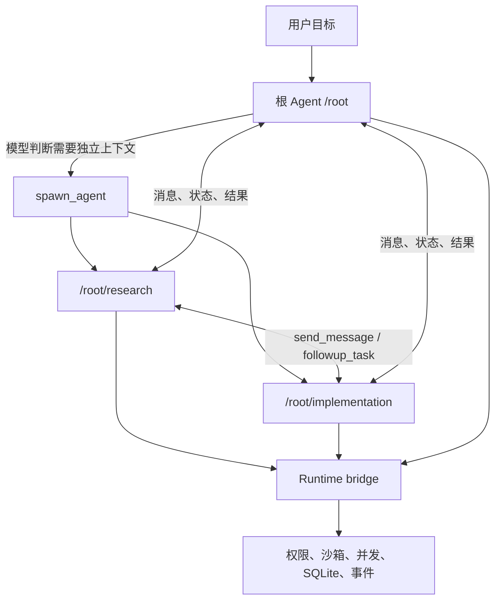
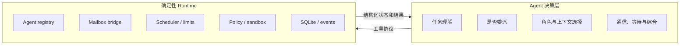
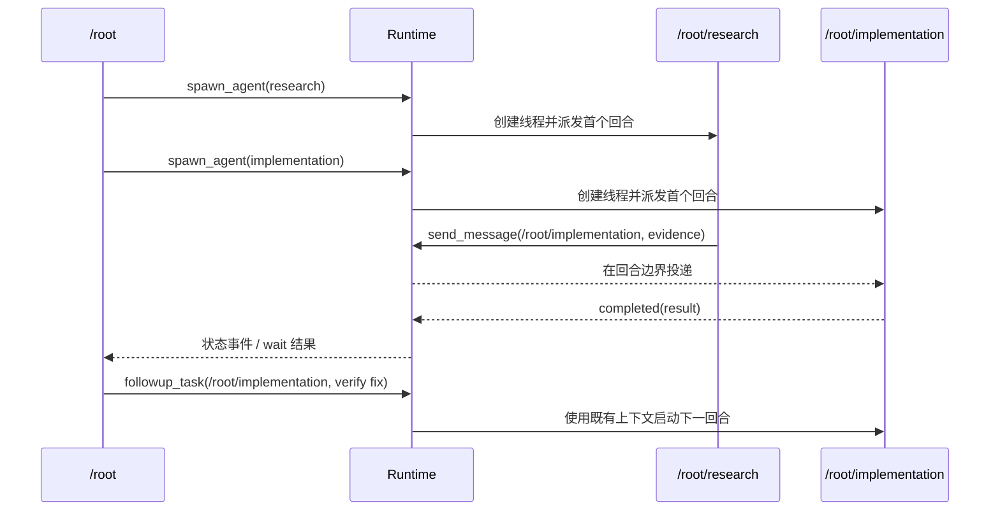
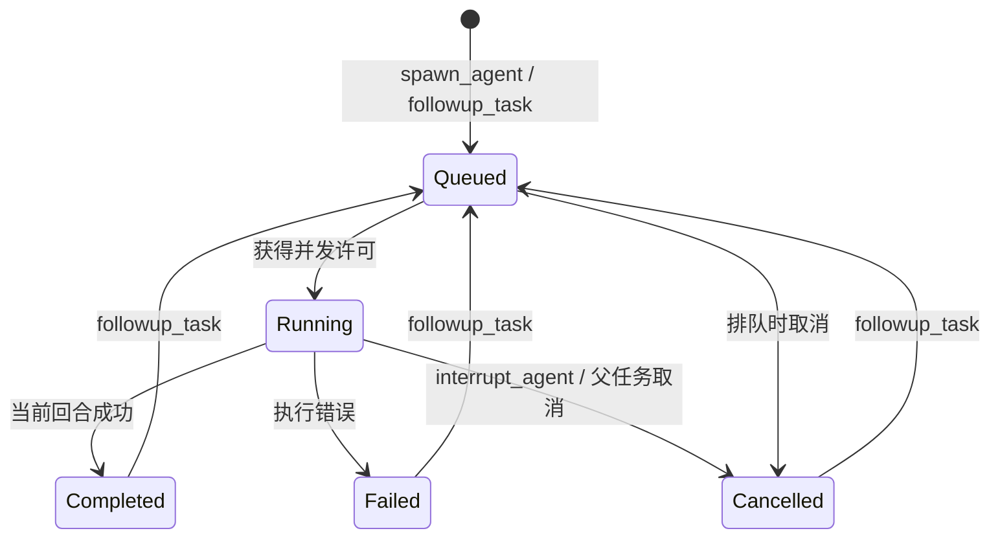

# 多智能体架构技术分析与 OpenTopia 选型

> 文档状态：已决策并进入实现
> 更新日期：2026-07-19
> 适用范围：OpenTopia 本地优先 Coding Agent / Work Agent
> 架构结论：采用 Codex 式模型主导编排。Agent 自己判断是否委派、委派给谁、何时通信和等待；系统只提供 Agent Thread、消息桥梁、权限继承、并发限制、持久化和可观测性。不采用 DAG 或 LangGraph 作为主控制平面。

## 1. 要解决的问题

多智能体不是“多调用几次模型”，而是同时处理六个工程问题：

1. 谁决定拆分任务；
2. 每个 Agent 是否拥有独立上下文和稳定身份；
3. Agent 之间如何直接通信；
4. 如何避免并行工作互相依赖或覆盖；
5. 权限、沙箱和工具能力如何继承；
6. 运行状态如何查询、取消、恢复和审计。

本次选型把第 1 项交给模型，把第 2 至第 6 项交给确定性的 Rust Runtime。运行时不理解业务工作流，也不生成任务 DAG。

## 2. 结论先行

OpenTopia 选择以下控制关系：



核心原则是：

- **模型拥有编排判断权**：是否派生、任务粒度、Agent 类型、上下文复制范围、通信和等待时机都由 Agent 决定。
- **系统拥有执行边界**：身份唯一性、最大线程数、最大深度、跨根任务隔离、权限继承和状态转换由代码保证。
- **通信是一等工具**：Agent 不依赖主 Agent 人工转发，可以按 UUID 或 `/root/...` 规范路径直接通信。
- **计划不是控制流**：`update_plan` 是 Agent 的持久任务记忆，不是系统调度 DAG。
- **依赖不自动推断**：存在依赖时，由 Agent 显式排序、发送前置结果或等待；系统不会猜测两个任务的先后关系。

## 3. Codex、TRAE 与 LangGraph 的本质差异

| 维度 | Codex 式 Agent Thread | TRAE 式专家 Agent | LangGraph |
| --- | --- | --- | --- |
| 首要目标 | 动态委派与并行协作 | 用描述和配置复用专家能力 | 显式、可恢复的状态工作流 |
| 控制流所有者 | 主 Agent/参与协作的 Agent | 主 Agent + 描述路由 | 图、节点和条件边 |
| 子执行单元 | 独立 Agent Thread | 独立专家上下文 | 节点、子图或 Agent |
| 通信 | spawn、消息、追问、打断、等待 | 通常由主 Agent 路由与结果回传 | 共享/持久状态和图转移 |
| 依赖表达 | Agent 在上下文中动态处理 | Agent 路由和提示词处理 | 显式边和状态条件 |
| 最适合 | 开放式编码、探索、评审、诊断 | 可复用专业角色 | 固定流程、长事务、审批流水线 |
| 主要风险 | 写冲突和协调不确定性 | 描述误路由、能力边界粗糙 | 图建模成本和运行时重复 |

### 3.1 Codex 的技术原理

Codex 的关键并不是 Supervisor 这个名称，而是四个结构：

- 每个子 Agent 是独立线程，有自己的模型回合和工具历史；
- Agent 有稳定身份，完成一轮后仍可接受后续任务；
- Agent Control 提供创建、消息、追问、打断、列举和等待桥梁；
- 子 Agent 继承父级沙箱与权限，角色配置只能按明确规则覆盖或收紧。

这是一种 **LLM-driven orchestration + deterministic runtime**。业务分解是概率性的，安全边界和生命周期是确定性的。

### 3.2 TRAE 的技术原理

TRAE 公开能力更强调声明式专家配置：`name`、`description`、提示词、工具和 MCP 能力共同构成可被主 Agent 选择的专家。它主要解决“谁适合做这件事”，不等于提供完整的依赖图、持久状态机或并行写隔离。

公开资料不足以证明 TRAE 的内部调度器使用了 LangGraph。界面或概念相似不能作为技术依赖证据，因此本项目不基于该假设做选型。

### 3.3 LangGraph 的技术原理

LangGraph 把状态、节点、条件边、checkpoint 和中断显式化。它适合流程拓扑相对稳定、需要跨进程恢复、人工审批或补偿事务的场景。

它也支持 Supervisor 和 Subagent，但控制流最终落在图上。OpenTopia 的 Coding Agent 路径往往要在观察代码后才知道下一步，预先图化会把模型本应拥有的判断权迁移到工作流代码中。

### 3.4 是否借鉴了 LangGraph

在通用概念层面，多种方案都包含状态、并发、等待和恢复，这些概念也来自 Actor、任务队列和工作流系统，不能据此判断“借鉴了 LangGraph”。

OpenTopia 当前决策是：

- 不引入 LangGraph 依赖；
- 不把任务关系保存为系统 DAG；
- 保留 SQLite 状态和事件持久化，但它记录事实，不决定下一步；
- 未来若需要固定审批流程，可通过独立 Workflow Adapter 接入，不改变 Agent Runtime 的控制权。

## 4. OpenTopia 的目标架构

### 4.1 两层职责



Runtime 必须回答“能不能做、目标是谁、现在是什么状态”；Agent 决定“为什么做、接下来做什么”。

### 4.2 Agent 身份

每棵用户任务树以 `/root` 开始。创建子 Agent 时提供符合 `[a-z0-9_]` 的 `task_name`：

```text
/root
├── /root/research
├── /root/implementation
└── /root/review
```

`SubagentRun.id` 是机器身份，`agent_path` 是模型可读的稳定身份。路径在同一根任务内不可重复；跨根任务不可解析或访问。

一个 Agent 完成当前回合后状态为 `completed`，但身份仍存在。`followup_task` 使用相同 ID 和上下文启动下一回合，而不是创建一个无关的新 Worker。

### 4.3 工具协议

主协议与 Codex V2 对齐：

| 工具 | 语义 |
| --- | --- |
| `spawn_agent` | 创建独立 Agent Thread，指定任务名、消息、Profile 和历史复制范围 |
| `send_message` | 向运行中 Agent 投递消息；空闲时只进入 mailbox，不自动开新回合 |
| `followup_task` | 向已有 Agent 发送新任务；空闲时启动新回合 |
| `interrupt_agent` | 中断当前回合，保留 Agent 身份供后续继续 |
| `list_agents` | 列出任务树状态、规范路径、Profile、最近任务和可用 Agent 类型 |
| `wait_agent` | 等待 mailbox/终止活动，或等待指定 Agent 当前回合 |

兼容期继续支持 `send_input`、`cancel_agent` 和 `wait_agents`。这些是旧名称或批量等待扩展，不是新的首选协议。

`spawn_agent` 的核心输入为：

```json
{
  "task_name": "api_review",
  "message": "检查 API 变更和兼容性风险，返回文件与证据。",
  "agent_type": "explorer",
  "fork_turns": "all"
}
```

`fork_turns` 支持：

- `none`：不复制父会话，任务必须自包含；
- `all`：复制父线程可用历史；
- 正整数：只复制最近若干个用户回合。

### 4.4 Agent Profile

Profile 的加载顺序为：内置 < 用户级 `<CODEX_HOME>/agents/*.toml` < 项目级 `.codex/agents/*.toml`。同名配置以后者覆盖前者。

内置 Profile：

- `default`：继承父级配置的通用 Agent；
- `worker`：面向明确实现范围；
- `explorer`：只读探索，禁用直接文件写工具。

配置示例：

```toml
name = "reviewer"
description = "Review changes for correctness and regressions"
developer_instructions = "Inspect the requested scope. Do not edit. Report findings with evidence."
model = "gpt-5.1-codex-mini"
model_reasoning_effort = "high"
sandbox_mode = "read-only"
denied_tools = ["write_file", "apply_patch"]
```

Profile 可以选择模型、推理强度、开发者指令和工具集合。沙箱覆盖采用单调收紧：子 Agent 可以从 `workspace-write` 降为 `read-only`，不能从父级 `read-only` 提升为 `danger-full-access`。

### 4.5 消息与回合



消息发送和启动回合是两个不同动作。这个区分避免“一条补充信息意外启动昂贵模型回合”，也允许多个 Agent 在对方忙碌时异步投递。

每个 Agent 回合进入终态时，Runtime 还会自动向 `parent_agent_path` 投递 `completion` mailbox 消息。父 Agent 无需轮询每个 UUID；`wait_agent` 可以在消息到达或 Agent 终止时被唤醒。子 Agent 也可以显式向 `/root` 发送中间证据。

## 5. 如何避免 Agent 工作依赖

“避免依赖”不是禁止任务有先后关系，而是避免隐式、不可见、同时写共享状态的依赖。

### 5.1 委派前的独立性判断

主 Agent 应只并行委派满足以下条件的工作：

- 输入可以在委派消息和选定历史中完整表达；
- 输出可以独立验收；
- 不要求读取另一个尚未产生的结果；
- 不与另一个 Agent 同时拥有同一文件或外部资源的写权限；
- 失败不会使其他并行结果失去意义。

如果不满足，应顺序执行，或者把前置结果通过 `send_message`/`followup_task` 显式传给下游 Agent。

### 5.2 按输出分解，不按步骤分解

不推荐：

```text
Agent A：先研究实现
Agent B：根据 A 的研究写代码（但 A 尚未完成）
```

推荐并行边界：

```text
Agent A：定位认证链路并提交只读证据
Agent B：审查测试覆盖并提交缺口清单
主 Agent：综合证据后决定实现
```

需要写代码时，按文件所有权或工作树划分：

```text
Agent A：只修改 crates/protocol/**
Agent B：只修改 apps/desktop/**
主 Agent：负责共享类型和最终集成
```

### 5.3 结构化交接

委派消息至少包含：

- 目标和非目标；
- 可修改路径或只读要求；
- 已知事实和不得重复的工作；
- 期望结果与验证证据；
- 是否允许继续派生 Agent。

系统不强制业务 Task Schema，因为这会把控制权重新搬回调度器；但 Agent Profile 和基础指令要求结果包含证据、状态和错误。

### 5.4 共享工作区规则

共享工作区是最主要的耦合来源。默认规则应是：

1. 读操作可以并行；
2. 写操作只在路径集合不相交时并行；
3. 共享协议文件、锁文件、迁移文件和生成物由一个 Agent 统一拥有；
4. 集成和最终验证由根 Agent 执行；
5. Agent 发现范围重叠时，应先发消息协调，而不是继续写。

这套规则由基础指令指导、由沙箱和未来的路径租约增强。当前系统不伪装成能够自动证明所有写集合互斥。

## 6. 生命周期与状态模型



`completed` 表示当前回合结束，不表示 Agent 身份销毁，也不表示根任务成功。根 Agent必须检查结果和错误后综合。

默认限制与 Codex 保持同类语义：

- 每棵根任务最多 6 个同时活动的 Agent Thread；
- 每个父级最多 6 个并发执行；
- 默认最大派生深度为 1；
- 父任务取消时递归取消活动后代；
- 进程重启时，将无法恢复的活动回合标记为失败，防止假运行状态。

## 7. 安全模型

### 7.1 权限继承

子 Agent 继承父级：

- 工作区根目录；
- Permission Mode 与审批策略；
- OS 沙箱和网络策略；
- MCP Host 与线程级启用状态；
- 浏览器运行时；
- 取消树和根任务隔离边界。

Profile 的模型和提示词可以变化，权限不能隐式升级。

### 7.2 跨 Agent 可见性

旧实现只允许直接父 Agent 通过 UUID 操作子 Agent。新实现采用：

- 同一 `parent_thread_id` 即同一根任务树；
- 树内可按 UUID 或规范路径通信；
- 跨根任务统一返回不可见，不披露目标是否存在；
- 用户级 REST API 仍先校验线程所有权。

### 7.3 审批

子 Agent 遇到需要用户审批的操作时，当前实现安全失败并要求根 Agent 直接执行。这避免多个后台 Agent 同时制造审批悬挂。未来可以把审批请求作为 mailbox 事件回传，但审批决定仍必须绑定原始工具调用和原始权限范围。

## 8. 持久化与可观测性

SQLite 的 `subagent_runs` 继续作为事实表，新增记录：

- `agent_path`、`parent_agent_path`；
- `agent_type`；
- `fork_turns`；
- `last_task_message`；
- 当前状态、结果、错误和时间戳。

`subagent_conversations` 独立保存每个 Agent 的模型对话。服务启动时先把遗留活动回合标记为失败，再把这些稳定 Agent 身份注册回 runtime；因此完成或失败的 Agent 可在重启后继续接收 `followup_task`。

状态变化仍通过 `SubagentEvent` 进入 SSE 和桌面时间线。数据库不存储 DAG，也不计算 ready task。

## 9. 当前代码映射

| 模块 | 职责 |
| --- | --- |
| `crates/opentopia-core/src/subagents.rs` | Agent registry、规范路径、并发、mailbox、follow-up、取消、等待和事件 |
| `crates/opentopia-core/src/agent_profiles.rs` | 内置/用户/项目 Agent Profile 加载与覆盖 |
| `crates/opentopia-core/src/tools.rs` | Codex 风格模型工具协议和兼容别名 |
| `crates/opentopia-core/src/agent.rs` | Agent 自主编排指令、身份注入、Profile 工具过滤和沙箱收紧 |
| `crates/opentopia-core/src/store.rs` | Agent 状态 schema、迁移、查询和重启恢复 |
| `crates/opentopia-server/src/main.rs` | 真实 AgentCore 执行、历史复制、连续对话、REST/SSE 桥梁 |
| `apps/desktop/src/types.ts` | Agent 状态的前端协议投影 |

## 10. 为什么当前不选 LangGraph

不选择的原因不是 LangGraph 能力不足，而是控制模型不匹配：

- OpenTopia 已经有 Rust AgentCore、SQLite、事件流、审批和沙箱；
- 再引入 Python/TypeScript 图运行时会产生两套生命周期和 checkpoint；
- 开放式编码任务很难在执行前画出可靠拓扑；
- 用户当前明确要求 Agent 自己判断，而不是系统先定义图。

以下场景仍适合独立使用 LangGraph：

- 流程和状态转换在运行前已知；
- 必须在每个节点 checkpoint 并跨进程恢复；
- 有大量人工审批、补偿和超时分支；
- 团队已有成熟 LangGraph 资产；
- OpenTopia 只作为远程工作流的客户端。

此时建议通过稳定的 HTTP/Event Adapter 接入，让 LangGraph 拥有自己的工作流，不直接写 OpenTopia SQLite，也不绕过本地策略引擎。

## 11. 验收标准

实现不能只看“模型似乎会调用子 Agent”，至少验证：

1. 两个独立 Agent 能并发运行且不超过线程上限；
2. 同一根任务内可以按路径直接通信，跨根任务不可见；
3. 完成的 Agent 能以同一 ID 接收 `followup_task`；
4. `send_message` 不会意外启动空闲 Agent；
5. `fork_turns=none/all/N` 产生正确父历史；
6. 项目 Profile 覆盖用户 Profile，未知类型被拒绝；
7. Profile 不能提升父沙箱权限；
8. 取消向活动后代传播；
9. SQLite 旧 schema 能无损迁移；
10. 根 Agent 能识别失败 Agent，不把 terminal 当作 success。

质量指标应关注：单 Agent 基线成功率、并行加速比、冲突率、重复工作率、消息数量、失败恢复率和总 Token，而不是只统计派生数量。

## 12. 最终决策

OpenTopia 的多智能体架构定义为：

```text
Agent-driven orchestration
    + persistent Agent identities and isolated conversations
    + direct mailbox communication
    + deterministic security/scheduling bridge
    + SQLite state and event observability
    - system-owned business DAG
    - LangGraph as the primary runtime
```

系统给 Agent 提供可用、可控、可观察的“桥”；Agent 根据任务现场自己决定如何协作。任务依赖存在时，由 Agent 显式排序或通过消息传递结果，不由隐藏的调度图接管。

## 13. 参考资料

1. OpenAI, [Codex Subagents](https://learn.chatgpt.com/docs/agent-configuration/subagents)。说明并行 Agent Thread、上下文隔离、控制工具、沙箱继承和自定义 Agent。
2. TRAE, [Subagents](https://docs.trae.ai/ide/subagents?_lang=en)。说明专家 Profile、描述路由、独立上下文、工具和 MCP 配置。
3. LangChain, [LangGraph Overview](https://docs.langchain.com/oss/python/langgraph/overview)。说明持久状态、durable execution、streaming 和 human-in-the-loop。
4. LangChain, [Multi-agent](https://docs.langchain.com/oss/python/langchain/multi-agent)。说明 subagents、handoffs、router 和 custom workflow。
5. OpenTopia, `docs/source-adaptation-map.md`。记录协议与实现来源。
6. OpenTopia, `docs/architecture-detailed.md`。记录当前 Rust Runtime、SQLite、权限、沙箱和桌面投影。
