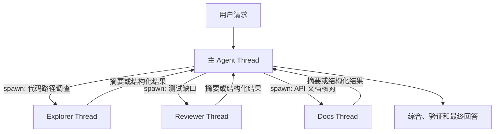
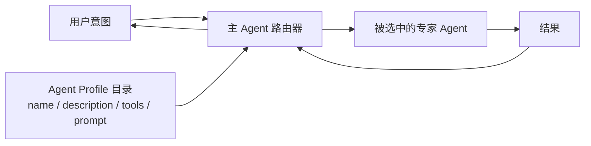
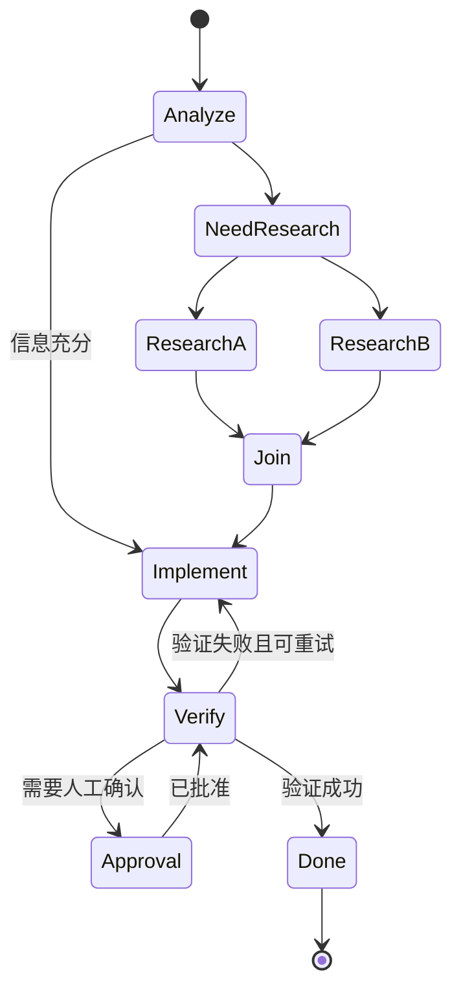
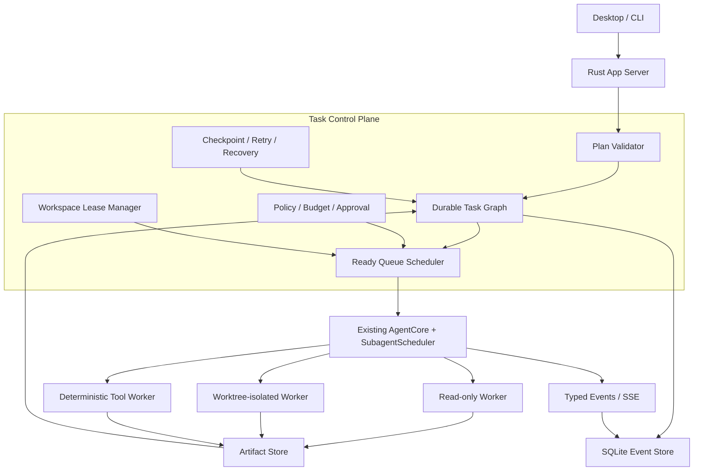

# 多智能体架构技术原理、方案比较与 OpenTopia 选型

> 文档状态：架构分析与选型建议
> 基准日期：2026-07-18
> 适用范围：OpenTopia 本地优先 AI Coding + Work Agent
> 结论摘要：保留现有 Rust 动态子智能体运行时，在其上增加持久任务 DAG、结构化任务契约、资源租约和写入隔离；不将 LangGraph 作为主运行时依赖。

## 1. 文档目标

本文回答四个问题：

1. Codex 式子智能体、TRAE 式子智能体和 LangGraph 式多智能体分别解决什么问题？
2. 它们在调度、状态、上下文、通信、依赖、故障恢复和安全方面如何工作？
3. 哪些相似点属于通用架构模式，哪些差异会直接影响工程实现？
4. OpenTopia 应选择哪种架构，如何在不推翻现有 Rust Core 的前提下演进？

本文只把公开文档和当前仓库源码能够确认的内容当作事实。TRAE 没有公开底层调度器源码，因此对它的分析限于公开产品协议，不推断其内部是否使用 LangGraph 或其他图运行时。

## 2. 结论先行

OpenTopia 不应在以下三个方案中三选一，而应组合它们各自最有价值的部分：

- 借鉴 **Codex 式动态主管模型**：让主 Agent 根据当前问题动态创建子 Agent，适合开放式代码探索、审查和问题诊断。
- 借鉴 **TRAE 式描述路由与专家配置**：用声明式 Agent Profile 管理角色、模型、提示词、工具和 MCP 权限，适合可复用的专业能力。
- 借鉴 **LangGraph 式显式状态图**：把任务依赖、状态转换、checkpoint、重试和人工审批建模为确定性控制平面，适合长任务和可恢复工作流。
- 保留 **OpenTopia 现有 Rust Agent Core、SQLite 事件存储、策略引擎和沙箱**，不要为了采用图概念再引入一套 Python 控制平面。

推荐架构可以概括为：

```text
模型负责提出计划和动态任务
        +
确定性控制平面负责验证、调度、权限、恢复和资源冲突
        +
独立 Agent Worker 负责在限定上下文和执行环境中完成任务
```

核心判断是：**Agent 可以参与规划，但不能成为唯一的调度器；任务图是持久数据，不是只存在于 Prompt 中的文字。**

## 3. 先区分五个容易混淆的对象

多智能体系统经常失败，不是因为模型能力不足，而是把以下对象混为一谈。

| 对象 | 定义 | 生命周期 | OpenTopia 当前对应 |
| --- | --- | --- | --- |
| Agent Profile | 角色、模型、提示词、工具、MCP、权限和输出约束的声明 | 长期配置 | 当前尚无完整一等模型 |
| Task | 一个有目标、输入、依赖、验收条件和输出契约的工作单元 | 可跨进程恢复 | 当前主要隐含在 `SubagentRun.input` 中 |
| Attempt / Run | 某个 Task 的一次实际执行 | 短于 Task，可重试 | 当前 `SubagentRun` 同时承担 Task 和 Run |
| Thread / Context | 模型会话及其上下文窗口 | 一次或多次模型回合 | 父 Thread 与子 Agent 临时 conversation |
| Artifact | Agent 发布、可被其他 Task 引用的结果 | 独立持久化 | 已有 `artifacts` 表，但未与任务依赖绑定 |

推荐设计必须把 Task 和 Attempt 分开：

- Task 表示“要完成什么”，重试时身份不变。
- Attempt 表示“这一次怎么执行”，每次重试有新的状态、日志、成本和错误。
- Agent Profile 表示“由谁执行”，可以在不同 Attempt 之间更换。
- Artifact 表示“可消费的结果”，下游任务只依赖已发布 Artifact，不依赖上游 Agent 的临时工作区。

## 4. 三类方案的技术原理

### 4.1 Codex 式动态主管与 Agent Thread

Codex 的公开模型是动态 Supervisor-Worker：主 Agent 在执行过程中判断哪些工作可以独立委派，创建多个 Agent Thread，随后发送补充指令、等待、停止并收集结果。[Codex Subagents][1]



#### 关键机制

- **动态派生**：是否创建子 Agent、创建几个以及任务内容，可以在运行时决定。
- **上下文隔离**：探索日志、工具输出和中间推理留在子线程，父线程只接收结果。
- **父子线程关系**：主 Agent 管理直接子线程，系统限制最大并发和最大递归深度。
- **能力继承与覆盖**：子 Agent 可以继承父会话的模型、权限和沙箱，也可以通过 Profile 收紧模型、工具或沙箱。
- **主 Agent 综合**：多个子 Agent 的结果不是自动成为最终结论，主 Agent仍需检查失败状态、冲突和证据。

#### 优势

- 非常适合开放式问题，模型可以根据新证据调整任务分解。
- 对现有单 Agent Tool Loop 改造较小，spawn、send、wait、cancel 都可以作为工具加入。
- 独立上下文可以减少主会话的上下文污染。
- 读密集型探索、审查、文档核对能够获得明显并行收益。

#### 局限

- 依赖关系通常只存在于主 Agent 的计划中，不一定成为可查询、可恢复的数据。
- 如果多个 Worker 共享工作区并同时写入，容易产生覆盖、脏读和验证失真。
- 模型驱动调度具有不确定性，同一请求可能产生不同数量和粒度的子任务。
- 子 Agent 数量越多，Token、工具调用、日志和协调成本越高。
- 如果递归委派默认开放，容易形成不可预测的扇出。

### 4.2 TRAE 式描述路由与专家 Agent

TRAE 公开的子 Agent 模型更强调声明式专家配置：用 Markdown 文件定义 `name`、`description`、模型、允许或禁止的工具、MCP Server 和系统提示词；内置主 Agent 根据任务意图与 `description` 的匹配结果选择专家。[TRAE Subagents][2]



#### 关键机制

- **描述驱动路由**：`description` 同时承担能力发现和触发条件。
- **配置即专家能力**：Agent Profile 把角色、工作流、边界和输出格式固化为可复用配置。
- **上下文隔离**：专家在独立上下文中检索、分析和执行，只把最终结果返回主 Agent。
- **工具白名单**：可以声明允许工具、禁止工具和 MCP Server，适合最小权限。
- **作用域覆盖**：项目级 Agent 可以覆盖同名用户级 Agent，便于团队规范化。

#### 优势

- 配置简单，用户和项目可以直接维护，不需要编写状态图代码。
- 适合代码审查、测试生成、安全扫描、项目问答等重复性专家任务。
- 专家提示词短而稳定，容易做单元评测和版本管理。
- 路由与能力发现天然结合，适合 Agent Marketplace 或团队能力目录。

#### 局限

- `description` 路由本质上仍是概率匹配，容易出现漏触发或误触发。
- 公开文档没有给出完整的并行任务图、checkpoint、子 Agent 间消息和工作区隔离协议。
- Profile 解决“谁适合做”，但不解决“任务之间有什么依赖”。
- 工具类别白名单不能替代路径级写入所有权和操作系统沙箱。

### 4.3 LangGraph 式显式状态图

LangGraph 是面向长时间、状态化 Agent 的低层编排运行时，核心能力包括持久状态、durable execution、streaming、human-in-the-loop 和 memory。[LangGraph Overview][3] 它的多智能体模式同样支持主 Agent 调用子 Agent、集中路由和上下文隔离，但把控制流和状态转换显式表示为图。[Multi-agent][4] [Subagents][5]



#### 关键机制

- **显式状态**：状态对象由节点读取和更新，不只存在于聊天历史中。
- **节点和边**：节点执行确定的工作，条件边决定下一步。
- **Checkpoint**：每个关键状态可以持久化，进程重启后继续。
- **确定性与模型决策混合**：某些边由代码决定，某些边由模型分类或规划决定。
- **人工中断**：流程可以在审批点暂停，保存状态后等待用户。
- **子图复用**：专家工作流可以作为子图嵌入更大的流程。

#### 优势

- 依赖、重试、补偿、超时和人工审批都能显式表达。
- 适合受监管流程、批处理、文档流水线、长期项目任务和外部系统编排。
- 状态可视化和可测试性通常强于纯 Prompt 调度。
- 对失败恢复和幂等控制更友好。

#### 局限

- 开放式 Coding Agent 的执行路径很难在开始前完整画出，过度图化会限制模型探索。
- 图节点、状态 schema、checkpoint 和版本迁移带来额外工程成本。
- 如果 OpenTopia 直接引入 LangGraph，需要增加 Python 或 TypeScript 运行时边界，并与现有 Rust Agent Core、SQLite 和事件流重复建模。
- 图可以表达错误的依赖；显式不等于正确，仍需任务契约和资源隔离。

### 4.4 是否“借鉴 LangGraph”不是关键选型依据

Codex、TRAE 和 LangGraph 都使用 Supervisor、子 Agent、独立上下文和结果汇总，但这些模式也可以从 Actor Model、任务队列、工作流引擎和 DAG Scheduler 独立推导出来。

技术选型不应基于“谁先做了相似界面”，而应基于以下问题：

- 控制流是否需要在运行前确定？
- 任务是否必须跨重启恢复？
- 是否允许多个 Agent 产生外部副作用？
- 是否需要强审计和人工审批？
- 当前技术栈是否已经拥有状态存储、事件流和执行运行时？

## 5. 多智能体系统的共同底座

无论选择哪种上层模式，可靠系统都需要以下九个底层模块。

### 5.1 Control Plane 与 Worker Plane

应把系统拆成两个平面：

| 平面 | 职责 | 不应负责 |
| --- | --- | --- |
| Control Plane | 任务状态、依赖、调度、预算、权限、租约、重试、取消、恢复 | 具体代码分析和长文本生成 |
| Worker Plane | 模型推理、工具调用、产物生成、局部验证 | 任意修改全局任务状态、绕过策略扩大权限 |

主 Agent 可以向 Control Plane 提交“建议创建这些任务”，但 Control Plane 必须验证：

- 深度和并发是否超过限制；
- 依赖是否成环；
- 工具和写入范围是否超出父任务权限；
- Token、时间和外部 API 预算是否足够；
- 是否存在冲突的资源租约；
- 任务输出是否有可验证契约。

### 5.2 状态机

推荐使用两层状态机。

#### Task 状态

```text
pending -> ready -> running -> succeeded
                    |          |
                    |          -> invalidated
                    -> failed -> ready（满足重试策略）
                    -> blocked
                    -> cancelled
```

#### Attempt 状态

```text
queued -> starting -> running -> waiting_approval -> running
                            -> succeeded
                            -> failed
                            -> timed_out
                            -> cancelled
                            -> interrupted
```

Task 的最终状态不能简单等于某次 Attempt 的状态。例如第一次 Attempt 超时，Task 可以保持 `ready` 并创建第二次 Attempt。

### 5.3 上下文与记忆

可靠的上下文拓扑应是“隔离执行、引用共享”：

- 父 Agent 保存用户目标、关键约束、已批准决策和任务图摘要。
- 子 Agent 接收经过裁剪的 TaskSpec，而不是完整父会话。
- 子 Agent 的工具日志和中间推理留在自己的 Attempt 中。
- 上游结果通过 ArtifactRef 或结构化 AgentResult 发布。
- 下游 Agent 读取 Artifact，不读取兄弟 Agent 的临时对话。

这能同时减少上下文污染、隐式依赖和敏感信息扩散。

### 5.4 消息协议

推荐默认采用主 Agent 中介的星型通信，而不是 Worker 之间自由发送消息。

消息至少需要以下字段：

```json
{
  "messageId": "uuid",
  "taskId": "uuid",
  "attemptId": "uuid",
  "sender": "controller-or-parent-attempt",
  "kind": "instruction|steer|cancel|result|error|heartbeat",
  "sequence": 12,
  "createdAt": "RFC3339",
  "payload": {},
  "idempotencyKey": "stable-key"
}
```

星型通信的好处是：权限检查、审计、顺序、取消和上下文裁剪都有唯一入口。只有在低延迟协同确有必要时，才开放经过 Control Plane 转发的 Worker 间消息。

### 5.5 任务依赖

依赖分为三种，必须分别建模：

| 依赖类型 | 示例 | 表达方式 |
| --- | --- | --- |
| 控制依赖 | 必须先冻结接口，再实现前后端 | `task_edges` 中的 `requires_success` |
| 数据依赖 | 测试生成依赖 API Schema | 输入中的 `ArtifactRef` |
| 资源依赖 | 两个 Agent 都要修改同一目录 | `ResourceLease` 或独立 worktree |

只记录 `parent_task_id` 不能表达完整依赖。父子关系表示“谁创建了谁”，DAG 边表示“谁必须等待谁”。二者不能混用。

### 5.6 工作区与写入隔离

多 Agent 读共享工作区通常安全，多 Agent 写共享工作区通常不安全。建议提供三档执行方式：

| 模式 | 适用任务 | 隔离策略 |
| --- | --- | --- |
| shared-readonly | 检索、审查、分析、日志归纳 | 同一工作区，只读沙箱 |
| path-lease | 明确互不重叠的小范围修改 | 共享工作区，路径租约和写入拦截 |
| worktree-isolated | 并行实现、重构、依赖升级 | 每个写任务独立 Git worktree/分支 |

最终集成由一个 Integration Task 完成。不要让多个 Worker 在共享工作区中通过“礼貌约定”避免冲突，Prompt 不是并发控制机制。

### 5.7 权限与安全

子 Agent 的有效权限必须取多个策略的交集：

```text
effective_policy =
    parent_policy
  ∩ agent_profile_policy
  ∩ task_policy
  ∩ workspace_policy
  ∩ administrator_policy
```

子 Agent 可以自动收紧权限，不能自行扩大权限。高风险审批应路由到根任务或用户，不应因为某个 Worker 请求权限就自动放开整个父会话。

### 5.8 故障恢复和幂等

可靠恢复需要：

- 每次状态转换先写持久事件，再向 UI 推送；
- Worker 定期写 heartbeat 和 lease 到期时间；
- 重启时把失去 lease 的 Attempt 标记为 `interrupted`，再根据重试策略决定是否恢复；
- 外部副作用携带 idempotency key；
- 重试创建新 Attempt，不覆盖旧 Attempt；
- 已发布 Artifact 不可原地修改，只能产生新版本；
- 取消沿任务图向后代传播，但不删除审计历史。

### 5.9 预算与背压

并发不是越高越好。系统总耗时可近似表示为：

```text
T_total ≈ T_serial + max(T_parallel_i) + T_coordination + T_integration
```

当协调和集成成本超过节省的并行时间时，多 Agent 反而更慢。调度器至少应限制：

- 每根任务最大并发；
- 每 Provider 最大并发和速率；
- 每任务 Token、时间、工具调用和外部费用；
- 每工作区最大写入 Worker 数；
- 最大递归深度；
- 排队长度和等待超时。

## 6. 方案比较

### 6.1 能力比较

| 维度 | Codex 式动态主管 | TRAE 式描述路由 | LangGraph 式显式图 | 推荐混合方案 |
| --- | --- | --- | --- | --- |
| 开放式任务探索 | 强 | 中强 | 中 | 强 |
| 专家能力复用 | 中强 | 强 | 强 | 强 |
| 显式任务依赖 | 弱到中 | 弱 | 强 | 强 |
| 跨重启恢复 | 取决于运行时 | 公开信息不足 | 强 | 强 |
| 人工审批节点 | 可实现 | 工具权限为主 | 强 | 强 |
| 动态派生 | 强 | 中 | 可实现 | 强 |
| 确定性和可测试性 | 中 | 中 | 强 | 强 |
| 对现有 Tool Loop 改造 | 小 | 小 | 大 | 中 |
| Rust 本地优先适配 | 强 | 可自行实现 | 直接采用成本高 | 强 |
| 多写者冲突防护 | 需要额外设计 | 公开协议未覆盖 | 需要资源层补充 | 明确内建 |

### 6.2 面向 OpenTopia 的加权评分

评分范围为 1 到 5，越高越适合 OpenTopia。交付复杂度一项中，高分表示更容易交付。权重来自当前 Rust 本地优先、SQLite 持久化和 Coding Agent 产品定位，不代表通用排名。

| 评价项 | 权重 | Codex 式 | TRAE 式 | 直接采用 LangGraph | Rust 混合方案 |
| --- | ---: | ---: | ---: | ---: | ---: |
| 当前 Rust/SQLite 架构兼容性 | 25% | 5 | 4 | 2 | 5 |
| 开放式 Coding Agent 能力 | 20% | 5 | 4 | 4 | 5 |
| 确定性、持久化与恢复 | 20% | 3 | 2 | 5 | 5 |
| 权限、隔离与冲突治理 | 15% | 3 | 3 | 4 | 5 |
| MVP 交付复杂度 | 10% | 5 | 5 | 2 | 3 |
| 长期扩展性 | 10% | 4 | 3 | 5 | 5 |
| **加权总分** | **100%** | **4.20** | **3.45** | **3.60** | **4.80** |

### 6.3 场景选择

| 场景 | 优先选择 |
| --- | --- |
| 临时代码探索、PR 多视角审查 | Codex 式动态主管 |
| 团队标准化代码审查、安全扫描、测试生成 | TRAE 式 Agent Profile + 描述路由 |
| 固定审批流、批处理、受监管业务流程 | 显式状态图 |
| 开放式代码任务，同时要求恢复、审计和人工确认 | 动态主管 + 持久 DAG 混合方案 |
| 团队已经大量使用 Python/LangGraph，OpenTopia 只作为桌面入口 | 通过远程 Workflow Adapter 对接 LangGraph |

## 7. OpenTopia 当前实现评估

### 7.1 已有能力

当前实现已经具备一个可靠动态子 Agent 运行时的主要骨架：

- `SubagentRun` 记录父 Thread、父 Turn、名称、输入、深度、状态、结果、错误和时间戳。
- `SubagentScheduler` 使用每父 Turn 的 `Semaphore` 控制并发，默认每父任务 4 个并发。
- `mpsc` 输入通道支持父 Agent 向运行中的子 Agent 追加指令。
- `watch` 通道支持等待单个子 Agent 状态，`broadcast` 支持运行时事件订阅。
- `CancellationToken` 支持单个取消和后代递归取消。
- `ensure_visible` 限制 Agent 只能控制同 Thread、同父 Turn、下一深度的直接子 Agent。
- `spawn_agent`、`send_input`、`cancel_agent`、`wait_agent`、`wait_agents` 已作为模型工具进入主 Tool Loop。
- `wait_agents` 能并发收集最多 8 个直接子 Agent 的成功、失败或等待错误。
- `ServerSubagentExecutor` 复用当前 Provider、MCP、权限、沙箱和工作区。
- `StoreSubagentObserver` 将状态投影到 SQLite，桌面端通过 API/SSE 展示。
- 进程重启时，仍处于 queued/running 的子任务会被标记为失败，避免显示假运行状态。

对应实现位置：

- `crates/opentopia-core/src/subagents.rs`
- `crates/opentopia-core/src/tools.rs`
- `crates/opentopia-core/src/agent.rs`
- `crates/opentopia-core/src/store.rs`
- `crates/opentopia-server/src/main.rs`

### 7.2 当前模型的结构性缺口

| 缺口 | 当前表现 | 后果 |
| --- | --- | --- |
| Task 与 Attempt 未分离 | `SubagentRun` 同时表示任务和执行 | 无法干净重试、换模型或保留多次尝试 |
| 没有显式依赖边 | 只有 `parent_turn_id` | 不能可靠表达 A、B 完成后才能启动 C |
| 任务契约是自由文本 | `spawn_agent` 只有 `name` 和 `input` | 输入、输出、权限、预算和验收不可机器验证 |
| 没有 Agent Profile | 子 Agent 克隆主 Agent 配置 | 无法稳定选择专用模型、工具、提示词和沙箱 |
| 共享写入没有所有权 | 子 Agent 继承同一 workspace | 并行写入可能覆盖和脏读 |
| 没有任务级预算 | 只有并发、深度和可选超时 | 无法限制 Token、工具调用和外部费用 |
| 重启后只失败，不续跑 | active run 被标记 failed | 可观测但不是真正 durable execution |
| 结果主要是文本 | `result: Option<String>` | 下游无法可靠消费结构化输出和证据 |
| 审批无法续接 | 子 Agent 遇到 suspended 直接失败 | 安全但限制长任务和受控写操作 |
| steering 窗口很短 | 一轮完成后仅短暂等待输入 | `send_input` 更像运行中补充，不是持久子线程会话 |

### 7.3 现有实现中需要优先调整的默认值

当前 `SubagentSchedulerConfig::default()` 使用 `max_depth = 2`。建议产品默认改为 1，仅在显式 Workflow 或管理员配置中允许更深递归。

原因：

- 绝大多数任务只需要根 Agent 派生直接 Worker；
- 深度 2 已允许 Worker 再扇出一层，任务和 Token 数可能快速增长；
- 现有运行时尚无全局 Token/费用预算和 DAG 环检测；
- 递归委派的收益可以在完成预算和依赖治理后再验证。

## 8. 推荐架构：Dynamic Agent Runtime + Durable Task DAG

### 8.1 总体结构



### 8.2 控制权分配

| 决策 | 决策者 |
| --- | --- |
| 是否建议拆分任务 | 主 Agent |
| TaskSpec 是否有效 | Plan Validator |
| 依赖是否满足、何时运行 | Scheduler |
| 使用哪个 Agent Profile | 路由规则，必要时由主 Agent 建议 |
| 实际工具调用 | Worker Agent |
| 工具是否允许 | Policy + Sandbox |
| 是否需要审批 | Policy Engine |
| 是否重试、取消、恢复 | Control Plane |
| 多结果如何形成最终交付 | Integration Task 或主 Agent |

这个边界保留了模型的灵活性，又避免模型直接操纵全局状态。

## 9. 推荐数据契约

### 9.1 Agent Profile

建议增加项目级和用户级 Agent Profile，格式可以借鉴 Codex TOML 或 TRAE Markdown，但存储层统一归一化为结构化模型。

```rust
struct AgentProfile {
    id: String,
    name: String,
    description: String,
    developer_instructions: String,
    model: Option<String>,
    reasoning_effort: Option<String>,
    allowed_tools: Vec<String>,
    denied_tools: Vec<String>,
    allowed_mcp_servers: Vec<String>,
    sandbox_mode: SandboxMode,
    default_output_schema: Option<JsonSchema>,
}
```

推荐覆盖顺序：

```text
内置默认 < 用户级 Profile < 项目级 Profile < Task 临时收紧策略
```

后层只能在管理员允许的范围内覆盖，Task 临时策略默认只能收紧权限。

### 9.2 TaskSpec

```rust
struct AgentTaskSpec {
    task_id: Uuid,
    root_turn_id: Uuid,
    parent_task_id: Option<Uuid>,
    title: String,
    objective: String,
    agent_profile: String,
    dependency_ids: Vec<Uuid>,
    input_artifacts: Vec<ArtifactRef>,
    allowed_read_paths: Vec<PathSpec>,
    allowed_write_paths: Vec<PathSpec>,
    execution_mode: ExecutionMode,
    output_schema: JsonSchema,
    acceptance_criteria: Vec<AcceptanceCriterion>,
    budget: TaskBudget,
    retry_policy: RetryPolicy,
    idempotency_key: String,
}
```

`dependency_ids` 是创建任务时的 API 便利字段。Plan Validator 接受后应将其规范化为 `task_edges`，持久层只以 `task_edges` 为依赖关系的单一事实源，避免两份依赖数据发生漂移。

`ExecutionMode` 建议至少支持：

```rust
enum ExecutionMode {
    SharedReadonly,
    SharedPathLease,
    GitWorktree,
    NoWorkspace,
}
```

### 9.3 AgentResult

```rust
struct AgentResult {
    task_id: Uuid,
    attempt_id: Uuid,
    status: ResultStatus,
    summary: String,
    structured_output: serde_json::Value,
    artifacts: Vec<ArtifactRef>,
    changed_paths: Vec<PathBuf>,
    verification: Vec<VerificationEvidence>,
    assumptions: Vec<String>,
    unresolved: Vec<String>,
    usage: UsageSummary,
}
```

控制平面必须先验证 `structured_output` 是否符合 `output_schema`，再把任务标记为 succeeded。模型说“完成了”不能替代 schema 和验收证据。

### 9.4 持久化表

建议新增或重构为：

| 表 | 关键字段 | 用途 |
| --- | --- | --- |
| `agent_profiles` | id、scope、config_json、version | 专家配置与版本 |
| `agent_tasks` | id、root_turn_id、parent_task_id、spec_json、status | 稳定任务身份 |
| `task_edges` | from_task_id、to_task_id、condition | 显式 DAG |
| `agent_attempts` | id、task_id、profile_version、status、usage、error | 每次实际执行 |
| `task_messages` | task_id、attempt_id、sequence、kind、payload | 可恢复消息通道 |
| `resource_leases` | resource_key、attempt_id、mode、expires_at | 路径和工作区并发控制 |
| `task_artifacts` | task_id、artifact_id、role、version | 输入和输出绑定 |
| `task_checkpoints` | task_id、attempt_id、state_json、created_at | 恢复点 |

`subagent_runs` 可以在迁移期继续保留，并逐步映射为 `agent_tasks + agent_attempts`，避免一次性重写 UI 和 API。

## 10. 调度算法

### 10.1 Ready 条件

Task 只有同时满足以下条件才能进入 Ready Queue：

```text
所有 requires_success 前置任务均 succeeded
AND 所有输入 Artifact 可读取且版本有效
AND 预算未耗尽
AND 权限策略有效
AND 所需资源租约可获得
AND 未被用户或祖先任务取消
```

### 10.2 调度伪代码

```text
loop:
  persist incoming events
  mark expired leases and interrupted attempts
  compute ready tasks from durable DAG
  order by priority, age, critical path and cost

  for task in ready tasks:
    if provider quota unavailable: continue
    if workspace lease unavailable: continue
    validate effective policy
    create attempt
    acquire leases
    dispatch to AgentCore worker

  consume worker events
  validate result schema and acceptance evidence
  publish immutable artifacts
  transition task state
  release leases
```

### 10.3 公平性和背压

当前每父 Turn 一个 Semaphore 的实现简单有效，应保留为 Worker Plane 的局部限流，同时在 Control Plane 增加：

- 全局 Provider Semaphore；
- 每 Project 和每 root Turn 并发上限；
- 读任务与写任务独立队列；
- 基于 Token 估算的 weighted permit；
- 队列长度限制和拒绝策略；
- critical path 优先级，避免大量低价值探索阻塞集成任务。

## 11. 如何消除隐藏依赖

真正的业务依赖不能消除，只能显式化。推荐强制以下不变量：

1. Worker 不能通过读取兄弟 Worker 的临时目录形成数据依赖。
2. 下游 Task 只能消费已发布 Artifact 或已冻结的仓库基线。
3. 没有满足前置边的 Task 不能进入 Ready。
4. 同一资源作用域同时最多一个写租约。
5. 读租约不能读取尚未提交的 worktree 变更。
6. Task succeeded 后输出不可原地修改；变更输出必须创建新版本并使下游失效。
7. 集成结果发生变化时，依赖该结果的验证 Task 必须重新运行。
8. 失败、超时和取消是正式结果，不能包装成空的成功摘要。
9. 重试使用新 Attempt，不能覆盖失败证据。
10. 递归派生必须受根任务统一预算约束。

### 11.1 推荐的代码任务分层

```text
L0 并行只读
  代码路径调查 / API 约束 / 测试缺口 / 安全风险

L1 冻结契约
  主 Agent 或 Contract Task 产出接口、文件所有权和验收标准

L2 并行实现
  后端 worktree / 前端 worktree / 测试 worktree

L3 单一集成
  Integration Task 合并提交并解决冲突

L4 独立验证
  Verify Task 在集成基线上运行全量测试、安全检查和产品验收
```

## 12. 审批、取消与恢复

### 12.1 子 Agent 审批

当前子 Agent 遇到审批挂起时直接失败，这是安全的 MVP 行为。下一阶段建议：

1. Worker 发出 `approval_requested` 事件并暂停 Attempt。
2. Control Plane 把请求绑定到 root Turn 和具体 Task。
3. UI 展示操作、原因、路径、命令和有效权限变化。
4. 用户批准后只恢复该 Attempt 的一次具体动作。
5. 拒绝后由重试策略决定改写方案、阻塞任务或失败。

批准不能永久提升 Profile 权限，也不能自动传播到兄弟 Task。

### 12.2 取消传播

建议支持三种取消：

- `cancel_attempt`：只取消当前执行，Task 可以重试。
- `cancel_task`：取消 Task 及依赖它且尚未运行的后代。
- `cancel_root`：取消整张任务图，递归停止所有活动 Attempt。

现有 `cancel_parent` 的递归取消逻辑可以作为 `cancel_root` 的基础，但需要按 Task Edge 而不只是父子 Run 关系传播。

### 12.3 重启恢复

建议从当前“重启后把活动子任务标记 failed”演进为：

```text
queued       -> 重新入队
starting     -> interrupted，按策略重试
running      -> 检查 heartbeat/lease；本地进程已消失则 interrupted
waiting_approval -> 保持等待并恢复 UI 卡片
succeeded    -> 不重跑，验证 Artifact 完整性
failed       -> 保留原状态，按 retry_policy 决定是否创建新 Attempt
```

## 13. Agent Profile 与路由设计

建议把 TRAE 的描述路由作为能力发现层，而不是唯一调度层。

### 13.1 路由顺序

```text
1. 用户显式指定 Profile
2. Workflow 节点固定 Profile
3. 项目规则按任务类型映射 Profile
4. description 语义匹配给出候选
5. 主 Agent 在候选中选择
6. 无匹配时使用 default/worker/explorer
```

### 13.2 路由必须可解释

每次自动路由至少记录：

- 候选 Profile；
- 匹配分数或规则；
- 最终选择；
- 实际使用的 Profile 版本；
- 被覆盖的模型、工具和沙箱配置。

这能支持回放、评测和定位误路由，而不是只看到“Agent 自动选择了 reviewer”。

## 14. 为什么不建议直接把 LangGraph 作为主控制平面

对新建 Python 工作流服务，LangGraph 是合理选择；对当前 OpenTopia，直接替换的成本大于收益。

### 14.1 重复能力

OpenTopia 已有：

- Rust Agent Tool Loop；
- SQLite Thread、Turn、Event、Approval、Artifact 和 Subagent 持久化；
- REST + SSE 控制面；
- 策略引擎和 OS 沙箱；
- 取消、超时和恢复状态；
- Electron 本地服务生命周期。

引入 LangGraph 主控制面会形成两套状态机、两套 checkpoint、两套事件协议和跨语言错误边界。

### 14.2 部署成本

本地桌面产品需要额外分发 Python Runtime、依赖环境和进程管理，增加安装体积、冷启动、升级、签名和故障诊断复杂度。

### 14.3 推荐的兼容方式

为未来保留接口，而不是现在绑定实现：

```rust
trait WorkflowEngine {
    async fn submit(&self, workflow: WorkflowSpec) -> Result<WorkflowId>;
    async fn signal(&self, workflow_id: WorkflowId, signal: WorkflowSignal) -> Result<()>;
    async fn snapshot(&self, workflow_id: WorkflowId) -> Result<WorkflowSnapshot>;
    async fn cancel(&self, workflow_id: WorkflowId) -> Result<()>;
}
```

默认实现为 `NativeDagWorkflowEngine`。如果企业用户已有 LangGraph 服务，可以增加 `RemoteLangGraphAdapter`，通过稳定 HTTP/Event 协议交换 Task、Signal 和 Artifact，不让 LangGraph 直接写 OpenTopia SQLite 或绕过策略引擎。

## 15. 分阶段实施路线

### Phase 0：收紧现有动态运行时

目标：不改总体架构，先消除明显风险。

- 默认 `max_depth` 从 2 调整为 1。
- 为 `spawn_agent` 增加可选 `profile`、`outputSchema`、`readOnly`、`timeout` 和 `budget`。
- 为 `wait_agents` 固化结构化 `AgentResult`。
- 子 Agent 默认 read-only；写入必须显式声明。
- 记录每个子 Agent 的 Token、工具调用、持续时间和 changed paths。
- 增加根任务总并发和总 Token 预算。

验收：现有动态多 Agent 功能不回归；失败状态、成本和变更范围可查询。

### Phase 1：Task / Attempt 分离

目标：建立可重试、可恢复的稳定任务身份。

- 新增 `agent_tasks`、`agent_attempts`、`task_messages`。
- 将现有 `SubagentRun` API 映射到一个 Task 和一个 Attempt。
- 重试创建新 Attempt。
- steering 写入持久消息表，不依赖进程内短时输入窗口。
- UI 分开展示 Task 状态和 Attempt 历史。

验收：服务重启后可恢复 queued Task，可查看每次失败尝试。

### Phase 2：持久 DAG

目标：消除隐藏控制依赖和数据依赖。

- 新增 `task_edges` 和 DAG 环检测。
- 新增 ArtifactRef 输入输出绑定。
- 实现 Ready Queue 和依赖满足计算。
- 支持 Join、条件边和失败策略。
- 主 Agent 的计划先提交给 Plan Validator，再进入调度器。

验收：A、B 并行，C 等待 A、B 成功的流程可跨重启完成。

### Phase 3：写入隔离和集成任务

目标：支持可靠的并行代码修改。

- 实现 shared-readonly、path-lease、git-worktree 三种执行模式。
- 写工具检查 ResourceLease。
- Worktree Task 返回 commit Artifact。
- Integration Task 负责合并、冲突解决和集成测试。
- 验证任务基于不可变 commit，而不是变化中的工作区。

验收：两个并行写任务不会修改同一工作区；冲突只在集成阶段出现并可追踪。

### Phase 4：Agent Profile 与工作流生态

目标：支持可复用专家和可视化工作流。

- 加载用户级和项目级 Agent Profile。
- 支持描述路由、显式 Profile 和版本锁定。
- 提供内置 explorer、worker、reviewer、integrator、verifier。
- 增加 Workflow 模板和图形化 Task DAG 视图。
- 视需求实现 Remote LangGraph Adapter。

验收：同一 Workflow 在固定 Profile、模型和输入下可重复评测和回放。

## 16. 评测指标

多智能体功能不能只以“看起来更聪明”验收。建议至少跟踪：

| 类别 | 指标 |
| --- | --- |
| 正确性 | Task 成功率、最终验收通过率、错误综合率 |
| 并行收益 | 单 Agent 与多 Agent 的 p50/p95 总耗时、关键路径耗时 |
| 协调成本 | 主 Agent 综合 Token、等待时间、无效 steering 次数 |
| 资源成本 | 总 Token、模型费用、工具调用、进程峰值、磁盘占用 |
| 依赖质量 | 未声明依赖数、DAG 环拒绝数、Artifact 缺失率 |
| 写入安全 | 路径租约冲突数、worktree 合并冲突率、越界写拒绝数 |
| 恢复能力 | 重启后恢复率、重复副作用数、孤儿 Attempt 数 |
| 路由质量 | Profile 误选率、用户覆盖率、路由稳定性 |
| 可观测性 | 每个失败是否能定位到 Task、Attempt、工具和策略决定 |

建议用同一组任务做四种基线：

1. 单 Agent；
2. 动态多 Agent；
3. 固定 DAG；
4. 动态计划 + 持久 DAG 混合方案。

如果混合方案没有显著提升成功率、恢复能力或墙钟时间，就不应仅因架构更复杂而上线。

## 17. 不建议的设计

- 不允许 Worker 自由修改全局任务图。
- 不默认开放 Worker 继续派生 Worker。
- 不让多个写 Agent 共享同一工作区且没有租约。
- 不把 `parent_id` 当作完整依赖图。
- 不把完整父会话复制给每个 Worker。
- 不用自然语言“请返回 JSON”代替 JSON Schema 校验。
- 不把任务成功等同于模型输出“完成”。
- 不在重试时覆盖旧 Run 和错误证据。
- 不把审批模式和沙箱模式混为一个开关。
- 不为了图形化界面过早把所有开放式 Agent 行为静态节点化。
- 不在当前阶段引入第二套 Python 主控制平面。
- 不把 Agent 数量当成能力指标，优先衡量任务闭环和证据质量。

## 18. 最终选型

### 18.1 推荐

OpenTopia 采用 **Rust 原生混合多智能体架构**：

```text
现有 AgentCore / SubagentScheduler
  负责动态派生、模型 Tool Loop、局部并发、取消和结果收集

新增 Durable Task Control Plane
  负责任务 DAG、Task/Attempt、预算、租约、审批、重试和恢复

新增 Agent Profile Registry
  负责专家配置、描述路由、模型和工具权限

新增 Workspace Isolation
  负责只读共享、路径租约和 Git worktree
```

### 18.2 不推荐

- 不推荐用 TRAE 式描述路由单独承担整个调度系统，因为它不能表达完整依赖和恢复语义。
- 不推荐只保留 Codex 式自由动态派生，因为 OpenTopia 的 Work Agent 目标需要长期任务、审批和可恢复状态。
- 不推荐直接将 LangGraph 嵌入为主运行时，因为它与现有 Rust/SQLite 控制面重复，增加本地桌面部署复杂度。

### 18.3 决策复核条件

出现以下情况时，可以重新评估直接使用 LangGraph 或其他成熟工作流引擎：

- 产品转为云端 Python 服务优先；
- 团队主要工作流已经以 LangGraph 图存在；
- 需要大量现成 checkpoint、human-in-the-loop 和工作流部署能力；
- Rust 原生 DAG 的维护成本经过实际数据证明高于跨运行时成本；
- OpenTopia 退化为工作流客户端，不再拥有本地执行和策略控制面。

在这些条件出现之前，最稳妥的路线是复用现有 Rust Runtime，借鉴 LangGraph 的状态图语义，而不是引入 LangGraph 本身。

## 19. 参考资料

1. OpenAI, [Codex Subagents](https://learn.chatgpt.com/docs/agent-configuration/subagents)。公开说明并行子 Agent、Agent Thread、上下文隔离、spawn/steer/wait/stop、沙箱继承和自定义 Agent。
2. TRAE, [Subagents](https://docs.trae.ai/ide/subagents?_lang=en)。公开说明 Markdown Agent Profile、description 路由、独立上下文、工具和 MCP 白名单以及结果回传。
3. LangChain, [LangGraph Overview](https://docs.langchain.com/oss/python/langgraph/overview)。说明 long-running stateful agents、durable execution、streaming、human-in-the-loop 和 persistence。
4. LangChain, [Multi-agent](https://docs.langchain.com/oss/python/langchain/multi-agent)。说明 subagents、handoffs、router 和 custom workflow 等多智能体模式。
5. LangChain, [Subagents](https://docs.langchain.com/oss/python/langchain/multi-agent/subagents)。说明主 Agent 集中路由、子 Agent 作为工具、上下文隔离和结果综合。
6. OpenTopia, `docs/source-adaptation-map.md`。记录当前子 Agent 运行时的设计来源和落地位置。
7. OpenTopia, `docs/architecture-detailed.md`。记录当前 Rust Core、SQLite、事件流、权限、沙箱和子智能体实现。

[1]: https://learn.chatgpt.com/docs/agent-configuration/subagents
[2]: https://docs.trae.ai/ide/subagents?_lang=en
[3]: https://docs.langchain.com/oss/python/langgraph/overview
[4]: https://docs.langchain.com/oss/python/langchain/multi-agent
[5]: https://docs.langchain.com/oss/python/langchain/multi-agent/subagents
