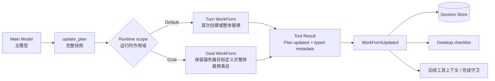

# OpenTopia Planning Tools 当前架构

> 本文描述当前实现，不记录已经删除的兼容协议。更新时间：2026-08-28。

## 1. 三类容易混淆的“计划”

1. **Plan Mode 的 Proposed Plan**：模型输出的可审阅方案，保存为 `MessagePart::ProposedPlan`。它不是执行状态，也不会创建 `WorkForm`。
2. **Default 的执行清单**：模型在确有必要时用 `update_plan`发布，作用域是当前 Turn，用于展示和完成边界检查。
3. **Goal 的持久 WorkForm**：服务器在 Goal 创建时建立并拥有目标、约束和验收条件；模型用同一个 `update_plan`替换其步骤快照。

三者不会隐式互相转换。Plan Mode 的“开始实施”只是追加一个新的 Default 用户消息；Default 是否创建执行清单仍由当前任务复杂度决定。

## 2. 唯一的模型侧执行清单工具

执行清单只有一个模型可调用工具：`update_plan`。

```json
{
  "explanation": "可选：说明这次为何调整计划",
  "plan": [
    { "step": "检查现状", "status": "completed" },
    { "step": "实现修改", "status": "in_progress" },
    { "step": "运行验证", "status": "pending" }
  ]
}
```

`plan`始终表示**完整当前快照**：

- 第一次成功调用创建当前作用域的 `WorkForm`；
- 后续成功调用原子替换全部条目，而不是修改旧条目；
- 不要求先创建计划，也不接收模型提供的 revision；
- 行号、条目位置和旧文本都不参与匹配；
- 任意字段校验失败时不会产生新 `WorkFormUpdated`事件；
- 普通 Default 清单只需 `step`和`status`；Goal 可按需使用 `id`、`depends_on`、`acceptance`和`evidence_refs`等扩展字段。

旧的独立创建工具和增量 patch 协议已经删除。运行时不会解析或转换旧参数，也不会双写旧格式。

## 3. 运行流程



模型不传 Turn ID、Goal ID、thread ID 或 revision。运行时从 `ToolInvocationContext`选择作用域：

- Default 使用当前 Turn ID；如果该作用域没有清单，revision 从 1 开始；
- Goal 使用服务器分配的 Goal ID；如果 Goal 缺少服务器创建的 `WorkForm`，调用失败，而不是由模型伪造 Goal 定义；
- 同一作用域每次成功替换后，内部 revision 加一，用于事件顺序、存储投影和界面刷新，不属于模型侧并发协议；
- Goal 替换时保留服务器拥有的 objective、constraints、acceptance 和 created_at，只替换模型负责的当前步骤快照。

工具给 Provider 的文本结果保持简短：`Plan updated`。完整 `WorkForm`通过 typed metadata 进入事件、存储和界面投影，但不会重复塞回 Provider 工具结果正文。

## 4. 模式、智能体与可见性

| 上下文 | schema 是否可见 | 是否允许执行 |
|---|---:|---:|
| Default 根 Agent | 是 | 是 |
| Goal 根 Agent | 是 | 是 |
| Plan 根 Agent | 是 | 否，运行时确定性拒绝 |
| 子 Agent | 否 | 否 |

根 Agent 在 Default、Plan、Goal 中保持相同核心工具 schema，减少仅因模式切换造成的 prompt-cache 断点。模式权限不由 schema 可见性决定：Plan Mode 调用 `update_plan`仍会在工具入口失败。

工具可见不代表必须调用。Default 提示只建议在确实需要外部进度记忆的复杂、多阶段工作中使用它；简单问答、一次读取、一个局部修改或单个验证命令不应为了“有计划”而创建清单。

## 5. 取消、续接与追加式历史

Turn 取消只记录通用取消/中止事实，不再写入计划专用墓碑，也不修改此前的消息或工具调用。

新 Turn 有三种合法行为：

- 不使用执行清单；
- 根据新请求发布一份不同的完整快照；
- 把中断前仍然适用的步骤作为一份完整快照重新发布。

因为每次调用都自包含，续接不依赖“先恢复旧计划再打 patch”。历史保持追加式；已发送的上下文前缀不被重写。工具 schema 从旧协议切到新协议时会产生一次版本边界，此后 schema 稳定时仍可正常命中缓存。

## 6. 一致性与完成边界

`WorkForm::validate`负责确定性结构校验，例如：

- 条目 ID 唯一，依赖必须指向存在的条目，依赖图不能成环；
- 状态与备注、完成处置、Goal 验收/证据字段满足数据模型约束；
- 一个清单最多一个 `in_progress`条目；
- 全部条目进入终态后，`WorkForm`状态随快照重新计算。

运行时不会把计划当作自动行动队列。`nextRunnableItem`只是给模型和界面的提示；模型仍决定下一次工具调用。完成守卫只在客观边界读取最新 `WorkForm`，阻止带有未解决阻塞条目的任务被提前收尾。

## 7. 代码入口

- `crates/opentopia-core/src/tools/work_form_tools.rs`：`update_plan` schema、全量替换和校验
- `crates/opentopia-core/src/tools/registry.rs`：核心工具注册与治理元数据
- `crates/opentopia-core/src/tool_runtime.rs`：从工具结果产生 `WorkFormUpdated`
- `crates/opentopia-core/src/agent.rs`：为工具装配当前 WorkForm、Goal 提示和完成边界
- `crates/opentopia-server/src/main.rs`：把 `WorkFormUpdated`投影到持久状态
- `apps/desktop/src/toolActivity.ts`：执行清单工具活动展示

最短心智模型是：**模型自由决定是否需要清单；需要时用一次 `update_plan`发布完整现状；运行时负责作用域、持久化和确定性校验，不维护模型侧 patch 会话。**
