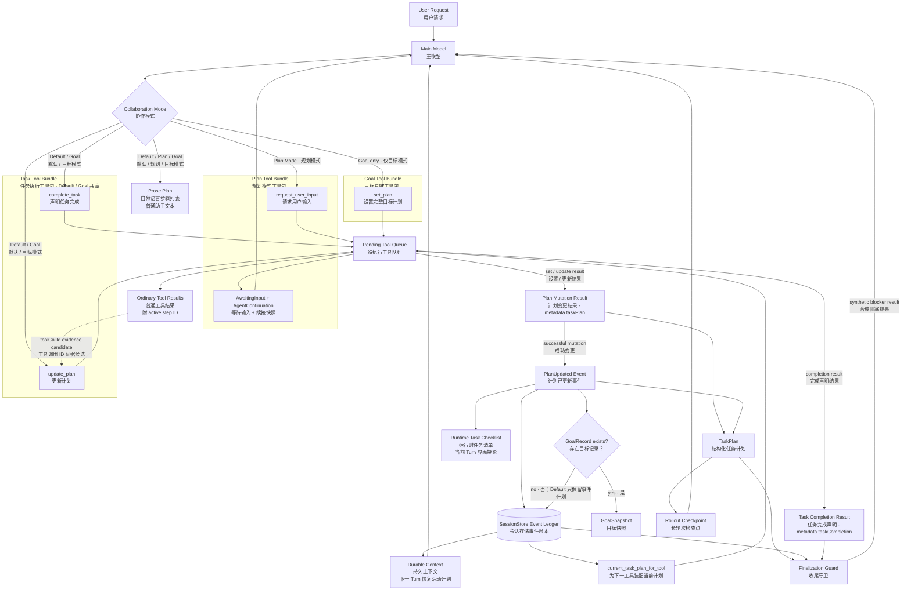
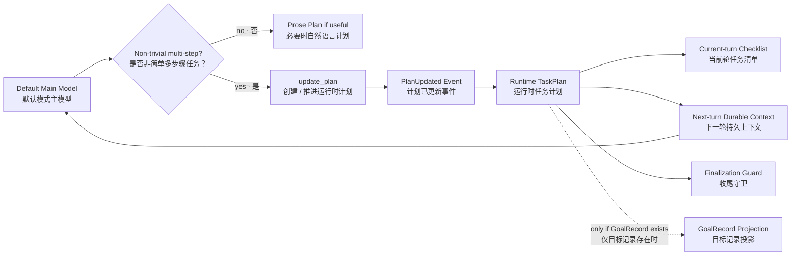
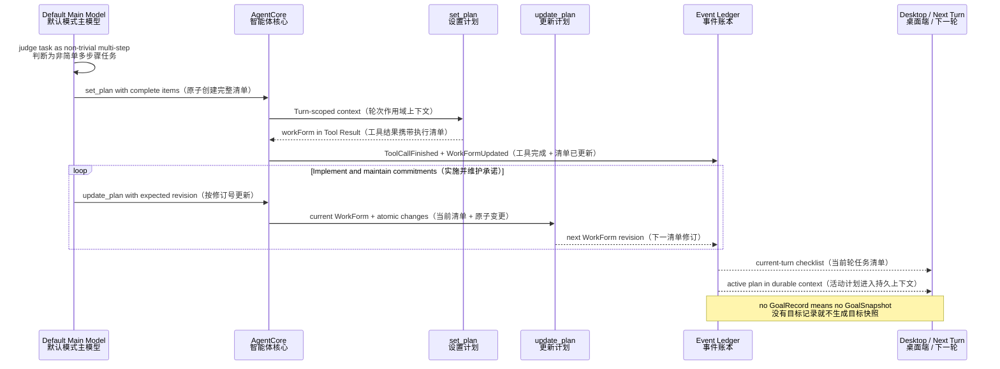
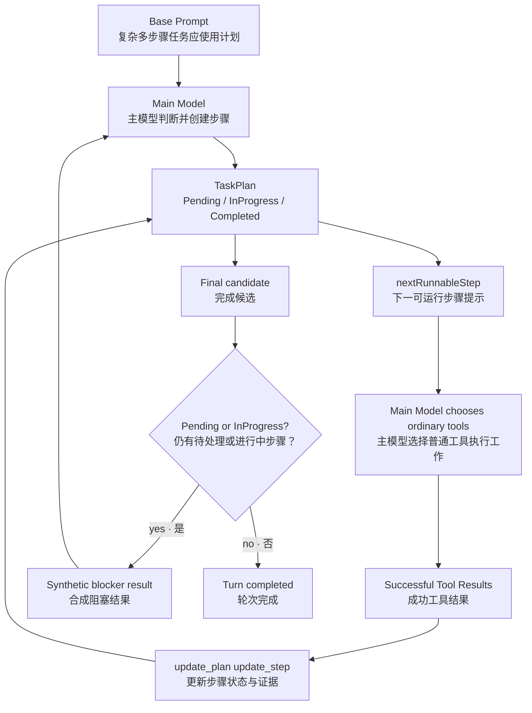
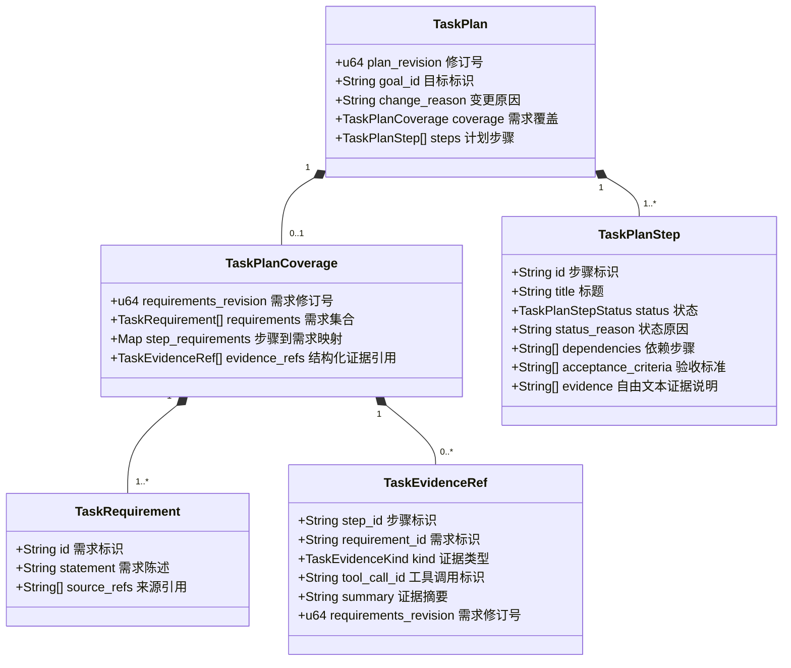
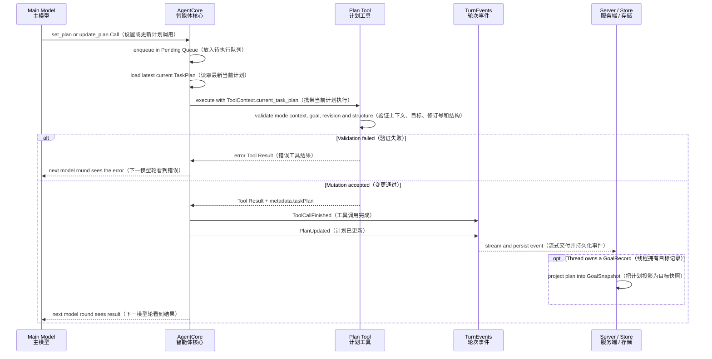
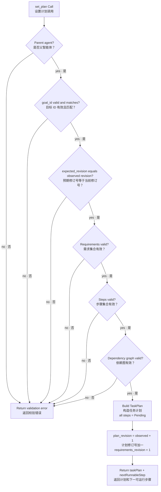
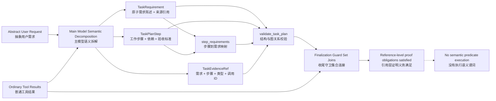
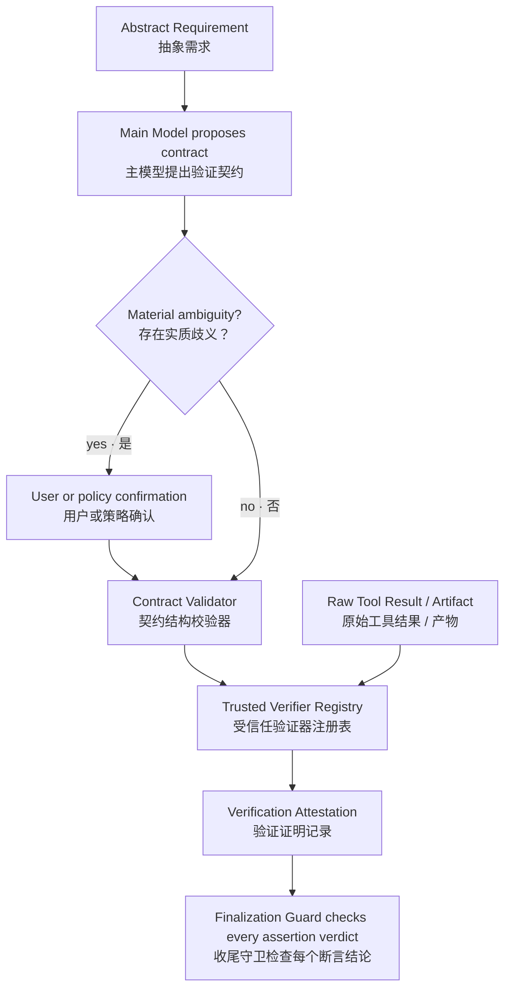
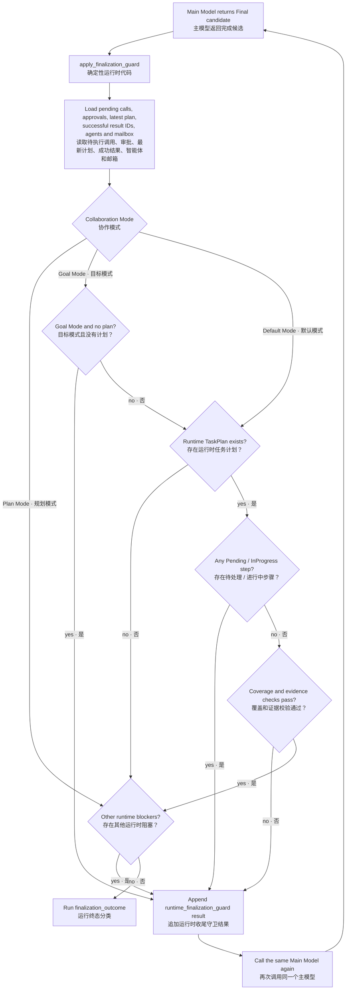

# OpenTopia Planning Tools 当前架构与完整流程

> 基于当前 `crates/opentopia-core/src/tools.rs`、`agent.rs`、`model.rs`、`tool_surface.rs`和服务端事件投影逻辑整理，更新时间：2026-08-14。
> 本文解释 Planning Tools（规划工具）如何形成持久计划、如何记录进度和证据，以及它们如何被 Finalization Guard（收尾守卫）使用。通用 Tool Runtime（工具运行时）仍按黑盒处理。

## 1. 先给出准确结论

Planning Tools 不是一个独立 Planner Model（规划模型），也不是一个会自动推进步骤的 Workflow Engine（工作流引擎）。它由四个工具、一个结构化计划对象和几处运行时投影共同组成。必须先区分三种经常都被叫作“计划”的东西：

1. **Proposed Plan（建议方案）**：Plan Mode 把 `<proposed_plan>`解析成独立 `MessagePart::ProposedPlan`。它是可审阅的方案内容，不生成 `WorkForm`，也不触发修订号、步骤状态或证据守卫。
2. **Runtime TaskPlan（运行时任务计划）**：Default Mode 和 Goal Mode 通过计划工具维护、由 `PlanUpdated（计划已更新）`事件携带的结构化状态。它负责界面清单、跨 Turn 恢复、步骤推进和收尾约束。
3. **Goal Plan（目标计划）**：Runtime TaskPlan 在线程已有 `GoalRecord（目标记录）`时投影出的持久目标快照。这才是 Goal Mode 的额外持久层。

四个模型可调用工具在当前 Tool Surface（工具表面）中的分工是：

- `request_user_input（请求用户输入）`：schema 在所有根模式稳定暴露，但只有 Plan Mode（规划模式）可执行，用于暂停同一 Turn 并取得结构化选择；
- `set_plan（设置计划）`：schema 在所有根模式稳定暴露，在 Default / Goal 中用于原子创建或替换完整执行清单，Plan 的运行时门禁会拒绝它；
- `update_plan（更新计划）`：schema 在所有根模式稳定暴露，在 Default / Goal 中对已经存在的 WorkForm 做带 revision（修订号）保护的原子变更，Plan 的运行时门禁会拒绝它；
- `complete_task（声明任务完成）`：向 Default Mode 与 Goal Mode 暴露，写入本轮完成摘要、验证描述和剩余工作，但不修改 `TaskPlan`；
- `PlanUpdated（计划已更新）`事件：把计划工具结果投影成 AgentCore 和服务端都能读取的结构化状态；
- `Finalization Guard（收尾守卫）`：用确定性代码检查计划是否仍有未终结承诺、覆盖关系是否完整、证据引用是否有效。

主模型决定“抽象请求要拆成哪些需求、应该如何规划、下一步做什么、证据代表什么”；运行时只验证结构、一致性、引用完整性和完成边界。当前实现没有把任意自然语言需求自动编译成可执行布尔函数。

## 2. 模块之间的真实关系



这里没有“计划步骤 → 自动选择工具”的箭头，因为代码没有这个调度器。`nextRunnableStep（下一可运行步骤）`只是返回给主模型的建议；真正的下一次调用仍由主模型生成，并进入普通 Pending Tool Queue（待执行工具队列）。自然语言步骤列表和 Runtime TaskPlan 之间也没有自动转换箭头：主模型在回答里写 `1、2、3`，不会自动产生 `PlanUpdated`事件。

## 3. Default Mode 为什么需要、也能够使用结构化计划

当前 Tool Surface（工具表面）把计划相关能力分成三个职责清楚的 Bundle（工具包）：

- Plan Bundle（规划工具包）：只服务“先产出方案”的 Plan Mode，提供结构化澄清，不写执行状态；
- Task Bundle（任务执行工具包）：由 Default Mode 和 Goal Mode 共享，提供 `set_plan / update_plan / complete_task`，负责复杂任务的创建、推进与完成声明；
- Goal ownership（目标所有权）：Goal Mode 让同一套 WorkForm 工具自动落到服务器分配的 Goal UUID；Default 则落到当前 Turn scope（轮次作用域）。

| 能力 | Default Mode（默认模式） | Plan Mode（规划模式） | Goal Mode（目标模式） |
|---|---|---|---|
| 在普通回复里列 Prose Plan（自然语言计划） | 可以 | 可以，而且这是该模式的正式产物 | 可以 |
| 新模型请求看见 `request_user_input（请求用户输入）` schema | 是，但不可调用 | 是，仅 root agent（根智能体）可调用 | 是，但不可调用 |
| 新模型请求看见 `set_plan / update_plan` schema | 是，可调用 | 是，但不可调用 | 是，可调用 |
| 读取已有 `PlanUpdated（计划已更新）` | 是 | 是 | 是 |
| 活动 Runtime TaskPlan 注入下一 Turn 的 Durable Context（持久上下文） | 是 | 是 | 是 |
| 已有 Runtime TaskPlan 参与 Finalization Guard（收尾守卫） | 是 | Plan Mode 跳过步骤和覆盖阻塞 | 是 |
| 必须存在 Runtime TaskPlan 才能完成 | 否 | 否 | 是 |
| 投影成持久 `GoalSnapshot（目标快照）` | 否，除非线程本来已有 GoalRecord | 否 | 是 |

所以“Default Mode 可以列任务步骤”必须区分两种行为：

1. 复杂任务使用的是 Structured Execution Plan（结构化执行计划），不是只在回复里展示的文字列表。Default Mode 会调用 `update_plan`建立若干步骤，并随着工作推进更新步骤状态。
2. 普通回复中的任务列表也一直存在，但它只是 Prose Plan（自然语言计划），不生成 `PlanUpdated`。
3. 界面中的结构化任务清单来自 `PlanUpdated`事件。事件消费链支持 Default Mode——桌面端会在产生计划事件的当前 Turn 尚未结束时展示它，服务端也会把仍活动的计划放入后续 Turn 的 Durable Context。

当前实现把 Default 的执行计划链闭合为：



Plan Mode 和 Runtime TaskPlan 也不是同义词：Plan Mode 的正式产物是决策完备的 `ProposedPlan`消息部件，并允许结构化提问；Default / Goal 的 WorkForm 工具才记录实际执行承诺。工具 schema 跨模式保持稳定只是缓存策略，可调用性仍由运行时模式门禁决定。

### 3.1 Default 为什么会在复杂任务中自动列出并完成步骤

这不是 Runtime（运行时）用一个 `is_complex_task()`函数给任务打分，也不是另一个 Planner Model（规划模型）先做规划。触发者始终是 Main Model（主模型）。Base Prompt（基础提示词）明确要求：

> 对于非简单的多步骤工作，使用可用的计划机制作为持久外部记忆，并持续维护已记录的承诺。

因此流程由两个条件共同形成：

1. 主模型根据请求语义判断它是 `non-trivial multi-step work（非简单多步骤工作）`；这里没有固定 Token 数、文件数或步骤数阈值；
2. Default Provider Tool Catalog（默认模式提供商工具目录）暴露 `set_plan / update_plan`，所以主模型能把这一语义判断落实成结构化 `TaskPlan`。

`set_plan`在 Default 中创建或替换 Turn-scoped WorkForm（轮次作用域执行清单）；在 Goal 中则创建或替换 Goal-scoped WorkForm（目标作用域执行清单）。`update_plan`只更新已经存在的 WorkForm。两者都是执行期状态工具，都不属于 Plan Mode 的方案产物。

Default 结构化计划的当前原理是：



`set_plan`负责创建或完整替换 WorkForm；`update_plan`要求当前作用域已经存在 WorkForm，并用 `expected_revision`防止覆盖并发更新。Default 的作用域来自当前 Turn ID，Goal 的作用域来自服务器 Goal ID，模型都不传这些运行时控制 ID。每次成功变更都会递增 revision，并产生新的 `WorkFormUpdated`事件。

### 3.2 “逐个步骤完成”到底是谁推进的

它看起来像工作流引擎逐步调度，实际是以下闭环：



具体来说：

1. 主模型创建几个 Step（步骤），通常把当前步骤标为 InProgress（进行中），其余标为 Pending（待处理）；
2. `nextRunnableStep（下一可运行步骤）`根据依赖给出建议，但不是强制调度命令；
3. 主模型选择并调用普通工具完成当前工作；运行时把当前 InProgress Step ID 自动附到普通工具结果上；
4. 主模型再次调用 `update_plan`，把该步骤改成 Completed（已完成）并绑定成功调用的 Evidence Ref（证据引用）；
5. 主模型再把后续步骤推进为 InProgress，重复以上过程；独立步骤也可以并行或重排，并非代码强制“一次只能做一步”；
6. 如果模型在仍有 Pending / InProgress 时尝试输出 Final，Finalization Guard 会注入阻塞结果，把同一个主模型送回循环，所以它不能只列出步骤就提前结束。

共享计划的写所有权属于 Root Agent（根智能体）：子智能体可以完成被委派工作并返回工具证据，但其 Provider Tool Catalog 不暴露 `set_plan / update_plan`，运行时上下文校验也会拒绝子智能体直接修改父智能体计划。根智能体收到结果后决定怎样更新共享步骤。

因此，“复杂任务自动列几步并逐个完成”实际来自三者协作：**Prompt Policy（提示策略）负责要求使用计划，Main Model（主模型）负责语义拆解和推进，Finalization Guard（收尾守卫）负责防止未完成承诺被遗漏。** Runtime 并没有自动执行 `nextRunnableStep`。

这条链的关键是 Prompt Policy（提示策略）、Tool Surface（工具表面）与 Runtime State（运行时状态）三者一致：提示词要求复杂任务使用计划，工具目录允许主模型写计划，事件和守卫负责保存与约束计划。缺少其中任何一层，都会退化成“只在文字里列步骤”或“有状态却无法主动更新”。

> **Default Runtime Plan（默认模式运行时计划）是复杂任务的正式执行记忆；由主模型判断何时创建，由 `update_plan`推进，由 Finalization Guard 防止带着未完成承诺收尾。**

## 4. TaskPlan 的数据模型



两个 revision 有不同用途：

- `plan_revision（计划修订号）`：每次成功的 `set_plan / update_plan`都递增，用于 Optimistic Concurrency Control（乐观并发控制），防止模型基于旧计划覆盖新状态；
- `requirements_revision（需求修订号）`：需求集合变化时递增，用于判断原证据是否仍能证明当前需求。

`source_refs（来源引用）`要求非空，但目前只做结构和非空校验，不会自动打开文件或语义判断引用是否真的支持该需求。

## 5. 计划从创建到持久化的完整流程



AgentCore 获取当前计划的优先级是：

1. 本 Turn 中最新的 `PlanUpdated`事件；
2. SessionStore 中该 Thread 最新的 `PlanUpdated`事件；
3. ToolContext 原本携带的计划；
4. 都没有则为 `None（无计划）`。

所以计划的事实源不是模型自然语言，而是结构化 Tool Result 和事件账本。服务端只有在线程已经存在 `GoalRecord（目标记录）`时，才进一步把计划投影到 GoalSnapshot；Default Mode 中可能存在的旧计划事件不会被伪装成 GoalRecord。

## 6. set_plan：原子创建完整计划

`set_plan（设置计划）`适合在已知需求已经足够完整时一次性建立计划。它的执行流程如下：



它会验证：

- 只有 `subagent_depth = 0`的父智能体可以修改共享计划；
- `goal_id`必须是 UUID，并与服务端分配的 Goal ID 一致；
- `expected_revision`必须等于当前观察到的计划修订号；首次创建通常为 0；
- 至少一个 Requirement（需求），需求 ID 唯一、陈述非空、`source_refs`非空；
- 至少一个 Step（步骤），步骤 ID 和标题唯一；
- 每个步骤至少覆盖一个已声明需求，并至少有一项 Acceptance Criterion（验收标准）；
- 每个依赖必须指向现有步骤，不允许自依赖和依赖环；
- 一个计划最多只有一个 `InProgress（进行中）`步骤，不过 `set_plan`会把所有新步骤统一设为 `Pending（待处理）`。

成功后返回完整 `TaskPlan`、新的 `plan_revision`以及建议性的 `nextRunnableStep`。

## 7. update_plan：一次只做一个原子变更

`update_plan（更新计划）`每次只接受一种 Operation（操作）：

| Operation | 中文解释 | 关键规则 |
|---|---|---|
| `append_step` | 追加步骤 | 无计划时可在 `expected_revision = 0`下创建首个计划；首次追加必须同时给出完整需求集合 |
| `update_step` | 更新步骤 | 按 Step ID 修改指定字段；覆盖关系变化会清除该步骤旧证据引用 |
| `remove_step` | 删除步骤 | 仍被其他步骤依赖时禁止删除；删除时同步清除覆盖映射与证据 |
| `replace_requirements` | 替换需求集合 | 必须真的发生变化；递增需求修订号并使受影响完成状态和证据失效 |

所有操作都必须携带当前 `goal_id`、准确的 `expected_revision`和非空 `change_reason（变更原因）`。成功变更后 `plan_revision`加一；修订冲突会返回错误，让主模型重新读取最新计划后再决定，而不是静默覆盖。

### 7.1 update_step 的状态和证据规则

当步骤被改成 `Completed（已完成）`时，必须同时满足：

- `acceptance_criteria（验收标准）`非空；
- 自由文本 `evidence（证据说明）`非空；
- Coverage 中至少有一条属于该步骤的结构化 `evidence_ref（证据引用）`。

当步骤不再是 Completed 时，该步骤的结构化 evidence refs 会被清除，避免未完成步骤继续携带完成证据。改变 `covers_requirement_ids（覆盖需求 ID）`时，也会先清除旧 evidence refs，因为旧证据未必适用于新的覆盖关系。

`Deferred（延后）`、`Blocked（被阻塞）`和 `Cancelled（已取消）`必须提供具体 `status_reason（状态原因）`。

### 7.2 replace_requirements 为什么会让已完成工作回退

需求变化不是简单替换文字。代码会：

1. 找出新增、删除或内容变化的 Requirement ID；
2. 找出覆盖这些变化需求的步骤；
3. 同时把已经携带 Verification Evidence（验证证据）的步骤视为受影响步骤，因为需求基线变化后需要重新验证；
4. 受影响步骤若为 InProgress 或 Completed，则重置为 Pending，清空状态原因和自由文本证据；
5. `requirements_revision`加一；
6. 删除受影响步骤以及已删除需求的 evidence refs；
7. 保留下来的 evidence refs 更新到新 revision。

这个机制防止“需求已经变了，但旧完成状态和旧验证仍被继续当成当前事实”。

## 8. Actionable、Runnable、Resolved 不是同一个概念

步骤状态共有六种：

| Status | 中文解释 | Actionable（仍需处理） | Resolved（已给出终结处理） |
|---|---|---:|---:|
| `Pending` | 待处理 | 是 | 否 |
| `InProgress` | 进行中 | 是 | 否 |
| `Completed` | 已完成 | 否 | 是 |
| `Deferred` | 已明确延后 | 否 | 是 |
| `Blocked` | 已明确阻塞 | 否 | 是 |
| `Cancelled` | 已取消 | 否 | 是 |

`has_actionable_steps（存在仍需处理步骤）`只是扫描是否存在 Pending 或 InProgress。

`next_runnable_step（下一可运行步骤）`更严格：

1. 如果有 InProgress，优先返回它；
2. 否则返回第一个所有依赖都已 Completed 的 Pending Step；
3. 没有则返回 None。

因此可能出现“Actionable = Yes（仍需处理），Runnable = None（当前无可运行步骤）”：例如步骤 B 是 Pending，但它依赖的步骤 A 被标成 Blocked。Finalization Guard 仍会阻止完成，因为 B 仍是一个未终结承诺；模型必须把 B 完成，或明确改成 Deferred / Blocked / Cancelled 并写明原因。

`nextRunnableStep`不是强制调度门。模型可以修改过期计划、处理多个相互独立步骤，或根据新证据重排工作。

## 9. 抽象需求如何变成结构化证据检查

先说最重要的事实：当前代码没有一个纯函数能把任意自然语言需求自动转换为可执行断言。它采用的是 **Semantic Compilation by Main Model（由主模型做语义编译）+ Deterministic Referential Validation（运行时做确定性引用校验）**。



换句话说，第一段“从抽象到结构”不是 Rust 代码推导出来的，而是主模型根据用户请求、仓库事实和工具观察提议出来的。确定性代码从这些结构化对象已经存在之后才接管。

### 9.1 主模型怎样把抽象请求结构化

以“新增导出接口，保证未授权用户不能导出，并且不破坏现有导出行为”为例，主模型需要完成四种语义动作：

1. **Requirement Atomization（需求原子化）**：拆成 R1“提供导出接口”、R2“未授权调用被拒绝”、R3“现有导出回归测试保持通过”。每个 Requirement 应能单独回答“满足还是未满足”。
2. **Source Binding（来源绑定）**：给每项 Requirement 附 `source_refs（来源引用）`，例如用户原话、设计文档位置或现有测试。当前代码只要求引用非空，不验证引用内容。
3. **Work Decomposition（工作拆解）**：创建实现、权限验证、回归验证等 Step（步骤），给出依赖和 Acceptance Criteria（验收标准）。
4. **Coverage Mapping（覆盖映射）**：显式声明每个 Step 覆盖哪些 Requirement。一个需求可由多个步骤共同覆盖，一个步骤也可覆盖多个需求。

这一步的结果是一组 **Proof Obligations（证明义务）**，不是已经执行的证明。例如 Acceptance Criterion“无令牌请求返回 401 或 403”只是声明以后应该验证什么；当前运行时不会解析这句话并自动发 HTTP 请求。

### 9.2 写计划时的结构校验

`set_plan / update_plan`保证：

- Requirement ID、Step ID 和引用关系存在且唯一；
- 每个步骤的 `covers_requirement_ids`只能引用当前 Requirement；
- 每条 evidence ref 的 Requirement 必须确实由该 Step 覆盖；
- evidence ref 自动记录当前 `requirements_revision`；
- evidence ref 的组合键不能重复；
- plan 中不能存在指向未知步骤、未知需求或旧 revision 的 evidence ref；
- Completed Step 至少有验收标准、自由文本证据和一条结构化证据引用。

这一层只保证数据结构内部自洽，还没有证明引用的工具调用真的成功。

### 9.3 收尾时的运行时引用校验

Finalization Guard 会从 Store 历史事件和本 Turn 事件中建立 `successful_provider_tool_call_ids（成功提供商工具调用 ID 集合）`。只有满足以下条件的 `ToolCallFinished（工具调用完成）`才进入集合：

- Tool Result 不是错误；
- 结果带有真实 `providerToolCallId（提供商工具调用 ID）`；
- Tool Name 不是当前硬编码排除表中的 `request_user_input / set_plan / update_plan / complete_task / runtime_finalization_guard`。因此这里是按名称排除已知控制/计划工具，并不是根据通用 Side-effect Type（副作用类型）或工具类别自动推导。

然后每条 evidence ref 必须同时满足：

1. `evidence.requirements_revision == coverage.requirements_revision`；
2. `evidence.step_id`对应的步骤状态是 Completed；
3. `evidence.tool_call_id`存在于成功工具调用 ID 集合。

只有同时满足三项，才进入 `valid_evidence（有效证据集合）`。

接下来对每个 Requirement 分别检查：

- 至少一条 `Implementation（实现）`或 `Observation（观察）`有效证据，用于证明需求已经被落实或观察到；
- 至少一条 `Verification（验证）`有效证据，用于证明结果经过验证；
- `GlobalCheck（全局检查）`可以保留为附加事实，但不能替代每个 Requirement 自己的 Verification Evidence。

此外，所有 Requirement ID 必须至少出现在某个 Step 的 coverage 映射中，否则产生 `requirements_uncovered（需求未覆盖）`。

把这段逻辑写成集合运算会更清楚。设：

- `R`：当前 `requirements_revision（需求修订号）`下全部 Requirement ID；
- `C`：`step_requirements`中被任一步骤覆盖的 Requirement ID 并集；
- `D`：状态为 Completed（已完成）的 Step ID 集合；
- `S`：事件账本中成功且 Tool Name（工具名）不在当前排除表中的 Provider Tool Call ID 集合；当前排除 `request_user_input / set_plan / update_plan / complete_task / runtime_finalization_guard`；
- `E`：计划里的全部 Evidence Ref（证据引用）。

运行时先计算：

```text
uncovered = R - C

validEvidence = {
  e ∈ E |
  e.requirementsRevision == currentRequirementsRevision
  ∧ e.stepId ∈ D
  ∧ e.toolCallId ∈ S
}

missingFulfillment = {
  r ∈ R | 不存在 e ∈ validEvidence，
          e.requirementId == r
          且 e.kind ∈ {Implementation, Observation}
}

missingVerification = {
  r ∈ R | 不存在 e ∈ validEvidence，
          e.requirementId == r
          且 e.kind == Verification
}
```

只有这三个集合都为空，需求覆盖与证据引用这一关才通过。这就是当前代码中真正“函数化”的部分：集合差、外键连接、状态过滤和类型存在性检查。

### 9.4 当前校验能证明什么，不能证明什么

当前实现验证的是 Referential Integrity（引用完整性）和 Runtime Success（运行时成功性），不是 Semantic Proof（语义证明）：

- 它能证明：证据引用了一个真实存在、记录为成功的非计划工具调用；步骤已标为完成；证据基于当前需求修订；证据类型满足每项需求的实现 / 观察与验证配对；
- 它不会重新阅读工具输出并判断其内容是否真的证明了 `summary`；
- 它不会自动执行 Acceptance Criteria；
- 它不会校验 `source_refs`指向的内容是否真的支持 Requirement；
- 普通工具结果虽然会自动附上当前 InProgress Step 的 `taskPlanStepId`用于追踪，但当前 Finalization Guard 没有再验证该字段必须等于 evidence ref 的 `step_id`。

所以它比“模型口头说完成了”严格得多，但还不是形式化证明系统。证据 `kind`和 `summary`的语义选择仍由主模型负责，运行时负责防止引用不存在、失败、过期或未完成步骤的结果。

一个成功 Tool Result 只能证明“该工具调用没有按运行时协议报错”，不能自动证明“工具输出满足 Requirement”。例如测试命令退出码为 0 是强证据；读取了一个文件且读取成功，却不等于文件内容一定实现了用户需求。当前主模型可以把后者标成 Verification，运行时只检查引用关系，无法识别这种语义错配。

### 9.5 如果要做到真正的函数化验证，应该增加什么

需要在 `TaskRequirement`和 `TaskEvidenceRef`之间增加一层有限、可执行的 `Verification Contract（验证契约）`，而不是让模型提交任意代码：

```text
RequirementContract {
  requirementId,
  assertions: [
    {
      assertionId,
      predicateKind,
      inputs,
      expected,
      verifierId,
      verifierVersion
    }
  ]
}

VerificationAttestation {
  assertionId,
  verifierId,
  verifierVersion,
  providerToolCallId,
  inputDigest,
  outputDigest,
  verdict
}
```

`predicateKind（谓词类型）`应是受信任的有限集合，例如：

- `command_exit_code（命令退出码）`：指定测试调用的退出码等于 0；
- `json_path_equals（JSON 路径相等）`：某工具产物的确定字段等于期望值；
- `http_response（HTTP 响应）`：状态码、响应 Schema（模式）和关键字段满足条件；
- `file_contains / file_not_contains（文件包含 / 不包含）`：固定文件与固定模式匹配；
- `artifact_hash（产物哈希）`：验证的产物就是实现步骤产生的同一版本；
- `manual_attestation（人工确认）`：无法客观函数化的设计品质或主观体验，显式标为人工证明，而不是伪装成自动验证。

完整的可信链应当是：



安全边界是：主模型可以**提出**谓词和参数，但不能自己写 `verdict = passed`；结论必须由版本化的 Trusted Verifier（受信任验证器）根据实际 Tool Result 或 Artifact（产物）计算。收尾守卫最终检查的是每个 `assertionId（断言 ID）`都有通过的 Attestation（证明记录），而不是检查模型自报的 `kind = verification`。

即便采用这套设计，也不是所有抽象需求都能完全函数化。“界面看起来专业”“解释足够清晰”这类需求仍需要 Rubric（评分规则）、人工确认或专门评审模型；关键是把它们显式标成不同 Assurance Level（保证等级），不要把主观判断混入确定性验证结果。

### 9.6 用同一个需求对比当前机制和真正函数化机制

抽象需求：“未授权用户不能导出。”

当前机制由主模型写成近似这样的关系：

```text
Requirement R2:
  statement = "未授权调用必须被拒绝"

Step S2:
  title = "验证未授权导出"
  acceptanceCriteria = ["无令牌请求返回 401 或 403"]
  covers = [R2]

Evidence E2:
  requirementId = R2
  stepId = S2
  kind = Verification
  toolCallId = call_http_43
  summary = "无令牌请求返回 401"
```

当前确定性代码能验证 `S2`已完成、`S2`覆盖 `R2`、`call_http_43`有成功结果、证据修订号是最新的；但它不会从 `call_http_43`输出中提取状态码并验证确实为 401 或 403。也就是说，Acceptance Criteria 还是字符串，Evidence Summary 还是主模型的语义声明。

真正函数化后，主模型只负责提出：

```text
Assertion A2:
  predicateKind = http_status_in
  inputs = { resultRef: call_http_43, jsonPath: "$.status" }
  expected = [401, 403]
```

`http_status_in@v1（HTTP 状态码集合验证器 v1）`读取标准化结果，执行 `actualStatus ∈ {401, 403}`，并产出带输入 / 输出摘要的 Attestation。此时 Finalization Guard 检查 `A2`的可信 verdict，而不是相信主模型写的“返回了 401”。这才是把抽象需求变成可函数执行验证的关键边界：**模型负责定义可检查命题，可信代码负责计算命题真假。**

## 10. Finalization Guard 与 Planning Tools 的关系

Finalization Guard 不是单独模型。它是 AgentCore 内的确定性 Rust 函数 `apply_finalization_guard（应用收尾守卫）`，不调用 Guardian Model（守卫模型），也不发起第二次语义审查。



这里需要特别区分三句话：

1. **“必须有计划”怎么判断：** 仅 Goal Mode 要求；从本 Turn 最新 PlanUpdated、Tool Result 的 `taskPlan`或 Store 最新 PlanUpdated 读取，三处都没有就是 `plan_missing（计划缺失）`。
2. **“计划仍可行动”怎么判断：** 收尾守卫直接扫描是否存在状态为 Pending 或 InProgress 的步骤。它没有让模型判断，也不依赖标题或自然语言；在 Plan Mode 中这项检查被跳过。
3. **“步骤当前可运行”怎么判断：** 使用 `next_runnable_step`检查依赖是否全 Completed，但它只作为 `plan_pending`阻塞信息中的提示，不决定收尾是否放行。

因此旧表述“Required plan missing or actionable（必需计划缺失或仍可行动）”准确展开后其实是两项独立检查：Goal Mode 是否缺计划，以及非 Plan Mode 是否还有未终结的 Pending / InProgress 承诺。

若发现阻塞，代码会构造一个名为 `runtime_finalization_guard（运行时收尾守卫）`的合成 Call / Result，把具体 blocker 列表交给同一个 Main Model。主模型再选择更新计划、补做工具工作、请求输入或解释真实阻塞。最多反馈三次；仍未解决则返回错误，防止无限 Final 往返。

这里的 Guardian Review Model（守卫评审模型）只用于高风险工具的自动审批评审，和 Finalization Guard 是两套完全不同的机制。

## 11. complete_task 不会直接结束 Turn

`complete_task（声明任务完成）`返回：

- `summary（完成摘要）`；
- `verification（验证描述列表）`；
- `remainingWork（剩余工作列表）`。

它的 Tool Result 仍会回到主模型，主模型还必须再返回 Final Candidate，并接受 Finalization Guard。工具描述称它是本 Turn 的最后一个工具调用，但运行时不会因为调用了它就跳过下一模型决策。

Goal Mode 下调用 `complete_task`之前会验证：

- 存在属于当前 Goal ID 的计划；
- 计划非空；
- 没有 Pending / InProgress Step；
- 每个 Completed Step 都有自由文本 evidence。

Default Mode 没有上述“必须属于服务器 Goal”的入口校验；如果已经建立 Runtime TaskPlan，后面的 Finalization Guard 仍会统一检查 Pending / InProgress、需求覆盖和证据引用。因此 `complete_task`只是结构化完成声明，不是绕过计划守卫的出口。

最终 Outcome（结果）还会读取：

- 计划中存在 Blocked Step → `Blocked（被阻塞）`；
- Deferred / Cancelled Step 存在且最近一次 `update_plan`没有设置 `currentScopeComplete = true` → `Partial（部分完成）`；
- `complete_task.remainingWork`非空 → `Partial`；
- 其余情况 → `Completed（已完成）`。

`complete_task.verification`目前是结构化完成描述，但不替代第 9 节按 Requirement 绑定的 Verification Evidence。

## 12. request_user_input 与计划状态的关系

`request_user_input（请求用户输入）`只解决“模型无法安全替用户决定的规划分歧”，不创建 TaskPlan。它验证：

- 仅 Plan Mode；
- 仅 root agent；
- 1–3 个问题；
- 每题 2–3 个互斥选项；
- 每题最多一个推荐项，且推荐项必须排第一；
- ID、标题、问题、标签和描述满足唯一性及长度规则。

执行后它产生唯一 request ID 和一个等待中的 Tool Result，AgentCore 返回 `AwaitingInput + AgentContinuation（等待输入 + 续接快照）`。用户回答后，恢复函数原位把等待 Result 改写为 `UserInputResponse（用户输入响应）`，再回到原 `continue_provider_turn`。因此回答会成为同一 Tool Call 的最终观察，而不是创建一条新计划或启动新 Turn。

## 13. 一个完整的 Goal Mode 示例

假设需求为“新增导出接口并验证权限”：

1. 主模型调用 `set_plan`，声明 Requirement R1“提供导出接口”、R2“未授权用户不可导出”；创建 Step S1“实现接口”和 S2“验证权限”，并映射需求与依赖；
2. 所有步骤初始为 Pending，`nextRunnableStep`建议 S1；
3. 主模型用 `update_plan`把 S1设为 InProgress；后续普通工具结果会自动标记 `taskPlanStepId = S1`；
4. 实现工具调用成功后，主模型用 `update_plan`把 S1改为 Completed，并提交引用该成功 call ID 的 Implementation Evidence；
5. S2依赖 S1，现在成为 runnable；主模型将其设为 InProgress并执行验证；
6. 验证工具成功后，把 S2设为 Completed，并为 R1、R2提交需要的 Observation / Implementation 与 Verification Evidence；
7. 调用 `complete_task`写完成摘要，`remainingWork`为空；
8. 主模型返回 Final Candidate；
9. Finalization Guard 确认没有 Pending / InProgress、需求均被步骤覆盖、每项需求都有当前 revision 的成功实现 / 观察和验证引用；
10. `finalization_outcome`返回 Completed，Turn 才真正完成。

任何一步只是自然语言说“做完了”，都不会自动改变 TaskPlan；只有成功的 `set_plan / update_plan`结果和 `PlanUpdated`事件才会改变结构化计划事实。

### 13.1 同一请求在 Default Mode 下是什么样

如果主模型判断这是非简单多步骤任务，它会用 `set_plan（设置计划）`原子建立当前已知的完整 WorkForm，再用 `update_plan（更新计划）`推进或修订：

1. 检查现有导出路径；
2. 实现导出接口；
3. 验证权限；
4. 跑回归测试。

这些步骤进入 Runtime TaskPlan 后拥有 Step ID、依赖、状态、需求覆盖和 revision。主模型每完成一段实际工作，就用 `update_step（更新步骤）`推进状态并绑定成功的工具调用证据；如果尝试在 Pending / InProgress 尚未终结时回答完成，Finalization Guard 会把阻塞事实反馈给同一个主模型。

Default 与 Goal 的区别不在“有没有执行计划”，而在目标所有权：Default 使用当前 Turn scope，服务端不会因此创建 GoalRecord；Goal Mode 使用服务器分配的 Goal UUID。两者都可先用 `set_plan`原子建立完整计划。简单任务仍可不创建 Runtime TaskPlan；在回复中临时列出的 Prose Plan 也不会自动升级为结构化状态。

## 14. 当前设计的关键不变量与边界

1. **Main model owns semantics（主模型拥有语义判断）。** 运行时不替模型决定任务如何拆分或证据内容是否有说服力；自然语言计划也不会自动升级成 Runtime TaskPlan。
2. **Plan is external memory（计划是外部记忆）。** 它不是隐藏在模型推理里的临时清单，而是带 revision 的结构化状态。
3. **One mutation per update（每次更新一个原子变更）。** 冲突必须显式重试，不静默覆盖。
4. **Actionable is not runnable（仍需处理不等于当前可运行）。** 收尾检查面向所有未终结承诺，调度建议只面向依赖已满足步骤。
5. **Evidence is tool-backed（证据由工具调用支撑）。** 完成引用必须落到真实成功调用 ID，但当前不做语义重放审查。
6. **Requirement changes invalidate proof（需求变化会使证明失效）。** revision 和状态回退防止旧证据继续证明新需求。
7. **Plan tools do not end the Turn（计划工具不结束轮次）。** 所有工具结果都回到主模型，最终文本仍需通过收尾守卫。
8. **Finalization Guard is code, not a reviewer model（收尾守卫是代码，不是评审模型）。** 它反馈客观 blocker，同一个主模型负责修正。
9. **Task plan is shared, goal ownership is not（任务计划可共享，目标所有权不共享）。** Default 与 Goal 共享 `set_plan / update_plan / complete_task`；工具根据当前上下文选择 Turn scope 或 Goal scope，模型不传运行时控制 ID。
10. **Current proof is referential, not semantic（当前证明是引用级，不是语义级）。** 真正函数化需要版本化谓词和可信验证器产生证明记录。

## 15. 主要源码锚点

- `crates/opentopia-core/src/model.rs:432` — `TaskPlanStepStatus（任务计划步骤状态）`
- `crates/opentopia-core/src/model.rs:468` — `TaskRequirement（任务需求）`
- `crates/opentopia-core/src/model.rs:477` — `TaskEvidenceKind（任务证据类型）`
- `crates/opentopia-core/src/model.rs:486` — `TaskEvidenceRef（任务证据引用）`
- `crates/opentopia-core/src/model.rs:497` — `TaskPlanCoverage（任务计划覆盖）`
- `crates/opentopia-core/src/model.rs:508` — `TaskPlanStep（任务计划步骤）`
- `crates/opentopia-core/src/model.rs:526` — `TaskPlan（任务计划）`
- `crates/opentopia-core/src/model.rs:576` — `has_actionable_steps（判断是否仍有待处理步骤）`
- `crates/opentopia-core/src/model.rs:580` — `next_runnable_step（选择下一可运行步骤）`
- `crates/opentopia-core/src/tool_surface.rs:16` — `tool_bundle（工具包分类）`
- `crates/opentopia-core/src/tool_surface.rs:31` — `bundle_is_visible（工具包可见性）`
- `crates/opentopia-core/src/tools.rs:1013` — `RequestUserInputTool（请求用户输入工具）`
- `crates/opentopia-core/src/tools.rs:1185` — `CompleteTaskTool（声明任务完成工具）`
- `crates/opentopia-core/src/tools.rs:1362` — `SetPlanTool（设置计划工具）`
- `crates/opentopia-core/src/tools.rs:1582` — `UpdatePlanTool（更新计划工具）`
- `crates/opentopia-core/src/tools.rs:1917` — `resolve_task_plan_for_mutation（解析待变更计划）`
- `crates/opentopia-core/src/tools.rs:2080` — `validate_task_requirements（验证任务需求）`
- `crates/opentopia-core/src/tools.rs:2143` — `validate_task_evidence_refs（验证任务证据引用）`
- `crates/opentopia-core/src/tools.rs:2203` — `replace_task_requirements（替换任务需求）`
- `crates/opentopia-core/src/tools.rs:2276` — `validate_task_plan（验证任务计划）`
- `crates/opentopia-core/src/agent.rs:1296` — `apply_finalization_guard（应用收尾守卫）`
- `crates/opentopia-core/src/agent.rs:4414` — 读取当前计划并写入 `ToolContext`
- `crates/opentopia-core/src/agent.rs:4559` — `PlanUpdated（生成计划更新事件）`
- `crates/opentopia-core/src/agent.rs:5028` — `finalization_outcome（终态分类）`
- `crates/opentopia-core/src/agent.rs:5125` — `successful_provider_tool_call_ids（收集成功工具调用 ID）`
- `crates/opentopia-server/src/main.rs:7742` — `PlanUpdated`服务端事件投影
- `crates/opentopia-server/src/main.rs:7791` — `project_plan_to_thread_goal（把计划投影到目标状态）`
- `crates/opentopia-server/src/main.rs:9546` — `latest_active_plan_event（读取最新活动计划事件）`
- `crates/opentopia-server/src/main.rs:9558` — `durable_context（把活动计划加入持久上下文）`
- `apps/desktop/src/conversationPlan.ts:9` — `resolveRuntimeTaskPlan（解析当前轮运行时计划）`

---

最简洁的心智模型是：

> **主模型先判断任务是否复杂，并把抽象请求解释成需求、步骤和证据义务；Default / Goal 共享的 Runtime TaskPlan 把这些承诺保存为带版本、依赖和引用的外部记忆；Finalization Guard 只做确定性的关系校验。Goal Mode 额外拥有服务器目标绑定和 `set_plan`，而不是垄断执行计划能力。**
